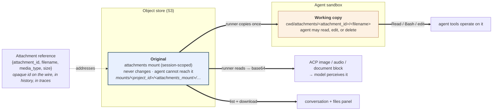
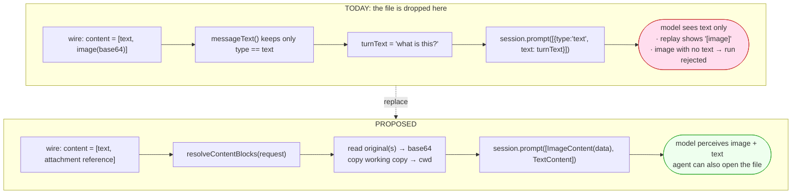
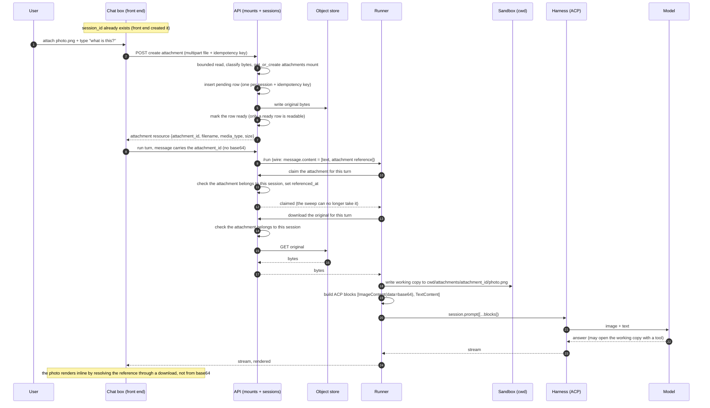
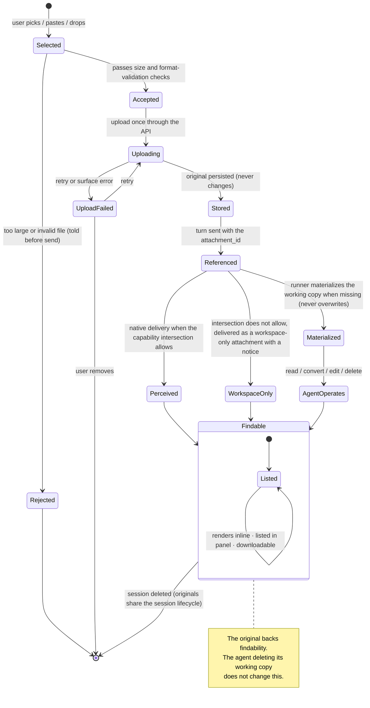
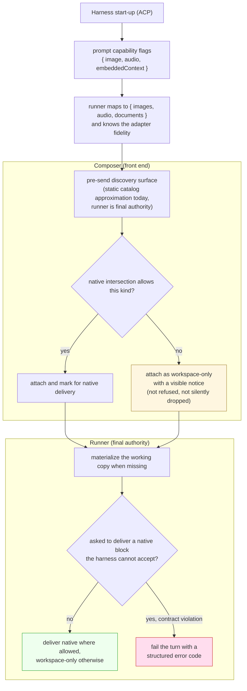
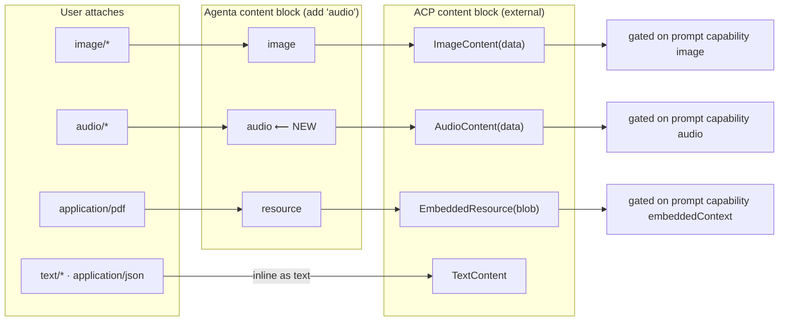
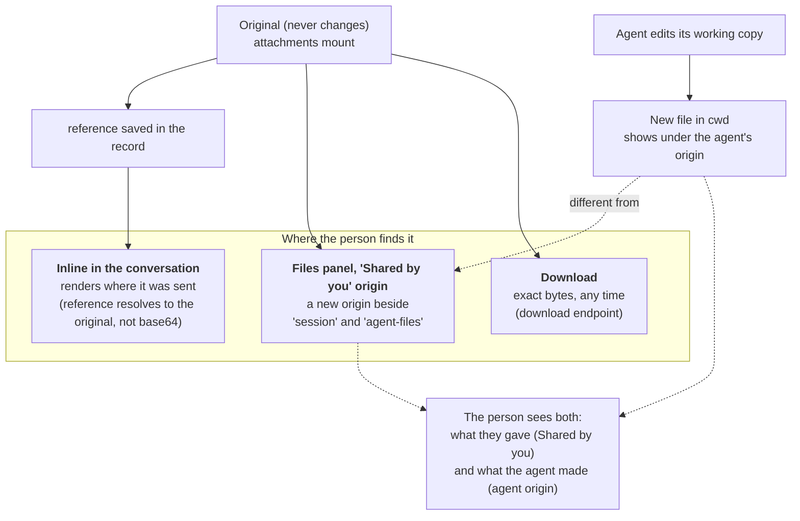
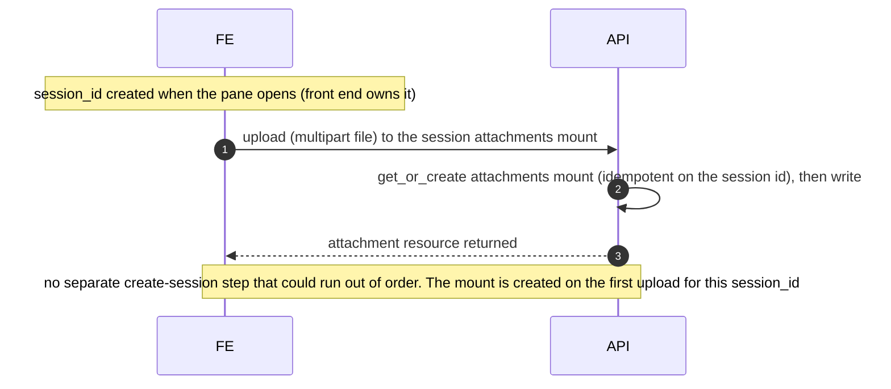

# Design

This file presents the design as a set of decisions. It explains the major choices in full: for each
it lists the options, says what breaks under each, gives the decision, and explains why. The
complete compact log D1 through D14 lives in [decisions.md](decisions.md); D2 and D8 are small enough
that they are stated inline where they arise. This file keeps every interaction diagram, and each
diagram is explained in words before it is shown. Read [research.md](research.md) first for the facts
these decisions rest on. Each decision carries the same D-number here and in the compact log in
[decisions.md](decisions.md), so the two files never disagree about which decision is which.

## The idea in one paragraph

Stop sending file bytes on the wire. When a person attaches a file, the front end uploads it once
through the API's session-mount upload route. The API stores the bytes and returns an **attachment
resource**: a small record it owns, with a server-issued `attachment_id`, the filename, the
media type the server verified, and the size. The message then carries only that `attachment_id`
plus a little display metadata, never the bytes and never raw storage coordinates. Behind that id
the system keeps two copies. One is the **original**, which never changes and which the agent
cannot reach. It is the source of truth for what the model reads, what the files panel lists, and
what a download returns. The other is a **working copy** that the runner writes into the agent's
working directory so the agent's tools can open, convert, or edit it. At the moment the runner
builds a turn, it resolves the `attachment_id` through the API, reads the original, turns it into
the right inline content block, and hands that to the harness in place of the single text block
that is hard-coded today.

## Where the original and the working copy live

The design puts the original in a storage mount that is deliberately not made visible to the agent,
and the working copy in the agent's normal working directory. The reference on the wire points at
the original.

Read the diagram this way. The `attachment_id` travels on the wire, in the saved history, and in
the traces. It names the attachment resource the API owns; only the API knows which object in the
store that resource points at. From the original, three things happen: the runner reads it to build
the model's content block, the runner copies it into the working directory for the agent's tools,
and the files panel lists and downloads it. The working copy is separate and disposable. Note that
the storage key shown as `mounts/<project_id>/<attachments_mount>/...` uses `<project_id>` only as
the tenant partition of the object key. It does not mean the original lives in a "project mount."
There is no project-scoped mount kind; the attachments mount is scoped to the session.

The reference on the wire is an opaque, server-issued id, not the file's storage coordinates. This
is deliberate. If the wire carried the raw storage location and the client's own media type, then a
client could forge a reference to another session's file by naming its coordinates, and the client's
media type would be authoritative even though a client can lie about it. An opaque id avoids both
problems. The storage location stays private to the API, the server verifies the media type on
upload, and the id makes one authorization check natural: does this attachment belong to the
session being run. The full options are in decision D10.

---

## Decision D1: how the file reaches the model

**The question.** How does the file's content actually reach the model so the model perceives it?

**Options.**

- **A. Inline content blocks.** The runner reads the file and puts its bytes into an ACP image,
  audio, or document block in the turn.
- **B. File on disk plus a path in the prompt.** The runner writes the file into the working
  directory and the prompt text mentions the path, trusting the harness to read it.
- **C. Both, for different purposes.** Deliver native modalities inline for perception, and also
  place the file on disk for tool use.

**What breaks under each.** Option B leaves perception to the agent's discretion and makes it
uneven across harnesses. The harnesses' own read tools can deliver a file natively when called
(Claude Code reads images and PDFs as real vision and document input; Pi and Codex read images;
none reads audio; see [research.md](research.md), sections 4 and 5), but ACP has no content type
that hands the model a link and guarantees the model reads it, so nothing forces that call to
happen, and a turn rebuilt from records never repeats it. So with B alone, a person who shares an
image and asks "what is this?" can still get an answer that ignores the image. Option A alone leaves the agent unable to run a tool over the file,
because the file never lands on disk. For audio there is no disk-read fallback at all, so B cannot
serve audio.

**Decision.** Option C. Deliver native modalities inline so the model perceives them, and also
materialize a working copy on disk so the agent's tools can work on the file. The two are not
redundant; they serve the two separate goals of perception and tool use.

**Why inline is unavoidable for perception (decision D2 in the log).** In ACP the bytes for an
image, audio clip, or embedded document are required and inline. Storing the file in our object
store keeps the bytes out of the durable records the runner replays on a cold start, but it does
not remove the requirement that the bytes be present at the moment the runner builds the turn. The
runner reconstructs the inline block per turn from the stored original.

---

## The one runner call that changes

The whole model-facing change is one place in the runner: the call that hands a turn to the harness.

Today that call sends a single text block. The proposed version resolves the message's references,
reads the originals, materializes working copies, and sends a list of real content blocks. Read the
before-and-after this way: on the left, the runner flattens the message to its text and sends only
that, so the model sees text and a replayed image shows up as the string "[image]"; on the right,
the runner turns each reference into the matching content block and sends the whole list, so the
model perceives the image and the agent can also open the file.

---

## Decision D3: where the original lives

**The question.** Where do we store the unchanging original of a shared file?

**Options.**

- **A. A folder inside the working-directory mount, for example `cwd/_uploads/`.**
- **B. The agent-files mount** (the durable, cross-session agent mount).
- **C. A dedicated session-scoped attachments mount that is not made visible to the agent.**
- **D. A future project-level drive.**

**What breaks under each.** The working directory is last-writer-wins and fully under the agent's
control (see [research.md](research.md), section 2). Concretely, under option A the following breaks
the findability goal: a person shares `report.pdf`, then asks the agent to "clean up the workspace,"
and the agent runs `rm -rf _uploads` or a cleanup script, or simply overwrites `report.pdf` with a
derived version. Now the original the person shared is gone, and "always findable" is false. Even
without malice, an agent that reorganizes its files can move or replace the original. Option B avoids
the deletion problem only if agent-files is also kept out of the agent's reach, but agent-files
exists precisely to be visible and writable by the agent across sessions, so using it would either
change its meaning or expose the original to the same last-writer-wins risk. Its cross-session
lifecycle is also wrong for a per-session attachment. Option D does not exist yet and would couple
this feature to unshipped work; a project drive is also the wrong scope, since an attachment belongs
to one conversation.

**Decision.** Option C. A dedicated attachments mount, scoped to the session, that is created with
the existing `get_or_create_session_mount(session_id, name="attachments")` machinery but is
deliberately never added to the set of mounts made visible in the sandbox. It is also protected
against our own generic mount routes: it appears in no mount listing, cannot be signed, edited, or
archived on its own, and is removed only when the session is torn down (decision D7). The runner
reads an original through the session-bound API download route, never with signed credentials:
decision D7 rules that no signed credentials are ever issued for the attachments mount, because any
signed credential is read-write today. Reading the object store directly with a read-only credential
scope is the deferred Stage 3 hardening (decision D7 and [plan.md](plan.md), Stage 3).

**Why its own mount rather than a subfolder.** The technology that makes a mount visible to the
agent (geesefs) exposes the whole mount prefix as a writable folder. There is no way to expose part
of a mount and hide the rest. So "the agent cannot reach the original" forces the original into a
prefix that is not exposed at all, which means its own mount. The attachments mount reuses the
mount machinery (create, upload, download, list) and differs from the other mounts in two ways: it
is left off the sandbox's visible set, and it is never signed (decision D7).

**Why lifecycle alone does not decide the location.** On lifecycle alone, an attachment is session-scoped, exactly like
the working directory, so a subfolder inside `cwd` would have been the simplest choice. The
findability requirement, not the lifecycle, is what pushes the original out of the agent's reach and
therefore into its own mount.

---

## Decision D4: one copy or two

**The question.** Should there be a single copy of the file that the agent both perceives and edits,
or two copies with different rules?

**Options.**

- **A. One copy.** The file lives in one place. The agent reads and edits it there. Findability and
  editing share the same object.
- **B. Two copies.** An unchanging original plus a disposable working copy.

**What breaks under A.** If there is one copy and the agent edits it, the person can no longer find
what they originally shared. If there is one copy and it is read-only, the agent cannot edit it,
which breaks the "agent can work on it" goal. A single copy cannot satisfy both goals at once,
because the two goals want opposite things from the same object. The agent is not even the only
writer in the working directory: the harness itself can mutate a file there (Claude Code's Read
tool has an open report of overwriting the original image it read,
[claude-code #77729](https://github.com/anthropics/claude-code/issues/77729)), which independently
supports keeping the original out of the sandbox.

**Decision.** Option B, two copies. The original never changes and backs findability, download, and
model perception. The working copy is what the agent touches. When the agent edits its working copy,
the result is a new file the agent produces, which shows up under the agent's own origin in the files
panel, while the original stays under "Shared by you." The person then sees both the input they gave
and the output the agent made, which is more useful than having the original silently replaced.

**Why not make it a policy switch.** A read-only-versus-read-write policy on a single copy cannot
satisfy both requirements at once, because findability wants the file safe and tool use wants it
editable. Two copies dissolve the question. There is no global read-only-versus-read-write policy.
The original is always safe; the agent can always do anything it likes to its copy; and whether the
agent changes the file at all is just what the conversation calls for, decided per conversation
rather than by a platform setting.

### The working-copy path and edited copies

The working copy lives at `cwd/attachments/<attachment_id>/<filename>`. The `attachment_id` segment
is what keeps two files from colliding. Two people can each share a file named `report.pdf` in the
same session, and because each one sits under its own id-named folder, neither overwrites the other.

Re-materialization has one rule: the runner restores a working copy only when the file is missing.
It never overwrites a working copy that is already there, because the agent may have edited it and
that edit is real work. So if a later turn arrives and the working copy is present, the runner
leaves it alone. If the working copy was deleted, the runner writes it again from the original. On
a cold start, the runner additionally sweeps the session's records and restores every referenced
working copy that is missing, so every path the rebuilt conversation mentions exists (decision
D12); the same never-overwrite rule applies to the sweep.

This creates a divergence that the design accepts on purpose. When a later turn references the same
attachment natively, the runner always reads the **original** to build the model's content block,
while the agent's tools continue to see the **edited** working copy. So the model perceives the file
as it was shared, and the tools operate on the file as the agent has changed it. That is the
intended behavior: the original is the immutable source of truth for perception, and the working
copy is the mutable scratch object for tools.

---

## The successful upload and delivery flow, end to end

Here is the full path for the common case: a person attaches a photo and asks a question, on a warm
turn. Read it as: the session already has an id, so there is no "create the session first" step; the
front end uploads the photo once through the API's attachment create route, and the API stores the
bytes and hands back an attachment resource; the front end sends a message that carries the
`attachment_id` instead of the bytes; the runner claims the attachment for the turn so the cleanup
sweep can no longer take it, reads the original through the API download route, writes a working copy
into the agent's directory, builds the real content blocks, and calls the harness; the model
perceives the image and the agent can also open the file; and the front end renders the photo inline
by resolving the reference, not from a giant inline blob.

The front end never touches the object store directly and never holds write credentials for the
attachments mount. The upload route is the only way bytes enter, which is what decision D7 relies on.

The one change that makes the model perceive the image is at the "build ACP blocks" and
"session.prompt" steps. The working-copy write happens once per file per session, because the working
directory survives across turns, so later turns skip it.

---

## The lifecycle of one attachment

An attachment moves through a few clear states. Read the state machine as: the person picks a file;
it is rejected up front only when it is too large or an invalid file, and an unsupported kind is not
rejected but accepted as a workspace-only attachment with a notice; an accepted file is uploaded
once, after which the original is stored and unchanging; when a turn is sent, the `attachment_id`
goes with it; the runner materializes the working copy when it is missing (it never overwrites one
that is already there, because the agent may have edited it), and delivers the bytes to the model
only when the capability intersection allows; and from there the attachment is a durable, findable record
whose findability does not depend on what the agent does to its working copy.

---

## The media-type, validation, and limits matrix

This section settles the former open question on media types, validation, and limits. The rules are
engineering defaults derived from the shipped client limits, the gateway ceiling, and the providers'
inline caps, so they are recorded under "Settled by evidence" in [decisions.md](decisions.md) rather
than as a product decision. The upload route enforces the matrix server-side; the shipped client
limits (`DEFAULT_ATTACHMENT_LIMITS` in
`web/oss/src/components/AgentChatSlice/assets/attachments.ts`, lines 49 to 59, verified 2026-07-31)
stay as they are and become the courtesy layer a client can bypass but the server does not.

### How the server classifies a file

The server inspects the file's leading bytes (magic bytes) and stores the type it verified, per
decision D10. The declared type is display metadata at most; it never decides anything.

- Bytes that match a known signature are stored under the inspected type. When the inspected type
  differs from the declared one, the inspected type wins silently: the upload succeeds and the
  attachment resource carries the verified type. The declared type is never trusted.
- Bytes with no known signature that decode as UTF-8 text are stored as text. The declared type is
  kept when it is a `text/*` subtype or `application/json`, because bytes cannot distinguish
  Markdown from CSV; otherwise the stored type is `text/plain`.
- Bytes with no known signature that are not valid text, and empty files, are rejected at upload
  with a structured error. This is the "invalid file" rejection in the lifecycle above, and it is
  the only content-based rejection. A recognized type that is not a native kind is never rejected
  (decision D6); it is stored and attached workspace-only.

### The matrix

Size caps apply to the raw file at upload; base64 inflation matters only at delivery, because the
upload is a multipart request, not base64. The count cap applies across all kinds, and the runner
enforces it over the current user turn, before it downloads anything: each upload is its own request,
so the create route cannot count a turn. The number is runner configuration, not API configuration,
and the composer's shipped cap is the courtesy layer in front of it. The per-kind caps mirror the
shipped client caps (`attachments.ts`, lines 49 to 59).

| Kind (by inspected type) | Accepted formats | Per-file cap | Per-turn count | At upload | At delivery |
| --- | --- | --- | --- | --- | --- |
| image | PNG, JPEG, GIF, WebP | 10 MB | 100 across all kinds | over the cap: rejected with a structured error | native when the D5 intersection allows; workspace-only with the D6 notice when the original exceeds a provider inline cap (rule below) |
| audio | recognized audio containers (WAV, MP3, OGG, WebM, FLAC, M4A) | 15 MB | shared 100 | same | always workspace-only in the first release (decision D14); native ACP audio is the last upgrade |
| document | PDF; text (`text/*`); JSON | 10 MB | shared 100 | same | workspace-only today (native documents are the Stage 2 adapter blocker); small text can inline as text |
| other (recognized, not a native kind) | any other recognized type (archives, office formats, video, and so on) | 10 MB | shared 100 | same | always workspace-only with the D6 notice |
| unrecognizable | no known signature and not valid text | none stored | none | rejected as an invalid file | never stored |

The per-turn count is not the only bound. Each session also has a quota the create route enforces:
1,000 stored attachments, 256 MB of stored originals, and at most 20 uploads in flight at once. A
per-turn count bounds a polite client and not a hostile one, and a cold start restores every
referenced working copy (decision D12), so an unbounded session costs stored bytes nobody asked for
and turns the runner into an amplifier on every cold start. The session, not the single turn, is
where the real bound belongs; the per-turn count only shapes one prompt.

One shipped behavior changes to match this matrix: the composer today rejects an unknown kind
outright ("isn't a supported file type", `attachments.ts`, line 131). Under decision D6 an
unsupported kind is accepted workspace-only with a notice, so Stage 1 replaces that client-side
rejection with the notice. The recognized-format list for the "other" row is whatever the
server's magic-bytes library recognizes; widening it is cheap and needs no design change.

### The gateway ceiling

Stage 1 raises the compose gateway request-body cap from 10 MB to 32 MB: `client_max_body_size 10M`
becomes `32m` in `hosting/docker-compose/oss/nginx/nginx.conf` (line 35, verified 2026-07-31). That
file is the only nginx config in the compose stack: the OSS gh compose files mount it behind the
`with-nginx` profile (`docker-compose.gh.yml`, `docker-compose.gh.local.yml`), and the dev stacks
and the EE compose files run no nginx of their own. The railway gateway already allows 32 MB
(`client_max_body_size 32m` in `hosting/railway/oss/gateway/nginx.conf`, line 23, verified
2026-07-31).

The ceiling is infrastructure, not policy: the upload route's per-kind caps are the enforced truth.
Each upload carries one file, so the ceiling binds per file, and every per-kind cap (15 MB at most)
clears 32 MB with room for multipart overhead. The old 10 MB ceiling is what made the shipped 15 MB
audio cap impossible to use; raising the ceiling resolves that in favor of the per-kind caps.

The ceiling is also not everywhere, which is why the route cannot lean on it. It exists only behind
the `with-nginx` profile, and an EE deployment has no body cap in front of the API at all. So the
create route bounds its own read: it consumes the request body in chunks, stops at the largest
per-kind cap plus one byte, and refuses what is over, all before it classifies anything. Reading the
whole body first and checking its size afterwards would make an arbitrary upload an API memory cost
on every deployment that runs no gateway; with the bounded read, a missing ceiling costs one byte of
over-read.

### Provider inline caps at delivery

The runner rebuilds inline blocks from stored originals (decision D2), so an accepted upload can
still exceed what a provider takes inline. The current numbers, all verified 2026-07-31:

- **Anthropic Messages API, images.** 10 MB per image, measured on the base64-encoded data, on the
  Claude API directly; 5 MB base64 on Amazon Bedrock and Google Cloud. Maximum dimensions 8000x8000
  px, with a stricter limit near 2000 px per side when a request carries more than 20 images. 100
  images per request on 200k-context models, 600 otherwise. Formats: JPEG, PNG, GIF, WebP. Whole
  request capped at 32 MB.
  [Anthropic vision docs](https://platform.claude.com/docs/en/build-with-claude/vision).
- **Anthropic Messages API, PDF.** 32 MB maximum request size; 600 pages per request, dropping to
  100 pages when the request's context window is under 1M tokens; standard unencrypted PDF.
  [Anthropic PDF support docs](https://platform.claude.com/docs/en/build-with-claude/pdf-support).
- **OpenAI vision.** 512 MB total payload per request and 1500 image inputs per request, with no
  documented per-image cap. Formats: PNG, JPEG, WebP, non-animated GIF.
  [OpenAI images and vision guide](https://developers.openai.com/api/docs/guides/images-vision).
- **Gemini.** Inline data shares a 20 MB total request budget (text plus bytes); larger files go
  through the Files API. Up to 3,600 images per request. Formats: PNG, JPEG, WebP, HEIC, HEIF.
  [Gemini image understanding](https://ai.google.dev/gemini-api/docs/image-understanding).

The 5-per-turn count sits far under every provider count cap, so count never binds at delivery.

### The delivery rule for oversized originals

When a stored original passes the upload caps but exceeds a constraint of the provider actually
selected (per-image bytes after base64 inflation, the request budget, or dimensions), the runner
does not fail the turn and does not resize. It attaches the file workspace-only with the D6 notice,
exactly as it does for a kind the model cannot perceive. Concretely on Claude: base64 inflates by
about a third, so an accepted image over roughly 7.5 MB raw exceeds the 10 MB base64 per-image cap
and goes workspace-only; the agent can still read it from disk (and on Claude the Read tool
delivers it as real vision input, [research.md](research.md), section 4). Runner-side downscaling
to fit a provider cap is a possible later refinement, listed in [scope.md](scope.md) follow-ups; it
is machinery this release does not build.

### Sanity check

Every per-file cap sits under the 32 MB gateway ceiling. The shipped caps stay as shipped (10 MB
images, 15 MB audio, 10 MB documents): no provider cap forces them down, because the delivery
boundary is handled by the workspace-only rule above, not by shrinking uploads.

---

## Decision D5: the layered capability model

**The question.** How does the system know whether a given modality will actually reach the model?

**The layered answer.** Whether a modality is perceived natively is the intersection of three
layers. All three must allow it, and the effective capability is the weakest of the three:

1. **What the ACP transport supports.** The prompt capability flag (`image`, `audio`,
   `embeddedContext`) that the adapter advertises. Without the flag the content type cannot even be
   carried across the protocol.
2. **What the harness adapter actually delivers natively.** Adapter fidelity. A flag can be
   advertised while the delivery is lossy or dropped. This is where the two adapters we run diverge
   sharply (see [research.md](research.md), section 4): both pass an image through as a real image,
   but the Claude adapter drops a blob resource entirely and the Pi adapter renders it as a byte
   count. So a document can clear the transport layer and still never reach the model.
3. **What the selected model perceives.** Model modalities, carried on the run request by the
   resolved connection, which is where the model and its provider are already settled. A non-vision
   model does not see an image even when the transport and the adapter would carry it. This layer
   has a defined default: when the request carries no modalities, or none we recognize, the layer
   reads unknown, and unknown means workspace-only with the D6 notice. Silence never means vision,
   because an assumed capability fails the way the current bug fails, silently.

Tool use over the file is a separate, fourth consideration, not part of this intersection. It needs
only the working copy on disk and works regardless of all three layers above. An agent whose model
cannot see an image can still run a program over the image bytes. This is why the design places the
file on disk for every attachment, independent of native perception.

**Decision on gating (D5).** Compute the intersection and gate in two places. The composer gates for
the person's benefit, so the person learns before sending whether a file will be perceived. The
runner gates as the final authority, because the composer's view can be stale. Both are needed; the
composer gate is a courtesy and the runner gate is the truth.

Here is the layered capability, per modality, as it stands today.

| Modality | ACP transport (prompt capability) | Adapter fidelity today | Model modalities | Tool use over the working copy |
| --- | --- | --- | --- | --- |
| Image | `image`, advertised by both adapters | native image on both adapters | needs a vision model | always available |
| Audio | `audio`, advertised by neither adapter | no native audio path on either adapter | needs an audio model | always available |
| Document (PDF and similar) | `embeddedContext`, off by default on Pi | Claude drops the blob, Pi renders a byte count | depends on the model and the format | always available |

The perception columns describe the guaranteed inline path only; on Claude, the working copy alone
already yields image and PDF perception through the harness's Read tool when the agent chooses to
read it (see [research.md](research.md), section 4). For audio, the first release sidesteps the
native path entirely: the composer's browser dictation turns live speech into text, and a recorded
clip is a workspace-only attachment with the D6 notice (decision D14).

### Two integration gaps to close

Two facts about the current code mean the layered model needs plumbing that does not exist yet, and
these are stated as work, not as afterthoughts.

- **Capabilities are surfaced only after a run.** Today the runner returns its capabilities in the
  run response, after a run has happened (`protocol.ts`, near line 539). The composer has no way to
  discover them before the person sends anything. So the composer needs a pre-send discovery
  surface. A static approximation derived from the model and harness catalog is acceptable for the
  first release, with the runner remaining the final authority at prompt-build time.
- **The delivery outcome has nothing to travel on.** Today the run error field is a plain string
  (`error?: string`, `protocol.ts`, near line 557), and a per-attachment outcome has no carrier at
  all. So the runner emits an `attachment_delivery` event for every attachment in the turn, carrying
  the attachment id, the outcome (native, workspace-only, or failed), a stable reason code, and the
  working-copy path. The event is persisted with the session's records, parsed by the SDK in
  `wire.py` beside the run result, and carried to the browser on the Vercel stream as a data part, so
  the front end renders the D6 notice from what actually happened and the notice comes back on a
  reload. A single error code on the terminal result would not do the job: it says nothing when the
  turn succeeded and one attachment was flattened, and it cannot name which of three files that was.

### Renaming capability fields without a simultaneous deploy

The internal capability flags need new names (`images`, `audio`, `documents`) and the old ones
(`fileAttachments`, `file_attachments`) need to retire. Do **not** do this as a rename that must land
in every component at the same time. The front end, the API, the SDK, and the runner deploy
independently, so a rename that lands
in one component before another breaks the versions in between. Instead, introduce the new fields
alongside the old ones, keep the old names accepted as aliases through the rollout, and remove the
old names later once every component speaks the new ones. The removal timing follows the alias
rollout's settle condition in [plan.md](plan.md), Stage 2.

---

## Decision D6: what does attaching a file promise, and what happens on an unsupported kind

**The question.** When a person attaches a file the model cannot perceive, what should happen?
Failing the turn on every unsupported kind would contradict the tool-use goal: an agent can still
process a file its model cannot perceive natively. The resolution is to separate the two meanings of
attach.

**The resolution: separate the two meanings of attach.** "Attach" means two different things, and
untangling them removes the contradiction:

- **Show this to the model.** Deliver the file as a native content block the model perceives.
- **Put this file in the agent's workspace.** Materialize it on disk so the agent's tools can open
  it.

**The design's answer.** Attaching a file **always** puts it in the workspace (it is materialized
for tools). Native delivery to the model happens **when the capability intersection from D5 allows
it**. When the intersection does not allow it, the composer says so up front, and the turn still
proceeds with the file as a workspace-only attachment. That is a visible notice to the person, not a
silent drop and not a failed turn. The runner fails the turn only when it is explicitly asked to
deliver a native block the harness cannot accept, which is a contract violation rather than an
ordinary unsupported kind (for example, a stale front end that asks for native audio the adapter
never advertised). So a silent drop never happens, and a hard failure happens only on a real
protocol contract violation.

**The fuller model, and the first-release simplification.** The richer version of this would attach
a per-attachment intent to each file: *perception required* (fail if the model cannot perceive it),
*perception preferred* (deliver natively when possible, otherwise workspace-only), or *workspace-only*
(never try native delivery). The first release does not build that per-attachment control. It treats
every native kind as *preferred* and offers no per-attachment toggle in the UI. This is the simpler
model that still avoids both the silent drop and the surprise failure.

**What the first release promises is decided.** The first release promises durable agent input:
the workspace copy, findability, and records, not image perception alone. That is decision D11,
taken by the product owner on 2026-07-31 and laid out below.

Read the gating diagram as: the harness advertises capabilities at start-up; the runner maps them
and also knows the adapter fidelity; a pre-send discovery surface gives the composer an
approximation; the composer attaches every file, delivering natively where the intersection allows
and attaching workspace-only with a visible notice where it does not; and the runner, as final
authority, materializes the working copy when it is missing (never overwriting an edited one) and
fails the turn only when asked to deliver a native block the harness cannot accept.

Note the three distinct capabilities: an image maps to `image`, audio maps to `audio`, but a PDF or
document maps to `embeddedContext`, a different flag. Do not treat "supports images" as "supports
documents."

---

## Decision D11: what does attaching a file promise in the first release?

**The question.** What does the first release promise a person who attaches a file? The engineering
design supports either answer; the choice is about what to promise first.

**Options.**

- **A. Image perception only.** The first release lets the model see images, with strict size and
  count limits and no durability promise. The file is not guaranteed to remain findable after the
  turn. This is the smallest honest fix for the original bug.
- **B. Durable agent input.** The first release delivers the full model here: an original that
  never changes, rendered inline in the conversation and downloadable at any time (the
  Files-drawer listing follows in Stage 3); a working copy for the agent's tools; and a reference
  stored in the records. Attaching a file always puts it in the workspace and delivers it natively
  when the capability intersection allows.

**What breaks under A.** The three outcomes in [context.md](context.md) do not hold: the file is
not findable and the agent's tools cannot rely on it. And the durability that A skips is not a free
deferral: adopting durable references later is a system-wide change (decision D9), so A ships a
version that needs rework.

**Decision.** Option B, durable agent input, from day one, with the workspace-always plus
native-when-possible semantics described in D6. The product owner chose the full reference-based
design for the first release on 2026-07-31; no inline-only version will be built.

---

## Decision D13: two upload surfaces, deliberately different pipelines

**The question.** The product has two places a person can hand over a file: the Files drawer (the
drive view over the session's mounts) and the chat composer. Do both go through the attachment
pipeline?

**Options.**

- **A. Route everything through attachments.** Every upload, from the drawer or the composer,
  creates an attachment resource with an immutable original and an opaque reference.
- **B. Split by surface.** A file dragged into the Files drawer (or one of its folders) uploads
  directly to that mount at that path, the existing drive-upload flow. The attachment pipeline
  applies only to files shared through the chat composer, whether typed, pasted, dropped, or picked
  there.

**What breaks under A.** A drawer drop is the person saying "put this file there." Routing it
through attachments gives that plain folder write the wrong semantics: the file would become an
immutable, session-scoped original addressed by an opaque id, when the person asked for an ordinary
file at a path they chose, editable and deletable like its neighbors. It would also replace a flow
that already exists and works: the drive-upload surfaces (the upload button, drop-to-upload in the
Files drawer, drop-to-stage on a recents peek) merged in PR #5459 behind
`NEXT_PUBLIC_AGENT_FILE_UPLOADS`.

**Decision.** Option B. The two surfaces express two different intents: "put this file there"
versus "share this with the agent in the conversation." The drawer keeps the direct drive-upload
flow; the attachment pipeline (attachment resource, immutable original, opaque reference) covers
only files shared through the composer.

---

## Decision D7: enforcing that the original does not change

**The question.** The original must not change. What actually enforces that?

**Options.**

- **A. Keep the mount out of the sandbox.** The agent never sees it, so the agent cannot change it.
- **B. Also treat the mount as protected: every generic mount operation behaves as though it does
  not exist, no signed credentials are ever issued for it, and the create route is the only writer.**
- **C. Also add a read-only credential scope so the runner could read the object store directly and
  even a leaked credential could not write.**

**What each gives.** Option A stops the agent, which is the main threat, but it does not stop a bug
elsewhere in our own code that holds credentials. Option B closes the credential path. Recall from
[research.md](research.md), section 2, that any signed credential is read-write today: the signing
call has no read-only variant, so signing a mount at all hands out write access. So immutability
cannot rest on signed credentials. Recall too that `write_file` overwrites silently, so create-only
is not something the storage layer gives for free. Option B is therefore broader than one refusal.
The attachments mount is classified as protected, and every generic mount operation behaves as though
it does not exist: query, fetch, list, read, download, export, edit, archive, unarchive, write,
folder-create, upload, delete, and sign all answer the way they answer for a mount that is not there.
The classification is a server-owned `purpose` field on the mount, set when the create route makes it
and absent from the edit model, so it is a property of the row rather than a naming convention
someone can imitate or rename. The single writer is the create route, which reaches storage through
one narrow operation that opts out of the policy. Session teardown keeps seeing the mount, because it
owns the lifecycle (see [decisions.md](decisions.md), "Settled by evidence"). Guarding only the
writes would leave the reads open: a project member could otherwise list the mount, read an original
by path, or export it, and so bypass the session-binding check that the download route exists to
make. The refusal to overwrite stays an explicit API-level check, not an assumption, precisely
because the storage layer would otherwise overwrite without complaint. Option C is the strongest and is also the path that would later let the runner read the object store
directly, but it needs a read-only variant added to the signing call, which does not exist today.

**Decision.** Start with A and B together. Originals enter only through the create-only upload route,
which is the only writer that the protected-mount policy lets through. Every other mount operation,
by id or by listing, answers as though the mount is not there, and the classification lives in the
mount's server-owned `purpose` field. The API refuses overwrite and delete for attachment originals,
enforced as an explicit check because `write_file` overwrites silently today. No signed credentials
are ever issued for the attachments mount, because today any signed credential is read-write. A
read-only credential scope is the later hardening that would let the runner read the object store
directly; it is noted in
[plan.md](plan.md). Together A and B give real, enforced immutability for the case that matters,
without blocking on the signing change.

---

## Modality to content block mapping

This shows how each kind of attachment becomes a content block on each side. Read it as: the person's
file has a media type; our front end and SDK turn it into an Agenta content block; and the runner
turns that into the matching ACP block that the harness understands. Small text does not need to be a
resource at all; it can be inlined as text, which every harness supports. Audio stays a product goal
(decision D8 in the log), and its target remains the `audio` block on our side mapped to the ACP
`AudioContent` block, but that native path is the last upgrade: in the first release the only
audio-to-text is the composer's browser dictation, a recorded clip travels as a normal attachment on
the D6 workspace-only path, and server-side transcription is the deferred middle step (decision D14,
below). The diagram shows the target shape. Neither pinned adapter
delivers native audio or native documents today (see [research.md](research.md), section 4), so the
audio and document rows describe where these paths lead once the adapters support them, not what
works right now.

A hard caution carried from [research.md](research.md), section 4: the document path in this diagram
does not work today. The Claude adapter drops a blob resource entirely, and the Pi adapter renders
it as a byte count, so a PDF sent as an embedded resource reaches neither model as a document. The
diagram shows the intended shape, and the document stage is blocked on adapter work (either
adapter-native document handling, or a decision to deliver documents as extracted text). Images map
cleanly and work end to end. Audio has no native path on either adapter yet, so its row is likewise
a target, not a working path; what the first release does for audio is decision D14, below.

---

## Decision D14: first-release audio is browser dictation only

**The question.** Audio is a product goal (D8) and the voice-capture UI is already built and merged
dark (PR #5458). But native audio delivery is infeasible today at two independent layers: no adapter
advertises the ACP `audio` capability, and the Anthropic Messages API has no audio input block at
all ([research.md](research.md), section 4). What does the first release do with speech and audio
files?

**Options.**

- **A. Browser dictation only.** The composer's dictation mode (the Web Speech API in
  `web/oss/src/components/AgentChatSlice/hooks/useVoiceInput.ts`, merged dark in PR #5458) turns
  live speech into text in the composer while the person talks. No audio file is involved. Recorded
  voice messages and uploaded audio files get no transcription and follow the D6 workspace-only
  path.
- **B. Transcription through the person's stored provider keys.** The API transcribes the recording
  through litellm's `/audio/transcriptions` support with a key the person already stored, and the
  transcript reaches the model inline as text.
- **C. Transcription on an Agenta platform key.** The same call path as B, but Agenta supplies the
  key and meters the usage, so it works for people with no stored key.
- **D. Transcription in the services layer.** A whisper model Agenta runs (for example
  faster-whisper) transcribes the working copy, with no external provider involved.

**Decision.** Option A, and that is all for the first release. Live dictation is the only
audio-to-text: speech becomes text in the composer as the person talks, and nothing new is built.
A recorded voice message or an uploaded audio file uploads as a normal attachment through the whole
D11 pipeline (immutable original, workspace copy, referenced in the records) and follows the D6
workspace-only path: the composer shows the visible notice that the model will not hear it, and the
agent's tools can still process the file on disk. Options B, C, and D are deferred together, out of
scope for the first release: no transcription endpoint, no key resolver, no platform key, no
metering. The survey behind that deferred decision, including why B and C share one litellm call
path Agenta already runs, is recorded in [research.md](research.md), section 4 ("Server-side
transcription, surveyed and deferred"). Native ACP audio delivery remains the last upgrade; the
modality mapping above keeps `AudioContent` as its target.

**Why.** The recorded-audio limit is structural, not a postponement of easy work: the Web Speech
API transcribes only a live microphone stream, so the browser cannot transcribe a recorded blob
(Chrome 139 can replay a blob through recognition, but only in Chrome, only at real-time speed, and
it produces no server-side transcript; [research.md](research.md), section 4). Crossing that line
means a server-side service with key resolution and metering, and the decision is to add none of
that machinery now. Dictation covers everyday speech-to-text with zero new build, and the D6 notice
keeps recorded audio honest instead of silently unheard. The accepted cost is that a recorded clip
reaches the model neither as sound nor as words until server-side transcription ships; the agent's
tools remain the only way to work on it.

---

## Where the person finds a shared file

Findability shows up in three places, all backed by the unchanging original. Read the diagram as: the
original backs a reference saved in the conversation record; that record renders the file inline where
it was sent; the same original is listed in the files panel under a new "Shared by you" origin and can
be downloaded as exact bytes; and separately, when the agent edits its working copy, that produces a
new file under the agent's own origin, so the person sees both what they gave and what the agent made.
Of these surfaces, the inline render in the conversation and the download are part of the first
release; the Files-drawer listing under "Shared by you" is Stage 3 work.

---

## Why the first upload can safely create the mount

A person might attach a file before the very first message, so there is a fair question about whether
the attachments mount exists yet. It does, because the front end owns the session id before the first
message and the upload route's get-or-create is idempotent. Read the diagram as: the front end
already holds a stable session id when the pane opens; the first upload targets the attachments
mount, and the upload route creates that mount if it is not there yet (an idempotent get-or-create
keyed on the session id); so the mount is ready on the first upload, with no separate "create the
session" step that could run out of order against it.

A file uploaded but never sent leaves an unused stored object. That is a cleanup concern, not an
ordering one, and Stage 1 handles it with two periodic passes over the session's attachments. The
sweep deletes the originals that no claim operation ever marked, once they are older than their
time-to-live; the reaper clears rows that never reached the ready state, along with any object their
interrupted upload had already written. Reference counting against the conversation records is the
later refinement, and it waits on the records carrying references reliably (see
[decisions.md](decisions.md), open questions).

---

## Decision D9: can the inline-only version grow into the full version

**The question.** If we shipped the inline-only version first, could we grow it into this full
design later, or would we have to rebuild?

**The inline-only version.** Deliver the file inline to the model only, with no durable storage: the
runner reads the bytes off the wire and builds the content block, exactly at the same seam. This
fixes model perception and nothing else. It does not fix findability, the working copy, the storage
bloat, or the loss of the attachment on a cold start.

**Does it grow.** Partly, and it is worth being honest about which part. The one seam that both
versions share is the model-facing prompt-builder: both replace the single hard-coded text block
with a resolved list of content blocks at the same call. Shipping the inline-only version first does not
force a rewrite of that seam later. That is the real benefit, and it is a narrow one.

What the inline-only version does **not** save is the rest of the work. Adopting durable references later
is still a system-wide change that touches seven places: front-end persistence (saving a reference
instead of bytes), API storage ownership (the attachment resource, the upload route, the download
route), SDK wire types (the reference form of the content block), runner resolution (turning an id
into bytes), the record schema (a field to hold the reference), authorization (the session-binding
check), and cleanup (removing never-referenced uploads). None of that is avoided by shipping thin
first. So the accurate claim is that the inline-only version avoids rework at the prompt-builder seam, not
that it is a smaller version of a migration that the full version merely extends.

**The one thing not to defer.** The reference-on-the-wire change should not be skipped for long.
The resend of the whole history, whose cost could grow quadratically in the worst case, is already
gone, independently of this design: since the session-storage rework (PR #5560) the front end sends
only the trailing message and the runner rebuilds prior turns from durable records. But the records store only text today, so an inline-only attachment
cannot survive a cold start: either the record schema stores the bytes verbatim, and every cold
start replays them and the log keeps them forever, or the rebuilt conversation loses the file. A
durable reference resolves that, and it also removes the base64 payload from the browser's saved
messages and from the traces. That is why the plan puts the storage and reference work in the
first release.

---

## Decision D10: what the reference contains

**The question.** What actually travels on the wire to name a shared file: its storage location, or
an opaque id?

**Options.**

- **A. Raw storage coordinates.** The reference carries the mount id, the object path, and the
  client's own media type, filename, and size. The runner reads the object at those coordinates.
- **B. An opaque, server-issued id.** The upload returns an attachment resource,
  `{attachment_id, filename, media_type, size}`, where the API owns the storage location and the
  authoritative metadata. The wire and the records carry the `attachment_id` plus display metadata.
  The runner resolves the id through the API, which enforces that the attachment belongs to the
  session being run.

**What breaks under A.** Two things. First, forged references: a client that knows or guesses
another session's storage coordinates can name them and read files that are not its own, because the
coordinates are the authority. Second, lying metadata: the client-supplied media type becomes
authoritative even though a client can send any media type it likes, so the server would trust a
value it never verified.

**Decision.** Option B, the opaque server-issued id. The storage location stays private to the API,
so there is nothing for a client to forge. The server verifies the media type on upload, so the
authoritative metadata is the server's, not the client's. And the id makes the key authorization
check natural to express: does this attachment belong to this session. The runner never sees storage
coordinates at all; it hands the id to the API and gets back bytes only when the binding checks out.

**Reason.** An opaque id is the difference between "trust what the client says about where the file
is and what it is" and "let the server own both." The second is the only one that is safe when the
wire is something a client can write.

---

## Decision D12: what a cold replay delivers

**The question.** On a cold start the runner rebuilds the conversation from the durable records.
How does a historical attachment appear in that rebuilt conversation?

**Options.**

- **A. Re-deliver historical attachments inline, within a size budget.** The rebuilt conversation
  carries a native content block for each past attachment, capped by a count and byte budget so a
  long conversation stays under the provider's per-request limits. Past the budget, a placeholder
  represents the file.
- **B. Mention with the real path, and reserve inline delivery for the current turn.** The rebuilt
  conversation represents each past attachment as a textual mention carrying the real filename and
  the working-copy path (`cwd/attachments/<attachment_id>/<filename>`). At cold start the runner
  re-materializes the working copy of every attachment referenced in the session's records, so
  every mentioned path exists. Inline native delivery happens only for attachments referenced by
  the turn actually being run, the same rule a warm turn follows.

**What breaks under each.** Option A pays the token cost of re-delivering every historical image on
every cold start, a cost that grows with the length of the conversation, and it still needs a
budget against the provider's per-request size and block limits (see [research.md](research.md),
section 3). Past that budget the guarantee disappears anyway, so A guarantees perception only for
the attachments that fit, and the budget numbers become one more thing to pick, measure, and
defend. Option B gives up guaranteed perception of historical attachments: whether the model sees a
past image again depends on the agent choosing to read the mentioned file.

**Decision.** Option B, mention-first. The mention carries the real filename and the real
working-copy path, the cold start restores every referenced working copy so the mentioned paths
exist, and inline native delivery is reserved for the attachments referenced by the turn being run.
The file the person is actively working with stays guaranteed-perceived; the history becomes files
the agent can reach.

**Why.** The harnesses' read tools verifiably deliver an image from disk on all three harnesses,
and a PDF on Claude (see [research.md](research.md), section 4), so a mentioned file is one tool
call away whenever the conversation needs it again. Mention-first removes the recurring token cost
of re-delivering every historical image on every cold start, and it dissolves the budget problem
rather than solving it: nothing inline grows with the length of the history, so there is no budget
to pick. The accepted cost is that historical-image perception becomes agent-discretionary instead
of guaranteed. On Pi, documents lose nothing, because inline PDFs never worked there anyway; the
adapter renders a blob as a byte count (section 4).

**A residual corner, accepted.** Only the cold start sweeps the records and restores working
copies. On a warm turn, a prose-only question that arrives after the agent deleted a working copy
still finds the file missing, because a prose-only turn carries no reference that would trigger the
restore-when-missing rule. This is accepted for now; revisit with evidence if it bites.

---

## Decision log and open questions

The compact decision log (D1 through D14) and the open questions are in
[decisions.md](decisions.md), so they can be updated without editing this design narrative.
