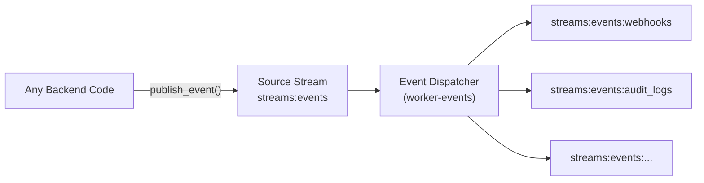
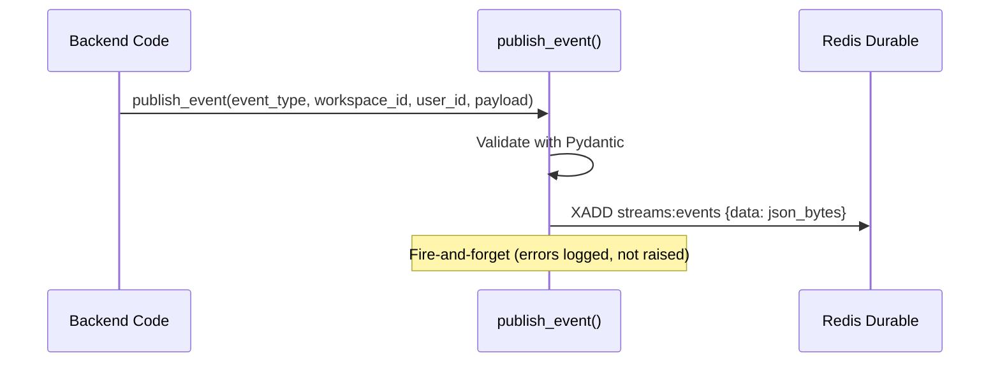
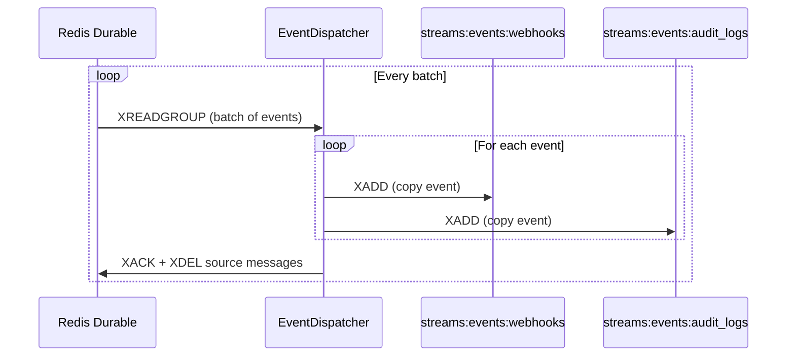
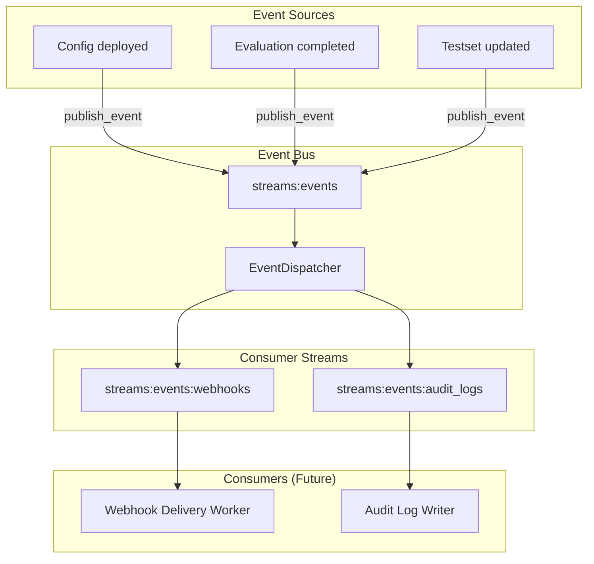

# Event Bus System — Product Requirements Document

## 1. Overview

A generic, feature-agnostic event bus that lets any part of the Agenta backend **publish events** to a central Redis Stream, while an independent **dispatcher process** fans them out to consumer-specific streams. This creates a decoupled foundation for future consumers (webhooks, audit logs, analytics, etc.) without coupling any publisher to any consumer.

### What This System Does



1. **Publishes** structured events to a single durable Redis Stream (`streams:events`)
2. **Dispatches** each event to N consumer-specific target streams
3. **Consumers** (not in scope) independently read from their own target stream

---

## 2. How It Fits Into Existing Infrastructure

### Current Architecture

| Component | Technology | Redis Instance | Pattern |
|---|---|---|---|
| Tracing ingestion | Hand-made asyncio worker | `redis-durable` | `XREADGROUP` on `streams:tracing` |
| Evaluations | TaskIQ `RedisStreamBroker` | `redis-durable` | `queues:evaluations` |
| Webhooks | TaskIQ `RedisStreamBroker` | `redis-durable` | `queues:webhooks` |

### Where Event Bus Slots In

| Layer | Existing Pattern | Event Bus Equivalent |
|---|---|---|
| **Publish** | `trigger.py` — lazy-init globals, `initialize_trigger()` DI | `publish.py` — same pattern, `initialize_publisher()` |
| **Dispatch** | `worker_tracing.py` — hand-made asyncio with `XREADGROUP` | `worker_events.py` — hand-made asyncio dispatcher |
| **Redis** | `redis-durable` (AOF, noeviction) | Same `redis-durable` instance |
| **Docker** | Separate service per worker | New `worker-events` service |

> [!IMPORTANT]  
> The event bus uses the **hand-made asyncio worker pattern** (like `TracingWorker`), NOT TaskIQ. TaskIQ is designed for task queues (one consumer per message), whereas the event bus needs **fan-out** (every message copied to every consumer stream). Raw `XREADGROUP` gives us this control directly.

### Stream Naming Convention

```text
streams:events              ← Source stream (all events published here)
streams:events:webhooks     ← Consumer-specific target stream
streams:events:audit_logs   ← Consumer-specific target stream (future)
streams:events:analytics    ← Consumer-specific target stream (future)
```

This follows the existing `streams:` prefix convention used by `streams:tracing`.

---

## 3. Components

### 3.1 Event Schema

A Pydantic model defining the canonical event structure:

```python
class Event(BaseModel):
    event_type: str          # e.g. "config.deployed", "evaluation.completed"
    workspace_id: UUID       # workspace context
    user_id: UUID            # who triggered the action
    timestamp: datetime      # when it happened (UTC)
    payload: dict            # minimal, JSON-serializable data
```

- **Location**: `api/oss/src/core/events/schema.py`
- **Serialization**: JSON → bytes for Redis `XADD`
- **Validation**: Pydantic enforces types at publish time
- **Payload**: Kept intentionally minimal — consumers decide what to do with it

### 3.2 Event Publisher

A fire-and-forget async function callable from anywhere:

```python
# Usage from any backend code:
from oss.src.core.events.publish import publish_event

await publish_event(
    event_type="config.deployed",
    workspace_id=workspace_id,
    user_id=user_id,
    payload={"config_id": "cfg_123", "version": 1},
)
```

**Design decisions:**

| Decision | Choice | Rationale |
|---|---|---|
| Initialization | Lazy-init globals with `initialize_publisher()` | Matches `trigger.py` pattern |
| Error handling | Log and swallow exceptions | Publishing must never break the main flow |
| Redis instance | `redis-durable` via `env.redis.uri_durable` | Same as all other streams/queues |
| Stream key | `streams:events` | Follows `streams:` naming convention |
| Initialization point | `entrypoints/routers.py` (API) + each worker entrypoint | Publisher needs to work from API and workers |

**Location**: `api/oss/src/core/events/publish.py`

### 3.3 Event Dispatcher

A standalone asyncio worker that reads from the source stream and copies events to consumer-specific target streams:

```text
┌────────────────────────────────────────────────────────────┐
│                    Event Dispatcher                         │
│                                                             │
│  1. XREADGROUP from "streams:events"                        │
│  2. For each message:                                       │
│     └─ XADD to each target stream:                          │
│        ├─ "streams:events:webhooks"                         │
│        ├─ "streams:events:audit_logs"  (future)             │
│        └─ "streams:events:..."         (future)             │
│  3. XACK + XDEL the source message                          │
│                                                             │
│  Consumer group: "worker-events"                            │
│  Blocking read: 5s timeout                                  │
└────────────────────────────────────────────────────────────┘
```

**Design decisions:**

| Decision | Choice | Rationale |
|---|---|---|
| Pattern | Hand-made asyncio (like `TracingWorker`) | Fan-out requires copying to N streams — TaskIQ doesn't support this |
| Consumer group | `worker-events` | Follows naming: `worker-tracing`, `worker-evaluations` |
| Fan-out strategy | Simple loop over configured target streams | No filtering — every event goes to every consumer |
| Target streams | Configurable list, initially `["streams:events:webhooks"]` | New consumers added by appending to the list |
| Failure handling | If one target fails, continue to others; retry via PEL | One dead consumer shouldn't block others |
| Batch size | 50 messages per read | Matches `TracingWorker` default |

**Location**:
- Worker: `api/oss/src/tasks/asyncio/events/dispatcher.py`
- Entrypoint: `api/entrypoints/worker_events.py`

---

## 4. File Structure

```text
api/
├── oss/src/core/events/
│   ├── __init__.py
│   ├── schema.py          # Event Pydantic model
│   └── publish.py         # publish_event() + initialize_publisher()
├── oss/src/tasks/asyncio/events/
│   ├── __init__.py
│   └── dispatcher.py      # EventDispatcher class
├── entrypoints/
│   └── worker_events.py   # Docker entrypoint for dispatcher
└── tests/
    └── events/
        ├── test_schema.py
        ├── test_publisher.py
        └── test_dispatcher.py
```

---

## 5. Data Flow

### Publishing an Event



### Dispatching Events



### End-to-End (Future)



---

## 6. Durability & Reliability

| Concern | Solution |
|---|---|
| **Process restart** | Consumer groups track position via `last-delivered-id` — dispatcher resumes where it left off |
| **Redis restart** | `redis-durable` has AOF persistence enabled (`--appendonly yes`) |
| **Publish failure** | Errors logged but never raised — main application flow unaffected |
| **Dispatch failure** | Failed messages remain in PEL (Pending Entries List) and can be claimed/retried |
| **Consumer down** | Events accumulate in the consumer's target stream until it comes back |
| **Ordering** | Redis Streams maintain insertion order — events dispatched in order |

---

## 7. Deployment

### Docker Compose Service

A new service in both `oss/docker-compose.dev.yml` and `ee/docker-compose.dev.yml`:

```yaml
worker-events:
    image: agenta-ee-dev-api:latest
    command: >
        watchmedo auto-restart --directory=/app/ --pattern=*.py --recursive --
        python -m entrypoints.worker_events
    volumes:
        - ../../../api/ee:/app/ee
        - ../../../api/oss:/app/oss
        - ../../../api/entrypoints:/app/entrypoints
        - ../../../sdk:/sdk
    env_file:
        - ${ENV_FILE:-./.env.ee.dev}
    networks:
        - agenta-network
    depends_on:
        postgres:
            condition: service_healthy
        alembic:
            condition: service_completed_successfully
        redis-durable:
            condition: service_healthy
    restart: always
```

> [!NOTE]  
> This follows the exact same pattern as `worker-tracing`, `worker-evaluations`, and `worker-webhooks` services.

---

## 8. What's NOT Included

| Excluded | Reason |
|---|---|
| Event consumers | Separate features (webhooks refactor, audit logs, etc.) |
| Event filtering | Simple fan-out for v1; filtering added when consumers need it |
| Metrics / monitoring | Future enhancement |
| Event replay | Future enhancement |
| Dead letter queue | Events stay in PEL; manual intervention for now |
| Database persistence | Events are in Redis only; consumers persist what they need |

---

## 9. Future Integration: Webhooks Example

Once the event bus is live, the webhook system can be refactored to consume from `streams:events:webhooks` instead of being called directly:

```text
BEFORE (current):
  Backend code → trigger_webhook() → DB queries → TaskIQ queue

AFTER (with event bus):
  Backend code → publish_event() → streams:events
  EventDispatcher → streams:events:webhooks
  WebhookConsumer (new) → reads from streams:events:webhooks → trigger_webhook()
```

This decouples event sources from the webhook system entirely.

---

## 10. Summary

| Component | File | Pattern |
|---|---|---|
| Event schema | `oss/src/core/events/schema.py` | Pydantic model |
| Event publisher | `oss/src/core/events/publish.py` | Lazy-init globals (like `trigger.py`) |
| Event dispatcher | `oss/src/tasks/asyncio/events/dispatcher.py` | Hand-made asyncio (like `TracingWorker`) |
| Worker entrypoint | `entrypoints/worker_events.py` | Standalone process (like `worker_tracing.py`) |
| Docker service | `docker-compose.dev.yml` | `worker-events` service |
