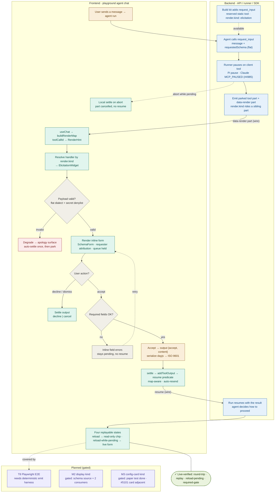

# M1 elicitation round-trip — frontend ↔ backend flow

Companion to [`decisions.md`](./decisions.md). Traces the `request_input` (elicitation)
interaction end to end: how the backend advertises and emits the client tool, how the
frontend renders and settles it, the decision branches, and how state replays on reload.

The whole spine below is **live-verified** on the running stack with a real LLM run
(round-trip, settled replay, reload-while-pending, and the required-field gate). The three
**Planned** nodes are the only unbuilt parts.

## Flow

**Legend:** blue = backend (API / runner / SDK) · teal = frontend · amber = user /
human-in-the-loop · gray = decision · red = degradation · green = verified · purple =
planned.

## Step-by-step

### Emit path (backend)

1. **Build kit** — the reserved static-catalog client tool `__ag__request_input`
   (`render.kind: "elicitation"`, input `{message, requestedSchema}`) is auto-included via
   `_reserved_static_tool_embeds`. The generic `ClientToolConfig → ClientToolSpec` path
   carries `render`, so the SDK needs no changes.
2. **Agent call** — the model authors a flat `requestedSchema` and calls the tool.
3. **Pause** — a client tool is the only pause primitive. The Pi harness pauses directly;
   the Claude harness pauses via `MCP_PAUSED` over the internal `agenta-tools` MCP server
   (PR #4985).
4. **Emit** — the runner protocol carries `render?: RenderHint`; the Vercel adapter's
   `client_tool` branch emits the parked tool part **plus a sibling
   `{type: "data-render", data: {toolCallId, render}}` part**. The sibling is required
   because AI SDK v6 tool chunks are strict and drop inline fields — this is the load-bearing
   wire contract.

### Receive & render (frontend)

5. **Render map** — `AgentMessage` builds `buildRenderMap(message.parts)`
   (`@agenta/playground`): a `toolCallId → RenderHint` map from the sibling `data-render`
   parts.
6. **Dispatch** — `ClientToolPart` resolves the handler by `render.kind` →
   `ElicitationWidget` (fallback order: `render.kind` → `toolName` → the neutral
   "not handled by this client" surface).
7. **Validate** *(decision)* — the shared validator checks the flat dialect and a
   secret-shaped denylist. **Invalid** routes to the degradation surface, which auto-settles
   an `errorText` once per turn, then parks (a repeat malformed emission shows a visible
   "needs attention" notice instead of looping). **Valid** renders the inline form
   (`SchemaForm` with the opt-in `formats` option), with requester attribution and the
   message-queue held via `isHitlPending`.

### User action & settle (frontend → backend)

8. **Action** *(decision)* — Accept validates required fields (empty → inline errors, no
   resume), then serializes values (dayjs → ISO 8601) and settles
   `output {action: "accept", content, humanFriendlyMessage}`. Decline settles
   `{action: "decline"}`; Dismiss settles `{action: "cancel"}`.
9. **Resume** — `settle → addToolOutput → agentShouldResumeAfterApproval` (map-aware
   resume predicate) → auto-resend → the run resumes on the backend with the structured
   result. **Local settle** is the exception: if the run aborts/errors while pending, the
   part is marked `cancelled` locally with no resume attempt.

### States & replay (frontend)

10. Four replayable states — `pending → submitted | declined | cancelled`, plus
    `degraded`. `deriveElicitationPartState` reconstructs them from persisted parts, so a
    reload replays every settled state as a read-only chip (copy sourced from
    `humanFriendlyMessage`, never re-resolved). A reload **while pending** re-renders the
    live form (localStorage replay pre-server-store).

## Verification status

| Behavior | Unit | Live (real stack) |
| --- | --- | --- |
| Payload validation / degradation / denylist | ✓ `@agenta/shared` | — |
| render-map dispatch · resume predicate · queue gating | ✓ `@agenta/playground` | — |
| Emitter payload + golden fixtures | ✓ pytest | — |
| Round-trip (emit → form → accept → resume with values) | — | ✓ |
| Settled-state replay after reload | — | ✓ |
| Reload-while-pending → accept → resume | — | ✓ |
| Required-field gate (blocks Accept, no resume) | — | ✓ |

## What's next

- **T8 — Playwright E2E.** Automating the spine deterministically needs an emit harness: the
  hosted mock provider cannot emit tool calls, so a `page.route` stream mock, a
  session-transcript seed endpoint, or a scriptable local mock is required. Tracked as a
  scoped test-infra decision.
- **M2 — display kind.** Gated on paper-testing the display schema source and two named
  consumers (see `decisions.md`).
- **M3 — config-card kind.** Paper test done; gated on JP's agent-template schema stability
  and the permission-plan vocabulary. The friendly `commit_revision` approval card
  (PR #5101) is the adjacent surface.
