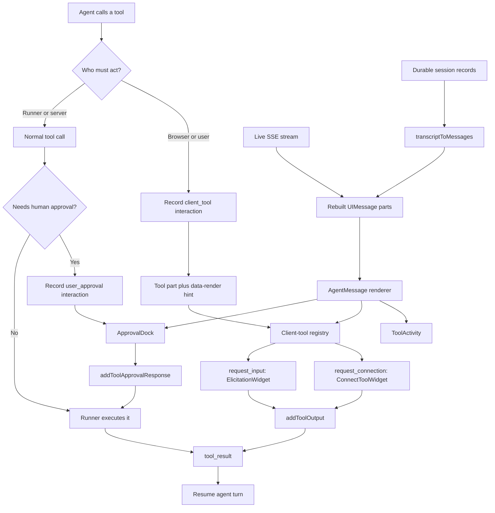

# PR #5859: agent-chat interaction architecture review

This report explains how the desktop agent chat turns backend events into live and replayed
frontend interactions. It then reviews PR #5859 from an architecture and clean-code perspective.

## Bottom line

The chat has two routes to the same `UIMessage` model:

1. During a live run, the SDK streams message parts directly into `useChat`.
2. When a session is opened or refreshed, the frontend fetches the durable record log and
   `transcriptToMessages` rebuilds the same message parts.

Rendering and responding happen after those routes join. PR #5859 fixes a mismatch between them:
live `request_input` carried the hint that selects the form widget, while replay dropped it.

An answered `request_input` remains in history, but it is no longer an editable form. Its later
`tool_result` changes the same tool part to a settled state, and `ElicitationWidget` renders a
read-only summary of the submitted, declined, or cancelled result.

## The main split

Not every frontend reaction uses the same mechanism.

| Category           | Who performs the work?              | Pause record                         | Frontend response                              |
| ------------------ | ----------------------------------- | ------------------------------------ | ---------------------------------------------- |
| Normal server tool | Runner/server                       | None unless approval is required     | Read-only `ToolActivity`                       |
| Human approval     | User authorizes a server tool       | `interaction_request: user_approval` | `ApprovalDock` calls `addToolApprovalResponse` |
| Client tool        | Browser performs a user-facing step | `interaction_request: client_tool`   | Registered widget calls `addToolOutput`        |

`request_input` and `request_connection` are client tools. `commit_revision`, schedule creation,
and subscription creation are server/platform tools. The latter may use human approval, but they
are not client tools.

## End-to-end flow



## The interfaces

### 1. Durable record interface

The backend stores an ordered, append-only session record log. Important event shapes include:

- `tool_call`: the tool name, call ID, and input.
- `interaction_request`: why execution paused and what the frontend must do.
- `interaction_response`: a durable human-approval response.
- `tool_result`: the final output or error for a tool call.
- `done`: the assistant-turn boundary or paused marker.

The frontend record boundary is `SessionRecord` in
`web/packages/agenta-entities/src/session/core/schema.ts`. The payload remains an agent event rather
than being converted into a frontend-specific database model.

### 2. Live message-part interface

The Vercel adapter in `sdks/python/agenta/sdk/agents/adapters/vercel/stream.py` converts live agent
events into AI SDK message parts. For a client tool it emits:

```text
tool-input-available(toolCallId, toolName, input)
data-render(toolCallId, render.kind)
```

The render hint is a sibling part because strict AI SDK tool parts cannot carry custom fields.

### 3. Replay adapter

`transcriptToMessages` converts durable records into the same message-part shape that the live
adapter produces. This is the core parity rule:

```text
same agent event -> same UIMessage parts -> same renderer and behavior
```

The desktop currently uses the OSS adapter in
`web/oss/src/components/AgentChatSlice/assets/transcriptToMessages.ts`. A copied package adapter
also exists in `web/packages/agenta-chat/src/assets/transcriptToMessages.ts` while the desktop is
being moved to the package.

### 4. Frontend dispatch interfaces

The renderer separates three concerns:

- `ToolActivity` displays ordinary server tools and completed work.
- `ApprovalDock` handles `approval-requested` states.
- `ClientToolPart` handles browser-fulfilled tools.

For client tools, `AgentMessage` builds a `toolCallId -> render hint` map from `data-render` parts.
The client-tool registry then selects a widget. Its intended selection order is:

```text
render.kind -> tool name compatibility fallback -> unhandled fallback
```

Current registered widgets are:

| `render.kind` | Tool-name fallback   | Widget              |
| ------------- | -------------------- | ------------------- |
| `elicitation` | `request_input`      | `ElicitationWidget` |
| `connect`     | `request_connection` | `ConnectToolWidget` |

An unknown parked client tool is settled with `not_handled` rather than leaving the agent hung.

## Live, refresh, and old-message behavior

### During a live turn

1. The stream creates the tool part and render hint.
2. The registry selects the widget.
3. The user completes or dismisses it.
4. The widget calls `addToolOutput`.
5. The resume predicate waits until the relevant tool parts are settled.
6. The frontend sends the updated history back and the runner resumes.

Only a decision made in the current browser mount can auto-resume. This prevents an answer loaded
from history from accidentally running the agent again.

### When records are fetched

`loadSessionMessages` fetches records and calls `transcriptToMessages`. The desktop adopts the
rebuilt transcript only when:

- the local browser is not currently streaming;
- the server record count moved beyond the local record watermark; and
- adopting would not shorten the visible message list.

Record count matters more than message count because a paused turn and its resumed continuation
are deliberately folded into one assistant message.

### If `request_input` is still pending

Replay creates an `input-available` tool part and restores its `data-render` hint. The registry
selects `ElicitationWidget`, so the form is actionable again. Partially typed values are best-effort
browser-local drafts keyed by `toolCallId`; they are not durable session records.

### If `request_input` was already answered

The record order is normally:

```text
tool_call
interaction_request(client_tool)
tool_result
```

Replay first reconstructs the pending tool. The later `tool_result` updates that same part to
`output-available` or `output-error`. Because the part is settled:

- the form does not reopen;
- accepted values can be displayed in a read-only answer summary;
- decline and cancel display read-only status chips; and
- loading this history does not auto-resume the agent.

The durable `tool_result` is therefore load-bearing. If a completed run omitted it, replay could
reconstruct the request as pending. Approval replay has an extra completion cleanup for incomplete
logs; client tools currently do not.

### Last message versus an older message

An actionable interaction is expected to remain in the last assistant message until it is settled.
The approval dock, connection dock, queue hold, and auto-resume logic inspect the tail message.

Known settled client tools can render their read-only history in any message. A pending client tool
in an older message is an invalid transcript shape: it may render, but `addToolOutput` expects to
settle a part in the last turn and cannot correctly resume that older turn.

## How the five examples map

| User-facing event  | Architecture                                           | Specialized frontend                                                |
| ------------------ | ------------------------------------------------------ | ------------------------------------------------------------------- |
| Request input      | Client tool, `render.kind: elicitation`                | Editable form while pending; read-only result after settlement      |
| Request connection | Client tool, `render.kind: connect`                    | Inline status plus connection actions near the composer             |
| Human approval     | `user_approval` interaction around a server tool       | Generic `ApprovalDock` with approve/deny actions                    |
| Commit message     | Input inside the `commit_revision` server tool         | Specialized approval preview, then switch to the committed revision |
| Add trigger        | `create_schedule` or `create_subscription` server tool | Generic approval card; PR #5863 adds post-success cache refresh     |

The commit message is not its own interaction. It is a field shown inside the specialized commit
approval body. Adding a trigger currently has no specialized renderer.

### What happens after a successful commit

The commit approval card is only the before-state. After `commit_revision` succeeds, the backend
emits a `data-committed-revision` message part containing the new revision ID. The frontend then:

1. marks the latest-revision and inspect caches stale;
2. remembers the previous parameters so it can show what changed; and
3. switches the playground directly to the new revision ID.

Changing the selected revision ID causes the revision-specific query to load the committed
configuration. This behavior was introduced across PRs #4925, #4934, and #4936, refined in #5145,
and repaired for the current commit-result shape in PR #5805.

This signal is strongest on the live path. The durable record replay adapter drops generic `data`
events, so opening the same session from server records alone does not replay the revision switch.
The committed revision is still durable; only this automatic UI reaction is not reconstructed.

### What happens after a successful trigger change

Agent trigger tools run on the server, bypassing the browser hooks that normally invalidate trigger
queries. In the current code, an already-open trigger list can therefore remain stale after
`create_schedule` or `create_subscription` succeeds.

Open PR [#5863](https://github.com/Agenta-AI/agenta/pull/5863) fixes this by watching newly settled
trigger tool parts and invalidating the schedule or subscription query after successful mutations.
It deliberately reacts only to new live results. Reopening old history does not replay cache
invalidations; a normal fresh query reads the durable trigger data instead.

## What PR #5859 changes

The PR repairs three pieces of client-tool replay. In simpler terms:

1. **Remember which UI to show after refresh.** A saved `request_input` now comes back with both
   the request and the label saying it needs an elicitation form. Before this change, replay kept
   the request but lost that label, so the frontend did not know which widget to use.
2. **Recognize old saved requests too.** Some older records do not contain that UI label. When the
   tool is named `request_input`, the frontend now uses the form as a compatibility fallback. It is
   the equivalent of recognizing a package by its sender when its shipping label is missing.
3. **Keep the conversation paused until the answer is delivered.** The queue and automatic-resume
   logic now know that `request_input` is completed by the browser. A pending form blocks the next
   message; once the user answers, the frontend sends that result back and lets the agent continue.

The parser did not need a behavior change. A test using the original failing schema confirms the
existing elicitation parser supports it.

## Architecture and clean-code review

### P1: replay did not refresh the canonical tool name (fixed in review follow-up)

`replayClientTool` refreshes missing input on an existing part, but it does not refresh the part's
tool name from `interaction_request.payload.toolName`. The live adapter deliberately re-emits both
the canonical name and real input when the client-tool interaction arrives.

This matters because the returned message history derives the response's tool name from the UI
part, while the runner matches a cold-replay client result by exact tool name plus arguments. If the
earlier `tool_call` used a display name or alias and the interaction carries the stable canonical
name, the correct form can render through `render.kind`, but its submitted answer can be indexed
under the stale name and missed by the runner.

Review follow-up:

- Replay now applies the interaction's canonical name and input to an existing part, matching the
  live stream's refresh behavior.
- Both adapter suites now cover a drifted `tool_call.name` and stale input.

Relevant seams:

- `web/oss/src/components/AgentChatSlice/assets/transcriptToMessages.ts:126-144`
- `web/packages/agenta-chat/src/assets/transcriptToMessages.ts:147-165`
- `sdks/python/agenta/sdk/agents/adapters/vercel/stream.py:754-786`
- `sdks/python/agenta/sdk/agents/adapters/vercel/messages.py:166-208`
- `services/runner/src/responder.ts:424-454`

### P2: explicit unknown render kinds fell through to the name fallback (fixed)

The registry comment describes the tool-name path as compatibility for a missing hint. The code
also uses it when a hint is present but unknown. For example, `request_input` with an explicit
future `render.kind: display` would silently render the elicitation form.

That weakens `render.kind` as the authoritative contract and can hide producer/frontend version
mismatches. Name fallback should run only when `renderKind` is absent. An explicit unsupported kind
should use the unhandled path.

The registry now uses the name fallback only when `render.kind` is absent. A test pins an explicit
unknown kind to the unhandled path.

### P2: the no-hint resume compatibility promise lacked a direct test (fixed)

Direct tests now prove a name-only old transcript:

- holds the queue while pending; and
- auto-resumes after `output-available` or `output-error`.

### P3: package parity tests were asymmetric (fixed)

Both replay suites now verify that a later `tool_result` wins over the pending client-tool request.

## Existing architectural debt

These issues predate PR #5859 and should not force a broad refactor in this bug fix:

1. There are two large `transcriptToMessages` implementations with stated manual parity. They have
   already drifted in approval-manifest and sentinel handling. The package implementation should
   become the single owner before more interaction kinds are added.
2. Client-tool identity is repeated in the app registry and playground resume policy. A small pure
   descriptor exported from a lower package could own known names and render kinds without making
   state code import React widgets.
3. The extracted `@agenta/chat` hydration path still adopts history by strictly larger message
   count. It does not use the desktop's record-watermark guard, so a turn that grows in place can
   remain stale for package consumers.
4. Cold resume matches browser results by tool name plus arguments. A durable interaction ID would
   be a stronger long-term correlation key and would reduce the cost of canonical-name drift.
5. Desktop has dedicated client-tool widgets, while mobile currently supports generic approvals
   but does not register client-tool widgets.

## Verdict

The PR fixes the reported replay bug at the correct behavioral seams: record replay, widget
dispatch compatibility, and resume policy. The main design is coherent: records are the durable
interface, both live and replay paths converge on AI SDK message parts, and registries keep visual
specialization out of the wire format.

The review findings above were addressed with focused regression tests. Consolidating the copied
replay adapter is worthwhile follow-up work, but it is not necessary to keep this regression fix
focused.

## Existing companion documentation

- `docs/design/agent-chat-interaction-kinds/flow.md`: detailed elicitation round trip.
- `docs/design/agent-chat-interaction-kinds/decisions.md`: interaction-kind and security decisions.
- `docs/design/agent-workflows/documentation/tools.md`: broader runner and tool model.
