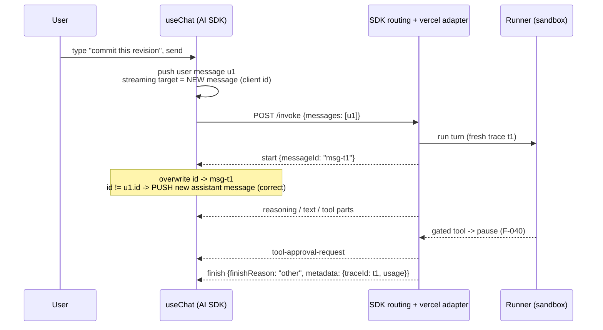
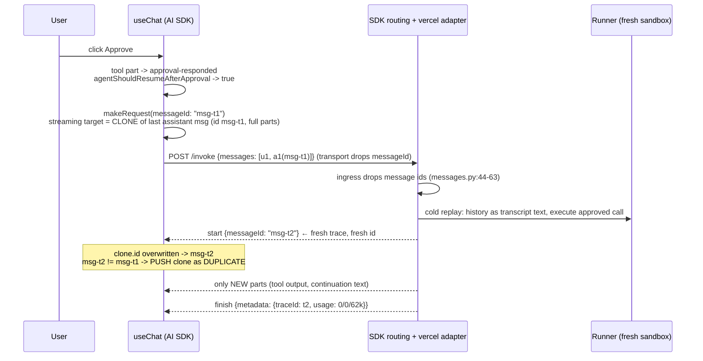

# How the duplicate turn happens: message ids end to end

This doc explains the whole flow, verified against the source on 2026-07-06. Every
claim carries a file:line reference. Versions: `ai@6.0.0-beta.150` (paths below
shorten `web/node_modules/.pnpm/ai@6.0.0-beta.150_zod@4.4.3/node_modules/ai/dist/index.js`
to `ai/dist/index.js`).

## 1. The model to hold in your head

A `useChat` conversation is a list of `UIMessage` objects, each with an `id`. The
message id is not cosmetic. It is the join key between the stream the server sends
and the message the client renders. On every streamed update, the client asks one
question: "is the message I am building the same message as the last one on screen?"
It answers by comparing ids (`ai/dist/index.js:11329`). Same id: replace in place.
Different id: push as a new message.

Our server mints a fresh id on every HTTP request. That is correct for a new turn.
It is wrong for a continuation of an existing turn, and an approval resume is exactly
that. The client prepares to continue the old message; the server tells it "this is a
new message"; the client believes the server and pushes a full copy.

## 2. Message ids end to end

### Who mints ids, and when

| Step | Who | What | Where |
|---|---|---|---|
| 1 | Client | Mints a provisional id for the response message (`this.generateId()`), used only if the last message is NOT an assistant message | `ai/dist/index.js:11286-11289`, `4444-4454` |
| 2 | Server | Mints the authoritative id: `msg-{trace_id}`, falling back to `msg-{uuid4}` when there is no trace | `sdks/python/agenta/sdk/agents/adapters/vercel/stream.py:273-275` |
| 3 | Server | Sends it in the first stream frame: `{"type": "start", "messageId": ...}` | `stream.py:276-279` |
| 4 | Client | Overwrites its message id with the streamed one | `ai/dist/index.js:4852-4855` |
| 5 | Client | Uses the id for the replace-vs-push decision on every write | `ai/dist/index.js:11329-11337` |

The server-side minting site accepts a `message_id` parameter
(`agent_stream_to_vercel_stream`, `stream.py:254-260`), but the only caller never
passes it. The routing layer passes `session_id` and `trace_id` and nothing else
(`sdks/python/agenta/sdk/decorators/routing.py:349-353`). Each HTTP request gets its
own OTel trace (routing reads `trace_id` off the per-request response,
`routing.py:346-352`), so each request also gets its own `msg-{trace_id}`.

### Where the id lives after the stream ends

- React list key and inspector target: `web/oss/src/components/AgentChatSlice/AgentChatPanel.tsx:1187`, `1180-1184`, `1227-1238`.
- First-seen timestamp cache, keyed by message id: `web/oss/src/components/AgentChatSlice/components/AgentMessage.tsx:221`.
- The next POST body. The playground sends `useChat`'s `UIMessage[]` verbatim under
  `data.inputs.messages`, ids included
  (`web/packages/agenta-playground/src/state/execution/agentRequest.ts:394-398`).

### Where the id dies

The Python ingress drops it. `_ui_message_to_message` reads only `role` and `parts`
(`sdks/python/agenta/sdk/agents/adapters/vercel/messages.py:44-63`). So the server
receives the continuation id on every resume and throws it away. Nothing downstream
(service, runner, harness) ever sees a message id. This matters for the fix: echoing
the id back changes nothing anywhere below the routing layer.

### What happens when ids match, mismatch, or are absent

- **Match** (streamed id == last message's id): every write replaces the last message
  in place. The turn grows on screen (`ai/dist/index.js:11330-11334`).
- **Mismatch**: the first write after `start` pushes the built message as a NEW list
  entry (`ai/dist/index.js:11336`). After that push it becomes the last message, so
  later writes replace it. Net effect: exactly one duplicate per mismatched stream.
- **Absent** (`start` carries no `messageId`): the client keeps whatever id the
  streaming state already has (`ai/dist/index.js:4853` guards on `!= null`). On a
  resume that is the old assistant message's id, so the replace path holds by default.

## 3. When and why the client clones

### The resume trigger

The approval buttons call `addToolApprovalResponse({id, approved})`. The AI SDK then
(`ai/dist/index.js:11162-11188`):

1. Rewrites the matching tool part on the LAST message from `approval-requested` to
   `approval-responded` (11170-11178).
2. Asks `sendAutomaticallyWhen({messages})` whether to auto-resend (11182). The
   playground supplies `agentShouldResumeAfterApproval`
   (`AgentChatPanel.tsx:368`), which returns true when the last assistant turn has a
   freshly resolved approval and every unsettled tool part is settled
   (`web/packages/agenta-playground/src/state/execution/agentApprovalResume.ts:108-138`).
3. Calls `makeRequest({trigger: "submit-message", messageId: this.lastMessage?.id})`
   (11183-11186). Note: the client passes the continuation id here. It reaches the
   transport, which ignores it (section 4).

`addToolOutput` (the client-tool path, e.g. `request_connection`) does exactly the
same thing (`ai/dist/index.js:11189-11213`). So the client-tool resume has the same
duplication bug and gets the same fix.

### The clone

`makeRequest` builds the streaming state from a SNAPSHOT of the last message
(`ai/dist/index.js:11285-11289`):

```js
state: createStreamingUIMessageState({
  lastMessage: this.state.snapshot(lastMessage),   // deep clone
  messageId: this.generateId()
})
```

and `createStreamingUIMessageState` (`ai/dist/index.js:4444-4459`) returns that clone
AS the message being streamed whenever the last message's role is `assistant`:

```js
message: lastMessage?.role === "assistant" ? lastMessage : { id: messageId, ... parts: [] }
```

This is deliberate SDK design: a request whose history ends with an assistant message
is a continuation, so new parts should append to that message. The AI SDK's own
server helpers complete the contract: `getResponseUIMessageId` reuses the last
assistant message's id as the response id (`ai/dist/index.js:4199-4208`), and
`handleUIMessageStreamFinish` stamps it into the `start` chunk when the stream did
not set one (`ai/dist/index.js:4924-4938`). Our Python server implements the minting
half of the protocol but not the continuation half.

### Why the duplicate is byte-identical

The duplicated content never crosses the wire twice. It comes from the client's own
`snapshot()` of the on-screen message. The server only streams NEW events on a
resume: the runner cold-starts a sandbox and replays prior turns to the MODEL as
flattened transcript text (`services/runner/src/engines/sandbox_agent/transcript.ts:69-81`),
but nothing re-emits old stream parts to the CLIENT. So the copy is not a server
replay and not a model re-generation. It is the same JavaScript object graph,
cloned, with new parts appended, pushed next to its original.

### The exact moment the duplicate appears

Writes before the `start` chunk would still replace (the clone still carries the old
id). But `start` is the first frame our server sends, and it carries the new
`messageId`, and the `start` handler triggers a write when a messageId is present
(`ai/dist/index.js:4852-4859`). So the very first frame of the resume stream pushes
the full duplicate. That is why the copy appears instantly on Approve, before any new
content streams.

## 4. Frontend decision points around the message id

| Decision | File:line | What it does today |
|---|---|---|
| Replace vs push | `ai/dist/index.js:11329-11337` | `activeResponse.state.message.id === this.lastMessage?.id` |
| Streaming target on resume | `ai/dist/index.js:4444-4459` | last assistant message (clone) is the target |
| Id overwrite from stream | `ai/dist/index.js:4852-4855` | `start.messageId` wins when present |
| Resume trigger | `agentApprovalResume.ts:108-138` | approval responded or client-tool settled, all tool parts settled, not already resumed |
| Auto-resend call | `ai/dist/index.js:11182-11186`, `11207-11211` | passes `messageId: lastMessage.id` to the transport |
| Playground transport | `AgentChatPanel.tsx:336-347` | `prepareSendMessagesRequest` destructures only `{messages, id}`; the `messageId` argument (provided by the SDK, `ai/dist/index.js:10932-10942`) is dropped |
| Slice-page transport | `web/oss/src/components/AgentChatSlice/assets/transport.ts:127-160` | same: destructures `{messages, id, body}`, drops `messageId` |
| Request body | `agentRequest.ts:388-398` | full `UIMessage[]` history (ids included) under `data.inputs.messages`; no top-level message id field |
| History filter | `agentRequest.ts:231-235`, `389` | strips answer-less assistant turns; a parked approval turn has tool parts, so it survives (`agentRequest.ts:228`) |

One correction to the original findings doc: it cited
`AgentChatTransport.ts:139-142` as the transport hook that ignores `messageId`.
Those lines are actually the batch-replay `start` chunk
(`web/oss/src/components/AgentChatSlice/assets/AgentChatTransport.ts:139-142`).
`AgentChatTransport` itself never defines `prepareSendMessagesRequest`
(`AgentChatTransport.ts:199-218`); the hooks that receive and drop `messageId` are the
two call sites above (`AgentChatPanel.tsx:336` and `transport.ts:127`). The
conclusion stands: no frontend code forwards or uses the continuation id.

## 5. The wire, frame by frame

All three flows below hit `POST {invocation_url}/invoke?application_id=...&project_id=...`
with `Accept: text/event-stream` and `x-ag-messages-format: vercel`
(`agentRequest.ts:371-376`). Ids are fake but shaped like the real ones.

### 5a. Normal turn



Request body (`agentRequest.ts:394-398`):

```json
{
  "session_id": "0198f3a2-0000-0000-0000-000000000000",
  "references": {"application": {"id": "..."}, "application_revision": {"id": "..."}},
  "data": {
    "inputs": {
      "messages": [
        {"id": "A1b2C3d4", "role": "user",
         "parts": [{"type": "text", "text": "Commit this revision"}]}
      ]
    },
    "parameters": {"agent": {"llm": {"model": "..."}, "tools": ["..."], "...": "..."}}
  }
}
```

Response stream (SSE, one `data:` line per frame; emitters in `stream.py`):

```text
data: {"type":"start","messageId":"msg-0af7651916cd43dd8448eb211c80319c","messageMetadata":{"sessionId":"0198f3a2-..."}}
data: {"type":"start-step"}
data: {"type":"reasoning-start","id":"reasoning-1"}
data: {"type":"reasoning-delta","id":"reasoning-1","delta":"I should commit..."}
data: {"type":"reasoning-end","id":"reasoning-1"}
data: {"type":"text-start","id":"text-1"}
data: {"type":"text-delta","id":"text-1","delta":"I'll commit the revision now."}
data: {"type":"text-end","id":"text-1"}
data: {"type":"tool-input-start","toolCallId":"call_1","toolName":"commit_revision"}
data: {"type":"tool-input-available","toolCallId":"call_1","toolName":"commit_revision","input":{"message":"v2"}}
```

### 5b. Approval pause (the tail of the same stream)

The runner pauses: it ends the turn, destroys the session, and never answers the
harness gate (`pause.ts:22-27`). The adapter surfaces the gate and closes the stream
with the pause mapped to `finishReason: "other"` (`stream.py:35-39`, `434-446`):

```text
data: {"type":"tool-approval-request","approvalId":"appr_1","toolCallId":"call_1"}
data: {"type":"finish-step"}
data: {"type":"finish","finishReason":"other","messageMetadata":{"usage":{"input":812,"output":264,"total":1076},"traceId":"0af7651916cd43dd8448eb211c80319c"}}
data: [DONE]
```

The client now shows the turn with an Approve/Deny prompt. The assistant message's id
is `msg-0af76519...` (the `start` frame set it).

### 5c. Resume after Approve (where the bug fires)



Resume request body. The last message is now the assistant turn, carrying its id and
its full parts, including the responded approval:

```json
{
  "session_id": "0198f3a2-0000-0000-0000-000000000000",
  "references": {"...": "..."},
  "data": {
    "inputs": {
      "messages": [
        {"id": "A1b2C3d4", "role": "user", "parts": [{"type": "text", "text": "Commit this revision"}]},
        {"id": "msg-0af7651916cd43dd8448eb211c80319c", "role": "assistant",
         "parts": [
           {"type": "reasoning", "text": "I should commit..."},
           {"type": "text", "text": "I'll commit the revision now."},
           {"type": "tool-commit_revision", "toolCallId": "call_1",
            "state": "approval-responded", "input": {"message": "v2"},
            "approval": {"id": "appr_1", "approved": true}}
         ]}
      ]
    },
    "parameters": {"...": "..."}
  }
}
```

Resume response stream. Note the fresh id in `start`; everything after it is new
content only:

```text
data: {"type":"start","messageId":"msg-b9c1f00a52e04e0f8f2f3c9d1e2a4b6d","messageMetadata":{"sessionId":"0198f3a2-..."}}
data: {"type":"start-step"}
data: {"type":"tool-input-available","toolCallId":"call_1b","toolName":"commit_revision","input":{"message":"v2"}}
data: {"type":"tool-output-available","toolCallId":"call_1b","output":{"count":1,"workflow_revision":{"...":"..."}}}
data: {"type":"text-start","id":"text-1"}
data: {"type":"text-delta","id":"text-1","delta":"Done. Committed as v2."}
data: {"type":"text-end","id":"text-1"}
data: {"type":"finish-step"}
data: {"type":"finish","finishReason":"stop","messageMetadata":{"usage":{"input":0,"output":0,"total":62749},"traceId":"b9c1f00a52e04e0f8f2f3c9d1e2a4b6d"}}
data: [DONE]
```

The clone (old parts + these new parts) gets pushed next to the original the moment
the `start` frame lands. Result: two stacked blocks. A second approval repeats the
cycle against the now-bigger last message: three blocks.

## 6. What the user sees: before and after

Today, after asking one question and approving two gated tools:

```text
BEFORE (today)                              AFTER (fixed)
┌──────────────────────────────┐            ┌──────────────────────────────┐
│ You: Commit this revision    │            │ You: Commit this revision    │
│      and subscribe me        │            │      and subscribe me        │
├──────────────────────────────┤            ├──────────────────────────────┤
│ Reasoning: I should...       │            │ Reasoning: I should...       │
│ I'll commit the revision.    │            │ I'll commit the revision.    │
│ [commit_revision] approved   │            │ [commit_revision] approved ✓ │
│ Inspect turn · 812/264 tok   │            │ [commit_revision] ✓ ran      │
├──────────────────────────────┤            │ Committed as v2.             │
│ Reasoning: I should...       │  duplicate │ [create_subscription] appr ✓ │
│ I'll commit the revision.    │  (copy 1)  │ [create_subscription] ✓ ran  │
│ [commit_revision] approved   │            │ All done: committed v2 and   │
│ [commit_revision] ✓ ran      │            │ created your subscription.   │
│ Committed as v2.             │            │ Inspect turn · metrics       │
│ [create_subscription] appr   │            └──────────────────────────────┘
│ Inspect turn · 0/0/62,749    │
├──────────────────────────────┤            One turn block. It grew in
│ Reasoning: I should...       │  duplicate place on each approval. One
│ I'll commit the revision.    │  (copy 2)  Inspect-turn footer.
│ [commit_revision] approved   │
│ [commit_revision] ✓ ran      │
│ Committed as v2.             │
│ [create_subscription] appr ✓ │
│ [create_subscription] ✓ ran  │
│ All done: committed v2 and   │
│ created your subscription.   │
│ Inspect turn · 0/0/62,749    │
└──────────────────────────────┘
```

Each "duplicate" block is cumulative: copy 1 holds turn one plus continuation one;
copy 2 holds everything. Each has its own Inspect-turn footer because each is a
separate `UIMessage` with its own id and its own `metadata.traceId`.

## 7. Side effects a stable id creates (design these in, not around)

### One message, many traces

The service stamps `traceId` and `usage` on the `finish` frame's `messageMetadata`
(`stream.py:439-446`). The client MERGES metadata into the message
(`updateMessageMetadata`, `ai/dist/index.js:4563-4573`, via `mergeObjects`). With a
stable message id, every resume merges over the same message:

- `metadata.traceId` becomes the LAST request's trace id.
- `metadata.usage` becomes the LAST request's usage. On resumed turns that is the
  broken `0/0/~62k` figure, because ACP `usage_update` only carries a context-size
  total (`services/runner/src/tracing/otel.ts:1185-1197`) and the resumed prompt
  contains the whole flattened transcript.

Consumers of these fields:

- `getMessageTraceId` prefers `metadata.traceId`, falls back to a `data-trace` part
  (`web/oss/src/components/AgentChatSlice/assets/trace.ts:25-34`).
- `TraceMetrics` reads latency from the trace summary and tokens/cost from
  `metadata.usage` (`components/AgentMessage.tsx:61-70`, `217-218`).
- The trace-drawer link and the turn's timestamp also key off the trace
  (`components/AgentMessage.tsx:224-232`).

So after the fix, the single turn block shows the last continuation's trace and
usage, not the whole turn's. `fix-options.md` weighs how to handle this.

### The Turn Inspector already models multi-request turns

The inspector groups request captures by the triggering user message, not by
assistant message id: `TurnRequestCapture.triggerUserMessageId` is documented as
"shared by a turn's initial send + resumes"
(`web/packages/agenta-playground/src/state/execution/turnCapture.ts:3-13`, `52-57`;
consumed in `TurnInspector.tsx:60-73`). A stable assistant id does not break it; it
actually removes today's oddity where three blocks all point at overlapping content.

### Everything else gets better, not worse

- React keys stay unique: the turn's FIRST request still mints `msg-{trace_id}`; only
  resumes reuse it. Uniqueness across turns is preserved (the concern in
  `stream.py:270-272` was a shared CONSTANT id, which is not what the fix does).
- The first-seen timestamp cache keys by message id
  (`components/AgentMessage.tsx:221`); a stable id keeps the turn's original time.
- Persisted threads store one message per turn instead of N cumulative copies.
- The resume predicate's already-resumed guard keys off `step-start` parts within one
  message (`agentApprovalResume.ts:125-137`); it was written for exactly this
  in-place-growth shape and works unchanged.

## 8. Verification notes against the findings doc

All core claims in
`docs/design/agent-workflows/scratch/approval-turn-duplication-findings.md` check out
against the source, with two precision fixes:

1. The `messageId`-ignoring hook is not in `AgentChatTransport.ts:139-142` (that is
   the batch-replay `start` chunk). The hooks live at `AgentChatPanel.tsx:336-347`
   and `assets/transport.ts:127-160`. Section 4 above has the detail.
2. The findings doc did not mention that the AI SDK client PASSES the continuation id
   to the transport on every auto-resend (`ai/dist/index.js:11185`, `11210`) and that
   the AI SDK's own server helpers implement id-echoing as the canonical behavior
   (`getResponseUIMessageId`, `ai/dist/index.js:4199-4208`). Both strengthen the case
   for the server-echo fix.
