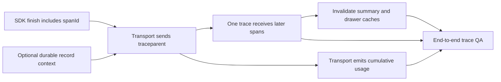

# Trace continuation complexity and delivery plan

This document turns `trace-continuation-v2.md` into reviewable work. It explains why
issue #5097 is Medium complexity even though the server already understands
`traceparent`.

## Executive estimate

| Scope                                               |        Complexity |      Expected effort | Why                                                                                                                                                         |
| --------------------------------------------------- | ----------------: | -------------------: | ----------------------------------------------------------------------------------------------------------------------------------------------------------- |
| Live continuation in one mounted session            |            Medium | 3-5 engineering days | Additive SDK contract, transport override, cumulative usage semantics, two trace-cache invalidations, cross-channel tests, and live approval/client-tool QA |
| Guaranteed continuation after server-only hydration | Additional Medium | 2-4 engineering days | Durable record contract, latest-span folding rule, backend and replay changes, compatibility tests                                                          |

The first row is the recommended issue scope. The second row should be scheduled only
if reload continuity is a release requirement.

The estimate assumes the current message-id continuation behavior from #5088 remains
stable. It excludes the runner's broken ACP input/output accounting.

## Why this is not Small

Sending one header is small. Shipping correct behavior is not, because the header
changes the lifetime of a trace from "immutable after one request" to "incrementally
extended by later requests".

Four contracts must agree:

1. **Response contract:** the browser needs the current `/invoke` span id, not only
   the trace id.
2. **Request contract:** only a genuine continuation may replay that context.
3. **Message contract:** usage shown for one message must represent all requests that
   built it.
4. **Query-cache contract:** the same trace key must be refetched after later spans
   arrive.

Missing any one creates a plausible but wrong result:

| Missing piece                 | User-visible failure                                                                |
| ----------------------------- | ----------------------------------------------------------------------------------- |
| `spanId` in stream metadata   | Resume cannot construct a valid parent; it starts a new trace                       |
| Strict continuation predicate | A new user turn can accidentally join the previous trace                            |
| Cumulative usage rewrite      | Trace is unified but token/cost chips show only the last request                    |
| Scoped cache invalidation     | Backend contains the full trace but metrics/drawer keep an earlier partial snapshot |
| Batch parity                  | Behavior changes when stream negotiation falls back to JSON                         |

## Work breakdown

### Slice A: additive SDK metadata contract

Complexity: Small.

- Thread `WorkflowStreamingResponse.span_id` into the Vercel stream projection.
- Emit `messageMetadata.spanId` on `finish`.
- Keep the field optional for older or untraced responses.
- Confirm error and no-output terminators still emit the metadata.

Tests:

- Stream with trace and span ids emits both.
- Stream without span id emits no `spanId`.
- Error-finally path still emits trace context.
- Routing passes the response span id to the adapter.

Risk: low. The field is additive and ignored by old consumers.

### Slice B: transport continuation and cumulative usage

Complexity: Medium.

- Add a transport-local continuation map keyed by stable assistant message id.
- Wrap `prepareSendMessagesRequest`: delegate first, then merge a validated
  `traceparent` into the final prepared headers so it cannot be discarded.
- Override `AgentChatTransport.sendMessages` to capture and strip response `spanId`,
  advance the latest-span context, and aggregate usage.
- Wrap the parsed chunk stream and rewrite finish usage cumulatively.
- Add `spanId` to the batch JSON replay metadata.
- Keep stream-to-batch 406 fallback behavior unchanged.

Tests need a new transport-focused suite because no current test directly exercises
`AgentChatTransport`.

Required cases:

1. Normal user send: no `traceparent`.
2. Approval resume: header uses the transport context for the last assistant id.
3. Denial resume: same behavior.
4. Client-tool success and error: same behavior.
5. Missing, malformed, or evicted context: no header.
6. Regenerate/new user message: fresh trace.
7. Existing authorization and message-format headers survive.
8. The 406 stream-to-batch retry preserves `traceparent`.
9. First finish usage passes through.
10. Second and third request usage accumulates once each.
11. `{input:0, output:0, total:62749}` contributes zero total.
12. Total-only usage remains representable.
13. Batch response copies both ids and follows the same aggregation rule.
14. Aborted or errored request does not double-count a previous aggregate.

Main uncertainty: stream transformation must preserve backpressure, errors, and every
chunk unchanged except `finish.messageMetadata.usage`.

### Slice C: scoped trace-cache invalidation

Complexity: Small to Medium.

- Add a growing-trace refresh action that accepts one trace id.
- Invalidate both the lightweight summary and full trace query keys for the current
  project.
- Call it on each successful chat finish and use a bounded backoff for active queries;
  one immediate refetch can race asynchronous ingestion and cache a partial trace.
- Leave inactive queries stale for their next mount.
- Preserve the aggressive not-found retry window for newly ingested spans.

Tests:

- Only the requested trace's summary and entity keys are invalidated.
- Other trace ids remain cached.
- A continuation finish starts the bounded refresh for the stable trace id.
- Fake-timer coverage proves the backoff stops at its deadline and on teardown.
- A successful early partial response does not stop later scheduled refetches.
- Opening the drawer before approval and again after resume fetches the expanded tree.

Main uncertainty: choose the shortest backoff window that reliably covers current
ingestion lag without keeping active drawers noisy. The implementation should make the
schedule explicit and testable.

### Slice D: end-to-end QA and observability checks

Complexity: Medium because it spans UI, network, and stored traces.

Run these scenarios in both default streaming mode and forced batch/fallback mode
where supported:

| Scenario                               |         HTTP requests | Expected assistant messages |                         Expected traces |
| -------------------------------------- | --------------------: | --------------------------: | --------------------------------------: |
| Server tools, no gate                  |                     1 |                           1 |                                       1 |
| Approve one gate                       |                     2 |                           1 |                                       1 |
| Deny one gate                          |                     2 |                           1 |                                       1 |
| Two sequential approvals               |                     3 |                           1 |                                       1 |
| Client tool succeeds                   |                     2 |                           1 |                                       1 |
| Client tool fails/cancels              |                     2 |                           1 |                                       1 |
| New user turn after a gated turn       |                    +1 |                          +1 |                                      +1 |
| Regenerate                             | 1 replacement request |         replacement message |                             fresh trace |
| Reload parked turn from server records |              1 resume |                           1 | new trace unless durability slice ships |

For each continuation scenario, verify:

- Network request 2 carries the expected `traceparent`.
- Every `/invoke` span has the same trace id and the expected parent chain.
- The turn-level trace action opens the full waterfall.
- Opening the drawer before and after resume shows the later subtree after refetch.
- Token/cost chips use cumulative message usage, not only the last request.
- Human think time does not appear as one long-running span.

### Optional Slice E: durable reload continuity

Complexity: Medium and deliberately separate.

Likely ownership:

- Runner or SDK record emission adds trace and span context to a durable terminal
  event or record.
- Session record DTO/storage preserves those fields.
- Hydration restores the latest completed context into the new session transport.
- Tests cover old records with neither field and turns with several resume records.

The design must choose the latest completed `/invoke` span, not the first, so another
resume continues the causal chain.

## Dependency graph

Slices A, B, and C can be separate commits but should ship behind one compatible PR
stack or in dependency order. A may deploy before B safely. B without C should not be
released because it produces stale trace UI after an approval.

## Interfaces and ownership

| Field or decision              | Semantic role                                 | Owner                                             | Lifetime                          |
| ------------------------------ | --------------------------------------------- | ------------------------------------------------- | --------------------------------- |
| `traceId` in transport context | Protocol context and observability identity   | SDK response; transport captures                  | Logical live turn                 |
| `spanId`                       | Protocol context: parent for the next request | SDK response; transport captures and strips       | Latest completed request          |
| `traceparent`                  | Standard W3C propagation header               | Frontend transport sends; SDK middleware consumes | One continuation request          |
| `messageId`                    | Conversation identity and context-map key     | AI SDK and Vercel stream projection               | Logical assistant message         |
| `traceId` on UI message        | Observability metadata for the trace action   | Transport forwards                                | Logical assistant message         |
| `usage`                        | Turn-level metric data                        | Frontend transport aggregates                     | Logical assistant message         |
| growing-trace refresh          | Cache lifecycle policy                        | Trace entity store                                | Bounded window after each request |

`spanId` travels in `finish.messageMetadata` only because that is the AI SDK's
additive finish extension point. Its semantic owner remains the transport, so the
transport removes it before the UI message is persisted.

Do not derive conversation identity from trace ids. #5088 intentionally separated
those concerns: message id remains stable even if propagation is absent or malformed.

## Failure behavior

The feature is fail-open:

- No transport context or span id: start a new trace.
- Invalid ids: start a new trace.
- Old backend: `spanId` is absent, so behavior remains current.
- Old frontend: ignores `spanId`, so behavior remains current.
- Trace query refetch fails: the message still renders and can retry; the agent run is
  unaffected.

The transport must never block a tool approval or client-tool continuation because
observability context is unavailable.

## Rollout

1. Land SDK contract and unit tests.
2. Land frontend transport, usage, and cache invalidation together.
3. QA one approval and one client tool first; they prove both interaction producers
   converge on the shared continuation path.
4. QA two sequential gates; it proves the latest-span chain advances correctly.
5. Compare trace counts and any dashboards that treat traces as runs.
6. Decide whether to schedule durable reload continuity.

## Out of scope

- Fixing ACP's missing input/output split.
- Recomputing historical root-span cumulative metrics after late ingest.
- Changing trace-list counting or billing semantics without a separate decision.
- Combining a whole chat session into one trace.
- Changing the assistant-turn trace action introduced by the part 1 UI cleanup.
