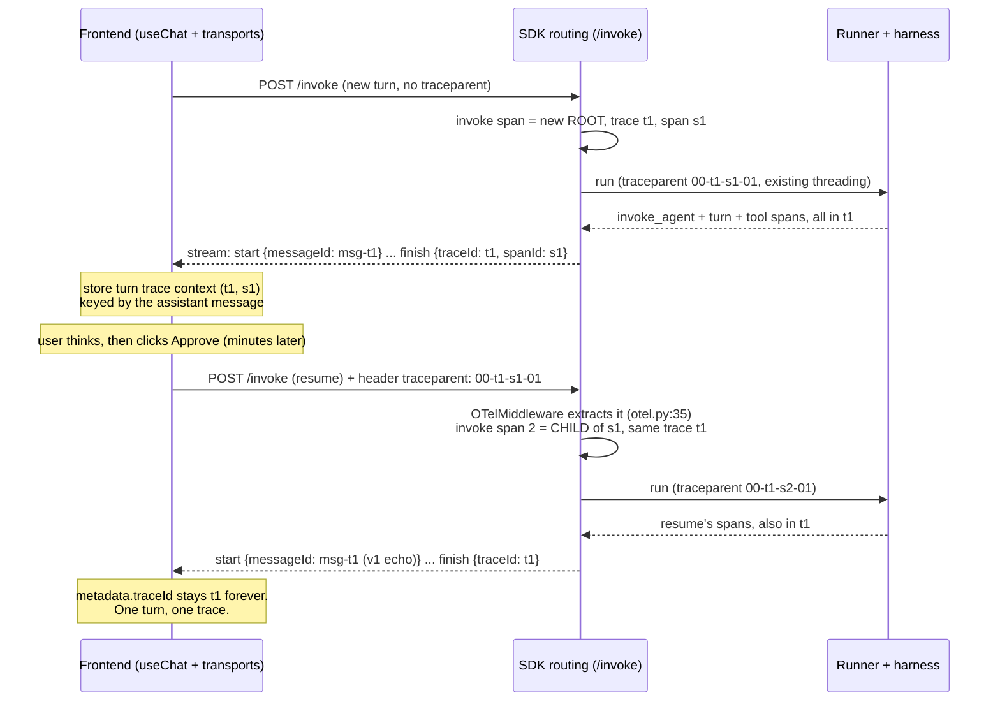

# Trace continuation: one logical turn, one trace

Follow-up design to the v1 messageId fix (`plan.md`). Design only, no code changed.
Every claim below was verified against source on 2026-07-06, with file:line references.

## The problem v1 leaves behind

The v1 fix keeps the assistant message id stable across approval resumes, so the turn
grows in place on screen. But each resume is still its own HTTP POST, and each POST
starts its own OTel trace. One on-screen turn now spans two or three traces.

The client merges `messageMetadata` across resumes (`ai/dist/index.js:4563-4573`), so
the merged turn keeps only the LAST request's `traceId` and `usage`:

- The turn footer's trace link and latency point at the last continuation, not the
  whole turn (`getMessageTraceId`, `trace.ts:25-34`; `TraceMetrics`,
  `AgentMessage.tsx:63-70`).
- The trace drawer opened from the footer shows only the last request's spans
  (`AgentChatPanel.tsx:630-631`).
- The displayed usage is the resume's broken ACP figure (`input: 0, output: 0,
  total: ~62k`), because ACP `usage_update` carries only a context-size total
  (`services/runner/src/tracing/otel.ts:1185-1197`) and the Claude/ACP path has no
  usage fallback that fills the split (`engines/sandbox_agent/usage.ts:29-41`,
  `sandbox_agent.ts:876-886`).

Goal: make the observability story match the UI story. One logical turn should read as
one unit in the trace waterfall, the turn footer, and per-turn metrics.

## How a request gets its trace today

The surprising finding first: **the SDK already supports continuing an inbound trace.**
Nothing new is needed on the server for the core mechanism.

1. **Inbound extraction.** `OTelMiddleware` reads the W3C `traceparent` and `baggage`
   headers off every request (`sdks/python/agenta/sdk/middlewares/routing/otel.py:26-48`).
   When no `traceparent` arrived, it even synthesizes one from `x-ag-trace-id` +
   `x-ag-span-id` (`otel.py:40-44`).
2. **Context threading.** The invoke endpoint copies that into the `TracingContext`
   (`routing.py:231-241` via `tracing_context_manager`, `routing.py:613`).
3. **Span parenting.** The `instrument` decorator starts the workflow span with
   `context=ctx` from `_get_traceparent()` (`decorators/tracing.py:99-110`, `433-442`).
   With an inbound traceparent, the `/invoke` span becomes a CHILD of the caller's span,
   in the caller's trace. Without one, it is a new root span in a new trace.
4. **Link capture.** `_set_link` records the span's trace and span ids
   (`tracing.py:444-456`); the normalizer stamps them onto the response as
   `response.trace_id` / `response.span_id`
   (`middlewares/running/normalizer.py:122-138`, `154-161`). Note: with an inbound
   traceparent, `response.trace_id` is the CALLER's trace id, because a child span
   shares its parent's trace id.
5. **Outbound advertisement.** The response already tells the caller its trace context:
   `_set_common_headers` sets `x-ag-trace-id`, `x-ag-span-id`, and a full
   `traceparent: 00-{trace_id}-{span_id}-01` header (`routing.py:265-291`). The batch
   JSON body also carries `trace_id` and `span_id` as top-level fields
   (`routing.py:294-302`). The vercel `finish` frame carries `metadata.traceId` (but not
   the span id) (`adapters/vercel/stream.py:240-251`).
6. **Message id.** The `start` frame's id defaults to `msg-{trace_id}`
   (`stream.py:270-279`); the v1 fix echoes the continuation id instead on resumes.

Sampling is not a concern: the SDK builds its `TracerProvider` with no sampler argument
(`engines/tracing/tracing.py:94-96`), so OTel's default `parentbased_always_on` applies,
and our traceparents carry the sampled flag (`-01`).

### Prior art: the run already joins the /invoke trace across three processes

The same propagation chain already runs deeper than one process. `trace_context()`
injects the active `/invoke` span as a W3C traceparent into the run request
(`sdks/python/agenta/sdk/agents/tracing.py:41-76`; wire field
`services/runner/src/protocol.ts:37-44`). The runner parses it and starts its
`invoke_agent` span as a child of that remote span (`otel.ts:218-226`, `1051-1074`).
For local Pi, the runner passes it further as a `TRACEPARENT` env var into the Pi
extension (`engines/sandbox_agent/pi-assets.ts:48`, `extensions/agenta.ts:310`), which
self-instruments under it. Three processes, one trace. Extending the same chain one hop
UP (browser to server) is the smallest possible move.

## What the frontend does with trace ids

- `getMessageTraceId` prefers `message.metadata.traceId`, falls back to a `data-trace`
  part (`web/oss/src/components/AgentChatSlice/assets/trace.ts:25-34`).
- `TraceMetrics` reads latency from `traceDataSummaryAtomFamily(traceId)` and tokens
  and cost from `message.metadata.usage` (`AgentMessage.tsx:63-70`, `217-232`).
- `traceDataSummaryAtomFamily` fetches the trace once and derives metrics from the ROOT
  span only (the span with no `parent_id`;
  `web/packages/agenta-entities/src/loadable/controller.ts:1767-1860`, root picker at
  `1579-1596`, duration fallback `root.start_time -> root.end_time` at `1748-1758`).
- The Turn Inspector does NOT use traces. It groups request captures by the triggering
  user message id, a model built for "initial send + resumes"
  (`web/packages/agenta-playground/src/state/execution/turnCapture.ts:3-13`, `52-57`).
- The transports own their `fetch` (`AgentChatTransport.ts:199-217` wraps
  `createNegotiatingFetch`), and request headers are built in one place
  (`agentRequest.ts:371-376`). Both give us a clean seam for capturing response
  context and sending request headers.

So one message mapping to ONE trace makes every consumer simpler. The multi-trace state
is the anomaly the FE currently papers over.

## A constraint the design must respect: metrics roll up at ingest

Cumulative token, cost, and error metrics are computed when spans are INGESTED, per
trace within one ingest payload (`api/oss/src/core/tracing/service.py:137-151`;
`core/tracing/utils/trees.py:28-63`, whose docstring warns that partial trace trees
fail to propagate). Spans that join a trace in a later batch get their own subtree
rollup, but the earlier root span's cumulative totals are NOT recomputed.

Consequence: even with one trace per turn, the root span's headline metrics cover only
request 1. The waterfall is complete; the root's cumulative numbers are not. Per-turn
usage therefore needs FE-side aggregation (below) under every option. Joining the trace
fixes the waterfall and identity; it does not fix aggregation by itself.

## Option A: client-side trace propagation (recommended)

The frontend captures the turn's trace context from the first response and replays it
as a standard `traceparent` request header on every resume. The server continues the
same trace with zero new propagation code.

### Flow



### What changes where

| Layer | Change | Size |
|---|---|---|
| SDK `stream.py` | Add `spanId` next to `traceId` in the `finish` frame metadata (`stream.py:244-250`), and pass `response.span_id` through `_make_stream_response` (`routing.py:349-353`). This is the one server change; see "capture channel" below. | S |
| FE transport | Capture `{traceId, spanId}` from the first response's `finish` frame; store it per turn (keyed by the assistant message id or the trigger user message id, next to the existing turn captures). | S |
| FE request builder | When the request is a resume (same predicate the AI SDK uses: last message has `role: "assistant"`), add `traceparent: 00-{traceId}-{spanId}-01` to the headers in `agentRequest.ts:371-376`. | S |
| Runner, service, `routing.py` propagation | Nothing. The middleware and decorator already do the work (`otel.py:26-48`, `tracing.py:99-110`). | none |
| Observability ingest and query | Nothing. Spans upsert into the existing trace by id. | none |
| Turn footer / Inspect Turn | Nothing required. `metadata.traceId` becomes stable, so the trace link and the drawer now show the whole turn. | none |

### The capture channel, and why not the response headers

The `traceparent` response header already exists (`routing.py:287-289`), but the
browser cannot read it cross-origin: the SDK's CORS middleware sets
`expose_headers=None` (`middlewares/routing/cors.py:16-24`), and `traceparent` is not
on the CORS safelist. Two ways out:

1. **Body channel (preferred).** Add `spanId` to the `finish` frame metadata. The
   `traceId` already travels there; the span id is the one missing fact. No CORS
   dependency, survives proxies, and the batch channel already carries both ids in its
   JSON body (`routing.py:294-302`), so batch resumes work the same way.
2. Header channel: add the trace headers to `expose_headers`. One line in the SDK, but
   it depends on CORS config and on every proxy in between passing the header. Keep it
   as a fallback, not the primary.

Note the FE must store the FIRST response's context per turn and reuse it for every
resume of that turn. Do not read it back from `message.metadata` after a resume:
metadata merges, and a `spanId` field would flip to the last request's span. A
first-write-wins store keyed by message id (like the existing
`messageCreatedAtAtomFamily` first-seen cache, `AgentMessage.tsx:221`) or a field on
the turn capture is the right home.

### Trace shape and timing

All resumes become children of the turn's first `/invoke` span, so the trace has one
root and a flat fan-out of continuation subtrees. Parenting under an already-ended span
is legal in OTel: a parent is just a `SpanContext` (ids), not a live object, and the
API's tree builder links spans purely by `parent_id`.

Nothing stays "open" during human think-time. Each request's spans start and end within
that request; the trace is only a shared id. Think-time shows up as a gap between the
first subtree's end and the resume subtree's start. Trace duration as the FE computes
it (`root.start_time -> root.end_time`, `controller.ts:1748-1758`) covers request 1
only, so think-time does NOT inflate the displayed latency. If we later want true
active latency, sum per-request durations FE-side (the per-request captures already
exist).

### Per-turn usage aggregation

With a stable trace id, `metadata.usage` still merges to the last request's numbers.
Fix this FE-side in the same slice: the transport records each response's `finish`
usage per turn (it sees every frame in `processResponseStream`), and `TraceMetrics`
sums across the turn's requests instead of reading the merged metadata.

Sum `input` and `output` per request; recompute `total` as their sum when the parts
disagree with the reported total. That guard matters because resumed ACP turns report
`{0, 0, ~62k}` (`otel.ts:1185-1197`): naive total-summing would add the context-size
figure per resume. With the guard, the turn shows request 1's real figures plus zeros,
which is strictly better than showing only the broken resume figure. The real fix for
the split stays where `plan.md` slice 3 filed it: the runner's usage extraction.

### Risks

- **Stale root metrics.** The ingest-time rollup constraint above. The root span's
  cumulative tokens/cost undercount the turn. Accepted: the waterfall is complete, and
  the turn UI reads usage from the FE aggregation, not the root span.
- **Malformed or replayed traceparent.** A wrong header degrades to today's behavior
  at worst (`extract` failure leaves `traceparent: None`, `otel.py:34-46`, and the
  request starts a fresh trace). A stale one (e.g. a restored thread from another
  project) would append spans to an old trace; scope the FE store to the live session
  (not persisted with the thread) to avoid that.
- **One trace per turn changes the observability list.** Three rows collapse into one.
  This is the point, but dashboards counting traces as "runs" will count fewer. Flag it
  in the release note.

Complexity: **S** overall. One small SDK wire addition (`finish.spanId`), one FE
capture + one FE header, an FE usage-summing change, tests.

### Interaction with the v1 messageId fix

Option A builds on v1 and needs it. The resume detection predicate is the same one
("inbound last message has role assistant"). With propagation on, `response.trace_id`
on a resume equals t1, so even the `msg-{trace_id}` default would match; but the v1
echo stays authoritative because it also covers the no-traceparent fallback (older
frontends, direct API callers) and message ids should not depend on tracing being
healthy. Neither change replaces the other: v1 fixes conversation identity, this fixes
trace identity, and they use the same continuation signal.

## Option B: separate traces stitched by a turn key

Each request keeps its own trace. Resumes stamp a turn key on their root span, and the
UI plus query layer aggregate by that key instead of by trace id.

The turn key exists for free: after v1, the continuation message id is
`msg-{first_trace_id}` and is already on the wire in `messages[-1].id` (the v1 prelude
stash extracts it). Routing would stamp it as a span attribute (for example
`ag.meta.turn_id`) on every request of the turn, including the first.

Two stitching channels:

- **Attribute + query.** `/spans/query` already filters on attributes
  (`api/oss/src/apis/fastapi/tracing/router.py:314-425`), so "all traces of this turn"
  is one query. But the FE gains a new aggregation layer: the turn footer would query
  by turn key, fetch N traces, and merge summaries; the trace drawer would need a
  multi-trace view or a trace picker per turn.
- **OTel span links.** Links are parsed and stored at ingest
  (`core/tracing/utils/parsing.py:253-279`), but nothing queries or renders them
  today, so this channel needs query-layer AND UI work before it does anything.

What changes where: routing.py (stamp the attribute), FE turn footer and metrics (new
multi-trace summary atoms), trace drawer (multi-trace UI), possibly a `/turns` query
convenience. Runner: nothing.

Assessment: complexity **M to L**, and the outcome is worse. The waterfall stays split
into three trees; the user still cannot see the turn as one timeline. The per-turn
usage summing it enables is the same summing option A does FE-side without any new
query surface. B's only real advantage is philosophical (one trace per HTTP request),
which nothing in our stack depends on. Not recommended as the primary, but the
`ag.meta.turn_id` attribute is cheap and useful for analytics even under option A;
consider stamping it regardless.

## Option C: one trace per chat session

Parent every turn of a session under one long-lived session trace. Rejected:

- Too coarse. A session spans many turns over hours or days. The trace fetch pulls
  every span of the conversation each time the drawer opens, and the root span's
  metrics and duration stop meaning anything.
- Wrong join key. `response.trace_id` feeds evaluations, annotations, and the
  playground's result mapping; all of them assume one trace per run, not per
  conversation.
- Redundant. Cross-turn grouping already exists: `session_id` rides W3C baggage as
  `ag.session.id` (`routing.py:277-284`), lands as the `session.id` span attribute, and
  `/tracing/sessions/query` groups by it (`router.py:178-189`, `825-869`). Sessions are
  the session-scoped view; traces should stay turn-scoped.

## A concrete example

The user asks "Commit this revision", the agent calls a gated `commit_revision`, the
user thinks for two minutes, then approves.

**Request 1** (new turn): no `traceparent` header. The `/invoke` span roots trace
`t1`. The runner's `invoke_agent`, `turn 0`, `chat`, and `execute_tool` spans nest
under it via the existing threading. The stream ends with the approval request and
`finish {traceId: t1, spanId: s1, usage: {812, 264, 1076}}`. The FE stores
`00-t1-s1-01` for this turn.

**Pause**: two minutes of human think-time. No spans exist, nothing is open.

**Request 2** (resume): the FE sends `traceparent: 00-t1-s1-01`. The resume's
`/invoke` span joins `t1` as a child of `s1`. The approved tool runs, the model
finishes. `finish {traceId: t1, usage: {0, 0, 62749}}`.

The trace tree at `t1` after both requests:

```text
invoke (workflow, req 1)  0.0s -> 8.2s        <- root; trace link target
├── invoke_agent (runner, req 1)
│   └── turn 0
│       ├── chat claude-...                    812 in / 264 out
│       └── execute_tool commit_revision       (announced, gated, paused)
└── invoke (workflow, resume)  128.3s -> 141.0s   <- child of s1, same trace
    └── invoke_agent (runner, resume)
        └── turn 0
            ├── execute_tool commit_revision   (executed)
            └── chat claude-...
```

The turn view: one assistant block (v1), one footer. Its trace link opens `t1` and
shows the tree above, gap included. Its metrics show the FE-summed usage
(812 in / 264 out; the resume contributed zeros until the runner usage bug is fixed)
instead of today's `0 / 0 / 62,749`.

Today, without this design, the same interaction produces two unrelated traces, and
the footer points at the second one: a 13-second trace whose only usage figure is the
broken context total.

## Recommendation

Option A, plus the FE-side per-turn usage summing, plus (optionally) B's
`ag.meta.turn_id` attribute for analytics. Ship after and on top of the v1 messageId
fix, as its own slice:

1. SDK: `finish` frame carries `spanId` (mirror of the existing `traceId`).
2. FE: capture `{traceId, spanId}` first-seen per turn; send `traceparent` on resumes;
   sum usage across the turn's requests in `TraceMetrics`.
3. Optional: stamp `ag.meta.turn_id` on the workflow span for analytics.

## Open questions

1. **Where should the FE store the turn's trace context?** A first-seen atomFamily
   keyed by assistant message id, or a field on `TurnRequestCapture`. The capture store
   already has the right lifetime and eviction; leaning that way.
2. **Should restored (persisted) threads resume old traces?** Proposal: no. Keep the
   trace-context store session-scoped and in-memory; a resume after a reload starts a
   fresh trace (today's behavior). Cross-reload turn resumption is rare and the risk of
   appending to ancient traces is not worth it.
3. **Root-span metric staleness.** Do we care enough to recompute cumulative metrics at
   read time (or re-roll the trace on late ingest)? Out of scope here; the FE
   aggregation covers the turn UI. Worth a note in the observability backlog.
4. **Does any dashboard or metering count traces as runs?** If so, one-trace-per-turn
   changes its numbers; confirm before shipping.
5. **Turn latency display.** Root-span duration shows request 1 only. Sum per-request
   durations FE-side, or accept? (Small, cosmetic, decide during implementation.)
