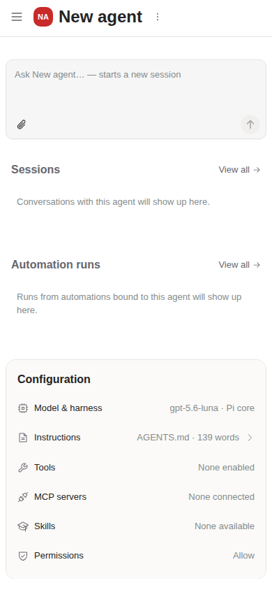
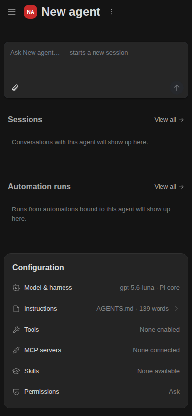

# Deployed QA

## Deployment

PR [#6641](https://github.com/Agenta-AI/agenta/pull/6641) targets `release/v0.115.3`.
The isolated QA origin is represented by `https://qa.example.invalid`, with desktop
at `/w` and mobile at `/m`. This reserved example is not a live deployment link.
The stack has its own database, credentials, and Docker project. Existing stacks
were not replaced.

The backend/defaults code is `92f82133ea`. The two frontends also contain the
overview correction from `648cd5d14e`; that correction changes no backend code.
Later documentation-only commits do not change the deployed implementation.
Public `/w`, `/m`, `/api/health`, and `/services/health` returned HTTP 200.

## Results

| Check | Result |
| --- | --- |
| API/SDK/service canonical default | Allow; real catalog and inspect results agree |
| Build-kit catalog | 15 operations: 11 Allow and four Ask; request_secret preserved |
| Fresh desktop and mobile creation | Allow saved without requiring a provider key |
| Shared editor policy save/reload | Passed on both hosts in the first deployed QA run |
| Hidden restrictions | Saved runner/harness rules and sandbox settings survive policy edits |
| Single environment | Selector absent; Custom secrets remains in Advanced |
| Corrected mobile overview | Permissions stands alone; no Advanced/Sandbox summary |
| Read-only overview rows | No button role, tab stop, expansion attribute, empty padding, or click expansion |
| Populated Instructions | Expands by click and keyboard |
| Desktop overview navigation | Edit and Permissions row both open the real playground |
| Overview persistence recheck | Allow changed to Ask, saved, and visible after mobile reload |
| Visual themes | Actual desktop 1440px and phone 390px layouts checked in light/dark |

The overview recheck used a new account created through the normal email/password
UI and an isolated browser session. It made no model calls. Screenshots below are
from the deployed application, not Storybook or a reconstruction.

## Screenshots

[Desktop overview](qa-desktop-overview.png)

## Limits

- Native model execution and approve/deny/resume remain credential-blocked. Available
  dev credentials did not produce a successful completion; HTTP 400 responses were
  not classified as invalid credentials without further evidence.
- The pre-existing non-Pi Ask relay gap remains outside this UI/defaults change.
- Multiple-environment browser behavior and mobile build-kit Save are not verified.
- A fresh mobile session in the recheck showed no agent or replayable history, so that
  session editor could not be retested. Earlier seeded session-editor QA passed.
- Theme rendering used the application's persisted theme preference. Theme-menu
  interaction was unreliable and is not marked passed.
- The new recheck account had no attached custom-secret values. Custom secrets
  visibility passed, but value preservation was not exercised in that account.

## Checks during the correction

Repository lint and entity-ui typecheck passed. Thirteen focused overview rendering
regressions ran and passed in the background while other work continued. Web test
jobs were not awaited, as requested. Broad pre-rebase suite counts in
[validation.md](validation.md) remain historical evidence, not a live runtime claim.
