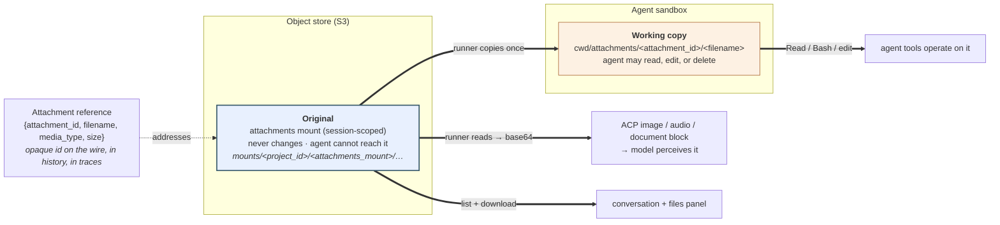
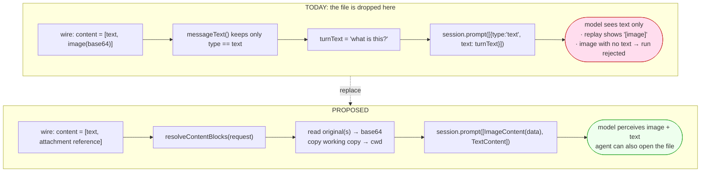
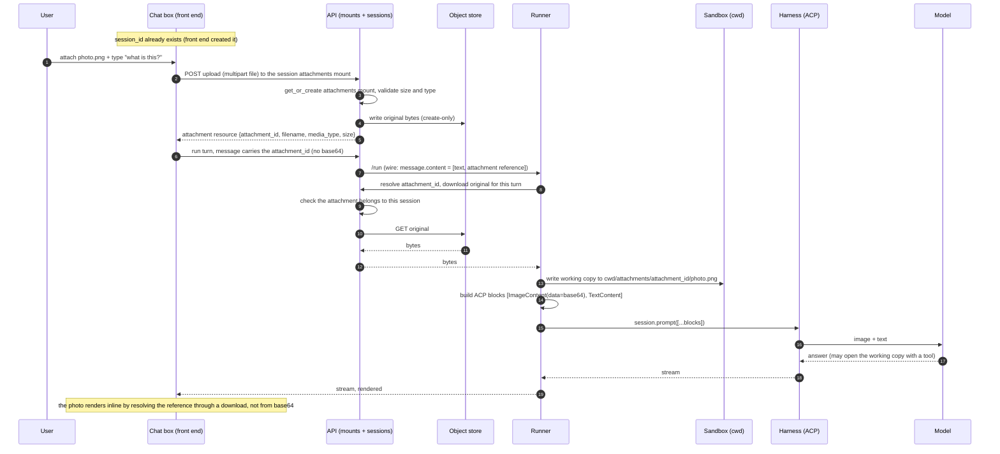
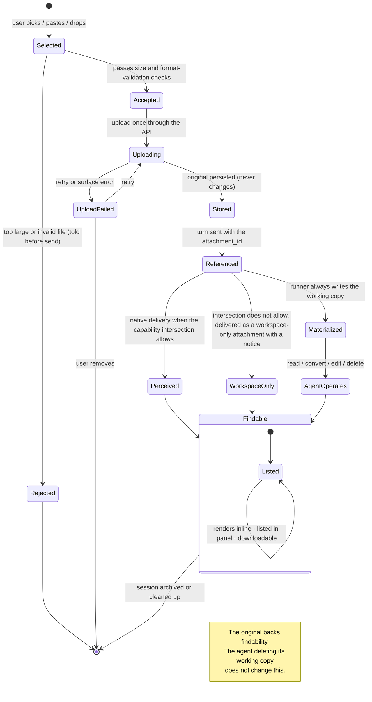
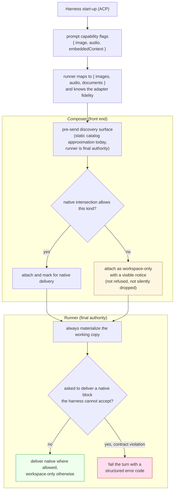
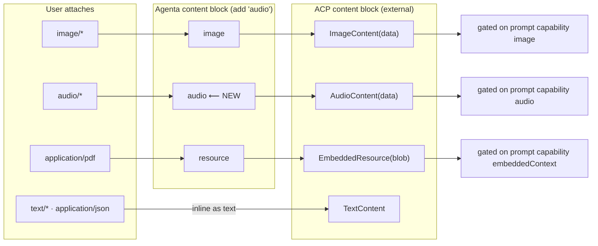
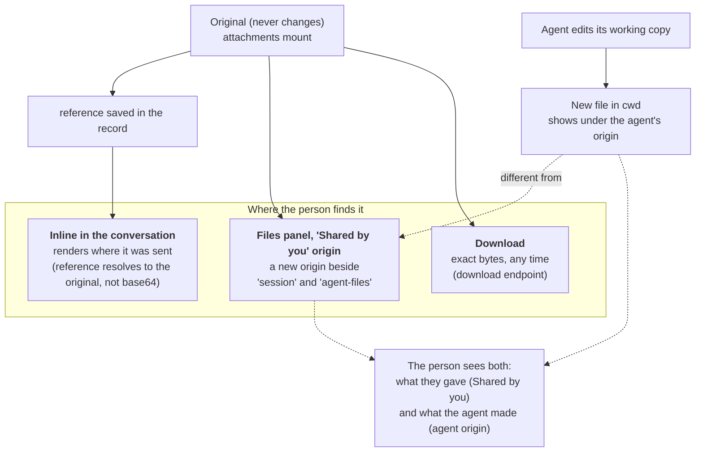
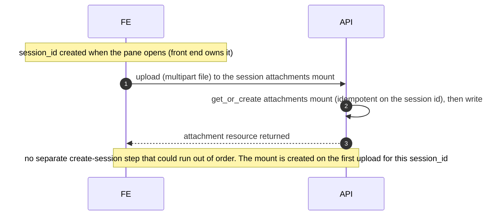

# Design

This file presents the design as a set of decisions. It explains the major choices in full: for each
it lists the options, says what breaks under each, gives the decision, and explains why. The
complete compact log D1 through D11 lives in [decisions.md](decisions.md); D2 and D8 are small enough
that they are stated inline where they arise. This file keeps every interaction diagram, and each
diagram is explained in words before it is shown. Read [research.md](research.md) first for the facts
these decisions rest on. Each decision carries the same D-number here and in the compact log in
[decisions.md](decisions.md), so the two files never disagree about which decision is which.

## The idea in one paragraph

Stop sending file bytes on the wire. When a person attaches a file, the front end uploads it once
through the API's session-mount upload route. The API stores the bytes and returns an **attachment
resource**: a small record it owns, with a server-issued `attachment_id`, the filename, the
media type the server verified, and the size. The message then carries only that `attachment_id`
plus a little display metadata, never the bytes and never raw storage coordinates. Behind that id
the system keeps two copies. One is the **original**, which never changes and which the agent
cannot reach. It is the source of truth for what the model reads, what the files panel lists, and
what a download returns. The other is a **working copy** that the runner writes into the agent's
working directory so the agent's tools can open, convert, or edit it. At the moment the runner
builds a turn, it resolves the `attachment_id` through the API, reads the original, turns it into
the right inline content block, and hands that to the harness in place of the single text block
that is hard-coded today.

## Where the original and the working copy live

The design puts the original in a storage mount that is deliberately not made visible to the agent,
and the working copy in the agent's normal working directory. The reference on the wire points at
the original.

Read the diagram this way. The `attachment_id` travels on the wire, in the saved history, and in
the traces. It names the attachment resource the API owns; only the API knows which object in the
store that resource points at. From the original, three things happen: the runner reads it to build
the model's content block, the runner copies it into the working directory for the agent's tools,
and the files panel lists and downloads it. The working copy is separate and disposable. Note that
the storage key shown as `mounts/<project_id>/<attachments_mount>/...` uses `<project_id>` only as
the tenant partition of the object key. It does not mean the original lives in a "project mount."
There is no project-scoped mount kind; the attachments mount is scoped to the session.

The reference on the wire is an opaque, server-issued id, not the file's storage coordinates. This
is deliberate. If the wire carried the raw storage location and the client's own media type, then a
client could forge a reference to another session's file by naming its coordinates, and the client's
media type would be authoritative even though a client can lie about it. An opaque id avoids both
problems. The storage location stays private to the API, the server verifies the media type on
upload, and the id makes one authorization check natural: does this attachment belong to the
session being run. The full options are in decision D10.

---

## Decision D1: how the file reaches the model

**The question.** How does the file's content actually reach the model so the model perceives it?

**Options.**

- **A. Inline content blocks.** The runner reads the file and puts its bytes into an ACP image,
  audio, or document block in the turn.
- **B. File on disk plus a path in the prompt.** The runner writes the file into the working
  directory and the prompt text mentions the path, trusting the harness to read it.
- **C. Both, for different purposes.** Deliver native modalities inline for perception, and also
  place the file on disk for tool use.

**What breaks under each.** Option B does not give reliable model perception. ACP has no content
type that hands the model a link and guarantees the model reads it, and Claude Code's own Read tool
does not reliably turn an image file into vision input (see [research.md](research.md), sections 4
and 5). So with B alone, a person who shares an image and asks "what is this?" can still get an
answer that ignores the image. Option A alone leaves the agent unable to run a tool over the file,
because the file never lands on disk. For audio there is no disk-read fallback at all, so B cannot
serve audio.

**Decision.** Option C. Deliver native modalities inline so the model perceives them, and also
materialize a working copy on disk so the agent's tools can work on the file. The two are not
redundant; they serve the two separate goals of perception and tool use.

**Why inline is unavoidable for perception (decision D2 in the log).** In ACP the bytes for an
image, audio clip, or embedded document are required and inline. Storing the file in our object
store removes the bytes from the resent history, but it does not remove the requirement that the
bytes be present at the moment the runner builds the turn. The runner reconstructs the inline block
per turn from the stored original.

---

## The one runner call that changes

The whole model-facing change is one place in the runner: the call that hands a turn to the harness.

Today that call sends a single text block. The proposed version resolves the message's references,
reads the originals, materializes working copies, and sends a list of real content blocks. Read the
before-and-after this way: on the left, the runner flattens the message to its text and sends only
that, so the model sees text and a replayed image shows up as the string "[image]"; on the right,
the runner turns each reference into the matching content block and sends the whole list, so the
model perceives the image and the agent can also open the file.

---

## Decision D3: where the original lives

**The question.** Where do we store the unchanging original of a shared file?

**Options.**

- **A. A folder inside the working-directory mount, for example `cwd/_uploads/`.**
- **B. The agent-files mount** (the durable, cross-session agent mount).
- **C. A dedicated session-scoped attachments mount that is not made visible to the agent.**
- **D. A future project-level drive.**

**What breaks under each.** The working directory is last-writer-wins and fully under the agent's
control (see [research.md](research.md), section 2). Concretely, under option A the following breaks
the findability goal: a person shares `report.pdf`, then asks the agent to "clean up the workspace,"
and the agent runs `rm -rf _uploads` or a cleanup script, or simply overwrites `report.pdf` with a
derived version. Now the original the person shared is gone, and "always findable" is false. Even
without malice, an agent that reorganizes its files can move or replace the original. Option B avoids
the deletion problem only if agent-files is also kept out of the agent's reach, but agent-files
exists precisely to be visible and writable by the agent across sessions, so using it would either
change its meaning or expose the original to the same last-writer-wins risk. Its cross-session
lifecycle is also wrong for a per-session attachment. Option D does not exist yet and would couple
this feature to unshipped work; a project drive is also the wrong scope, since an attachment belongs
to one conversation.

**Decision.** Option C. A dedicated attachments mount, scoped to the session, that is created with
the existing `get_or_create_session_mount(session_id, name="attachments")` machinery but is
deliberately never added to the set of mounts made visible in the sandbox. The runner reads it
out-of-band with the signed credentials it already obtains, using a plain object GET rather than a
folder mount (this is possible; see [research.md](research.md), section 2).

**Why its own mount rather than a subfolder.** The technology that makes a mount visible to the
agent (geesefs) exposes the whole mount prefix as a writable folder. There is no way to expose part
of a mount and hide the rest. So "the agent cannot reach the original" forces the original into a
prefix that is not exposed at all, which means its own mount. The attachments mount reuses every
piece of the mount machinery (create, sign, upload, download, list) and differs from the other
mounts in exactly one way: it is left off the sandbox's visible set.

**Why lifecycle alone does not decide the location.** On lifecycle alone, an attachment is session-scoped, exactly like
the working directory, so a subfolder inside `cwd` would have been the simplest choice. The
findability requirement, not the lifecycle, is what pushes the original out of the agent's reach and
therefore into its own mount.

---

## Decision D4: one copy or two

**The question.** Should there be a single copy of the file that the agent both perceives and edits,
or two copies with different rules?

**Options.**

- **A. One copy.** The file lives in one place. The agent reads and edits it there. Findability and
  editing share the same object.
- **B. Two copies.** An unchanging original plus a disposable working copy.

**What breaks under A.** If there is one copy and the agent edits it, the person can no longer find
what they originally shared. If there is one copy and it is read-only, the agent cannot edit it,
which breaks the "agent can work on it" goal. A single copy cannot satisfy both goals at once,
because the two goals want opposite things from the same object.

**Decision.** Option B, two copies. The original never changes and backs findability, download, and
model perception. The working copy is what the agent touches. When the agent edits its working copy,
the result is a new file the agent produces, which shows up under the agent's own origin in the files
panel, while the original stays under "Shared by you." The person then sees both the input they gave
and the output the agent made, which is more useful than having the original silently replaced.

**Why not make it a policy switch.** A read-only-versus-read-write policy on a single copy cannot
satisfy both requirements at once, because findability wants the file safe and tool use wants it
editable. Two copies dissolve the question. There is no global read-only-versus-read-write policy.
The original is always safe; the agent can always do anything it likes to its copy; and whether the
agent changes the file at all is just what the conversation calls for, decided per conversation
rather than by a platform setting.

### The working-copy path and edited copies

The working copy lives at `cwd/attachments/<attachment_id>/<filename>`. The `attachment_id` segment
is what keeps two files from colliding. Two people can each share a file named `report.pdf` in the
same session, and because each one sits under its own id-named folder, neither overwrites the other.

Re-materialization has one rule: the runner restores a working copy only when the file is missing.
It never overwrites a working copy that is already there, because the agent may have edited it and
that edit is real work. So if a later turn arrives and the working copy is present, the runner
leaves it alone. If the working copy was deleted, the runner writes it again from the original.

This creates a divergence that the design accepts on purpose. When a later turn references the same
attachment natively, the runner always reads the **original** to build the model's content block,
while the agent's tools continue to see the **edited** working copy. So the model perceives the file
as it was shared, and the tools operate on the file as the agent has changed it. That is the
intended behavior: the original is the immutable source of truth for perception, and the working
copy is the mutable scratch object for tools.

---

## The successful upload and delivery flow, end to end

Here is the full path for the common case: a person attaches a photo and asks a question, on a warm
turn. Read it as: the session already has an id, so there is no "create the session first" step; the
front end uploads the photo once through the API's session-mount upload route, and the API stores
the bytes and hands back an attachment resource; the front end sends a message that carries the
`attachment_id` instead of the bytes; the runner resolves the id through the API, reads the original
through the API download route, writes a working copy into the agent's directory, builds the real
content blocks, and calls the harness; the model perceives the image and the agent can also open the
file; and the front end renders the photo inline by resolving the reference, not from a giant inline
blob.

The front end never touches the object store directly and never holds write credentials for the
attachments mount. The upload route is the only way bytes enter, which is what decision D7 relies on.

The one change that makes the model perceive the image is at the "build ACP blocks" and
"session.prompt" steps. The working-copy write happens once per file per session, because the working
directory survives across turns, so later turns skip it.

---

## The lifecycle of one attachment

An attachment moves through a few clear states. Read the state machine as: the person picks a file;
it is rejected up front only when it is too large or an invalid file, and an unsupported kind is not
rejected but accepted as a workspace-only attachment with a notice; an accepted file is uploaded
once, after which the original is stored and unchanging; when a turn is sent, the `attachment_id`
goes with it; the runner always writes the working copy, and delivers the bytes to the model only
when the capability intersection allows; and from there the attachment is a durable, findable record
whose findability does not depend on what the agent does to its working copy.

---

## Decision D5: the layered capability model

**The question.** How does the system know whether a given modality will actually reach the model?

**The layered answer.** Whether a modality is perceived natively is the intersection of three
layers. All three must allow it, and the effective capability is the weakest of the three:

1. **What the ACP transport supports.** The prompt capability flag (`image`, `audio`,
   `embeddedContext`) that the adapter advertises. Without the flag the content type cannot even be
   carried across the protocol.
2. **What the harness adapter actually delivers natively.** Adapter fidelity. A flag can be
   advertised while the delivery is lossy or dropped. This is where the two adapters we run diverge
   sharply (see [research.md](research.md), section 4): both pass an image through as a real image,
   but the Claude adapter drops a blob resource entirely and the Pi adapter renders it as a byte
   count. So a document can clear the transport layer and still never reach the model.
3. **What the selected model perceives.** Model modalities. A non-vision model does not see an image
   even when the transport and the adapter would carry it.

Tool use over the file is a separate, fourth consideration, not part of this intersection. It needs
only the working copy on disk and works regardless of all three layers above. An agent whose model
cannot see an image can still run a program over the image bytes. This is why the design places the
file on disk for every attachment, independent of native perception.

**Decision on gating (D5).** Compute the intersection and gate in two places. The composer gates for
the person's benefit, so the person learns before sending whether a file will be perceived. The
runner gates as the final authority, because the composer's view can be stale. Both are needed; the
composer gate is a courtesy and the runner gate is the truth.

Here is the layered capability, per modality, as it stands today.

| Modality | ACP transport (prompt capability) | Adapter fidelity today | Model modalities | Tool use over the working copy |
| --- | --- | --- | --- | --- |
| Image | `image`, advertised by both adapters | native image on both adapters | needs a vision model | always available |
| Audio | `audio`, advertised by neither adapter | no native audio path on either adapter | needs an audio model | always available |
| Document (PDF and similar) | `embeddedContext`, off by default on Pi | Claude drops the blob, Pi renders a byte count | depends on the model and the format | always available |

### Two integration gaps to close

Two facts about the current code mean the layered model needs plumbing that does not exist yet, and
these are stated as work, not as afterthoughts.

- **Capabilities are surfaced only after a run.** Today the runner returns its capabilities in the
  run response, after a run has happened (`protocol.ts`, near line 539). The composer has no way to
  discover them before the person sends anything. So the composer needs a pre-send discovery
  surface. A static approximation derived from the model and harness catalog is acceptable for the
  first release, with the runner remaining the final authority at prompt-build time.
- **The runner error is a plain string.** Today the run error field is a plain string (`error?:
  string`, `protocol.ts`, near line 557), not a structured value. The failure case needs a
  structured error code the front end can recognize and render, so the person sees a specific,
  actionable message rather than a raw string.

### Renaming capability fields without a simultaneous deploy

The internal capability flags need new names (`images`, `audio`, `documents`) and the old ones
(`fileAttachments`, `file_attachments`) need to retire. Do **not** do this as a rename that must land
in every component at the same time. The front end, the API, the SDK, and the runner deploy
independently, so a rename that lands
in one component before another breaks the versions in between. Instead, introduce the new fields
alongside the old ones, keep the old names accepted as aliases through the rollout, and remove the
old names later once every component speaks the new ones. The removal timing is an open question
(see [decisions.md](decisions.md)).

---

## Decision D6: what does attaching a file promise, and what happens on an unsupported kind

**The question.** When a person attaches a file the model cannot perceive, what should happen?
Failing the turn on every unsupported kind would contradict the tool-use goal: an agent can still
process a file its model cannot perceive natively. The resolution is to separate the two meanings of
attach.

**The resolution: separate the two meanings of attach.** "Attach" means two different things, and
untangling them removes the contradiction:

- **Show this to the model.** Deliver the file as a native content block the model perceives.
- **Put this file in the agent's workspace.** Materialize it on disk so the agent's tools can open
  it.

**The design's answer.** Attaching a file **always** puts it in the workspace (it is materialized
for tools). Native delivery to the model happens **when the capability intersection from D5 allows
it**. When the intersection does not allow it, the composer says so up front, and the turn still
proceeds with the file as a workspace-only attachment. That is a visible notice to the person, not a
silent drop and not a failed turn. The runner fails the turn only when it is explicitly asked to
deliver a native block the harness cannot accept, which is a contract violation rather than an
ordinary unsupported kind (for example, a stale front end that asks for native audio the adapter
never advertised). So a silent drop never happens, and a hard failure happens only on a real
protocol contract violation.

**The fuller model, and the first-release simplification.** The richer version of this would attach
a per-attachment intent to each file: *perception required* (fail if the model cannot perceive it),
*perception preferred* (deliver natively when possible, otherwise workspace-only), or *workspace-only*
(never try native delivery). The first release does not build that per-attachment control. It treats
every native kind as *preferred* and offers no per-attachment toggle in the UI. This is the simpler
model that still avoids both the silent drop and the surprise failure.

**What the first release actually promises is an open product decision.** The exact promise the
first release makes (image perception only, versus durable agent input with the workspace copy and
findability) is the product owner's call, recorded as the open decision D11 in [decisions.md](decisions.md)
and restated below.

Read the gating diagram as: the harness advertises capabilities at start-up; the runner maps them
and also knows the adapter fidelity; a pre-send discovery surface gives the composer an
approximation; the composer attaches every file, delivering natively where the intersection allows
and attaching workspace-only with a visible notice where it does not; and the runner, as final
authority, always materializes the working copy and fails the turn only when asked to deliver a
native block the harness cannot accept.

Note the three distinct capabilities: an image maps to `image`, audio maps to `audio`, but a PDF or
document maps to `embeddedContext`, a different flag. Do not treat "supports images" as "supports
documents."

---

## Decision D11 (open): what does attaching a file promise in the first release?

This is the one product decision left for the product owner, tracked as D11 in [decisions.md](decisions.md).
The engineering design supports either answer; the choice is about what to promise a person first.

- **Option A: image perception only.** The first release lets the model see images, with strict
  size and count limits and no durability promise. The file is not guaranteed to remain findable
  after the turn. This is the smallest honest fix for the original bug.
- **Option B: durable agent input.** The first release delivers the full model here: an original
  that never changes, rendered inline in the conversation and downloadable at any time (the
  Files-drawer listing follows in Stage 3); a working copy for the agent's tools; and a reference
  stored in the records. Attaching a file always puts it in the workspace and delivers it natively
  when the capability intersection allows.

**The recommendation** is Option B, durable agent input, with the workspace-always plus
native-when-possible semantics described in D6. It matches the three outcomes in
[context.md](context.md) and avoids shipping a storage-less version that would need rework. The
final call is the product owner's, which is why this is marked open rather than decided.

---

## Decision D7: enforcing that the original does not change

**The question.** The original must not change. What actually enforces that?

**Options.**

- **A. Keep the mount out of the sandbox.** The agent never sees it, so the agent cannot change it.
- **B. Also refuse to hand out any signed credentials for the attachments mount, so the only way
  bytes enter is the create-only upload API route.**
- **C. Also add a read-only credential scope so the runner could read the object store directly and
  even a leaked credential could not write.**

**What each gives.** Option A stops the agent, which is the main threat, but it does not stop a bug
elsewhere in our own code that holds credentials. Option B closes the credential path. Recall from
[research.md](research.md), section 2, that any signed credential is read-write today: the signing
call has no read-only variant, so signing a mount at all hands out write access. So immutability
cannot rest on signed credentials. Recall too that `write_file` overwrites silently, so create-only
is not something the storage layer gives for free. Option B therefore has two parts working
together: never issue a signed credential for the attachments mount, and make the upload route
refuse to overwrite or delete an attachment original. That refusal is an explicit API-level check,
not an assumption, precisely because the storage layer would otherwise overwrite without complaint.
Option C is the strongest and is also the path that would later let the runner read the object store
directly, but it needs a read-only variant added to the signing call, which does not exist today.

**Decision.** Start with A and B together. Originals enter only through the create-only upload route.
The API refuses overwrite and delete for attachment originals, enforced as an explicit check because
`write_file` overwrites silently today. No signed credentials are ever issued for the attachments
mount, because today any signed credential is read-write. A read-only credential scope is the later
hardening that would let the runner read the object store directly; it is noted in
[plan.md](plan.md). Together A and B give real, enforced immutability for the case that matters,
without blocking on the signing change.

---

## Modality to content block mapping

This shows how each kind of attachment becomes a content block on each side. Read it as: the person's
file has a media type; our front end and SDK turn it into an Agenta content block; and the runner
turns that into the matching ACP block that the harness understands. Small text does not need to be a
resource at all; it can be inlined as text, which every harness supports. Audio stays a product goal
(decision D8 in the log): there is no disk-read fallback for audio, so supporting it forces both the
new `audio` block on our side and the inline ACP audio block. The diagram shows the target shape.
Neither pinned adapter delivers native audio or native documents today (see
[research.md](research.md), section 4), so the audio and document rows describe where these paths
lead once the adapters support them, not what works right now.

A hard caution carried from [research.md](research.md), section 4: the document path in this diagram
does not work today. The Claude adapter drops a blob resource entirely, and the Pi adapter renders
it as a byte count, so a PDF sent as an embedded resource reaches neither model as a document. The
diagram shows the intended shape, and the document stage is blocked on adapter work (either
adapter-native document handling, or a decision to deliver documents as extracted text). Images map
cleanly and work end to end. Audio has no native path on either adapter yet, so its row is likewise
a target, not a working path.

---

## Where the person finds a shared file

Findability shows up in three places, all backed by the unchanging original. Read the diagram as: the
original backs a reference saved in the conversation record; that record renders the file inline where
it was sent; the same original is listed in the files panel under a new "Shared by you" origin and can
be downloaded as exact bytes; and separately, when the agent edits its working copy, that produces a
new file under the agent's own origin, so the person sees both what they gave and what the agent made.
Of these surfaces, the inline render in the conversation and the download are part of the first
release; the Files-drawer listing under "Shared by you" is Stage 3 work.

---

## Why the first upload can safely create the mount

A person might attach a file before the very first message, so there is a fair question about whether
the attachments mount exists yet. It does, because the front end owns the session id before the first
message and the upload route's get-or-create is idempotent. Read the diagram as: the front end
already holds a stable session id when the pane opens; the first upload targets the attachments
mount, and the upload route creates that mount if it is not there yet (an idempotent get-or-create
keyed on the session id); so the mount is ready on the first upload, with no separate "create the
session" step that could run out of order against it.

A file uploaded but never sent leaves an unused stored object. That is a cleanup concern, not an
ordering one, and it is handled by the garbage-collection follow-up in [plan.md](plan.md).

---

## Decision D9: can the inline-only version grow into the full version

**The question.** If we shipped the inline-only version first, could we grow it into this full
design later, or would we have to rebuild?

**The inline-only version.** Deliver the file inline to the model only, with no durable storage: the
runner reads the bytes off the wire and builds the content block, exactly at the same seam. This
fixes model perception and nothing else. It does not fix findability, the working copy, the resend
cost, or the storage bloat.

**Does it grow.** Partly, and it is worth being honest about which part. The one seam that both
versions share is the model-facing prompt-builder: both replace the single hard-coded text block
with a resolved list of content blocks at the same call. Shipping the inline-only version first does not
force a rewrite of that seam later. That is the real benefit, and it is a narrow one.

What the inline-only version does **not** save is the rest of the work. Adopting durable references later
is still a system-wide change that touches seven places: front-end persistence (saving a reference
instead of bytes), API storage ownership (the attachment resource, the upload route, the download
route), SDK wire types (the reference form of the content block), runner resolution (turning an id
into bytes), the record schema (a field to hold the reference), authorization (the session-binding
check), and cleanup (removing never-referenced uploads). None of that is avoided by shipping thin
first. So the accurate claim is that the inline-only version avoids rework at the prompt-builder seam, not
that it is a smaller version of a migration that the full version merely extends.

**The one thing not to defer.** The reference-on-the-wire change should not be skipped for long,
because as long as bytes ride the wire and the history, the resend cost, the browser storage
pressure, and the trace bloat all remain. Those are fixed by the reference, which is why the plan
puts the storage and reference work in the first release.

---

## Decision D10: what the reference contains

**The question.** What actually travels on the wire to name a shared file: its storage location, or
an opaque id?

**Options.**

- **A. Raw storage coordinates.** The reference carries the mount id, the object path, and the
  client's own media type, filename, and size. The runner reads the object at those coordinates.
- **B. An opaque, server-issued id.** The upload returns an attachment resource,
  `{attachment_id, filename, media_type, size}`, where the API owns the storage location and the
  authoritative metadata. The wire and the records carry the `attachment_id` plus display metadata.
  The runner resolves the id through the API, which enforces that the attachment belongs to the
  session being run.

**What breaks under A.** Two things. First, forged references: a client that knows or guesses
another session's storage coordinates can name them and read files that are not its own, because the
coordinates are the authority. Second, lying metadata: the client-supplied media type becomes
authoritative even though a client can send any media type it likes, so the server would trust a
value it never verified.

**Decision.** Option B, the opaque server-issued id. The storage location stays private to the API,
so there is nothing for a client to forge. The server verifies the media type on upload, so the
authoritative metadata is the server's, not the client's. And the id makes the key authorization
check natural to express: does this attachment belong to this session. The runner never sees storage
coordinates at all; it hands the id to the API and gets back bytes only when the binding checks out.

**Reason.** An opaque id is the difference between "trust what the client says about where the file
is and what it is" and "let the server own both." The second is the only one that is safe when the
wire is something a client can write.

---

## Decision log and open questions

The compact decision log (D1 through D11) and the open questions are in
[decisions.md](decisions.md), so they can be updated without editing this design narrative.
