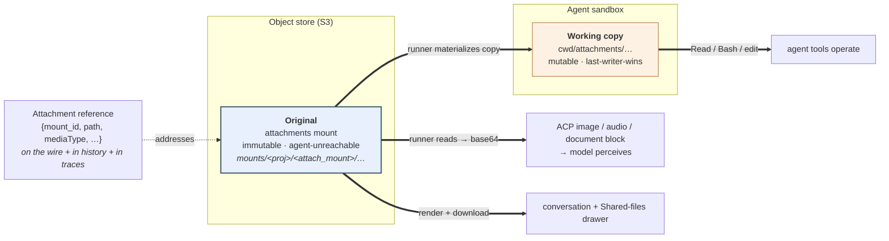
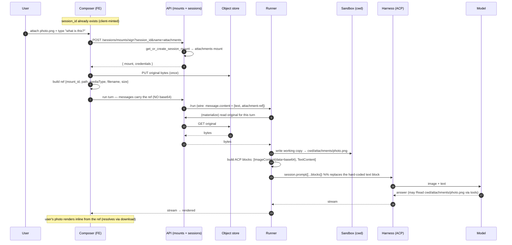
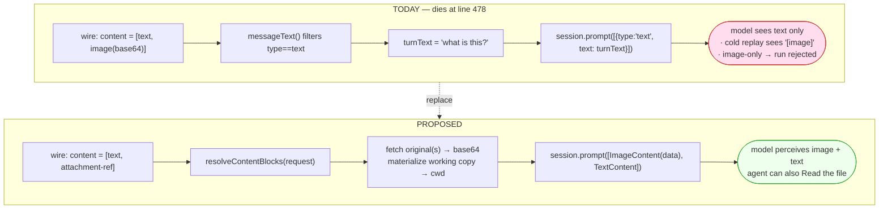
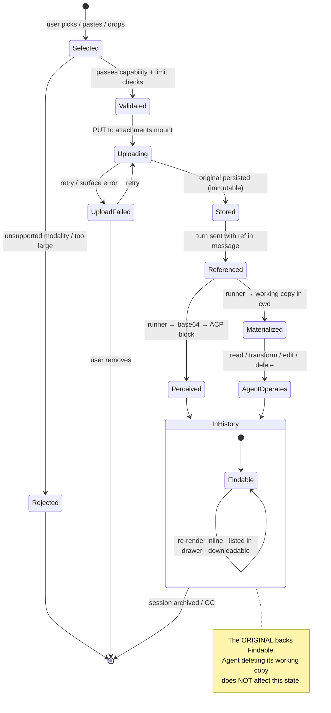
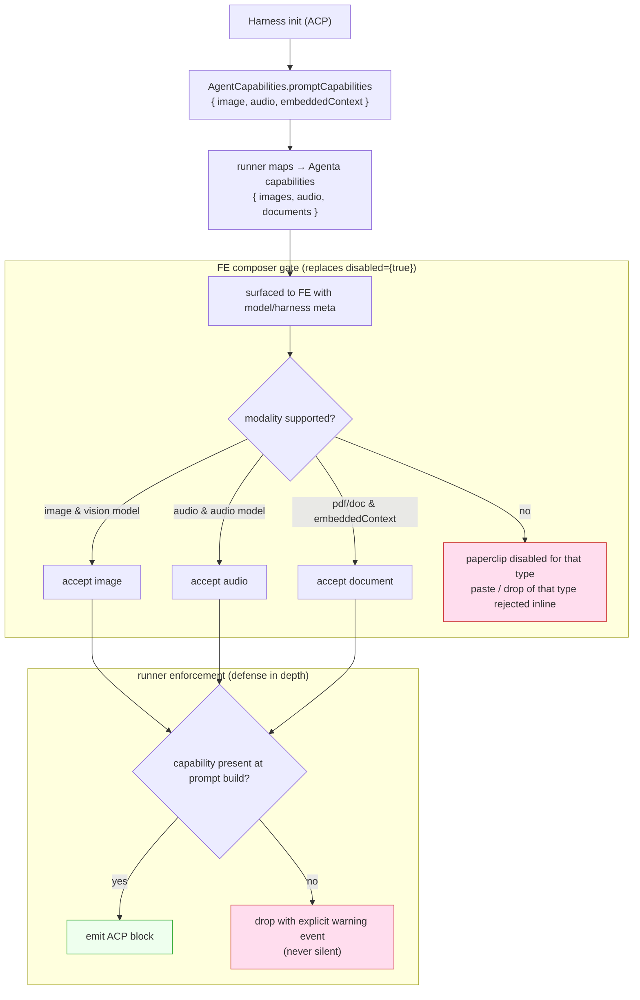
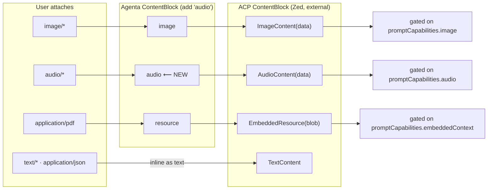
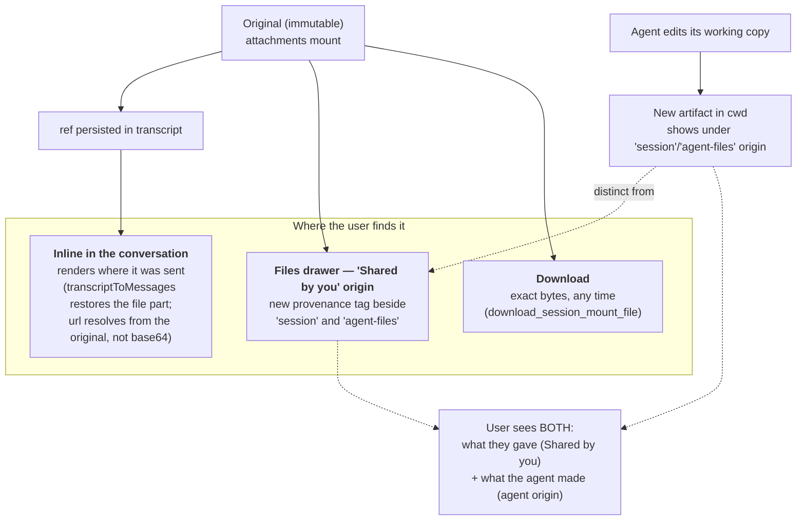
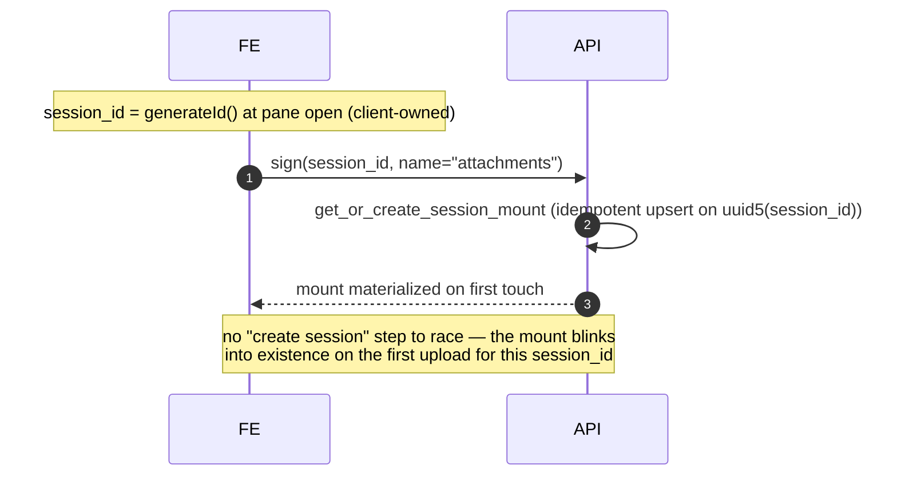

# Proposal: agent multi-modality

Make agent workflows accept images, audio, and documents that the **model perceives** and the
**agent can operate on**, with every shared file a durable, findable record — built on the
existing mounts substrate and gated on the ACP capabilities the runner already receives but
ignores.

Read [context.md](context.md) first for the verified current state and the constraints (ACP is
external and requires inline base64; the mounts substrate; scope).

---

## Goals

1. **Model perceives it.** Image, audio, and document content reaches the model as standard ACP
   content blocks — replacing the single hard-coded text block at
   [`run-turn.ts:478`](../../../../../services/runner/src/engines/sandbox_agent/run-turn.ts).
2. **Agent operates on it.** The file is on the agent's filesystem so its tools can read,
   transform, or edit it — whatever the conversation calls for.
3. **Always findable.** Every file a user shares is a durable, immutable record surfaced inline
   in the conversation and under a "Shared by you" origin in the Files drawer — never lost, even
   after the agent runs.
4. **Honest capability.** Unsupported modalities are refused at the composer, driven by the ACP
   `promptCapabilities` the runner receives — never silently dropped.
5. **No base64 on the hot path.** The wire, the persisted history, and traces carry a small
   reference, not bytes. This dissolves the resend-amplification, localStorage, and tracing
   payload problems (see [context.md](context.md)).

## Non-goals (for now)

- **Video.** Absent from ACP's content model and from every model's metadata; net-new, deferred.
- **Assistant-emitted files.** A runner `file` run-event type is declared but has no emitter
  ([context.md](context.md)); making the agent *return* generated files is separate work.
- **Content-addressed dedup / thumbnailing / transcoding.** Storage optimizations, later.
- **Cross-session attachment reuse.** Attachments are session-scoped; an "attach from a past
  session" picker is out of scope.

---

## The core idea: a reference on the wire, two objects behind it

The wire stops carrying base64. A shared file becomes a small **attachment reference**
`{ mount_id, path, mediaType, filename, size }`. Behind that reference live **two objects with
different rights**, which is what lets "the user always finds it" and "the agent can do anything
to it" both be true at once:

- **The original** — *immutable, agent-unreachable.* Uploaded once to a session-scoped
  **attachments mount** that is **never geesefs-mounted into the sandbox**. It is the source of
  truth: what the model reads, what the drawer lists, what download returns. Nobody edits it.
- **The working copy** — *mutable, in `cwd`.* The runner materializes referenced files into the
  agent's working directory. The agent may read, transform, edit in place, or delete it. Its
  edits become new artifacts; the original is untouched.

Why the original must live **outside** the agent-writable tree: `cwd` is last-writer-wins
([context.md](context.md)) — the agent can delete anything in it. If the shared file lived in
`cwd`, "always findable" would be at the agent's mercy. Because geesefs mounts a whole mount's
prefix as writable, "outside the writable prefix" means **its own mount row** — so the
attachments mount is a *separate mount* from `cwd`, but unlike `agent-files` it is **not added to
the sandbox FUSE set**. It is pure durable storage the FE and runner address directly; the agent
only ever sees materialized copies.

> **Decision trail (honest):** we started at "just a folder inside the `cwd` mount" — correct on
> *lifecycle* (attachments are session-scoped, exactly like `cwd`, so no separate lifecycle is
> needed). The *findability + immutability* requirement then forced the original out of the
> agent-writable prefix, which — given geesefs mounts whole prefixes — means its own mount row.
> This is not the `agent-files` pattern (that mount exists for a *different lifecycle* and *is*
> sandbox-mounted). The attachments mount reuses all the mount machinery
> (`get_or_create_session_mount`, upload, download, sign, list) but is deliberately kept off the
> sandbox mount set. See the [decision log](#decision-log).

---

## Interaction 1 — end-to-end happy path (image + text, warm turn)

Key change is step 12–13: the runner resolves the reference and emits **real ACP blocks**
instead of `[{type:"text", text: turnText}]`. Steps 8–10 (materialize working copy) run once per
session per file — `cwd` is durable across turns, so later turns skip it.

---

## Interaction 2 — before vs after at the seam

---

## Interaction 3 — attachment lifecycle (state machine)

---

## Interaction 4 — capability gating (composer + runner, driven by ACP)

The runner already receives ACP `promptCapabilities` at initialize and ignores them
([context.md](context.md)). We read them, map them to Agenta capability flags, return them to the
FE, and gate both ends.

Note the two distinct capabilities: **image → `image`**, **audio → `audio`**, but
**PDF/document → `embeddedContext`** (ACP `EmbeddedResource`), a *different* flag. The FE gate is
UX; the runner gate is truth. Both required — the FE gate can be stale, the runner gate cannot.

---

## Interaction 5 — modality → ACP block mapping

`text/*` and `application/json` need not be resources at all — small text can be inlined
directly, which every harness supports. Only image/audio/binary-doc require capability gating.

---

## Interaction 6 — findability surfaces

The agent editing "the file in place and handing it back" works and is *better* than mutation:
the edit is a new artifact under the agent origin, the original stays under "Shared by you", and
the user sees both — the input and the derived output — instead of the original being destroyed.

---

## Interaction 7 — first-turn ordering (why there is no race)

The FE holds a stable `session_id` before the first message, and signing *is* provisioning. An
uploaded-but-never-sent attachment leaves an orphan prefix — a **GC** concern (below), not an
ordering one.

---

## What changes, by layer

| Layer | Change |
| --- | --- |
| **FE composer** | Replace `disabled={true}` with capability-driven gating; gate paste/drop by the same rule; upload-first flow (sign → PUT → ref); send refs, not base64. |
| **FE render** | Resolve the user's own attachment inline from the ref (download URL), not the base64 `data:` URL — kills the localStorage bomb. |
| **FE drawer** | Add "Shared by you" as a third origin over the attachments mount, reusing existing provenance tagging. |
| **API / mounts** | Attachments mount = `get_or_create_session_mount(session_id, name="attachments")`, reusing sign/upload/download/list. **Not** added to the runner's sandbox mount set. GC for orphaned uploads. |
| **Agenta wire** | Add an attachment-reference content form; add `audio` to Agenta `ContentBlock` ([`protocol.ts:12`](../../../../../services/runner/src/protocol.ts), [`dtos.py:229`](../../../../../sdks/python/agenta/sdk/agents/dtos.py)). |
| **Runner — resolve** | `resolveContentBlocks(request)`: fetch referenced originals → base64, materialize working copies into `cwd/attachments/`. |
| **Runner — prompt** | Replace [`run-turn.ts:478`](../../../../../services/runner/src/engines/sandbox_agent/run-turn.ts) `[{type:"text"}]` with the resolved block list. Update `resolvePromptText`/`messageText` callers so image-only turns are valid and cold replay ([`transcript.ts:177`](../../../../../services/runner/src/engines/sandbox_agent/transcript.ts)) stops emitting `"[image]"`. |
| **Runner — capability** | Read ACP `promptCapabilities` at init; map to `{images, audio, documents}`; make the write-only [`capabilities.ts:86`](../../../../../services/runner/src/engines/sandbox_agent/capabilities.ts) flags a real gate; surface to FE. |
| **Tracing** | Trace the ref, not the bytes — the Python-side span bomb ([`app.py:155`](../../../../../services/oss/src/agent/app.py)) is gone once history carries refs. |

---

## Phased plan

**Phase 0 — honest gate (small, ship first).** Close the paste/drop leak so the parked feature
is truthful: gate `onPasteFile`/`onDrop` on the same condition as the paperclip. No user can
currently attach anything that reaches the model, so this removes a silent-failure trap while the
real work lands. (Optional — skip if Phase 1–4 land quickly.)

**Phase 1 — storage + reference plumbing.** Attachments mount; FE upload-first flow; the
attachment-reference content form on the Agenta wire. No model behavior yet; attachments upload
and round-trip as refs, render inline from the original. Kills the localStorage/resend/trace
bombs immediately.

**Phase 2 — runner resolve + prompt (image first).** `resolveContentBlocks`; materialize working
copies; replace line 478; fix `resolvePromptText`/cold-replay for non-text turns. Images now
perceived by the model **and** present on the agent's filesystem. Gate on
`promptCapabilities.image`.

**Phase 3 — audio + documents.** Add `audio` to Agenta `ContentBlock`; map audio → `AudioContent`
and PDF → `EmbeddedResource`; gate on `promptCapabilities.audio` / `embeddedContext`. Rework FE
limits (they were arbitrary) to be capability-derived.

**Phase 4 — findability polish + GC.** "Shared by you" drawer origin; orphaned-upload GC; verify
the "edit in place → new artifact, original preserved" flow end to end.

---

## Decision log

| # | Question | Decision | Why |
| --- | --- | --- | --- |
| D1 | URL to the model, or inline base64? | **Inline base64** at the ACP boundary. | ACP `ImageContent.data`/`AudioContent.data` are **required** (Zed's external spec). No URL-to-model path exists. |
| D2 | Does S3/mounts remove the payload problem? | **Only on the hot path.** | Mounts remove base64 from the *resent history*; the model boundary still needs inline bytes, reconstituted per turn by the runner. |
| D3 | One mount (share `cwd`) or a dedicated one? | **Dedicated attachments mount, not in the sandbox FUSE set.** | Lifecycle is session-scoped (like `cwd`) so no *separate lifecycle* — but findability needs the original **agent-unreachable**, and geesefs mounts whole prefixes, so agent-unreachable ⇒ its own mount row. |
| D4 | Read-only or read-write for the agent? | **Neither as a global policy — two objects.** Immutable original + mutable working copy. | "Does the agent modify the file" is the user's call per conversation. Guarantee the *original* survives; let the agent do anything to a *copy*. |
| D5 | First-turn-before-mount race? | **No race.** | FE owns `session_id` before turn one; sign is get-or-create. |
| D6 | How is capability enforced? | **Read ACP `promptCapabilities`; gate FE (UX) + runner (truth).** | The signal already arrives and is ignored. FE gate can be stale; runner gate cannot. |
| D7 | Audio? | **In scope; forces inline `AudioContent`.** | Product requirement; no tool-read fallback for audio. Requires adding `audio` to Agenta `ContentBlock`. |

---

## Open questions

1. **Materialize-per-turn cost vs. persistence.** Working copies persist in durable `cwd` across
   turns, so materialization is once-per-file-per-session. Confirm the runner can address the
   attachments mount out-of-band (it holds mount-signing creds) without adding it to the sandbox
   FUSE set — the intent is object-store GET, not a mount.
2. **Document delivery on Claude specifically.** Claude handles PDFs natively as a document block;
   confirm the ACP `EmbeddedResource(blob)` path lands as a Claude document (vs. being surfaced
   only as a fetchable resource). May differ per harness.
3. **GC policy for orphaned uploads** (uploaded, session abandoned before send). TTL sweep vs.
   reference-count against the transcript.
4. **Working-copy path convention** — `cwd/attachments/` (visible to the agent's `ls`) vs. a
   hidden/namespaced dir. Trades agent discoverability against workspace clutter.
