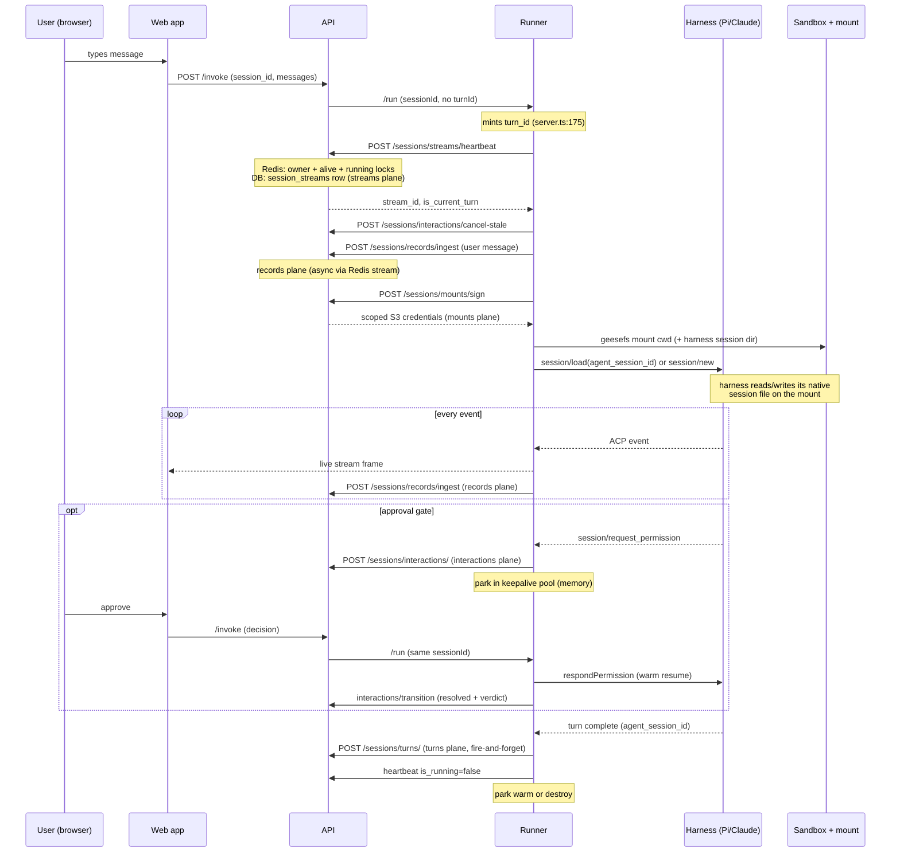
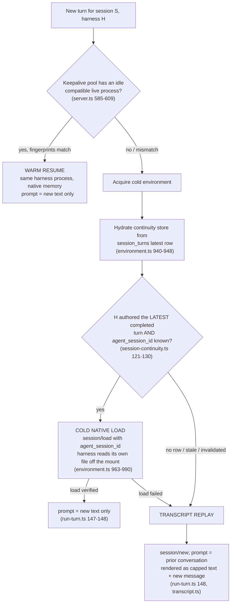
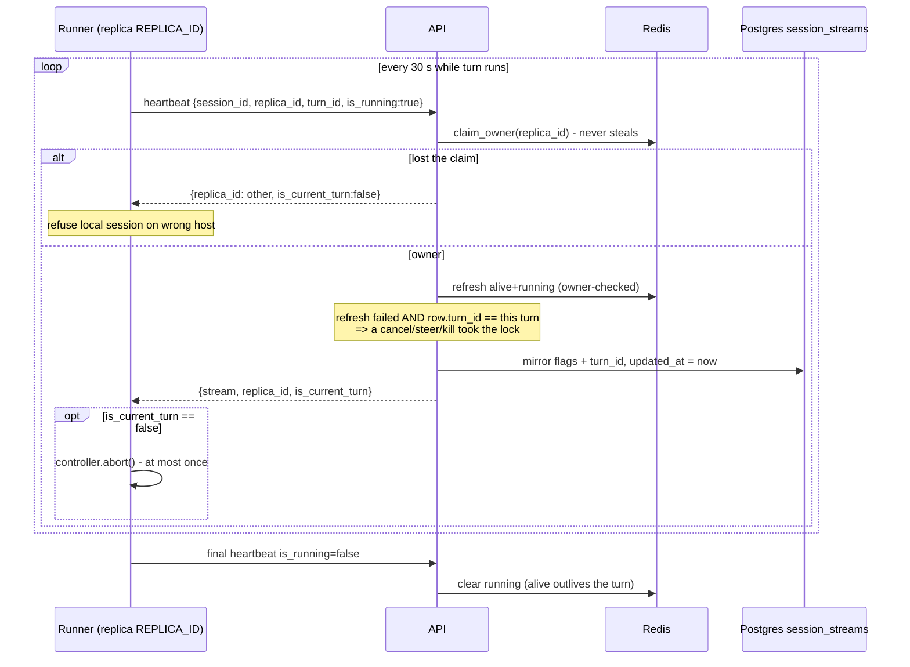
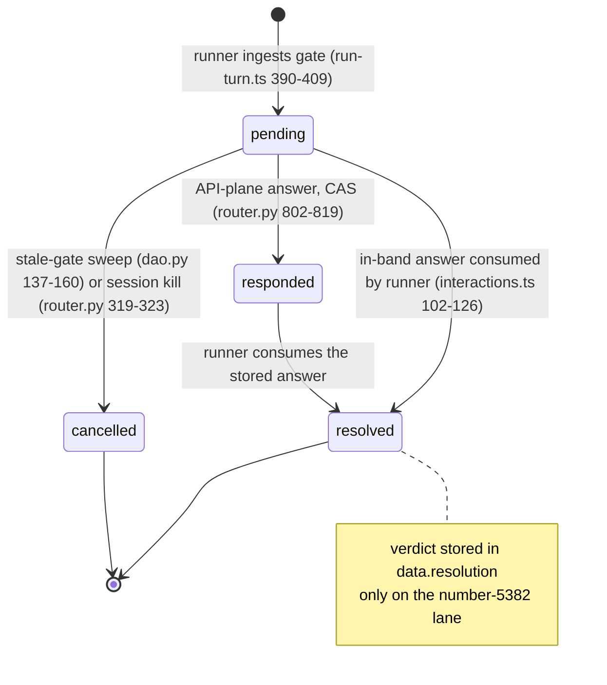

# Session storage architecture

This document describes every storage plane an agent session touches, at working depth,
verified against the code and against real rows in the EE dev database. It is written for
a senior engineer who does not live in this codebase. Every claim carries a file and line
reference. Where the in-flight work (PRs #5375 backend, #5376 runner, #5382 approvals)
differs from `origin/main`, the difference is called out explicitly; all file:line
references are to the current workspace tree, which has those lanes applied.

Two wrong mental models circulated recently and are worth killing on page one:

1. **"The `session_turns` table stores the conversation."** It does not. The conversation
   content lives in two places: the harness's own native session file (a JSONL file on the
   session's durable filesystem) and the `records` table (our own append-style event log,
   in the tracing database). `session_turns` is a small ledger of turn metadata whose main
   job is to remember which harness-native session id belongs to our session so the next
   turn can resume natively.
2. **"The streams plane stores the streamed frames."** It does not. Nothing in
   `session_streams` or Redis holds a single token of output. The runner persists every
   event to the records plane promptly, whether or not anyone is watching. The streams
   plane is liveness and ownership: who is running this session right now, on which
   machine, and has anyone asked it to stop.

## Vocabulary you need before anything else

A **session** is one conversation between a user and an agent. It is identified by a
`session_id`, a caller-supplied string (in practice a UUID minted by the frontend),
validated against `^[a-zA-Z0-9_\-]{1,128}$` (`api/oss/src/dbs/redis/sessions/contract.py:122`).
It is deliberately not a foreign key anywhere: sessions may originate outside our database,
so every table stores it as a bare string correlator scoped by `project_id`
(`api/oss/src/dbs/postgres/sessions/turns/dbas.py:18-19`).

A **turn** is one user-message-to-agent-reply exchange. Two different identifiers both get
called "turn" and confusing them causes real bugs:

- The **turn id** (`turn_id`) is a UUID minted once per *execution*. It is a lock value
  and correlator, not a database primary key. The runner mints it when a session-owned run
  starts (`services/runner/src/server.ts:175-177`); the API mints its own in `_start_turn`
  when a run is started through the coordination endpoint
  (`api/oss/src/core/sessions/streams/service.py:543`). Approval pauses end an execution,
  so one conversation turn that pauses twice for approvals spans three turn ids. This id
  rides heartbeats, record rows, and interaction rows.
- The **turn index** (`turn_index`) is a per-session counter of *completed conversation
  turns*: 0, 1, 2. It is the ordering key of the `session_turns` ledger. Paused executions
  do not consume an index (`services/runner/src/engines/sandbox_agent/run-turn.ts:98-102`).

A **harness** is the coding-agent program the runner drives: Pi or Claude Code. The
enum is `HarnessKind` with values `pi_core`, `pi_agenta`, and `claude`
(`sdks/python/agenta/sdk/agents/dtos.py:45-53`). The runner talks to the harness over
**ACP**, the Agent Client Protocol, a JSON-RPC protocol in which the harness owns its own
conversation state and exposes `session/new` and `session/load` verbs.

The **agent session id** (`agent_session_id`) is the harness's *own* native id for the
conversation. Claude Code generates its ids internally; they cannot be derived from
anything we hold, which is the whole reason a durable mapping table has to exist. Pi's id
appears in its transcript filename (see the mount listing later in this document).

The **runner** is the Node sidecar (`services/runner/`) that executes turns. A **replica**
is one runner container, identified by `REPLICA_ID`, a uuid minted once per process or
injected via `AGENTA_RUNNER_REPLICA_ID` (`services/runner/src/sessions/alive.ts:31-32`).

A **sandbox** is the isolated environment (local daemon or Daytona) where the harness
actually runs. A **mount** is a durable object-store prefix attached into that sandbox via
geesefs, a FUSE filesystem over S3.

With that vocabulary, the six planes this document covers are:

| Plane | Where it lives | One-line job |
|---|---|---|
| Records | `records` table, **tracing** database | The human-readable event transcript the UI rebuilds from |
| Turns | `session_turns` table, core database | The completed-turn ledger: harness session id mapping and per-turn metadata |
| Streams + alive | `session_streams` table plus Redis keys | Liveness, ownership, and the control-signal path |
| Interactions | `session_interactions` table, core database | The stateful approval plane (pending, resolved, verdicts) |
| Mounts | `mounts` table plus the object store | The durable filesystem: workspace files and harness session files |
| Keepalive pool | Runner process memory | Parked live harness processes with TTLs; not storage at all |

## 1. The life of one turn

This walk uses the real QA session `6c23ff5f-79b7-45e3-82c3-52758d0f5fbe` (run on the EE
dev stack on 2026-07-19; the user asked the agent to append a line to two files via two
parallel Bash commands, each gated on human approval). Every step below left a row or log
line quoted later in this document.

**Before the turn.** The user types a message in the agent chat. The frontend holds the
session list and the conversation locally (localStorage,
`web/oss/src/components/AgentChatSlice/state/sessions.ts:76-111`) and sends the message
through the normal workflow invoke path (`/invoke` via the Python agent service). The
invoke request carries `session_id`; it does not carry a turn id, so the runner will mint
one (`services/runner/src/server.ts:161-177`).

**Turn start, coordination plane.** The runner sees the request is session-owned (it has a
`sessionId`) and starts the alive watchdog before running anything
(`services/runner/src/server.ts:956-978`). The first heartbeat, `POST
/sessions/streams/heartbeat`, does three things in one round trip
(`api/oss/src/core/sessions/streams/service.py:258-383`):

- claims the `owner:<project>:session:<id>` Redis key for this replica (affinity, never
  stolen from a live owner),
- establishes the `alive` and `running` Redis locks under this turn id,
- creates or updates the durable `session_streams` row and returns its uuid, the
  `stream_id`, which the runner threads onto the request for later use
  (`services/runner/src/server.ts:976-978`).

**Turn start, interactions and records.** The runner cancels any prior turn's still-pending
approval gates (`services/runner/src/sessions/interactions.ts:137-160`), then persists the
inbound user message as the first record of the turn, with `record_source: "user"`
(`services/runner/src/server.ts:1003-1007`).

**Environment acquire, mounts.** The runner asks the API to sign short-lived, prefix-scoped
credentials for the session's durable mounts (`POST /sessions/mounts/sign`,
`services/runner/src/engines/sandbox_agent/mount.ts:68-131`) and geesefs-mounts them so the
agent's working directory survives sandbox teardown. Pi's native transcript directory is
placed *inside* that working directory, so it rides the same mount
(`services/runner/src/engines/sandbox_agent/pi-assets.ts:37-50`).

**Continuation decision.** The runner decides how the harness gets its memory of the
conversation, in this order: warm resume from the keepalive pool if a compatible live
process is parked (`services/runner/src/server.ts:585-662`), otherwise a cold environment
that attempts a native `session/load` using the `agent_session_id` from the turns ledger
(`services/runner/src/engines/sandbox_agent/environment.ts:927-1004`), otherwise a plain
`session/new` with the prior conversation replayed as text
(`services/runner/src/engines/sandbox_agent/run-turn.ts:146-148`).

**During the turn.** Every ACP event the harness emits is forwarded to the live stream
*and* enqueued for durable persistence in produced order, whether or not the browser is
still connected (`services/runner/src/sessions/persist.ts:95-122`). Delta families are
coalesced (one `message` record instead of fifty `message_delta`s), and tool-family records
get deterministic uuid5 ids so retries upsert rather than duplicate
(`services/runner/src/sessions/persist.ts:160-329`,
`services/runner/src/sessions/record-id.ts:41-47`). The watchdog heartbeats every 30
seconds; each response can carry `is_current_turn: false`, which means a cancel, steer, or
kill took this turn's lock since the last beat, and the runner aborts the in-flight run
(`services/runner/src/sessions/alive.ts:165-207`).

**If a tool needs approval.** The harness raises an ACP permission request. The runner
creates a durable interaction row (`services/runner/src/engines/sandbox_agent/run-turn.ts:390-409`),
persists an `interaction_request` record, parks the live process in the keepalive pool in
state `awaiting_approval`, and ends the execution. The user's approval arrives as a fresh
run request carrying the decision; the runner checks the parked process out, answers the
harness in place (a warm resume), transitions the interaction row to `resolved` with the
verdict, and persists an `interaction_response` record
(`services/runner/src/engines/sandbox_agent/run-turn.ts:417-447`,
`services/runner/src/server.ts:664-744`).

**Turn end.** On a *completed* execution (not paused, not failed) the runner records the
harness's native session id in its in-memory continuity store and appends one row to the
`session_turns` ledger, fire-and-forget: session id, stream id, turn index, harness kind,
agent session id, sandbox id, workflow references, trace id
(`services/runner/src/engines/sandbox_agent/run-turn.ts:832-866`). A paused or failed
execution instead *invalidates* the harness's continuity record, because the harness may
have written a partial turn into its native file and resuming it would replay history the
canonical request never sent (`run-turn.ts:867-870, 887-892`;
`services/runner/src/engines/sandbox_agent/environment.ts:1056-1070`). The persist chain is
drained so the last record lands before teardown (`services/runner/src/server.ts:1021`),
the watchdog releases with a final `is_running: false` heartbeat
(`services/runner/src/sessions/alive.ts:215-219`), and the environment is either parked
warm in the keepalive pool or destroyed.



## 2. Records: the durable transcript

**One sentence.** The records plane is the append-style event log of everything said and
done in a session, stored per event in the tracing database, and it is what the UI replays
when you open a session in a browser that never ran it.

**The question it answers.** "The user opens session 6c23ff5f from a deep link three days
later. What does the chat render?" Answer: `POST /sessions/records/query` returns the
ordered rows, and `transcriptToMessages` folds them into the same UI messages a live stream
would have produced (`web/oss/src/components/AgentChatSlice/assets/loadSession.ts:20-36`,
`web/oss/src/components/AgentChatSlice/assets/transcriptToMessages.ts:4-17`).

### Schema

Table `records`, in the **tracing** database (`agenta_ee_tracing` on the dev stack), not
the core database. The DAO binds to the analytics engine
(`api/oss/src/dbs/postgres/sessions/records/dao.py:21-25`); the table was created by
tracing migration `oss000000002_add_records.py` and extended with turn and span columns by
`oss000000004_add_records_turn_span.py` (unmerged, PR #5375).

Columns (`api/oss/src/dbs/postgres/sessions/records/dbas.py`,
`api/oss/src/dbs/postgres/sessions/records/dbes.py`):

- `project_id`, `record_id`: the composite primary key. `record_id` is either a
  producer-supplied deterministic uuid5 (tool-family events) or a backend-minted uuid4
  fallback; it is **not** time-ordered (`dbas.py:24-33`).
- `session_id`: bare string correlator.
- `record_index`: producer-stamped per-turn ordinal. It restarts at 0 on each execution, so
  reads order by ingest time first and index second
  (`dao.py:112`, comment at `dbas.py:41-46`).
- `timestamp`: producer (runner) event time, distinct from `created_at` (ingest time).
- `record_type`: the event type (`message`, `thought`, `tool_call`, `tool_result`,
  `interaction_request`, `interaction_response`, `usage`, `done`, `error`).
- `record_source`: who authored it, `"agent"` or `"user"`
  (`services/runner/src/sessions/persist.ts:18-19`).
- `attributes`: the full event payload as JSONB, truncated at 64 KB at the producer
  boundary (`api/oss/src/core/sessions/records/streaming.py:22, 64-77`).
- `turn_id`, `span_id`: forward-fill-only bridge columns, added by the unmerged migration.
  `turn_id` is the execution turn id (the lock value); `span_id` is the OTel span id of the
  invoke span, a 16-hex string that is deliberately **not** a UUID
  (`api/oss/src/core/shared/dtos.py:53-57`, `dbas.py:7-21`). Old rows stay null; the
  tracing database is never backfilled.

### Who writes, who reads, when

The **runner** is the only producer. `buildPersistingEmitter` wraps the live emitter so
every event is both streamed and persisted, decoupled from client connection state
(`services/runner/src/sessions/persist.ts:160-329`). Writes go to
`POST /sessions/records/ingest` authenticated as the invoke caller; the route does not
write the database directly. It publishes to the Redis stream `streams:records`
(`api/oss/src/apis/fastapi/sessions/router.py:508-538`,
`api/oss/src/core/sessions/records/streaming.py:51-97`), and a separate worker consumes
batches, applies EE ingest quotas, and upserts rows
(`api/oss/src/tasks/asyncio/sessions/records_worker.py:19-160`). The write is therefore
asynchronous: a record is durable in Redis quickly and in Postgres within the worker's
batch delay. On a local stack with the worker not running, records silently never land,
which is a documented frontend fallback case (`loadSession.ts:16-18`).

Ordering within a session is guaranteed by a per-session promise chain in the runner
(`persist.ts:34-35, 95-122`), three retries with backoff per event, and a drain before
teardown so the last event survives the race (`persist.ts:129-137`,
`server.ts:1021`). A persist failure after retries is logged and dropped.

Readers: the frontend replay path (`querySessionRecords` via the Fern client,
`web/packages/agenta-entities/src/session/api/api.ts:56-77`) and the two records read
endpoints (`router.py:439-506`).

### Lifecycle and mutability

This is the subtlety the word "append-only" hides: the write is an **upsert**, not an
insert. `ON CONFLICT (project_id, record_id) DO UPDATE` replaces the body, timestamp, and
turn/span columns of an existing row (`dao.py:84-97`). For randomly-minted ids that never
matters. For tool-family records the id is deterministic:
`uuid5(session_id:tool_call_id:record_type)` (`record-id.ts:41-47`), which is what makes a
streamed snapshot of one tool call, or a resume that re-announces it, settle onto one row
instead of duplicating. The cost is that the id is **not turn-scoped**: a later result for
the same tool call id silently overwrites the earlier row, preserving nothing. Incident
db58551b demonstrated this rewriting history (defect 5,
`docs/design/agent-workflows/scratch/debug-concurrent-approvals-db58551b.md`). The fix
plan (scope stable ids by turn) is agreed but not implemented. Until then, treat records as
a faithful *rendering* log and an unfaithful *audit* log.

Deletion: never deleted by the session delete fan-out. The root delete explicitly leaves
records alone because they live in another database; tracing retention owns them
(`api/oss/src/core/sessions/service.py:83-91`).

### Real rows

From `agenta_ee_tracing.records`, session 6c23ff5f (the QA session):

```
record_id     | a1aed416-34c4-40ae-a2e1-71299944e802
session_id    | 6c23ff5f-79b7-45e3-82c3-52758d0f5fbe
record_index  | 0
timestamp     | 2026-07-19 21:33:32.372+00
record_type   | message
record_source | user
turn_id       | 0cf4b750-7ddb-45d1-89b1-c2ef24802823
span_id       | cc57875a43d73a25
created_at    | 2026-07-19 21:33:32.661106+00
attributes    | {"text": "Append the line \"hello from QA\" to agent-files/README.md and
                to agent-files/NOTES.md, as two separate Bash commands issued in parallel
                in the same turn.", "type": "message"}
```

And the answer half of a gate, the `interaction_response` record type added by the
approvals work (note the deterministic uuid5 record id, and that its `turn_id`
`1eea4b3d...` differs from the request's `0cf4b750...`: the answer landed on the warm
resume execution, not the execution that asked):

```
record_id    | 526453ac-b565-5dd1-8199-6d11504fb15d
record_type  | interaction_response
record_index | 2
turn_id      | 1eea4b3d-b810-4125-a65c-faffc242551a
attributes   | {"id": "56efc8f2-1830-44f5-87c3-62d8ab598997", "kind": "user_approval",
               "type": "interaction_response",
               "payload": {"approved": true, "toolCallId": "toolu_016ZdXAopbBhuFDqKCV5Pyvv"}}
```

The full type distribution for this session: 7 message, 4 done, 3 thought, 2 each of
interaction_request, interaction_response, tool_call, tool_result, usage.

### Intended design and unmerged parts

The `turn_id` and `span_id` columns (unmerged migration `oss000000004`) exist to group a
session's records by turn and to bridge each turn to observability. The
`interaction_response` record type is on the open #5382 lane; `origin/main`'s protocol has
no answer event at all, which is the root cause of the "answered cards resurrect as
pending on reload" bug (defect 4 of the db58551b report).

### Sharp edges

- `api/oss/src/core/sessions/records/utils.py` contains `strip_replay` and
  `coalesce_events`, ported from the PoC, with **no callers** anywhere in the API (verified
  by repo-wide grep) and no producer of the `__replay__:` marker in the runner or SDK. The
  replay-stripping invariant its docstring describes is currently enforced by nothing.
- On an approval resume, the recovered prior prompt is re-persisted as a fresh user
  message row, duplicating it in the transcript (db58551b defect 5, still open).
- `record_index` is only meaningful within one execution; cross-turn ordering rides on
  ingest time (`dao.py:112`), so a clock or worker-batching anomaly can interleave turns.

## 3. Turns: the completed-turn ledger

**One sentence.** `session_turns` is one row per *completed* conversation turn, storing no
conversation content: it maps our session id to the harness's native session id, records
which harness and sandbox served the turn, and carries per-turn metadata (turn index,
workflow references, trace id, stream id).

**The question it answers.** "The runner restarted overnight and its memory is empty. The
user sends the next message in session 6c23ff5f. Can the harness resume natively, and with
which of its own session ids?" Answer: read the latest turn row; if this harness authored
the latest completed turn, `session/load` its `agent_session_id`; otherwise fall back to
text replay (`services/runner/src/engines/sandbox_agent/session-continuity-durable.ts:104-148`).

### Why a ledger, and why it replaced the states blob

On `origin/main` this job is done by `session_states`, a mutable one-row-per-session JSON
blob that the runner syncs with a GET-then-PUT read-modify-write
(`git show origin/main:services/runner/src/engines/sandbox_agent/session-continuity-durable.ts`,
module docstring). That shape has two structural problems: the read-modify-write races
with itself across executions, and a blob folds away history, so you cannot ask "which
sandbox served turn 3". The unmerged redesign (#5375/#5376) replaces it with an
append-only table where a write is a plain INSERT, no read, no merge, no race
(`session-continuity-durable.ts:151-163` in the workspace tree), and the *current* resume
pointer is a query, not a stored fold: `ORDER BY turn_index DESC LIMIT 1`, which a late
lower-index write can never win (`api/oss/src/core/sessions/turns/service.py:1-6, 69-79`).
The states table is physically dropped by migration
`oss000000017_drop_session_states.py`.

Separately, the ledger is deliberately **not** the conversation and **not** the harness
file. The harness file is the only faithful representation of what the model saw (including
its own native caching and tool-call framing); duplicating it would drift. What the
platform needs is a trust decision ("is the native file a faithful resume point?") plus
lookup keys, and that is exactly what the ledger stores.

### Schema

Table `session_turns`, core database, created by unmerged migration
`oss000000014_add_session_turns.py`. Columns
(`api/oss/src/dbs/postgres/sessions/turns/dbas.py`,
`.../turns/dbes.py`):

- `project_id`, `id`: composite primary key; `id` is a uuid7, so insertion-ordered.
- `session_id`: bare string, NOT NULL, indexed with project.
- `stream_id`: NOT NULL foreign key to `session_streams(project_id, id)`. Every turn is
  written with the stream row id in hand because the first heartbeat returned it
  (`dbes.py:26-30`, `services/runner/src/server.ts:976-978`).
- `turn_index`: NOT NULL, with a **unique** index on `(project_id, session_id,
  turn_index)` (`dbes.py:37-43`). This index is what caught the warm-environment
  double-append bug (see sharp edges).
- `harness_kind`: `pi_core` / `pi_agenta` / `claude`, enum-validated at the DTO.
- `agent_session_id`: the harness-native session id. Nullable, because a harness might not
  surface one.
- `sandbox_id`: which sandbox served the turn, e.g. `local/127.0.0.1:43699` or a Daytona
  id. Read by the sandbox-reconnect ladder.
- `references`: JSONB list of `{id, slug, version}` entity references (the workflow,
  variant, and revision this turn ran), GIN-indexed with `jsonb_path_ops` for containment
  queries (`dbes.py:44-49`). This is what the root session list joins on.
- `trace_id`, `span_id`: observability bridge. `trace_id` is a 128-bit OTel trace id
  stored as UUID; `span_id` would be the 16-hex span id (`dbas.py:36-38`).
- `start_time`, `end_time`: reserved timing columns.

### Who writes, who reads, when

One writer: the runner, at the end of a completed execution only.
`run-turn.ts:835-866` is the gate, and reading it precisely matters:

```ts
if (
  stopReason !== "paused" &&
  env.continuityTurnIndex !== undefined &&
  sessionId &&
  env.session?.agentSessionId
) {
  ...store.record(...);
  void (deps.appendSessionTurn ?? appendSessionTurn)(...)
```

So a row is written only when the turn ran to completion AND the harness surfaced a native
session id. A pause (`stopReason === "paused"`) or any error path instead calls
`invalidateContinuity` (`run-turn.ts:867-870, 887-892`), which drops the in-memory record
so the harness can never be judged load-eligible from a possibly-partial native file. The
absence of a ledger row for the latest turn is therefore *information*: it means the
native file is not trusted and the next cold start must replay text.

The append is fire-and-forget (`void ... .catch(() => {})`, `run-turn.ts:853-865`): a
failed append never fails the turn, it only degrades a future restart to replay.

Readers:

- `hydrateHarnessSessionFromDurable` at environment acquire, which restores the
  cross-harness latest-turn counter first and then this harness's own record, never
  clobbering a live in-process record with a stale read
  (`session-continuity-durable.ts:104-148`,
  `environment.ts:937-948`).
- The sandbox-reconnect ladder, which reads the latest row's `sandbox_id`.
- The root session list: `POST /sessions/query` with `references` filters resolves
  matching sessions *through the turns' GIN index* rather than denormalizing references
  onto the stream row (`api/oss/src/core/sessions/service.py:41-74`).
- The turns API surface: `POST /sessions/turns/` (append), `POST /sessions/turns/query`,
  `GET /sessions/turns/{turn_id}` (`api/oss/src/apis/fastapi/sessions/router.py:1065-1178`).

### The continuation decision tree

Eligibility is strict: a harness may `session/load` if and only if it authored the
conversation's most recently completed turn (`session-continuity.ts:114-130`). A harness
that is behind (the user switched from Pi to Claude and back) is stale and must replay,
because its native file is missing the intervening turns.



### Real rows

Both completed turns of QA session 6c23ff5f, from `agenta_ee_core.session_turns`. Note
what is present (the resume keys, the references, the trace id) and what is absent (any
conversation content, and `span_id`/`start_time`/`end_time`, see sharp edges):

```
id               | 019f7c4d-44e6-77f2-9f7b-2409615f9092
project_id       | 019e8df5-2a58-7501-8fe2-56f7b332bd00
session_id       | 6c23ff5f-79b7-45e3-82c3-52758d0f5fbe
stream_id        | 019f7c4c-713f-7a23-a764-14552c3b9f6a
turn_index       | 0
harness_kind     | pi_core
agent_session_id | 019f7c4c-7a8f-7c80-bd0f-05458ab62fab
sandbox_id       | local/127.0.0.1:32905
references       | [{"id": "019f5b6c-bfa9-7073-a8aa-203b215cea22", "slug": "new-agent-mrj6ykqaa2"},
                    {"id": "019f5b6c-bfef-7fa0-b0cc-14b52b3b6734", "slug": "new-agent-mrj6ykqaa2.default"}]
trace_id         | f06ec815-62d9-cde0-0092-f99cff2e1b09
span_id          | (null)
start_time       | (null)
end_time         | (null)
created_at       | 2026-07-19 21:34:26.534971+00

id               | 019f7c4f-1e80-7861-9fb4-84d204967da4
turn_index       | 1
agent_session_id | 019f7c4c-7a8f-7c80-bd0f-05458ab62fab
sandbox_id       | local/127.0.0.1:43699
trace_id         | 981b03a3-0618-2355-c618-44bed54988ee
created_at       | 2026-07-19 21:36:27.776117+00
```

Both turns carry the *same* `agent_session_id` (one continuous Pi conversation) but
*different* `sandbox_id`s: turn 1 ran on a different local daemon port after the first
environment was torn down, and native continuity still held because Pi's session file
lives on the durable mount, not in the sandbox.

### Intended design and unmerged parts

The entire plane is unmerged (PRs #5375/#5376). The two bugs found during QA on 2026-07-19
are fixed on those lanes: `turn_index` is now computed per turn from the shared store, not
frozen per environment acquire (commit `cae71e49ce`, `run-turn.ts:98-102`; the original
failure is documented in
`docs/design/agent-workflows/scratch/debug-session-turns-append-500.md`), and a duplicate
append now surfaces as HTTP 409 via `EntityCreationConflict` instead of an anonymous 500
(commit `494cdd7996`, `api/oss/src/dbs/postgres/sessions/turns/dao.py:48-68`).

Deletion is a hard delete by session id, part of the delete fan-out
(`turns/dao.py:182-196`). There is no soft delete for turns.

### Sharp edges

- `span_id`, `start_time`, and `end_time` are wired through the whole stack (wire model,
  DTO, column) but the runner's append call passes only `streamId`, `agentSessionId`,
  `sandboxId`, `references`, and `traceId` (`run-turn.ts:857-863`), so those three columns
  are null in practice, as the real rows show.
- The ledger row does not carry the execution `turn_id` (the lock value that records and
  interactions are stamped with). There is currently **no direct join** from a records row
  to its ledger row; the only shared key is `stream_id` plus time. Anything that wants
  "the records of turn 2" has to go through the trace id or timestamps.
- Because rows exist only for completed turns, a session whose last execution paused has a
  ledger that is one turn behind reality, by design. Consumers must treat "latest row" as
  "latest *trusted* resume point", not "latest activity".

## 4. Streams and the alive lock: liveness and ownership

**One sentence.** The streams plane is one durable row per session plus a nest of Redis
locks, telling the platform whether the session is claimed, whether a turn is executing
right now, who is watching, and which runner replica owns it; it stores no output.

**The question it answers.** "Two browser tabs send a message to session S at the same
moment. Who wins, and how does the loser find out?" Answer: the first `send` acquires the
`alive` lock in `_start_turn`; the second gets `SessionTurnInUse` and an HTTP 409 whose
body carries the liveness snapshot (`api/oss/src/core/sessions/streams/service.py:103-119,
536-561`, `router.py:146-153`).

### The Redis nest

The contract file is the canonical source of truth and the TypeScript side mirrors it
exactly, pinned by a golden fixture test
(`api/oss/src/dbs/redis/sessions/contract.py:1-30`,
`services/runner/src/sessions/contract.ts:1-8`). Every key is project-scoped because
`session_id` is caller-supplied and only unique per project; omitting the project segment
would let a caller in project A cancel project B's runs (`contract.py:13-19`).

| Key | Value | TTL (default) | Meaning |
|---|---|---|---|
| `alive:<proj>:session:<id>` | turn_id | 3600 s | Session claimed; at most one in-flight run |
| `running:<proj>:session:<id>` | turn_id | 3600 s | A turn is actively executing right now |
| `attached:<proj>:session:<id>` | watcher_id | 60 s | A client is watching the live view |
| `owner:<proj>:session:<id>` | replica_id | 120 s | Which runner container owns this session |
| `displaced:<proj>:session:<id>` | (pub/sub) | n/a | Attach-steal notifications |

TTL defaults live in `api/oss/src/utils/env.py:1286-1317` (`AGENTA_SESSIONS_REDIS_*`).
The nest invariant is `alive ⊇ running ⊇ attached`: attached implies running implies
alive. `resumable` (alive and not running) and `reattachable` (running and not attached)
are derived client-side, never stored (`streams/dtos.py:12-22`). Lock operations are
owner-checked Lua scripts (release-if-owner, claim-or-read;
`contract.py:87-106`, implementations in `api/oss/src/dbs/redis/sessions/locks.py`).
`claim_owner` never steals from a live different owner; kill uses the unconditional
`force_clear_owner` twin precisely because a surviving owner key would lock the dead
session out of every other replica for the rest of its TTL (`locks.py:262-318`,
`streams/service.py:227-230`).

### The durable row

Table `session_streams`, core database, merged on main (migration `oss000000008`); the
header columns are the unmerged migration `oss000000015`. One row per `(project_id,
session_id)` (`api/oss/src/dbs/postgres/sessions/streams/dbes.py:22-74`):

- `id`: uuid7; this is the `stream_id` the turns ledger references.
- `session_id`: bare string, unique with project.
- `flags`: JSONB `{is_alive, is_running, is_attached}`, the durable **mirror** of the
  Redis nest. Redis is authoritative; the row mirrors for durability, orphan sweeps, and
  observability (`dbes.py:33-41`). The read path overlays the live Redis snapshot onto the
  row before returning it (`streams/service.py:385-409`).
- `turn_id`: the current execution's turn id, the Postgres mirror of the lock value; null
  when idle (`dbes.py:48-50`). The heartbeat handler also uses it to disambiguate "first
  heartbeat of a new turn" from "the lock was taken by a cancel"
  (`streams/service.py:287-303`).
- `name`, `description`: the session header, written only by the rename edit, never by
  the heartbeat path, so liveness writes cannot churn identity fields and vice versa
  (`streams/dtos.py:54-59`, `streams/service.py:422-464`).
- `updated_at` doubles as the heartbeat timestamp (`dbes.py:37`).
- `sandbox_id` is deliberately NOT here; it lives on the latest turns row (`dbes.py:40`).

### The command matrix

`POST /sessions/streams/` is a state mutation over the lock nest, and it runs nothing
itself; the runner is the only component that executes
(`streams/dtos.py:76-89`, `streams/service.py:1-13`). The mode is derived from the
request shape:

| inputs | force | Mode | Effect (`streams/service.py:81-177`) |
|---|---|---|---|
| yes | no | `send` | 409 if alive; else mint turn_id, acquire alive+running, stamp row |
| yes | yes | `steer` | force-drop holder's locks, mint new turn |
| no | no | `cancel` | force-drop locks, mark row ended, run nothing |
| no | yes | `attach` | steal the attached lock, return a watcher_id |

`kill` (`DELETE /sessions/streams/`) is distinct from cancel: cancel ends the current
turn and the session can resume; kill ends the session. It collapses the whole nest
including owner affinity, displaces any watcher, calls the runner's own `/kill` directly
so the sandbox is actually torn down rather than left to idle-TTL eviction, marks the row
ended, soft-deletes it, and cancels every pending interaction
(`streams/service.py:202-256`,
`api/oss/src/core/sessions/streams/runner_client.py:30-62`,
`router.py:296-324`).

### The heartbeat and the control-signal path

The runner heartbeats every 30 seconds while a session-owned turn runs
(`services/runner/src/sessions/alive.ts:21-23, 165-223`). Each beat carries two distinct
ids: `replica_id` (the container, drives owner affinity) and `turn_id` (the execution,
proves lock ownership) (`streams/dtos.py:99-103`). The handler claims ownership without
stealing; a replica that lost the claim mutates nothing and is told the true owner
(`streams/service.py:266-284`), which the runner uses to refuse serving a local sandbox
session on the wrong host (`session-continuity.ts:157-210`).

The response carries `is_current_turn`. It is false when this turn's lock was gone or
reassigned at the moment of the beat, disambiguated against the row's recorded `turn_id`
so a turn's very first heartbeat is not misread as an interruption
(`streams/service.py:287-336`, dtos docstring `streams/dtos.py:112-127`). The runner wires
this to `controller.abort()`, firing at most once: this is the plumbing that makes a
cancel, steer, or kill actually reach an in-flight run, with a worst-case latency of one
heartbeat interval (`alive.ts:147-207`, `server.ts:962-974`). Before W7.4 landed on this
lane, a cancel raced against the heartbeat's nx re-acquire would silently re-arm the same
lock and the interruption never surfaced.

The heartbeat response also carries the `session_streams` row id, which is how the runner
gets the `stream_id` for the turn append without an extra round trip
(`alive.ts:52-59`, `server.ts:976-978`).



### Real row

From `agenta_ee_core.session_streams`, the QA session:

```
id            | 019f7c4c-713f-7a23-a764-14552c3b9f6a
project_id    | 019e8df5-2a58-7501-8fe2-56f7b332bd00
session_id    | 6c23ff5f-79b7-45e3-82c3-52758d0f5fbe
turn_id       | 0cf4b750-7ddb-45d1-89b1-c2ef24802823
flags         | {"is_alive": true, "is_running": true, "is_attached": false}
created_at    | 2026-07-19 21:33:32.351413+00
updated_at    | (null)
name          | (null)
description   | (null)
```

Read this row with the mirror caveat in mind: it still says alive and running two days
after the session went idle, and `updated_at` is null even though the deployed runner
logged successful `running=false` heartbeats. The dev deployment predates part of the
in-flight lane, and the row is exactly what the design says it is, a best-effort mirror.
The Redis keys have long expired, so `fetch` (which overlays the live snapshot,
`streams/service.py:385-409`) reports the truth while the raw row does not. Never read
`flags` off the table directly.

### Intended design and unmerged parts

The command matrix, kill's direct runner hop, the header edit, `is_current_turn`, the
hard-delete and archive verbs, and the concurrency cap
(`check_runner_concurrency_limit`, 429 above `AGENTA_SESSIONS_REDIS_CONCURRENCY_LIMIT`,
default 1000 running streams per project, `streams/service.py:530-534`,
`router.py:264`) are all on the unmerged #5375 lane. The frontend deliberately does not
surface steer, cancel, or attach yet, because without runner cooperation beyond W7.4 they
would be lock edits with no user-visible effect
(`web/packages/agenta-entities/src/session/api/api.ts:276-280`).

### Sharp edges

- `HEARTBEAT_WRITE_THRESHOLD_SECONDS` exists in both contracts (`contract.py:37`,
  `contract.ts:19`) but nothing consumes it; every heartbeat currently writes the row.
- The heartbeat is fail-open on network error (`alive.ts:57-59, 99-104`): a transient API
  blip neither aborts a healthy run nor fabricates a stream id, but it also means a
  partitioned runner keeps executing while its locks expire, and a `send` on another
  replica could then start a second run of the same session. The owner guard only
  protects local sandboxes (`session-continuity.ts:189-210`).
- `count_active` counts rows whose mirrored flags say running (`streams/dao.py:274-292`);
  a stale mirror (see the real row above) inflates the concurrency count until an orphan
  sweep or the next heartbeat corrects it.

## 5. Interactions: the stateful approval plane

**One sentence.** `session_interactions` holds one row per human-in-the-loop gate (an
approval request, a user-input request, or a client tool call), with a lifecycle status
and, since the current approvals lane, the stored verdict; it is the plane that knows
whether anyone still needs to answer something.

**The question it answers.** "Which approvals in this project are still waiting on a
human, and when the user clicks approve on a webhook-delivered card, how does the platform
resume the right workflow?" Answer: query rows with `status = 'pending'` (there is a
partial index for exactly this,
`api/oss/src/dbs/postgres/sessions/interactions/dbes.py:41-45`), and the row's stored
workflow `references` let the respond endpoint re-invoke the same workflow revision with
the answer as inputs (`router.py:764-858`).

### Schema

Table `session_interactions`, core database, merged on main (migration `oss000000009`).
Columns (`interactions/dbas.py`, `interactions/dbes.py`):

- `project_id`, `id`: composite primary key.
- `session_id`, `turn_id`: correlators; `turn_id` is the execution id, used by the
  stale-gate sweep to spare the current turn's own gates.
- `token`: the gate's identity, unique per `(project_id, session_id, token)`
  (`dbes.py:19-24`), which is what makes the runner's fire-and-forget ingest retry-safe.
- `kind`: `user_approval` | `user_input` | `client_tool`
  (`interactions/dtos.py:10-13`).
- `status`: lifecycle only, **not** the verdict: `pending` (awaiting a reaction),
  `responded` (answered via the interactions API plane), `resolved` (answered via the
  messages plane, or the runner consumed the answer), `cancelled` (runner abandoned the
  gate; no one is waiting) (`dtos.py:16-22`).
- `data`: JSON with `request` (tool name and args), `references` (pointers to the
  workflow/variant/revision this turn was running, stored so respond can re-resolve the
  live revision at invoke time, not a copy of the revision itself,
  `services/runner/src/sessions/interactions.ts:19-25`), `selector`, and `resolution`
  (the verdict: `{"verdict": "approved"|"denied", "tool_call_id": ...}`).
- `flags`: delivery bookkeeping `{delivered_in_band, delivered_webhook}`.

### Lifecycle

Transitions are guarded in the DAO: only `pending` and `responded` rows can transition;
`resolved` and `cancelled` are terminal (`interactions/dao.py:92-135`). The respond
endpoint does a compare-and-set flip to `responded` first, so of two concurrent
responders exactly one enqueues the resume invoke (`router.py:802-829`). Resolution
payloads are validated: only a `user_approval` may carry one (`router.py:643-668`).



### Who writes, who reads, when

The **runner** creates a row whenever an execution pauses on a gate
(`run-turn.ts:390-409` calling `interactions.ts:57-95`), idempotently (unique token). It
transitions the row to `resolved`, now with the verdict, when it forwards a stored or
in-band decision to the harness (`run-turn.ts:417-447`, `interactions.ts:102-126`). At
every turn start it sweeps *other* turns' still-pending gates to `cancelled`, sparing
gates the incoming request answers in-band (`server.ts:979-988`,
`interactions.ts:128-160`, `dao.py:137-160`). The **API** writes on the respond path
(the CAS flip) and on kill (cancel everything pending).

Readers: the interactions query/fetch endpoints (`router.py:711-762`), and any future
inbox UI. The frontend today rebuilds approval cards from *records*, not from this table,
which is why persisting the answer half as an `interaction_response` record mattered so
much (db58551b defect 4).

### Real rows

A resolved gate carrying the verdict (the new shape, from a 2026-07-20 session on the dev
stack):

```
id         | 019f7f14-d642-78a2-baf3-ecf7773759bc
session_id | 782ff288-d47e-40ac-b277-f29d79c833d1
token      | 2b8cdd00-27f1-4fd0-9994-1d2af50ca3a3
kind       | user_approval
status     | resolved
resolution | {"verdict": "approved", "tool_call_id": "call_P70SW0Y8VEBrfhT78JZpnQZi|fc_039f2633..."}
created_at | 2026-07-20 10:31:39.843001+00
updated_at | 2026-07-20 10:32:01.213554+00
```

And the incident session db58551b's first gate, the pre-verdict shape (status flipped,
`turn_id` null, no resolution stored; note the full request and references in `data`):

```
id           | 019f79cb-62e1-7b40-96fe-207ab3381e87
session_id   | db58551b-f986-44ec-b939-d6b10b35717a
token        | f6f8384d-51f4-4bba-9b78-ca299f45465c
kind         | user_approval
status       | resolved
data         | {"request": {"tool": "Bash", "args": {"command": "printf '\nParallel write
               test completed.\n' >> agent-files/README.md"}},
               "references": {"workflow": {...}, "workflow_variant": {...},
                              "workflow_revision": {"version": "1", ...}}}
flags        | {"delivered_in_band": true, "delivered_webhook": false}
created_at   | 2026-07-19 09:53:20.097197+00
updated_at   | 2026-07-19 09:53:22.469477+00
```

### Intended design and unmerged parts

The verdict (`resolution`) and the `interaction_response` record are on the open #5382
lane ("reliable multi-gate approvals"); on `origin/main` the schema field exists but no
producer writes it, which is exactly what the db58551b incident report identified as the
root defect. The `respond_task` seam in the router lets the resume invoke run on a taskiq
worker when wired, with an inline blocking invoke as the fallback
(`router.py:821-857`).

### Sharp edges

- The runner refuses to create the row when the run context carries no
  `workflow_revision` reference (`run-turn.ts:399-400`), because respond could not
  re-invoke anything. This is why QA session 6c23ff5f has interaction *records* but zero
  `session_interactions` rows (verified against the dev database): its run context carried
  workflow and variant references but no revision. Gates in that state are answerable
  in-band only, invisible to any interactions-plane inbox.
- `turn_id` is nullable and was null on the older rows above; the stale-gate sweep's
  "spare the current turn" logic only works when the runner stamps it.
- The row's `data.request` stores raw tool args. These are redacted by the runner's
  redactor on the records plane but go to interactions verbatim; treat this table as
  sensitive as the transcript.

## 6. Mounts: the durable filesystem

**One sentence.** A mount is a per-session object-store prefix (bucket key prefix
`mounts/<project_id>/<mount_id>`) that geesefs attaches into the sandbox as a real
directory, carrying both the agent's workspace files and the harness's native session
files, which is what makes native continuation survive sandbox teardown.

**The question it answers.** "The sandbox that served turn 0 is gone. Turn 1 starts on a
brand new sandbox. Where does Pi find the conversation it is supposed to resume?" Answer:
in `agents/sessions/pi/` inside the session's `cwd` mount, which the new sandbox mounts
before the harness starts; the file's name carries the `agent_session_id` from the turns
ledger.

### Storage model

The `mounts` table (core database, migration `oss000000006`, plus session-slug scoping in
`oss000000011` and `agent_id` in the unmerged `oss000000016`) stores mount *identity*:
`project_id`, `id`, optional `session_id`, optional `agent_id`, a slug, and a name
(`api/oss/src/core/mounts/dtos.py:25-34`). File contents live in the object store
(SeaweedFS on the dev stack, any S3 on prod), under
`[namespace/]mounts/<project_id>/<mount_id>/<path>`
(`api/oss/src/core/mounts/service.py:145-155`). A session mount's slug is deterministic:
`__ag__session__<uuid5(session_id)>__<name>` (`mounts/service.py:72-78`), so re-signing
re-attaches the same files.

The sessions router exposes a session-scoped view over the same table (no storage of its
own, `api/oss/src/core/sessions/mounts/service.py:1-6`): list, query, upload, download,
and the important one, `POST /sessions/mounts/sign?session_id=...&name=...`
(`router.py:861-1062`). Sign get-or-creates the named mount for the session and returns
short-lived credentials scoped to that prefix, minted from the store's STS endpoint; the
master key never leaves the API (`api/oss/src/core/mounts/dtos.py:97-113`). The `name`
parameter defaults to `cwd`; any other name creates an additional session-scoped mount
with its own prefix, which is how per-harness transcript mounts work
(`router.py:996-1005`, `mount.ts:59-67`).

### Where the harness session files actually live

This is the detail that keeps getting misremembered, so here it is per harness and per
sandbox type (`services/runner/src/engines/sandbox_agent/mount.ts:133-179` and
`pi-assets.ts:31-50`):

- **Pi, everywhere:** Pi's transcript directory is pointed *into the workspace* via
  `PI_CODING_AGENT_SESSION_DIR = <cwd>/agents/sessions/pi`. Since cwd IS the durable
  `cwd` mount on both local and Daytona runs, Pi's native files ride that one mount and
  no separate transcript mount is needed. The separate `pi-sessions` mount name exists
  for the case where Pi's default home-relative dir is in use
  (`mount.ts:174-177`) but the runner always overrides via the env var.
- **Claude, remote (Daytona) sandboxes:** Claude Code keeps transcripts under
  `~/.claude/projects`. That directory gets its own mount, name `claude-projects`,
  signed and geesefs-mounted inside the sandbox (`mount.ts:171-172, 724-761`).
  Deliberately NOT `~/.claude` whole, which would sweep OAuth credentials into the
  durable store (`mount.ts:162-164`); credentials are re-injected per run instead
  (`mount.ts:136-139`).
- **Claude, local sandboxes:** none of the harness-dir mounting runs. `~/.claude` is the
  runner container's own disk (`mount.ts:716-719`), which persists across turns only as
  long as that container lives. A local Claude session's native continuity does not
  survive a runner container rebuild even though the turns ledger row does.

### Who writes, who reads, when

The runner signs and mounts at environment acquire; the agent reads and writes through
the FUSE mount for the whole turn; teardown unmounts. The API reads and writes the store
directly for the browser file endpoints (upload/download,
`router.py:1025-1062`) and deletes prefixes on the session delete fan-out
(`api/oss/src/core/sessions/service.py:100-103`). Archive and unarchive soft-toggle the
mount rows alongside the stream row (`service.py:109-146`). Sign failure is never fatal:
the run proceeds without the mount, degraded (`mount.ts:64-67, 84-90, 749-756`).

### Real listing

The QA session's single mount row, then the actual store listing showing the harness
session file sitting next to the workspace files. The Pi JSONL filename embeds the same
`agent_session_id` (`019f7c4c-7a8f...`) the turns ledger rows carry, which is the whole
mapping made visible:

```
id         | 019f7c4c-7166-76f1-8477-37bcc3cede5d
project_id | 019e8df5-2a58-7501-8fe2-56f7b332bd00
session_id | 6c23ff5f-79b7-45e3-82c3-52758d0f5fbe
agent_id   |
slug       | __ag__session__de851259-3492-5fab-a416-f249737f7d4d__cwd
name       | cwd
created_at | 2026-07-19 21:33:32.390727+00
```

```
/buckets/agenta-store/mounts/019e8df5.../019f7c4c-7166-76f1-8477-37bcc3cede5d
├── AGENTS.md
├── agent-files/            (README.md, NOTES.md - the files the QA turn appended to)
└── agents
    ├── sessions
    │   └── pi
    │       └── 2026-07-19T21-33-34-736Z_019f7c4c-7a8f-7c80-bd0f-05458ab62fab.jsonl
    └── skills
        └── 07b95dee.../ (.agenta-skill-set.json, build-an-agent/SKILL.md, references/...)
```

### Intended design and unmerged parts

`agent_id` on the mount row (unmerged migration `oss000000016`) is the beginning of
agent-scoped (as opposed to session-scoped) durable directories, the agent-mount work
tracked in PR #5247. Direct geesefs write-through is the accepted default for harness
transcript dirs; copy-around-lifecycle is the documented fallback only if append-heavy
JSONL write amplification bites (`mount.ts:141-146`).

### Sharp edges

- The signed credentials expire in minutes; a parked keepalive session whose mount
  credentials pass expiry is evicted to cold on resume rather than continued
  (`server.ts:722-724`).
- Deleting a session deletes mount rows and prefixes, which includes the harness session
  files, so native continuity is correctly destroyed with the session. But local Claude
  files on the runner's own disk are outside that fan-out entirely.
- geesefs over an in-network store needs the tunnel endpoint for remote sandboxes
  (`mount.ts:186-204`); a mis-detected endpoint degrades silently to no mount.

## 7. The keepalive pool: memory, not storage

**One sentence.** The keepalive pool is a per-replica in-process map of parked *live*
harness processes (sandbox, ACP connection, native model context all still warm), kept
for a short TTL so the next message in the same conversation continues in place; it
survives nothing and stores nothing durable.

**The question it answers.** "The user replies within a minute. Does the platform pay a
cold sandbox start and a context re-feed?" Answer: no; the dispatch checks the pool key
`<project_id>:<session_id>`, validates fingerprints, checks the environment out, and runs
the turn against the same process (`services/runner/src/server.ts:585-624`).

### Mechanics

The pool (`services/runner/src/engines/sandbox_agent/session-pool.ts`) holds
`LiveSession` entries: an opaque environment handle, a config fingerprint, a history
fingerprint, a credential epoch, a state, an LRU stamp, and one idempotent teardown
closure (`session-pool.ts:30-43`). States are `busy`, `idle`, `awaiting_approval`, and
`destroyed` (`session-pool.ts:24`). Two park flavors exist with different TTLs, visible in
the QA session's own runner log:

```
[keepalive] park key=019e8df5...:6c23ff5f... ttl=300000ms state=awaiting_approval poolSize=2
[keepalive] resume key=019e8df5...:6c23ff5f... gates=1 answered=1 carried=0 approve=1 reject=0 tool=Bash
[keepalive] park key=019e8df5...:6c23ff5f... ttl=60000ms state=idle (re-park) poolSize=2
```

An idle park (60 s) awaits the next message; an approval park (300 s) awaits a human. On
checkout the dispatch validates: config fingerprint equality, history fingerprint
equality (an edited transcript must not continue a mismatched live memory), credential
epoch, and a fresh trailing user message; any mismatch evicts and degrades to cold
(`server.ts:585-607`). The approval-resume branch deliberately relaxes the config and
credential checks, because every approval reply carries freshly minted per-turn material
that can never equal the parked one, and requiring it would evict a perfectly good live
session on every approval (`server.ts:664-726`). Capacity is LRU with idle-only
eviction; parking is best-effort and a full pool simply tears the session down as before
(`session-pool.ts:186-232`).

**Interaction with every durable plane.** The pool is why turn indexes must be computed
per turn from the shared store rather than per environment acquire (a warm environment
serves many turns; the frozen-index bug produced the duplicate `turn_index=0` appends in
the 500 report). A parked-then-resumed approval consumes one conversation turn index
across multiple executions and turn ids. A client disconnect during a session-owned run
does not abort the run but does veto parking, so a disconnected user's session is
destroyed at turn end (`server.ts:932-941`).

**It is not storage.** A runner restart empties the map; the design degrades to cold
native load via the turns ledger, then to transcript replay, never to an error
(`session-continuity.ts:1-9`). Nothing in the pool is readable from outside the process;
the closest external signal is the streams plane's liveness flags.

## 8. Cross-plane summary

| Plane | Nature | Writer | Reader | Lifetime | Carries workflow refs? | Survives runner restart? |
|---|---|---|---|---|---|---|
| Records (`records`, tracing DB) | Upsert log (append-style, stable-id upserts) | Runner via async ingest worker | Web replay, records endpoints | Until tracing retention; untouched by session delete | No (only turn_id/span_id bridge) | Yes |
| Turns (`session_turns`, core DB) | Append-only INSERT, hard delete on session delete | Runner, at completed-turn end only | Runner hydrate/reconnect, root session query, turns endpoints | Until session delete | Yes (`references`, GIN) | Yes |
| Streams row (`session_streams`, core DB) | Mutable, 1 row per session | API only (heartbeat, commands, header edit) | Web session fetch, concurrency cap, turns FK | Soft-deleted by kill/archive, hard by delete | No | Yes (mirror may be stale) |
| Alive nest (Redis) | Ephemeral TTL locks | API only (runner drives via HTTP) | API (liveness, 409 bodies) | Seconds to an hour, TTL | No | Yes (Redis), but locks expire |
| Interactions (`session_interactions`, core DB) | Mutable rows, guarded transitions | Runner (create/resolve/sweep), API (respond CAS, kill cancel) | Interactions endpoints, future inbox | Until session delete (hard) or cancel (terminal state) | Yes (in `data.references`) | Yes |
| Mounts (rows + object store) | Filesystem (mutable), deterministic slugs | Agent through geesefs; API file endpoints | Agent, browser file panel, harness `session/load` | Until session delete (prefix wiped); archive is reversible | No (`agent_id` coming) | Yes |
| Keepalive pool | Process memory | Runner dispatch | Runner dispatch | 60 s idle / 300 s approval TTL | n/a | **No** |

Authority rules worth memorizing: Redis beats the streams row for liveness; the harness's
native file beats everything for conversation content; the turns ledger beats the
in-memory continuity store after a restart but never beats a live in-process record
(`session-continuity-durable.ts:124-127`); records beat the browser's localStorage on
reload but localStorage is the fallback when records are absent.

## 9. What is missing

Six known gaps, each tied to the plane it lands on.

**1. Agent references on records and streams.** The turns ledger carries workflow
references and mounts are growing `agent_id` (migration `oss000000016`), but neither the
records rows nor the `session_streams` row says which agent a session belongs to. The
session list can only be filtered per agent by joining through the turns' references
(`api/oss/src/core/sessions/service.py:57-67`), and a records row is agent-anonymous
forever. Lands on: records (new column, forward-fill only, tracing DB is never
backfilled) and streams (a reference or `agent_id` on the row, written by the first
heartbeat or the invoke path).

**2. Trace id at turn start.** The turn append happens only at turn *end*
(`run-turn.ts:847-866`), so a turn that pauses, crashes, or is cancelled leaves no ledger
row and no turn-to-trace link, and even a healthy turn is invisible to trace-join queries
until it completes. `span_id`, `start_time`, and `end_time` are already in the schema but
never populated (the append passes only `traceId`, `run-turn.ts:857-863`). The fix shape
is a start-of-turn write (or enriching the heartbeat's row stamp) plus passing the span
and timing fields at completion. Lands on: turns, with the streams heartbeat as the
plausible carrier.

**3. Session titles have no home.** The mutable `session_states` table is dropped
(migration `oss000000017`) and the streams row grew `name`/`description` with a dedicated
rename endpoint that cannot collide with liveness writes
(`PUT /sessions/streams/header`, `streams/service.py:411-464`, migration
`oss000000015`). But the frontend still keeps titles in localStorage
(`AgentChatSession.title`,
`web/oss/src/components/AgentChatSlice/state/sessions.ts:34-40`) and the rename UI in
`SessionTagBar` writes only local state. Until the chat writes and reads the header, a
title exists only in the browser that set it. Lands on: streams (server side is done on
the unmerged lane) and the frontend session state.

**4. Cross-plane deletion.** `DELETE /sessions/` fans out to turns, interactions, mounts
(rows and prefixes), and the stream row (`api/oss/src/core/sessions/service.py:76-107`),
but: records are untouched by design (cross-database, tracing retention owns them,
`service.py:90-91`), live Redis keys are not cleared by delete (only kill collapses the
nest), local Claude native files on the runner's disk are outside any fan-out, and the
browser's localStorage copy of the conversation survives everything. A "delete this
conversation" product promise currently leaves the transcript readable in two places.
Lands on: every plane; records and the frontend cache are the real holes.

**5. Cancel and steer.** The lock-side machinery is complete on the unmerged lane (the
command matrix, `force_cancel_alive`, W7.4's `is_current_turn` wired to
`controller.abort()`), but the signal reaches the run only at heartbeat granularity (up to
30 s), abort is the bluntest possible cancel (no graceful harness stop, no partial-turn
record), and the frontend deliberately does not expose steer or cancel because the
user-visible effect would be a stalled stream (`api.ts:276-280`). Steer additionally needs
the "new text supersedes parked work" dispatch semantics that db58551b defect 6 showed are
missing. Lands on: streams (signal), keepalive pool and runner dispatch (semantics),
records and turns (how an aborted turn is represented; today it is only an invalidated
continuity record and no ledger row).

**6. Live mid-turn attach.** `attach` mode steals the attached lock and returns a
`watcher_id`, and the displaced channel exists for teardown notifications
(`streams/service.py:158-177`, `contract.py:60-73`), but there is no endpoint that
replays the in-flight turn's frames to a new watcher; the live stream is a property of the
original `/run` HTTP response. A reload today gets the records replay (complete only up to
the persist chain's lag) and then silence until the turn ends. Real mid-turn attach needs
a frame buffer or a Redis-stream relay per turn on the runner or API. Lands on: streams
(the lock half exists), records (the catch-up source), and a missing delivery path that
belongs to neither yet.

## 10. Glossary

- **ACP.** Agent Client Protocol; the JSON-RPC protocol between the runner and a harness,
  with `session/new`, `session/load`, `session/prompt`, and permission-request verbs.
- **agent session id.** The harness's own native id for a conversation
  (`session_turns.agent_session_id`). Claude's cannot be derived; Pi's appears in its
  transcript filename.
- **alive lock.** Redis key asserting "at most one in-flight run per session"; value is
  the owning turn id; cleared only by kill or TTL, so a session can be alive but idle.
- **attach / watcher.** Attach mode claims the `attached` lock for a `watcher_id`,
  displacing any prior watcher via the `displaced` pub/sub channel.
- **cold native load.** Continuation tier two: a fresh environment whose harness resumes
  its own session file via `session/load` with the ledger's `agent_session_id`.
- **gate.** A human-approval request raised by the harness mid-turn; stored as an
  interaction row and an `interaction_request` record.
- **geesefs.** FUSE-over-S3 filesystem used to attach mount prefixes into sandboxes.
- **harness.** The coding-agent program the runner drives: Pi (`pi_core`, `pi_agenta`) or
  Claude Code (`claude`).
- **heartbeat.** The runner's 30-second `POST /sessions/streams/heartbeat`, refreshing
  locks, claiming ownership, mirroring the row, and carrying back `is_current_turn`.
- **keepalive pool.** Per-replica in-memory map of parked live environments; 60 s idle
  TTL, 300 s approval TTL; not storage.
- **mount.** A durable object-store prefix (`mounts/<project>/<mount_id>`) attached into
  the sandbox; identified by a row in the `mounts` table.
- **nest.** The containment invariant of the Redis locks: alive ⊇ running ⊇ attached.
- **owner / replica.** The `owner` Redis key maps a session to the runner container
  (`replica_id`) currently serving it; claimed without stealing.
- **park / warm resume.** Parking keeps a live harness process in the keepalive pool at a
  turn boundary; a warm resume checks it out and continues in place.
- **record.** One event row in the `records` table (tracing database): a message,
  thought, tool call or result, interaction request or response, usage, done, or error.
- **replica id.** Stable per-process id of one runner container
  (`AGENTA_RUNNER_REPLICA_ID` or a minted uuid).
- **session-owned run.** A `/run` request carrying a `sessionId`; it survives client
  disconnect, heartbeats, and persists records; a non-session run aborts on disconnect.
- **states (historical).** The dropped `session_states` table: a mutable per-session JSON
  blob previously used for continuity and superseded by the turns ledger and the streams
  header.
- **steer.** Command-matrix mode: force-cancel the current holder and start a new turn
  with new inputs; lock-level only today.
- **stream id.** The uuid7 primary key of the `session_streams` row; returned by the
  heartbeat and stored on every turns row. Despite the name, no frames flow through it.
- **transcript replay.** Continuation tier three: `session/new` plus the prior
  conversation rendered as capped text in the prompt.
- **turn id.** Per-execution uuid lock value and correlator; distinct from `turn_index`,
  the per-session completed-turn counter.
- **verdict.** The approve/deny outcome of a gate, stored in
  `session_interactions.data.resolution` and as an `interaction_response` record; distinct
  from the row's lifecycle `status`.
