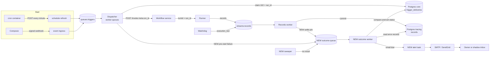

# Plan: Automation Failure Alerts

This file is the full design. The evidence for each statement about today's code is in
[research.md](./research.md). Decisions and open questions are tracked in
[status.md](./status.md).

## 1. What the user sees today

- An automation run that fails after it starts shows as "Running" in the app forever.
- The "Needs attention" status and the failure banner exist in the app, but they almost never
  show, because the server does not know about the failure.
- Nobody receives any notice. The only trace of a failure is an error record inside the run's
  conversation.
- Some failures leave no trace at all: a dead cron container, a run whose worker crashed after
  it claimed the delivery, a revoked account connection.

## 2. Why it happens

1. The dispatcher starts each run **detached**: it hands the run to the runner and returns
   when the first streamed record arrives. It then writes the delivery as `202 dispatched`.
2. Nothing writes the run's final result back to the delivery. The code says so in
   `api/entrypoints/worker_queues.py:255-262`.
3. The real result exists only as records in the tracing database. No component reads those
   records for automations.
4. No outbound notification path exists for runs: no event type, no email template, no
   recipient logic.

## 3. Goals and non-goals

Goals for v0:

- Record the true result of every automation run on its delivery.
- Email the owner when an automation starts failing, with one reminder per day while it keeps
  failing, and optionally one email when it recovers.
- Explain the failure in plain language, with the fix when the customer can fix it.
- Run first in shadow mode (all emails to one internal inbox), then go live.

Non-goals for v0:

- In-app notifications, Slack or Telegram messages, customer webhooks.
- Automatic retries of failed runs.
- Detection of expired Composio connections and of missed cron ticks (other than a dead cron).
- LLM-written error explanations.
- Self-recovery (an agent that fixes a failing automation).

## 4. How the system will work

### 4.1 Flow

### 4.2 Components

| Component | State | What it does in v0 |
|---|---|---|
| cron container, cron scripts | Changes | Read the API address from the existing `AGENTA_API_INTERNAL_URL` (fallback `http://api:8000`). The refresh endpoint writes a heartbeat time after each successful run. |
| Dispatcher (`TriggersDispatcher`) | Changes | Creates `run_id` at claim time and stores it. Every status write is compare-and-set. Sends pre-start failures to the outcome queue. |
| Records worker (`records_worker.py`) | Changes | After it commits the final records of a turn in a session tagged `ag.origin=trigger`, it enqueues a settle job. Gets two new dependencies (section 4.6). |
| Outcome queue | New | A taskiq task `triggers.settle_outcome` on the existing `worker-queues` broker. |
| Outcome worker | New | Reads the turn's records, writes the final status, classifies the error, decides whether an email is due. |
| Sweeper | New | A loop in the API lifespan, built like the execution watchdog (`orphan_sweep.py`). Settles deliveries stuck at `102`, `202` or paused, closes their sessions, checks the cron heartbeat. It must not run from the cron container, because it has to detect a dead cron. |
| Alert task | New | A taskiq task `automations.send_alert`: finds the recipient, renders the email, applies the mode, sends once. |
| Email helper (`utils/emailing.py`) | Changes | New `send_html_email(to, subject, html, text)` that reuses the existing SMTP and SendGrid functions. |
| App (`web/packages/agenta-automation-ui`) | Small change | `deliveryOutcome` learns the messages `cancelled` (neutral) and `paused` (needs approval). `runFailureReason` gets a lead line for `504`. "Needs attention" turns on from the latest settled delivery. |

### 4.3 Link a delivery to its turn

The dispatcher's `run_id` is already the runner's `turn_id`. The id goes
`meta.run_id` → SDK `turn_id` → wire `turnId` → runner → `records.turn_id`. This works today
and was checked on 20 of 20 local runs.

Two changes make it safe:

- Create `run_id` in the dispatcher and store it on the delivery at claim time. Today it is
  stored only with the `202` write, so a run that fails fast can finish before its id is saved.
- The outcome worker reads only records where `turn_id = run_id`. Later human turns in the
  same session are ignored.
- After an approval, the run continues on a new turn in the same session. Follow
  `parent_execution_id` in the executions table to reach the final turn. This is needed only if
  "needs approval" is in v0 (open question in status.md).

### 4.4 Decide the result of a run

Rule, applied to the non-quarantined records of the automation's turn:

| Records on the turn | Result |
|---|---|
| At least one `error` record | **failed** |
| `done` with `stopReason = paused` and no error | **needs approval** (not final; email only if in v0) |
| `done` with `stopReason = cancelled` and no error | **cancelled** (no email) |
| `done`, no error | **success** |
| Nothing after the sweeper deadline | **no result** |

Do not wait for `done`: one failure path (the runner's abandon path) writes an `error` and no
`done`. Do not use `done.stopReason = error`: failed automation turns end with a `done` that
has no stop reason.

### 4.5 Status transitions on a delivery

Every write is a conditional `UPDATE ... WHERE status code IN (allowed sources)`. A final
status never changes.

| From | To | Written by |
|---|---|---|
| (none) | `102 claimed` | Dispatcher claim |
| `102` | `202 dispatched` | Dispatcher after start |
| `102` | `400` / `409` / `500 failed` | Dispatcher, failure before start |
| `102`, `202` | `202 paused` (needs approval, not final) | Outcome worker |
| `102`, `202`, `202 paused` | `200 success` | Outcome worker |
| `102`, `202`, `202 paused` | `499 cancelled` | Outcome worker |
| `102`, `202`, `202 paused` | `520 failed` (failed after start) | Outcome worker |
| `102`, `202`, `202 paused` | `504 failed` (no result, or approval never given) | Outcome worker, from the sweeper |

`520`, `504` and `499` are new codes. They are deliberately not `500`: dedup treats `500` as
"not seen", so a Composio redelivery would run the automation again.

On `520` the outcome worker also writes the raw error message to `data.error`, so run history
shows the reason (the conversation already shows it to project members). `data.error` is
never emailed.

### 4.6 Where settle jobs come from

1. **Records worker**, after commit, for trigger sessions. The job carries `project_id`,
   `session_id`, `turn_id`.
   - To know which sessions are trigger sessions, the records worker reads the `ag.origin` tag
     of `session_streams` in the core DB: one query per project batch for all terminal turns
     in it, cached per session. It needs a core-DB reader for this.
   - It enqueues through a producer-only taskiq broker on `queues:triggers`, the same pattern
     the API uses in `api/entrypoints/routers.py`.
   - If the enqueue fails, it leaves the batch unacknowledged, exactly like the existing
     `turn_ended` publish. The record append is an upsert, so the redelivery only re-enqueues.
   - The outcome worker finds the delivery through the session's `ag.trigger.delivery_id` tag
     (raw DB read; the DTO removes `ag.*` tags). It accepts the job if `turn_id` equals
     `delivery.run_id`, or if following `parent_execution_id` from `turn_id` in the executions
     table reaches `delivery.run_id` (an approval continuation). It ignores every other turn,
     such as a person chatting in the session later.
2. **Dispatcher**, for `400`, `409` and `500` before start. These runs have no records.
3. **Sweeper**, every 10 minutes, for deliveries at `102` or `202` older than 11.5 hours (the
   runner's 11-hour hard limit plus 30 minutes), and for `202 paused` older than the idle
   grace (30 minutes) plus the same margin. It also closes the phantom session.

The records worker must not add a second consumer group on `streams:sessions`: the channels
outbox deletes each entry after it reads it, so a second group misses entries.

### 4.7 Classify the error

A pure function `classify_failure(delivery, error_record)` returns a catalog entry. It checks,
in order: the runner error code, message patterns (many error records have no code), then the
dispatcher status code. Rows are matched top to bottom, so the specific `resolve` pattern wins
over the general "HTTP 500 on detached start" row.

| Raw error (real samples) | Kind | Message to the customer | Owner |
|---|---|---|---|
| `starter_credits_exhausted`, `starter_credits_program_paused` | credits_exhausted | Your free credits are used up. Add your own model API key to keep this automation running. | customer |
| `subscription_login_required` | provider_signin_expired | The sign-in for your AI subscription expired. Sign in again under AI providers. | customer |
| `rate_limited` | provider_rate_limited | Your model provider is limiting requests. The next run usually works. | customer |
| "No user message to send (prompt/messages empty)" | empty_input | The automation started with an empty message. Check how the trigger's data maps to the agent's input. | customer |
| "runtime_provided local run requires a mounted subscription" | subscription_not_available | This agent needs a signed-in AI subscription, and none is available for scheduled runs. | customer |
| HTTP 406 from a non-agent target | target_not_supported | This automation points to a workflow that cannot run from a trigger. | customer |
| `400` from the dispatcher (input mapping failed, no agent reference) | input_invalid | The automation could not build the agent's input from this event. Check the field mapping and the selected agent. | customer |
| "HTTP 500 on detached start" whose body is a `400` from `/workflows/revisions/resolve` | agent_reference_invalid | This automation points to an agent version that cannot be loaded. Choose the agent again. | customer |
| `202 paused` past the sweeper deadline | approval_not_given | The run waited for an approval that nobody gave. | customer |
| `409` invalid subscription | connection_invalid | The connected account for this trigger is no longer valid. Reconnect it. | customer |
| `execution_lost`, `sandbox_gone`, "closed the stream before emitting a started record", any other "HTTP 500 on detached start" | platform_interrupted | The run stopped because of a problem on our side. | platform |
| No records before the deadline | no_result | The run did not report a result. | platform |
| Anything unmatched | unknown | The run failed with an error we could not identify. Open the run for details. | platform |

Rules:

- The email uses only text from this catalog. Raw error text never goes into an email.
- **Customer** kinds go to the owner. **Platform** kinds go to the internal address, and the
  owner gets only the short "our side" line.
- Shadow mode logs every `unknown` with its cleaned-up message. The team reviews these each
  week and adds catalog rows.
- Move the code groups in `web/packages/agenta-chat/src/components/RunFailureCallout.tsx`
  (`STARTER_CREDIT_CODES`, `SUBSCRIPTION_LOGIN_CODES`, `RETRYABLE_CODES`) to one shared list
  used by both the app and the classifier.

### 4.8 Group failures into incidents

No new table. The deliveries already hold the history.

- **Fingerprint** = kind, plus the connection id for connection errors, plus the provider for
  provider errors. For `unknown`: the message with ids, numbers, timestamps and quoted values
  removed, then hashed.
- Under a Postgres advisory lock on the automation id (`pg_advisory_xact_lock`), decide only
  if this delivery is the newest settled delivery of the automation (by `created_at`). Compare
  it with the settled delivery just before it. Scheduled runs can overlap for hours, so an
  older run can settle after a newer one. That older run gets its status but no email
  decision, because a newer result already describes the automation.

| Situation | Email |
|---|---|
| Failure, and the previous settled run succeeded (or none exists) | "started failing" |
| Failure with a new fingerprint while another is still failing | "new error" |
| Same fingerprint still failing | none, except one reminder every 24 hours |
| Success after a failure | "back to normal" (if enabled) |
| Same fingerprint returns within 30 minutes of recovery | none (treat as the same incident) |

### 4.9 Recipients

1. The `created_by_id` of the schedule or subscription.
2. Send only if that user is still a project member (`get_project_members`).
3. Otherwise send to the project admins.
4. Skip empty addresses and the placeholder `demo@agenta.ai`.

Known gap: a schedule created by an agent from a Slack or Telegram thread can carry the
agent creator's id, not the person who asked (`tasks/asyncio/channels/inbox.py`). The
membership check limits the harm.

### 4.10 Send the email

- The outcome worker enqueues `automations.send_alert`. It never sends from inside the
  stream loop.
- The task renders a new template with an HTML part and a text part. Every value is escaped.
  Content: automation name, project, what happened, the catalog message and fix, time of last
  success, and a link built from `AGENTA_WEB_URL` to the run in the app.
- It sends through `send_html_email`, which uses SMTP when configured, else SendGrid.
- It marks the delivery with a conditional update on `data.notified`. Only the task whose
  update changes the row sends. A retried task sends nothing twice.

### 4.11 Modes and safety limits

| Mode | Behaviour |
|---|---|
| `off` (default) | Outcome capture runs. No email is sent. Self-hosters are unaffected. |
| `shadow` | Every email goes to `AUTOMATION_ALERTS_REDIRECT_TO` with `[BETA]` in the subject and a debug block: would-send-to, reason, delivery id, turn id, kind. |
| `live` | Emails go to the real recipient. If `AUTOMATION_ALERTS_ALLOWLIST` is set, only those projects get live email. |

Safety limits, active in every mode:

- **Global cap**: a Redis counter limits alert emails per hour
  (`AUTOMATION_ALERTS_MAX_PER_HOUR`). Above it, customer emails stop and one internal
  "alert storm" summary goes to `AUTOMATION_ALERTS_INTERNAL_TO`. This protects against a
  platform outage that fails every automation at once.
- **No private data**: metadata only. No inputs, outputs, prompts or raw error text.
- **Email not configured**: log once at startup and skip sends. Do not report success.
- **Cutover**: deliveries created before the release are settled silently. The sweeper never
  emails about rows older than the release time.

## 5. Contracts

Fields are grouped by what they are, not by the feature that uses them.

### 5.1 `TriggerDeliveryData` (Pydantic, `api/oss/src/core/triggers/dtos.py`)

The model drops unknown keys, so every new field must be declared.

| Field | Role | Written by | Meaning |
|---|---|---|---|
| `run_id` | correlation id | Dispatcher at claim | Equals the runner `turn_id`. Replaces reading `result.run_id` (kept for old rows). |
| `outcome.kind` | derived data | Outcome worker | Catalog kind, for example `empty_input`. |
| `outcome.owner` | policy input | Outcome worker | `customer` or `platform`. |
| `outcome.error_code` | data | Outcome worker | Runner code if present. |
| `fingerprint` | grouping key | Outcome worker | Section 4.8. |
| `notified.kind` | delivery state | Alert task | `opened`, `new_error`, `reminder`, `resolved`, `needs_approval`. |
| `notified.at` | delivery state | Alert task | Send time. Used for the 24-hour reminder. |

`error` stays a single string and is never emailed.

### 5.2 Task payloads

`triggers.settle_outcome`:

| Field | Role |
|---|---|
| `source` | protocol context: `records`, `dispatcher` or `sweeper` |
| `project_id` | routing |
| `delivery_id` | routing (dispatcher and sweeper jobs) |
| `session_id`, `turn_id` | routing (records jobs) |

`automations.send_alert`:

| Field | Role |
|---|---|
| `project_id`, `delivery_id` | routing |
| `email_kind` | data: `opened`, `new_error`, `reminder`, `resolved`, `needs_approval`, `storm` |

The task reads everything else (recipient, automation name, catalog text) at send time.

### 5.3 Environment variables (`api/oss/src/utils/env.py`)

| Variable | Role | Default |
|---|---|---|
| `AUTOMATION_ALERTS_MODE` | policy | `off` |
| `AUTOMATION_ALERTS_REDIRECT_TO` | routing (shadow inbox) | empty |
| `AUTOMATION_ALERTS_INTERNAL_TO` | routing (platform kinds, storms, cron heartbeat) | empty |
| `AUTOMATION_ALERTS_ALLOWLIST` | policy (project ids for live) | empty = all |
| `AUTOMATION_ALERTS_FROM` | sender identity | falls back to the existing sender variables |
| `AUTOMATION_ALERTS_MAX_PER_HOUR` | policy | 20 |
| `AUTOMATION_ALERTS_REMINDER_HOURS` | policy | 24 |

Our own address must never be a default. Self-hosters run the same code.

The cron scripts reuse the existing `AGENTA_API_INTERNAL_URL` (`env.py:719`), with
`http://api:8000` as the fallback. Railway sets it to a value that ends in `/api`; phase 1
must confirm that the admin routes answer under that base on Railway and Helm, or strip the
suffix in the scripts.

## 6. Delivery phases

Each phase ships on its own and has an exit condition. Effort is in engineer-days for one
person who knows the codebase, and covers code, tests and review fixes. It is a rough
estimate for planning, not a commitment.

| Phase | Effort | Calendar time |
|---|---|---|
| 1. Fix the cron host | 0.5 to 1 day | 1 day |
| 2. Record the outcome (3 PRs) | 7 to 9 days | about 2 weeks, plus 1 week of production observation |
| 3. Classify and group | 4 to 5 days | 1 week |
| 4. Shadow email | 3 to 4 days | 1 week, plus 1 to 2 weeks in shadow |
| 5. Live | 1 day | rollout over about 1 week |
| **Total** | **16 to 20 days** | **about 7 to 9 weeks** |

1. **Fix the cron host.** Make all 7 cron scripts read `AGENTA_API_INTERNAL_URL` with the
   `http://api:8000` fallback, and confirm the admin path on Railway and Helm. Exit: cron logs
   show 200 on Helm and Railway. Scheduling `records.sh` (records retention) is a separate
   change, because it deletes customer data; see status.md.
2. **Record the outcome.** Ship as three PRs:
   - **2a, dispatcher:** `run_id` at claim; compare-and-set writes; new status codes; the
     pre-start settle path; the outcome worker for pre-start failures.
   - **2b, records path:** the records-worker hook with its core-DB reader and taskiq producer;
     reading the turn's records across the core and tracing DBs; continuation chain; paused
     and cancelled.
   - **2c, sweeper:** the API lifespan loop; stuck and paused rows; cron heartbeat check;
     cutover time.

   Mode stays `off`. Exit: for one week, every automation delivery in production reaches a
   final status, and a sample of 50 matches the run's records by hand.
3. **Classify and group.** Catalog, fingerprint, incident decision under the lock, shared code
   groups with the app. App: real outcomes in run history, "Needs attention" turned on.
   Exit: unit tests pass for every catalog row and every row of the incident table.
4. **Shadow email.** `send_html_email`, template, alert task, modes, caps, internal alerts.
   Set `shadow` in cloud for 1 to 2 weeks. Review every email daily and mark it correct,
   false alarm or missed failure. Exit: zero false alarms and zero missed failures over the
   last 5 days.
5. **Live.** `live` with the allowlist (internal projects first), then all projects. The mode
   switch stays as a global off switch.

## 7. Tests

- **Unit**: outcome rule (error record, no `done`, quarantined late `done`, paused,
  cancelled, a paused turn whose continuation fails, a later human turn that must be
  ignored); every catalog row with the real sample messages; fingerprint normalization;
  incident decisions as sequence tables; compare-and-set transitions; recipient fallback;
  template escaping.
- **Races**: a fast failure settles before the `202` write; watchdog `execution_lost` then a
  late runner `done`; two failures of one automation settle at the same time; an older run
  settles after a newer one (no email); a failed settle-job enqueue leaves the records batch
  unacknowledged; a retried alert task.
- **Acceptance** (`api/oss/tests/pytest/acceptance/triggers/`): a schedule bound to an agent
  that fails with the mock LLM gateway ends at `520 failed` with the right kind, and shadow
  mode produces exactly one email (captured by a test SMTP server).
- **Local**: the EE dev stack already has failing automations and 40 deliveries stuck at
  `102`, which exercise the sweeper.

## 8. Risks

| Risk | Handling |
|---|---|
| False alarms teach people to ignore the email | Shadow period with daily review and exit numbers |
| Email storm during a platform outage | Global cap, platform kinds go internal |
| Private data in an email | Catalog text only, escaped template |
| Wrong recipient | Membership check, admin fallback |
| Silent cron failure | Heartbeat check with internal alert |
| Sweeper marks a long run as failed | Deadline above the runner's hard limit |
| Backfill storm at release | Cutover time, old rows settled silently |

## 9. Later (after v0)

Webhook event `automations.runs.failed` on the existing webhooks pipeline; Slack and
Telegram alerts through the channel adapters; in-app notifications; automatic retry for runs
that failed before any tool call; expired-connection detection; missed-tick detection;
LLM-drafted catalog entries reviewed by a person.
