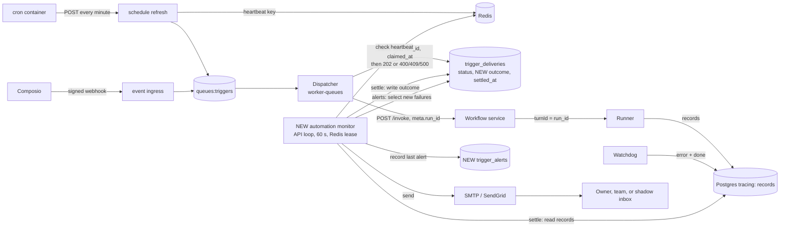

# Plan: Automation Failure Alerts

This file is the full design. The evidence for each statement about today's code is in
[research.md](./research.md). Decisions and open questions are in [status.md](./status.md).

## 1. What the user sees today

- Every automation run that starts shows as "Running" in the app forever, whether it succeeded
  or failed.
- Nobody receives any notice of a failure. The only trace is an error record inside the run's
  conversation.
- Some failures leave no result at all: a cron container that cannot reach the API leaves no
  delivery, and a run whose worker crashed after the claim stays at `102`.

## 2. Why it happens

1. The dispatcher starts each run **detached**: it hands the run to the runner and returns
   when the first streamed record arrives. It then writes the delivery as `202 dispatched`.
2. Nothing writes the run's final result back to the delivery
   (`api/entrypoints/worker_queues.py:255-262` says so).
3. The result exists only in the session's records (tracing database). No component turns it
   into a delivery result.
4. No outbound notification path exists for runs.

## 3. Goals and non-goals

Goals for v0:

- Record the real result of every new automation run on its delivery, and show it in run
  history.
- Email the owner when an automation fails for a reason the owner can act on: within minutes
  for the first failure, or within an hour when the same people got an alert in the last hour;
  then a reminder about once a day while it keeps failing (at most twice a day when reminders
  are grouped into one email).
- Email the Agenta team when an automation fails for a reason the platform caused, and when the
  cron stops.
- Run first in shadow mode (every email goes to one internal inbox), then go live.

Non-goals for v0:

- Following a run after a person approves it. A run that pauses for approval ends in v0 with
  the result "waiting for approval"; from there a person is involved and uses the app.
- A daily summary, "recovered" emails, and per-kind "new error" emails.
- In-app notifications, the "Needs attention" status in the automation list, Slack or Telegram
  messages (see [channels-research.md](./channels-research.md)), customer webhooks, an email
  when a run waits for approval.
- Automatic retries of failed runs.
- Detection of expired Composio connections and of single missed cron ticks.
- LLM-written error explanations.

## 4. How the system will work

### 4.1 Design in one paragraph

The dispatcher keeps its job and its `status` values. It also stores the run's id and claim
time when it claims a delivery. A new **automation monitor** is one loop in the API that runs
every 60 seconds; a Redis lease makes sure one process runs each pass. Each pass **settles**
open runs (reads their records and writes the result into a new `outcome` column), then sends
**failure alerts**: one query finds automations with new failures, one email goes to each
recipient list at most once an hour, and each automation is reminded about once a day for each
audience. Owner-fixable
failures go to the owner; platform failures go to the Agenta team. The only stored alert state
is when each automation was last alerted, so a crash or a failed send is repaired by a later
pass.

### 4.2 Flow

### 4.3 Components

| Component | State | Change |
|---|---|---|
| Cron scripts (7 files) | Changes | Call `${AGENTA_API_INTERNAL_URL:-http://api:8000}/admin/...` instead of the hard-coded `http://api:8000`. |
| Helm cron template | Changes | Set `AGENTA_API_INTERNAL_URL` on the cron pod to `http://<fullname>-api:<port>/api` when `agenta.apiInternalUrl` is not set. |
| Schedule refresh handler | Changes | Writes the heartbeat key each time it is called. |
| Dispatcher and claim | Changes | Create `run_id` before the claim; the claim stores `run_id` and `claimed_at` in `data` and resets `outcome` and `settled_at` on a re-claim; the detached start receives the same `run_id`. |
| `write_subscription_delivery_if_live` | Changes | Its conflict update also resets `outcome` and `settled_at`. (`write_delivery` has the same kind of upsert but no caller, so it is left as it is.) |
| `trigger_deliveries` | Changes | New columns `outcome` (JSONB) and `settled_at` (timestamp). Returned by the delivery API. |
| `trigger_alerts` | New table | One row per automation: when the owner and the team were last alerted about it. |
| Automation monitor | New | A loop in the API lifespan: settle, then failure alerts and the cron check. |
| Email helper (`utils/emailing.py`) | Changes | New `send_message(to_list, subject, html, text)` next to `send_email`. It raises `EmailTransportError`, `EmailDeferred` or `EmailRejected` instead of returning a bool; `SMTP_TIMEOUT` gets a 20-second default; the cached SendGrid client in `utils/lazy.py` (`_load_sendgrid`) gets `client.timeout = 20`. Both are per socket operation, so one send can take longer than 20 seconds in total. |
| App run history | Changes | Reads `outcome` when present, else today's `status`. |

### 4.4 Why a polling monitor

- **One writer.** Only the monitor writes `outcome`, `settled_at` and `trigger_alerts`. The
  delivery upserts only reset `outcome` and `settled_at` when they overwrite a row for a new
  attempt.
- **It repairs itself.** Every step selects its work from database state, and a sent email is
  recorded only after the transport accepted it. A crash, a restart or a missed pass loses
  nothing.
- **No change to hot paths.** An event-driven design would need a hook and a taskiq producer in
  the records worker, its own turn selection and enqueue failure handling. The
  `streams:sessions` stream cannot be used: its only consumer, the channels outbox, deletes each
  entry after it reads it.
- **Cost.** Up to about 3 minutes before an outcome appears (60-second passes plus a 2-minute
  settle grace), and a few indexed queries per pass. [sizing.sql](./sizing.sql) measures the
  volume in production.

The loop follows `api/oss/src/tasks/asyncio/sessions/attachment_sweep.py`: it starts in the API
lifespan (`api/entrypoints/routers.py`), which runs in every API process. Each pass first takes
a lease with the existing `acquire_lock` in `api/oss/src/utils/locking.py` (namespace
`automation-monitor`, TTL `max(2 x interval, 300)` seconds), renews it with `renew_lock` between
batches and between sends, stops when a renewal fails, and releases it with `release_lock`.
Both calls must pass the `owner` token that `acquire_lock` returned (without it they do not check
ownership) and the full `ttl` (`renew_lock` defaults to 15 seconds). A
process that does not get the lease skips the pass. When Redis cannot be reached,
`acquire_lock` returns nothing; the monitor logs this and skips the pass.

Database writes are short transactions. A send is recorded with a conditional update after the
transport accepted it. If a lease is lost during a send, two processes can send the same email
once; like a crash after a send, this is accepted.

### 4.5 Link a delivery to its run

- The dispatcher's `run_id` becomes the runner's `turn_id`: `meta.run_id` → SDK `turn_id` →
  wire `turnId` → runner → `records.turn_id`. All 20 local deliveries that have a run id join to
  their records this way.
- The dispatcher will create `run_id` before the claim and store it with `claimed_at` in the
  claim's `data`. The re-claim branch replaces `data`, so both values are fresh on a re-claim.
  The triggers copy of `_dispatch_detached_run` (`api/entrypoints/worker_queues.py:247`) gets a
  `run_id` parameter and passes it to `invoke_workflow_detached(run_id=...)`, which already
  accepts it. The copy in `routers.py` already has the parameter.
- The monitor reads `run_id` from `data.run_id`, else `data.result.run_id`, and the start time
  from `data.claimed_at`, else `created_at`.
- The monitor reads only records of this one turn. A later message that a person types into the
  automation's session is a different turn and is ignored.

### 4.6 Settle a run

**Which deliveries.** The migration adds `outcome` with the default
`{"state": "not_tracked"}`, which Postgres stores without rewriting the table, so every existing
row has it. It then changes the default to `NULL`, so new rows start open. Each pass reads the
deliveries with `outcome IS NULL`, through a partial index.

**Rules, first match wins.** "Non-quarantined" applies to every record below. A `done` counts
only when its `records.created_at` (insert time) is at least 2 minutes old, because records of
one turn can be committed out of order.

| Situation | `outcome.state` |
|---|---|
| `status` is `400` or `409` | `failed` |
| `status` is `500`, and 2 minutes after the write the turn has no records | `failed` |
| `status` is `200` (a test capture, or an old inline run) | `succeeded` |
| The turn has a `done` with `stopReason = cancelled` | `cancelled` |
| It has a `done` with `stopReason = paused` | `awaiting_approval` |
| It has a `done` with `stopReason = error`, or a `done` and an `error` record | `failed` |
| It has a `done` | `succeeded` |
| No `done`, and the run started more than `AGENTA_AUTOMATIONS_RUN_DEADLINE_HOURS` ago (default 12) | `no_result` |
| Otherwise | stays open |

- A `500` whose turn has records (for example "closed the stream before emitting a started
  record" after the runner started) is decided by its records, like a `202`.
- Only `done` ends a turn. When the runner's liveness probe finds a dead sandbox, the runner
  writes `error` (`sandbox_gone`) and `done(error)`. When the runner process of a first turn
  stops sending heartbeats, the watchdog writes `error` (`execution_lost`) and `done`. Both give
  `failed`.
- The deadline must stay above the runner's hard deadline: 11 hours 30 minutes plus a 60-second
  grace by default (`AGENTA_RUNNER_TURN_HARD_DEADLINE_MS`, `AGENTA_RUNNER_TURN_ABANDON_GRACE_MS`).
- A delivery at `102` follows the same rules. A worker that crashed before the start leaves no
  records, so the run reaches `no_result` at the deadline.
- The write is `UPDATE ... SET outcome, settled_at = now() WHERE id = :id AND outcome IS NULL
  AND status = :status_read`. The `status` check stops a stale write when an upsert changed the
  row for a new attempt after the monitor read it. (`updated_at` cannot serve here: it is NULL
  on newly inserted rows.)
- A delivery with no run id at all (neither `data.run_id` nor `data.result.run_id`) has no
  records to read, so it reaches `no_result` at `created_at` plus the deadline.
- `status` keeps today's values, and dedup reads only `status`, so this feature cannot make an
  automation run twice.
- Known limit: a record that stays uncommitted for more than 2 minutes after its `done` (for
  example during a long records-worker or entitlements outage) is missed, and the run can
  settle as `succeeded`. Shadow mode measures how often this happens.
- Known limit: in EE, the records worker drops the records of an organization that is over its
  records quota. Such runs reach `no_result` and are reported to the team as a platform
  failure, although the cause is the customer's quota.

### 4.7 Classify a failure

A pure function `classify_failure(delivery, error_record)` returns a catalog kind. For a turn
with several `error` records it uses the first one in producer order (`timestamp NULLS LAST`,
then `created_at`, then `record_index`, the order `RecordsDAO.get_records` uses), because ingest
order can differ and a later backstop `error` has no code. It checks the message and code rows against the error
record, or against `data.error` for a dispatcher failure, before the status rows. The first
matching row wins.

| Match | Kind | Who acts |
|---|---|---|
| error code `execution_lost`, `sandbox_gone`, `credential_delivery_failed`, `starter_credits_unavailable`, `subscription_login_refreshed` | platform_interrupted | platform |
| message contains "requires a mounted subscription" (runner configuration) | runner_not_configured | platform |
| message contains "is currently at capacity" (provider text passed through) | provider_unavailable | platform |
| error code `starter_credits_exhausted` or `starter_credits_program_paused` | credits_exhausted | owner |
| error code `subscription_login_required` | provider_signin_expired | owner |
| error code `rate_limited` | provider_rate_limited | owner |
| message contains "No user message to send" | empty_input | owner |
| message contains "Entity has no bound workflow reference" | no_agent_selected | owner |
| message contains "HTTP 406 on detached start" (the workflow ran, but returned a batch result instead of a stream) | target_cannot_stream | owner |
| status `409` | connection_invalid | owner |
| status `400` or `500`, and the turn has no records | start_failed | platform |
| `no_result` | no_result | platform |
| `failed` with no `error` record (a `done(error)` whose error was not stored) | unknown | platform |
| any other `error` record of the turn | agent_error | owner |

Rules:

- A failure inside the agent's run is the owner's by default (`agent_error`). Most errors an
  owner can fix arrive as `runner_error` or without a code: used-up provider credits
  (12 of 15 local `runner_error` records), failed model authentication, tool setup errors.
- Emails contain only fixed catalog text: a title, one plain sentence, and the next step. The
  raw error goes to `outcome.message` for run history (project members already see it in the
  conversation) and never into an email.
- The 102 local `500` errors wrap a `400` from `/workflows/revisions/resolve`. Until its cause is
  known, they stay `start_failed` (platform).
- In shadow mode the team reviews every `agent_error` and `start_failed` email and adds catalog
  rows for recurring messages.

### 4.8 Failure alerts

**Alertable failure.** A delivery whose outcome is `failed` or `no_result`, not `data.is_test`,
settled in the last 24 hours, of an automation that can still run (not deleted, `is_active`
true). Its catalog kind decides the audience: **owner** kinds go to the owner, **platform**
kinds go to the team.

**Recipient list.** A recipient list is the normalized set of email addresses that an
automation's alerts go to (section 4.9 for owners; `AGENTA_AUTOMATIONS_ALERTS_INTERNAL_TO` for
the team). Two automations with the same address set share one list.

**Newest run.** An automation's newest settled delivery that is not a test, not `cancelled` and
not `awaiting_approval`, ordered by `data.claimed_at`, else `created_at` (not by `settled_at`,
because a `no_result` settles 12 hours after its start). An automation is **still failing** for
an audience when its newest run is an alertable failure of that audience.

**Due automation.** For each audience, an automation is due when:

- it has an alertable failure of that audience settled after its alert time for that audience
  (`owner_alerted_at` or `team_alerted_at` on its `trigger_alerts` row);
- that alert time is empty or more than 24 hours ago;
- if the alert time is set (a reminder), it is still failing for that audience. An automation
  that recovered, or whose failures moved to the other audience, gets no reminder.

**One email per list, at most once an hour.** Each pass looks at every list that has at least
one due automation. The list is sent now only if no automation whose current list is the same
address set got this audience's alert in the last hour (the maximum alert time over all of
those automations, due or not). Otherwise it waits for a later pass.

A sent email, "Automations failing", includes the due automations, plus the list's other
automations that are still failing for this audience, have a failure settled after their alert
time, and were last alerted more than 12 hours ago. This keeps an owner's reminders together in
one or two emails a day instead of one per automation. Each line shows the automation's name,
project, the catalog title of its newest alertable failure of this audience, the number of this
audience's failures in the last 24 hours, and a link. An email shows at most 50 lines, then
"and N more"; every included automation gets its alert time, so a large outage cannot produce an
email too large to send. The email goes to all addresses of the list in one
transport call, so the members of one owner and admin list see each other's addresses. After
the transport accepts it, each included automation gets its audience's alert time set to now.

- One cause across many automations, such as used-up credits, sends one email per recipient
  list at once, and the failures that settle later in the same hour go into the next email
  for that list. This also bounds email volume during a platform outage, so no separate cap is needed.
- While an automation keeps failing, it appears again after 24 hours, which serves as the
  reminder. When it stops failing, it stops appearing; run history shows that it works again.
- A single failure is alerted. For an automation that runs every minute this means at most one
  email a day, which is acceptable for v0.

**Empty list.** When an automation's owner list is empty (for example the creator left and no
owner or admin has a usable address), the alert is a log line and its alert time is recorded,
so the log line appears about once a day.

**Known limits.** A failure soon after a recovery, within 24 hours of the last alert, waits for
the next reminder. An automation turned back on after a fix can be alerted once for failures
from before it was turned off, up to 24 hours old.

**Cron check.** Each pass reads the Redis key `triggers:schedules:last_refresh_at`. When it is
older than 5 minutes, and the monitor process has been running for at least 5 minutes (so a
restart after downtime gives the cron time to run), the pass emails the team "The schedule cron
has not run since {time}", at most once per hour: the key `alerts:cron` is set with
`SET NX EX 3600` after the transport accepted or refused the email, or after the log line when
there is no email to send. When the key is missing, the pass
writes it with `SET NX` and the current time, so a Redis flush counts as a fresh start, not as
a dead cron. The cron check runs in every mode; in `off`, or with no team address or no
transport, it is a log line.

### 4.9 Recipients and content

The owner recipient list of an automation is:

1. the user in `created_by_id` of the schedule or subscription, if that user is still a project
   member (not deleted, not a demo member);
2. otherwise the project members with role `owner` or `admin`.

Skip empty addresses and the placeholder `demo@agenta.ai`. `get_project_members` does not filter
deleted rows, so the lookup does. A person who is the creator of some automations and an admin
fallback for others can receive two emails in one pass, one per list.

Content, with an HTML and a text part and every value escaped with `html.escape`: for each
automation its name, project, catalog title, sentence and next step, failure count, and a link
to its run history: `{AGENTA_WEB_URL}/m/w/{workspace_id}/p/{project_id}/automations/{automation_id}?view=runs`.
The team email also lists up to 5 delivery ids per automation.

### 4.10 Sending and modes

**Errors.** `send_message` raises:

- `EmailTransportError` when the transport itself fails: connection, timeout, authentication,
  `SMTPSenderRefused`, SendGrid 401, 403, 429 or 5xx, and a SendGrid client that
  `utils/lazy.py` cached as `None` after a failed construction. The pass stops sending; the next
  pass tries again.
- `EmailDeferred` when this one message gets a temporary SMTP 4xx refusal (for example
  greylisting of its recipients, or a 451 at DATA). The pass skips this list, records nothing,
  and continues with the next list; the next pass tries this list again.
- `EmailRejected` when this one message is refused for good: an SMTP 5xx refusal of every
  recipient (`SMTPRecipientsRefused`) or of the content (for example 552 or 554), or a SendGrid
  400 or 413 (SendGrid rejects the whole request, so nobody received it). The alert is recorded
  as sent and the error is logged at error level, so one bad message cannot block the others.
  When two messages in a row are refused in one pass, the monitor treats it as a transport
  failure: it stops the pass and records nothing, so a relay that refuses everything or a bug in
  the message cannot silently mark all alerts as sent.
- When SMTP accepts the message but refuses some recipients, `smtplib` returns their addresses
  instead of raising; they are logged and the email counts as sent, so those recipients (for
  example a greylisted admin) miss this alert. SendGrid accepts unknown mailboxes and bounces
  them later; v0 does not read bounces.

When neither SMTP nor SendGrid is configured, the monitor logs an error at startup and skips the
alert step, as in mode `off`.

**Modes.**

| Mode | Behaviour |
|---|---|
| `off` (default) | The alert step does not run. Outcomes are still settled. |
| `shadow` | Owner emails go to `AGENTA_AUTOMATIONS_ALERTS_REDIRECT_TO`, with `[BETA]` in the subject and a block that shows the real recipients and the delivery ids. Team emails go to the team address. Both record the alert time. With no redirect address, the monitor logs an error at startup and works as `off`. |
| `live` | Owner emails go to the real recipients. |

With no team address (`AGENTA_AUTOMATIONS_ALERTS_INTERNAL_TO` empty), a team alert is a log line
and its alert time is still recorded, so the log line appears at most once a day per
automation.

Moving from `off` to `shadow` alerts at most once per automation for the failures of the last 24
hours. Moving from `shadow` to `live` does not repeat alerts that shadow mode recorded in the
last 24 hours.

## 5. Contracts

Fields are grouped by what they are.

### 5.1 `trigger_deliveries` additions

| Column or field | Role | Meaning |
|---|---|---|
| `outcome.state` | data | `succeeded`, `failed`, `cancelled`, `awaiting_approval`, `no_result`, `not_tracked` |
| `outcome.kind` | derived data | Catalog kind; who acts follows from the kind |
| `outcome.error_code`, `outcome.message` | data | Runner code if present; raw message for run history only |
| `settled_at` (column) | time | When the monitor wrote the outcome |
| `data.run_id` | correlation id | Written at claim. The runner `turn_id` of the run. |
| `data.claimed_at` | time | Written at claim. The run's start time for the deadline. |

Indexes: `(created_at) WHERE outcome IS NULL`, and `(settled_at)`.

API: add `outcome` and `settled_at` to the `TriggerDelivery` DTO, `TriggerDeliveryDBA` and both
mappers, and `run_id` and `claimed_at` to `TriggerDeliveryData`; the three delivery endpoints
return them. Frontend: add them to `triggerDeliverySchema`
(`web/packages/agenta-entities/src/gatewayTrigger/core/types.ts`, already `.passthrough()`),
regenerate the Fern type, and read them where status is read today: `automationModel.ts`,
`runModel.ts`, `runListView.ts`, `useAutomationRuns.ts`, `AutomationRunPane.tsx`,
`AutomationRunRow.tsx`, `DeliveryDetails.tsx` (including `isStuckDelivery`, which checks code
`102`) and `TriggerDeliveriesDrawer.tsx` (which shows `status.type ?? status.code`).

### 5.2 `trigger_alerts` (new table)

| Column | Role | Meaning |
|---|---|---|
| `project_id`, `id` | identity | Primary key, like the other trigger tables |
| `schedule_id` or `subscription_id` | reference | Exactly one is set; unique per automation; cascade on hard delete |
| `owner_alerted_at`, `team_alerted_at` | delivery record | When the automation was last in an owner or a team alert |

Written only by the monitor.

### 5.3 Environment variables (`AutomationsConfig` in `api/oss/src/utils/env.py`)

| Variable | Role | Default |
|---|---|---|
| `AGENTA_AUTOMATIONS_ALERTS_MODE` | policy | `off` |
| `AGENTA_AUTOMATIONS_ALERTS_REDIRECT_TO` | routing (shadow inbox) | empty |
| `AGENTA_AUTOMATIONS_ALERTS_INTERNAL_TO` | routing (team) | empty (team emails are then log lines) |
| `AGENTA_AUTOMATIONS_ALERTS_FROM` | sender identity | the existing sender variables |
| `AGENTA_AUTOMATIONS_MONITOR_INTERVAL_SECONDS` | policy | 60 |
| `AGENTA_AUTOMATIONS_RUN_DEADLINE_HOURS` | policy | 12 |

Also: `SMTP_TIMEOUT` gets a default of 20 seconds, which also applies to the three existing
`send_email` callers (org invite, member-joined notice, admin password reset). No default
contains an Agenta address. Self-hosters run the same code.

## 6. Delivery phases

Effort is in engineer-days for one person who knows the codebase, including tests and review
fixes. It is an estimate for planning, not a commitment.

| Phase | Effort | Calendar time |
|---|---|---|
| 1. Cron base URL | 1 day | 1 day |
| 2. Record the outcome | 10 to 12 days | 2.5 weeks, plus 1 week of production observation |
| 3. Failure alerts | 7 to 9 days | 2 weeks, plus 1 to 2 weeks in shadow |
| 4. Live | 1 day | about 1 week |
| **Total** | **19 to 23 days** | **about 8 weeks** |

1. **Cron base URL.** The 7 cron scripts use `${AGENTA_API_INTERNAL_URL:-http://api:8000}`; the
   Helm cron template sets the variable when `apiInternalUrl` is empty. The cron lists in the
   4 Dockerfiles (`Dockerfile.dev` and `Dockerfile.gh`, OSS and EE) do not change. Exit: cron logs show
   HTTP 200 on compose, Helm and Railway. Scheduling `records.sh` is a separate change.
2. **Record the outcome.** One release with the migration (`outcome` with the `not_tracked`
   default then `NULL`, `settled_at`, indexes) and the dispatcher change (`run_id` and
   `claimed_at` at claim through `_run`, the claim DAO `dbs/postgres/sessions/streams/dao.py` and
   its interface, and `worker_queues.py:247`; the reset in both upserts). Then the DTO, DBA,
   mappers and endpoints; the monitor loop with its lease and the settle step; the frontend
   files in 5.1. Exit: for one week every new automation delivery in production gets an
   outcome, and 50 sampled outcomes match their records by hand.
3. **Failure alerts.** Catalog; `trigger_alerts` and its migration; the due query and the
   recipient lists; the heartbeat write and cron check; `send_message` with typed errors and
   timeouts; the template; modes; Mailpit in the dev compose files; the acceptance test.
   Set `shadow` in cloud for 1 to 2 weeks and review every email daily as correct, false alarm
   or missed failure. Exit: zero false alarms and zero missed failures over the last 5 days.
4. **Live.** Set `live`. `off` stays as the global switch.

## 7. Tests

- **Settle (unit):** every row of 4.6, including: `error` then `done(cancelled)`; `done(error)`
  with no stored `error`; `done` stored before `error` within the grace; a watchdog `error` and
  `done` followed by quarantined runner records; a paused first turn; a later human turn in the
  same session; a `102` with no records at the deadline; a `500` whose turn has records; a
  re-claimed `500` row (new `run_id` and `claimed_at`, outcome reset); a `409` upsert over a
  settled row, and one that races with a settle; a delivery without `data.run_id`.
- **Classify (unit):** every catalog row with the real strings; a `500` whose `data.error`
  contains "No user message to send"; two `error` records in one turn; `failed` with no error
  record.
- **Alerts (pass-level):** one failure of an every-minute schedule (one alert); failures for 3
  days (one alert a day); 50 automations of one owner failing from one cause (one email); an
  owner with a creator list and an admin-fallback list; platform and owner failures of the same
  automation (one team and one owner email); turned off while failing (no more alerts); a
  paused run (no alert); an owner with 50 hourly automations failing at different minutes (two emails on the first day, then at most two a day); a reminder after recovery (none); platform failures that stopped while owner failures continue (no team reminder); mode `off` to `shadow` to `live` while failing; a
  dead cron and a Redis flush.
- **Sending (unit and pass-level):** each typed error path, including one message rejected for its content (later emails still go out), two rejections in a row (pass stops, nothing recorded), a greylisted list (other lists still go out), `SMTPSenderRefused` (tried again next pass), and a team email with 300 lines (capped at 50); SMTP down for 3 hours (no email lost,
  no duplicates); one rejected recipient; no transport configured.
- **Monitor (integration):** two API processes start a pass together and one runs; a lease
  renewal failure stops the pass; a restart continues from the database state.
- **Acceptance** (`api/oss/tests/pytest/acceptance/triggers/`): a schedule bound to an agent that
  fails through the mock LLM gateway container gets `outcome.state = failed`, and shadow mode
  delivers exactly one alert to Mailpit.

## 8. Risks

| Risk | Handling |
|---|---|
| False alarms teach people to ignore the email | Shadow review with exit numbers |
| `agent_error` emails an owner about a platform or provider problem | Shadow review of every `agent_error`; add platform rows for recurring messages |
| Email storm during a platform outage | Platform kinds go to the team; one email per recipient list per hour; each automation at most once per 24 hours |
| Private data in an email | Catalog text only, escaped template |
| Wrong recipient | Membership check, admin fallback |
| Silent cron failure | Heartbeat check in the monitor, which runs in the API |
| A long run marked `no_result` too early | Deadline above the runner's hard deadline, counted from the claim |
| Redis evicts TTL keys (the dev volatile Redis uses `volatile-lru`) | At worst an extra cron email; sent-alert times live in Postgres |
| Monitor query cost | Partial index on open rows, index on `settled_at`, batched tracing reads, sizing.sql |

## 9. After v0

A daily summary and "recovered" emails if owners ask for them; Slack and Telegram alerts through
the channel adapters ([channels-research.md](./channels-research.md)); following runs after an
approval (continuations, their redelivery and replacement); an email when a run waits for
approval; the "Needs attention" status in the automation list; a webhook event on the existing
webhooks pipeline; in-app notifications; automatic retry for runs that failed before any tool
call; expired-connection detection; missed-tick detection.
