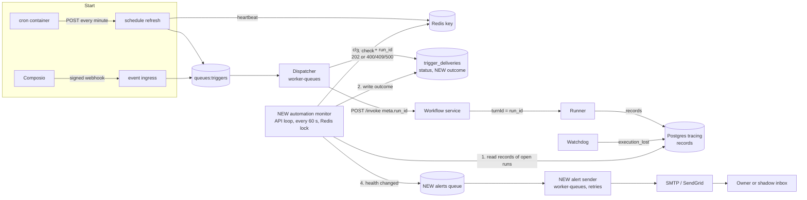

# Plan: Automation Failure Alerts

This file is the full design. The evidence for each statement about today's code is in
[research.md](./research.md). Decisions and open questions are tracked in
[status.md](./status.md).

## 1. What the user sees today

- An automation run that fails after it starts shows as "Running" in the app forever.
- The "Needs attention" status and the failure banner exist in the app, but they almost never
  show, because the server does not know about the failure.
- Nobody receives any notice. The only trace of a failure is an error record inside the run's
  conversation.
- Some failures leave no trace at all: a dead cron container, a run whose worker crashed after
  it claimed the delivery, a revoked account connection.

## 2. Why it happens

1. The dispatcher starts each run **detached**: it hands the run to the runner and returns
   when the first streamed record arrives. It then writes the delivery as `202 dispatched`.
2. Nothing writes the run's final result back to the delivery. The code says so in
   `api/entrypoints/worker_queues.py:255-262`.
3. The real result exists only as records in the tracing database. No component reads those
   records for automations.
4. No outbound notification path exists for runs: no event type, no email template, no
   recipient logic.

## 3. Goals and non-goals

Goals for v0:

- Record the true result of every automation run on its delivery.
- Email the owner when an automation starts failing, with one reminder per day while it keeps
  failing, and optionally one email when it recovers.
- Explain the failure in plain language, with the fix when the customer can fix it.
- Run first in shadow mode (all emails to one internal inbox), then go live.

Non-goals for v0:

- In-app notifications, Slack or Telegram messages, customer webhooks.
- Automatic retries of failed runs.
- Detection of expired Composio connections and of missed cron ticks (other than a dead cron).
- LLM-written error explanations.
- Self-recovery (an agent that fixes a failing automation).

## 4. How the system will work

### 4.1 Design in one paragraph

The dispatcher keeps its job and its status codes. A new **automation monitor** is one loop
that runs every 60 seconds. It reads the records of each started run, writes the run's result
into a new `outcome` column on the delivery, derives the current health of each automation
from its newest results, and queues an email when the health changes. A new **alert sender**
task sends the email with retries. The monitor is the only writer of `outcome`, and only one
API replica runs it at a time.

### 4.2 Flow

### 4.3 Components

| Component | State | What it does in v0 |
|---|---|---|
| cron scripts | Changes | Read the API address from the existing `AGENTA_API_INTERNAL_URL` (fallback `http://api:8000`). |
| Schedule refresh endpoint | Changes | Writes the Redis key `triggers:schedules:last_refresh_at` after each successful run. |
| Dispatcher (`TriggersDispatcher`) | Changes | Stores `run_id` on the delivery at claim time. Nothing else changes: it still owns `status`. |
| `trigger_deliveries.outcome` | New column | The run's result. Written only by the monitor. |
| Automation monitor | New | One loop in the API lifespan, built like the execution watchdog (`api/oss/src/tasks/asyncio/sessions/orphan_sweep.py`): every 60 seconds, under the Redis lock from `api/oss/src/dbs/redis/sessions/locks.py`, so one replica runs each pass. Four steps: settle, classify, evaluate health, check the cron heartbeat. |
| Alerts broker and alert sender | New | A new broker in `worker-queues` (the file already builds one broker per domain) with taskiq `SmartRetryMiddleware`. The task `automations.send_alert` sends one email. |
| Email helper (`utils/emailing.py`) | Changes | New `send_html_email(to, subject, html, text)` that reuses the existing SMTP and SendGrid functions. |
| App (`web/packages/agenta-automation-ui`) | Small change | Run history reads `outcome.state` when it is present, else today's `status`. "Needs attention" turns on from the automation's health. |

The monitor polls instead of reacting to events. Polling reads the truth from the records
every minute, so it needs no hook in the records worker, no new stream consumer and no
second settle path. It also repairs itself: after a restart it continues from the database
state. The cost is up to 60 seconds of delay before an email, which is acceptable for alerts.

### 4.4 Link a delivery to its turn

The dispatcher's `run_id` is already the runner's `turn_id`. The id goes
`meta.run_id` → SDK `turn_id` → wire `turnId` → runner → `records.turn_id`. This works today
and was checked on 20 of 20 local runs.

- The dispatcher stores `run_id` at claim time. Today it is stored only with the `202`
  write, so a run that fails fast can finish before its id is saved.
- The monitor reads only records of the automation's turns: the turn `run_id`, and, after an
  approval, the continuation turns reached through `parent_execution_id` in the executions
  table. Later human turns in the same session are ignored.

### 4.5 The result of a run (`outcome.state`)

The monitor applies this rule to the non-quarantined records of the automation's newest turn
in the chain:

| Records | `outcome.state` |
|---|---|
| An `error` record, or `done` with `stopReason = error` | `failed` |
| `done` with `stopReason = paused` | `awaiting_approval` (not final) |
| `done` with `stopReason = cancelled` | `cancelled` |
| `done`, none of the above | `succeeded` |

Other cases:

| Situation | `outcome.state` |
|---|---|
| Dispatcher wrote `400`, `409` or `500` | `failed` (the classifier reads the dispatcher error) |
| `102` or `202` with no terminal record 11.5 hours after `created_at` (the runner's 11-hour hard limit plus 30 minutes) | `no_result` |
| `awaiting_approval` for 1 hour since `outcome.updated_at` (the watchdog's 30-minute idle grace plus 30 minutes) | `failed`, kind `approval_not_given` |

Rules:

- The monitor does not wait for `done`: the runner's abandon path writes an `error` and no
  `done`.
- `outcome` is `NULL` while the run is open. Only `NULL` and `awaiting_approval` can change;
  every other state is final. The monitor is the only writer, so it needs no compare-and-set
  between writers.
- `status` keeps today's meaning and values. Dedup reads `status`, so it is unchanged: no
  automation can run twice because of this feature.
- Deliveries created before the release time get their outcome written, but never cause an
  email.

### 4.6 Classify the error

A pure function `classify_failure(delivery, records)` returns a catalog entry. It checks, in
order: the runner error code, message patterns (many error records have no code), then the
dispatcher status code. Rows are matched top to bottom, so the specific `resolve` row wins
over the general "HTTP 500 on detached start" row.

| Raw error (real samples) | Kind | Message to the customer | Owner |
|---|---|---|---|
| `starter_credits_exhausted`, `starter_credits_program_paused` | credits_exhausted | Your free credits are used up. Add your own model API key to keep this automation running. | customer |
| `subscription_login_required` | provider_signin_expired | The sign-in for your AI subscription expired. Sign in again under AI providers. | customer |
| `rate_limited` | provider_rate_limited | Your model provider is limiting requests. The next run usually works. | customer |
| "No user message to send (prompt/messages empty)" | empty_input | The automation started with an empty message. Check how the trigger's data maps to the agent's input. | customer |
| "runtime_provided local run requires a mounted subscription" | subscription_not_available | This agent needs a signed-in AI subscription, and none is available for scheduled runs. | customer |
| `400` from the dispatcher (input mapping failed, no agent reference) | input_invalid | The automation could not build the agent's input from this event. Check the field mapping and the selected agent. | customer |
| "HTTP 500 on detached start" whose body is a `400` from `/workflows/revisions/resolve` | agent_reference_invalid | This automation points to an agent version that cannot be loaded. Choose the agent again. | customer |
| HTTP 406 from a non-agent target | target_not_supported | This automation points to a workflow that cannot run from a trigger. | customer |
| `409` invalid subscription | connection_invalid | The connected account for this trigger is no longer valid. Reconnect it. | customer |
| Awaiting approval for more than 1 hour | approval_not_given | The run waited for an approval that nobody gave. | customer |
| `execution_lost`, `sandbox_gone`, "closed the stream before emitting a started record", any other "HTTP 500 on detached start" | platform_interrupted | The run stopped because of a problem on our side. | platform |
| `no_result` | no_result | The run did not report a result. | platform |
| Anything unmatched | unknown | The run failed with an error we could not identify. Open the run for details. | platform |

Rules:

- The Python catalog is the only list of error kinds. The app reads `outcome.kind`. The code
  groups in `RunFailureCallout.tsx` stay as they are for the chat view.
- Emails use only catalog text. The raw message goes to `outcome.message` for run history
  (project members already see it in the conversation) and never into an email.
- **Customer** kinds go to the owner. **Platform** kinds go to `AUTOMATION_ALERTS_INTERNAL_TO`,
  and the owner gets only the short "our side" line.
- Shadow mode logs each `unknown` with its cleaned-up message. The team reviews these weekly
  and adds rows.

### 4.7 Health of an automation and when to email

The monitor evaluates **state**, not single events. After each settle step, for every
automation with a new outcome or an open alert, it computes health from its settled
deliveries, newest first by `created_at`:

- **failing**: the newest settled run failed.
- **recovering**: the newest settled run succeeded, but a failure happened in the last 30
  minutes.
- **healthy**: no failure in the last 30 minutes and the newest settled run succeeded.

The **fingerprint** of a failure is its kind, plus the connection id for connection errors
and the provider for provider errors. For `unknown` it is the message with ids, numbers,
timestamps and quoted values removed, then hashed.

The last alert sent for the automation is the newest delivery whose `outcome.alert.status`
is `sent`. The monitor compares health with that alert:

| Current health | Last alert | Email |
|---|---|---|
| failing | none, or "back to normal" | "started failing" |
| failing, new fingerprint | "started failing" or "new error" | "new error" |
| failing, same fingerprint | sent more than 24 hours ago | "still failing" reminder |
| healthy | "started failing", "new error" or reminder | "back to normal" (if enabled) |
| recovering | any | none; wait |
| awaiting approval | none for this delivery | "needs approval" (if enabled) |

Because the monitor reads the newest state each pass:

- An older run that settles after a newer one changes nothing: health uses the newest run.
- A failure during the 30 recovering minutes keeps the automation failing, and no "back to
  normal" email went out.
- An email that could not be sent (cap reached, send failed) is sent on a later pass if the
  health still calls for it. No deferred state is needed.

### 4.8 Recipients

1. The `created_by_id` of the schedule or subscription.
2. Send only if that user is still a project member (`get_project_members`).
3. Otherwise send to the project admins.
4. Skip empty addresses and the placeholder `demo@agenta.ai`.

Known gap: a schedule created by an agent from a Slack or Telegram thread can carry the
agent creator's id, not the person who asked (`tasks/asyncio/channels/inbox.py`). The
membership check limits the harm.

### 4.9 Send the email

1. The monitor sets `outcome.alert = {kind, status: queued, queued_at}` on the delivery that
   caused the alert, then enqueues `automations.send_alert`. A `queued` alert is not queued
   again for 15 minutes.
2. The sender finds the recipient, renders a new template (HTML and text, every value
   escaped: automation name, project, what happened, catalog message and fix, last success,
   link from `AGENTA_WEB_URL` to the run), applies the mode and sends through
   `send_html_email`.
3. On success it sets `alert.status = sent` and `sent_at`. On failure `SmartRetryMiddleware`
   retries with backoff, up to 5 attempts. After the last attempt it sets `failed`, and the
   monitor queues it again on a later pass if the health still calls for it.

Retries live on the alerts broker only. The trigger tasks carry `retry_on_error=True` labels,
so adding the middleware to the triggers broker would start re-running automations.

A crash between a successful send and step 3 can cause one duplicate email. That is the
accepted cost of not losing emails.

### 4.10 Modes and safety limits

| Mode | Behaviour |
|---|---|
| `off` (default) | The monitor writes outcomes and health. No email is queued. Self-hosters are unaffected. |
| `shadow` | Every email goes to `AUTOMATION_ALERTS_REDIRECT_TO` with `[BETA]` in the subject and a debug block: would-send-to, reason, delivery id, turn id, kind. |
| `live` | Emails go to the real recipient. If `AUTOMATION_ALERTS_ALLOWLIST` is set, only those projects get live email. |

Safety limits, active in every mode:

- **Global cap**: the monitor counts queued alerts per clock hour in Redis
  (`AUTOMATION_ALERTS_MAX_PER_HOUR`). At the cap it stops queueing. Emails not queued are sent
  on a later pass if still due. One "alert storm" summary per hour goes to
  `AUTOMATION_ALERTS_INTERNAL_TO`, guarded by a Redis `SET NX` key for that hour. Shadow
  reviews count these as "held by cap", not as missed failures.
- **Cron heartbeat**: when `triggers:schedules:last_refresh_at` is older than 5 minutes, the
  monitor alerts `AUTOMATION_ALERTS_INTERNAL_TO`, at most once per hour (`SET NX` key).
- **No private data**: metadata and catalog text only. No inputs, outputs, prompts or raw
  error text.
- **Email not configured**: log once at startup and skip sends. Do not report success.

## 5. Contracts

Fields are grouped by what they are, not by the feature that uses them.

### 5.1 `trigger_deliveries.outcome` (new nullable JSONB column)

A separate column, not a key in `data`: the dispatcher writes `data` with a JSON merge, and
the monitor must be the only writer of the result. It also allows an index for the monitor's
"open runs" query.

| Field | Role | Meaning |
|---|---|---|
| `state` | data | `awaiting_approval`, `succeeded`, `failed`, `cancelled`, `no_result` |
| `turn_id` | correlation id | The turn whose records decided the state |
| `kind`, `owner` | derived data | Catalog kind; `customer` or `platform` |
| `error_code`, `message` | data | Runner code if present; raw message for run history only |
| `fingerprint` | grouping key | Section 4.7 |
| `updated_at` | time | Last change of `state` |
| `alert.kind` | delivery state | `started_failing`, `new_error`, `reminder`, `back_to_normal`, `needs_approval` |
| `alert.status`, `alert.queued_at`, `alert.sent_at` | delivery state | `queued`, `sent`, `failed` |

The sender writes only `outcome.alert` (with `jsonb_set`); the monitor writes the rest.

Index: `(project_id, created_at) WHERE outcome IS NULL OR outcome->>'state' = 'awaiting_approval'`.

### 5.2 `TriggerDeliveryData` (Pydantic, `api/oss/src/core/triggers/dtos.py`)

| Field | Role | Meaning |
|---|---|---|
| `run_id` | correlation id | Set at claim. Equals the runner `turn_id`. `result.run_id` stays for old rows. |

The model drops unknown keys, so the field must be declared.

### 5.3 Task payload `automations.send_alert`

| Field | Role |
|---|---|
| `project_id` | routing |
| `delivery_id` | routing (empty for `storm` and `cron_dead`) |
| `email_kind` | data: the `alert.kind` values plus `storm`, `cron_dead` |

The task reads everything else (recipient, automation name, catalog text) at send time.

### 5.4 Environment variables (`api/oss/src/utils/env.py`)

| Variable | Role | Default |
|---|---|---|
| `AUTOMATION_ALERTS_MODE` | policy | `off` |
| `AUTOMATION_ALERTS_REDIRECT_TO` | routing (shadow inbox) | empty |
| `AUTOMATION_ALERTS_INTERNAL_TO` | routing (platform kinds, storms, cron heartbeat) | empty |
| `AUTOMATION_ALERTS_ALLOWLIST` | policy (project ids for live) | empty = all |
| `AUTOMATION_ALERTS_FROM` | sender identity | falls back to the existing sender variables |
| `AUTOMATION_ALERTS_MAX_PER_HOUR` | policy | 20 |
| `AUTOMATION_ALERTS_REMINDER_HOURS` | policy | 24 |

Our own address must never be a default. Self-hosters run the same code.

The cron scripts reuse the existing `AGENTA_API_INTERNAL_URL` (`env.py:719`), with
`http://api:8000` as the fallback. Railway sets it to a value that ends in `/api`; phase 1
must confirm that the admin routes answer under that base on Railway and Helm, or strip the
suffix in the scripts.

## 6. Delivery phases

Each phase ships on its own and has an exit condition. Effort is in engineer-days for one
person who knows the codebase, and covers code, tests and review fixes. It is a rough
estimate for planning, not a commitment.

| Phase | Effort | Calendar time |
|---|---|---|
| 1. Fix the cron host | 0.5 to 1 day | 1 day |
| 2. Record the outcome | 5 to 7 days | about 1.5 weeks, plus 1 week of production observation |
| 3. Classify and evaluate health | 4 to 5 days | 1 week |
| 4. Shadow email | 3 to 4 days | 1 week, plus 1 to 2 weeks in shadow |
| 5. Live | 1 day | rollout over about 1 week |
| **Total** | **14 to 18 days** | **about 6 to 8 weeks** |

1. **Fix the cron host.** All 7 cron scripts read `AGENTA_API_INTERNAL_URL` with the
   `http://api:8000` fallback; confirm the admin path on Railway and Helm. Exit: cron logs
   show 200 on Helm and Railway. Scheduling `records.sh` (records retention) is a separate
   change, because it deletes customer data; see status.md.
2. **Record the outcome.** `outcome` column and index (migration); `run_id` at claim; the
   monitor loop with its lock, the settle step (records read, continuation chain, deadlines),
   and the heartbeat key; app run history reads `outcome.state`. Mode `off`. Exit: for one
   week, every automation delivery in production reaches a final outcome, and a sample of 50
   matches the run's records by hand.
3. **Classify and evaluate health.** Catalog, fingerprint, health rules, alert decisions
   written as log lines (nothing queued). App: "Needs attention" from health. Exit: unit tests
   pass for every catalog row and every health table row, and one week of logged decisions
   reviewed.
4. **Shadow email.** Alerts broker with `SmartRetryMiddleware`, sender task, template,
   `send_html_email`, modes, global cap, heartbeat alert. Set `shadow` in cloud for 1 to 2
   weeks. Review every email daily and mark it correct, false alarm, missed failure or held by
   cap. Exit: zero false alarms and zero missed failures over the last 5 days.
5. **Live.** `live` with the allowlist (internal projects first), then all projects. The mode
   switch stays as a global off switch.

## 7. Tests

- **Unit**: the result rule (error record; `stopReason = error`; error with no `done`;
  quarantined late `done`; paused; cancelled); the continuation chain (a paused turn whose
  continuation fails; a later human turn that must be ignored); deadlines (`no_result`,
  `approval_not_given` measured from `outcome.updated_at`); every catalog row with the real
  sample messages; fingerprint normalization; every row of the health table, including fail,
  success, fail within 30 minutes, and an older run that settles after a newer one; recipient
  fallback; template escaping.
- **Monitor**: two API replicas start the loop at the same time and only one pass runs; a
  restart continues from the database state; the cap holds alerts and a later pass sends them;
  the heartbeat alert fires once per hour.
- **Sender**: a failed send is retried by the middleware; after the last attempt the monitor
  queues it again; the triggers broker still does not retry.
- **Acceptance** (`api/oss/tests/pytest/acceptance/triggers/`): a schedule bound to an agent
  that fails with the mock LLM gateway gets `outcome.state = failed` with the right kind, and
  shadow mode produces exactly one email (captured by a test SMTP server).
- **Local**: the EE dev stack already has failing automations and 40 deliveries stuck at
  `102`, which exercise the deadlines.

## 8. Risks

| Risk | Handling |
|---|---|
| False alarms teach people to ignore the email | Logged decisions in phase 3, shadow period with daily review and exit numbers |
| Email storm during a platform outage | Global cap, platform kinds go internal |
| Private data in an email | Catalog text only, escaped template |
| Wrong recipient | Membership check, admin fallback |
| Silent cron failure | Heartbeat check in the monitor, which does not run in the cron container |
| A long run marked `no_result` too early | Deadline above the runner's hard limit |
| Monitor query cost grows with volume | Partial index on open runs; batch the tracing read per pass; check with [sizing.sql](./sizing.sql) |
| Backfill emails at release | Outcomes written for old rows, but they never cause an email |

## 9. Later (after v0)

Webhook event `automations.runs.failed` on the existing webhooks pipeline; Slack and
Telegram alerts through the channel adapters; in-app notifications; automatic retry for runs
that failed before any tool call; expired-connection detection; missed-tick detection;
LLM-drafted catalog entries reviewed by a person.
