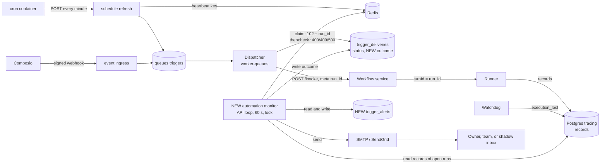

# Plan: Automation Failure Alerts

This file is the full design. The evidence for each statement about today's code is in
[research.md](./research.md). Decisions and open questions are in [status.md](./status.md).

## 1. What the user sees today

- An automation run that fails after it starts shows as "Running" in the app forever.
- Nobody receives any notice. The only trace of a failure is an error record inside the run's
  conversation.
- Some failures leave no trace at all: a cron container that cannot reach the API, or a run
  whose worker crashed after it claimed the delivery.

## 2. Why it happens

1. The dispatcher starts each run **detached**: it hands the run to the runner and returns
   when the first streamed record arrives. It then writes the delivery as `202 dispatched`.
2. Nothing writes the run's final result back to the delivery
   (`api/entrypoints/worker_queues.py:255-262` says so).
3. The real result exists only as records in the tracing database. No component reads them
   for automations.
4. No outbound notification path exists for runs.

## 3. Goals and non-goals

Goals for v0:

- Record the real result of every automation run on its delivery, and show it in run history.
- Email the owner when an automation starts failing for a reason the owner can fix, with a
  reminder while it keeps failing and an email when it recovers.
- Email the Agenta team about failures caused by the platform.
- Run first in shadow mode (every email goes to one internal inbox), then go live.

Non-goals for v0:

- In-app notifications, the "Needs attention" status in the automation list, Slack or
  Telegram messages, customer webhooks.
- Automatic retries of failed runs.
- Detection of expired Composio connections and of single missed cron ticks.
- LLM-written error explanations.

## 4. How the system will work

### 4.1 Design in one paragraph

The dispatcher keeps its job and its `status` values. It also stores the run's id when it
claims a delivery. A new **automation monitor** is one loop in the API that runs every 60
seconds under a lock, so one process runs each pass. Each pass reads the records of the open
runs, writes each run's result into a new `outcome` column on the delivery, updates one
**alert state** row per automation, and sends an email when that state changes. The monitor is
the only writer of `outcome` and of the alert state.

### 4.2 Flow

### 4.3 Components

| Component | State | Change |
|---|---|---|
| Cron scripts (7 files) | Changes | Call `${AGENTA_API_INTERNAL_URL:-http://api:8000}/admin/...` instead of the hard-coded `http://api:8000`. |
| Helm cron template | Changes | Set `AGENTA_API_INTERNAL_URL` on the cron pod to `http://<fullname>-api:<port>/api` when `agenta.apiInternalUrl` is not set. |
| Schedule refresh handler | Changes | Writes the heartbeat key after the service fetched the schedules. |
| Dispatcher and claim | Changes | Create `run_id` before the claim, store it at claim time, pass it to the detached start. The claim's re-claim branch also resets `outcome`. |
| `trigger_deliveries.outcome` | New column | The run's result. Exposed read-only through the delivery API. |
| `trigger_alerts` | New table | One row per automation: what the owner was last told. |
| Automation monitor | New | A loop in the API lifespan. Each pass: settle open runs, evaluate alerts, check the heartbeat, send emails. |
| Email helper | Changes | New `send_html_email` that reuses the SMTP and SendGrid transports and always uses a timeout. |
| App run history | Changes | Reads `outcome.state` when present, else today's `status`. |

### 4.4 Why a polling monitor

- **One writer.** Only the monitor writes `outcome` and `trigger_alerts`, so no two components
  race on the same field.
- **No new hook in the hot path.** The records worker, the dispatcher's completion and the
  `streams:sessions` stream stay as they are. That stream cannot take a second reader: the
  channels outbox deletes each entry after it reads it.
- **It repairs itself.** A pass reads the current database state, so a restart or a missed
  pass loses nothing.
- **Cost.** Up to 60 seconds before an outcome appears, and one indexed query per pass on each
  database. [sizing.sql](./sizing.sql) measures the volume in production.

The loop follows `api/oss/src/tasks/asyncio/sessions/attachment_sweep.py`: it starts in the
API lifespan (`api/entrypoints/routers.py`), which runs in every API process; each pass first
takes a Redis lease with `SET NX EX` on `locks:triggers:automation-monitor`, renews it between
batches, and releases it at the end. A process that does not get the lease skips the pass.

### 4.5 Link a delivery to its turns

- The dispatcher's `run_id` becomes the runner's `turn_id`: `meta.run_id` → SDK `turn_id` →
  wire `turnId` → runner → `records.turn_id`. This holds on all 20 local deliveries that have a
  run id.
- Today `run_id` is created inside `invoke_workflow_detached` and stored only with the `202`
  write. The dispatcher will create it before the claim, store it as `data.run_id` in the claim
  insert, and pass it through `_dispatch_detached_run` (worker-queues) to
  `invoke_workflow_detached(run_id=...)`, which already accepts it. The monitor uses the id the
  dispatcher created, not the id the start returns.
- **Approval continuations.** When a person approves a paused run, the API creates a new turn
  in the same session. Its row in `session_executions` (core DB) has
  `parent_execution_id` = the paused turn's id. A continuation can pause again, so the chain can
  be longer than two. The monitor follows the chain to its newest turn.
- The monitor reads only the turns in this chain. A later message that a person types into the
  automation's session is a different turn and is ignored.

### 4.6 Settle a run (`outcome.state`)

Each pass selects the open deliveries: `outcome IS NULL`, `created_at` within the last 24 hours,
and not `data.is_test`. Deliveries in `awaiting_approval` are also re-checked for up to 30 days.

| Delivery `status` | Result |
|---|---|
| `200` (only old inline runs; test deliveries are excluded above) | `succeeded` |
| `400`, `409`, `500` | `failed` |
| `102` older than 15 minutes | `no_result` (the worker crashed before the start; redelivery after 10 minutes is skipped by dedup) |
| `102` newer than 15 minutes | wait |
| `202` | read the records of the newest turn in the chain (below) |
| `202` with no finished turn 11.5 hours after `created_at` | `no_result` (the runner's hard limit is 11 hours; 30 minutes margin) |

A turn is **finished** when it has a non-quarantined `done` record, or a non-quarantined
`error` record with code `execution_lost` (the runner's abandon path writes no `done`). For a
finished turn, the first matching row wins:

| Records of the turn (non-quarantined only) | Result |
|---|---|
| `done` with `stopReason = cancelled` | `cancelled` (a person stopped it; this includes an `error` from an aborted sandbox start) |
| `done` with `stopReason = paused` | `awaiting_approval` (not final; follow the chain on later passes) |
| any `error` record | `failed` |
| otherwise | `succeeded` |

Rules:

- `outcome` stays `NULL` while the run is open. Only `NULL` and `awaiting_approval` can change;
  every other state is final. The monitor's update includes that condition.
- Approvals have no deadline in the product: a paused run can be approved days later. So
  `awaiting_approval` never turns into a failure by itself. After 30 days the monitor stops
  re-checking it.
- A re-claim of a `500` row (a Composio redelivery of the same event) gives the row a new id
  and new data. The claim will also set `outcome` to `NULL` in that branch, so the new attempt
  is settled on its own.
- `status` keeps today's values, and dedup reads only `status`. This feature cannot make an
  automation run twice.

### 4.7 Classify a failure

A pure function `classify_failure(delivery, records)` returns a catalog entry. It checks, in
order: the runner error code, the error message, then the dispatcher status and error text.
The first matching row wins.

| Match | Kind | Who can fix it |
|---|---|---|
| code `starter_credits_exhausted` or `starter_credits_program_paused` | credits_exhausted | owner |
| code `subscription_login_required` | provider_signin_expired | owner |
| code `rate_limited` | provider_rate_limited | owner |
| message contains "No user message to send" | empty_input | owner |
| message contains "requires a mounted subscription" | subscription_not_available | owner |
| status `400` with "Entity has no bound workflow reference" | no_agent_selected | owner |
| status `409` | connection_invalid | owner |
| status `500` with "HTTP 406 on detached start" | target_not_supported | owner |
| code `execution_lost`, `continuation_execution_lost`, `sandbox_gone`, `credential_delivery_failed`, `starter_credits_unavailable` | platform_interrupted | platform |
| status `500`, any other text | start_failed | platform |
| `no_result` | no_result | platform |
| anything else | unknown | platform |

Rules:

- Emails use only fixed catalog text: a title, one plain sentence, and the fix. The raw error
  goes to `outcome.message` for run history (project members already see it in the
  conversation) and never into an email.
- **Owner** kinds drive the owner's alerts. **Platform** kinds go to the team digest (section
  4.9) and do not change the owner's alert state.
- The 99 local `500` errors wrap a `400` from `/workflows/revisions/resolve`. Their cause is not
  confirmed, so they stay `start_failed` (platform) until it is.
- The monitor logs every `unknown` with its message. The team reviews these weekly and adds
  rows.

### 4.8 Alerts to the owner

`trigger_alerts` holds one row per automation. The monitor evaluates an automation when one of
its deliveries got an outcome in this pass, or when its row is `failing`.

**Which runs count.** The newest settled delivery by `created_at` whose outcome is `succeeded`,
or `failed` with an owner kind. Cancelled runs, runs awaiting approval, and platform failures
are skipped. Ordering by `created_at` means a run that settles late cannot override a newer
one.

**Fingerprint** of an owner failure: the kind, plus the connection id for `connection_invalid`.

| Row state | Condition | Email | New row state |
|---|---|---|---|
| `ok` | the newest counted run failed | "Started failing" | `failing`, fingerprints = [this one] |
| `failing` | the newest counted run failed with a fingerprint not in the list | "New error" | add the fingerprint |
| `failing` | last email more than 24 hours ago, the automation can still run, and a counted failure was created after the last email | "Still failing" with the count since it started | update the email time |
| `failing` | the newest counted run succeeded and the newest counted failure is more than 30 minutes old | "Back to normal" | `ok`, list cleared |
| `failing` | the automation can no longer run (deleted, turned off, past `end_time`, or an invalid subscription) | none | `ok`, list cleared |

"Can still run" uses the same conditions as the dispatcher: not deleted, `is_active`, not past
`end_time` for a schedule, and `is_valid` for a subscription.

**Approvals.** When a delivery becomes `awaiting_approval`, the owner gets "Waiting for your
approval", at most once per 24 hours per automation. This does not change the failing state.

**Sending and state.** The monitor writes the new row state only after the email was accepted
by SMTP or SendGrid. If the send fails, nothing changes and the next pass tries again. A crash
between a successful send and the write can cause one duplicate email; that is accepted.

### 4.9 Alerts to the team

- **Platform digest.** At most once per hour, one email to `AUTOMATION_ALERTS_INTERNAL_TO` lists
  the platform failures since the last digest: counts by kind and up to 20 delivery ids.
- **Cron heartbeat.** The refresh handler writes `triggers:schedules:last_refresh_at` (volatile
  Redis, 1-day TTL) each time the service fetched the schedules, even if some schedules failed.
  When the value is older than 5 minutes, the monitor alerts the team. A missing key counts as
  unknown during the first 10 minutes after the monitor process started, then as stale.
- **Alert storm.** See the global cap in section 4.11.
- Each team email uses a once-per-hour guard: `acquire_lock` from `api/oss/src/utils/locking.py`
  with a 3600-second TTL, never released.

### 4.10 Recipients and email content

Owner emails go to:

1. the user in `created_by_id` of the schedule or subscription, if that user is still a member
   of the project and is not a demo member;
2. otherwise the project members with role `owner` or `admin`, plus the organization owner.

Skip empty addresses and the placeholder `demo@agenta.ai`. `get_project_members` does not filter
deleted rows, so the lookup must.

Content (HTML and text parts, every value escaped with `html.escape`): automation name, project
name, what happened, the catalog sentence and fix, the time of the last success, and a link to
the automation's run history:
`{AGENTA_WEB_URL}/m/w/{workspace_id}/p/{project_id}/automations/{automation_id}?view=runs`.

`send_html_email(to, subject, html, text)` calls the existing SMTP or SendGrid function with a
20-second timeout when `SMTP_TIMEOUT` is not set (its default is no timeout). The monitor
renews its lease between sends.

### 4.11 Modes and limits

| Mode | Behaviour |
|---|---|
| `off` (default) | Outcomes and alert state are written. Every email is replaced by a log line. |
| `shadow` | Every email goes to `AUTOMATION_ALERTS_REDIRECT_TO`, with `[BETA]` in the subject and a block that shows the real recipient, the reason, the delivery id, the turn id and the kind. |
| `live` | Emails go to the real recipients. If `AUTOMATION_ALERTS_ALLOWLIST` is set, only those projects get owner emails. |

- Because state is written in `off` mode too, an automation that is already failing when the
  mode changes gets its next email from the reminder rule, not a burst of "Started failing".
- **Global cap.** A Redis counter per clock hour limits owner emails
  (`AUTOMATION_ALERTS_MAX_PER_HOUR`, default 20). At the cap the monitor stops sending; the
  state stays unchanged, so the emails go out in a later hour if they are still due. One
  "alert storm" email per hour tells the team how many were held.
- **No private data.** Catalog text and names only. No inputs, outputs, prompts or raw error
  text.
- **No email configured.** Log it once at startup and skip sends; do not change alert state.

## 5. Contracts

Fields are grouped by what they are.

### 5.1 `trigger_deliveries.outcome` (new nullable JSONB column)

| Field | Role | Meaning |
|---|---|---|
| `state` | data | `succeeded`, `failed`, `cancelled`, `awaiting_approval`, `no_result` |
| `turn_id` | correlation id | The turn whose records decided the state |
| `kind`, `owner` | derived data | Catalog kind; `owner` or `platform` |
| `error_code`, `message` | data | Runner code if present; raw message for run history only |
| `settled_at` | time | When the state was last written |

Written only by the monitor. Partial index `(created_at) WHERE outcome IS NULL`, plus
`(created_at) WHERE outcome->>'state' = 'awaiting_approval'`.

API: add `outcome` to the `TriggerDelivery` DTO, its DBE and both mappers; the delivery
endpoints return it. Frontend: add it to `triggerDeliverySchema` in
`web/packages/agenta-entities/src/gatewayTrigger/core/types.ts` (the schema is `.passthrough()`,
so the field already arrives, but untyped) and regenerate the Fern types.

### 5.2 `TriggerDeliveryData.run_id`

| Field | Role | Meaning |
|---|---|---|
| `run_id` | correlation id | Written at claim. Equals the runner `turn_id` of the first turn. `result.run_id` stays for older rows; the monitor reads `run_id`, else `result.run_id`. |

### 5.3 `trigger_alerts` (new table)

| Column | Role | Meaning |
|---|---|---|
| `project_id`, `id` | identity | Primary key, like the other trigger tables |
| `schedule_id` or `subscription_id` | reference | Exactly one is set; unique per automation |
| `state` | data | `ok` or `failing` |
| `failing_since` | time | When the current failure started |
| `fingerprints` | data | Owner fingerprints already emailed in this failure |
| `last_email_kind`, `last_email_at` | delivery record | The last owner email |
| `last_approval_email_at` | delivery record | The last approval email |

Written only by the monitor. Rows cascade on delete with their schedule or subscription.

### 5.4 Environment variables (`api/oss/src/utils/env.py`)

| Variable | Role | Default |
|---|---|---|
| `AUTOMATION_ALERTS_MODE` | policy | `off` |
| `AUTOMATION_ALERTS_REDIRECT_TO` | routing (shadow inbox) | empty |
| `AUTOMATION_ALERTS_INTERNAL_TO` | routing (team) | empty |
| `AUTOMATION_ALERTS_ALLOWLIST` | policy (project ids for live) | empty = all |
| `AUTOMATION_ALERTS_FROM` | sender identity | the existing sender variables |
| `AUTOMATION_ALERTS_MAX_PER_HOUR` | policy | 20 |
| `AUTOMATION_MONITOR_INTERVAL_SECONDS` | policy | 60 |

No default contains an Agenta address. Self-hosters run the same code.

## 6. Delivery phases

Effort is in engineer-days for one person who knows the codebase, including tests and review
fixes. It is an estimate for planning, not a commitment.

| Phase | Effort | Calendar time |
|---|---|---|
| 1. Cron base URL | 1 day | 1 day |
| 2. Record the outcome | 7 to 9 days | 2 weeks, plus 1 week of production observation |
| 3. Alert decisions in `off` mode | 5 to 6 days | 1 week, plus 1 week of log review |
| 4. Email and shadow mode | 3 to 4 days | 1 week, plus 1 to 2 weeks in shadow |
| 5. Live | 1 day | about 1 week of rollout |
| **Total** | **17 to 21 days** | **about 8 to 9 weeks** |

1. **Cron base URL.** The 7 cron scripts use `${AGENTA_API_INTERNAL_URL:-http://api:8000}`. The
   Helm cron template sets the variable when `apiInternalUrl` is empty. Exit: cron logs show
   HTTP 200 on compose, Helm and Railway. Scheduling `records.sh` (records retention) is a
   separate change; see status.md.
2. **Record the outcome.** Migration for `outcome` and its indexes; `run_id` at claim through
   `_run`, the claim DAO and its interface, and `_dispatch_detached_run`; `outcome` reset in the
   re-claim branch; DTO, mappers and endpoints; the monitor loop with its lease and the settle
   step, including the continuation chain; the zod schema, Fern types and the run-history
   components (`runModel.ts`, `automationModel.ts`, `DeliveryDetails.tsx`,
   `TriggerDeliveriesDrawer.tsx`). Exit: for one week every automation delivery in production
   gets an outcome, and 50 sampled outcomes match their records by hand.
3. **Alert decisions in `off` mode.** Catalog, fingerprints, `trigger_alerts` table and
   migration, the owner rules, the approval rule, the team digest decision, the heartbeat write
   and check. Every email is a log line. Exit: unit tests for every catalog row and every rule
   row pass, and one week of logged decisions is reviewed.
4. **Email and shadow mode.** `send_html_email` with a timeout, the template, recipients, links,
   modes, the global cap, a Mailpit service in the dev compose files for tests. Set `shadow` in
   cloud for 1 to 2 weeks and review every email daily as correct, false alarm, missed failure
   or held by cap. Exit: zero false alarms and zero missed failures over the last 5 days.
5. **Live.** `live` with the allowlist (internal projects first), then all projects. `off`
   stays as the global switch.

## 7. Tests

- **Settle rules (unit):** each row of both tables in 4.6, including an `error` with no `done`
  and code `execution_lost`; an `error` followed by `done(cancelled)`; a quarantined late
  `done`; a chain of two continuations; a later human turn in the same session; a `102` before
  and after 15 minutes; a `202` past 11.5 hours; a re-claimed `500` row.
- **Catalog (unit):** every row with the real error strings from the code.
- **Owner rules (unit):** every row of the table in 4.8, plus: A, B, A, B alternating
  fingerprints send two emails; fail, success, fail within 30 minutes sends no "back to
  normal"; an older run settling after a newer one changes nothing; a failed send leaves the
  state unchanged; a turned-off automation stops reminders; a weekly schedule gets a reminder
  only after a new failure.
- **Monitor (integration):** two API processes start a pass at the same time and only one runs;
  a pass after a restart continues from the database state; the cap holds emails and a later
  hour sends them; team emails go out once per hour.
- **Acceptance** (`api/oss/tests/pytest/acceptance/triggers/`): a schedule bound to an agent that
  fails through the mock LLM gateway (`api/oss/tests/pytest/utils/mock_gateways.py`) gets
  `outcome.state = failed` with the right kind, and shadow mode delivers exactly one email to
  Mailpit.

## 8. Risks

| Risk | Handling |
|---|---|
| False alarms teach people to ignore the email | One week of logged decisions, then shadow review with exit numbers |
| Email storm during a platform outage | Platform kinds go to the team digest; global cap for owner emails |
| Private data in an email | Catalog text only, escaped template |
| Wrong recipient | Membership check, admin fallback |
| Silent cron failure | Heartbeat check in the monitor, which runs in the API, not in the cron container |
| A long run marked `no_result` too early | Deadline above the runner's hard limit |
| Monitor query cost | Partial indexes on open rows; one batched tracing query per project per pass; sizing.sql |

## 9. After v0

The "Needs attention" status in the automation list (it needs an API field for many
automations); Slack and Telegram alerts through the channel adapters; a webhook event on the
existing webhooks pipeline; in-app notifications; automatic retry for runs that failed before
any tool call; expired-connection detection; missed-tick detection; LLM-drafted catalog rows
reviewed by a person.
