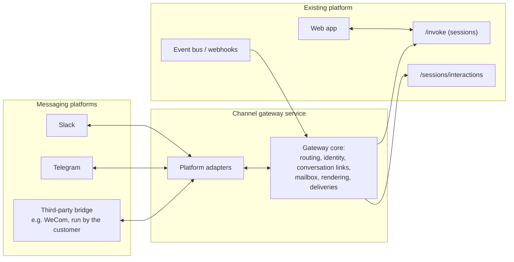

# Channels: architecture

Date: 2026-07-20. Status: design for review, second pass of the channels research.
Decisions this design treats as fixed are recorded in `decisions.md`. Research
inputs are in `raw/` (a codebase audit, two studies of open-source and commercial
channel architectures, enterprise security research, and an external architecture
brainstorm). This document stands alone: everything it builds on is explained
here, and the raw files are only needed if you want to check a claim.

**How to read this.** Sections 1 and 2 set the scene: what the feature is, and
what already exists in Agenta that it can stand on. Section 3 gives the overall
shape. Sections 4 to 6 are the core of the design: the data model, then a message
travelling inbound, then replies and approvals travelling outbound. Sections 7
and 8 cover identity and security. Section 9 is the contract that lets other
people build channels we cannot. Section 10 is the build plan, and section 11
holds the open questions. Each design choice states the options that were on the
table and why one won.

---

## 1. The feature

A team installs an agent into their Slack workspace as a bot named `@deploybot`.
In the `#releases` channel, Alice writes:

> @deploybot ship v2 to staging and tell me when it's green

That mention starts an agent session. The agent replies in a thread under
Alice's message. From then on, the thread is the session: anyone on the team can
write in the thread and the agent treats it as the next message of the same
conversation, without being mentioned again. When the agent wants to run a
protected action (a deploy, a database migration), an approval card with
Approve and Reject buttons appears in the thread, and clicking Approve resumes
the run. If Alice opens the Agenta web app, she finds the same session there,
with the full conversation, and can continue it from the browser. If she goes
back to Slack, the thread has kept up.

"Channel" is the word for the connection that makes this possible: a link
between one agent and one messaging surface. Slack is the first surface;
Telegram is second; Teams, Discord, and email follow demand. Surfaces we cannot
build ourselves, such as WeChat Work or Feishu (they require verified Chinese
enterprise accounts we cannot obtain), must be buildable by self-hosting users
through a documented contract (section 9).

The product decisions that frame everything below, from `decisions.md`:

- A group thread is one shared session, with speaker attribution per message.
- The agent acts with the permissions of the person who asked (which requires
  linking each Slack user to their Agenta account). The design must leave room
  for two other identity modes later: the agent as its own principal, and
  admin-provisioned service accounts.
- One platform app is one agent. A Slack app called `deploybot` drives exactly
  one agent; a second agent means a second Slack app. Self-hosting users create
  their own apps (from manifests we provide); the cloud edition may also offer
  a preinstalled app.
- DMs with the agent are allowed and are personal context, distinct from the
  shared context of a channel.
- Session lifetime (when a quiet thread gets a fresh session) is configuration,
  not architecture.

## 2. What Agenta already has

The design's central claim is that channels are mostly a new *front door* to
machinery that already exists. This section describes that machinery, because
the rest of the document constantly refers to it. Every claim here was verified
against the code during the audit (`raw/agenta-primitives.md`, with file paths).

### 2.1 Sessions

A session is a server-side conversation object, identified by an opaque string
`session_id`, scoped to a project. It is stored as four related facets:

- **Streams** are the coordination plane. One row per session tracks whether a
  turn is currently running and which one. Commands are issued via
  `POST /sessions/streams/`: `send` asks to start a turn and fails with HTTP
  409 (`SessionTurnInUse`) if one is already running; `steer` interrupts the
  running turn; `cancel` and `attach` do what their names say. This matters for
  channels because it means concurrency control between surfaces already
  exists: two people cannot corrupt a session by writing at once.
- **Turns** are an append-only log: one row per request/response cycle, with
  the invoking user recorded as `created_by_id`.
- **Records** are the durable transcript. Every event the agent emits (message,
  tool call, tool result, and so on) is ingested as a record; a query endpoint
  (`POST /sessions/records/query`) returns the log, and the web app rebuilds a
  full conversation view from it. This is why any surface can display any
  session.
- **Interactions** are stored approval and input requests. Covered in 2.3.

To run a turn, a caller sends `POST {serviceUrl}/invoke` with the session id,
a reference to the agent, and the message. This is the same endpoint the
playground uses; it is authenticated with a normal project credential. One
qualifier matters for this design: today the caller must include the
conversation history in the request. The server stores the transcript but does
not yet load it into the model's context by itself; the logic that turns stored
records back into messages exists only in the web app's TypeScript. Section 10
makes moving that server-side the first prerequisite, because it is what makes
"any surface can continue any session" true without every surface carrying its
own copy of the history.

### 2.2 Connections and secrets

`gateway_connections` is the existing table for "this project is connected to
an external service account". Rows carry a provider key, auth metadata, and a
validity flag; secrets themselves (tokens, signing keys) live in the project
vault, encrypted at rest. Today the only provider is Composio (the tool
gateway), but the provider field already enumerates a native `agenta` kind that
nothing implements yet. The service in front of it (`ConnectionsService`) has a
provider-adapter port waiting for a second implementation.

### 2.3 Approvals

When an agent wants to run a tool marked as requiring approval, the runtime
creates a durable **interaction** row (its own id, the session, the tool call
and arguments, and a pinned reference to the exact agent revision), emits an
event into the live stream, and then *ends the turn*, parking the session. The
approval can be answered at any later time via
`POST /sessions/interactions/{interaction_id}/respond`; the server resumes the
run from the pinned revision. Two properties make this ideal for channels:

- No browser or live connection is needed to answer. An approval clicked in
  Slack three hours later is a normal resume, not a held-open request.
- The row is flipped with a compare-and-swap, so if two people click Approve
  at once, exactly one response wins.

The competitive research (`raw/agent-platforms.md`, `raw/workflow-platforms.md`)
found that the market's channel approvals either bounce the approver into a
browser (n8n, Zapier; their most complained-about behavior) or exist without
role controls. Our runtime half already avoids both problems.

### 2.4 Identity linking

The `user_identities` table maps `(method, subject)` pairs to Agenta users. It
is how "log in with Google" works: method `social:google`, subject the Google
account id. The method string is a namespace, so a new family like
`channel:slack:T0424242` (Slack team T0424242) with the Slack user id as
subject fits without any schema change. This is the table that will hold "Slack
user U0AL1CE is Agenta user alice@acme.com".

### 2.5 Ingress and outbound delivery

Two existing subsystems establish the patterns a Slack event receiver needs:

- **Trigger ingress.** `POST /api/triggers/composio/events/` is a live public
  webhook endpoint: it verifies an HMAC signature with timestamp replay
  protection, answers 202 immediately, queues the event, and a worker later
  builds an invoke request for the bound workflow. A Slack receiver is the same
  five steps with Slack's signature scheme.
- **Outbound webhooks.** A subscription registry delivers platform events to
  customer URLs with HMAC signing, retries, and a delivery log. It is driven by
  an enumerated event-type list. Adding new event types is cheap; the delivery
  machinery is done.

### 2.6 What does not exist

Three things the feature needs and the codebase does not have. They are the
real work, and the build plan (section 10) is organized around them.

1. Server-side history loading on `/invoke` (described in 2.1).
2. Speaker attribution: records mark who wrote a message only as
   `"user"` or `"agent"`; there is no field for *which* user. Until a `sender`
   field lands, group conversations must prefix the speaker's name into the
   message text ("Alice: ship v2 please"), which is what every surveyed
   competitor does today.
3. A delegation primitive. The only credential that acts as a specific user is
   that user's own API key. There is no "service X may act on behalf of linked
   user Y" token. Section 7 describes the MVP workaround and the real fix.

## 3. The shape of the solution

One new service, the **channel gateway**, sits between the messaging platforms
and the platform API. Everything else in the design is a detail of this
service or a small addition to the existing API.



The gateway is a separate always-on worker, not request-scoped API code, for a
concrete reason: the enterprise-preferred way to talk to Slack is Socket Mode,
a WebSocket that *we* open outward to Slack, so that a self-hosted deployment
needs no inbound port and no firewall exception. Telegram works the same way
(long polling). Someone has to hold those connections open around the clock;
that someone is this service. The webhook alternative exists in the same
adapters for the cloud edition and for Teams (which has no outbound-only
option; this is stated honestly in docs rather than promised away).

Two boundary rules define the security architecture, and both are enforced by
construction rather than by policy:

1. **The agent runtime never sees platform credentials or destinations.** The
   agent emits events against a session. The gateway alone knows that this
   session is Slack thread `1753000000.1234` in channel `C0777` and holds the
   bot token needed to post there. A fully prompt-injected agent therefore
   cannot post to a channel of its choosing or leak a bot token it never had.
   The enterprise research (`raw/enterprise-posture.md`) identifies this
   separation as the single control that breaks the exfiltration step of
   prompt-injection attacks.
2. **The web app and Slack are peers.** Both are surfaces reading and writing
   the same session through the same APIs. Cross-surface continuity is
   therefore not a channel feature; it is a property of sessions, and it works
   for the next surface (email, Teams) without new design.

Why not put channel handling inside the existing API service? Because holding
persistent platform connections in a request-serving process couples channel
uptime to API deploys and complicates scaling both. Why not a per-channel
serverless function? Because Socket Mode and long polling are stateful
connections, and because the gateway carries per-conversation queues (section
5.4) that want one owner.

## 4. The data model

The gateway needs to remember five kinds of things. Three are new tables in one
new `channels` domain; two reuse existing tables. Column lists below are the
proposal, not migrations; types are abbreviated.

### 4.1 The channel app: a reused `gateway_connections` row

The installed platform app (the Slack app with its bot token, the Telegram bot
with its BotFather token, the bridge with its credential) is stored as a
`gateway_connections` row under a new native provider (`slack`, `telegram`,
`bridge`). The row carries the platform identifiers (Slack team id, app id, bot
user id) in its data field; the secrets go to the vault and are referenced, not
embedded.

Options considered:

- **A new dedicated table for channel apps.** Cleanest on paper; the external
  brainstorm preferred it, arguing that a bot installation and a tool-provider
  connection are different things. Rejected because the audit's strongest
  warning was against a second connection store: two tables holding "this
  project is connected to external service X, with credentials" would drift
  apart in validity handling, OAuth flows, and admin UI, and the provider-kind
  field was explicitly designed for this extension.
- **Reuse `gateway_connections`** (chosen). The Slack app install flow becomes
  the first implementation of the native provider port that already exists,
  and connections gain nothing channel-specific: binding to an agent lives in
  the next table, not here.

### 4.2 `channel_bindings`: this app drives this agent

The binding is the heart of the domain: the statement "the Slack app in
connection X drives agent Y, under this conversation policy".

```
channel_bindings
  id                  uuid pk
  project_id          uuid
  connection_id       uuid fk -> gateway_connections   -- the channel app
  agent_ref           jsonb    -- workflow / variant / revision reference
  authorization_mode  text     -- 'invoking_user' (only value in v1)
  dm_enabled          boolean default true
  group_invocation    text     -- 'mention' | 'command' | 'always'
  session_scope       text     -- 'thread' (v1 fixed; see below)
  session_idle_ttl    interval -- null = never expire
  status              text     -- 'active' | 'suspended'
  + lifecycle columns (created_by, timestamps)
```

`agent_ref` uses the same reference mechanism as the existing
`TriggerSubscription`: pointing at a workflow or variant means "always the
latest revision", pointing at a revision id pins a version. Replacing the
agent's prompt does not require touching Slack.

Options considered:

- **Extend `TriggerSubscription` with a conversational mode.** Triggers already
  bind an external event source to a workflow reference, so the overlap is
  real. Rejected because the two behave differently everywhere it counts: a
  trigger fires one run per event and is done; a binding owns a growing set of
  conversations, each with session state, ordering, and policy. Folding both
  into one table means a state machine where half the columns are null for
  half the rows, and where any change to trigger semantics risks channel
  behavior. They stay siblings that share parts: the connection table
  underneath, the reference mechanism, the queue-and-worker pattern.
- **A separate `channels` domain with its own binding table** (chosen).

`session_scope` is fixed to `thread` in v1 (one Slack thread = one session,
the model every studied product converges on). The column exists because the
open-source gateways all ended up making scope configurable (per-channel, or
per-user-per-channel for surfaces without threads like WhatsApp), and a column
with one allowed value now is cheaper than a migration later.

### 4.3 `channel_scope_grants`: where the binding may answer

A valid Slack app is installed workspace-wide, but installation must not mean
permission to answer everywhere. The binding starts deaf, and each place it may
listen is an explicit grant:

```
channel_scope_grants
  id              uuid pk
  binding_id      uuid fk -> channel_bindings
  scope_type      text   -- 'channel' | 'dm' | 'workspace'
  native_scope_id text   -- e.g. 'C0777'; '*' with scope_type 'dm'
  invocation_mode text   -- overrides the binding default if set
  unique (binding_id, scope_type, native_scope_id)
```

Why a table and not a JSON allowlist on the binding: grants are the unit an
admin audits ("where can this agent speak?") and the unit future policy
attaches to (per-channel invocation mode already; per-channel approver roles
later). The enterprise research is unambiguous that default-deny exposure is a
baseline CISO expectation, and that retrofitting it after shipping
answer-everywhere is a breaking change for every existing install.

### 4.4 `conversation_links`: this thread is this session

The durable correlation between an external conversation and a session:

```
conversation_links
  id               uuid pk
  binding_id       uuid fk -> channel_bindings
  native_key       text   -- canonical, e.g. 'T0424242/C0777/1753000000.1234'
  native_locator   jsonb  -- {team_id, channel_id, thread_ts, kind: 'thread'}
  session_id       text   -- the session this conversation maps to
  generation       int default 1
  context_kind     text   -- 'shared' | 'personal'
  status           text   -- 'active' | 'expired' | 'closed'
  last_activity_at timestamptz
  unique (binding_id, native_key, generation)
```

Three deliberate choices in this table:

- **The native key is built by one core function** from the structured
  locator. Adapters hand over `{team_id, channel_id, thread_ts}` and never
  compose keys themselves. Every open-source gateway studied
  (`raw/oss-gateways.md`) arrived at this rule, usually after a bug: the
  moment two code paths build conversation keys, the same thread eventually
  maps to two sessions. The locator stays stored because a key is for lookup
  and a locator is for action (posting back needs the channel id, not a
  concatenated string). Platforms with messy ids (WhatsApp has two id systems
  for the same user) get canonicalized inside that one function.
- **`generation` implements configurable session lifetime.** When a thread's
  session expires per `session_idle_ttl` and someone writes again, the gateway
  inserts generation 2 with a fresh session id. The old link remains, so
  history stays reachable and audit stays coherent. Without the generation
  column, expiry would mean either deleting correlation history or never
  expiring.
- **Many links may point at one session.** That is the door to "continue this
  session on another surface": linking a second conversation (an email thread,
  a different channel) to the same session is an insert, not a redesign.

### 4.5 `channel_inbox_events` and `channel_deliveries`: the two ledgers

Messaging platforms redeliver. Slack retries an event within seconds if the
receiver is slow, and Socket Mode replays after reconnects. On the way out,
posting can fail halfway (the message was created but our process died before
recording that). Both directions therefore get a ledger with idempotency.

```
channel_inbox_events
  id                 uuid pk
  connection_id      uuid   -- the channel app that received it
  external_event_id  text   -- Slack's event_id, Telegram's update_id
  event_type         text   -- 'message' | 'message_edited' | 'reaction' | ...
  payload            jsonb  -- the raw platform event, kept for reprocessing
  conversation_link_id uuid null
  status             text   -- 'received' | 'processed' | 'skipped' | 'failed'
  received_at        timestamptz
  unique (connection_id, external_event_id)
```

An arriving duplicate hits the unique constraint and is dropped; everything
downstream of the inbox behaves as if delivery were exactly-once, without any
downstream code thinking about retries.

```
channel_deliveries
  id                   uuid pk
  connection_id        uuid
  conversation_link_id uuid
  source_type          text  -- 'record' | 'interaction' | 'status' | 'error'
  source_id            uuid  -- what this delivery renders
  operation            text  -- 'create' | 'update'
  idempotency_key      text unique  -- e.g. 'interaction:<id>:rendered:v2'
  activity             jsonb -- the normalized content to render (section 6)
  status               text  -- 'pending' | 'sent' | 'failed' | 'abandoned'
  attempts             int
  native_message_id    text null   -- the receipt: Slack ts of the posted message
  last_error_kind      text null   -- closed vocabulary: 'rate_limited' | ...
```

The receipt column is load-bearing: editing a progress message, replying in the
right thread, and updating an approval card after a decision all require
knowing the platform's id for a message we posted earlier. Every gateway
studied returns platform message ids from every send for exactly this reason.

The existing interactions table has a `delivered_webhook` boolean that was
reserved for out-of-band delivery. This design supersedes it: one interaction
can be rendered on several surfaces and re-rendered after updates, which is a
one-to-many relation to deliveries, not a flag. The boolean stays unused.

### 4.6 Identity links: a reused `user_identities` row

Per 2.4, linking needs no new table. A linked Alice is the row:

```
method  = 'channel:slack:T0424242'
subject = 'U0AL1CE'
user_id = <alice's agenta user id>
```

The method string embeds the team id because a Slack user id is only unique
within a workspace; the same person in two workspaces is two links. Linking is
established by an explicit flow (section 5, step 3), never inferred: matching
by display name is spoofable, and matching by email silently breaks (the
audit of Devin's email matching in `raw/coding-agents-in-slack.md` found
silent failure to be its main operational complaint) and is unsafe as an
authority source. Email match may *suggest* a link; the user confirms it by
clicking a magic link sent in a DM from the bot, authenticated on the Agenta
side by their logged-in browser session.

## 5. Inbound: one message, end to end

The concrete path of Alice's message, with the failure branches. Participants:
Slack workspace `T0424242`, channel `#releases` (`C0777`), the `deploybot`
Slack app (connection `conn_dep`), its binding `bind_dep` to agent
`deploy-agent`, Alice (`U0AL1CE`, linked) and Bob (`U0B0B`, not linked).

**Step 1: receive and store.** Slack delivers over the gateway's Socket Mode
connection (or, in webhook mode, to `POST /channels/slack/events`, which
verifies Slack's `v0:{timestamp}:{body}` HMAC signature with replay protection,
the same scheme the Composio receiver already implements):

```json
{
  "event_id": "Ev0AAA111",
  "team_id": "T0424242",
  "event": {
    "type": "app_mention",
    "user": "U0AL1CE",
    "channel": "C0777",
    "ts": "1753000000.1234",
    "text": "<@U0DEPLOY> ship v2 to staging and tell me when it's green"
  }
}
```

The gateway inserts the inbox event keyed `(conn_dep, "Ev0AAA111")` and
acknowledges immediately. Slack expects an answer within 3 seconds and retries
otherwise; if a retry arrives anyway, the unique constraint drops it. All
further work happens off the hot path, from the inbox.

**Step 2: route.** `team_id` resolves the connection; the connection resolves
`bind_dep`. The grants are checked: is there a grant for channel `C0777`? If
not, the event is marked `skipped` and nothing is posted (default-deny; a
silent non-answer in a channel the admin never enabled is correct, not rude).
The invocation mode says whether this event even counts: a top-level message
must mention the bot; a reply inside a thread the agent already owns counts
without a mention.

**Step 3: identify the speaker.** `('channel:slack:T0424242', 'U0AL1CE')`
finds Alice's link. The gateway checks, now and on every message (not at link
time), that her Agenta account is active. The enterprise research calls the
per-invocation check non-negotiable: "ex-employee still commands the agent
from Slack" is a finding that ends procurements. When later Bob (unlinked)
writes in the thread, the branch is: his message still enters the session as
conversation content (a shared thread is shared), but if *he* tries to invoke
a consequential action or click Approve, the gateway replies to him with a
private (ephemeral) linking invitation, and the action does not run. What
unlinked users may trigger, if anything, is binding policy.

**Step 4: find or create the conversation.** The locator
`{team_id: T0424242, channel_id: C0777, thread_ts: 1753000000.1234}` becomes
native key `T0424242/C0777/1753000000.1234`. No link exists (this is a new
thread), so the gateway creates one with a fresh `session_id` and
`context_kind: shared`. Had this been a redelivered event, get-or-create would
have found the existing row; idempotency again.

**Step 5: queue.** The message enters the gateway's per-conversation mailbox,
a FIFO in front of the session. The session's stream plane already refuses
overlapping turns (409 `SessionTurnInUse`), so without a queue the gateway
would have to drop or bounce a message arriving mid-turn; with it, rapid
messages from a lively thread execute in order. The mailbox lives once, in the
gateway core, and explicitly not in adapters. The runtime keeps its own
serialization; the mailbox only decides what the gateway does with message
number two while message number one runs. MVP policy is strict serialization;
"coalesce consecutive messages into one turn" and "new mention interrupts via
steer" become binding policy later.

**Step 6: invoke.** The gateway calls the same endpoint every surface calls:

```json
POST {serviceUrl}/invoke     (Accept: application/json)
{
  "session_id": "sess_ch_9f2...",
  "references": { "workflow": { "slug": "deploy-agent" } },
  "data": {
    "inputs": {
      "messages": [
        { "role": "user",
          "content": "Alice: ship v2 to staging and tell me when it's green" }
      ]
    }
  }
}
```

Two details of this call:

- The credential is Alice's (section 7): the turn runs with her permissions
  and is attributed to her in the turns log.
- The speaker prefix `"Alice: "` is the interim attribution mechanism (2.6);
  when the `sender` field lands on the message shape, the prefix goes away and
  attribution becomes structured.

The response, in batch mode, is one assistant message; the gateway posts it to
the thread and records the delivery with Slack's returned `ts` as receipt.
Messaging surfaces post whole messages, so batch mode is the default; the
progress rendering below covers long runs.

## 6. Outbound: replies, progress, and approvals

### 6.1 What channels receive: a curated activity stream

The runtime emits a rich event stream (assistant text, model reasoning, tool
calls and results, files, errors). Channels do not receive it raw; the gateway
projects it into a small vocabulary: `message`, `status`, `tool_activity`,
`interaction`, `result`, `error`. Two things are deliberately excluded:

- **Model reasoning never leaves the platform as channel content.** A status
  line ("thinking", "running deploy…") is portable and safe; internal
  reasoning is neither, and once posted into a Slack channel it is in the
  customer's retention forever.
- **No raw pass-through of runtime payloads.** Channels render the projection
  or nothing; a channel that starts depending on runtime internals would
  freeze those internals into a compatibility contract.

### 6.2 Rendering under declared capabilities

Surfaces differ: Slack has threads, edits, and buttons; Telegram has buttons
but different length limits; SMS has none of it. Every channel app declares a
capability descriptor as data (threads, edit, buttons and how many, max
message length and its unit, markdown dialect, files). The gateway core plans
rendering from the declaration: progress as an edited status message where
edits exist, as occasional new messages where they do not; approvals as
buttons where buttons exist, as "reply 1 to approve / 2 to reject" where they
do not. Contract tests hold each adapter to its declaration, because the
studied failure mode of adapter ecosystems is the silent no-op (a declared
capability that quietly does nothing). Capability-as-data is also what lets
the dashboard render configuration for a bridge channel it has never heard of
(section 9).

### 6.3 Approvals, the full path

Continuing the scenario: `deploy-agent` reaches its `deploy_to_staging` tool,
which is marked as requiring approval. The runtime creates the interaction row
and parks the session (2.3). Then:

**1. Push, not poll.** Interaction creation now emits an event on the platform
event bus (`SESSIONS_INTERACTIONS_CREATED`, one of the two event types this
design adds; the other is turn-completed). The gateway subscribes; the
existing delivery machinery does the rest. Any other subscriber (the web
app's notifications, a customer webhook) gets the same event for free.

**2. Render from structure.** The gateway builds the approval card from the
interaction's stored tool call, never from text the model composed:

```json
{
  "source_type": "interaction",
  "source_id": "int_7c1...",
  "operation": "create",
  "idempotency_key": "interaction:int_7c1:rendered:v1",
  "activity": {
    "type": "interaction",
    "title": "Approval required: deploy_to_staging",
    "fields": [ { "label": "version", "value": "v2" },
                { "label": "environment", "value": "staging" } ],
    "actions": [ { "id": "approve", "label": "Approve", "style": "primary" },
                 { "id": "reject",  "label": "Reject",  "style": "danger" } ]
  }
}
```

The Slack adapter turns this into Block Kit buttons; a buttons-less surface
gets the numbered-reply text form. The reason for "never from model text" is
prompt injection: an agent that has been manipulated must not be able to
compose its own approval card ("Approve routine cleanup" over a destructive
call). The card shows the tool and arguments as the runtime recorded them.

**3. Authorize the click.** Bob clicks Approve. The click is presentation,
not authorization; possession of the callback payload proves nothing. The
gateway: verifies Slack's interactivity signature; resolves `U0B0B` through
identity links (Bob is unlinked, so the flow stops here with an ephemeral
"link your account to approve" message and the card unchanged); had it been
Alice, it re-evaluates approver policy for this binding (v1 policy: any linked
project member with run permission, which is exactly the runtime's current
rule; the policy hook is the seam where "only the `release-managers` group may
approve" lands later, and no studied competitor has that, which makes it a
real differentiator).

**4. Respond and resume.** For an authorized click the gateway calls the
existing endpoint with the clicker's credential:

```
POST /sessions/interactions/int_7c1.../respond
{ "answer": { "approved": true } }
```

The compare-and-swap flips the row exactly once (a simultaneous click from the
web app loses cleanly), the run resumes server-side from the pinned revision,
and the turn's remaining output flows to the thread like any other.

**5. Close the loop.** Using the delivery receipt, the gateway edits the card:
"Approved by Alice · 14:02". If the same interaction was rendered on another
surface, that delivery updates too. The web app shows the same resolution
because it reads the same interaction row.

The same interaction being answerable from Slack, the web app, or any future
surface, whichever comes first, with role policy on the approver, is the
feature's sharpest edge. In-thread approval buttons alone stopped being novel
in June 2026 (see `decisions.md` on Gumloop).

## 7. Identity and credentials

### 7.1 The three-part answer to "who is doing this"

Every channel-initiated action involves three parties, and the design records
all three everywhere (turns, audit events, deliveries):

- **subject**: the human whose authority is exercised (Alice).
- **actor**: the agent doing the work (`deploy-agent`).
- **audience**: who sees the result (`shared` conversation `C0777/…`, or
  `personal` for a DM).

Recording the triple from the first release is cheap (columns and event
fields); adding it later means re-auditing every log statement. It is also the
vocabulary in which the two deferred identity modes are expressible without
schema change: agent-own-identity sets subject = actor = the agent principal;
a service-account mode sets subject to the provisioned account. Both remain
values of `authorization_mode` on the binding.

### 7.2 Credentials: the MVP and the real mechanism

The decision (D2) is that the agent acts with the invoking user's permissions.
Concretely, per turn, the gateway must hold a credential that acts as Alice.

- **MVP: per-user project API keys.** When Alice links her account, the flow
  mints (or she provides) a project API key, stored in the vault, used by the
  gateway for her turns. This works today with zero auth changes: an API key
  already acts as its creating user, turns get `created_by_id` = Alice, RBAC
  applies. Its problems are real but operational: key sprawl, one revocation
  path per user, no scoping-down per turn.
- **Step two: delegated tokens.** The auth middleware already mints short-lived
  internal JWTs carrying a resolved user and project scope; they lack only a
  public minting path. The real mechanism is token exchange: the gateway
  authenticates as itself (one credential) and exchanges
  `(identity_link, project)` for a scoped token with a minutes-long TTL, per
  turn. One revocation point, per-turn least privilege, and the natural place
  where a non-human principal (the agent as its own identity) later plugs in.
  Estimated at 2+ weeks in the audit and deliberately not on the MVP path.

Why not start with delegated tokens? Because the MVP line (section 10) should
be reachable without touching the auth middleware, the most sensitive code in
the platform, and because API keys prove the product before the auth
investment.

### 7.3 The group-safety rule, accommodated

Decision D1 defers the rule "a group-visible reply must never use resources
only one member may access", and current facts make deferral safe: per-user
resources do not exist yet (secrets and tool connections are project-scoped),
so today there is nothing member-private for a shared session to leak. The
architecture's obligation is to keep enforcement one change, not a hunt:

- Sessions carry `context_kind` (`shared` | `personal`) from day one, via the
  conversation link.
- Every credential and tool connection enters a run through one resolution
  point in the SDK. That property already holds, and the rule's eventual
  implementation is a filter there: "if the session is shared, resolve only
  project-scoped resources". The conservative behavior (refuse, with an
  explanation) matches what Copilot Studio ships for the same problem.

### 7.4 Revocation semantics

Stated now because they are audit-relevant and unretrofittable. When an
identity link is removed or a user deactivated: their credential stops
working at the next per-invocation check (step 3 of section 5); their pending
approval clicks are refused; sessions they participated in keep their history
(the transcript is the project's record, with tombstoned attribution if the
account is erased). When a binding is suspended or a grant revoked: queued
mailbox messages are dropped with a status delivery, in-flight turns finish,
new events are skipped. When a channel app (connection) is disabled: its
Socket Mode connection closes and every binding under it is effectively
suspended.

## 8. The security invariants

The enterprise research produced a checklist of what CISO reviews ask and
which design mistakes end deals. This design encodes the answers structurally;
they are collected here so a security reviewer can audit the claims in one
place.

1. **Egress-only by default.** Socket Mode and long polling; no inbound ports
   for self-hosted deployments. Teams is the documented exception.
2. **Bring your own app.** Self-hosters create their own Slack app from our
   manifest; bot tokens are issued by their workspace to their deployment and
   never transit our infrastructure. There is no shared vendor app to
   compromise. (We should market this; the research found no vendor that
   states it crisply.)
3. **Tokens live in the vault**, encrypted at rest, referenced by connections,
   with rotation as an admin flow (Slack's token rotation is supported, not
   fought).
4. **Platform credentials and destinations never enter the agent runtime**
   (section 3). Replies are pinned to the originating conversation by the
   gateway.
5. **Files cross a boundary.** A Slack attachment is fetched by the gateway
   (Slack file URLs embed auth), stored via session mounts, scanned/size-capped
   per policy, and enters the sandbox as a scoped asset reference. Platform
   URLs with embedded credentials never reach agent context.
6. **Untrusted input is assumed hostile.** Channel content is the definition
   of untrusted model input. The mitigations are the boundary ones above plus:
   approval cards render from structured data only (6.3), and the agent's
   blast radius in a channel is its tool policy, with approvals on the
   dangerous ones.
7. **Audit is structured and separate from content.** Audit events (who
   invoked, as whom, what ran, who approved, from which surface) are
   exportable and retained independently of message content, which is
   minimized: the gateway ingests the thread it is part of, not channel
   history, and transcript retention/deletion is configurable.
8. **Loop and bot hygiene.** Adapters mark bot-authored messages and the app's
   own identity; the gateway never treats its own posts as input and applies a
   loop breaker (a bot-to-bot exchange counter) before invoking. Two agents in
   one channel must not be able to run each other in circles.

## 9. Third-party channels: the bridge contract

### 9.1 The situation this solves

A self-hosting customer in China needs the agent in WeCom. We cannot build or
even test a WeCom channel (it requires a verified Chinese enterprise tenant),
and they cannot wait for our release cycle. The requirement from the brief:
they must be able to add the channel themselves, keep it independent of our
code, and maintain it across our upgrades.

### 9.2 The mechanism: a wire contract, not a plugin API

Their WeCom support is a **bridge**: a small service they run, in any
language, that speaks WeCom's API on one side and a documented Agenta contract
on the other. To Agenta, a bridge is just another channel app: same
connection row (provider `bridge`), same binding, same capability
declaration, same rendering pipeline. Nothing downstream can tell it is not
first-party.

Options considered for the extension mechanism:

- **In-tree contributions** (they send a PR adding a WeCom adapter). Rejected:
  couples them to our release train, puts maintenance of code we cannot test
  on us, and the studied precedent (matterbridge, which died of accumulated
  adapter rot across 30 protocols) is exactly this failure.
- **In-process plugins** (a package our gateway loads). Works technically
  (OpenClaw's plugin system has a Tencent-maintained WeCom plugin as the
  existence proof) but a loaded plugin is code execution inside the gateway,
  which holds every bot token: RCE-equivalent trust. OpenClaw's registry
  incident (hundreds of malicious plugins) is the cautionary tale. Rejected
  as the *third-party* story; nothing prevents us adding a trusted in-process
  SDK for our own adapters.
- **A versioned wire contract** (chosen). Language-agnostic, crash-isolated,
  upgrade-independent, and the only mechanism a hosted cloud can also offer
  safely. Chatwoot's API channel and Microsoft's Direct Line are the two
  successful precedents, and Microsoft's ten-year-old schema demonstrates the
  evolution discipline required.

### 9.3 The contract

Transport: the bridge dials out to the gateway over an authenticated
WebSocket (matching the egress-only posture; the bridge needs no inbound port
either), with an HTTP profile (signed webhooks both directions) for bridges
that prefer it. Same message shapes on both.

On connect, the bridge introduces itself and declares capabilities:

```json
{
  "type": "bridge.hello",
  "protocol_versions": ["1.0"],
  "bridge": { "name": "acme-wecom", "version": "1.2.0" },
  "capabilities": {
    "threads": false,
    "message_update": true,
    "buttons": { "supported": true, "max": 3 },
    "text": { "format": "plain", "max_chars": 2048 },
    "files": { "receive": true, "send": false, "max_bytes": 10485760 }
  }
}
```

The gateway normalizes hostile or absurd values at this boundary (a declared
max length of 0 becomes the default; trust flags are stamped by the gateway,
never read from the wire), and the declaration then drives rendering exactly
as for first-party channels: WeCom's 3-button limit means an approval with
more options degrades to the numbered-text form automatically.

Events use a versioned envelope (CloudEvents 1.0, an existing standard for
exactly this, with W3C trace context for correlation) around our activity
schema. An inbound message from the bridge:

```json
{
  "specversion": "1.0",
  "id": "wecom-msg-98234",
  "type": "io.agenta.channel.message.received.v1",
  "source": "bridge/acme-wecom",
  "time": "2026-07-20T10:00:00Z",
  "data": {
    "conversation": { "id": "grp_456", "kind": "group" },
    "sender": { "id": "wecom-user-1", "display_name": "Wei" },
    "content": [ { "type": "text", "text": "@agent 部署v2" } ],
    "mentions": [ { "kind": "app" } ],
    "native": { "message_id": "98234" }
  }
}
```

Outbound, the gateway sends delivery commands with idempotency keys; the
bridge answers with receipts carrying the platform message id. The rules that
make this operable by strangers, written into the spec rather than assumed:

- Delivery is at-least-once; every inbound event carries a stable external id
  and every outbound command an idempotency key (the two ledgers of 4.5 do
  the deduplication).
- Ordering is guaranteed per conversation only.
- Reconnecting bridges resume from a gateway-owned cursor, so a bridge can be
  restarted or replaced without losing events.
- Evolution is additive under a written must-ignore rule: senders may add
  fields; receivers must ignore unknown fields and unknown event types.
  Version lives in the event type name, never in field shapes. This is the
  discipline that kept Microsoft's Activity schema compatible for a decade,
  and bridge authors we will never meet depend on it.
- Platform-specific extras ride in named, versioned extension blocks, not an
  open bag. An open `channelData`-style field is where normalization goes to
  die: core code quietly starts depending on Slack-shaped contents and the
  abstraction is gone.
- The bridge credential authorizes the transport, nothing else. Humans are
  authorized per invocation through identity links (`channel:bridge:acme-wecom`
  methods), exactly as for Slack. One bridge credential cannot speak for
  another installation.

### 9.4 First-party channels eat this contract

Our own Slack and Telegram adapters are built as bundled bridges: in-process,
but speaking the same activity schema and capability mechanism through the
same core. This is the Bot Framework connector model, and it is the only
known way to keep a third-party contract honest; a contract only we never use
would rot immediately. Practical corollary: the contract is designed now, but
published for external use only after Telegram ships on it, because a schema
that has survived exactly one platform has not yet met the case that breaks
it. Distribution and a community catalog (verified tiers, a directory) are
explicitly deferred; the contract makes distribution independent of us, and
the one pre-commitment is that community code is never auto-installed.

## 10. Build plan

Ordered so every step is independently shippable and the earlier steps are
useful without the later ones. Estimates are from the codebase audit, which
sized each against the existing code.

| # | Work | Size | What it unblocks |
|---|---|---|---|
| 1 | Session and interaction event types on the event bus | days | Push-based approval and turn-completion delivery to any surface, including web notifications |
| 2 | `channel:*` identity methods and the link flow (bot DM, magic link) | days + UX | Decision D2; approval authorization |
| 3 | Slack receiver (Socket Mode client + webhook route, signature verify, inbox) | days | First inbound events |
| 4 | The channels domain: bindings, grants, conversation links, inbox, deliveries, mailbox; CRUD + minimal UI | ~1 week | The data model of section 4 |
| 5 | Native Slack connection provider (app install flow, manifest for self-host, token rotation) | ~1 week | Channel apps as connections |
| 6 | Server-side history hydration on `/invoke` | 1–2 weeks | True cross-surface continuity for every surface; thins every client |
| 7 | `sender` field on messages and records (wire, storage, replay, web UI) | 1–2 weeks | Structured speaker attribution; retires name-prefixing |
| 8 | Delegated tokens (public minting path for the internal scoped JWT) | 2+ weeks | Retires per-user API keys; opens service-account and agent-own identity modes |
| 9 | Bridge contract: internal form under Slack, then Telegram, then published | spec + ongoing | Third-party channels; Telegram itself |

**The MVP line is steps 1 through 6**: Slack end to end. A mention opens a
session, the team converses in the thread, the same session continues in the
web app, and approvals resolve in-channel with linked-user authorization, on
per-user API keys and name-prefixed attribution. Steps 7 through 9 harden and
generalize without changing the user-visible behavior shipped by the MVP.

What is deliberately *not* on the plan: any second conversation store (the
session subsystem is the conversation store), any channel-specific approval
mechanism (the interaction row is the mechanism), and any per-channel code
path outside adapters (rendering differences are capability data, not code).

## 11. Open questions

1. **Gateway placement.** The design assumes a new small always-on service in
   the compose stack. The alternative is folding it into the existing worker
   process, which saves a container but couples channel connectivity to worker
   deploys and mixes long-lived WebSockets into a queue consumer. Recommended:
   separate service; it is the deployment shape every studied gateway
   converged on. Needs a yes/no.
2. **Unlinked users in shared threads.** Section 5 proposes: their messages
   join the session as content, but they cannot trigger consequential actions
   or approve. The stricter alternative (ignore unlinked users entirely) is
   simpler but makes the bot feel broken to half the channel before rollout
   completes. Needs a product call.
3. **DM policy details.** DMs are allowed (D4) and mechanically identical
   (`context_kind: personal`). Whether DM usage is billed, limited, or
   surfaced differently from channel usage is untouched product ground.
4. **Publishing cadence for the bridge contract.** The design says publish
   after Telegram proves it. If a concrete customer (the WeCom case) shows up
   earlier, we would publish earlier with a beta label; worth deciding what
   the trigger is.
