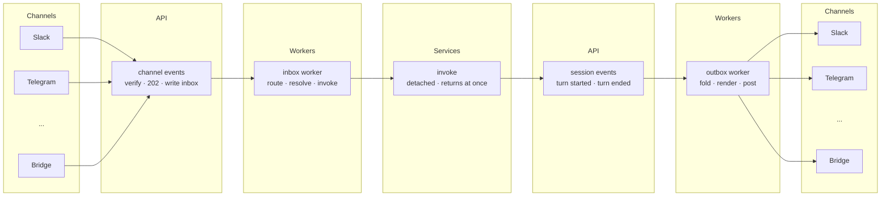

# Channels: architecture (v2)

Assumes `decisions.md`. Platform specifics live in `channels.md`; this document
stays platform-neutral.

---

## 1. What the feature is

A team installs an agent into a messaging platform. Someone addresses it in a
space they work in; the agent answers there, keeps the context of that thread,
and the same thread is readable and continuable in the Agenta web app. Where the agent needs approval for a protected action, the approval
resolves in the same place, without anyone opening a browser.

The word for the connection that makes this possible is a **channel**: a link
between an agent and a messaging surface.

## 2. The shape

There is no new service. Channels is an ingress route plus two workers plus a
domain, sitting on machinery that already exists.

Read left to right. The same channels appear on both edges: a message arrives on
the left and the reply leaves on the right.

The two edges are not symmetric, and that asymmetry is the existing webhook
shape rather than anything new. **Inbound** needs a public route, because the
platform is calling us: the ingress route verifies, answers 202 and writes the
inbox row. **Outbound** needs no route at all, because we are calling the
platform: the outbox worker holds the connection's token and posts directly,
exactly as the webhook delivery task does today — it enqueues from the
dispatcher and makes the HTTP call in the worker, never through an API endpoint.

The **inbox** and **outbox** are tables in the channels domain (`entities.md`),
not steps — written by one side and read by the other, which is why they are not
boxes above.

**Why no separate service.** An always-on gateway would exist only to hold
Socket Mode's outbound WebSockets open and to give per-thread queues a single
owner. Neither is needed. Agenta already accepts public inbound webhooks — the
Composio and Stripe receivers are live, public, exempt from auth middleware and
routed by the standard proxy — so an egress-only posture is not Agenta's
posture. And the queue belongs to the runner (§7), not here.

What remains is the same five steps the existing trigger receiver already
implements: verify a signature with replay protection, answer 202 immediately,
write a durable row, work off the hot path, and let a worker do the rest.

## 3. Two boundary rules

Both are enforced by construction, not by policy.

**The agent runtime never sees platform credentials or destinations.** The agent
emits events against a session. Only the channels domain knows that this session
is reachable at a particular place on a particular platform, and only it holds
the token needed to post there. A fully prompt-injected agent cannot post
somewhere of its choosing or leak a credential it never had.

**The web app and a messaging platform are peers.** Both read and write the same
session through the same APIs. Cross-surface continuity is therefore a property
of sessions, not a channels feature, and it works for the next surface without
new design.

## 4. The system is two mappings

Not a pipeline of subsystems. Everything that is channel-specific is one of two
translations, and everything else is existing machinery.

**external event in → internal message in.** A message, a button click, a
reaction, a command. All become an inbound message on a session. A click carries
its decision as content; it is not a special path.

**internal event out → external event out.** Assistant text, tool activity, an
interaction request, a parked turn. All are frames on the session's stream; the
mapping renders whichever ones the surface cares about.

The capability declaration (`capabilities.md`) is the **configuration of these
two mappings** — not a separate rendering subsystem.

Speaker attribution is stamped in the inbound mapping and nowhere else (D11).

## 5. Inbound

**Step 1 — receive.** The ingress route verifies the platform's signature with
timestamp replay protection, writes a `channel_inbox_events` row keyed
`(connection_id, external_id)`, and answers 202. A redelivery hits the
unique constraint and dies there; nothing downstream thinks about retries.

**Step 2 — route.** The inbox worker resolves the space. No `channel_spaces` row
means the agent may not answer there, and the event is marked skipped —
default-deny, because installation into a workspace must not mean permission to
speak everywhere in it.

**Step 3 — was anyone addressed?** Parse the channel's sigil for an explicit slug;
otherwise the space's default grant, otherwise the connection's default agent.
**At most one agent is addressed by one message.**

If nobody was, **stop here.** The event is already in the log, which is all that
forwardfill requires — no per-agent row, no session touched, no turn (D9). Every
agent in the space will see it on its own next trigger.

**Step 4 — resolve the one agent that was addressed.**

- **4a — grants.** If the agent has any `channel_grants` rows and this space is
  not among them, refuse. Silent and identical across causes (D17).
- **4b — policy.** Rules stated about the agent (wherever it runs), the space
  (whoever acts there) and the pair are intersected against the channel defaults
  and the capability declaration: a stated `false` wins, sets intersect, the
  narrower enum wins. Nothing is stored — a pure function, computed here and
  carried through the turn (`entities.md` §1).
- **4c — thread.** Get-or-create by `(space, external key, agent)`. The current
  session is the thread's most recent row (D12).

**Step 5 — read the backlog.** Fetch this thread's latest trigger row: its
`event_id` is the agent's **consumer offset** into the space's log. Select the
events after it, in `(origin, id)` order. On a thread with no trigger row yet the
offset is the beginning, so the read returns the whole log.

**Backfill happens before that read, and it is guarded by the space, not the
thread.** If `channel_spaces.flags.is_backfilled` is false, the worker fetches the
platform's history and **appends it as events** with `origin = PULLED`, then sets the
flag — so the range read picks those rows up in the same pass, sorted ahead of
everything pushed. The flag is per space because history belongs to the place: the
second agent addressed there reads the same rows rather than refetching, and the two
cannot disagree about what was said. A refusal leaves the flag false so a permission
granted later takes effect (D30, `entities.md` §2.4).

Where `forwardfill` is off, the range read is skipped and the turn takes the
addressing event alone — but the log still accumulates, so enabling it later starts
working immediately.

**Step 6 — invoke, detached.** Mint a `turn_id`, invoke **once** with the whole
range as new messages, then append a trigger row at the addressing event carrying
that `turn_id`. That insert is what moves the offset.

This is why fill needs no machinery of its own: unaddressed messages are just log
rows, and a trigger is a range read plus one insert. Two workers racing the same
addressing collide on `(thread_id, event_id)` and one loses — nothing is claimed or
marked. And because each agent reads with its own offset, one agent's turn can never
consume another's context.

`turn_id` is **ours to mint**: the runner accepts a caller-supplied `turnId` and
only generates one when it is omitted. So the worker never has to learn the id after
the fact — it chooses it, records it, and passes it in.

The call is **detached** — it returns as soon as the run has started rather than
holding a connection for the whole turn. An attached call would block a worker on
I/O for minutes and lose the turn on restart. Detached invoke exists today and
runs genuinely survive the caller disconnecting: the runner marks the client gone
but deliberately does not abort, with a watchdog keeping the run alive.

The credential is the invoking user's, so the turn runs with their permissions
and is attributed to them.

## 6. Outbound

### 6.1 The dependency: nothing is pushed today

Because the invoke is detached, nothing is watching the turn. Everything the
channel must render has to *arrive* — and today nothing does.

- **Turn completion** — the terminal frame is written as a record, and the turn
  is marked complete by a direct write. Neither publishes anything. There is no
  "turn X finished" signal to subscribe to.
- **Interaction raised** — creating the interaction row is a pure passthrough to
  the DAO. No publish, no webhook.
- The platform's event-type vocabulary contains **no session, turn or
  interaction events at all**.

So an outbox worker today would have to poll. That is the one hard dependency
this design has, and it is not channels work: **the turns service must publish.**

**Two events, not one: turn started and turn ended.** The first is what makes a
typing or working indicator possible — post on start, then edit that same message
with the answer on end, which is precisely what the outbox's receipt column
exists for. On a surface that cannot edit, the start event simply renders
nothing. (A staleness rule for indicators whose turn never completes is worth
having eventually, but it is a turn-liveness question rather than a channels one.)

**This is an internal queue, not the webhook subsystem.** Webhooks exist to
deliver to *customer* URLs — subscriptions, signing, retries, delivery logs, SSRF
checks. None of that applies to an in-process consumer. The turns service
publishes to an internal queue of the kind records and tracing already use, and
the outbox worker consumes it. Whether these events later also become
customer-facing webhook types is a separate decision; riding the internal queue
does not imply entering the webhook vocabulary.

So the work is two publishes and a consumer, not an event subsystem — and the
hook points already exist. `SessionTurnsService.append_turn` and
`complete_turn` are both thin DAO passthroughs today, and the runner already
calls both: append at the start of a turn, complete at the end. Adding a publish
to each is server-side and in the service layer, so every caller gets it without
the runner changing at all.

Session and interaction event types on the event bus unblock push-based
approval and turn-completion delivery to any surface — that work is sized at
days. **One event carries both**, because a batch response *is* a fold over a
turn's events. `sdk/agents/fold.py` is a pure function over an iterable —
`batch = fold(stream)`, as its own docstring puts it — returning
`{messages, stop_reason, pending_interaction}`. It already decides what counts,
discarding thoughts, usage, files and data; and it already handles approvals,
surfacing `pending_interaction` when `stop_reason == "paused"`, shaped so that
"headless callers can act on `{id, tool}` without parsing the ACP payload".

So there is no separate interaction signal to design, and no new "batch result"
entity. The whole outbound mechanism is:

1. **turn started** — the worker posts an indicator and keeps the receipt
2. **turn ended**, carrying `session_id` and `turn_id`
3. the worker **queries that turn's records** — they carry `turn_id` and a
   per-turn `record_index`, so "this turn's events in order" is a direct read
4. it calls **the same `fold()`** the attached batch path calls
5. the result is either the answer or what the agent is paused on, and the worker
   edits the indicator into it

That is the single mechanism, rather than interactions through one path and
responses through another.

**No marker on turns is needed to tell channel turns apart.** The event names the
session, so the worker checks whether it holds a thread for that session —
one indexed lookup on a table it owns. Threading a channel-originated flag
through invoke into the turn would buy a filter that is already cheap, at the
cost of making the turns service know about channels. It can be added later if
that lookup ever becomes hot; starting without it keeps the boundary clean.

Until the events exist, the outbox worker polls the records and turns queries
with the same fold — workable, wasteful, and deletable the moment the events
exist.

### 6.2 Rendering

The runtime emits a stream of typed events. The outbound mapping projects them
into a small vocabulary and renders per the surface's declared capabilities:
progress as an edited message where editing exists and as an occasional new
message where it does not; approvals as buttons where buttons exist and as
numbered replies where they do not.

Two exclusions are deliberate. **Model reasoning never leaves the platform as
channel content** — a status line is portable and safe, internal reasoning is
neither, and once posted it is in the customer's retention forever. **No raw
pass-through of runtime payloads** — a surface depending on runtime internals
would freeze them into a compatibility contract.

### 6.3 Approvals need no special path

An approval request is already an ordinary
event on the session's stream, and an answer is already an ordinary inbound
message — matched by tool call, with the runner resolving its own bookkeeping.
So the outbound mapping renders an approval like any other frame, and the inbound
mapping turns a button click into a message like any other. One structural rule
belongs to the outbound mapping rather than to an approvals subsystem: **the card
renders from the recorded tool call, never from text the model composed.** An
agent that has been manipulated must not be able to compose its own approval
card.

Authorising the click is the same identity check every inbound message needs,
with different consequences.

## 7. What belongs to the platform, not here

**Session events (blocking).** Turn completion and interaction creation must be
published (§6.1). Without them the outbound path polls. This is the one
dependency channels cannot ship around, and it benefits every surface, not just
this one.

**Input sequencing (not blocking).** Today a session refuses an overlapping turn,
which forces every caller to invent backpressure. The host should accept
submissions and sequence them itself — queue behind the running turn, or fold into
it. This is not channels-specific; the web app hits the same wall.

Until it lands, the inbox worker retries on refusal and does nothing else. No
coalescing, no steer-or-queue decisions — those are the runner's, and building
them here is what would stop the runner work from happening. Because only
triggers contend for a turn (D9), and triggers are far rarer than messages, the
retry is adequate.

**Server-side history hydration.** The server stores the transcript but callers
still ship history on each turn. Hydrating server-side is what makes "any surface
continues any session" true without every surface carrying its own copy.
Co-designed with the runner, not an API-only concern.

## 8. Security posture

1. **Bring your own app.** Self-hosters create their own platform app from a
   manifest we publish; tokens are issued by their workspace to their deployment
   and never transit our infrastructure. There is no shared vendor app to
   compromise.
2. **Tokens live in the vault**, encrypted at rest, referenced by connections,
   with rotation as an admin flow.
3. **Credentials and destinations never enter the agent runtime** (§3).
4. **Default-deny exposure.** A space must be granted before the agent answers
   there; agents may be further restricted per space.
5. **Untrusted input is assumed hostile.** Channel content is the definition of
   untrusted model input. The mitigations are the boundary rules above, plus
   approval cards rendered from structured data only, plus the agent's blast
   radius being its tool policy.
6. **Files cross a boundary.** A platform attachment is fetched by the channels
   domain, stored as a session attachment, and enters the run as a reference —
   platform URLs with embedded credentials never reach agent context.
7. **Loop hygiene is a stop command, not a heuristic.** Adapters mark
   bot-authored messages and the app's own identity, and the domain never treats
   its own posts as input. Beyond that, a runaway exchange is halted by `!stop`
   rather than by an exchange counter: a counter guesses at intent and is wrong
   in both directions — it blocks legitimate agent-to-agent work and does not
   help when a human-driven loop runs away. An explicit stop is visible to
   whoever is watching and maps onto the runtime's existing cancel.
8. **Audit is structured and separate from content.**

**What this posture does not claim.** Channels is not egress-only — Agenta
accepts public inbound webhooks, and channels does too (§2). Nor does the agent
ingest only the conversation it is part of: what is ingested is a per-space
setting the operator chooses, per the permission model every platform actually
offers (§9). The genuinely strong story is bring-your-own-app.

## 9. The permission reality

On the two largest platforms there is **no narrow grant**. The permission that
lets the agent see a follow-up in a conversation it is already in is the same
permission that lets it read the whole space. There is no "just my threads" scope
anywhere.

So the honest install story is: grant the broad read, or the agent must be
addressed on every single message. Which of those we default to is P1 in
`decisions.md`, and it is a product call with a security story attached rather
than an architectural one.

The corollary is D10: attempt what the capability allows, record what failed, and
let a permission change take effect without anyone re-running setup.

## 10. Extending to surfaces we cannot build

A bridge is a small service a customer runs, speaking their platform on one side
and a documented Agenta contract on the other. To the platform it is just another
connection: same tables, same capability declaration, same rendering. Nothing
downstream can tell it is not first-party.

This is a **wire contract, not a plugin API**. In-tree contributions couple the
customer to our release train and put maintenance of untestable code on us;
in-process plugins are code execution inside the process holding every token.
A versioned wire contract is language-agnostic, crash-isolated and
upgrade-independent — and it is the only mechanism a hosted cloud can offer
safely.

First-party adapters implement the same interface, reached by a process call
instead of a wire call, and declare capabilities the same way. A contract only
third parties use would rot; this one cannot.

Details in `contract.md`.
