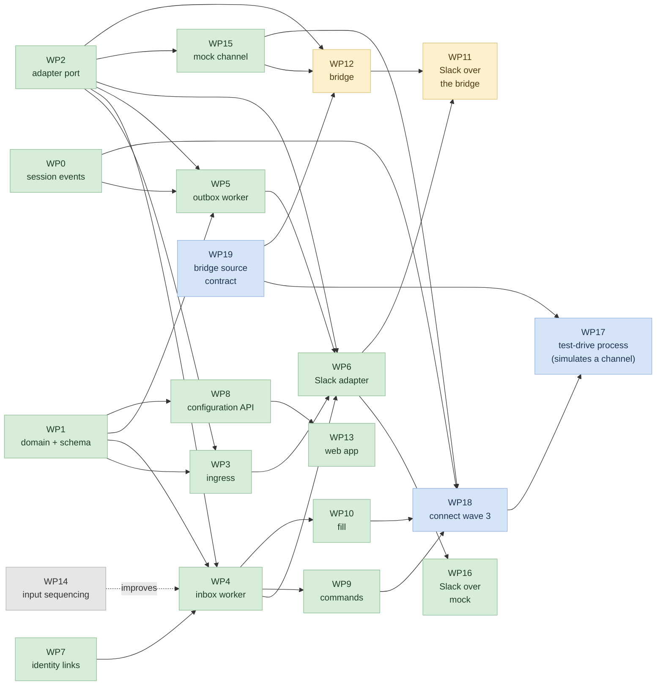

# Channels: work packages

Assumes the rest of `v2/`. Packages, not a schedule — there is no sizing and no
sequencing beyond what the dependencies force.

A package is a unit that can be built, reviewed and merged on its own. Where two
packages could be one, they are split if they can land independently or if they
belong to different owners.

Each package has a spec and a task list in [`workstreams/`](workstreams/), which
also carries the file-ownership table and the rules for running packages in
parallel worktrees. This document stays the map; those are the working documents.

---

## Dependency graph

Green is merged (through C4 — every package of waves 1–3 is in `channels-c3`), blue
is the next wave (wave 4: connect it, decide the bridge protocol, then drive it),
yellow is later, grey is deferred to the very end.

Green means **merged**, not **reachable**: `F36` records that commands, fill and the
mock adapter have no callers, which is exactly what WP18 exists to fix. A green node
whose capability nothing invokes is the failure mode this project keeps hitting, so
the distinction is worth holding in mind while reading the graph.

**WP1** and **WP2** — the domain and the port — have no dependencies and gate most
of the rest. Everything else follows.

**WP0** (session events) is a hard edge — WP5 polls without it and must not ship
that way — and it is **in C4**, not adjacent to it: C4's exit condition is that
polling is deleted, which requires the events. It touches the sessions turns
service rather than any channels path, so it needs the sessions owner's review,
but building it here is a smaller ask than requesting someone else build it.

**WP14** (input sequencing) is the dashed edge and the one genuinely deferred
package: channels works without it and WP4 needs no revisit when it lands. It goes
last, with Telegram and Discord.

**WP15** (mock channel) depends only on the port, and the bridge depends on it
rather than on Slack. That edge was `WP6 --> WP12` while Slack was the only
adapter; `mock` is the better first bridged channel because it removes the
platform as a variable — a divergence over the wire can then only be the
transport's. WP11 keeps both edges: it holds real Slack against its in-process
twin, so it needs WP6 and WP12 both.

---

## Integration checkpoints

The graph says what depends on what. Checkpoints say **when the packages meet** —
because packages built in parallel worktrees are correct in isolation and wrong
together, and the only question that matters is where that gets discovered.

A checkpoint is a **merge point with a demonstrable behaviour**, not a date. It is
reached when its exit condition can be shown running on the merged base, not when
the constituent packages report done. Between checkpoints, packages do not
integrate with each other at all.

Each has an **owner file set that gets serialised** (see `workstreams/README.md`),
because the shared wiring — `api/entrypoints/routers.py` above all — is edited at
checkpoints and never between them.

### C0 — The seed

**Merges:** nothing. **Produces:** the base commit every worktree branches from.

The declared surface, all raising `NotImplementedError`: `core/channels/`'s
`dtos.py`, `types.py` (exceptions included, §5), `interfaces.py`, and the adapter
interface plus capability structure. Taken verbatim from `entities.md` §4–§7 and
`capabilities.md`.

Nothing depends on anything yet, and **this is the only checkpoint that is pure
interface**. It exists because the dependencies between packages are almost
entirely interface dependencies, and once the interfaces exist, twelve packages
start at once.

**Exit condition:** the stubs import cleanly, `mypy` passes over them, and a test
that instantiates each DTO with representative values passes. No behaviour.

**Serialised here:** the seed itself, plus the empty `channels` package
registration in `api/entrypoints/routers.py` — the import block and nothing else,
so that four packages later add their own wiring to a file that already has the
domain in it.

### C1 — A message lands and is persisted

**Merges:** WP1, WP2, WP3. **Needs:** C0.

The first checkpoint with behaviour, and the narrowest useful one: a signed request
arrives at the ingress and a row exists. No routing, no invoke, no adapter beyond a
fake.

This is where the **three-way seam between schema, port and route** is tested, and
those three are exactly the packages with no dependencies of their own — so C1 is
reachable from a cold start with no waiting.

**Exit condition:** a signed request to `POST /channels/slack/events/` writes
exactly one `channel_inbox_events` row and answers 202; an unsigned one is
rejected; a redelivery of the same event writes no second row. The contract suite
fails a deliberately lying fake adapter.

The migration's apply/downgrade is **not** part of this gate and is never a pytest
test: a downgrade drops the tables, so running it against a shared database
destroys whatever else is using them. It is checked by hand against local Docker
Postgres.

**Serialised here:** WP1's migration (revision `oss000000021`), WP3's
`_PUBLIC_ENDPOINTS` line, and the DAO/service wiring in `api/entrypoints/routers.py`.

### C2 — A mention becomes a turn

**Merges:** WP4, WP7, and WP5 against polling. **Needs:** C1.

The vertical slice: a message that addresses an agent produces a running turn on
the right session, and its answer comes back to the platform. WP5 rides polling
here on purpose so this checkpoint does not wait on WP0, which is not our code.

**Exit condition:** end to end with a fake adapter — mention in, answer out, in the
right thread, attributed to the linked user. An unaddressed message writes its log
row and nothing else. Two agents in one thread run independently. A mention during
a running turn is retried until accepted, never dropped, never duplicated.

**Serialised here:** both workers' registration in `api/entrypoints/routers.py`,
merged as one edit rather than two.

### C3 — Slack works

**Merges:** nothing — WP6 and WP8 landed at C2, ready together with the rest of
wave 2. **Needs:** C2, and `F1` applied — done: the adapter registry, the inbox
dispatch task, the two worker queues and the configuration router are wired.

C3 is therefore a **verification** checkpoint over merged code, not a merge. The
wiring is structural; C3 is where a message first travels the path.

The first real platform, and the first checkpoint a person outside the team could
use. WP8 joins here rather than earlier because a real channel is the first thing
that makes configuration worth having a UI-shaped API for.

**Exit condition:** a mention in a real Slack workspace produces an answer in the
same thread; an approval resolves from a button click without opening a browser; an
operator can configure a connection end to end over the API.

**Serialised here:** WP8's router registration and its `check_action_access` wiring.

#### Status: deployed and green, exit condition NOT met

The stack was deployed from scratch (`--nuke`) and the canonical suite run against
it: api 2754 unit / 43 integration / 802 acceptance; sdk 2003 / 145 / 118; services
100 / 15 / 145; runner 2070 pass with the 19 known `F21` failures in their three
usual files. Zero new failures anywhere. Both Python and TypeScript clients were
regenerated and verified — 30-for-30 against the deployed schema, every EE resource
intact, and the api acceptance layer ran against the rebuilt `agenta-client`.

What the deployment newly established, beyond the offline checks:

- both channels queues consume from a real Redis, with no config change
- all eight channels tables build from an empty database, WP7's identity table
  included — the single-migration decision held
- `kind` columns are `varchar` while `origin` and `state` are real Postgres enum
  types, so a new channel kind needs no migration and `query_events_since`'s
  declaration-order sort still holds
- 449 paths / 22 channels paths served, matching the in-process dump exactly

**None of that is the exit condition.** No message has travelled the path: no Slack
mention, no button approval, no turn. `F36` is why — commands, fill and the mock
adapter have no callers, and `F31` leaves `streams:sessions` unconsumed. C3 is
*deployable and verified*, not *proved*.

### C4 — It is pleasant

**Merges:** WP15, then WP16; and WP0, WP9, WP10, WP13. **Needs:** C3.

**Merged, and the exit condition is NOT met.** All six are in `channels-c3`: api
2754 unit / 43 integration / 802 acceptance, web 252, zero conflicts, deployed and
green. But `F36` — commands, fill and the mock adapter have no callers at all, and
`F31` leaves `streams:sessions` unconsumed, so "each command works in a real space"
and "WP5's polling is deleted" are both still false. **The remaining work is wave 4
(C5), below.** C4 delivered the packages; it did not connect them.

**WP15 → WP16 is ordered within the checkpoint**, the same way WP12 → WP11 is at
C6, and for the same reason: each pair is a channel-shaped harness plus the real
Slack adapter run through it. `mock` proves the port is a port; `slack-over-mock`
then proves the Slack adapter is correct against Slack's own contract, reusing the
scripted-workspace technique WP15 establishes. Separate packages because the
deliverables differ — one is an adapter, the other a fake platform plus tests — but
done together, since the second is the first pointed at a real adapter.

WP15 leads the checkpoint: a mock channel is what lets the capability matrix be
exercised without credentials, and the arms no real platform reaches (no threads,
no buttons, no history) have no other home.

**WP0 is in this checkpoint, not outside it.** C4's exit condition is "WP5's
polling is deleted, not disabled", which cannot be met without session events — so
listing WP0 as an external dependency while planning the checkpoint that requires
it was incoherent. It is also small: `append_turn` and `complete_turn` are five-
and eight-line DAO passthroughs, `publish_record` is the template to copy
(fail-open Redis included), and `records_worker.py` already sits in the directory
the consumer goes in, beside three other `StreamConsumer` subclasses. It edits
`core/sessions/turns/service.py`, which channels does not own — that is a review
conversation with the sessions owner, and a smaller ask than requesting they build
it.

Everything that makes the difference between working and usable: commands, fill,
and the configuration UI. Grouped because none of them is on anyone else's critical
path and each can slip without blocking the others.

**Exit condition:** each command works in a real space; messages sent between
mentions arrive as context on the next trigger; the flag — never a count of
`PULLED` rows — guards the one-time fetch, and a refusal leaves it false. WP5's
polling is deleted, not disabled.

### C5 — Wave 4: it actually runs

**Merges:** WP18, then WP19; and WP17 (rescoped). **Needs:** C4's packages, which
are merged.

Wave 4 exists because C4 shipped five capabilities and connected one. Everything
here is a **connection**, a **contract decision**, or the **harness that proves
either** — no new domain surface. Three packages, in dependency order.

#### WP18 — connect what wave 3 built

The `F36`/`F29`/`F31` wiring, as one package rather than three checkpoint edits,
because the call sites are the same two files and the ordering questions interact.

- **Commands and fill both belong in `dispatch_event`** (`inbox.py:155`), the one
  place holding a resolved thread: commands parse before `compose_input`, backfill
  runs before `open_turn`. `F29`'s ordering tension is settled here — backfill's
  refusal `Status` wants a trigger row that does not exist yet at the point
  backfill must run.
- **Register `mock` in the adapter registry.** One line, and it is what lets the
  rest be driven without credentials.
- **Subscribe the outbox to `streams:sessions`, and delete `poll_turn`.** The
  consumer already exists: `ChannelsOutboxWorker.on_turn_started` and
  `on_turn_ended` are separate methods and `poll_turn` only *infers* which to call
  by re-reading `latest_turn` and branching on `turn.end_time is None`. WP0's event
  carries `kind` and `turn_id`, so the inference deletes. This is a correctness
  gain, not a tidy-up: `latest_turn` can return a different turn than the one whose
  tick is being handled.
- Note the entrypoint is **`worker_streams.py`**, not the `worker_queues.py` that
  `CU-1` edited — a Redis stream, not a taskiq queue.
- `F32` blocks half of `!use:<id>`: `create_thread` exists on the DAO with no
  service method in front of it. Add it, or scope `!use` down and say so.

#### WP19 — the bridge `source` contract, designed then built

`F37`, pulled forward out of the bridge checkpoint because it is a **protocol** decision and every later
bridge inherits it. One `/channels/bridge/events/` route is correct; the
multiplicity is a wire-contract property, and the contract carries `source` and
`bridge.name` without ever saying what core does with them. Nothing reads `source`.

Decide in `contract.md` **first** — is `source` authoritative, is the credential,
or does the credential decide with `source` as a cross-check? — then implement.
Also undecided and persisted: the channel key for a bridged platform
(`bridge/<name>`, or a key declared at `hello`), which is what
`gateway_connections.provider_key` stores and what the registry is keyed on.

A constraint that rules out the naive fix either way: `_ingest` looks the adapter up
*before* verifying, but a credential-derived channel is not known *until*
verification.

#### WP17 — the test-drive process (rescoped)

Originally scoped as a bridge harness for the bridge checkpoint. Rescoped: it is the **process that simulates a
channel end to end**, and therefore the thing that exercises WP18's wiring —
commands, fill and mock have no other honest driver. A real out-of-process
counterpart, real sockets, real signing, real concurrency, real duplicate delivery.

It keeps the two-bridge test, which is what proves WP19's decision was implemented
rather than assumed. Ordered last: it drives WP18's wiring and asserts WP19's
protocol, so both must exist.

**Exit condition:** a message enters through a channel the platform does not know
about, becomes a turn, and an answer comes back out — with no Slack credentials
involved. A command works. Fill supplies context from messages sent between
mentions. `poll_turn` is gone from the tree. Two bridges coexist behind the one
route, each resolving to its own connection.

That is the first time anything in this project will have travelled the whole path.

### C6 — The bridge is proved

**Merges:** WP12, then WP11. **Needs:** C5 — WP17 and the `source` contract land there.
The bridge's first channel is
`mock` (WP15), which lands there, so this no longer hangs off C3.

Ordered within the checkpoint, because both WP11 and WP17 need WP12's adapter to
exist first. WP11 and WP17 are independent of each other and test different
things: WP11 runs WP6's adapter behind the wire and compares it to the in-process
run; WP17 stands up a real bridge **process** on the far side of the wire, so the
contract has a counterpart that is not us.

**`F37` must be settled in the contract before WP17 is written.** One route for
every bridge is right; the multiplicity is a **wire-contract** property, and the
contract already carries the identifying fields — `source` inbound, `bridge.name`
at `hello` — without ever saying what core does with them. Nothing reads `source`.
Decide there first (is `source` authoritative, or the credential, or the credential
with `source` as a cross-check?), because that decision is the protocol a
third-party bridge author implements against. The `ingress.py` change follows and
is small; the specification is the work.

**Exit condition:** the bridged Slack adapter and the in-process one are
observationally indistinguishable on the same install — same thread, same content,
same edit-in-place, same degradation, same refusal text. Every difference found was
fixed in the bridge or the contract, never accommodated in the harness.

The contract is **still not published** here. That waits on a non-Slack channel,
which is a follow-up rather than a package.

### What is not a checkpoint

**WP14** (input sequencing) gates nothing structurally: it improves C2's behaviour
whenever it lands and requires no revisit of anything. It is deferred to the very
end, with Telegram and Discord.

**WP0** was listed here too, on the grounds that it is not our code. That reading
is withdrawn — it merges *inside* C4, because C4's exit condition is deleting
WP5's polling and that is impossible without the events.

---

## WP0 — Session events

**Not channels code, but channels' work to do.** It touches the sessions turns
service, so it needs the sessions owner's review — but channels is its only
consumer, C4 cannot complete without it, and it is two publish calls against a
pattern (`publish_record`) that already exists beside a consumer directory that
already holds three `StreamConsumer` subclasses.

Publish two events from `SessionTurnsService`:

- `append_turn` → **turn started**, carrying `session_id` and `turn_id`
- `complete_turn` → **turn ended**, same payload

Both methods exist and are thin DAO passthroughs; the runner already calls both
(append at turn start, complete at turn end), so **nothing in the runner
changes**. The publish goes on an internal queue of the kind records and tracing
already use — not the webhook subsystem, which exists for customer URLs and
carries subscriptions, signing and delivery logs that an in-process consumer does
not need.

**Depends on:** nothing.
**Blocks:** WP5 in its final form. WP5 can be built and merged against polling
first, so this does not block the critical path — but the polling code is
deleted when this lands, and it should not ship to customers.

**Done when:** both events are published, and a consumer can observe a turn's
start and end without polling.

---

## WP1 — Domain and schema

The seven tables and the stack around them: dbas, dbes, dtos, types, models, dao,
service. See `entities.md`, which is column-level.

Includes the migration, and the one core function that composes an `external_key`
from a structured locator, at either grain — **one function, no exceptions**, since
the failure mode is two code paths building keys and one place mapping to two
threads.

Also includes **`resolve_policy`** (D25) — the pure intersection of the agent,
space and grant policies over the channel defaults, under the capability
declaration. No I/O, so it is fully unit testable here, and it must be, because
the interesting cases are the conflicts: stated `false` beating stated `true`, two
sets intersecting to empty, and the narrower enum winning. It returns a
`ChannelEffectivePolicy` whose `decided_by` names which level decided each field,
which WP13 needs to explain a setting.

Excludes the routers (WP8) and anything adapter-shaped (WP2).

**Depends on:** nothing.
**Blocks:** WP3, WP4, WP5, WP8.

**Done when:** the migration applies, the DAO round-trips every entity, the dedup
contract holds — `record_inbox_event` returns `None` on a duplicate rather than
raising — and a policy denied at any one level stays denied however permissive
the other two are.

---

## WP2 — Adapter port and registry

`ChannelAdapterInterface`, the `channel_key → adapter` registry, and the
capability declaration as a normalised structure (`capabilities.md`).

Includes **normalisation at the boundary** — clamping, defaulting a declared zero,
ignoring unknown keys — because it is the same code for a first-party adapter and
a bridge, and writing it once is the point of the port.

Also includes the **contract test suite** that holds an adapter to its own
declaration. The studied failure mode of adapter ecosystems is the silent no-op,
so the suite ships with the port, not with the first adapter.

**Depends on:** nothing.
**Blocks:** WP3, WP4, WP5, WP6, WP12.

**Done when:** a fake adapter can be registered, declares capabilities, and fails
the contract suite when it lies about one.

---

## WP3 — Ingress route

**One literal route per channel** — `POST /channels/slack/events/`, never
`/{channel}/events/` — plus `POST /channels/bridge/events/`, which bridges share
because their channel key is not known when the route table is built. Verify the
platform's signature with timestamp replay protection, write a
`channel_inbox_events` row, answer 202. Nothing else — no routing, no resolution.

Registration in `_PUBLIC_ENDPOINTS` and the proxy config, following the existing
trigger and billing receivers exactly: they use `/composio/events/` and
`/stripe/events/`, neither parameterised. The literal form is what makes the
`startswith` exemption exact — see `entities.md` §9, where a parameterised route
would have meant exempting the whole domain.

**Depends on:** WP1 (to write the row), WP2 (to reach the adapter's verifier).
**Blocks:** WP6.

**Done when:** a signed request writes exactly one row, an unsigned one is
rejected, and a redelivery is absorbed by the unique constraint.

---

## WP4 — Inbox worker

Routing and resolution, then a detached invoke. The chain in `architecture.md` §5:
resolve the space (default-deny); decide whether **anyone** was addressed (sigil,
then the space's default grant, then the connection's default agent); and if nobody
was, stop — the event is already in the log and that is all forwardfill needs.

If someone was: check grants, resolve policy, get-or-create that one thread, mint a
`turn_id`, `open_turn` (which appends the trigger row at the addressing event, at
`STARTED`), invoke detached, and `settle_turn` when the fate is known. The
`turn_id` is **ours to mint** — the runner accepts a caller-supplied `turnId` and
only generates one when omitted — so nothing has to learn the id afterwards, and
the trigger row can be written before the agent runs rather than after.

Handles a refused overlapping turn by **retrying, and nothing else** — no
coalescing, no steer-or-queue. Those belong to the runner (WP14), and building
them here is what would stop that work from happening.

Concretely: the session raises `SessionTurnInUse` when it is already alive, which
the API surfaces as a 409. WP4 catches that and retries with backoff. It must
**not** reach for the `force` path that preempts the running turn — a second
mention interrupting the first agent mid-answer is a worse failure than waiting.

Excludes the backlog read and the history fetch (WP10) and command parsing (WP9);
this package treats every trigger as a single message.

**Depends on:** WP1, WP2, WP7.
**Blocks:** WP6, WP9, WP10.

**Done when:** an addressing event becomes a running turn on the right session with
the right agent; an event in an unconfigured space is skipped; an unaddressed event
writes **nothing** beyond its log row; **two agents in one thread run
independently** — mentioning the second does not disturb the first's turn; and a
**mention arriving during that agent's own running turn is retried until accepted,
never dropped and never duplicated** (the behaviour channels ships with until
WP14).

---

## WP5 — Outbox worker

Consume turn events, fold, render, post, record the receipt.

- **turn started** → post an indicator, store the platform's receipt in
  `data.external_locator`
- **turn ended** → query that turn's records by `turn_id`, call **the same
  `fold()`** the attached batch path calls, edit the indicator into the result

The indicator and the answer are **one row for its whole life** (D28): the edit
finds it by its stored `key` and updates it in place, so a turn that posts once and
edits twice leaves one row and one message, not three.

`fold()` already returns `{messages, stop_reason, pending_interaction}` and
already surfaces a pending approval when the turn paused — so approvals and
answers come out of one function and there is no second path to build.

Rendering degrades per the declaration: buttons where they exist and numbered
text where they do not, split where a message exceeds `max_chars`, new messages
where editing is unavailable. Two hard exclusions: **model reasoning never leaves
as channel content**, and **no raw pass-through of runtime payloads**.

Build against **polling** so this package does not wait on WP0; delete the polling
when WP0 lands.

**Depends on:** WP1, WP2. WP0 for the final form.
**Blocks:** WP6.

**Done when:** a completed turn appears in the target space, an approval renders
as a card built from the recorded tool call, and a redelivery does not double-post.

---

## WP6 — Slack adapter

The first real channel, and the package that proves WP2's port is the right shape.

Inbound and outbound mapping, capability declaration, signature verification,
and the platform's own setup path (app manifest, scopes, install flow).

Slack first because it is the hardest of the three first-class targets —
`@`-tokenisation forces the sigil design, its native threads exercise the unit,
and its permission model is the one that makes backfill a per-attempt question. A
channel that works on Slack is unlikely to be surprised by Telegram.

**Depends on:** WP2, WP3, WP4, WP5.
**Blocks:** WP11, WP12 — both run *this* adapter, one of them out of process.

**Done when:** a mention in a Slack channel produces an answer in the same
thread, and an approval resolves from a button click without opening a browser.

---

## WP7 — Identity links

Mapping a platform user to an Agenta account, so a turn runs with that user's
permissions and is attributed to them (D2).

Key shape is driven by the declaration's `identity` block — embedding a workspace
id is correct on some platforms and noise on others — and `stable: false` needs a
rebinding path.

Also carries **refusal** (D17): one sentence naming the requested slug, never the
reason, identical whether the agent does not exist, is not in the roster, or is
not granted here.

**Depends on:** nothing structural; needs WP2's declaration shape to key
correctly.
**Blocks:** WP4.

**Done when:** an unlinked user can link, a linked user's turn is attributed to
them, and refusals are indistinguishable across the three causes.

---

## WP8 — Configuration API

The non-public routes in `entities.md` §9 — connections, agents, spaces, grants,
threads — with `check_action_access` inline and permissions mirroring the
workflow roles.

**No cross-table write validation is needed.** The default agent is a flag on the
grant rather than a slug on the space, so "the default must be granted here" is
enforced by the grant's existence (D29) rather than by a check this package would
otherwise own.

**Depends on:** WP1.
**Blocks:** WP13.

**Done when:** an operator can configure a connection end to end over the API,
and exactly one agent can be default in a space — a second is rejected by the
partial unique index, not by application code.

---

## WP9 — Commands

`!new`, `!stop`, `!sessions`, `!use:<id>`, with the sigil read from the
declaration rather than hardcoded. Grammar is `!command[:arg]` — colon rather
than space, so the token stays self-contained.

`!sessions` lists **this thread's own history**, which makes the
authorisation question trivial. `!stop` maps onto the runtime's existing cancel
and is the loop-hygiene mechanism (D23). `!new` mid-turn lets the running turn
finish (D24).

Where a platform has a native command surface that works in-conversation, it may
register aliases producing the same internal command.

**Depends on:** WP4.
**Blocks:** nothing.

**Done when:** each command works in a real space, and `!new` mid-turn does not
disturb the turn in flight.

---

## WP10 — Fill

Backfill and forwardfill (D21), which in the log-and-offsets shape
(`entities.md` §2.4) is **the range read plus the one-time fetch** — there is no
queue, nothing to claim, and nothing to mark.

**Forwardfill** — a trigger reads its thread's latest trigger row for the offset,
selects the space's events after it ordered by `(origin, id)`, and invokes **once**
with all of them. Unaddressed messages need no work at all: they are already log
rows. Turning the policy off skips the read, not the write, so enabling it later
works immediately over history already present.

**Backfill** — the one-time fetch, **per space rather than per thread**: a Slack
thread has one history, so the first agent addressed there fetches it, the rows are
appended with `origin = PULLED`, and every later agent reads the same rows.
`flags.is_backfilled` on the space records that it happened; the outcome of the
attempt is `Status` on the trigger row whose turn tried it (D10).

Two details are easy to get wrong and both are testable. The guard is the **flag**,
never a count of `PULLED` rows — a successful fetch can return nothing, and a count
cannot tell that from never having fetched, so the tight-cap install refetches
forever. And a **refusal must leave the flag false**, or a permission granted
tomorrow never takes effect (D30).

Includes the concurrency case that the shape makes cheap: two workers racing the
same addressing collide on `(thread_id, event_id)` and one loses.

Split from WP4 because WP4 is complete and useful without it, and because this is
where the retention question first bites: a busy space with forwardfill on
ingests messages the agent was never addressed in.

**Depends on:** WP4.
**Blocks:** nothing.

**Done when:** messages sent between mentions arrive as context on the next
trigger, and a platform declaring no history support is never asked for it.

---

## WP15 — Mock channel (in-process)

A first-party adapter for a channel that does not exist: `mock`. It declares a
full capability set, records what it was asked to post, and replays scripted
inbound events. No credentials, no workspace, no network.

**Why this should have come before Slack.** The capability matrix — degradation,
buttons-vs-numbered-text, threading grains, fill, refusal text — is platform
independent by design, and `mock` can exercise all of it in unit tests. Slack was
built first, so several capability paths are currently proved only against
`WellBehavedFakeAdapter` (a test fixture, not an adapter) or not at all. Two
things followed from that ordering:

- WP2's contract suite asserts signature behaviour with a fixed fake header
  scheme, which no adapter doing real HMAC can satisfy. A `mock` adapter, whose
  signature check is whatever the suite says it is, would have made the suite's
  own shape obvious immediately.
- A capability an adapter cannot reach (a platform with no threads, no buttons,
  no history) has no home to be tested in. `mock` is that home: one adapter whose
  declaration is a test parameter.

`mock` is also the reference implementation the contract documents. A second
first-party adapter is what proves the port is a port rather than Slack's shape
with an interface drawn around it.

**Done when:** the contract suite passes against `mock` unmodified, and every
capability in `capabilities.md` has at least one `mock` declaration exercising
both its supported and unsupported arm.

---

## WP16 — Slack over mock

A **fake Slack API**: an `httpx` transport that answers `chat.postMessage`,
`chat.update`, `conversations.list`, `conversations.replies` and
`conversations.history` the way Slack does, including the failure shapes —
`ok: false` with `error: "missing_scope"`, `channel_not_found`,
`ratelimited` with `Retry-After`, and a 403. The real `SlackAdapter` runs against
it unchanged, since it already accepts an injected `http_client`.

**What this is not.** WP6 already stubs the transport in its unit tests
(`_StubTransport`, which pops scripted response bodies in call order). That proves
the adapter *sends* a request; it cannot prove the adapter survives Slack, because
the stub answers anything with the next canned body. It never rejects a malformed
call, never enforces a scope, never returns an error the adapter has to handle.

**Why it is a rung of its own.** The ladder is: `mock` (WP15) proves the port is a
port; **`slack-over-mock` proves the Slack adapter is correct against Slack's
contract**; the bridge (WP12) proves the wire; bridged Slack (WP11) proves the two
agree. Each isolates one variable. Today there is no test that would catch a Slack
adapter that posts a well-formed request to the wrong endpoint, mishandles
`missing_scope`, or ignores `Retry-After` — the live acceptance test would, but it
needs a workspace and is skipped by default.

**Files.** `api/oss/tests/pytest/unit/channels/slack/fake_slack.py` — the transport
and its scripted workspace state — plus the tests that drive it. No source file
changes: the adapter already has the seam.

**Done when:** every `SlackAdapter` method has a test against the fake covering its
success path and at least one Slack error shape; `fetch_history` raising
`ChannelBackfillRefused` is driven by a real `missing_scope` body rather than a
hand-raised exception; and the fake rejects a request Slack would reject rather
than answering it.

---

## WP11 — Slack over the bridge

The Slack adapter of WP6, run **out of process behind the wire contract**, held
against the in-process one as the reference.

This is a differential test, and it is the reason to do it this way. Both
implementations face the same platform, the same events and the same capability
declaration, so the in-process behaviour **is** the expected output: any divergence
is the bridge's, and cannot be blamed on a platform disagreeing with Slack. A
second platform behind the bridge conflates two unknowns — is the contract wrong,
or is this platform simply different — and that is exactly the confusion a first
bridge cannot afford.

The concrete deliverable is the harness: run one Slack install through the
in-process adapter and one through the bridged adapter, and assert the same
observable outcome — same thread, same posted content, same edit-in-place, same
capability-driven degradation, same refusal text.

**What this does not buy.** It tests the transport thoroughly and the **port's
generality not at all.** A contract shaped around Slack can be Slack-shaped without
anyone noticing, and the studied platforms disagree enough on tokenisation,
visibility gating, threading, editing and identity scope to expose that. So the
port's real review moves to the follow-up channels, and **the contract stays
unpublished until one of them ships on it** — bridged Slack proves the wire works,
not that the schema generalises.

**Depends on:** WP6, WP12.
**Blocks:** nothing.

**Done when:** the bridged adapter and the in-process adapter are observationally
indistinguishable on the same Slack install, and every difference found has been
fixed in the bridge or the contract rather than accommodated in the harness.

---

## WP12 — Bridge

**Ordering note.** `mock` (WP15) over the bridge is a cheaper first bridged
channel than Slack: it removes the platform as a variable entirely, so any
divergence can only be the transport's. WP11 stays the *proof* — a real platform
held against its in-process twin — but `mock` over the wire is the first thing to
get working, and unlike Slack it needs no workspace, so it can run in CI.

The wire contract in `contract.md` made real: HTTP both directions, signed;
`bridge.hello` with the same declaration a first-party adapter answers; the
versioned event envelope; the receipt.

The rules that make it operable by strangers are part of the deliverable, not
documentation around it: at-least-once delivery, per-thread ordering,
additive evolution under a must-ignore rule, named extension blocks rather than
an open bag, and a bridge credential that authorises the transport and nothing
else.

**Verified by WP11, published after a follow-up channel.** The two are separate
gates and the distinction matters: WP11 proves the wire is correct by holding it
against an implementation known to work, which is what makes the contract *safe to
build on*. Only a platform that is not Slack proves the schema *generalises*, which
is what makes it safe to **publish** — a contract exercised by one platform in two
transports has met one platform.

**Depends on:** WP2, WP6 (the adapter WP11 runs behind it).
**Blocks:** WP11.

**Done when:** a bridge outside the repo can register, receive delivery commands
and return receipts, against a pinned version — published externally only once a
non-Slack channel has shipped on it.

---

## WP13 — Web app

Configuration surface for WP8: connections, the agent roster, spaces and their
rules, grants.

Policy is stated at three levels and resolved against two more (D25), so the
screen that shows a setting must also show **which level decided it** —
`decided_by` on the effective policy carries exactly that, and without it the UI
has checkboxes that silently do nothing because another level denied the field.

**Depends on:** WP8.
**Blocks:** nothing.

---

## WP14 — Input sequencing

**Not channels work.** Owned by whoever owns the runner; listed here for the same
reason WP0 is — channels depends on it, and leaving it off the graph is how a
dependency becomes a surprise.

Today a session **refuses** an overlapping turn, which forces every caller to
invent its own backpressure. The runner should accept the submission and sequence
it: queue it behind the running turn, or fold it into that turn. Which of the two
is the runner's call, and it is the reason this is not specified here.

Channels ships **without** it. WP4 retries on refusal and does nothing else — no
coalescing, no steer-or-queue — and the retry is adequate because only triggers
contend for a turn (D9) and triggers are far rarer than messages. What the retry
costs is latency under a burst of mentions, not correctness.

Unlike WP0, **nothing is deleted when this lands.** The retry stops firing on its
own once refusals stop happening, so WP4 needs no revisit — which is why this can
follow channels rather than gate it.

**Depends on:** nothing.
**Blocks:** nothing. It improves WP4 and WP9 (`!new` mid-turn), and the web app
hits the same wall independently, so it has its own justification either way.

**Done when:** a submission arriving during a running turn is sequenced rather
than refused, and the caller does not have to retry to get it accepted.

---

## Not packages

Deliberately excluded, recorded so they are not mistaken for oversights.

**Server-side history hydration** — the server stores the transcript but callers
still ship history on each turn. Hydrating server-side is what makes "any surface
continues any session" true without every surface carrying its own copy.
Co-designed with the runner, not an API-only concern.

**Retention** — Agenta has no operational retention today and channels does not
invent one. Worth stating once: WP10 is likely what eventually forces it, and when
it arrives it should look like Agenta's existing model, not a per-row TTL.

**Further channels** — Telegram, Discord, then Teams and WhatsApp. All four are
modelled and verified in `channels.md`; none is a package here. **WP14** (input
sequencing) sits in this same bucket: deferred to the very end, after every
checkpoint, since nothing structural waits on it.

Each is the same shape of work: an adapter behind WP2's port, in process or bridged.
They are follow-ups rather than packages because WP6 plus WP11 establish both paths,
and after that a channel adds no new structure — which is the design working.

Two things ride on the **first** of them, whichever it is, and are worth naming so
they are not lost with the package that used to carry them: it is what gives the
**port its generality review** (expect WP2 and WP5 to change; that is the follow-up
working, not failing), and it is the gate on **publishing the wire contract**
externally (WP12).

**A bridge marketplace** — distribution, verified tiers, a directory. The
contract makes distribution independent of us, which is the point. One
pre-commitment regardless: community code is never auto-installed.
