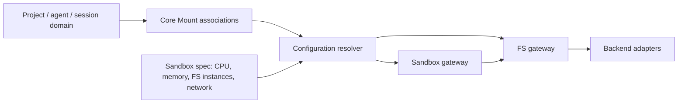
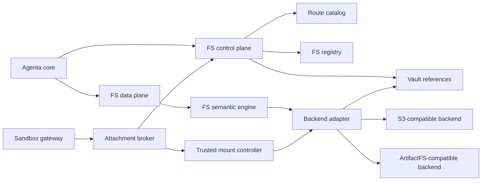

# FS gateway architecture

Status: proposed target architecture.

## 1. Dependency direction

The FS gateway is infrastructure for generic FS instances. Agenta core depends on
it; it does not depend on Agenta's project, agent, or session model.



Core decides which FS instances are associated with a product subject and which
ones enter a sandbox configuration. The FS gateway provisions, operates, and
attaches the resolved FS handles.

## 2. Current baseline

Agenta's API owns `MountsService` and an S3-compatible `ObjectStore`. `Mount`
already stores project plus optional agent/session association, while physical
storage location is derived internally. The runner mounts session files with
geesefs and manages FUSE cleanup and authority refresh.

The split should become:

- current `Mount` association and selection behavior stays in core;
- generic FS behavior moves behind the FS gateway;
- geesefs and backend authority move behind a trusted mount controller;
- the sandbox receives resolved FS configuration.

## 3. Components



### FS registry and control plane

Own generic FS identity, route, capabilities, revisions, retention,
quota, archive/delete, and backend operation state. It authorizes against an
opaque security partition supplied by the platform.

### Data plane and semantic engine

Expose one path-oriented FS API. Normalize paths, enforce tickets,
provide common directory/file behavior, handle conditional mutation and
idempotency, and fill backend gaps with private metadata/journals.

### Route catalog

Resolve `builtin`, `standard`, and `custom` route references to a trusted adapter
and private credential reference. Route namespace expresses endpoint governance.

### Backend adapters

S3-compatible and ArtifactFS-compatible implementations pass the same common
FS conformance suite. Optional extensions are advertised separately.

### Attachment broker and mount controller

Given a resolved FS binding and opaque consumer generation, create a
lease and prepare FUSE, bind, CSI, provider-native storage, or data-plane proxy.
The consumer receives a backend-neutral attachment handle.

### Core configuration resolver

This component is outside the FS gateway. It combines:

- product-domain `Mount` associations;
- explicit sandbox FS entries;
- one-off/ephemeral create requests;
- current run/session context;
- product visibility and lifecycle policy.

Its output is a list of resolved FS bindings. The FS gateway does not
know why a binding was selected.

## 4. Configuration flow

A sandbox FS behaves like other sandbox configuration:

```text
SandboxConfig {
  cpu
  memory
  disk
  fs: [
    { fs_id, mount_path, access, revision, required, lifecycle }
  ]
  network
  environment
}
```

Flow:

1. Core loads explicit configuration and applicable `Mount` associations.
2. Core resolves conflicts, defaults, inherited product rules, and one-off
   requests.
3. Core authorizes each FS handle under the opaque security partition.
4. Core creates any ephemeral FS through the generic create API.
5. Core passes the resolved binding list to the sandbox gateway.
6. Sandbox gateway asks the FS gateway to attach that list to its opaque
   generation handle.
7. Required attachment readiness gates sandbox readiness.
8. Termination detaches every binding; core applies retain/delete intent.

There is no gateway call such as “resolve FS instances for session.” That is a core
configuration operation.

## 5. Create and operate an FS

### Create

1. Authenticate caller and derive an opaque security partition.
2. Resolve an allowed route and required FS capabilities.
3. Reserve an idempotent generic FS record.
4. Provision/open the private backend allocation.
5. Run common FS health probes.
6. Mark ready and return an FS handle.

No project, agent, session, or mount association is part of this request.

### File operation

1. Caller presents a gateway ticket for FS/path/operation.
2. Data plane validates subject, security partition, revision, path, quota, and
   expiry.
3. Semantic engine executes the path operation.
4. Adapter maps it to the private backend representation.
5. Audit identifies FS, caller, ticket, and operation; core separately
   correlates its association/configuration reference.

### Attach

1. Sandbox gateway submits an opaque consumer generation and resolved bindings.
2. FS gateway validates FS access and creates idempotent attachment leases.
3. Mount controller prepares each binding and reports readiness.
4. Sandbox gateway starts/reconciles only after required bindings are ready.
5. Renewal/revoke/detach operate on attachment IDs.
6. Backend credentials never cross the boundary.

## 6. Common FS semantics

The minimum contract is smaller than full Linux POSIX but is a real FS
API:

- canonical relative paths and explicit directories;
- stat and deterministic paginated directory listing;
- streaming whole/range file reads;
- create and conditional replace;
- create directory;
- copy and move with defined idempotency;
- file, empty-directory, and recursive deletion;
- opaque file versions;
- immutable revision reads where supported.

Atomicity is defined per gateway operation. Multi-step backend work is journaled
and exposes a stable operation state rather than leaking backend copy/delete
behavior.

## 7. Backend implementations

### S3-compatible

The adapter turns a private S3-compatible allocation into the common FS.
Bucket, key, prefix, multipart upload, ETag, and STS are implementation details.
A private manifest/journal or equivalent mechanism supplies directory and
recoverable mutation semantics.

### ArtifactFS-compatible

The adapter presents ArtifactFS tree, hydration, overlay, and revision mechanisms
through the same common path contract. Git remote, blob identity, hydration
queues, and daemon details remain private. Refresh/commit/push are optional
extensions.

## 8. Secrets and authorization

- Platform authentication supplies an opaque security partition.
- Core authorizes product associations before resolving configuration.
- FS gateway authorizes generic FS actions within the security partition.
- Route rows contain vault references, never plaintext credentials.
- Backend adapters resolve credentials only at operation/controller time.
- Gateway tickets and leases are short-lived, scoped, and backend-neutral.
- Logs redact secrets and physical backend addresses.

This deliberately duplicates no project/agent/session authorization logic inside
the FS gateway.

## 9. Migration

1. Add a generic FS facade over current mount content.
2. Keep current `Mount` rows as core association records.
3. Map mount ID to FS ID without copying content.
4. Route legacy file operations through the common semantic engine.
5. Move geesefs lifecycle behind the attachment broker/controller.
6. Change core sandbox assembly to emit resolved FS bindings.
7. Make sandbox gateway attach those bindings without product-domain resolution.
8. Add standard/custom and ArtifactFS-compatible routes behind the same API.

## 10. Failure posture

| Failure | Owner and behavior |
| --- | --- |
| Invalid project/agent/session association | Core rejects before FS call |
| Unauthorized FS handle | FS gateway rejects against opaque security partition |
| Conflicting sandbox mount paths | Core/sandbox configuration validation rejects |
| Backend outage | FS gateway exposes stable degraded/retryable operation state |
| Partial mutation | FS semantic engine journals and recovers/compensates |
| Ticket/lease expiry | FS gateway fails closed and revokes controller authority |
| Sandbox crash | Attachment lease expiry and orphan cleanup |
| Product delete | Core resolves associations and explicitly archives/deletes as policy requires |
| Route disabled | FS gateway degrades existing resources; never silently reroutes |
