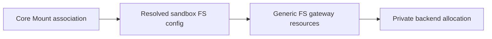

# FS gateway entities

Status: proposed vocabulary and ownership boundaries.

## 1. Domain split

There are three related models, owned by different domains:



The gateway entities contain no project, agent, or session fields.

## 2. Gateway entity: `FS`

```python
class FS:
    id: UUID
    security_partition: OpaqueSecurityPartition
    slug: Optional[str]
    name: Optional[str]
    route: FSRouteRef
    policy: FSPolicy
    capabilities: FSCapabilities
    state: FSState
    current_revision: FSRevisionRef
    created_at: datetime
    updated_at: datetime
    deleted_at: Optional[datetime]
```

`security_partition` is supplied by the platform authentication/tenancy layer. It
is an opaque isolation boundary, not a project or workspace entity in the FS
domain. A deployment could map it to a tenant, account, installation, or other
security principal without changing FS semantics.

```python
class FSPolicy:
    retention: RetentionPolicy
    quota: Optional[FSQuota]
    protected: bool


class FSState(str, Enum):
    PENDING = "pending"
    READY = "ready"
    DEGRADED = "degraded"
    ARCHIVED = "archived"
    DELETING = "deleting"
    DELETED = "deleted"
    ERROR = "error"
```

Route is immutable after creation. Copying to another route is an explicit
gateway operation. Product ownership and visibility are not properties of this
entity.

## 3. Core entity: `Mount`

`Mount` remains an Agenta core entity. It associates a generic FS with a
product subject and contributes configuration.

```python
class Mount:
    id: UUID
    project_id: UUID
    agent_id: Optional[UUID]
    session_id: Optional[str]
    fs_id: UUID
    slug: str
    name: str
    purpose: Optional[str]
    policy: MountPolicy
    lifecycle: Lifecycle
```

The exact product rules remain in core. For example, core may interpret:

- project-only mount as generally available in the project;
- agent mount as reusable by runs of that agent;
- session mount as session-specific state;
- a protected purpose such as attachments or working directory;
- an explicit mount selected by a user or workflow.

The FS gateway sees only `fs_id` and an authorized caller.

### Current-row compatibility

Today `Mount` has no separate `fs_id`; its ID and derived physical
storage root identify the durable content. The first compatibility mapping can
use `fs_id = mount.id` or a side table keyed by mount ID. This avoids data
copy and lets old/new APIs address the same content.

Current session rows intentionally leave `agent_id` null. Whether a session mount
is inherited from or associated with an agent is a core-domain decision. The FS
gateway does not need that relationship.

## 4. Core configuration intent

FS instances enter a sandbox through configuration, alongside CPU,
memory, disk, environment, and network settings.

```python
class SandboxFSSpec:
    source: FSSource
    mount_path: AbsolutePath
    access: Literal["read", "write"]
    revision: Optional[str]
    required: bool
    lifecycle: Literal["retain", "delete_with_sandbox"]


class FSSource:
    mount_id: Optional[UUID]
    fs_id: Optional[UUID]
    create_ephemeral: Optional[EphemeralFSCreate]
```

Exactly one source is present:

- `mount_id`: core resolves an existing product association;
- `fs_id`: an authorized direct/explicit FS binding;
- `create_ephemeral`: core asks the FS gateway to create a one-off FS and
  records cleanup intent.

This is a configuration DTO in core/sandbox domains, not an FS gateway entity.

## 5. Resolved sandbox binding

Core resolves configuration before sandbox reconciliation:

```python
class ResolvedSandboxFSBinding:
    fs_id: UUID
    mount_path: AbsolutePath
    access: Literal["read", "write"]
    revision: Optional[str]
    required: bool
    lifecycle: Literal["retain", "delete_with_sandbox"]
    source_ref: Optional[OpaqueCoreAssociationRef]
```

`source_ref` is for core audit/debugging and is not needed by the FS gateway.
There is no project/agent/session field, backend kind, endpoint, physical root,
driver hint, or vault reference.

Core may produce this list by layering project/agent/session associations, by
explicit selection, or for a one-off sandbox. The gateway consumes the result; it
does not reproduce the resolution rules.

## 6. Routes and private backend bindings

```python
class FSRouteRef:
    namespace: Literal["builtin", "standard", "custom"]
    key: str


class FSRoute:
    ref: FSRouteRef
    backend_kind: Literal["s3_compatible", "artifactfs_compatible"]
    capabilities: FSCapabilities
    endpoint_id: Optional[UUID]
    enabled: bool


class FSBackendBinding:
    fs_id: UUID
    route: FSRouteRef
    opaque_backend_ref: EncryptedOrOpaqueRef
    adapter_schema_version: int
```

Builtin and standard routes are generated. Custom routes reference
administrator-controlled endpoint rows. `backend_kind` is operator and placement
metadata; ordinary file and sandbox APIs do not branch on it.

## 7. Files, directories, and revisions

```python
class FileEntry:
    path: RelativePath
    kind: Literal["file", "directory", "symlink"]
    size: Optional[int]
    modified_at: Optional[datetime]
    version: Optional[FileVersion]


class FSRevision:
    fs_id: UUID
    revision: str
    immutable: bool
    created_at: datetime
    parent: Optional[str]
    metadata: dict[str, JsonValue]
```

`FileVersion` is opaque. It is not an S3 ETag or Git object ID.

The common contract includes normalized path lookup, directories, streaming
read/write, range reads, conditional replacement, copy, move, deletion, listing,
stat, and immutable revision reads. Optional POSIX or backend features are
capability-gated extensions.

## 8. Gateway attachments and access tickets

```python
class FSAttachment:
    id: UUID
    fs_id: UUID
    consumer: OpaqueConsumerRef
    consumer_generation: Optional[int]
    mount_path: AbsolutePath
    access: Literal["read", "write"]
    revision: Optional[str]
    required: bool
    state: AttachmentState
    lease_expires_at: datetime


class FSAccessTicket:
    ticket_id: UUID
    fs_id: UUID
    revision: Optional[str]
    path_prefix: RelativePath
    operations: set[FSOperation]
    subject: OpaqueConsumerRef
    expires_at: datetime
    max_bytes: Optional[int]
```

A consumer can be a sandbox generation, API caller, job, or another trusted
runtime. The gateway needs stable opaque identity and lease generation, not the
consumer's product-domain model.

Tickets and attachments never contain backend addressing or credentials.

## 9. Lifecycle direction

Core decides product lifecycle:

- archiving/deleting a project, agent, or session;
- whether a one-off FS dies with its sandbox;
- whether an association is inherited or removed;
- when multiple associations refer to the same FS.

Core then issues explicit FS gateway archive/delete/detach operations. The gateway
enforces its generic retention/protection policy and active-reference safety. It
does not subscribe to or infer product hierarchy cascades.

## 10. Invariants

1. Gateway FS records contain no project, agent, or session identity.
2. Generic security partitioning remains opaque and authorization-only.
3. Core `Mount` owns product association and configuration selection.
4. A resolved sandbox binding contains only data needed to attach an FS.
5. The same FS may be referenced by multiple authorized core associations.
6. Public DTOs contain no backend addressing or credentials.
7. Paths are canonical and cannot escape the FS root.
8. Both backend kinds implement the common contract before route enablement.
9. Archive/delete revokes tickets and attachments before backend cleanup.
10. Existing protected-mount behavior cannot be bypassed through the gateway.
