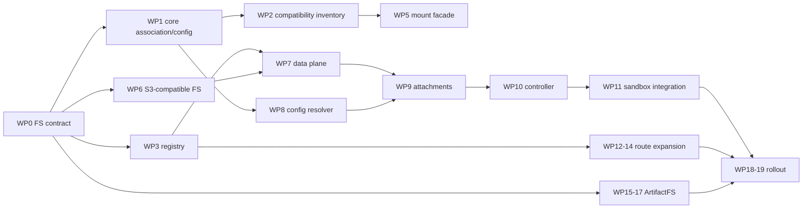

# FS gateway work packages

Status: proposed delivery order.

## Wave 0: freeze the boundary

### FS-WP0 — Common FS contract

Define generic FS identity, paths, directories, read/write, conditional
replacement, copy/move/delete, revisions, errors, capabilities, and lifecycle.

**Done when:** an in-memory implementation passes the common suite and no gateway
DTO contains project, agent, session, S3, or ArtifactFS-specific fields.

### FS-WP1 — Core association and configuration contract

Keep `Mount` as the core product association. Define `fs_id` compatibility,
explicit/one-off sources, resolved sandbox binding DTO, conflict rules, and
termination intent.

**Done when:** core can produce the same resolved binding shape for a project
mount, agent mount, session mount, explicit FS, and one-off FS
without asking the FS gateway to interpret those categories.

### FS-WP2 — Compatibility inventory

Inventory current mount rows, deterministic IDs/slugs, protected purposes,
archive behavior, file APIs, and derived physical roots. Define mount ID →
FS ID mapping without content copy.

**Done when:** every current mount has a deterministic compatibility mapping and
core association behavior remains unchanged.

**Checkpoint FS-C0:** generic FS contract plus core composition contract.

## Wave 1: current storage behind the gateway

### FS-WP3 — Generic FS registry

Implement create/get/query/policy/archive/restore/delete/revision using opaque
security partitioning and route references.

**Done when:** FS operations require no product-domain IDs.

### FS-WP4 — Route catalog

Implement generated `builtin/agenta`, capability discovery, placement policy,
operator diagnostics, and custom-route persistence/security shape.

### FS-WP5 — Current-mount compatibility facade

Present current mount content as generic FS instances with stable identity. Route
legacy file calls through the new service while core continues to own `Mount`.

**Done when:** old and new file APIs address the same content and permission
outcomes without duplicating project/agent/session logic in the gateway.

### FS-WP6 — S3-compatible FS implementation

Wrap the current store with the common semantic engine. Implement directories,
journal/recovery, conditional mutation, safe move/delete, streaming, isolated
allocation, and private authority.

**Done when:** common FS tests pass against SeaweedFS/MinIO and public contracts
contain no object-store terminology.

### FS-WP7 — Data plane and tickets

Implement scoped access tickets, streaming/ranges, quotas, audit, and revocation.

**Checkpoint FS-C1:** current mount content works through `builtin/agenta` as a
generic FS.

## Wave 2: configuration and sandbox attachment

### FS-WP8 — Core FS configuration resolver

Resolve existing `Mount` associations, explicit sandbox entries, and one-off
create requests into an ordered list of `ResolvedSandboxFSBinding`.
Validate mount paths, access, revisions, conflicts, and lifecycle intent.

**Done when:** resolution is deterministic and fully testable without an FS
backend or sandbox provider.

### FS-WP9 — Attachment broker

Implement batch attach for resolved bindings, opaque consumer generations,
leases, prepare/observe/renew/detach, desired-binding hash reconciliation, and
orphan cleanup.

### FS-WP10 — Trusted mount controller

Move geesefs lifecycle, FUSE health, private authority refresh, stale-unmount
safety, bind preparation, and data-plane/proxy mode behind controller ports.

### FS-WP11 — Sandbox gateway integration

Include resolved FS bindings in sandbox configuration alongside CPU,
memory, disk, network, and environment. Attach before readiness; detach on
termination; return lifecycle intent to core.

**Done when:** local in-process, Docker, Daytona, E2B, and Kubernetes Agent
Sandbox use the same binding shape and no provider path resolves product
associations or backend details.

**Checkpoint FS-C2:** persistent and one-off FS instances attach across sandbox
providers using the generic contract.

## Wave 3: route expansion

### FS-WP12 — Standard S3-compatible routes

Add maintained AWS and Cloudflare storage routes with account bindings, vault
references, health checks, and live conformance.

### FS-WP13 — Custom S3-compatible routes

Add admin-only custom endpoint lifecycle, TLS/egress policy, secret rotation,
MinIO/SeaweedFS fixtures, certification, disable behavior, and safe deletion.

### FS-WP14 — Transfer between routes

Implement explicit generic FS copy with progress, verification, cutover,
and rollback. Core independently changes associations after successful transfer.

**Checkpoint FS-C3:** builtin, standard, and custom routes are interchangeable at
the common FS contract.

## Wave 4: ArtifactFS-compatible implementation

### FS-WP15 — Protocol and threat-model spike

Map every common operation to ArtifactFS tree/hydration/overlay/revision behavior.
Test crash recovery, cache isolation, credential helper, and mount lifecycle.

### FS-WP16 — `builtin/artifacts` implementation

Implement backend adapter and trusted controller integration. Keep Git/blob/
hydration details behind the route.

### FS-WP17 — Optional extensions

Add separately negotiated refresh, snapshot, hydration status, commit, or push
only where product requirements justify them.

**Checkpoint FS-C4:** S3-compatible and ArtifactFS-compatible backends are
substitutable for common FS use and sandbox configuration is unchanged.

## Wave 5: rollout

### FS-WP18 — SDK, UI, audit, and observability

Ship generic FS clients plus core mount/configuration UI, attachment state,
operator diagnostics, metrics, traces, and redaction tests.

### FS-WP19 — Compatibility rollout

Dual-read/shadow-compare, route legacy calls through the gateway, exercise
rollback, add repair jobs/runbooks, and remove direct runner storage knowledge.

**Done when:** core remains the sole owner of product associations and no runner
contract requires backend credentials.

## Dependency sketch

