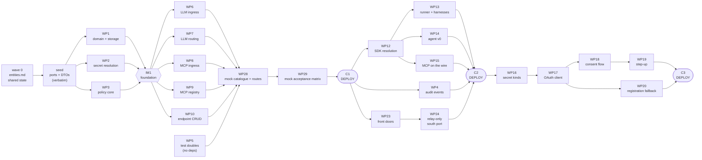

# Gateways: work packages, merges, checkpoints, waves

Assumes the rest of `v1/`. Packages and their dependencies — no sizing and no schedule beyond
what the dependencies force.

**Status: draft for review.** The package boundaries are the proposal; the checkpoint structure
is the part to argue with first, because everything else hangs off it.

---

## The four words

**Work package.** A unit that can be built, reviewed and merged on its own, in its own worktree.
Where two could be one, they are split if they can land independently or belong to different
owners.

**Merge.** A point where packages come together. Most merges are not deployed. At a merge we fix
static issues — types, lint, contract tests, unit tests — and move on.

**Checkpoint.** A merge we **deploy** and run acceptance tests against, because it is the first
point where something real runs: live processes, live servers, a request that travels. At a
checkpoint we deploy, fix dynamic issues, and only then start the next fan-out.

**Wave.** Everything between two checkpoints. A wave is fan out, fan in, fan out, fan in, ending
at a deploy. Each wave gets its own specs, tasks and findings written before it starts.

The rhythm per wave: define the wave → write specs and tasks for its packages and merges →
prepare → run the packages in parallel → merge and fix static issues → deploy → fix dynamic
issues → next wave.

---

## Scope confirmation

Permission checks and entitlement checks are **in for both gateways**. Credit checks are
**postponed for both**, and arrive with the metering and billing work rather than here.

---

## The checkpoints

Three, and the middle one is the big one.

### C1 — both gateways serve traffic against mocks

The LLM gateway and the MCP gateway both accept a call, authorise it, resolve and inject a
secret, reach a mock upstream, and return. Policy fires. Nothing is recorded and nothing is
configurable yet — this checkpoint proves the call path, and only that.

**Why here.** It is the first point where anything runs end to end, and it needs no third-party
dependency, no OAuth and no converted caller. Everything it proves is proved against our own
mocks, which is what makes it a clean acceptance-test surface.

**Acceptance tests:** the local mock matrix exercises every namespace: LLM builtin Agenta, LLM
builtin mock, LLM standard mock, LLM custom mock; MCP builtin Agenta, MCP builtin mock, MCP
standard mock, and MCP custom mock. Composio remains a real brokered integration; there is no
Composio fake route. A request with no token is refused; a
request for an endpoint the caller may not use is refused; a permitted request reaches the
expected mock with the caller's token replaced by the upstream secret; a streamed response arrives
byte for byte on **both** gateways, tool names, schemas and errors included; a tool call outside
the allowlist is refused. See `mocks.md` for the complete matrix.

### C2 — the real callers go through the gateways

Agent v0, the runner and the harnesses reach models and MCP servers only through the gateways.
This is "everything except OAuth works." It also picks up the one thing wave 1 left out: an audit
event per call.

**Acceptance tests:** a real agent run completes with no provider secret anywhere in the
sandbox; the run's model calls and tool calls appear as audit events with the right principal;
a run naming a model it may not use fails cleanly.

### C3 — OAuth works

An OAuth-protected MCP server can be connected from the dashboard, used in a run, refreshed
without a human, and step-up raises an interaction.

**Acceptance tests:** connect an OAuth server end to end; run a tool through it; force a refresh
and confirm the run continues; force a scope challenge and confirm an interaction is raised;
revoke and confirm the tool stays listed and the call fails with something actionable.

---

## The waves

| Wave | From | To | What it delivers |
|---|---|---|---|
| 0 | — | the seed | The shared state: every layer declared, column by column |
| 1 | seed | **C1** | Both gateways, the shared policy core, and the mocks |
| 2 | A | **C2** | Every caller converted |
| 3 | B | **C3** | OAuth end to end |

Intermediate merges inside a wave are listed with the wave. They are not deployed.

**Wave 0 ends at the seed, not at a checkpoint.** Nothing runs, so there is nothing to deploy or
acceptance-test. It is the one wave whose output is a document and a commit rather than
behaviour.

**C1 is not split.** Separating the registry from the rest was considered and is not
worth the extra deploy; the two fan-outs inside wave 1 already give the parallelism.

---

## Dependency graph

The two fan-outs in wave 1 are the widest points: three packages, then five. Wave 2 carries a
chain behind one package plus three independent ones. Wave 3 is mostly serial because OAuth's
pieces genuinely depend on each other.

**Wave 1 is deliberately the thinnest thing that works**, and recording, configuration and tuning
sit outside the three waves entirely.

**A checkpoint is a deploy, not a release.** No user traffic passes before C3, so
nothing observable happens that could have been recorded and was not. That removes the only real
argument for building the meter early, and leaves the cost of guessing what to meter — which the
pricing model answers, not the gateway.

---

## Wave 0 — the shared state — DONE

**Nothing forks until the shared state is written down**, because the seed commit is taken
**verbatim** from the entity document, so anything vague there becomes a conflict later across
every worktree that inherited it.

`entities.md` is now written in full — every layer, column by column, for both planes, the policy
core and the two new secret kinds. It carries no unresolved markers.

| Layer | What wave 0 settled |
|---|---|
| `dbas` | Shared mixins, and what the owner dimension needs in each signature now versus in storage later |
| `dbes` | Three new tables and every column, with the foreign key on the secret reference chosen per table |
| `dtos` | Domain contracts, the two secret kinds' settings pairs and union arms, and the family-shared enums that end the triplicate copies |
| `types` | The domain exception hierarchy on both planes plus the policy core |
| `models` | Request and response schemas for the management routers |
| DAO methods | Every verb with its exact signature, each taking the owner (D10) |
| Service methods | Orchestration against interfaces, never concrete DAOs or adapters |
| Router methods | Route declarations, with the data plane and the management CRUD as separate router objects because their shapes are incompatible |

Beyond the layers, it settled where the code lives: a **separate domain**, `gateways/` beside the
existing `gateway/`, holding both planes and the shared policy core. The existing family is an
integrations domain that happens to carry the word; sharing a word is not sharing a concern, and
`notes.md` records the two drafts that got this wrong before it was settled.

It also settled that the policy core is a module with a service facade and no tables of its own,
that new code uses the frozen auth scope rather than the neighbouring domains' habit of reading
request state directly, and the six new permission subjects.

**Done test, met:** every symbol a wave 1 package needs to import exists in the document with its
signature, and no package's surface is described only in prose.

### The seed

The output of wave 0. One commit on the base branch carrying the declared surface, all raising
not-implemented: the gateway ports, the endpoint and policy DTOs, the domain exceptions, and the
secret-resolution signature — each taken from `entities.md` rather than invented at commit time.

**The one thing that must be right:** the secret resolution signature takes the owner as a
parameter even though the only answer today is the project (D10). Every package that resolves a
secret inherits it.

Every worktree branches from that commit, so interface dependencies never serialise the work.

---

## Wave 1 — to C1

### Fan-out 1: foundation

**WP1 — Gateway domain and storage.** The entity stack for custom endpoints on both gateways:
mixins, entities, DAO, mappings, migration. Standard endpoints are generated and store nothing
(D20).
*Depends on:* seed. *Blocks:* WP6, WP9, WP10.
*Done when:* a custom endpoint round-trips, and every DAO verb takes the owner.

**WP2 — Secret resolution.** The resolve function over the secrets service, returning the secret,
its owner, and its `secret_origin`. Pure logic, so fully unit testable — and it must be, because
the interesting cases are the failures.
*Depends on:* seed. *Blocks:* WP6, WP8.
*Done when:* each resolution mode behaves as specified and no path silently returns no secret.

**WP3 — Policy core.** The principal from the existing auth scope, the permission check on a
target, and the entitlement check. No credit check.
*Depends on:* seed. *Blocks:* WP6, WP8.
*Done when:* a caller without permission on an endpoint is refused before any upstream call.

**WP5 — Test doubles.** A mock LLM endpoint and a mock MCP server, both controllable from tests:
forced errors, forced slowness, forced scope challenges later.
*Depends on:* nothing. **Start immediately.** *Blocks:* every acceptance test.
*Done when:* both mocks run in the local stack and can be driven to fail on demand.

**Merge IM1 — foundation.** Static only, not deployed.

### Fan-out 2: the two gateways, in parallel

**WP6 — LLM ingress and relay.** The OpenAI-compatible surface, streaming, the body kept byte for
byte, timeouts.
*Depends on:* IM1. *Done when:* a streamed response is relayed unmodified and a hung upstream
times out rather than hanging the gateway.

**WP7 — LLM routing and model allowlist.** The routing library in-process; standard endpoints
generated from the SDK catalogue; custom endpoints restricted to their declared models.
*Depends on:* IM1. *Done when:* every provider and deployment pair reachable today is reachable
through the gateway, including reseller shapes, and a model outside a custom endpoint's list is
refused.

**WP8 — MCP ingress and proxy.** One URL per server, namespaced identifier, transparent
pass-through with tool names untouched.
*Depends on:* IM1. *Done when:* list and call both relay unchanged and a tool outside the
allowlist is refused.

**WP9 — MCP registry and tool allowlist.** Custom servers as rows, built-in servers defined by
us, per-server tool allowlists.
*Depends on:* IM1, WP1. *Done when:* a custom server registers and resolves, and a built-in one
needs no row.

**WP10 — Endpoint CRUD API.** Routers and models for creating and configuring custom endpoints on
both gateways. Creation and deletion only — per-endpoint configuration is WP21, in wave 2.
*Depends on:* IM1, WP1. *Done when:* a custom endpoint can be created and deleted, and a standard
one cannot be edited.

**WP28 — Generated development mock catalogue and provider routing.** The development-only
generated entries, all six namespace route families, and the explicit absence of a Composio fake
boundary.
*Depends on:* WP5–WP10. *Blocks:* WP29. *Done when:* every namespace resolves to its local mock
through its own catalogue and auth path, while the entries are absent outside development.

**WP29 — Gateway mock acceptance matrix.** Shared fixtures and real-socket OSS/EE acceptance
coverage for the generated and custom mock cases.
*Depends on:* WP28. *Done when:* every case in `mocks.md` passes on both development stacks.

**Merge IM2 → C1.** Deploy. Acceptance tests above.

---

## Wave 2 — to C2

**WP12 — SDK connection resolution.** `resolve_connection` returns a gateway route: the provider
and deployment naming the gateway, the base URL, and the token. The SDK keeps every capability it
has (D4).
*Depends on:* C1. *Blocks:* WP13, WP14.

**WP13 — Runner and harnesses.** The runner carries a gateway route rather than provider secrets.
Verify the secret arrays collapse and the redaction set shrinks. This is **not** a
resolver-side change alone: `ModelCredentialBinding.kind` is `"environment"` and nothing
else, so a model call cannot carry our credentials in `X-AG-Credentials` (D31) without a wire
change. The MCP side already has `{kind: "header", name}` and is the precedent to copy.
*Depends on:* WP12.

**WP14 — Agent v0.** The remaining caller.
*Depends on:* WP12.

**WP4 — Audit events.** Emission into the existing events domain (D22), with the principal, the
target, the decision and the outcome. Moved out of wave 1: wave 1 makes the call work, and a
record of a call that does not happen is worth nothing.
*Depends on:* C1. *Blocks:* nothing.
*Done when:* one event per call, queryable through the existing surface.

**WP15 — MCP servers on the wire.** The runner's MCP server configs point at gateway URLs with a
gateway token rather than upstream secrets.
*Depends on:* WP12.

**WP23 — Protocol front doors.** `/v1/responses` and `/v1/messages` beside
`/v1/chat/completions` (D33), each with its own policy-field parse, usage extraction and
ceiling binding. Everything behind the front door is protocol-blind.
*Depends on:* C1. *Blocks:* WP24.

**WP24 — The relay-only south port.** D34 forbids body conversion, so the
`passthrough`/`translated` split becomes one relay with a routing strategy and an
authentication strategy per deployment, and `TranslatedLLMAdapter` is deleted. Carries
OD16's per-provider verification, and `provider_key`'s `NOT NULL` with it.
*Depends on:* WP23 — removing conversion first would make Anthropic, Gemini, Bedrock and
Vertex unreachable rather than reachable another way.

**Merge IM4 → C2.** Deploy. Acceptance tests above. The fan-out, the worktrees and
the traps are in [`workstreams/launch-2.md`](workstreams/launch-2.md).

---

## Wave 3 — to C3

**WP16 — Secret kinds.** `oauth_provider` and `oauth_grant`: enum values, settings DTOs, union
arms, validator branches (D14). Coordinate with the parallel work adding kinds to the same enum.
*Depends on:* C2. *Blocks:* WP17.

**WP17 — OAuth client.** The official SDK's client provider, with a storage adapter over the
secrets service; connect callbacks pointed at the dashboard rather than a local browser.
*Depends on:* WP16.

**WP18 — Consent flow.** Connecting an OAuth server from the dashboard, with scope selection.
*Depends on:* WP17.

**WP19 — Step-up interaction.** A scope challenge raises an interaction on the existing
missing-connection path.
*Depends on:* WP17, WP18, WP25, WP26.

**WP20 — Client registration fallback.** There is no callback-reachability work: the browser
reaches the redirect in every deployment, because it is the address the user is already on
(D26). What remains is registration. Prefer the client identity document; fall back to
registering outbound when the deployment's domain is not publicly resolvable, and make that
fallback automatic rather than a configuration flag.
*Depends on:* WP17.
*Done when:* a deployment on an internal-only domain completes a full authorization without any
hosted component of ours in the path.

**WP25 — A refusal arrives as a cause.** The gateway's typed refusals survive the trip back to
the caller: gateway to harness to runner to agent service. The wire field exists
(`AgentErrorDetail`); what is missing is per-harness proof that a harness preserves the gateway's
error body, and the agent service surfacing the field at all.
*Depends on:* C2. *Blocks:* WP19.

**WP26 — An agent can request a gateway connection.** Extend the reserved `request_connection`
client tool to cover a gateway endpoint on either plane, not only an external integration. D35
made registration a precondition for use, so an agent needs a way to ask for it.
*Depends on:* C2. *Blocks:* WP19.

**WP27 — The static field rewrite for resold Anthropic wires (D40).** Bedrock's `InvokeModel` and
Vertex's `rawPredict` need `anthropic_version` in the body and `model` absent from it. A static
per-deployment table of literal added/removed fields, nothing computed from the request. Leads with
a probe: whether a body still carrying `model` is rejected or ignored is undocumented.
*Depends on:* C2.

**Merge IM5 → C3.** Deploy. Acceptance tests above.

**Wave 3 also carries seven cleanups** unblocked by C2 — CU1, CU2, CU6, CU7, CU10, CU12 and CU13.
See [`workstreams/launch-3.md`](workstreams/launch-3.md).

---

## After C3

Real gateway work, deliberately not scheduled into the three waves. Nothing above depends on it,
and none of it can be lost by waiting, because **no checkpoint before C is a release**.

**WP11 — Usage recording, and WP22 — usage charged.** Model tokens and tool calls recorded
against the principal with the secret origin, and the ledger that prices them. **They ship
together.** Recording early is normally right because usage cannot be backfilled; that does not
apply while no real traffic passes. What remains is the cost of guessing which counters, at which
grain, keyed how — and only the pricing model answers that. A meter built before the price
produces data nobody uses and a schema to migrate.

**WP21 — Endpoint configuration.** Timeouts, ceilings and extra headers per custom endpoint
(D21), with a ceiling breach rejecting rather than clamping (D25). Tuning a call path is
second-order to having one, and it blocks nothing.

---

## Not packages, because the gateways have to exist first

`cleanups.md` is the register: twelve things that become possible only once the gateways run, from
closing the vault's plaintext read surface to collapsing the runner wire's secret arrays to
moving the eligible slice of the runner's tool loopback. None of them can be scheduled in front of
the waves, and none of them is optional — together they are what D1 costs in full.

## Not packages

- The tool catalog. Out of scope.
- Triggers. A separate subsystem.
- Credit checks. Postponed to the metering and billing work.
- Embeddings, the evaluator path, and every other service. Later scope (D15).
- Retries, fallbacks, aliasing, list caching, stdio servers. Marked out in
  `scope-checklist.md`.
- The legacy credits counter. Left alone until the gateway is the sole mechanism (D24).
