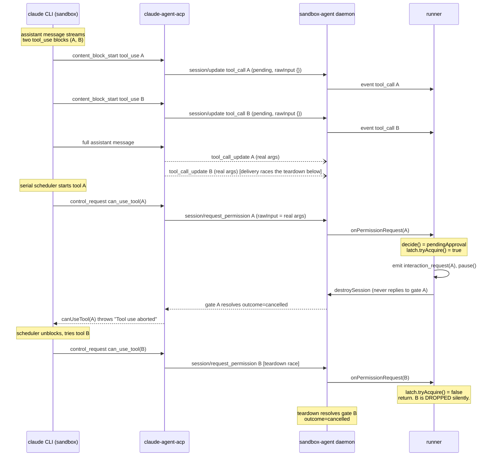
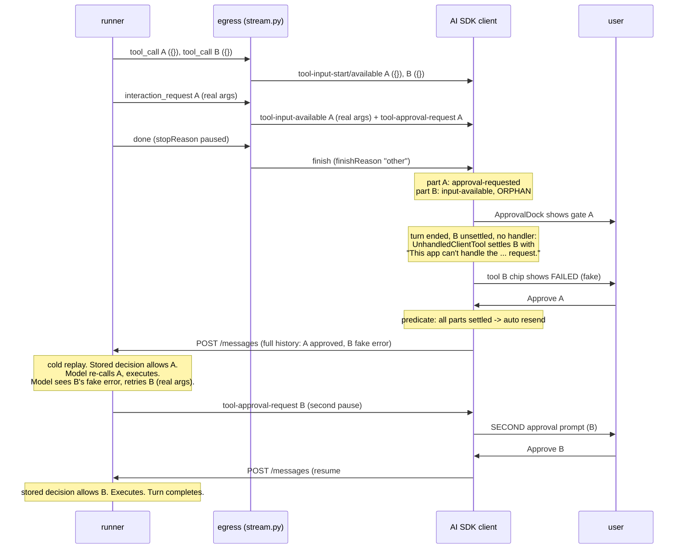
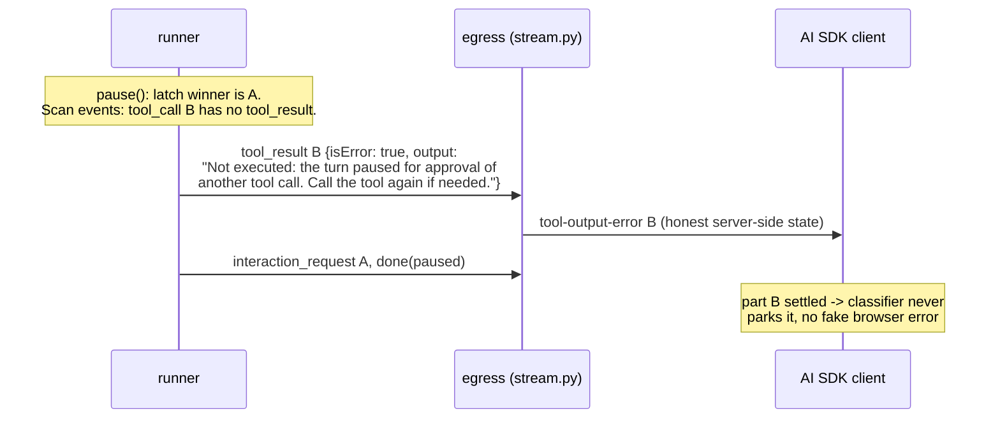
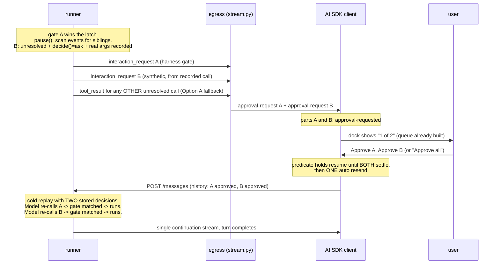

# Flows: today, Option A, Option B

Three views per flow where they differ: the harness/ACP wire, our `/messages` stream
parts, and what the user sees. Tool A is `mcp__agenta-tools__commit_revision`, tool B
is `mcp__agenta-tools__create_subscription`. Both are `ask`-gated write tools, so the
CLI schedules them serially (research.md §2b).

## 1. Today: the broken flow

### 1a. Harness / ACP wire



### 1b. /messages stream and the playground



### 1c. What the user sees

| Step | UI |
|---|---|
| Turn streams | Two tool chips appear (A and B). |
| Turn pauses | Approval dock asks about A. B's chip flips to `failed` with "This app can't handle the ... request." |
| Approve A | New turn block streams. A runs. Model retries B. Dock asks about B. |
| Approve B | New turn block streams. B runs. Done. |

Two approval round-trips, one fabricated failure, and (issue 1, out of scope here) the
repeated turn blocks.

## 2. Option A: settle the losing sibling deterministically

Only the pause step changes. Before teardown, the runner scans its own event log for
announced tool calls with no result (excluding the paused one) and emits a truthful
terminal `tool_result` for each.

### 2a. Wire (delta only)



Nothing changes at the ACP layer. Gate B (if it arrives in the teardown race) still
loses the latch and is still ignored; its tool call is already settled.

### 2b. Resume (same shape as today, honest content)

The history now carries B's deterministic "not executed" error instead of the browser's
"can't handle" text. The replayed transcript renders
`[mcp__agenta-tools__create_subscription error: Not executed: ...]`
(`transcript.ts:53-55`), the model retries B, the gate pauses, the user approves
second. Still two round-trips, but every state shown was true.

### 2c. What the user sees

| Step | UI |
|---|---|
| Turn pauses | Dock asks about A. B's chip shows "Not executed: waiting on another approval" (error-styled but truthful; exact copy TBD). |
| Approve A | A runs, model retries B, dock asks about B. |
| Approve B | B runs. Done. |

## 3. Option B: batch all pending approvals into one pause

The runner cannot wait for the harness to raise gate B (research.md §3). Instead, at
pause time it synthesizes the sibling's approval request from its own record: any
announced, unresolved tool call whose `decide()` verdict would be `pendingApproval`
and whose recorded args are trustworthy. Everything downstream already supports it.

### 3a. Wire and stream



### 3b. What the user sees

| Step | UI |
|---|---|
| Turn pauses | Dock shows "Approval needed, 1 of 2" with A's payload. B's chip shows "Awaiting approval". |
| Approve A (or Approve all) | Dock slides to B. |
| Approve B | One resume. Both tools run in order. Done. |

One approval interaction, one round-trip, no fabricated state.

### 3c. The fallback inside Option B

A sibling that fails the trust check falls back to Option A's deterministic settle:

- recorded args are `{}` or absent (the refresh lost the race, research.md §4). Asking
  a human to approve an invisible payload is unacceptable, and the stored decision key
  `name#{}` would not match the re-raised gate anyway (`responder.ts:65-76`), forcing a
  second prompt regardless.
- `decide()` says `allow` or `deny` for the sibling (it never needed a human), but it
  cannot run because the session is dying: settle it with the deferred error so the
  model retries it after resume.

## 4. Example frames (obfuscated, shapes verified)

ACP announcement the runner receives (first encounter, streamed):

```json
{"sessionUpdate": "tool_call", "toolCallId": "toolu_01AbC...", "status": "pending",
 "title": "create_subscription", "kind": "other", "rawInput": {},
 "_meta": {"claudeCode": {"toolName": "mcp__agenta-tools__create_subscription"}}}
```

ACP permission request (the gate; carries real args):

```json
{"sessionId": "sess_...", "options": [
   {"kind": "allow_always", "name": "Always Allow", "optionId": "allow_always"},
   {"kind": "allow_once", "name": "Allow", "optionId": "allow"},
   {"kind": "reject_once", "name": "Reject", "optionId": "reject"}],
 "toolCall": {"toolCallId": "toolu_01AbC...",
   "rawInput": {"plan": "pro", "seats": 3}}}
```

Runner `interaction_request` event (what the egress projects; the synthetic Option B
sibling uses the same shape, mirroring the Pi relay emission at
`sandbox_agent.ts:777-792`):

```json
{"type": "interaction_request", "id": "toolu_01AbC...", "kind": "user_approval",
 "payload": {"toolCallId": "toolu_01AbC...",
   "toolCall": {"toolCallId": "toolu_01AbC...", "resolvedName":
     "mcp__agenta-tools__create_subscription", "rawInput": {"plan": "pro", "seats": 3}},
   "availableReplies": ["once", "reject"]}}
```

Stream parts the client receives for one gated call:

```json
{"type": "tool-input-available", "toolCallId": "toolu_01AbC...",
 "toolName": "mcp__agenta-tools__create_subscription",
 "input": {"plan": "pro", "seats": 3}}
{"type": "tool-approval-request", "approvalId": "toolu_01AbC...",
 "toolCallId": "toolu_01AbC..."}
```

Approval decision as it returns in the next request's history (after ingress folding,
`messages.py:174-181`):

```json
{"type": "tool_result", "tool_call_id": "toolu_01AbC...",
 "tool_name": "mcp__agenta-tools__create_subscription",
 "output": {"approved": true}}
```
