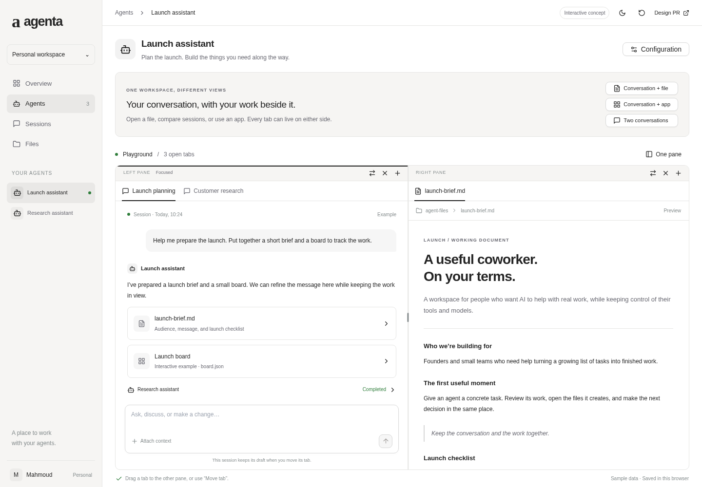
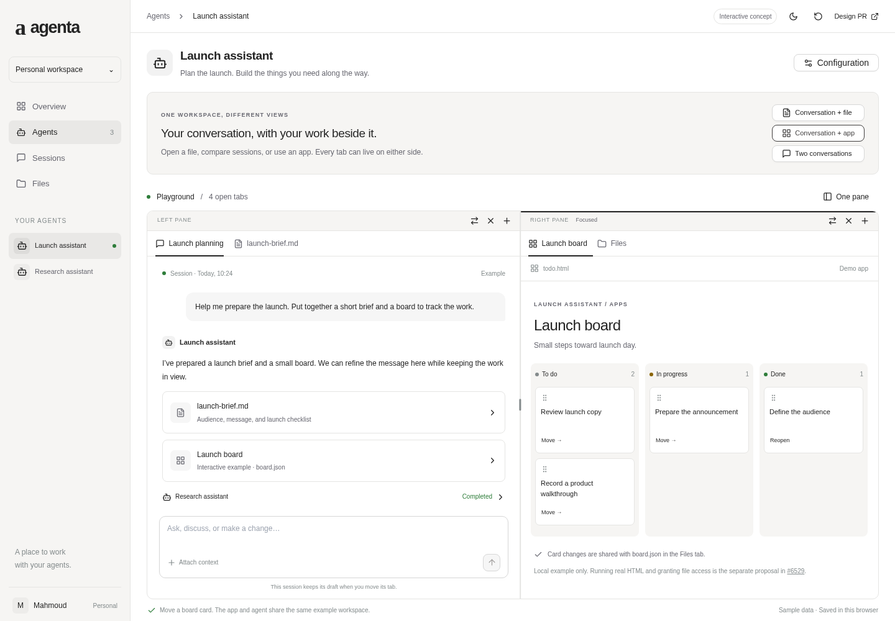

# Interactive playground concept

[Open the Cloudflare preview](https://agenta-playground-workspace-concept.mahmoud-637.workers.dev).

This desktop mockup illustrates the [PRD](../prd.md) and [RFC](../rfc.md). It uses local sample data and makes no agent, mounts, or remote-desktop API calls. Website and computer tabs are explicit placeholders. The Kanban example demonstrates the relationship to [#6529](https://github.com/Agenta-AI/agenta/pull/6529); it does not implement that proposal's HTML execution or permission bridge.

## Try the idea

1. Use the three scenario buttons to see a conversation beside a file, an app, or another conversation.
2. Type a draft, then drag its tab into the other pane or use the pane's move button. The draft stays with the session. Dropping before another tab also changes order.
3. Resize the divider with the pointer or focus it and press an arrow key. Switch to one pane to bring all open tabs together.
4. Click a file card in the conversation. An already-open file receives focus; a new one opens in the other pane.
5. Open the app scenario and move a board card. Select Files and expand `board.json` to see the same example data.
6. Use the plus button to open another kind of tab, and the close button to close the selected tab. Reset restores the initial example.

The layout, conversation drafts, example messages, and board data persist in this browser's local storage. The sidebar is visual context. On small screens the split workspace scrolls horizontally; the proposed mobile pane switcher is not implemented here.

## Component reuse

The mockup imports the repository's actual Button, Tabs, and SplitPane source from `web/packages/agenta-ui/src/components/ui/`. It also imports Agenta's generated theme variables, control scale, and shadcn token mapping. No copies of those components are maintained here.

Relative source imports are deliberate for this standalone concept. They avoid loading the application's provider stack and require running the mockup inside a complete repository checkout. This is not the proposed production package structure.

The content views and local interaction state are specific to the mockup. Native drag-and-drop illustrates tab placement; the move button supplies a keyboard-accessible alternative. Production runtime ownership, streaming, permissions, and complete accessibility remain subjects of the RFC.

## Build and deploy

From this directory, with Node.js 20 or newer:

```sh
npm ci --include=dev
npx tsc --noEmit
npm run build
```

The standalone dependency lock is local to this directory. A root application install is not required. Vite deduplicates component dependencies against this host; TypeScript uses local dependency paths for the same reason.

With Cloudflare credentials supplied securely through the environment:

```sh
npx wrangler@4.72.0 deploy
```

The Worker serves static assets only. No credentials belong in the source or built assets.

## Verification

Built the static bundle and passed TypeScript checking. Tested the hosted URL with headless Chromium: tab movement by button and drag, draft preservation across move/collapse/reload, keyboard divider resizing, adding and closing tabs, and board data reflected in Files. Inspected screenshots in light and dark themes. No browser JavaScript errors appeared in the exercised flows.

This verifies the concept's local interactions, not production chat performance or backend behavior.




