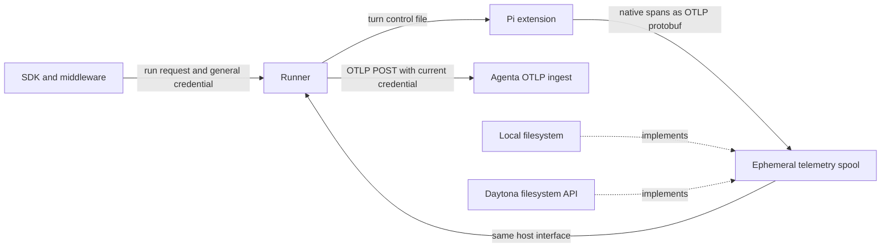

# Runner-owned Pi trace export

This workspace plans a replacement for the token-lifetime fix in
[PR #6135](https://github.com/Agenta-AI/agenta/pull/6135).

See [review.md](review.md) for the review and the decisions taken.

The invariant is simple:

- Pi still creates the Pi-native agent, turn, LLM, and tool spans.
- The runner is the only component that sends spans over the network.
- Local and Daytona Pi runs use the same file-spool protocol and lifecycle.
- Credentials and export routing never enter the Pi process or sandbox.

The runner does not reconstruct Pi spans from ACP events. Pi keeps its richer in-process view of
provider calls, messages, tools, token counts, and cost. It serializes that span tree as a standard
OTLP protobuf batch and publishes the bytes to a bounded per-turn spool. The runner picks up those
exact bytes and exports them with a renewable runner-owned credential.

This removes the need for a two-hour telemetry token, a token scope field, and a second
`exportAuthorization` DTO field. A 12-hour session remains safe because the runner renews its own
credential while the run is active. No fixed export-token lifetime defines how long tracing works.

## Glossary

| Term | Meaning in this plan |
|---|---|
| Pi extension | Code loaded inside Pi that observes native Pi lifecycle events and creates spans. |
| Runner | The trusted runner service that owns session orchestration, platform calls, and external trace export. |
| Harness | The coding-agent runtime driven by the runner. Pi is one harness. |
| Turn | One `/run` request and one prompt execution. A warm session can contain many turns. |
| OTLP batch | A standard `ExportTraceServiceRequest` protobuf body containing spans. |
| Telemetry spool | An ephemeral directory where Pi atomically publishes an OTLP batch for the runner. |
| Runtime file host | The runner abstraction that reads and writes runtime files either locally or through Daytona's filesystem API. |
| Credential lease | A runner-owned object that keeps the caller's platform credential valid and exposes the current value without giving it to Pi. |

## Documents

| File | Purpose |
|---|---|
| [context.md](context.md) | Current behavior, problem statement, goals, constraints, and non-goals. |
| [research.md](research.md) | Verified repository facts and why the existing relay is the right transport precedent. |
| [architecture.md](architecture.md) | Proposed components, local and Daytona flow, security boundary, and failure behavior. |
| [interfaces.md](interfaces.md) | Field roles, wire contract, spool protocol, and internal interfaces. |
| [plan.md](plan.md) | Phased implementation with concrete files and migration steps. |
| [qa.md](qa.md) | Unit, integration, and live verification matrix. |
| [status.md](status.md) | Decisions, open questions, progress, and next action. |

## Recommendation

Implement this as a replacement for PR #6135 if that PR has not merged. If it has merged, make the
runner-owned exporter a follow-up and remove the extra scoped-token contract after the new path is
proven. Keep the diagnostics from PR #6109 in either case.

