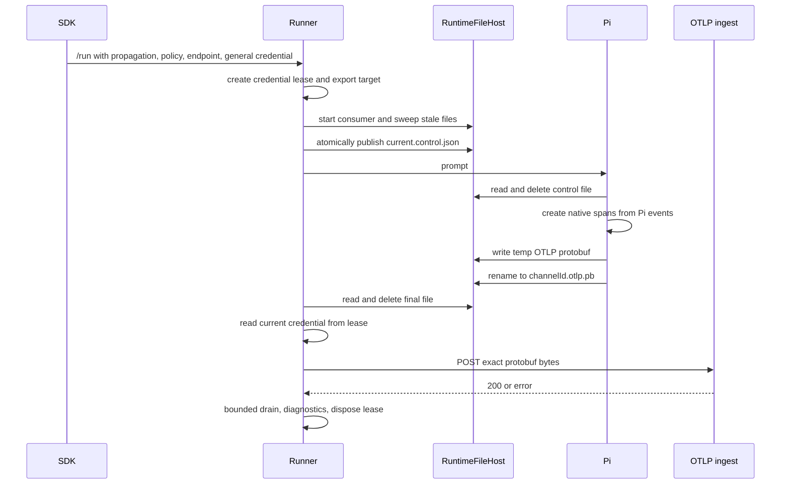

# Architecture

## Ownership model

| Responsibility | Owner |
|---|---|
| Observe Pi lifecycle events | Pi extension |
| Build Pi-native spans | Pi extension |
| Decide trace parent and capture policy for a turn | SDK and runner request |
| Move span bytes out of the harness | Runtime telemetry spool |
| Hold export endpoint and credentials | Runner |
| Renew platform credentials | Runner credential lease |
| Send OTLP over HTTP | Runner trace export sink |
| Authorize and ingest spans | Agenta API |

The important boundary is between producing telemetry and exporting telemetry. Pi is a producer,
not a network client of Agenta.

## Components to add

### RuntimeFileHost

Extract a byte-oriented host interface from the filesystem operations already embedded in tool
relay:

```ts
interface RuntimeFileHost {
  list(dir: string): Promise<string[]>;
  readBytes(path: string): Promise<Uint8Array>;
  writeBytes(path: string, contents: Uint8Array | string): Promise<void>;
  rename(from: string, to: string): Promise<void>;
  remove(path: string): Promise<void>;
  mkdir(path: string): Promise<void>;
  statMtimeMs?(path: string): Promise<number | undefined>;
  createActivitySource?(dir: string): RuntimeActivitySource | undefined;
}
```

Provide local and Daytona implementations. Keep JSON decoding, tool execution, and tool-specific
authorization in the tool-relay layer. The shared host is a transport primitive, not a generic
message bus.

### Runtime IPC directories

Give each acquired environment an ephemeral runtime IPC root outside the durable cwd mount:

```text
<runtimeIpcDir>/
  tools/
  telemetry/
```

The tool subdirectory can be migrated from the current `relayDir` without changing its protocol.
The telemetry subdirectory is always created for Pi tracing, even when no tools are configured.
The root is stable for the warm environment; every turn uses a fresh random channel ID.

### PiTurnTraceControl

Before the prompt starts, the runner atomically publishes a small control file at a stable path.
Pi reads and deletes it during `before_agent_start`.

The file contains only values Pi needs to create correct spans:

- protocol version;
- random channel ID;
- turn ID and session ID when present;
- `traceparent` and `baggage`;
- content-capture policy;
- loaded skill names when they can vary by turn.

It does not contain an endpoint, authorization header, project credential, or token expiry.

### PiFileSpanExporter

The Pi extension keeps `createAgentaOtel` and all existing lifecycle hooks. Its batch transport
changes from HTTP to file publication.

At `agent_end` it:

1. ends the Pi spans through the existing tracer;
2. gathers the run into one batch through the existing trace batch processor;
3. serializes the batch as an OTLP `ExportTraceServiceRequest` protobuf;
4. enforces the configured maximum batch size;
5. writes `<channelId>.otlp.pb.tmp.<nonce>`;
6. renames it atomically to `<channelId>.otlp.pb`.

There is no custom span DTO and no JSON or base64 wrapping.

### PiTraceSpoolConsumer

The runner starts one consumer before it publishes the control file and before it sends the prompt.
The consumer uses the same implementation for both placements and receives a `RuntimeFileHost`.

It:

- sweeps stale telemetry files before the control file becomes visible;
- accepts only the current random channel filename;
- checks file count and byte limits before reading;
- deletes the final file immediately after pickup;
- retains the bytes in runner memory while export is in flight;
- forwards the exact protobuf bytes to the runner trace export sink;
- stops after one accepted batch or a bounded post-prompt drain timeout.

The channel ID prevents a stale warm-turn file from being attributed to the next turn. It is a
correlation value, not a secret or an authorization mechanism.

### PlatformCredentialLease

Refactor the existing session refresh behavior into a per-active-run lease:

```ts
interface PlatformCredentialLease {
  current(): string;
  refreshNow(): Promise<string | null>;
  dispose(): void;
}
```

The lease starts from the fresh credential on the incoming `/run` request. It refreshes before
expiry, deduplicates concurrent refreshes, and keeps the last valid value if refresh fails. The
session alive watchdog and trace exporter read the same lease instead of maintaining independent
copies.

The exporter reads `lease.current()` immediately before each HTTP attempt. On an Agenta HTTP 401,
it calls `refreshNow()` and retries once. Proactive refresh remains required because an already
expired credential may be unable to refresh itself.

For a third-party OTLP endpoint, use the configured static exporter header and do not call Agenta's
permission exchange. This preserves current collector support.

### RunnerTraceExportSink

Centralize external OTLP sending behind one runner-owned sink. It accepts already serialized OTLP
bytes plus a runner-owned target:

```ts
interface OtlpExportRequest {
  body: Uint8Array;
  endpoint: string;
  authorization: () => string | undefined;
  refreshAuthorization?: () => Promise<string | null>;
  traceId?: string;
  turnId?: string;
  source: "runner" | "pi-spool";
}
```

Both Pi spool batches and runner-generated batches use this sink for HTTP, timeout, retry,
diagnostics, and credential lookup. Runner-native spans still avoid the filesystem because they are
already in the trusted runner process.

## Per-turn sequence



The sequence is identical for local and Daytona. Only the `RuntimeFileHost` implementation changes.

## Runner tracer behavior

Change Pi handling from placement-dependent to harness-dependent:

```ts
emitSpans: !plan.isPi
```

For Pi, `createSandboxAgentOtel` continues to collect streamed output, events, stop reason, and
fallback error information, but it does not synthesize agent, turn, LLM, or tool spans from ACP.
For every other harness, current ACP tracing remains unchanged.

If the runner needs to emit a transport or runner error span, it can send that runner-owned span
through the same `RunnerTraceExportSink`. It must not replace or duplicate Pi's native span tree.

## Security boundary

The telemetry directory is sandbox-writable. A harness can forge a file, so the runner must treat
the spool as an untrusted producer.

The runner limits the authority of that producer structurally:

- Pi never sees a platform or exporter credential.
- Pi never chooses the endpoint. The runner uses the endpoint from the trusted run request.
- The runner accepts only the current random channel while that turn is active.
- The runner accepts at most the configured number of files and bytes.
- The runner sends only an OTLP protobuf body with a fixed content type and method.
- The runner never turns spool contents into arbitrary headers, URLs, or platform calls.
- The API still parses the protobuf, authorizes the caller, and applies ingest validation.

This is a bounded trace-ingest capability proxy. It exposes less authority than placing even a
trace-scoped bearer inside the harness because the bearer cannot be copied or replayed elsewhere.

Parsing and enforcing every span's trace ID in the runner is optional hardening, not a prerequisite
for removing the credential. If implemented, it must use standard generated OTLP types and preserve
the original bytes for forwarding. Do not build a second semantic span validator in the runner.

## Failure behavior

| Failure | Behavior |
|---|---|
| Control file cannot be published | Log `stage=pi_trace_control`; run Pi without trace export; do not fail the turn. |
| Pi cannot serialize or publish | Log in Pi; runner drain times out with `stage=pi_trace_spool_missing`; do not fail the turn. |
| File is too large | Reject and delete it; log bounded metadata; do not send it. |
| Stale or wrong channel file | Ignore or sweep it; never associate it with the current turn. |
| Filesystem watch fails | Fall back to bounded polling. |
| Daytona filesystem call fails transiently | Retry within the existing bounded poll/drain rules. |
| Credential approaches expiry | Lease refreshes before export. |
| Agenta returns 401 | Single-flight refresh, one retry, then log failure. |
| OTLP endpoint times out or returns non-success | Log export diagnostics; return the successful agent result. |
| Runner stops after pickup | Batch is lost in the first release because the queue is not durable. This is explicit and measurable. |

Diagnostics must include stage, placement, source, turn ID, trace ID suffix, batch bytes, pickup
latency, export latency, HTTP status, and credential age. They must not include the token, protobuf
body, prompt, or captured span content.

