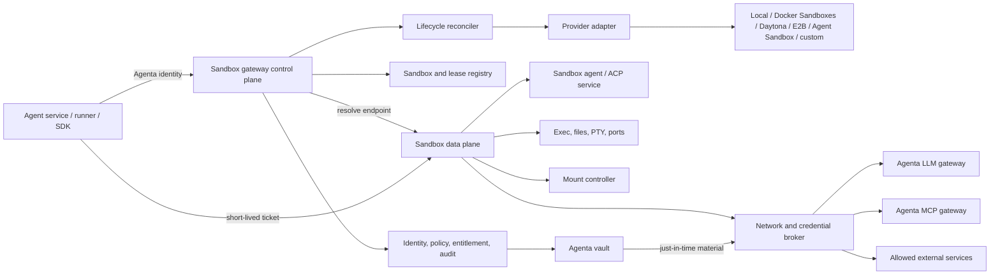

# Initial architecture

Status: working proposal

## 1. Problem statement

Sandbox orchestration currently spans the agent service, runner, sandbox-agent,
provider SDKs, and object-store mount helpers. The runner selects `local` or
`daytona`, materializes model and MCP credentials, creates or reconnects the
sandbox, mounts durable storage, starts the harness-facing daemon, drives ACP,
and decides whether teardown means pause, stop, or delete.

That arrangement works as an integration, but it gives the runner provider
control-plane privileges and customer secret material. It also makes provider
behavior part of the runner contract, makes lifecycle recovery depend on runner
process memory in some paths, and leaves no stable Agenta sandbox resource for
policy, accounting, audit, or other clients.

## 2. Proposed boundary

The **control plane** owns durable intent and provider reconciliation. The
**data plane** carries per-sandbox operations and streams. They may initially run
in the same deployment, but their contracts and credentials should remain
separate.

## 3. Resource model

The minimum useful conceptual entities are:

| Entity | Purpose | Durable contents |
| --- | --- | --- |
| Sandbox | Stable Agenta identity and desired configuration | project, owner, provider selection policy, template, resources, network policy, desired mounts and credential bindings |
| Sandbox generation | One concrete provider realization | generation number, adapter, encrypted/internal provider reference, observed capabilities and state |
| Lease | Time-bounded right to keep or use a sandbox | principal, expiry, renewal policy, idle policy, reason |
| Endpoint | A named data-plane service | kind, protocol, target port/service, generation, readiness |
| Endpoint ticket | Short-lived capability to use one endpoint | audience, subject, sandbox, generation, operations, expiry; never stored as durable plaintext |
| FS binding | Desired FS-gateway attachment | FS ID, configuration revision, mount path, mode, FS revision, requiredness, lifecycle intent; no backend reference |
| Credential binding | Desired outbound or local credential use | secret reference, match rule, injection mode, revision; never the secret value |

The logical sandbox handle should be opaque and provider-neutral. A client that
reconnects with it may reach a new provider object after replacement. Every
data-plane ticket is bound to a generation so replacement revokes old routes by
construction.

## 4. Control-plane contract

The exact URI design remains open, but the standard operations should include:

- create or acquire idempotently;
- get and list logical state;
- renew a lease or activity deadline;
- pause, resume, replace, and terminate;
- resolve a declared endpoint;
- observe capabilities, bootstrap progress, mount state, and failures;
- rotate or rebind a credential without recreating the whole sandbox when the
  provider can support it.

Creation should accept desired policy, not provider-specific payloads. A
provider extension bag may be allowed behind an explicit adapter namespace, but
it must not weaken common invariants silently.

### 4.1 Provider endpoint namespaces

The LLM and MCP gateway work uses `builtin`, `standard`, and `custom` endpoint
namespaces. The sandbox plane reuses the vocabulary for provider endpoint
ownership and trust:

- **builtin**: an Agenta/deployment-operated substrate. Catalog entries are
  generated and project users cannot edit the control endpoint. Examples are
  local development, Docker Sandboxes on a dedicated worker, and Agent Sandbox in
  an Agenta-operated Kubernetes cluster;
- **standard**: a maintained adapter to a canonical hosted provider API, such as
  Daytona or E2B. The catalog entry and URL are code-owned; a project or
  organization binds an account through the vault;
- **custom**: a stored administrator-approved instance of an installed adapter,
  such as a self-hosted Daytona/OpenSandbox server or a dedicated Agent Sandbox
  cluster. The row stores configuration and secret references, never adapter code
  or plaintext credentials.

An arbitrary customer URL is not automatically a sandbox provider. Custom
endpoints select an adapter already installed by the deployment. Images and
templates are independent: a custom E2B template remains `standard/e2b`.

The precise route and entity rules are in [interfaces.md](interfaces.md) and
[providers.md](providers.md).

## 5. Data-plane contract

The first standard endpoint kinds should cover:

| Kind | Typical transport | Notes |
| --- | --- | --- |
| `acp` | HTTP streaming, possibly WebSocket | Runner-to-harness conversation and approval pauses |
| `exec` | HTTP streaming | One-shot and long-running commands, cancellation, exit status |
| `files` | HTTP | Read, write, list, metadata, upload/download URLs where safe |
| `pty` | WebSocket | Interactive terminal with bounded connection lifetime |
| `port` | HTTP/WebSocket proxy | A declared sandbox port, never unrestricted arbitrary routing by default |
| `mounts` | Control operation with observed state | Attach, refresh, verify, and detach volumes |
| `egress` | Policy and telemetry plane | Network policy and credential bindings, not a general user-facing proxy |

Endpoint resolution should return a gateway URL and a short-lived ticket scoped
to the endpoint, operations, sandbox generation, and caller. There are two valid
delivery modes:

1. **Relay mode:** bytes pass through an Agenta data-plane proxy. This gives the
   strongest uniform policy, audit, revocation, and private-network reachability.
2. **Delegated mode:** the gateway returns a short-lived provider or sidecar URL.
   This is acceptable for bulk or latency-sensitive streams only when the
   delegated endpoint provides equivalent authorization, revocation, generation
   binding, and audit correlation.

The API control plane must not proxy long-lived ACP, PTY, or file traffic through
ordinary request workers.

## 6. Provisioning and reconciliation

Provisioning is a reconciled transaction rather than a single provider SDK call:

1. Authenticate the principal; authorize create/use; check entitlement and an
   idempotency key.
2. Persist desired sandbox, lease, policy, template, mount, and credential
   references.
3. Select an adapter from requirements and capability declarations.
4. Allocate the provider sandbox with public configuration, bootstrap identity,
   network policy, and the minimum data-plane components. Do not include customer
   plaintext credentials.
5. Wait for provider readiness and resolve declared data-plane services.
6. Configure mount bindings and credential bindings using short-lived material.
7. Start the sandbox-agent/ACP endpoint and run readiness probes.
8. Persist observed generation and endpoint metadata, emit lifecycle/audit
   events, and return the logical handle.

Failure compensation runs in reverse: revoke endpoint tickets, revoke credential
broker state, detach mounts, stop data-plane services, and delete the provider
object. Every compensation step is idempotent, and an orphan reaper repeats it.

### 6.1 State and generations

A small initial observed state machine is enough:

`provisioning -> bootstrapping -> ready -> pausing -> paused -> resuming -> ready`

Termination may begin from any state and ends in `terminated`. `failed` records a
terminal generation failure; `degraded` can represent a usable sandbox whose
mount, broker, or optional endpoint is not healthy. Desired state and observed
state remain separate so retries and operator intervention are explainable.

Resume is never complete merely because the provider reports `running`. The
gateway must advance the generation or bootstrap revision, replay volatile
credential-broker state, verify mounts, start or reconnect endpoints, and only
then report `ready`.

## 7. Secrets and environment

### 7.1 Classification

Configuration should be split into:

- public environment values safe to pass in a provider create request;
- upstream provider credentials held by Agenta gateways;
- outbound HTTP credentials injected by a credential broker;
- local-use secrets that the sandboxed process must be able to read;
- provider-control credentials used only by the sandbox adapter.

These categories must not share an undifferentiated `env` map.

### 7.2 LLM and MCP credentials

The preferred flow is:

1. The harness receives an Agenta LLM gateway base URL and a sandbox/session
   scoped Agenta credential.
2. MCP HTTP connections point to the Agenta MCP gateway and use a similarly
   scoped Agenta credential.
3. The LLM or MCP gateway resolves the selected user/project secret at request
   time and authenticates upstream.
4. Neither the service-to-runner payload nor the sandbox environment contains the
   upstream provider key.

This composes the gateways instead of reproducing LLM and MCP secret resolution
inside the sandbox plane. Stdio MCP servers still execute inside the sandbox;
their process-local secrets need an explicit local-use binding or a future
hosted/bridged MCP mode.

### 7.3 Outbound credential broker

For other HTTPS services, store only binding intent: secret reference, scheme,
host, canonical port, HTTP method/path constraints, and injection rule. Resolve
the secret just in time into an egress sidecar or external proxy. Give the
workload a fake token or no token, and replace or add the real credential after
the request leaves the workload.

Bindings should update atomically by revision. Secret values are write-only to
the broker, redacted from reads, excluded from snapshots and logs, and cleared on
termination. If broker state is volatile across pause/resume, the durable desired
state lets the control plane replay it before readiness.

`local_use` is an explicit weaker mode. It may deliver a short-lived value to one
exec invocation, a memory-backed file, or a process environment. The contract
must say that sandbox code can read it. Calling an environment variable
"opaque" does not make it opaque.

## 8. FS attachments and mounts

Mounting moves behind the separate FS gateway. Agenta core resolves its
project, agent, session, explicit, and one-off associations while assembling the
sandbox configuration. The sandbox reconciler receives the resulting FS
binding list and submits it with an opaque sandbox generation to the FS gateway.
The FS gateway returns attachment handles and observed state.

The sandbox gateway does not choose or learn whether an FS is implemented
by an S3-compatible or ArtifactFS-compatible backend. It also does not choose
FUSE, CSI, bind, provider-native storage, or a data-plane proxy. Those are FS
gateway/controller decisions. The runner and sandbox lifecycle adapter do not
invoke geesefs directly.

Mount invariants:

- desired bindings contain FS IDs, configuration revisions, optional FS revisions,
  paths, access modes, requiredness, and lifecycle intent, not product
  associations, storage, or vault references;
- prefer service bindings or credential proxies that keep storage credentials
  outside the sandbox;
- otherwise mint the shortest practical STS credential and rotate/remount before
  expiry;
- validate allowed paths, reject overlaps, and never allow a custom host path
  outside an administrator allowlist;
- verify that a FUSE mount is alive after create and resume;
- detach stale/dead mounts before fallback, and never mask a failed durable mount
  as success;
- bind mount observations to the sandbox generation and bootstrap revision;
- keep high-churn control sockets, relay buffers, and telemetry outside durable
  FUSE storage.

The current geesefs implementation contains useful recovery behavior and should
move behind the FS gateway's trusted mount controller rather than be
discarded.

This split prevents the sandbox gateway from becoming the owner of durable files,
product association, backend allocations, archive/delete semantics, or storage
credentials. It owns only the requirement that the configured bindings and their
required attachment revisions are healthy before sandbox readiness.

## 9. ACP and the runner

ACP becomes a declared sandbox endpoint. The runner resolves `acp` for a logical
sandbox and receives a short-lived URL/ticket that supports long response times,
streaming, and human approval pauses. It does not need the provider ID or provider
SDK.

The runner remains responsible for agent-run orchestration and neutral event
translation. The gateway owns the sandbox. A runner restart can reacquire the
logical handle; a gateway/provider restart can issue a new endpoint ticket for
the current generation.

The service-to-runner contract can then shrink to workflow intent, logical
sandbox requirements, gateway routes, and scoped Agenta credentials. Provider
keys, resolved MCP headers, object-store STS values, Daytona handles, and mount
commands disappear from that wire.

## 10. Provider capability model

Avoid a false least-common-denominator API. Each adapter declares support and
quality for capabilities such as:

- create/delete, stop, pause/resume, reconnect, snapshot, replace;
- lease/TTL, activity refresh, provider auto-reaping;
- network deny/allow rules and credential proxy;
- exec, files, PTY, HTTP/WS port exposure, ACP endpoint;
- durable volumes, FUSE, read-only and subpath mounts;
- dynamic environment/secret rotation;
- event push, usage polling, and resource metrics;
- isolation class and known enforcement gaps.

Policy maps requirements to capabilities before allocation. A provider that
cannot enforce a required FS or network restriction is rejected rather
than allowed with a warning.

## 11. Relationship to the LLM and MCP gateways

Reuse the shared gateway policy core for authentication, project/user ownership,
secret resolution, endpoint namespaces, permissions, audit events, and metering
correlation. Keep protocol adapters separate:

- LLM gateway: mostly stateless HTTP model protocols and upstream routing;
- MCP gateway: session-aware MCP transport and tool protocol;
- sandbox gateway: stateful resource lifecycle plus several data-plane protocols.

The sandbox data plane should call the LLM and MCP gateways, not embed their
provider adapters. A shared `GatewayPolicyService` can authorize all three planes
without making one service class own all protocol behavior.

## 12. Migration sequence

### Phase 0: contract and observation

Document the current runner contract, capability matrix, lifecycle reasons,
secret paths, mount behavior, and usage events. Add correlation identifiers so
current behavior can be compared with the gateway.

### Phase 1: facade over current providers

Introduce the logical sandbox record, handle, lease, and endpoint resolution.
The first adapter may call the existing runner-owned Daytona/local code behind a
gateway facade. This establishes the consumer contract without a flag-day move.

### Phase 2: move lifecycle ownership

Move provider SDK clients, provider handles, lifecycle reconciliation, activity
refresh, shutdown cleanup, and orphan reaping from the runner to sandbox gateway
workers. The runner uses only the logical handle and ACP endpoint.

### Phase 3: move mounts and credential brokering

Move geesefs operations and any private backend authority behind FS
attachments. Accept core-resolved FS configuration, add outbound
credential-broker bindings and resume replay, and retire process-local Daytona
secret allocation state.

### Phase 4: compose LLM and MCP gateways

Pass only scoped Agenta gateway routes and credentials into sandboxes. Remove
resolved LLM keys and MCP headers from the runner wire and ordinary sandbox env.

### Phase 5: broaden adapters

Add Docker Sandboxes, OpenSandbox, E2B, and trusted custom endpoints. An ordinary
Docker container remains distinct from Docker Sandboxes' microVM model and from
the runner's deployment topology.

## 13. Primary risks

| Risk | Design response |
| --- | --- |
| Gateway becomes a streaming bottleneck | Split control/data deployments; allow delegated endpoints only with equivalent controls |
| Provider state and Agenta state diverge | Desired/observed state, generations, idempotent reconciliation, orphan reaping |
| Resume exposes an unbootstrapped sandbox | Gate `ready` on broker replay, mounts, endpoints, and probes |
| Credential MITM expands trust | Narrow match rules, dedicated CA scope, redaction, no snapshots, threat model and opt-in policy |
| Lowest-common-denominator API blocks provider features | Capability negotiation plus namespaced extensions |
| Local mode is mistaken for production isolation | Label isolation class and reject production policies it cannot enforce |
| A stable handle grants permanent access | Stable identity, short-lived generation-bound endpoint tickets |
| Secret or STS material leaks through logs/contracts | Typed secret classes, redaction tests, wire-contract tests, no generic secret/env merge |
