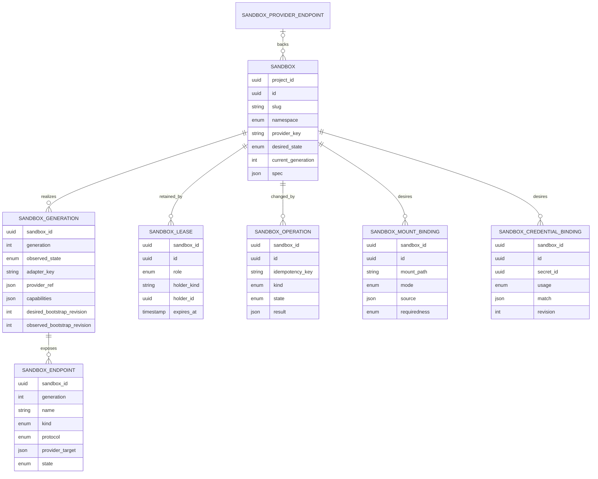

# Sandbox gateway entities

Status: proposed vocabulary and persistence shape. Column names are not a
migration specification.

## 1. Domain placement

The sandbox plane is a third protocol/resource plane under the plural gateways
domain. It reuses the shared policy core without being folded into either LLM or
MCP behavior.

```text
core/gateways/
  policy/                         shared identity, authorization, secret resolution,
                                  audit and metering policy
  llms/                           existing LLM plane
  mcps/                           existing MCP plane
  sandboxes/                      new resource plane
    dtos.py                       entities, value objects, requests, observations
    types.py                      domain errors and state enums
    interfaces.py                 north and south ports
    service.py                    commands and queries over logical sandboxes
    policy.py                     requirement-to-capability evaluation
    tickets.py                    endpoint capability mint/validate/revoke
    providers/
      registry.py                 adapter registration and provider selection
      local/
      docker/
      daytona/
      e2b/
      agent_sandbox/

dbs/postgres/gateways/sandboxes/
  dbas.py
  dbes.py
  dao.py
  mappings.py

apis/fastapi/gateways/sandboxes/
  models.py                       Agenta control-plane wire models
  router.py                       lifecycle and endpoint-resolution routes

workers/sandbox_gateway/          logical placement; exact process layout is open
  reconciler.py
  reaper.py

services/sandbox-data-plane/      logical deployable boundary; language is open
  endpoint relay and ticket enforcement
```

The data-plane service is shown as a deployable boundary because ACP, PTY,
WebSocket port proxying, and file transfer have different timeout, connection,
and scaling behavior from ordinary API calls. Its language and repository path
remain implementation choices.

## 2. Aggregate overview



Only `Sandbox` is a public stable identity. Generation, provider reference, and
provider target are internal. Lease IDs may be returned to authorized holders;
they are not sufficient to access a data endpoint. Endpoint tickets are signed or
opaque ephemeral capabilities and are deliberately not a table.

### 2.1 `SandboxProviderEndpoint`

Only custom provider endpoints have durable rows. Builtin and standard endpoints
are generated from deployment configuration and maintained catalogs.

```python
class SandboxProviderEndpoint:
    project_id: UUID
    id: UUID
    slug: str
    adapter_key: str                 # installed adapter only
    control_url: AnyHttpUrl
    secret_id: Optional[UUID]
    configuration: Dict[str, JsonValue]
    status: ProviderEndpointStatus
    last_probed_at: Optional[datetime]
    created_by_id: UUID
    created_at: datetime
    updated_at: datetime
```

The row represents an administrator-approved instance of an adapter, not adapter
code. Examples are a self-hosted Daytona/OpenSandbox server or a dedicated Agent
Sandbox cluster. The secret is a vault reference. Probe results record sanitized
identity, version, health, and capabilities; raw provider responses and tokens are
not persisted.

## 3. `Sandbox`

One project-scoped logical execution environment.

```python
class SandboxState(str, Enum):
    RUNNING = "running"
    PAUSED = "paused"
    TERMINATED = "terminated"


class SandboxNamespace(str, Enum):
    BUILTIN = "builtin"
    STANDARD = "standard"
    CUSTOM = "custom"


class Sandbox:
    project_id: UUID
    id: UUID
    slug: str
    namespace: SandboxNamespace
    provider_key: str
    desired_state: SandboxState
    current_generation: int
    spec: SandboxSpec
    created_by_id: UUID
    created_at: datetime
    updated_at: datetime
    deleted_at: Optional[datetime]
```

`provider_key` records the selected Agenta adapter name, not a provider object ID.
For an automatic selector, the provider chosen for the first generation becomes
the current value. A later provider replacement can change it through an explicit
operation and a new generation.

### 3.1 `SandboxSpec`

```python
class SandboxSpec:
    template: SandboxTemplateRef
    resources: SandboxResources
    runtime: SandboxRuntimeSpec
    network: SandboxNetworkPolicy
    public_env: Dict[str, str]
    mounts: List[SandboxMountSpec]
    credentials: List[SandboxCredentialSpec]
    lifecycle: SandboxLifecyclePolicy
    requirements: SandboxRequirements
    provider_extension: Optional[ProviderExtension]
```

The spec is desired intent. It does not contain provider credentials, resolved
customer secrets, endpoint tickets, provider IDs, or storage STS values.

`public_env` is restricted to values safe for the workload, provider API, logs,
and snapshots. Secret-looking values are rejected or must use a typed credential
binding. This prevents a generic environment map from becoming a second vault.

### 3.2 Template and runtime

```python
class SandboxTemplateRef:
    key: str                     # Agenta template/profile identifier
    revision: Optional[str]


class SandboxRuntimeSpec:
    command: Optional[List[str]]
    working_directory: str
    services: List[SandboxServiceSpec]


class SandboxServiceSpec:
    name: str                    # e.g. sandbox-agent
    endpoint_kind: EndpointKind  # e.g. acp
    port: int
    protocol: EndpointProtocol
    health_check: HealthCheck
```

A maintained template must install and start the sandbox-agent/ACP service or
otherwise declare an equivalent endpoint. Provider image IDs, E2B template IDs,
Daytona snapshots, Docker image digests, and Kubernetes template/warm-pool names
are resolved inside the adapter from the Agenta template revision.

### 3.3 Resources and lifecycle

```python
class SandboxResources:
    cpu_millis: int
    memory_mib: int
    disk_mib: Optional[int]
    gpu: Optional[SandboxGPURequest]


class SandboxLifecyclePolicy:
    lease_seconds: int
    idle_seconds: Optional[int]
    max_lifetime_seconds: int
    on_release: ReleaseDisposition  # pause | terminate
    on_expiry: ReleaseDisposition
```

Provider limits can narrow a request but cannot silently broaden it. For example,
a provider maximum lifetime lower than requested is returned as the effective
policy; a provider unable to honor a required idle timeout is rejected.

### 3.4 Network and requirements

```python
class SandboxNetworkPolicy:
    default_action: NetworkAction        # deny | allow
    egress: List[NetworkRule]
    inbound: List[InboundServiceRule]


class SandboxRequirements:
    isolation: IsolationClass
    fs_policy: FSPolicy
    required_capabilities: Set[SandboxCapability]
    region: Optional[str]
    data_residency: Optional[str]
```

Requirements are used before allocation. An adapter cannot return `ready` if its
capability declaration does not satisfy them.

## 4. `SandboxGeneration`

One concrete realization of a logical sandbox.

```python
class ObservedSandboxState(str, Enum):
    PENDING = "pending"
    PROVISIONING = "provisioning"
    BOOTSTRAPPING = "bootstrapping"
    READY = "ready"
    PAUSING = "pausing"
    PAUSED = "paused"
    RESUMING = "resuming"
    DEGRADED = "degraded"
    TERMINATING = "terminating"
    TERMINATED = "terminated"
    FAILED = "failed"


class SandboxGeneration:
    project_id: UUID
    sandbox_id: UUID
    generation: int
    adapter_key: str
    provider_ref: ProviderResourceRef
    observed_state: ObservedSandboxState
    state_reason: Optional[SandboxStateReason]
    capabilities: SandboxCapabilities
    desired_bootstrap_revision: int
    observed_bootstrap_revision: int
    provider_created_at: Optional[datetime]
    ready_at: Optional[datetime]
    last_observed_at: datetime
    terminated_at: Optional[datetime]
```

`provider_ref` is adapter-owned JSON encrypted where it contains a bearer-like
handle. It may contain a Daytona sandbox ID, E2B sandbox ID, Docker container-set
identifier, local process identity, or Kubernetes namespace/claim name. It is
never returned through the north port.

The pair `(sandbox_id, generation)` is immutable. Replacement, provider loss, or
an isolation-changing rebuild creates a new generation. A pause/unpause may keep
the same generation, but it must advance `desired_bootstrap_revision` when
volatile broker, mount, service, or endpoint state needs replay. Tickets include
both generation and bootstrap revision.

## 5. `SandboxLease`

A time-bounded retention and usage claim.

```python
class LeaseRole(str, Enum):
    WRITER = "writer"
    OBSERVER = "observer"


class SandboxLease:
    project_id: UUID
    sandbox_id: UUID
    id: UUID
    role: LeaseRole
    holder_kind: LeaseHolderKind       # agent_run | session | user | service
    holder_id: UUID
    principal_id: UUID
    acquired_at: datetime
    renewed_at: datetime
    expires_at: datetime
    released_at: Optional[datetime]
```

The v1 concurrency rule should be one active writer lease per sandbox and any
number of observers. A second writer acquisition either returns the existing
lease to the same holder, waits, or conflicts; it never silently shares mutable
ACP/FS state. This rule can later evolve without changing sandbox identity.

Lease expiry changes desired state according to lifecycle policy. It does not
grant access by itself; data-plane access still requires a short-lived ticket.

## 6. `SandboxEndpoint`

A generation-scoped named service.

```python
class EndpointKind(str, Enum):
    ACP = "acp"
    EXEC = "exec"
    FILES = "files"
    PTY = "pty"
    PORT = "port"
    MOUNTS = "mounts"
    EGRESS = "egress"


class SandboxEndpoint:
    project_id: UUID
    sandbox_id: UUID
    generation: int
    name: str
    kind: EndpointKind
    protocol: EndpointProtocol         # http | http_stream | websocket
    provider_target: ProviderEndpointRef
    delivery_mode: EndpointDeliveryMode # relay | delegated
    state: EndpointState
    last_probe_at: Optional[datetime]
```

`provider_target` is an internal URL/port/header recipe. Provider tokens in this
recipe are encrypted or held in a runtime credential store and are never copied
into an endpoint ticket. Public endpoint resolution returns an Agenta URL and an
Agenta ticket.

Port endpoints also record a declared port and allowed protocols. There is no
generic SSRF-capable target URL field on the north port.

## 7. `SandboxFSBinding`

Desired attachment from a core-resolved sandbox FS configuration.

```python
class SandboxFSBinding:
    project_id: UUID
    sandbox_id: UUID
    id: UUID
    mount_path: str
    fs_id: UUID
    configuration_revision: int
    fs_revision: Optional[str]
    mode: MountMode                    # read_only | read_write
    requiredness: BindingRequiredness # required | optional
    lifecycle: FSLifecycleIntent
    desired_revision: int
    observed_generation: Optional[int]
    observed_revision: Optional[int]
    fs_attachment_id: Optional[UUID]
    observed_state: BindingState
    state_reason: Optional[str]
```

Agenta core derives this list from current `Mount` associations, explicit
FS selections, and one-off create requests while building the sandbox
configuration. The FS gateway receives only the resolved binding. It does not
interpret project, agent, or session. The binding contains no backend kind,
endpoint, physical root, driver hint, or vault reference.

Mount paths are normalized, non-overlapping, and constrained to declared writable
roots. Required mount failure prevents `ready`; optional failure produces
`degraded` and remains observable.

## 8. `SandboxCredentialBinding`

Desired authorization for one workload use of one vault secret.

```python
class CredentialUsage(str, Enum):
    AGENTA_LLM_GATEWAY = "agenta_llm_gateway"
    AGENTA_MCP_GATEWAY = "agenta_mcp_gateway"
    OPAQUE_HTTP = "opaque_http"
    LOCAL_USE = "local_use"
    STORAGE = "storage"


class SandboxCredentialBinding:
    project_id: UUID
    sandbox_id: UUID
    id: UUID
    secret_id: UUID
    usage: CredentialUsage
    match: CredentialMatch
    delivery: CredentialDelivery
    desired_revision: int
    observed_generation: Optional[int]
    observed_revision: Optional[int]
    observed_state: BindingState
    state_reason: Optional[str]
```

For LLM and MCP gateway bindings, `secret_id` may reference the Agenta credential
signing/authorization subject rather than an upstream provider key. Upstream
provider secret selection remains inside the respective gateway.

An opaque HTTP match includes scheme, canonical host/port, method set, path
matcher, and typed injection rule. Redirect handling is explicit. A local-use
delivery includes the exact process/service recipient and delivery mechanism
(one exec environment, memory-backed file, or service environment). It is never
represented as opaque.

Credential bindings are durable. Resolved values are sent just in time to the
credential broker, process invocation, or mount driver and then discarded.

## 9. `SandboxOperation`

A durable, idempotent lifecycle command and its progress.

```python
class SandboxOperation:
    project_id: UUID
    id: UUID
    sandbox_id: UUID
    idempotency_key: str
    kind: OperationKind                # create | pause | resume | renew | replace | terminate
    requested_by_id: UUID
    requested_at: datetime
    state: OperationState              # accepted | running | succeeded | failed
    target_generation: Optional[int]
    attempts: int
    next_attempt_at: Optional[datetime]
    error: Optional[SanitizedOperationError]
    result: Optional[OperationResult]
    completed_at: Optional[datetime]
```

The uniqueness key is `(project_id, idempotency_key, kind)` or a caller-supplied
operation ID with equivalent scope. Retrying the same command returns the same
operation and result. Provider retries therefore cannot create duplicate live
sandboxes.

The operation record is also the reconciliation queue input. Provider-specific
exceptions are sanitized before persistence.

## 10. Ephemeral value objects

### 10.1 Endpoint ticket

```python
class SandboxEndpointTicketClaims:
    issuer: str
    audience: str
    principal_id: UUID
    project_id: UUID
    sandbox_id: UUID
    generation: int
    bootstrap_revision: int
    lease_id: UUID
    endpoint_name: str
    operations: Set[EndpointOperation]
    issued_at: datetime
    expires_at: datetime
    nonce: str
```

Tickets are short-lived and never stored in plaintext. Early revocation can use
a generation/bootstrap revision bump, lease release, signing-key rotation, or a
small nonce denylist for exceptional cases.

### 10.2 Provider capabilities

```python
class CapabilitySupport(str, Enum):
    NATIVE = "native"
    EMULATED = "emulated"
    EXPERIMENTAL = "experimental"
    UNSUPPORTED = "unsupported"


class SandboxCapabilities:
    isolation: IsolationClass
    lifecycle: Dict[LifecycleCapability, CapabilitySupport]
    endpoints: Dict[EndpointKind, CapabilitySupport]
    network: Dict[NetworkCapability, CapabilitySupport]
    storage: Dict[StorageCapability, CapabilitySupport]
    credentials: Dict[CredentialCapability, CapabilitySupport]
    accounting: Dict[AccountingCapability, CapabilitySupport]
    limits: SandboxProviderLimits
```

Capabilities are an adapter declaration plus observed provider/template probes.
The generation stores the effective result so incident analysis can reconstruct
why a request was admitted.

## 11. Persistence invariants

1. A sandbox has at most one non-terminal current generation.
2. Only a `ready` or intentionally `degraded` current generation can issue data
   endpoint tickets.
3. A ticket's generation and bootstrap revision must equal the current observed
   values at validation time.
4. There is at most one active writer lease per sandbox.
5. A provider reference is unique within an adapter and cannot be adopted by two
   logical sandboxes.
6. Termination revokes leases and tickets before or atomically with scheduling
   provider deletion.
7. Required binding revisions must be observed before the generation becomes
   `ready`.
8. No durable JSON, status, error, event, or provider extension contains resolved
   secret values, STS credentials, endpoint tickets, or provider API keys.
9. Deleted provider resources remain tombstoned long enough for idempotent
   observation and accounting reconciliation.
10. Usage and audit records use the logical sandbox ID, generation, operation ID,
    and provider key as correlation attributes; they are events, not entity tables.
