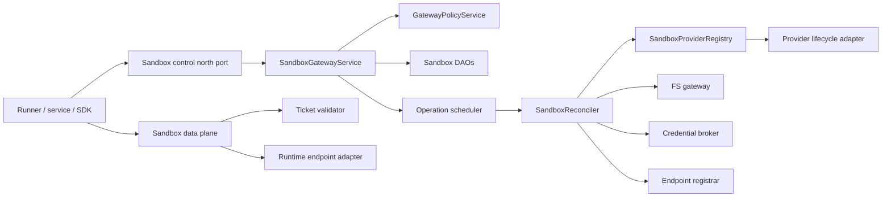

# Sandbox gateway interfaces

Status: proposed contract. Names and shapes are concrete enough to divide work,
but public URIs remain subject to API review.

## 1. Boundary map



The provider lifecycle adapter is not the data-plane adapter. Some providers
offer both through one SDK, but keeping the ports separate prevents E2B command
APIs, Docker `sbx exec`, OpenSandbox execd, and a direct sandbox-agent HTTP
endpoint from contaminating lifecycle state transitions.

## 2. Endpoint namespace contract

`builtin`, `standard`, and `custom` classify the provider endpoint's ownership,
configuration, and trust boundary.

| Namespace | Definition | Persistence | Who can install/change it | Examples |
| --- | --- | --- | --- | --- |
| `builtin` | Agenta-operated substrate whose endpoint and provider credentials are deployment configuration | Generated catalog entry; no project endpoint row | Agenta/deployment operator | `builtin/local`, `builtin/docker-sbx`, `builtin/agent-sandbox` in an Agenta cluster |
| `standard` | Maintained adapter to a canonical hosted provider API | Generated catalog definition plus a project/org secret or account binding; no arbitrary URL | Agenta maintains adapter; authorized project/org member binds account | `standard/daytona`, `standard/e2b` |
| `custom` | Stored instance of an installed adapter with an administrator-approved control endpoint and secret reference | `sandboxes_provider_endpoints` row | Deployment/org administrator, then project use policy | self-hosted Daytona, OpenSandbox server, Agent Sandbox cluster, private compatible service |

Namespace does not describe image customization. A custom image on E2B still uses
`standard/e2b`; it is a template choice. A custom endpoint does not permit uploaded
adapter code, arbitrary shell commands, or an arbitrary Docker socket. Its
`adapter_key` must already exist in the deployment registry.

### 2.1 Provider endpoint value object

```python
class SandboxProviderRoute:
    namespace: SandboxNamespace
    key: str
    endpoint_id: Optional[UUID]       # custom only
    adapter_key: str
    control_url: Optional[SecretStr]  # internal resolved form only
    account_secret_id: Optional[UUID]
    configuration: Dict[str, JsonValue]
```

For builtin routes, control URLs and provider credentials come from deployment
configuration. For standard routes, canonical URLs are code-owned and the
account binding is resolved using the caller/project secret policy. For custom
routes, the row stores a URL/configuration and vault reference but never a secret
value.

## 3. North port: application service

```python
class SandboxGatewayServiceInterface(ABC):
    @abstractmethod
    async def acquire(
        self,
        *,
        scope: AuthScope,
        route: SandboxProviderSelector,
        request: SandboxAcquire,
        idempotency_key: str,
    ) -> SandboxOperationView: ...

    @abstractmethod
    async def get_sandbox(
        self, *, scope: AuthScope, sandbox_id: UUID
    ) -> SandboxView: ...

    @abstractmethod
    async def query_sandboxes(
        self, *, scope: AuthScope, query: SandboxQuery, windowing: Windowing
    ) -> List[SandboxView]: ...

    @abstractmethod
    async def pause(
        self, *, scope: AuthScope, sandbox_id: UUID, idempotency_key: str
    ) -> SandboxOperationView: ...

    @abstractmethod
    async def resume(
        self, *, scope: AuthScope, sandbox_id: UUID, idempotency_key: str
    ) -> SandboxOperationView: ...

    @abstractmethod
    async def renew_lease(
        self,
        *,
        scope: AuthScope,
        sandbox_id: UUID,
        lease_id: UUID,
        request: SandboxLeaseRenew,
    ) -> SandboxLeaseView: ...

    @abstractmethod
    async def release_lease(
        self, *, scope: AuthScope, sandbox_id: UUID, lease_id: UUID
    ) -> SandboxLeaseView: ...

    @abstractmethod
    async def replace(
        self,
        *,
        scope: AuthScope,
        sandbox_id: UUID,
        request: SandboxReplace,
        idempotency_key: str,
    ) -> SandboxOperationView: ...

    @abstractmethod
    async def terminate(
        self, *, scope: AuthScope, sandbox_id: UUID, idempotency_key: str
    ) -> SandboxOperationView: ...

    @abstractmethod
    async def resolve_endpoint(
        self,
        *,
        scope: AuthScope,
        sandbox_id: UUID,
        lease_id: UUID,
        request: SandboxEndpointResolve,
    ) -> SandboxEndpointAccess: ...
```

Every command authorizes against the logical sandbox and records an operation.
`resolve_endpoint` additionally checks the active lease, current generation,
endpoint readiness, requested operations, and entitlement.

### 3.1 Acquire request and result

```python
class SandboxAcquire:
    slug: Optional[str]
    reuse: SandboxReusePolicy          # never | holder | explicit
    existing_sandbox_id: Optional[UUID]
    lease: SandboxLeaseRequest
    spec: SandboxSpec
    wait: SandboxWaitPolicy            # accepted | ready
    wait_timeout_seconds: Optional[int]


class SandboxOperationView:
    operation_id: UUID
    sandbox_id: UUID
    state: OperationState
    sandbox: Optional[SandboxView]
    retry_after_seconds: Optional[int]
    error: Optional[GatewayErrorView]
```

`reuse=holder` replaces the current conversation-pointer heuristic with a query
for an authorized logical sandbox and active/reacquirable holder relationship.
It never accepts a provider ID from the caller.

### 3.2 Sandbox view

```python
class SandboxView:
    id: UUID
    slug: str
    route: PublicSandboxProviderRoute  # namespace/key, never URL/secret/provider ID
    desired_state: SandboxState
    observed_state: ObservedSandboxState
    generation: int
    bootstrap_revision: int
    effective_capabilities: SandboxCapabilities
    effective_lifecycle: SandboxLifecyclePolicy
    leases: List[SandboxLeaseView]
    endpoints: List[SandboxEndpointView]
    mounts: List[SandboxMountView]
    created_at: datetime
    ready_at: Optional[datetime]
    state_reason: Optional[SandboxStateReason]
```

Provider raw states and error bodies are mapped to a sanitized state reason with
an internal correlation ID.

## 4. Proposed HTTP control surface

Management uses Agenta envelopes and normal request authentication. Provider
namespace appears only on acquire and provider endpoint management.

| Method and path | Meaning |
| --- | --- |
| `POST /v1/gateways/sandboxes/{namespace}/{key}` | Acquire/create a sandbox and writer lease |
| `GET /v1/gateways/sandboxes/{sandbox_id}` | Read logical and observed state |
| `GET /v1/gateways/sandboxes` | Query project-visible sandboxes |
| `POST /v1/gateways/sandboxes/{sandbox_id}/pause` | Request pause |
| `POST /v1/gateways/sandboxes/{sandbox_id}/resume` | Request resume and bootstrap replay |
| `POST /v1/gateways/sandboxes/{sandbox_id}/replace` | Create a new generation, optionally on another route |
| `DELETE /v1/gateways/sandboxes/{sandbox_id}` | Terminate and revoke |
| `POST /v1/gateways/sandboxes/{sandbox_id}/leases/{lease_id}/renew` | Renew within effective limits |
| `DELETE /v1/gateways/sandboxes/{sandbox_id}/leases/{lease_id}` | Release holder claim |
| `POST /v1/gateways/sandboxes/{sandbox_id}/endpoints/{name}/resolve` | Mint scoped data-plane access |
| `GET /v1/gateways/sandboxes/operations/{operation_id}` | Poll an asynchronous command |

Custom provider endpoint CRUD is an administrator surface:

| Method and path | Meaning |
| --- | --- |
| `POST /v1/gateways/sandboxes/endpoints` | Register a custom endpoint using an installed adapter |
| `GET /v1/gateways/sandboxes/endpoints` | Merge builtin, standard-available, and custom endpoints |
| `GET/PUT/DELETE /v1/gateways/sandboxes/endpoints/{endpoint_id}` | Manage only custom endpoint rows |
| `POST /v1/gateways/sandboxes/endpoints/{endpoint_id}/probe` | Probe identity, version, and capabilities without creating a tenant sandbox |

Standard and builtin catalog entries cannot be edited through CRUD. Deployment
configuration or the adapter catalog owns them.

## 5. Endpoint access contract

```python
class SandboxEndpointResolve:
    operations: Set[EndpointOperation]
    requested_ttl_seconds: int
    delivery_preference: Optional[EndpointDeliveryMode]


class SandboxEndpointAccess:
    sandbox_id: UUID
    generation: int
    bootstrap_revision: int
    endpoint: str
    kind: EndpointKind
    protocol: EndpointProtocol
    url: AnyHttpUrl
    credentials: GatewayCredentials
    expires_at: datetime
    delivery_mode: EndpointDeliveryMode
```

`GatewayCredentials` is an Agenta credential, preferably carried in
`X-AG-Credentials` so it does not collide with protocol authorization. A
delegated provider token is never returned directly. If delegated mode is used,
the URL itself or a data-plane exchange token remains Agenta-issued and resolves
server-side to the provider credential.

### 5.1 Standard data-plane routes

The resolved URL may use a deployment-specific host, but relay semantics are:

```text
POST   /v1/data/sandboxes/{sandbox_id}/exec
GET    /v1/data/sandboxes/{sandbox_id}/exec/{exec_id}
DELETE /v1/data/sandboxes/{sandbox_id}/exec/{exec_id}
ANY    /v1/data/sandboxes/{sandbox_id}/files/{path...}
GET    /v1/data/sandboxes/{sandbox_id}/pty        (WebSocket upgrade)
ANY    /v1/data/sandboxes/{sandbox_id}/ports/{port}/{path...}
ANY    /v1/data/sandboxes/{sandbox_id}/acp/{path...}
```

The ticket restricts the route even if a client edits the URL. Path traversal,
port changes, protocol upgrade, and cross-sandbox routing are checked after URL
normalization and before provider resolution.

## 6. South port: provider lifecycle

```python
class SandboxProviderAdapterInterface(ABC):
    key: str

    @abstractmethod
    async def probe_provider(
        self, *, route: SandboxProviderRoute
    ) -> ProviderProbe: ...

    @abstractmethod
    async def plan(
        self, *, route: SandboxProviderRoute, spec: SandboxSpec
    ) -> ProviderPlan: ...

    @abstractmethod
    async def provision(
        self,
        *,
        route: SandboxProviderRoute,
        request: ProviderProvisionRequest,
        idempotency_token: str,
    ) -> ProviderResourceRef: ...

    @abstractmethod
    async def observe(
        self, *, route: SandboxProviderRoute, resource: ProviderResourceRef
    ) -> ProviderObservation: ...

    @abstractmethod
    async def pause(
        self, *, route: SandboxProviderRoute, resource: ProviderResourceRef
    ) -> ProviderObservation: ...

    @abstractmethod
    async def resume(
        self, *, route: SandboxProviderRoute, resource: ProviderResourceRef
    ) -> ProviderObservation: ...

    @abstractmethod
    async def terminate(
        self, *, route: SandboxProviderRoute, resource: ProviderResourceRef
    ) -> ProviderObservation: ...

    @abstractmethod
    async def resolve_provider_endpoint(
        self,
        *,
        route: SandboxProviderRoute,
        resource: ProviderResourceRef,
        service: SandboxServiceSpec,
    ) -> ProviderEndpointRef: ...

    @abstractmethod
    async def read_usage(
        self, *, route: SandboxProviderRoute, resource: ProviderResourceRef
    ) -> ProviderUsageObservation: ...
```

Every method is idempotent or made idempotent by the adapter. `terminate` treats
not-found as success. `observe` never mutates provider state. `plan` maps the
provider's current abilities and effective limits without allocating resources.

Provider adapters receive resolved provider-control credentials from a narrow
provider credential resolver. They never receive LLM, MCP, FS, or other
customer workload secrets.

### 6.1 Plan contract

```python
class ProviderPlan:
    adapter_key: str
    effective_capabilities: SandboxCapabilities
    effective_resources: SandboxResources
    effective_lifecycle: SandboxLifecyclePolicy
    template_resolution: ProviderTemplateRef
    unsupported: List[UnsupportedRequirement]
    warnings: List[ProviderPlanWarning]
```

Any required capability in `unsupported` rejects acquire before allocation.
Warnings are allowed only for preferences or declared optional behavior.

## 7. South port: runtime endpoints

```python
class SandboxRuntimeAdapterInterface(ABC):
    @abstractmethod
    async def exec(
        self, *, target: ProviderEndpointRef, request: ExecRequest
    ) -> AsyncIterator[ExecEvent]: ...

    @abstractmethod
    async def cancel_exec(
        self, *, target: ProviderEndpointRef, exec_id: str
    ) -> None: ...

    @abstractmethod
    async def file_operation(
        self, *, target: ProviderEndpointRef, request: FileOperation
    ) -> FileOperationResult: ...

    @abstractmethod
    async def open_stream(
        self, *, target: ProviderEndpointRef, request: StreamOpen
    ) -> DuplexByteStream: ...

    @abstractmethod
    async def probe_endpoint(
        self, *, target: ProviderEndpointRef, health: HealthCheck
    ) -> EndpointProbe: ...
```

Most maintained templates should expose sandbox-agent HTTP and use one shared
runtime adapter. E2B native commands/files may be an alternate runtime adapter;
Docker `sbx exec` may bootstrap sandbox-agent before normal endpoint relay.

## 8. Reconciliation collaborators

```python
class SandboxFSGatewayInterface(ABC):
    async def attach_many(
        self,
        *,
        sandbox: SandboxSubject,
        bindings: List[ResolvedSandboxFSBinding],
        configuration_revision: int,
    ) -> List[FSAttachmentAccess]: ...

    async def renew_attachment(
        self, *, attachment_id: UUID, sandbox_generation: int
    ) -> FSAttachmentAccess: ...

    async def detach(self, *, attachment_id: UUID) -> None: ...


class SandboxCredentialBrokerInterface(ABC):
    async def apply_revision(
        self,
        *,
        subject: SandboxSubject,
        bindings: List[ResolvedCredentialBinding],
        revision: int,
    ) -> BrokerRevisionAck: ...

    async def revoke(self, *, subject: SandboxSubject) -> None: ...


class SandboxEndpointRegistrarInterface(ABC):
    async def publish_generation(
        self,
        *,
        subject: SandboxSubject,
        endpoints: List[ProviderEndpointRef],
    ) -> List[SandboxEndpoint]: ...

    async def withdraw_generation(self, *, subject: SandboxSubject) -> None: ...
```

Agenta core resolves product associations into sandbox FS configuration.
The FS gateway receives generic bindings and returns backend-neutral
attachment handles. The sandbox gateway never learns the product association or
backend family, receives storage credentials, or shells out to geesefs after
this interface lands.

## 9. Error semantics

| Domain error | HTTP | Retry | Meaning |
| --- | ---: | --- | --- |
| `SandboxRouteNotFound` | 404 | no | Namespace/key or custom endpoint is absent |
| `SandboxCapabilityUnsupported` | 422 | no | Provider cannot enforce a required capability |
| `SandboxLeaseConflict` | 409 | after release | Another writer holds the sandbox |
| `SandboxNotReady` | 409/425 | after operation | Current generation is not data-plane ready |
| `SandboxOperationInProgress` | 202 | poll | Accepted asynchronous transition |
| `SandboxProviderUnavailable` | 503 | yes | Control plane or capacity unavailable |
| `SandboxEndpointUnavailable` | 503 | yes | Lifecycle ready but endpoint probe failed |
| `SandboxTicketInvalid` | 401 | refresh ticket | Signature/audience/expiry invalid |
| `SandboxTicketStale` | 409 | resolve again | Generation/bootstrap revision changed |
| `SandboxPolicyDenied` | 403 | no | Principal or entitlement denied |
| `SandboxGone` | 410 | no | Logical sandbox terminated |

Provider exception text is logged only after redaction and referenced by a
correlation ID. The public error never contains provider URLs, IDs, credentials,
container names, Kubernetes namespaces, or raw response bodies.
