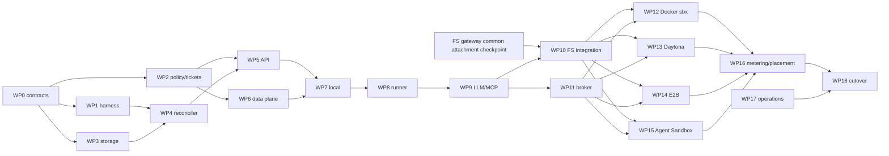

# Sandbox gateway work packages

Status: proposed dependency plan. Packages define review and merge boundaries,
not estimates or dates.

## 1. Delivery rules

- Freeze entities, interfaces, error semantics, and conformance fixtures in a
  seed before provider work branches.
- One owner per file. Shared entrypoint/configuration edits happen at merge points.
- Each wave ends at a deployed checkpoint with the acceptance matrix, not merely
  unit tests.
- A provider package implements only its adapter and provider-specific fixtures.
  It does not edit the shared conformance cases to make itself pass.
- A capability may be `unsupported`; a required baseline capability may not be
  skipped.
- Keep the old runner path behind a feature flag until checkpoint parity and
  orphan cleanup are proven.

## 2. Wave 0: contracts and test substrate

### WP0 — Seed vocabulary and ports

Add sandbox DTOs, enums, domain errors, DAO interfaces, lifecycle/runtime adapter
ports, provider registry interface, FS gateway client port, broker port, and
endpoint ticket claims with not-implemented bodies.

**Done when:** every later package imports its exact signature from the seed;
provider IDs, secret values, and storage credentials are absent from north-port
DTOs.

### WP1 — Conformance harness and fake provider

Build a deterministic fake provider/runtime with controllable state transitions,
delays, errors, endpoint resets, usage, and orphan behavior. Implement the shared
adapter conformance suite and full-stack fake acceptance service.

**Done when:** lifecycle races, idempotency, stale tickets, resume replay, and
cleanup failures can be reproduced without a live provider.

### WP2 — Shared policy and ticket model

Extend gateway permissions and policy targets for sandbox view/use/edit/manage;
implement capability admission, leases, one-writer conflict, endpoint ticket
mint/validate/revoke, audit envelopes, and redaction.

**Done when:** an unauthorized call never reaches the fake provider, and released
or stale generation tickets stop at the data-plane boundary.

**Checkpoint C0:** contract review plus fake full-stack acceptance.

## 3. Wave 1: durable control plane

### WP3 — Domain persistence

Implement sandbox, generation, lease, endpoint, mount-binding reference,
credential-binding reference, custom provider endpoint, and operation storage,
mappings, migration, and project-scoped DAOs.

**Done when:** all aggregates round-trip; uniqueness and secret-free persistence
invariants have database tests.

### WP4 — Reconciler, operations, and orphan reaper

Implement desired/observed state transitions, retry/backoff, per-sandbox locking,
provider observation, bootstrap revisions, reverse-order compensation, orphan
discovery, and shutdown behavior.

**Done when:** duplicate create events allocate once, crash recovery resumes an
operation, and delete/not-found converges to terminated.

### WP5 — Control API and provider endpoint management

Implement lifecycle routes, operation polling, lease routes, endpoint resolution,
catalog merge, custom endpoint CRUD/probe, normal authorization, and public error
mapping.

**Done when:** builtin/standard entries are generated and immutable, custom rows
select only installed adapters, and raw provider details never enter responses.

### WP6 — Sandbox data-plane service

Implement ticket validation, endpoint lookup, exec/files/ACP HTTP relay,
WebSocket upgrades for PTY/ports, streaming limits, backpressure, cancellation,
connection accounting, and sanitized telemetry.

**Done when:** fake ACP survives an approval pause and reconnect; stale tickets,
path traversal, port substitution, and cross-sandbox headers are rejected.

**Checkpoint C1:** durable fake provider through real control and data planes.

## 4. Wave 2: local vertical slice and runner consumption

### WP7 — `builtin/local` adapter

Extract current local process creation into lifecycle/runtime adapters. Add
process-group identity, loopback endpoint registration, deterministic termination,
and accurate unsupported capabilities.

**Done when:** the shared local acceptance profile passes and restricted network
or isolation requirements fail before process spawn.

### WP8 — Runner gateway client

Replace provider selection in the runner with acquire/release, operation polling,
lease renewal, and ACP endpoint resolution. Keep orchestration and neutral ACP
event translation. Add a wire-level assertion that provider IDs and credentials
are absent.

**Done when:** a complete local agent run uses only a logical handle and Agenta
ACP credential; the old path remains feature-flagged.

### WP9 — LLM and MCP gateway composition

Issue sandbox/session-scoped gateway credentials and configure harnesses with
Agenta LLM/MCP routes. Remove resolved upstream LLM keys and remote MCP headers
from the new runner request and sandbox process environment.

**Done when:** LLM streaming and MCP list/call succeed through their gateways and
the redaction suite finds no upstream secret in the runner/sandbox boundary.

**Checkpoint C2:** local end-to-end agent run, including approval pause and
LLM/MCP calls.

## 5. Wave 3: FS and broker boundaries

### WP10 — FS gateway integration

Implement the sandbox-side client for attachment create/refresh/detach and map
core-resolved sandbox FS configuration to FS gateway attachment IDs.
Remove geesefs and backend-authority operations from the gateway-enabled runner
path. Product association resolution remains outside both gateways.

**Depends on:** FS gateway common-contract and attachment checkpoint.

**Done when:** required attachment readiness gates sandbox readiness, credential
rotation/remount is handled by the FS gateway, the sandbox receives no backend
keys from the runner, and reconfiguration is driven by the generic binding list
and configuration revision.

### WP11 — Credential broker reconciliation

Implement revisioned opaque HTTP bindings, LLM/MCP gateway bindings, explicit
local-use delivery, resume replay, revoke-before-delete, and broker health gates.

**Done when:** a sidecar restart clears credentials, replay restores them before
ready, and unmatched/redirected requests receive no secret.

**Checkpoint C3:** fake provider with live backend-neutral FS
configuration and credential broker.

## 6. Wave 4: concrete providers

### WP12 — Docker Sandboxes adapter

Implement `builtin/docker-sbx` through the `sbx` daemon/CLI, approved templates,
private/clone workspace policy, sandbox-agent bootstrap, port publishing,
stop/restart, remove, probe, and dedicated-host operational guardrails.

**Done when:** the Docker Sandboxes acceptance profile passes on supported hosts;
direct workspace mode requires explicit policy and cleanup removes VM state.

### WP13 — Daytona adapter migration

Move Daytona client, create mapping, state observation, network convergence,
activity refresh, stop/start, endpoint resolution, usage polling, and delete from
the runner into `standard/daytona`. Replace process-local secret ownership with
durable bootstrap revision or the shared broker.

**Done when:** existing Daytona behavior reaches parity through the gateway and a
gateway restart reconnects without runner memory.

### WP14 — E2B adapter

Implement template create/connect/kill, provider observation, sandbox-agent port,
native diagnostic exec/files/PTY, capability-probed pause/snapshot behavior, and
token redaction.

**Done when:** the E2B profile passes; unavailable beta capabilities produce an
honest unsupported result rather than test skips.

### WP15 — Kubernetes Agent Sandbox adapter

Implement builtin/custom routes, v1beta1 SandboxClaim/warm-pool provisioning,
conditions, operating-mode pause/resume, router endpoint resolution, template/PVC
integration, cleanup, NetworkPolicy and service-account security assertions.

**Done when:** cold and warm allocation profiles pass in Kind and a production-like
cluster; deleting a claim leaves no backing tenant pod/PVC unless retention says so.

These four packages can proceed in parallel after C3 because shared interfaces,
data plane, broker, and FS attachment contracts are frozen.

**Checkpoint C4a:** Docker Sandboxes.
**Checkpoint C4b:** Daytona.
**Checkpoint C4c:** E2B.
**Checkpoint C4d:** Kubernetes Agent Sandbox.

## 7. Wave 5: operations and cutover

### WP16 — Metering, entitlement, and placement

Normalize provider push/poll usage into logical sandbox generation events; add
pre-create/resume/renew entitlement checks and capacity-aware automatic selection.

**Done when:** duplicate provider events are idempotent and create/resume cannot
start when authoritative entitlement fails.

### WP17 — Observability and operator tooling

Add generation timeline, operation correlation, provider health, orphan list and
reap, binding revision status, endpoint connection metrics, and redacted support
diagnostics.

**Done when:** an operator can answer who created a sandbox, where it is, which
generation/ticket failed, whether mounts/broker are ready, and what cleanup remains
without provider console access.

### WP18 — Default cutover and legacy deletion

Enable gateway acquisition by default, migrate/reject stored runner provider
pointers, remove provider-control and mount credentials from `/run`, delete direct
runner provider construction, and retain a rollback window at the route selector.

**Done when:** all enabled provider checkpoints pass in CI/live environments and
repository search finds no gateway-enabled path that constructs a provider client
or signs mount credentials in the runner.

**Checkpoint C5:** production canary, rollback exercise, then legacy removal.

## 8. Dependency summary

