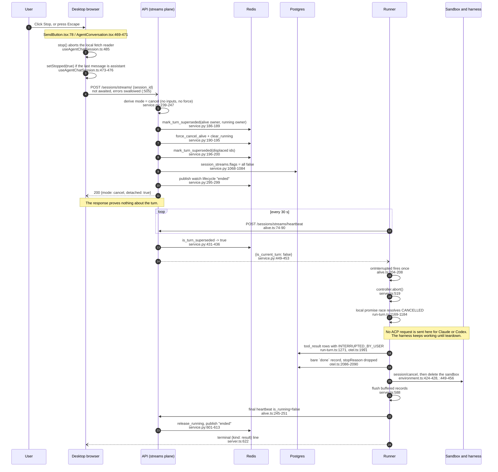
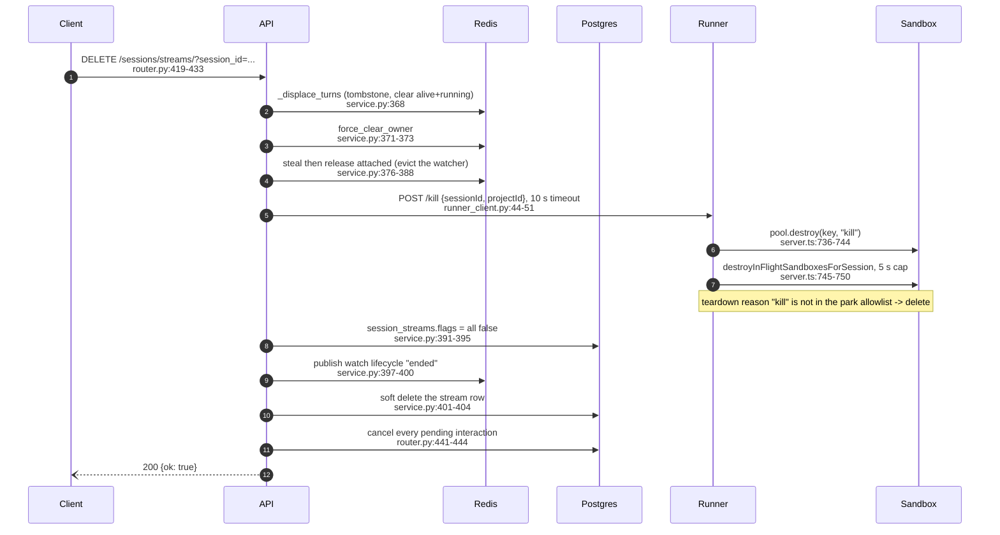

# Spike C: the current Stop implementation map

> AGENT-GENERATED, low weight. This is a code trace, not a design. Every claim is marked
> VERIFIED (a person read the cited line in this worktree) or REPORTED (taken from a document).
> Line numbers are from branch `spike/session-stop-map`.

## Answer first

Eight facts decide the version-one work. All eight are VERIFIED.

1. **Stop destroys the warm sandbox today.** `shouldPark` refuses to park an aborted turn on its
   first line, so teardown runs with reason `aborted`, and `aborted` is not in the park allowlist.
   The next message on that session cold-starts.
   `services/runner/src/engines/sandbox_agent/engine.ts:26`,
   `services/runner/src/engines/sandbox_agent/teardown.ts:59-77`.
2. **Stop reaches the runner only on the next heartbeat, up to 30 seconds later.** There is no
   push. `services/runner/src/sessions/contract.ts:18`,
   `services/runner/src/sessions/alive.ts:23`.
3. **The abort sends no cancel request to the harness for Claude or Codex.** It resolves a local
   promise. Only Pi sends `session/cancel` at cancel time.
   `services/runner/src/engines/sandbox_agent/run-turn.ts:1169-1184`,
   `services/runner/src/engines/sandbox_agent/harness-trace-port.ts:207` and `:59-71`.
4. **A stopped turn is not distinguishable in Postgres from a completed one.** The runner drops
   `stopReason` from the terminal `done` record unless it equals `paused`.
   `services/runner/src/tracing/otel.ts:2086-2090`.
5. **Cancel leaves pending approvals `pending` forever.** Only a kill, a later turn, or a
   non-paused `done` record clears them. No expiry sweep exists.
   `api/oss/src/apis/fastapi/sessions/router.py:441` shows kill was given the cleanup cancel
   was not.
6. **The desktop never learns whether the server accepted the Stop.** The call is not awaited and
   two layers swallow the error.
   `web/oss/src/components/AgentChatSlice/hooks/useAgentChatSession.ts:505`,
   `web/packages/agenta-entities/src/trace/api/client.ts:71-80`.
7. **Mobile Stop on the user's own turn never calls the server.** CONFIRMED. The server-calling
   control renders only when the run is not this device's.
   `web/mobile/src/features/chat/LiveConversation.tsx:381` and `:459`,
   `web/packages/agenta-chat/src/hooks/useAgentConversation.ts:697-704`.
8. **The 30-minute reaper cannot clear a wedged turn.** It filters on `updated_at`, which the
   wedged turn's own heartbeat keeps refreshing.
   `api/oss/src/tasks/asyncio/sessions/orphan_sweep.py:56-71`.

Facts 1 and 2 together mean the current Stop fails the requirement in `requirements.md` that a
normal Stop preserves a warm, resumable harness session.

---

## 1. Normal Stop, browser to harness and back

### What each hop costs

| Hop | Bound today | Evidence |
|---|---|---|
| Browser to API | one HTTP call, not awaited | `useAgentChatSession.ts:505` |
| API mutation | synchronous, a few Redis writes plus one row update | `service.py:288-304` |
| API to runner | up to 30 s, no push exists | `contract.ts:18`, `alive.ts:23` |
| Abort to harness stop | unbounded, nothing is cancelled remotely | `run-turn.ts:1169-1184` |
| Teardown and sandbox delete | unbounded, no timeout on `env.destroy()` | `environment.ts:409-499` |
| Watchdog release | only after the whole turn returns | `server.ts:604-619` |

### The desktop entry points

- The Stop control is the Send button in its streaming state, not a separate control.
  `web/packages/agenta-ui/src/RichChatInput/plugins/SendButton.tsx:53` and `:78`.
- Escape calls the same handler. It is suppressed when an overlay is open or the conversation is
  not the active tab. `web/oss/src/components/AgentChatSlice/AgentConversation.tsx:463`, `:467`,
  `:469-471`.
- `handleStop` is not `async`. It returns early with no user-visible signal when the project scope
  has not resolved. `useAgentChatSession.ts:480`, `:486`.
- An off-by-default flag turns Stop into a hard kill and skips the cooperative cancel entirely.
  `web/oss/src/components/AgentChatSlice/assets/constants.ts:14-15`,
  `useAgentChatSession.ts:488-499`.
- The client cancel body carries no mode and no expected execution id. Repo-wide grep for
  `expected_execution_id` across `web/` returns zero hits.
  `web/packages/agenta-entities/src/session/api/api.ts:575-591`.
- The cancel semantic is implicit in the request shape. No inputs and no `force` means cancel.
  `api/oss/src/core/sessions/streams/service.py:239-247`.

### `force=true` is not a stronger Stop

`force=true` with no inputs selects ATTACH, not a forced cancel.
`service.py:247` and `:306-325`. The only in-repo caller that sets it is the session inspector's
attach call. `web/oss/src/components/SessionInspector/api.ts:108-113`. Any version-one design that
adds a `force` flag to Stop must pick a different field name.

### The close-tab switch

`CLOSE_CANCELS_RUN` is `false`.
`web/oss/src/components/AgentChatSlice/assets/closeSessionCancel.ts:9`. Its predicate also
excludes a session that is awaiting approval. `:28-29`. Its only consumer is the in-app session
tab close button, not any browser lifecycle event.
`web/oss/src/components/AgentChatSlice/AgentChatPanel.tsx:134-142`.

Nothing listens to `beforeunload`, `pagehide`, or `visibilitychange` for Stop, and there is no
`navigator.sendBeacon` call anywhere in the repo. Closing the browser tab therefore sends nothing
to the server, and the run holds its `alive` lock until the TTL lapses.

### Mobile

The claim is CONFIRMED. Mobile has two Stop controls and one branch separates them.

- The composer Stop calls `conversation.stop`, which aborts locally and makes no network call.
  `web/mobile/src/features/chat/LiveConversation.tsx:459`,
  `web/packages/agenta-chat/src/hooks/useAgentConversation.ts:697-704`.
- The server-calling `StopButton` is rendered only when `running && !streamingHere`, that is, only
  when the turn belongs to another client. `web/mobile/src/features/chat/LiveConversation.tsx:381`.
- That button is the better implementation. It awaits the call and shows a failure.
  `web/mobile/src/features/chat/StopButton.tsx:18` and `:43`.
- Mobile has no Escape handler.

---

## 2. The hard kill

The kill is best effort at the runner and authoritative in Redis and Postgres. A missing
`env.runner.internal_url` or a network failure is swallowed, and the Redis and row edit still
succeeds. `api/oss/src/core/sessions/streams/runner_client.py:36-42` and `:60-62`.

Two differences from cancel matter for version one.

- Kill cancels pending interactions. Cancel does not. `router.py:441-444`.
- Kill has a direct API to runner network hop. Cancel has none. That hop is the only existing
  precedent for the control-delivery port the RFC proposes.

---

## 3. Every Redis key

All values are VERIFIED. TTL defaults come from
`api/oss/src/utils/env.py:1416-1468`; the key names come from
`api/oss/src/dbs/redis/sessions/contract.py:53-74`.

| Key | Value | TTL | Written by | Read by | Meaning |
|---|---|---|---|---|---|
| `alive:<project>:session:<sid>` | `turn_id` | 3600 s | `_start_turn` (`service.py:948`), heartbeat acquire and refresh (`service.py:507-518`, `:561-566`); cleared by `force_cancel_alive` (`service.py:190`) and the sweep (`orphan_sweep.py:94-96`) | heartbeat (`service.py:520-524`), `get_session_liveness` | The session is claimed by a runner. It outlives the turn, which is what makes reattach possible. |
| `running:<project>:session:<sid>` | `turn_id` | 3600 s | heartbeat arm and refresh (`service.py:569-588`); cleared by `clear_running` (`service.py:193`), `release_running` (`service.py:601-606`), the sweep (`orphan_sweep.py:97-99`) | heartbeat takeover check (`service.py:525-534`), liveness | A turn is executing right now. |
| `attached:<project>:session:<sid>` | `watcher_id` | 60 s | `steal_attached` (`service.py:308-313`, `:378-383`), `release_attached` (`service.py:335-340`) | liveness, the attach flow | A client is watching the live view. |
| `owner:<project>:session:<sid>` | `replica_id` | 120 s | `claim_owner` (`service.py:458-463`), `force_clear_owner` (`service.py:371`, `orphan_sweep.py:110-112`) | heartbeat (`service.py:444-448`, `:466`) | Replica affinity. It never steals; a claim that loses returns the true owner. |
| `superseded:<project>:session:<sid>:turn:<turn_id>` | `"1"` | 3600 s, refreshed on every read (`locks.py:153`) | `_supersede_turns` (`service.py:151-167`), heartbeat handover (`service.py:554-560`), the sweep (`orphan_sweep.py:102-108`) | `SessionStreamsService.heartbeat` only (`service.py:431-436`) | Tombstone. This turn lost the nest and is dead. **This is the entire Stop signal.** |
| `displaced:<project>:session:<sid>` | pub/sub | none | attach steal | attach watchers | Attach-steal notification. Not used by Stop. |
| `watch:<project>:session:<sid>` | pub/sub | none | `_publish_lifecycle` (`service.py:202-213`), records worker, interactions service | the SSE watch endpoint | Change notification only. `lifecycle` has exactly two states, `running` and `ended`. A cancel and a normal turn end publish the same frame. |

The nest invariant is `alive` contains `running` contains `attached`.
`contract.py:26`.

---

## 4. Every branch that means cancel, kill, steer, or approval interruption

### Cancel

| Branch | Location |
|---|---|
| Mode derivation, no inputs and no force | `api/oss/src/core/sessions/streams/service.py:245` |
| The cancel body | `service.py:288-304` |
| Tombstone and lock clear | `service.py:169-200` |
| Heartbeat refusal of a superseded turn | `service.py:431-453` |
| Runner learns the cancel | `services/runner/src/sessions/alive.ts:105`, `:204-208` |
| Abort call | `services/runner/src/server.ts:519` |
| Local cancel race | `services/runner/src/engines/sandbox_agent/run-turn.ts:1169-1195` |
| Open tool calls settled | `run-turn.ts:1271`, `services/runner/src/tracing/otel.ts:1980-1992` |
| Pi-only `session/cancel` at cancel time | `run-turn.ts:1287`, `services/runner/src/engines/sandbox_agent/harness-trace-port.ts:59-71` |
| Continuity invalidated | `run-turn.ts:1394-1397` |
| Park refused because aborted | `services/runner/src/engines/sandbox_agent/engine.ts:26` |
| Teardown reason chosen | `engine.ts:80`, `server.ts:306`, `services/runner/src/lifecycle/session-coordinator.ts:563` |
| Drop instead of park | `session-coordinator.ts:795-800`, `:851-855` |
| Desktop caller | `web/oss/src/components/AgentChatSlice/hooks/useAgentChatSession.ts:505` |
| Session-tab close caller, gated off | `web/oss/src/components/AgentChatSlice/AgentChatPanel.tsx:138` |
| Mobile running-elsewhere caller | `web/mobile/src/features/chat/StopButton.tsx:18` |

### Kill

| Branch | Location |
|---|---|
| Router | `api/oss/src/apis/fastapi/sessions/router.py:419-445` |
| Service | `api/oss/src/core/sessions/streams/service.py:350-404` |
| API to runner hop | `api/oss/src/core/sessions/streams/runner_client.py:30-62` |
| Runner route | `services/runner/src/server.ts:704-752` |
| Pool destroy and in-flight destroy | `server.ts:736-744`, `:745-750` |
| Interactions cancelled | `router.py:441-444` |
| Frontend kill on Stop, flag off | `useAgentChatSession.ts:488-499` |

### Steer

| Branch | Location |
|---|---|
| Mode derivation, inputs plus force | `service.py:243` |
| Steer body: displace then start a new turn | `service.py:273-286` |
| Runner pool eviction of a busy entry, labelled `supersede-busy` | `services/runner/src/lifecycle/session-coordinator.ts:1325-1326` |
| New turn cancels stale gates | `services/runner/src/server.ts:529-538` |
| API endpoint for that | `router.py:941-963` |

The runner has no steer branch of its own. Every match for `steer` in `services/runner/src` is a
comment about the control plane or an unrelated tool message. Steer is Stop plus a new turn.
There is no steer-lite deny path in the runner. VERIFIED by grep.

Note the `supersede-busy` eviction passes teardown reason `failed-turn`, which is not in the park
allowlist. A steer therefore also deletes the warm sandbox.
`session-coordinator.ts:1326`, `teardown.ts:59-77`.

### Approval interruption

| Branch | Location |
|---|---|
| Approval park ignores Stop by design | `session-coordinator.ts:645-671`, comment at `:667-670` |
| A Stop that wins the race against the pause disqualifies the park | `run-turn.ts:1176-1184`, `session-coordinator.ts:648` |
| Paused tool calls settled with a different sentinel | `run-turn.ts:1249-1252`, `otel.ts:68` |
| Runner pool lookup for a parked approval | `services/runner/src/engines/sandbox_agent/session-pool.ts:117-125` |
| Interaction statuses | `api/oss/src/core/sessions/interactions/dtos.py:16-21` |
| Bulk cancel of pending gates | `api/oss/src/dbs/postgres/sessions/interactions/dao.py:137-172` |
| Orphan-gate reconciliation on a non-paused `done` | `api/oss/src/tasks/asyncio/sessions/records_worker.py:96-148` |

---

## 5. Records and interactions after a Stop

The API writes no record of its own on cancel. VERIFIED by reading the cancel branch and by
grepping every `publish_record` and `append_many` call site in `api/`. The only writers are the
ingest route and the records worker draining runner events.
`api/oss/src/apis/fastapi/sessions/router.py:743-773`,
`api/oss/src/tasks/asyncio/sessions/records_worker.py:238`.

The runner writes three things on the normal Stop path.

1. One `tool_result` record per open tool call, with `isError: true` and the text of
   `INTERRUPTED_BY_USER`. `services/runner/src/tracing/otel.ts:77-78`, `:1991`,
   `run-turn.ts:1271`. If no tool was open, there are none.
2. A bare `done` record. `stopReason` is forwarded only when it equals `paused`, so a cancelled
   turn's terminal record is identical to a completed turn's.
   `otel.ts:2086-2090`.
3. Nothing else. There is no `cancelled` record type, and the `records` table has no status
   column. `api/oss/src/dbs/postgres/sessions/records/dbas.py`.

`session_turns` is never touched by cancel, kill, or the sweep. A cancelled turn keeps
`end_time = NULL` forever, because the ledger `complete` call is skipped for both `paused` and
`cancelled`. `run-turn.ts:1380-1385`,
`api/oss/src/dbs/postgres/sessions/turns/dao.py:72-112`.

Pending interactions stay `pending`. The cancel branch never touches the interactions service,
which is injected but referenced only by the kill handler.
`api/oss/src/apis/fastapi/sessions/router.py:441`. There is no expiry sweep: the seven-day
`PENDING_INTERACTION_TTL` is a read filter only.
`api/oss/src/dbs/postgres/sessions/interactions/dao.py:31`, `:215-217`.

After a refresh the frontend rebuilds the transcript from records alone. It has no cancelled
branch: turn boundaries come only from a `done` record, and only `stopReason: "paused"` is special
cased. `web/packages/agenta-chat/src/assets/transcriptToMessages.ts:567`, `:572-581`. The
`turn_id` the API sends is dropped by the client schema, so the renderer cannot group a cancelled
turn even in principle.
`web/packages/agenta-entities/src/session/core/schema.ts:19-40`.

The "Stopped" tag and its Resend link are local React state and do not survive a refresh.
`useAgentChatSession.ts:111`, `web/oss/src/components/AgentChatSlice/components/AgentTurn.tsx:96-109`.

---

## 6. The approval-pause variants

**Stop while an interaction is pending and the sandbox is parked.** The turn has already returned,
so the watchdog was released at `server.ts:618` and no heartbeat remains to carry
`is_current_turn: false`. The cancel therefore clears Redis and the row but reaches nothing in the
runner. The parked sandbox waits out its approval TTL: 10 minutes locally
(`services/runner/src/engines/sandbox_agent/session-identity.ts:47`) or 2 minutes on Daytona
(`:52`, `:98-99`). The pending interaction row stays `pending`. The only runner-side door in this
state is `POST /kill`.

**Stop during a resumed turn started by the interaction dispatcher.** This is an ordinary turn
with an ordinary watchdog, so the normal path applies. The one difference is that the resumed turn
starts by cancelling stale gates other than its own, `server.ts:529-538`.

**Stop that races the pause.** `run-turn.ts:1176-1184` races the cancel against the pause signal.
If cancel wins, `approvalToPark` returns false at `session-coordinator.ts:648` and the environment
is dropped with reason `aborted`, which deletes it. The approval park branch deliberately ignores
the abort signal, `:667-670`, but only once the pause has already won.

**Steer-lite deny.** Not present in the runner. See section 4.

---

## 7. The failure branches that leave a session stuck

**The turn that never resolves (issue #6418).** There is no timeout around
`await run(...)` at `services/runner/src/server.ts:581`. Everything after it, including
`aliveWatchdog.release()` at `:618`, sits in a `finally` that only runs when the promise settles.
While it is pending the 30-second beat keeps writing `is_running=true` and refreshing a 3600-second
TTL. The awaits that can hang are all on the post-cancel path and none is time-boxed:
`run-turn.ts:1281` (tool relay stop), `:1287` (Pi `session/cancel` into a possibly wedged sandbox),
`:1293`, `:1305`, `:1362`, `:1365`, `:1367`, and the whole of `env.destroy()` at
`environment.ts:409-499`. No code comment references #6418; the only reference in the repo is
`requirements.md:10` and `:31`.

What breaks the loop today: a user Stop, a steer, or a kill. Each tombstones the turn, so the next
beat is refused before it touches a lock (`service.py:431-453`) and the cleared `running` cannot be
re-armed (`service.py:582`). The wedged turn itself is never bounded, and it holds one runner
concurrency slot permanently. `server.ts:774`.

**The heartbeat that keeps `running=true`.** Two separate causes. The wedged turn above, and a
credential failure. The heartbeat fails open on both an HTTP error and a network error, with no
counter and no give-up. `alive.ts:92-95`, `:110-115`. A 401 loop means the runner never learns
`is_current_turn: false`, so Stop becomes a silent no-op while the run continues to completion.

**The 30-minute idle reaper.** It is the orphan sweep, scheduled from the FastAPI lifespan with a
plain `asyncio.create_task` and no leader lock, so every API replica runs it.
`api/entrypoints/routers.py:282-284`. It runs every 60 seconds
(`orphan_sweep.py:42`), in batches of 500 (`:45`), with two thresholds: 300 seconds for rows
flagged running (`:34`) and 1800 seconds for rows alive but not running (`:39`). It clears the row
flags and the Redis keys, and tombstones the displaced turns (`:80-83`, `:94-112`). It does not
cancel interactions, call the runner, or write a record.

The important limitation: the filter is `last_beat = coalesce(updated_at, created_at)`
(`:56-71`), and the wedged turn's own heartbeat keeps bumping `updated_at`. The 300-second branch
therefore catches only a runner that stopped beating, never one that is wedged but alive. The
1800-second branch applies only when `is_running` is false, which is the parked-approval case.

**Supersede-busy eviction.** This is a runner label, not an API concept. When a second turn finds
the pool entry for a session in state `busy`, it logs `evict (supersede-busy)` and calls
`pool.evict(key, "supersede-busy", "failed-turn")`.
`services/runner/src/lifecycle/session-coordinator.ts:1325-1326`. The teardown reason is
`failed-turn`, which deletes the sandbox. Grep confirms no API code and no HTTP status uses this
string. The API's own concurrency rejection is a different thing, `SessionTurnInUse` returning 409.
`api/oss/src/core/sessions/streams/types.py:29-36`.

**One more, not in the brief.** The router calls `check_runner_concurrency_limit` before every
command, including cancel. `router.py:385`, `service.py:933-937`. A project at the limit therefore
cannot Stop anything. The limit defaults to 1000, so this is unlikely today, but a version-one Stop
must not sit behind an admission check.

---

## 8. File-by-file change map for version-one Stop

Version one means a durable command, runner-initiated long polling with heartbeat discovery as
fallback, and a warm park on Stop.

### API, new files

| File | What it holds |
|---|---|
| `api/oss/src/core/sessions/commands/{dtos,interfaces,service}.py` | Command envelope, the `pending / claimed / applied / obsolete` state machine, idempotency by command id. |
| `api/oss/src/dbs/postgres/sessions/commands/{dbas,dbes,dao}.py` | The durable command table, plus a claim lease column. Mirror the shape of `sessions/interactions`, which already has a guarded compare-and-set transition at `dao.py:92-135`. |
| One Alembic migration | The commands table. |
| `api/oss/src/core/sessions/control/port.py` | `deliver`, `acknowledge`, `recover`. The long-poll adapter is the only implementation in version one. |

### API, changed files

| File and lines | Change | What stays |
|---|---|---|
| `core/sessions/streams/service.py:288-304` | The cancel branch creates a durable command and marks the execution `stopping`. It stops calling `_displace_turns` and `_mark_stream_ended` inline. Those move to settlement. | The mode derivation at `:239-247`, and the whole send, steer, and attach shape. |
| `core/sessions/streams/service.py:169-200` | Becomes the settlement step, called when the runner acknowledges a terminal outcome or a watchdog declares the execution lost. | The tombstone-before-clear-then-tombstone-again order, and its docstring. That order is correct and must not be simplified. |
| `core/sessions/streams/service.py:406-726` | The heartbeat response gains a pending-command list. | The superseded refusal at `:431-453`. It remains the reason a zombie beat cannot steal a parked session. |
| `core/sessions/streams/dtos.py` | `SessionHeartbeatResult` gains `commands`. A new command DTO set. | `is_current_turn`. Keep it as the compatibility path while runners roll. |
| `apis/fastapi/sessions/router.py:369-391` | Add a private long-poll route for the runner. Move `check_runner_concurrency_limit` (`:385`) so it does not gate cancel. | The permission checks and the exception mapping. |
| `apis/fastapi/sessions/models.py` | Request and response models for the command routes. | Everything else. |
| `tasks/asyncio/sessions/orphan_sweep.py:34-71` | Add a settlement deadline for executions stuck in `stopping`. Consider a claim-age filter that does not depend on `updated_at`, since a wedged turn keeps that column fresh. | The 60-second cadence and the batch size. |

### Runner, new files

| File | What it holds |
|---|---|
| `services/runner/src/sessions/control-poll.ts` | The long-poll claim loop, deduplication by command id, acknowledgement, and reconnect. |
| `services/runner/src/sessions/command-registry.ts` | A map from turn id to its `AbortController` and its cooperative-stop entry point, so a delivered command can find the live turn. |

### Runner, changed files

| File and lines | Change | What stays |
|---|---|---|
| `sessions/alive.ts:96-116`, `:199-209` | Parse a pending-command list from the beat and dispatch it. Add a consecutive-failure counter so a dead credential surfaces instead of failing open silently. | The 30-second cadence, the awaited first beat, the final `is_running=false` beat at `:245-251`. |
| `server.ts:515-524` | Register the controller in the command registry under the turn id. | The existing `onInterrupted` wiring, as the fallback path. |
| `server.ts:580-624` | Wrap `await run(...)` in a settlement deadline, or move the watchdog release out of the turn's `finally` so a wedged turn cannot hold `running=true`. This is the #6418 fix. | `flushPersist` at `:588` and the terminal record at `:622`. |
| `engines/sandbox_agent/teardown.ts:30-77` | Add a `user-stop` reason and put it in the park allowlist at `:59-67`. Leave `aborted` meaning a hard abort or a vanished client. | `PARK_CLEAN_RESUMABLE_TURNS` and the disposition table shape. |
| `engines/sandbox_agent/engine.ts:21-30` | `shouldPark` must distinguish a cooperative Stop from a hard abort. The `signal?.aborted` check at `:26` is what makes Stop cold today. | The `clientGone`, `!result.ok`, and `paused` clauses. |
| `lifecycle/session-coordinator.ts:645-671`, `:795-800`, `:851-855` | Add the stop-parks branch alongside `approvalToPark`. | The approval park's deliberate refusal to consult the abort signal, `:667-670`. |
| `engines/sandbox_agent/run-turn.ts:1160-1200`, `:1264-1300` | Send the harness cancel at cancel time for every harness, not only Pi, if work package A confirms it preserves the native session. Fix the wrong comment at `:1165`. Time-box `:1281`, `:1287`, `:1293`, `:1305`. | The `Promise.race` shape and the `INTERRUPTED_BY_USER` settlement at `:1271`. |
| `engines/sandbox_agent/harness-trace-port.ts:43`, `:59-71`, `:207` | Give `runnerTracePort` a real `cancelBeforeDrain` instead of a no-op, or replace the port with a harness-cancel call in the engine. | The port shape. |
| `tracing/otel.ts:2061-2091` | Forward `stopReason` for `cancelled` as well as `paused`. This is one line and it is what makes a Stop visible in the durable log. | Everything else in `finish`. |
| `engines/sandbox_agent/environment.ts:409-499` | Time-box `env.destroy()`. It currently runs unbounded inside the turn. | The six-step order and the idempotence guard at `:410-411`. |

### Frontend, changed files

| File and lines | Change | What stays |
|---|---|---|
| `web/oss/.../hooks/useAgentChatSession.ts:480-506` | Await the cancel, distinguish accepted from failed, and show a failure. Follow the execution state instead of assuming success. Remove the silent early return at `:486`. | The local `stop()` at `:485` and the `stopped` flag at `:473-476`. |
| `web/packages/agenta-entities/src/session/api/api.ts:575-591` | Add an optional expected turn id, and a distinct field name for a forced stop. Do not reuse `force`, which already means attach. | `commandSessionStream` as the single client entry point. |
| `web/packages/agenta-entities/src/trace/api/client.ts:71-80` | `callFern` returning `null` on every failure hides a failed Stop. Give the cancel path a caller that sees the error. | The abort rethrow at `:76`. |
| `web/packages/agenta-chat/src/hooks/useAgentConversation.ts:697-704` | Add the server cancel for mobile's own turn. This is the single largest mobile gap. | The local abort and the `stopped` flag. |
| `web/oss/.../assets/closeSessionCancel.ts:9` | Flip `CLOSE_CANCELS_RUN` to true once Stop is durable, and decide whether an approval-parked session should also cancel on close. | The predicate shape and its test. |
| `web/packages/agenta-chat/src/assets/transcriptToMessages.ts:560-590` | Add a cancelled branch reading the newly forwarded `stopReason`, so a stopped turn survives a refresh. | The `done`-closes-the-draft rule and the paused special case at `:572-581`. |
| `web/packages/agenta-entities/src/session/core/schema.ts:19-40` | Keep `turn_id` in the parsed record so the renderer can group by turn. | The transform shape. |

### What does not change in version one

Redis ownership stays as it is: `alive`, `running`, `attached`, `owner`, and `superseded` keep
their current names, TTLs, and writers. The heartbeat keeps its 30-second cadence and its
`is_current_turn` field. The invoke send path is untouched. The watch relay keeps publishing
change notifications rather than replayable events.

---

## 9. Claims in the RFC that the code contradicts

| RFC claim | What the code says |
|---|---|
| "Stop the current execution, but only if it is still the execution the caller observed." The RFC treats `expected_execution_id` as optional but available today in some form. | No client sends any execution or turn identifier on cancel. Repo-wide grep across `web/` for `expected_execution_id` and `expectedExecutionId` returns zero hits. The cancel body is `{session_id}` only. `api.ts:586-591`. The field is entirely new work. |
| "Hard kill: `DELETE /sessions/streams/?session_id=...`; destroys the sandbox." Implied contrast with Stop. | Stop destroys the sandbox too. `engine.ts:26` refuses the park and `teardown.ts:59-77` deletes. Steer also destroys it, through `supersede-busy` with reason `failed-turn`, `session-coordinator.ts:1326`. The current difference between kill and Stop is not sandbox survival; it is that kill also soft-deletes the row and cancels pending gates. |
| "Attach: `force=true` without inputs records watcher state but does not provide live output." | Accurate, and worth stating more sharply. `force=true` is the attach selector, `service.py:247`. Any Stop design that adds a force flag must not reuse this field name. |
| "The runner releases owner-checked `running` and `alive` keys only after cancellation settles." Stated as a version-one property. | Today the API clears both keys immediately, before the runner has heard anything. `service.py:190-195`. Keeping them held is a change to the cancel branch, not a preserved behaviour. |
| "A heartbeat remains useful for renewing ownership and detecting a crashed runner." | It detects a crashed runner only. It cannot detect a wedged one, because the wedged turn keeps beating and the sweep filters on `updated_at`. `orphan_sweep.py:56-71`. A settlement deadline that does not depend on beat freshness is required. |
| "Normal Stop preserves the session workspace and leaves the harness session warm and resumable" (`requirements.md`). Written as a requirement, but the surrounding text reads as if it were close to true. | It is false in every path today. Stop deletes. Steer deletes. A client disconnect deletes without parking, `server.ts:458-467`. Only a clean turn end, an idle expiry, a capacity eviction, or an approval park survive. `teardown.ts:59-67`. |
| "The turn hangs forever. `runTurn` never resolves, the alive watchdog keeps heartbeating `running=true`" (#6418, quoted in `requirements.md:31`). | Confirmed by static reading, and the mechanism is precise: no timeout at `server.ts:581`, and the release at `:618` sits in the turn's own `finally`. Not verified as an observed failure in this spike. |
| The RFC discusses Stop as a browser-and-API problem. | Mobile Stop on the user's own turn never reaches the API at all, `LiveConversation.tsx:381`. Closing a browser tab sends nothing, and `CLOSE_CANCELS_RUN` is off, `closeSessionCancel.ts:9`. Two of the four ways a person stops work today never produce a Stop request. |
| The RFC assumes a stopped execution is observable. | A cancelled turn's durable record is byte-identical to a completed one, `otel.ts:2086-2090`, its `session_turns.end_time` stays NULL, and the watch relay publishes the same `ended` frame for both. Nothing downstream can tell them apart. |

One RFC claim the code confirms and which is easy to doubt: "Normal desktop Send does not use this
endpoint." Correct. Desktop Send goes through the chat transport's negotiating fetch to the invoke
path, `web/packages/agenta-chat/src/transport/AgentChatTransport.ts:213-217`, while Stop goes to
`/sessions/streams/`. Send and Stop travel different planes today.

---

## Open questions for Mahmoud

1. **Should a user Stop park the sandbox, or is the current delete acceptable for version one?**
   Recommendation: park. `requirements.md` already asks for a warm resumable session after Stop,
   and the change is a new teardown reason plus one clause in `shouldPark`. Reason: without it,
   version one delivers Stop faster but still costs the user a cold restart, which is the part they
   notice.
2. **Should Stop also cancel pending approvals, the way kill does?** Recommendation: yes, cancel
   the gates for the stopped turn only, reusing `cancel_session_pending` with `only_turn_id`.
   Reason: today a stopped turn's gate stays `pending` with nobody able to answer it, and the row
   is only cleared by luck.
3. **Should the runner send the harness cancel for every harness at cancel time, not only Pi?**
   Recommendation: decide after work package A reports whether `destroySession` preserves the
   native harness session. Reason: it is the difference between a Stop that actually stops the
   model and one that only stops listening.
4. **Should mobile's own-turn Stop call the server in version one, or wait for the re-plumb?**
   Recommendation: do it now, in the shared hook. Reason: it is a few lines, and until it lands
   every mobile Stop leaves a run going on the server.
5. **Is a settlement deadline that ignores heartbeat freshness in scope for version one?**
   Recommendation: yes, a narrow one for executions in `stopping`. Reason: it is the only thing
   that closes #6418, and the existing sweep provably cannot, because a wedged turn keeps its own
   `updated_at` fresh.
