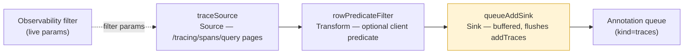

# Batch-add Traces to Annotation Queues via ETL

**Created:** 2026-05-21
**Status:** RFC — Reviewed (eng review complete), ready to implement
**Related:** [etl-engine](./etl-engine.md), [eval-etl-engine](./eval-etl-engine.md), [eval-filtering](./eval-filtering.md)
**Authors:** Arda

---

## Summary

A second consumer of the [ETL loop engine](./etl-engine.md): adding a large,
filter-selected set of traces from the observability page into an annotation
queue — without the user scrolling and checkbox-selecting page by page.

Batch-add of *checkbox-selected* traces already works today. The gap — and the
friction the team flagged ("lowers a bit of friction of scrolling") — is **"add
everything matching the current filter."** Today that means scrolling the
virtual table and ticking rows across N pages.

**Shape (post-review):** a single-phase, frontend-only feature. Reuses the
existing `POST /simple/queues/{id}/traces/` endpoint — no API changes. See
[Resolved decisions](#resolved-decisions-eng-review) for the locked choices and
the alternatives that were considered and rejected.

---

## Background — the friction

The team's framing: *"Batch adding from traces to annotation queues — it lowers
a bit of friction of scrolling but does not change the workflow by a lot."*
LOW priority. The remaining friction is narrow: to put ~800 filter-matching
traces into a queue, a user scrolls the virtual table and checkboxes rows page
by page. There is no "select all matching the filter."

---

## Current state

### Observability page

- **Table:** `ObservabilityTable`
  (`web/oss/src/components/pages/observability/components/ObservabilityTable/index.tsx`)
  mounts `InfiniteVirtualTableFeatureShell`.
- **Data:** `tracesQueryAtom`
  (`web/oss/src/state/newObservability/atoms/queries.ts:38`) — a Jotai
  `atomWithInfiniteQuery`, cursor-paginated by timestamp, hitting
  `POST /tracing/spans/query`.
- **Selection:** multi-select checkbox column → `selectedRowKeysAtom`.
- **Add-to-queue (exists, already batch):** select traces →
  `AddActionsDropdown` → `AddToQueuePopover` →
  `simpleQueueMolecule.actions.addTraces(queueId, ids[])`.

### Annotation queues

- A queue is an `EvaluationRun` with `flags.is_queue = true`; each queued trace
  becomes an `evaluation_scenarios` row.
- **`POST /simple/queues/{id}/traces/`** takes `{trace_ids: List[str]}` →
  `add_traces` → `evaluate_batch_traces` → a Taskiq background job. Only direct
  `kind = traces` queues accept ad-hoc adds.

---

## Architecture

Single-phase, frontend-only. The same `Source → Transform → Sink` shape as
eval-scenarios filtering, with a trace Source and a write Sink:



### `traceSource`

An ETL `Source` (`AsyncIterable<Chunk>`) that paginates `POST /tracing/spans/query`
cursor-by-cursor — mirrors the headless PoC's `realScenarioSource`. It does
**not** depend on a paginated store (see rejected option C in
[Resolved decisions](#resolved-decisions-eng-review)).

**Filter parity (review refinement):** the Source must scan the *exact* set the
observability table shows. It drives the endpoint itself, but reads the **live
filter params** from the observability state (`tracesQueryAtom`'s params) rather
than reconstructing them — self-contained pagination, shared filter params, no
drift.

**Scan page size:** large (~200-500). The scan is ID-only — the cheapest ETL
run, zero hydration slices — so a 10k-trace filter is ~20-50 requests, not 200.

### `queueAddSink` — buffered streaming write sink (D3)

`Sink.load(chunk)` buffers trace IDs and flushes `addTraces` at a **tunable
batch size (~250), decoupled from the Source page size**. `finalize()` flushes
the remainder. For 2000 traces that is ~8 background jobs, not ~40.

- Bounded payload, low job count, live per-flush progress, clean cancellation.
- A failed `addTraces` flush must **surface** (not silently drop) — partial
  state is a known multiple of the flush size.

### Dedup (D4)

Before building, **verify** whether `evaluate_batch_traces` / scenario creation
already dedups by `trace_id`. If it does, v1 is free. If it does not, add a
client-side exclude: fetch the queue's existing scenario `trace_id`s and filter
them out before the run. The exclude-fetch must itself be **bounded/paginated**
if the queue is large.

### UI affordance (design review)

**Entry point — two scope-labelled actions** in the observability action area:

- *"Add N selected to queue"* — the existing selection-scoped add (enabled only
  when rows are checked).
- *"Add all matching filter to queue"* — the new filter-scoped add.

Each label states its scope. No single ambiguous "Add to queue" — a user with
both a selection and a filter active always knows which one fires.

**No-filter guard:** with no filter active, "Add all matching filter to queue"
opens a confirm — *"This will queue every trace in the project. Continue?"* —
before running. With a filter active it goes straight to the queue picker.

**Queue picker:** reuse the existing `AddToQueuePopover`
(`web/packages/agenta-annotation-ui/`) — pick a `kind = traces` queue.

**Progress:** a non-blocking antd `notification` on run — a live counter and a
Cancel button. The user keeps working while the scan runs. Navigating away from
observability aborts the run (messaged as a partial add).

**Honest copy:** `evaluate_batch_traces` is fire-and-forget — `progress`
reflects *IDs submitted*, not scenarios materialized. Say **"queued"**, never
"added" / "done".

#### Interaction states

| State | What the user sees |
|-------|--------------------|
| Idle, no filter | "Add all matching filter to queue" enabled → click opens the no-filter confirm |
| Idle, filter active | Action enabled → click opens the queue picker |
| Queue picker | Existing `AddToQueuePopover` — pick a `kind = traces` queue |
| Running | Non-blocking notification: *"Queued N traces…"* + Cancel |
| Done | Notification updates: *"Queued N traces to {queue}. They'll appear as the queue processes."* + a "View queue" link |
| Cancelled (partial) | *"Cancelled — N traces queued to {queue} before you stopped."* |
| No match | *"No traces match this filter — nothing queued."* |
| Error (partial) | *"Queued N traces; M failed to queue."* + a Retry action — surfaced, never silent |

The entry-point label carries **no count** — the observability query exposes no
reliable dataset total (see eng review). The count appears once the run starts,
via the live notification counter.

`runLoop` yields `Progress` per flush; `AbortSignal` powers cancel.

---

## Resolved decisions (eng review)

| # | Decision |
|---|----------|
| **D6** | **Single-phase, frontend ETL.** `traceSource` drives `/tracing/spans/query` directly. **No observability migration.** |
| **D3** | `queueAddSink` is a buffered streaming sink — flushes `addTraces` at a tunable batch (~250), decoupled from Source page size. |
| **D4** | Verify backend (`evaluate_batch_traces`) idempotency; if absent, client-side exclude already-queued `trace_id`s. |

**Considered and rejected:**

- **D1 option C / D2 — migrate observability to a paginated store first
  (big-bang), then adapt it as the Source.** Rejected: the outside-voice review
  confirmed the ETL `Source` is just `AsyncIterable<Chunk>` and never needed a
  paginated store — `realScenarioSource` already paginates an API directly. The
  migration was a *false prerequisite*; bundling a big-bang rewrite of a core
  page into a LOW-priority feature is disproportionate risk.

---

## Edge cases & constraints

- **Queue kind:** only `kind = traces` direct queues accept ad-hoc adds.
- **Cancellation:** abortable mid-run via `AbortSignal`; leaves a partial add
  (a known multiple of the flush size) — the UI must message this clearly.
- **Partial failure:** an `addTraces` flush failing mid-run leaves the queue
  partially filled; surface it, never fail silently.
- **Dedup race:** a trace added by someone else between the D4 exclude-fetch
  and the run can still duplicate — acceptable for v1, note it.
- **Filter drift:** mitigated by reading live observability filter params (see
  `traceSource`).

---

## Test requirements

Single-phase — no migration, so no regression suite. All new-code paths:

```
traceSource
  ├── [GAP] scans all pages, stops cleanly at cursor end
  ├── [GAP] AbortSignal cancellation mid-scan
  └── [GAP] reads live observability filter params (parity with the table)
queueAddSink
  ├── [GAP] buffers IDs, flushes addTraces at the threshold
  ├── [GAP] finalize() flushes the remainder
  └── [GAP] addTraces failure surfaces (no silent drop)
predicate transform
  └── [GAP] rowPredicateFilter drops non-matching traces
dedup exclude (D4, if backend not idempotent)
  └── [GAP] already-queued trace_ids excluded before the run
UI affordance
  ├── [GAP] run → Progress counter ticks; cancel → loop aborts
  └── [GAP] [→E2E] apply filter → add all matching → traces land in queue
```

Unit tests for `traceSource` / `queueAddSink` / predicate / dedup; one E2E for
the full filter → add → queued flow. Every path above is a plan requirement —
implementation lands tests alongside the code.

---

## NOT in scope

- **Observability paginated-store migration** — considered (D1-C/D2), rejected
  as a false prerequisite.
- **Backend `POST /simple/queues/{id}/traces/query` filter-add endpoint** — the
  cleaner long-term layer (server already does filter→scenarios at queue
  creation via `data.queries`); D6 chose frontend-only. Documented here as the
  alternative if the wasted client round-trip becomes a problem at scale.
- **Source-backed queues** (`kind != traces`) — only direct trace queues.
- **Creating a queue on the fly** — target existing queues; pick from a list.

---

## Implementation tasks

- [ ] **T1 — `traceSource`** — ETL Source paginating `/tracing/spans/query`, reading live observability filter params; large scan page size. Verify: unit tests (pagination, cancel, filter parity).
- [ ] **T2 — `queueAddSink`** — buffered write sink, tunable flush (~250), `finalize()` flush, failure surfacing. Verify: unit tests (buffer/flush/finalize/failure).
- [ ] **T3 — D4 dedup** — verify `evaluate_batch_traces` idempotency; add bounded client-side exclude only if needed. Verify: unit test for the exclude.
- [ ] **T4 — UI affordance** — two scope-labelled entry-point actions; no-filter confirm dialog; reuse `AddToQueuePopover` for the picker; non-blocking notification with live counter + cancel; all interaction states + copy per the UI spec. Verify: component test + E2E.
- [ ] **T5 — E2E** — apply filter → add all matching → traces appear in the queue.

Priority: LOW (per the team). Effort: small — one Source, one Sink, one UI
affordance on the proven engine.

## GSTACK REVIEW REPORT

| Review | Trigger | Why | Runs | Status | Findings |
|--------|---------|-----|------|--------|----------|
| CEO Review | `/plan-ceo-review` | Scope & strategy | 0 | — | — |
| Codex Review | `/codex review` | Independent 2nd opinion | 0 | — | — |
| Eng Review | `/plan-eng-review` | Architecture & tests (required) | 1 | clean | 6 decisions resolved, 0 critical gaps |
| Design Review | `/plan-design-review` | UI/UX gaps | 1 | clean | 3/10 → 9/10, 3 decisions (entry point, progress, no-filter guard) |
| DX Review | `/plan-devex-review` | Developer experience gaps | 0 | — | — |

- **OUTSIDE VOICE:** Claude subagent (Codex unavailable). Challenged the plan's shape — exposed that the observability migration (D1-C/D2) was a false prerequisite and that a backend filter-query endpoint is the cleaner layer. Drove the D6 re-decision to single-phase frontend ETL; the backend endpoint is recorded in NOT-in-scope as the alternative.
- **CROSS-MODEL:** Outside voice and eng review converged after D6 — the locked plan dropped Phase 0.
- **DESIGN:** Focused review of the batch-add UI — entry point disambiguated (two scope-labelled actions), progress treatment locked (non-blocking notification), no-filter footgun guarded (confirm dialog), full interaction-state table added.
- **UNRESOLVED:** 0
- **VERDICT:** ENG + DESIGN REVIEW CLEARED — ready to implement.
