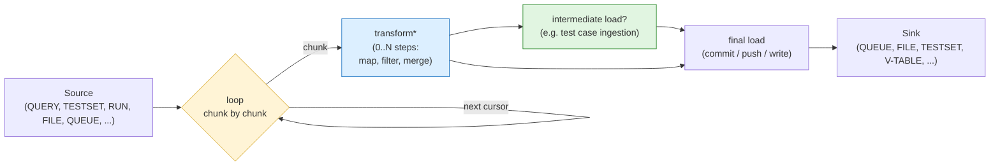
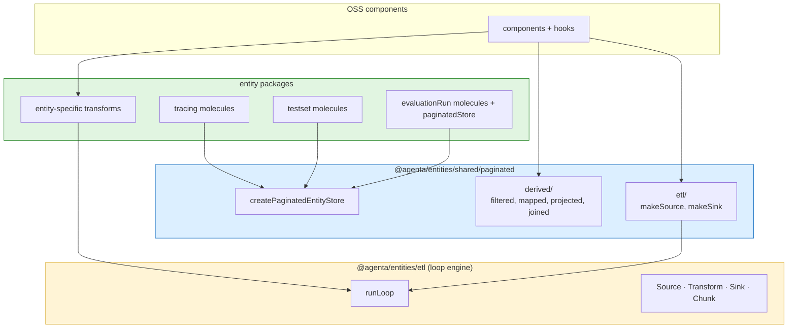
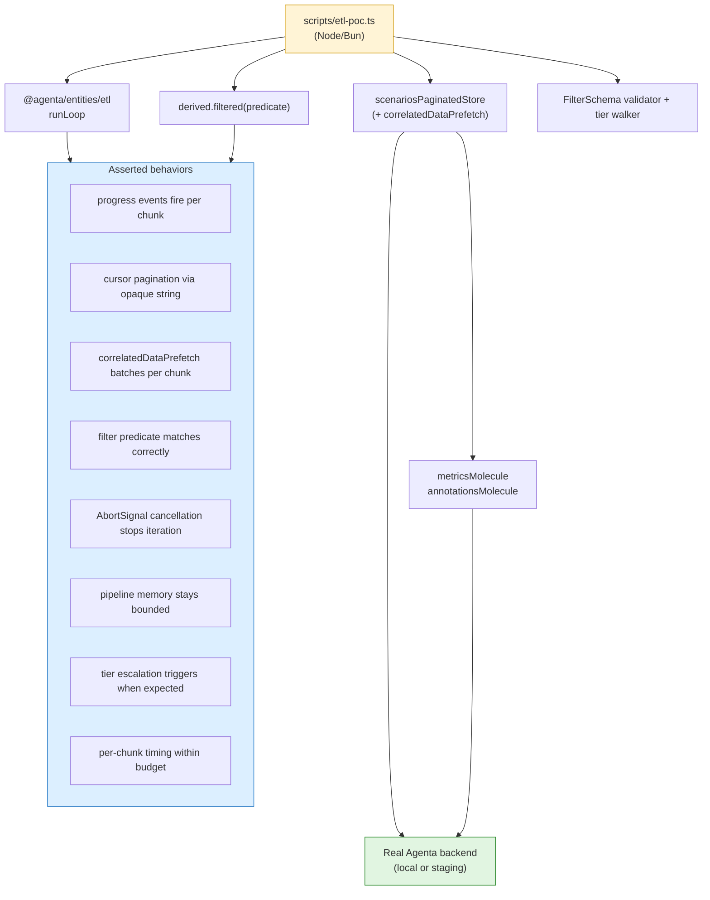

# ETL Loop Engine (general)

**Created:** 2026-05-17
**Status:** RFC — Starting point, meant to be iterated on
**Related:** [eval-etl-engine](./eval-etl-engine.md) (eval's specific use of this engine), [eval-filtering](./eval-filtering.md), [eval-package-architecture](./eval-package-architecture.md), [loadables](./loadables/), [eval-loops](./eval-loops/) (unrelated — workflow execution, different layer)
**Authors:** Arda

---

## Summary

A small, general-purpose chunked iteration engine for moving data through pipelines: **Source → Transform[] → Sink**, looped chunk by chunk, with memory bounds, cancellation, progress, and backpressure as first-class properties of the loop itself.

The engine has **zero entity coupling**. It knows nothing about evaluations, testsets, traces, or any other domain. It defines four contracts and one runtime; everything else is provided by per-entity adapters (see [eval-etl-engine.md](./eval-etl-engine.md) for the canonical example of how an entity package adopts the engine).

This RFC defines the engine. It is deliberately under-specified — no DSL, no Filter/Map/Reduce vocabulary, no optimizer — because the right shape for those will emerge from real consumers. The loop is ~50 lines of TypeScript; the contracts are ~50 more.

**Naming.** "Loop" means the iteration loop over chunks. The unit of iteration is the chunk, because chunks are how memory pressure is bounded. Not [`eval-loops`](./eval-loops/) (workflow execution, different layer).

---

## The pattern

Every data-movement flow in the codebase reduces to the same three-piece shape, looped:



Yellow box is the engine — it's the same loop for every flow. Blue is what each pipeline varies (its transforms). Green is the memory-pressure optimization (intermediate load = ingest IDs early so the chunk is the only thing in memory, never the whole accumulated dataset).

Flows differ only in:

- **Which source** (query / testset / run / file / queue / span)
- **Whether transform is present** (some flows have none; some have many)
- **Whether an intermediate load is present** (e.g. when populating a downstream entity)
- **Which sink** (queue / file / testset / v-table / paginated store)

---

## What the loop guarantees (and what it doesn't)

Five properties hold for the loop runtime. **They do not extend to cumulative session state** — that's a separate concern handled by whatever layer the engine feeds into (e.g. a paginated store, accumulating sink, etc.).

### What the loop itself guarantees

1. **Pipeline memory bounded by chunk size.** The loop never holds more than one chunk in flight in its own local state. The full dataset is never materialized inside the loop. A 50k-row iteration uses 250 chunks of 200 each, not one 50k array. **Important caveat:** this bound covers the loop's local variables only. The data the loop writes (into a paginated store, into a viewport atom, into an accumulator sink) is the caller's memory to manage.
2. **Progress is observable.** The loop yields `{ scanned, matched, loaded, cursor }` after every chunk. The UI reads progress without polling.
3. **Backpressure is natural** *for write sinks*. `await sink.load(chunk)` means the loop pauses on a slow sink. No buffering, no queueing. For UI sinks (synchronous atom writes), backpressure is meaningless — the consumer breaking out of `for await` is what controls flow.
4. **Cancellation through the loop body.** An `AbortSignal` passed to the loop reaches the source's iterator and is checked between chunks. `finally` runs `sink.finalize()` for cleanup.
5. **Idempotent resume is possible** (not implemented in v1). Cursor + AbortSignal + a deterministic sink = a pipeline that can be killed and restarted from the last cursor.

### What this doesn't bound

| Concern | Not bounded by | Bounded by what instead |
|---|---|---|
| Cumulative loaded rows downstream | the loop | the downstream layer's eviction policy (e.g. paginated store eviction) |
| In-flight HTTP requests after cancellation | the loop's `AbortSignal` check | only if `AbortSignal` is plumbed through `fetchPage` → axios at the API layer |
| Background tab CPU/battery | the loop | a visibility wrapper around `AbortSignal` (see Open Question 9) |
| Sink accumulator state | the loop | the sink's own design — it can drop old IDs, paginate the commit, etc. |

**Cancellation is partially honored in v1**: the loop body exits immediately on abort, but any HTTP request in flight at the moment of cancellation completes anyway and updates downstream atoms. Plumbing `AbortSignal` through the API layer is a separate fix that lives in consumer packages, not the engine.

---

## The contracts

Four shapes. Plain TypeScript, no DSL.

```ts
// A lazy producer of chunks. Pull-based, AbortSignal-aware.
export interface Source<T, Params = unknown> {
  extract(params: Params, signal: AbortSignal): AsyncIterable<Chunk<T>>
}

// A chunk carries its items plus enough metadata for the loop to advance.
export interface Chunk<T> {
  items: T[]
  cursor: Cursor | null  // null = end of stream
  meta?: ChunkMeta       // page index, source hint, etc — opaque to the loop
}

// A transform is a pure function from one chunk to another.
// Compose by array — each runs in order. Short-circuit on empty.
export type Transform<In, Out> = (chunk: Chunk<In>) => Chunk<Out> | Promise<Chunk<Out>>

// A multi-source transform reads from two chunks simultaneously (for joins).
export type MultiSourceTransform<A, B, Out> = (
  chunkA: Chunk<A>,
  chunkB: Chunk<B>,
  state: JoinState,
) => Chunk<Out>

// A sink consumes chunks. Optional finalize() for commit-style sinks.
export interface Sink<T> {
  load(chunk: Chunk<T>): Promise<LoadResult>
  finalize?(): Promise<void>
}

// Result types
export type Cursor = string | number | object | null
export interface ChunkMeta { page?: number; hint?: string; [k: string]: unknown }
export interface LoadResult { loadedCount?: number; warnings?: string[] }
export interface Progress { scanned: number; matched: number; loaded: number; cursor: Cursor | null }
export interface LoopResult extends Progress { done: boolean }
export interface JoinState { /* hash map of one side's rows keyed by joinKey */ }
```

That's the entire spec. Six interfaces + a type, no implementations yet.

---

## The loop

The engine is one function:

```ts
export async function* runLoop<TIn, TOut>(
  source: Source<TIn>,
  transforms: Transform<any, any>[],
  sink: Sink<TOut>,
  params: Parameters<Source<TIn>["extract"]>[0],
  signal?: AbortSignal,
): AsyncGenerator<Progress, LoopResult> {
  const abort = signal ?? new AbortController().signal
  let scanned = 0
  let matched = 0
  let loaded = 0
  let lastCursor: Cursor | null = null

  try {
    for await (const chunk of source.extract(params, abort)) {
      if (abort.aborted) break

      scanned += chunk.items.length
      lastCursor = chunk.cursor

      // Run transforms in order. Short-circuit on empty.
      let current: Chunk<any> = chunk
      for (const tx of transforms) {
        current = await tx(current)
        if (current.items.length === 0) break
      }

      matched += current.items.length

      if (current.items.length > 0) {
        const result = await sink.load(current as Chunk<TOut>)
        loaded += result.loadedCount ?? current.items.length
      }

      yield { scanned, matched, loaded, cursor: lastCursor }

      if (chunk.cursor === null) break  // source exhausted
    }
  } finally {
    await sink.finalize?.()
  }

  return { scanned, matched, loaded, cursor: lastCursor, done: true }
}
```

~40 lines. All five guarantees from the previous section fall out of this code:

- **Memory bounded:** only `current` is held; previous chunks are released.
- **Cancellation:** `abort.aborted` checked per iteration; passed into `source.extract`.
- **Progress:** `yield` after every chunk.
- **Backpressure:** `await sink.load` blocks the loop.
- **Cleanup:** `finally` runs `sink.finalize?()` even on cancellation or error.

This is the entire engine. Everything else is per-pipeline Source/Transform/Sink implementations provided by entity packages.

---

## Worked example: Streaming export to file

The simplest end-to-end pipeline that exercises all five guarantees.

```ts
// Source — any paginated entity stream
const traceSource: Source<Trace, { queryId: string }> = {
  async *extract({ queryId }, signal) {
    let cursor: Cursor = null
    while (!signal.aborted) {
      const { items, next } = await queryTraces({ queryId, cursor })
      yield { items, cursor: next }
      if (!next) return
      cursor = next
    }
  },
}

// Transform — project each item to a JSON-line shape
const traceToJsonLine: Transform<Trace, string> = (chunk) => ({
  ...chunk,
  items: chunk.items.map((t) => JSON.stringify(projectForExport(t)) + "\n"),
})

// Sink — write to a streaming file handle
const makeFileSink = (writer: WritableStreamDefaultWriter): Sink<string> => ({
  async load(chunk) {
    for (const line of chunk.items) await writer.write(line)
    return { loadedCount: chunk.items.length }
  },
  async finalize() {
    await writer.close()
  },
})

// Run
const stream = createDownloadStream("export.jsonl")
const writer = stream.writable.getWriter()
for await (const progress of runLoop(traceSource, [traceToJsonLine], makeFileSink(writer), { queryId })) {
  updateProgressUI(progress)
}
```

Memory stays at one chunk of lines. Cancellation closes the writer. The browser handles the actual download via the WHATWG stream. No accumulator anywhere — the only state outside the chunk is the file handle itself.

---

## Worked example: Cross-entity pipeline (query → testset)

JP's canonical full pipeline: read from a query, transform, ingest test cases per chunk, commit a testset revision at the end.

```ts
// Transform — project trace shape to test case shape via column mapping
const traceToTestcase = (mapping: ColumnMapping): Transform<Trace, TestcasePayload> =>
  (chunk) => ({
    ...chunk,
    items: chunk.items.map((trace) => applyMapping(trace, mapping)),
  })

// Sink — ingest per chunk, accumulate IDs, commit on finalize
const makeTestsetSink = (testsetId: string): Sink<TestcasePayload> => {
  const testcaseIds: string[] = []
  return {
    async load(chunk) {
      const ids = await ingestTestcases({ testsetId, items: chunk.items })
      testcaseIds.push(...ids)
      return { loadedCount: ids.length }
    },
    async finalize() {
      await commitTestsetRevision({ testsetId, testcaseIds })
    },
  }
}

// Run
for await (const progress of runLoop(traceSource, [traceToTestcase(mapping)], makeTestsetSink(testsetId), params)) {
  setIngestProgress(progress)
}
```

The accumulator in the sink (`testcaseIds: string[]`) is bounded — IDs only, never full records. JP's "intermediate load" optimization realized: each chunk's records are ingested and dropped; only the IDs survive.

---

## Worked example: Multi-source join

Two sources joined on a key. Uses `MultiSourceTransform` and a join state object.

```ts
const compareJoinTransform: MultiSourceTransform<Scenario, Scenario, JoinedScenario> = (
  chunkA, chunkB, state
) => {
  // state.hashMap: Map<joinKey, Scenario> — accumulator across chunk boundaries
  for (const b of chunkB.items) {
    state.hashMap.set(b.testcaseId, b)
  }
  const joined: JoinedScenario[] = []
  for (const a of chunkA.items) {
    const b = state.hashMap.get(a.testcaseId) ?? null
    joined.push({ a, b, regressed: detectRegression(a, b) })
  }
  return { items: joined, cursor: { aCursor: chunkA.cursor, bCursor: chunkB.cursor } }
}
```

The joined cursor is `{aCursor, bCursor}` — each advance updates whichever side needed to fetch. **For large datasets this is impractical** — the hash map balloons. v2 of join uses a server-side endpoint that returns a single opaque cursor over the joined result set.

---

## Integration with entity packages

The loop is dependency-free. **Entities provide adapters.** Each entity package gets a sibling `etl/` folder next to `state/`, `core/`, `api/`. Same shape everywhere:

```
@agenta/entities/etl/                       loop engine (no entity deps)
├── core/types.ts                            Source, Transform, Sink, Chunk, Progress
├── core/multiSourceTransform.ts             MultiSourceTransform<A, B, Out> for joins
└── runtime/runLoop.ts                       runLoop()

@agenta/entities/shared/paginated/
├── createPaginatedEntityStore.ts            EXISTS today (586 lines)
├── derived/                                 NEW — extension to the factory return
│   ├── filtered.ts                          predicate → new PaginatedEntityStore
│   ├── mapped.ts
│   ├── projected.ts
│   └── joined.ts                            wraps a MultiSourceTransform internally
└── etl/
    ├── makeSource.ts                        PaginatedEntityStore → Source<T>
    └── makeSink.ts                          PaginatedEntityStore (local mode) → Sink<T>

@agenta/entities/{evaluationRun, testset, tracing, ...}/
├── state/                                   molecules + paginated stores
└── etl/                                     entity-specific transforms only
    ├── transforms/...
    └── (sources/sinks come from shared/paginated/etl/)
```

### The dependency rule



The loop engine has **zero entity dependencies**. Each entity package only adds entity-specific transforms; sources/sinks are generic when backed by paginated stores. Cross-entity pipelines (e.g. tracing query → testset commit) work because all the adapters speak the same Source/Sink/Transform protocol.

**The architectural rule:** *cells observe data; they never own it. Adapters compose data; they never invent contracts. The engine iterates; it never optimizes.*

---

## Filter / transform schemas are NOT engine concerns

The engine has zero knowledge of fields, types, or operators. It accepts `Transform<In, Out>` as an opaque function — it doesn't introspect what the transform does.

**Specific predicate languages (`Filtering` from tracing, future `Mapping`, `Projection`, etc.) and their schemas live one layer up**, in `@agenta/entities/shared/paginated/filter/` and similar siblings. Each entity package declares its own filter schema (which fields are filterable, their types, allowed operators) — see [eval-package-architecture.md "Cross-entity filter schemas"](./eval-package-architecture.md#cross-entity-filter-schemas-the-filterschema-contract) for the general contract and [eval-filtering.md D4](./eval-filtering.md#d4-filter-schema-and-field-declarations) for the canonical eval implementation.

The reason this is structured as a layered concern, not folded into the engine:

- The engine is **general**. Filter schemas are **per-entity**. Folding them in would couple the engine to one specific transform type.
- Future transforms (map, project, join) will get their own schemas following the same pattern. Each schema lives next to the transform it parameterizes, not in the engine.
- A non-eval consumer of the engine (testset, observability, future entities) declares its own filter schema. The engine doesn't know or care.

If you're reading this doc and wondering "but how does the filter know what fields exist?" — the answer is the entity's `FilterSchema`, which the entity provides to `derived.filtered`. The engine just runs whatever predicate it's handed.

---

## What's deliberately NOT in v1

JP's warning, encoded:

- **No transform DSL.** Transforms are functions. No JSON-encoded `{type: "filter", op: "gte", ...}` schema at the engine level. Specific predicate types (e.g. `Filtering` from tracing) are parameters to specific transforms, not primitives of the engine.
- **No Filter / Map / Reduce as named types.** When 3+ transforms exist and the shape is obvious, we extract. Until then, `Transform<In, Out>` is the only type.
- **No optimizer.** Transforms run in declared order. No filter-before-map fusion. When profiling shows the cost, optimize then — not before.
- **No retry / replay.** Cursor + AbortSignal makes resume possible, but the v1 loop doesn't implement it.
- **No declarative pipeline JSON.** Pipelines are constructed in code.
- **No transform registry.** Each entity package owns its transforms.

What the engine **does** force, by design:

- A pipeline is always `Source → Transform[] → Sink`. The shape is fixed.
- Chunks carry cursor metadata. Sources that don't paginate yield one chunk with `cursor: null` and the loop exits cleanly.
- Sinks declare `finalize()` when they need it and omit when they don't.

---

## Design constraints honored from JP's warning

The huddle transcript:

> "I wouldn't want to split it preemptively because we don't really know how that merge is gonna happen. But conceptually, there's, it is there."

The contracts above honor this by:

1. **Not splitting "merge."** A reduce / merge step is **not** a separate primitive in v1. It's a `Transform<In, Out>` that uses a closure to accumulate. The `MultiSourceTransform` exception is added because **two real consumers** (compare-mode join + future cross-source pipelines) demanded it; "merge" stays a regular Transform.
2. **Not naming Filter / Map / Reduce.** The engine has `Transform` (single-source) and `MultiSourceTransform` (multi-source). Naming variants creates a vocabulary that locks in composition; we wait until the patterns are visible.
3. **Letting transforms be slow paths.** A transform that reads atoms (filter), calls the network (annotation enrichment), or accumulates state across chunks (reduce) all use the same `(chunk) => chunk` signature. The engine doesn't try to optimize any of them.

---

## Where it lives

`@agenta/entities/etl/` — sub-export of the entities package. Sits alongside `@agenta/entities/loadable/` and `@agenta/entities/runnable/`. The loop is the layer above loadables — loadables describe what a source/sink IS, the loop describes how to iterate over them.

Promote to `@agenta/etl/` (top-level package) only when a non-entity consumer appears. Likely candidates: a server-side ingestion CLI, a workflow editor that compiles pipelines to runtime. Until then, the loop lives next to the molecules that use it.

### Folder shape

```
web/packages/agenta-entities/src/etl/
├── index.ts                  ~30 lines  — public API
├── core/
│   ├── types.ts              ~50 lines  — Source, Transform, Sink, Chunk, Progress
│   ├── multiSourceTransform.ts ~20 lines — MultiSourceTransform, JoinState
│   └── index.ts
├── runtime/
│   ├── runLoop.ts            ~50 lines  — the loop itself
│   ├── visibility.ts         ~30 lines  — withVisibilityPause helper (see Q9)
│   └── index.ts
├── tests/
│   ├── runLoop.test.ts                   — engine behavior (5 guarantees as 5 test groups)
│   └── examples.test.ts                  — worked examples as end-to-end tests
└── README.md                              — link to this RFC + worked examples
```

Under 250 lines of code. Fully unit-testable (the loop is pure; sources/sinks can be mocked).

---

## Performance properties — honest

The loop engine has well-defined costs. Pipeline-wide performance is the sum of source, transform, and sink costs, plus the loop overhead (which is negligible).

### Per-chunk costs

| Stage | Cost | Notes |
|---|---|---|
| Source `extract` | One HTTP request + validation | Batched via paginated store's `fetchPage` when applicable |
| Transform per row | Depends on transform | Pure functions: ns. Atom reads: μs each. Network calls inside transforms: forbidden — use prefetch |
| Sink `load` | UI: μs (atom write). Network: RTT | Network sinks throttle the loop naturally |
| Loop bookkeeping | < 1 μs per iteration | `Progress` yield + abort check |

For a typical 200-row chunk with one transform doing constant-time per-row work:
- Source: ~200 ms (RTT) + ~50 ms (validation)
- Transform: 200 × ~10 μs/row = ~2 ms
- Sink (UI): < 1 ms
- **Total: ~250 ms per chunk**, mostly RTT.

For a Tier 3 transform (content-search on large blobs, see filter RFC C2):
- Same source/sink costs
- Transform: 200 × ~5 ms/row (string match on 10 KB blob) = **~1 second**
- **Total: ~1.3 seconds per chunk** — visible stutter

**The engine doesn't enforce tier classification.** That's the caller's job. The engine just runs whatever transform it's given. Cost-awareness belongs to whoever composes the pipeline.

### Pipeline scaling

| Pipeline size | Per-chunk cost | Total time for full iteration | Notes |
|---|---|---|---|
| 1 chunk (200 rows) | ~250 ms | ~250 ms | Single window |
| 5 chunks (1k rows) | ~250 ms each, pipelined | ~1.25 s | Smooth scrolling |
| 50 chunks (10k rows) | same | ~12.5 s | Viewport-cancelled usually before completion |
| 250 chunks (50k rows) | same | ~62 s | Always viewport-cancelled |
| Effectively unlimited | same | unbounded | Loop runs as long as consumer iterates |

The loop scales linearly with cursor-advance count. There is no built-in iteration cap. **The consumer is responsible for breaking out of `for await` when enough data has been seen.** The visibility wrapper (Open Question 9) protects against runaway iterations in background tabs.

### What the engine does NOT do for you

- **No optimizer.** Transforms run in declared order; no filter-before-map fusion.
- **No retry.** Errors abort the pipeline. Idempotent retry is the consumer's responsibility.
- **No backpressure beyond `await`.** If a sink is slow, the loop waits — no buffering or queue.
- **No memoization.** Identical pipelines produce identical chunks but cache nothing across runs.
- **No cost model.** A transform that takes 5 seconds per row looks identical to one that takes 5 microseconds; the engine doesn't introspect or optimize.

All of these are deliberately out of scope. If a use case needs any of them, it's the consumer's job to add the capability above the engine, not in the engine.

---

## Open questions

1. **`Source.extract` params per-call vs constructed.** Per-call (current) matches how molecules are parameterized. Factory form (`makeSource({...})`) is more typed but more verbose. Lean toward per-call for v1; revisit if usage patterns shift.

2. **Should `Transform` be allowed to yield 0 or N+1 chunks per input chunk?** v1 says no — one chunk in, one chunk out. Re-chunking is the sink's responsibility. If a transform genuinely needs to re-chunk, we revisit.

3. **Cursor type.** **Verified: opaque string.** Server emits `windowing.next: string | null`, client passes it back verbatim. No client-side cursor arithmetic. Object cursors are reserved for joined sources (see Q4).

4. **Cursor for `MultiSourceTransform` / `derived.joined`.** Compound: `{aCursor: string | null, bCursor: string | null}`. Each advance updates whichever side needed to fetch. v2 (server-side join endpoint) collapses back to a single opaque string.

5. **Error handling.** v1 punts: errors propagate out of the generator. `finally` runs `sink.finalize`. No retry, no partial recovery. Defer until a real use case forces it.

6. **Testing story.** The loop is pure and trivially testable. Sources/sinks need mocks. The worked examples in this RFC become integration tests. The 5 guarantees become 5 test groups for `runLoop.test.ts`.

7. **Horizontal column virtualization vs ETL data presence.** **Resolved by store-level prefetch.** Not a concern of the engine — the engine doesn't know about cells. Solved at the paginated store layer via `correlatedDataPrefetch` (see [eval-package-architecture.md Convention 7](./eval-package-architecture.md#7-data-presence-is-a-store-concern-not-a-cell-concern)).

8. **`MultiSourceTransform` adoption.** New addition over the original sketch. Needed for compare-mode joins. The `JoinState` object carries the hash-map accumulator across chunk boundaries so an in-memory join survives the cursor advance loop. Server-side join (v2) skips the transform entirely — the source IS the join.

9. **Background tab pause.** Browsers don't throttle microtask-based iteration in background tabs. The loop engine should expose a visibility-aware wrapper as a first-class utility:

   ```ts
   // @agenta/entities/etl/runtime/visibility.ts
   export function withVisibilityPause(signal: AbortSignal): {
     signal: AbortSignal
     gate: () => Promise<void>  // resolves immediately when visible, blocks while hidden
   }
   ```

   The loop awaits `gate()` between chunks. AbortSignal handles true cancellation; the gate handles pause/resume. **Lives once in the engine layer**; consumers inherit automatically.

10. **Predicate cost vs eager escalation.** The loop doesn't know whether a transform is expensive. Cost-awareness belongs to the **caller** (e.g. filter UI that decides to swap a client-side transform for a server-side fetch based on operator tiers). The engine just runs whatever it's given.

---

## What to do next

If we agree on the contracts:

**Step 1 — Land the contracts.** Write `core/types.ts` + `core/multiSourceTransform.ts` + `runtime/runLoop.ts` + `runtime/visibility.ts` into a branch. Add tests for the 5 guarantees plus visibility pause behavior. ~1-2 days. No consumers yet — the engine ships standalone.

**Step 2 — Generic paginated-store adapters.** `shared/paginated/etl/makeSource.ts` + `makeSink.ts` — adapters that turn any `createPaginatedEntityStore` into a Source or Sink. These are universal; no per-entity adapters needed for paginated-store-backed flows. ~1 day.

**Step 3 — First consumer adopts.** Pick one entity-specific use case (likely: eval's filter primitive via [eval-etl-engine.md](./eval-etl-engine.md)). Build its transform, wire the pipeline. Validates the contracts under real load.

**Step 4 — Second consumer adopts.** Different domain (e.g. testset commit, file export). Validates that the contracts hold for non-eval flows. After this, the "is the engine the right shape?" question has data.

Total prep work for steps 1-2 (engine + adapters): ~3 days. Steps 3-4 are consumer-paced.

---

## What it ISN'T

- **Not a workflow execution engine.** See [eval-loops](./eval-loops/) (different layer).
- **Not a stream-processing framework.** No watermarks, no event time, no windowing semantics beyond what each source defines. If we ever need that, we adopt an existing tool — we do not build it.
- **Not a backend feature.** Server-side pipelines reuse the contracts via a Python port, but the frontend loop is the immediate target.
- **Not a replacement for atoms.** Atoms remain the storage layer. The loop is the temporal layer on top.
- **Not a finished design.** This is meant to be played with. Build the contracts, write one consumer, then revisit.

---

## How consumers compose

This RFC defines the engine. Consumer-specific RFCs describe how each domain adopts it:

- **[eval-etl-engine.md](./eval-etl-engine.md)** — how evaluations use the engine. Filter pipeline as the canonical worked example. Eval-specific transforms, adapter folder structure, integration with `scenariosPaginatedStore` and the eval molecules.
- **Future:** `testset-etl-integration.md`, `tracing-etl-integration.md`, etc. — one per entity package as adoption spreads.

Each consumer doc focuses on its domain's specifics. This doc stays general and stable; consumer docs evolve with their domains.

---

## PoC strategy — headless, against real backend

The entire engine + adapter stack is **environment-agnostic**: no React, no DOM, no browser APIs. Every load-bearing primitive (`AsyncIterable`, Jotai atoms, TanStack Query, axios, Zod) works in Node and Bun. This lets us prove the architecture without touching the frontend.

### Why headless

Faster iteration than UI work — edit, save, re-run a script in ~2s rather than full Next.js rebuild + reconciliation. Cleaner architectural proof — if the contracts hold up headlessly, they hold up in the UI; if they don't, the problem is in the contracts, not the UI integration. Real performance measurement — `process.memoryUsage()`, `process.hrtime.bigint()`, real network timing, measurable rather than theoretical.

### What the PoC validates end-to-end



One Node script exercises every one of the engine's 5 guarantees, plus the prefetch hook, plus the filter schema validator, plus the tier escalator — all against real data.

### File layout

The PoC produces files that **become the v1 implementation**. Nothing is throwaway; the script's imports are the real package paths.

```
web/packages/agenta-entities/src/etl/
├── core/types.ts                  ← engine contracts
├── runtime/runLoop.ts             ← the ~50-line loop
├── runtime/visibility.ts          ← (browser-only utility — skip for PoC)
├── index.ts                       ← public exports
└── __tests__/
    ├── runLoop.guarantees.test.ts ← 5 guarantees as 5 test groups
    ├── runLoop.cancellation.test.ts
    └── runLoop.backpressure.test.ts

web/packages/agenta-entities/src/shared/paginated/
├── filter/
│   ├── types.ts                   ← FilterSchema, FilterFieldSchema
│   ├── validate.ts                ← validateFilteringAgainstSchema
│   ├── tier.ts                    ← predicateMaxTier
│   └── __tests__/
├── derived/filtered.ts            ← derived.filtered factory
└── etl/
    ├── makeSource.ts              ← paginated store → Source
    ├── makeSink.ts                ← paginated store → Sink
    └── __tests__/

web/packages/agenta-entities/src/evaluationRun/etl/
├── filterSchema.ts                ← buildScenarioFilterSchema(runId)
├── transforms/filter.ts           ← Filtering → Transform<Scenario, Scenario>
└── __tests__/

scripts/
└── etl-poc.ts                     ← end-to-end against real backend
```

### Three layers of testing

| Layer | Where | Speed | What it proves |
|---|---|---|---|
| **Unit** | `__tests__/*.test.ts` per package | ms | Each primitive in isolation; everything mocked |
| **Integration** | `__tests__/*.integration.test.ts` | seconds | Real `atomFamily` + real `createBatchFetcher` + mocked HTTP via msw |
| **E2E PoC** | `scripts/etl-poc.ts` | seconds-to-minutes | Real backend, real eval run, full pipeline, real numbers |

The E2E script is the load-bearing artifact. Sketch:

```ts
// scripts/etl-poc.ts
import { getDefaultStore } from "jotai"
import { projectIdAtom } from "@agenta/shared/state"
import { runLoop } from "@agenta/entities/etl"
import { makeSource, makeSink } from "@agenta/entities/shared/paginated/etl"
import { scenariosPaginatedStore } from "@agenta/entities/evaluationRun"
import { buildScenarioFilterSchema, makeFilterTransform } from "@agenta/entities/evaluationRun/etl"
import { validateFilteringAgainstSchema } from "@agenta/entities/shared/paginated/filter"

const { AGENTA_RUN_ID, AGENTA_PROJECT_ID } = process.env
if (!AGENTA_RUN_ID || !AGENTA_PROJECT_ID) {
  console.error("Set AGENTA_RUN_ID and AGENTA_PROJECT_ID")
  process.exit(1)
}

const store = getDefaultStore()
store.set(projectIdAtom, AGENTA_PROJECT_ID)

const schema = buildScenarioFilterSchema(AGENTA_RUN_ID)
console.log(`Schema fields: ${Object.keys(schema.fields).length}`)

const predicate = {
  operator: "AND",
  conditions: [
    { field: "status", operator: "eq", value: "completed" },
    // Adjust per available evaluators in the test run
  ],
}

const validation = validateFilteringAgainstSchema(predicate, schema)
if (!validation.ok) { console.error(validation.errors); process.exit(1) }

const source = makeSource(scenariosPaginatedStore, { chunkSize: 200 })
const filterTransform = makeFilterTransform(predicate, schema)
const sink = makeSink(scenariosPaginatedStore, { mode: "local" })

const abort = new AbortController()
const startMem = process.memoryUsage().heapUsed
const startTime = Date.now()
let chunks = 0

for await (const progress of runLoop(
  source, [filterTransform], sink,
  { runId: AGENTA_RUN_ID, projectId: AGENTA_PROJECT_ID },
  abort.signal,
)) {
  chunks++
  const mb = (process.memoryUsage().heapUsed - startMem) / 1024 / 1024
  console.log(
    `chunk ${chunks}: scanned=${progress.scanned} matched=${progress.matched} ` +
    `loaded=${progress.loaded} elapsed=${Date.now() - startTime}ms heap=+${mb.toFixed(1)}MB`,
  )
  if (progress.matched >= 20) { abort.abort(); break }
}

console.log(`\nfinal: chunks=${chunks} elapsed=${Date.now() - startTime}ms`)
```

Run:

```bash
AGENTA_RUN_ID=abc123 AGENTA_PROJECT_ID=xyz npx tsx scripts/etl-poc.ts
```

### Suggested ordering (and time budget)

| Step | Duration | Output | What it proves |
|---|---|---|---|
| 0. Verify `createPaginatedEntityStore` works in Node | ~1 hr | Smoke test | The existing factory doesn't accidentally import browser-only deps |
| 1. Engine standalone + unit tests | ~1 day | `etl/core/types.ts`, `etl/runtime/runLoop.ts`, 5 guarantee tests | Loop contracts hold |
| 2. Generic paginated-store adapters + tests | ~1 day | `shared/paginated/etl/makeSource.ts`, `makeSink.ts` | Adapter pattern works |
| 3. FilterSchema types + validator + tier walker | ~1 day | `shared/paginated/filter/*` | D4 schema design is implementable |
| 4. Eval-specific schema + filter transform | ~1 day | `evaluationRun/etl/filterSchema.ts`, `transforms/filter.ts` | Eval expresses its filterable surface; predicate eval correct |
| 5. E2E PoC against real backend | ~1 day | `scripts/etl-poc.ts` + run report | Architecture works end-to-end |

**~5-6 days to a working PoC** that proves the entire architecture before any frontend integration. After that, UI work is just wrapping atoms in components.

### What the PoC's run report should include

The final commit on the PoC branch produces a `docs/designs/etl-poc-results.md` capturing:

- Backend env (local vs staging, version, run IDs used)
- Schema for the test run (which fields, which evaluators)
- Per-chunk timing distribution (p50, p95, max)
- Memory growth at chunk 1, 10, 50, 100
- Cursor pagination behavior (correctness + advancement rate)
- Cancellation latency (time from `abort()` to loop exit)
- Predicate eval cost histogram per field type / operator
- Tier escalation triggers fired (if any)
- Any surprises or design changes the PoC forced

This doc becomes the empirical complement to the design RFCs. The trio describes what should happen; the PoC report documents what does happen.

### Preconditions

For the PoC to be runnable:

1. **Agenta dev stack runnable locally** OR staging accessible — needs real `/evaluations/scenarios/query` + `/evaluations/metrics/query` endpoints
2. **A test eval run with realistic shape** — at least a few thousand scenarios, multiple evaluators attached, varied metric values for filter exercising
3. **`createPaginatedEntityStore` Node-runnable** — verified via PoC step 0

All three are likely already satisfied. Step 0 is the only risk and takes an hour to confirm.

### Branch strategy

This RFC trio lives on `fe-experiment/etl-engine`. The PoC implementation belongs on a follow-up branch — `fe-experiment/etl-poc` — that branches off the trio and adds:

- The 5 source files under `web/packages/agenta-entities/src/etl/` and siblings
- The unit + integration tests
- The PoC script
- The run report doc

That branch is what becomes the v1 PR when the architecture is validated. The trio merges as design context; the PoC branch merges as the implementation.

---
