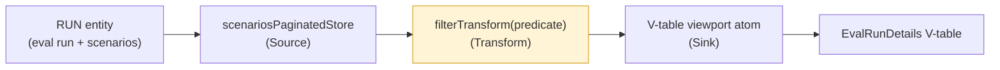
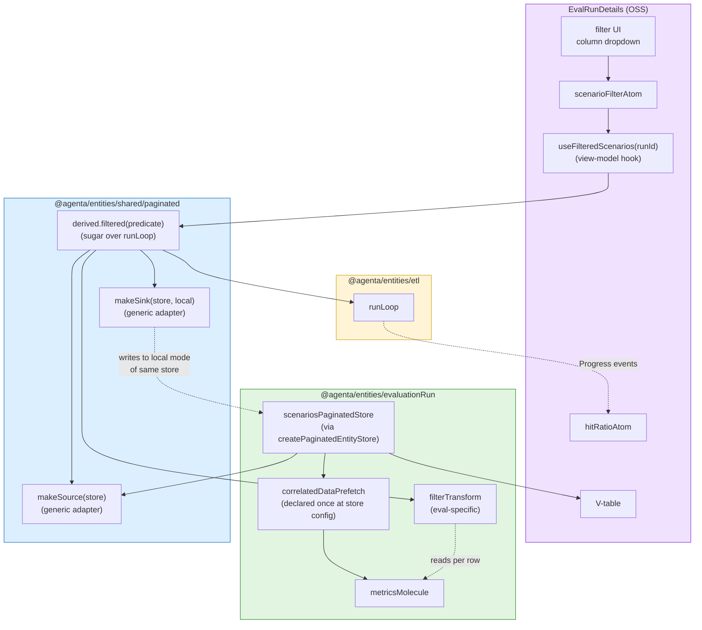

# Evaluation ETL Integration

**Created:** 2026-05-17
**Status:** RFC — Draft
**Related:** [etl-engine](./etl-engine.md) (the general engine this doc builds on), [eval-filtering](./eval-filtering.md), [eval-package-architecture](./eval-package-architecture.md)
**Authors:** Arda

---

## Summary

How evaluations adopt the general [ETL loop engine](./etl-engine.md). This doc covers the eval-specific bits only — the contracts, runtime, performance properties, and design constraints all live in the general engine RFC. Read that first.

This RFC's scope:

- The eval-specific filter pipeline as the first real consumer of the engine
- The adapter folder structure under `@agenta/entities/evaluationRun/etl/`
- How eval's `scenariosPaginatedStore` and molecules plug into the engine
- The migration path from the current bespoke `evaluationPreviewTableStore` to the engine-backed flow

The filter primitive (eval's first transform) is the canonical proving ground for the engine: it exercises the prefetch hook, hit-ratio escalation, derived views, AbortSignal cancellation, and visibility pause — all in one pipeline.

---

## The eval-specific pattern

For evaluations, JP's `RUN → V-TABLE` flow is the canonical ETL shape:



Yellow is the only eval-specific transform. Source and Sink are generic — they come from `@agenta/entities/shared/paginated/etl/`. The eval package only adds the predicate transform.

---

## The filter pipeline (worked example)

```ts
// Source — generic paginated-store adapter (lives in shared/paginated/etl/)
import { makeSource } from "@agenta/entities/shared/paginated/etl"
const scenarioSource = makeSource(scenariosPaginatedStore)

// Transform — eval-specific. Reads predicate from scenarioFilterAtom; evaluates
// against rows in chunk using metricsMolecule via imperative get (data is already
// prefetched per Convention 7).
const filterTransform = (predicate: Filtering): Transform<Scenario, Scenario> =>
  async (chunk) => {
    const matched: Scenario[] = []
    for (const scenario of chunk.items) {
      const metrics = metricsMolecule.get.scenarioMetric(scenario.id)
      // Predicate is "skeleton while pending" if metrics still loading:
      const result = applyPredicate(scenario, metrics, predicate)
      if (result === "match") matched.push(scenario)
      // result === "pending": include with __isFiltering: true; re-evaluates when settled
      // result === "no-match": exclude
    }
    return { ...chunk, items: matched }
  }

// Sink — generic paginated-store adapter (writes to a derived "local" view of the
// store, which the V-table reads as its row source)
import { makeSink } from "@agenta/entities/shared/paginated/etl"
const viewportSink = makeSink(scenariosPaginatedStore, { mode: "local" })

// Run
const filterAtom = useAtomValue(scenarioFilterAtom)
const signal = useAbortController()
for await (const progress of runLoop(
  scenarioSource,
  [filterTransform(filterAtom)],
  viewportSink,
  { runId, projectId },
  signal,
)) {
  hitRatioAtom.set({ matched: progress.matched, scanned: progress.scanned })
  if (progress.matched >= viewportSize) break  // viewport filled
}
```

The eval-specific code is **one transform** (~15 lines). Everything else — Source, Sink, loop, cancellation, progress — comes from the engine + shared adapters.

---

## Adapter folder structure

Eval-specific bits live in their own `etl/` folder; generic bits come from shared infrastructure.

```
@agenta/entities/evaluationRun/
├── state/
│   ├── molecule.ts                evaluationRunMolecule (exists)
│   ├── scenariosPaginatedStore.ts (Phase 1 of the architecture RFC)
│   ├── metricsMolecule.ts         (Phase 1 of the architecture RFC)
│   └── ...
├── etl/                           NEW — eval-specific adapters only
│   ├── filterSchema.ts            buildScenarioFilterSchema(runId)
│   │                              — declares filterable fields (static + dynamic)
│   │                              — maps evaluator output types to FilterFieldType
│   │                              — see eval-filtering.md D4 for the full spec
│   ├── transforms/
│   │   ├── filter.ts              Filtering → Transform<Scenario, Scenario>
│   │   └── derivedJoin.ts         (Phase 4 — compare-mode join transform)
│   └── index.ts
└── (sources/sinks are inherited from shared/paginated/etl/)
```

**`filterSchema.ts` is eval's filter declaration**. It's the bridge between the run's runtime configuration (which evaluators are attached, what their output schemas are) and the schema-driven filter UI. Other entities (testset, tracing, etc.) will write their own `filterSchema.ts` with the same pattern but different static/dynamic field logic.

For the schema type definitions, validator, and tier-walker that all entities share, see [eval-package-architecture.md "Cross-entity filter schemas"](./eval-package-architecture.md#cross-entity-filter-schemas-the-filterschema-contract). For the canonical eval schema with evaluator-output mapping, see [eval-filtering.md D4](./eval-filtering.md#d4-filter-schema-and-field-declarations).

**What's NOT here:**
- No per-entity `makeSource` / `makeSink` — those are generic in `shared/paginated/etl/`
- No engine code — that's in `@agenta/entities/etl/`
- No raw API wrappers — those live in `evaluationRun/api/` and are called by the paginated store's `fetchPage` config

The eval ETL folder is therefore tiny: one or two transform files. That's by design — the smaller the eval-specific surface, the more value the engine and shared adapters are providing.

---

## How the filter primitive composes



Four layers, clean separation:

- **Engine (yellow):** the loop. No knowledge of eval.
- **Shared (blue):** generic paginated-store adapters + the `derived.filtered` sugar. No knowledge of eval.
- **Eval entity (green):** `scenariosPaginatedStore` + `metricsMolecule` + the one filter transform. Knows about evals.
- **OSS UI (purple):** components that compose the pieces together.

The dependency direction is strictly downward. UI imports from eval entity; eval entity imports from shared; shared imports from engine. Engine imports from nothing.

---

## Per-chunk sequence (filter, end-to-end)

What actually happens during one iteration of the filter pipeline:

```mermaid
sequenceDiagram
    actor User
    participant Hook as useFilteredScenarios
    participant Loop as runLoop
    participant Src as makeSource(store)
    participant Store as scenariosPaginatedStore
    participant API1 as scenarios/query
    participant Prefetch as correlatedDataPrefetch
    participant MMol as metricsMolecule
    participant API2 as metrics/query
    participant Tx as filterTransform
    participant Sink as makeSink(store, local)

    User->>Hook: applies filter
    Hook->>Loop: runLoop(src, [tx], sink, params, signal)

    loop one chunk per iteration
        Loop->>Src: extract().next()
        Src->>Store: controller.fetchPage({cursor})
        Store->>API1: POST scenarios/query
        API1-->>Store: rows + windowing.next
        Note over Store: correlatedDataPrefetch fires synchronously
        Store->>Prefetch: prefetch(rows)
        Prefetch->>MMol: actions.prefetchMany(ids)
        MMol->>API2: POST metrics/query (batched)
        Store-->>Src: chunk
        Src-->>Loop: Chunk~Scenario~

        Loop->>Tx: filterTransform(chunk)
        loop per row
            Tx->>MMol: get.scenarioMetric(id)
            alt prefetch settled
                MMol-->>Tx: metric data → "match" / "no-match"
            else still pending
                MMol-->>Tx: null → "pending" (row included as skeleton;<br/>re-evaluates when settled)
            end
        end
        Tx-->>Loop: filtered Chunk

        Loop->>Sink: load(filtered chunk)
        Sink->>Store: append to local-mode view
        Store-->>Sink: ok
        Sink-->>Loop: LoadResult

        Loop-->>Hook: yield Progress
        Hook->>Hook: update hitRatioAtom, check viewport
        alt viewport full
            Hook->>Loop: signal.abort()
        end
    end
```

All five engine guarantees in action:
- **Memory bounded:** only the current chunk is held in `Tx` and `Sink` at any moment
- **Cancellation:** the hook calls `signal.abort()` when the viewport fills
- **Progress:** every chunk yields a Progress; the hook updates UI atoms
- **Backpressure:** the loop awaits `Sink.load()` before pulling the next chunk
- **Cross-molecule reads:** the transform reads `metricsMolecule` imperatively; the molecule batches the network call across all scenarios in the chunk

The eval-specific code is the `filterTransform` and the hook. The rest is engine + shared infrastructure.

---

## Migration path

Phase numbers match [eval-package-architecture.md](./eval-package-architecture.md):

| Phase | Eval ETL deliverable |
|---|---|
| Phase 1 | `scenariosPaginatedStore` (via `createPaginatedEntityStore` with `correlatedDataPrefetch`) + `metricsMolecule` (with `actions.prefetchMany`) |
| Phase 1d | AbortSignal plumbing through eval's API wrappers (so cancellation reaches axios) |
| Phase 2 | `filterTransform` (the one eval-specific adapter) wired through `derived.filtered`; filter UI ships |
| Phase 3 | Compare-mode join transform (eval-specific `MultiSourceTransform` consumer) |
| Phase 4 | Backend filter param + backend join endpoint (v2 of filter + compare-mode) |

The engine and shared adapters land in parallel — they're independent of eval. By the time Phase 2 begins, the engine should already be in `@agenta/entities/etl/` and the generic `makeSource` / `makeSink` should be in `@agenta/entities/shared/paginated/etl/`. Phase 2 is then "wire eval's one transform."

---

## Why the eval-ETL surface is small (by design)

Most ETL work in this trio is generic. The eval package contributes:

- **One transform** (`filterTransform`) — wraps `applyPredicate(scenario, metrics, predicate)` in chunk semantics
- **One join transform** (later, for compare-mode) — wraps the testcase_id-based scenario alignment
- **Configuration** — the store's `correlatedDataPrefetch` declaration wiring scenarios → metrics + annotations

That's it. Everything else — paginated store mechanics, the loop, source/sink adapters, derived views, hit-ratio escalation, cancellation, progress — is reused infrastructure.

The architectural payoff: **other entity packages get the same leverage**. Testset, observability, annotation queues — each ships one or two transforms and gets a fully-instrumented pipeline. The engine and shared adapters carry the weight.

---

## What this RFC doesn't cover

For the general engine concerns, see [etl-engine.md](./etl-engine.md):

- The contracts and their rationale
- The loop implementation
- Performance properties at the engine level
- The 5 guarantees and their honest caveats
- Background tab visibility, MultiSourceTransform, future improvements

For the eval-specific data architecture:

- See [eval-package-architecture.md](./eval-package-architecture.md) for `scenariosPaginatedStore`, `metricsMolecule`, the prefetch hook, eviction policy, and the molecule shape
- See [eval-filtering.md](./eval-filtering.md) for the filter spec, operator tiers, v1/v2 split, compare-mode semantics

This doc only covers the seam: where eval meets the engine.

---

## What to do next

If the engine RFC lands ([etl-engine.md](./etl-engine.md) steps 1-2), the eval-specific path is:

1. **Build `filterTransform`** (~30 lines). Wraps `applyPredicate` in `Transform<Scenario, Scenario>` shape, including the "skeleton while pending" policy for unloaded metrics.

2. **Wire `derived.filtered` on `scenariosPaginatedStore`** to use `filterTransform` internally. Apply the eager-escalation triggers (C3 from the filter RFC).

3. **Build the filter UI** — column dropdowns, predicate composition, the `scenarioFilterAtom` with mandatory 250ms debounce (C1).

4. **Wire to V-table.** The V-table reads from the derived view; the existing `evaluationPreviewTableStore` becomes a thin adapter (or is deleted if it stops earning its weight).

Total eval-specific work: ~3-5 days. Engine + shared adapter work (~3 days) lands in parallel.

---

## Why this doc is small (intentionally)

The general engine doc is large because it defines a load-bearing primitive. This doc is small because eval is a **consumer**, and most of the work is in the shared infrastructure. If this doc starts growing past ~400 lines, that's a signal something eval-specific is creeping into shared territory — push back and move it into the engine or shared layer instead.

Other entity packages adopting the engine should write similarly small consumer docs (`testset-etl-integration.md`, `tracing-etl-integration.md`, etc.). Each focuses on its domain's seams, not the engine itself.
