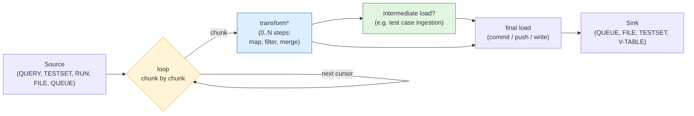
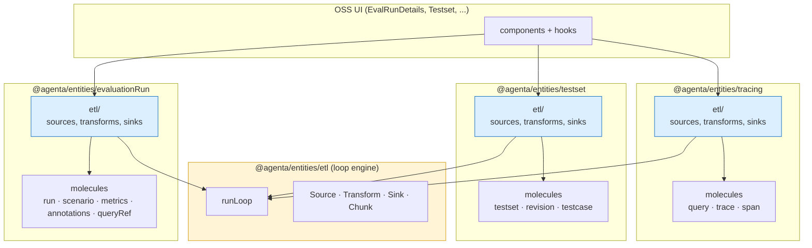
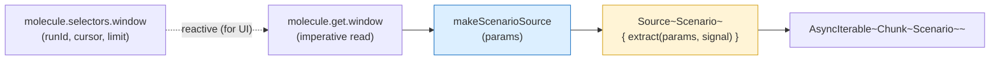
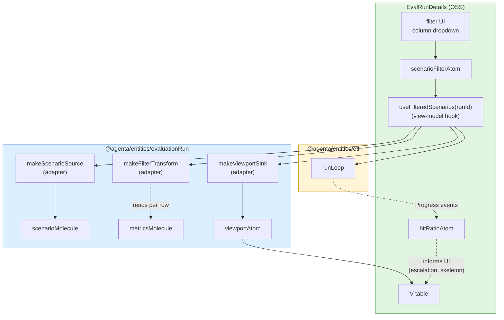
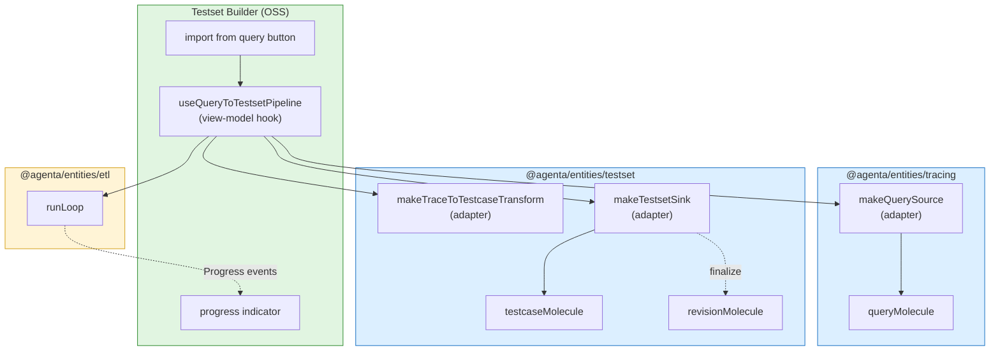
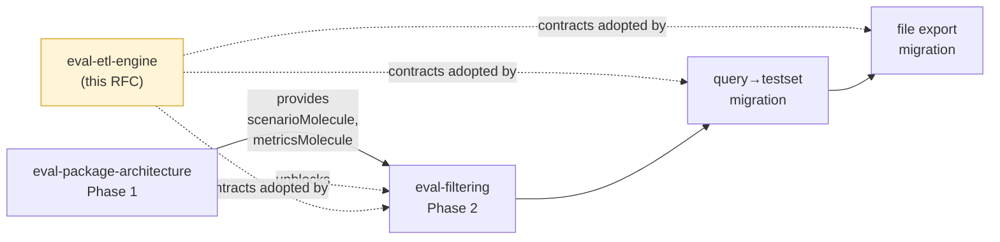

# ETL Loop Engine for Evaluation Data Pipelines

**Created:** 2026-05-16
**Status:** RFC — Starting point, meant to be iterated on
**Related:** [eval-filtering](./eval-filtering.md), [eval-package-architecture](./eval-package-architecture.md), [loadables](./loadables/), [eval-loops](./eval-loops/) (unrelated — workflow execution, different layer)
**Authors:** Arda

---

## Summary

JP's huddle diagrams describe 8+ data-movement flows (query→queue, testset→file, query→testset, run→v-table, etc.). They are 8 instances of **one loop**: pull a chunk from a source, run it through transforms, push it to a sink, repeat until exhausted. Memory pressure stays bounded by chunk size. Cancellation, progress, and backpressure are properties of the loop itself.

This RFC defines that loop as a concrete primitive — actual contracts, actual worked examples, deliberately under-specified vocabulary. JP's warning is baked in as a design constraint: no transform DSL, no Filter/Map/Reduce types, no optimizer until real consumers demand them. The point of the loop is to give the first three pipelines (filter, query→testset, file export) **the same shape** so they teach us what the vocabulary should be.

The loop is the engine. ~50 lines of TypeScript. Three primitives around it. Everything else waits.

**Naming.** "Loop" here means the iteration loop over chunks — `while (source has more) { fetch → transform → load }`. Not [`eval-loops`](./eval-loops/) (workflow execution, different layer). Not `for-each` (per-row; we work in chunks). The unit of iteration is **the chunk**, because chunks are how memory pressure is bounded.

---

## The pattern

All of JP's diagrams reduce to the same three-piece shape, looped:



Yellow box is the engine — it's the same loop for every flow. Blue is what each pipeline varies (its transforms). Green is the memory-pressure optimization (intermediate load = ingest IDs early so the chunk is the only thing in memory, never the whole accumulated dataset).

### JP's flows as instances of the loop

| Flow | Source | Transforms | Intermediate load | Sink |
|------|--------|-----------|---------------------|------|
| query → queue (trivial) | trace ID stream | — | — | queue (push trace_ids per chunk) |
| query → file | trace stream | row projection | — | file (write JSON lines per chunk) |
| query → testset | trace stream | merge → testcase shape | testcase ingest (per chunk) | testset (commit revision once finalized) |
| testset → testset | testcase stream | testcase projection | testcase ingest | testset (commit) |
| query + testset → testset | dual source | join on key + merge | testcase ingest | testset (commit) |
| **run → v-table** (filter RFC) | scenario windows | filter(`Filtering`) | — | v-table viewport |

The last row is the [filter RFC](./eval-filtering.md). Same loop, different sink (UI consumer instead of write sink).

---

## What the loop guarantees (and what it doesn't)

Five properties hold for the loop runtime. **They do not extend to cumulative session state** — that's a separate concern handled by the paginated store layer (see [eval-package-architecture.md Limitations](./eval-package-architecture.md#limitations-and-required-discipline)).

### What the loop itself guarantees

1. **Pipeline memory bounded by chunk size.** The loop never holds more than one chunk in flight in its own local state. The full dataset is never materialized inside the loop. A 50k-scenario run iterates in 250 chunks of 200, not as one 50k array. **Important caveat:** this bound covers the loop's local variables only. The data the loop writes (into a paginated store, into a viewport atom, into an accumulator sink) is the caller's memory to manage. See "What this doesn't bound" below.
2. **Progress is observable.** The loop yields `{ scanned, matched, loaded, cursor }` after every chunk. The UI reads progress without polling.
3. **Backpressure is natural** *for write sinks*. `await sink.load(chunk)` means the loop pauses on a slow sink. No buffering, no queueing. For UI sinks (synchronous atom writes), backpressure is meaningless — the consumer breaking out of `for await` is what controls flow.
4. **Cancellation through the loop body.** An `AbortSignal` passed to the loop reaches the source's iterator and is checked between chunks. `finally` runs `sink.finalize()` for cleanup.
5. **Idempotent resume is possible** (not implemented in v1). Cursor + AbortSignal + a deterministic sink = a pipeline that can be killed and restarted from the last cursor.

### What this doesn't bound

Calling these out honestly so callers don't over-rely on the loop's bounds:

| Concern | Not bounded by | Bounded by what instead |
|---|---|---|
| Cumulative loaded rows in a paginated store | the loop | paginated store eviction policy (Phase 3a of the package architecture RFC) |
| AtomFamily entries created during iteration | the loop | `molecule.cache.evictMany` called by the eviction policy |
| In-flight HTTP requests after cancellation | the loop's `AbortSignal` check | only if `AbortSignal` is plumbed through `fetchPage` → axios (Phase 1d) |
| Background tab CPU/battery | the loop | a visibility wrapper around `AbortSignal` (see open question 9 below) |
| Sink accumulator state (e.g. testset commit's `testcaseIds: string[]`) | the loop | the sink's own design — it can drop old IDs, paginate the commit, etc. |

These are JP's exact concerns from the huddle, named and locked in. **The cancellation guarantee is also partially honored in v1**: the loop body exits immediately on abort, but any HTTP request in flight at the moment of cancellation completes anyway and updates atoms. Phase 1d of the package architecture RFC plumbs `AbortSignal` through the API layer to fix this. Until that ships, callers may see brief result flashes from cancelled fetches before the new fetch's results land.

---

## The contracts

Four shapes. Plain TypeScript, no DSL.

```ts
// A lazy producer of chunks. Pull-based, AbortSignal-aware.
export interface Source<T, Params = unknown> {
  extract(params: Params, signal: AbortSignal): AsyncIterable<Chunk<T>>
}

// A chunk carries its items plus enough metadata for the loop to advance.
export interface Chunk<T> {
  items: T[]
  cursor: Cursor | null  // null = end of stream
  meta?: ChunkMeta       // page index, source hint, etc — opaque to the loop
}

// A transform is a pure function from one chunk to another.
// Compose by array — each runs in order. Short-circuit on empty.
export type Transform<In, Out> = (chunk: Chunk<In>) => Chunk<Out> | Promise<Chunk<Out>>

// A sink consumes chunks. Optional finalize() for commit-style sinks.
export interface Sink<T> {
  load(chunk: Chunk<T>): Promise<LoadResult>
  finalize?(): Promise<void>
}

// Result types
export type Cursor = string | number | object | null
export interface ChunkMeta { page?: number; hint?: string; [k: string]: unknown }
export interface LoadResult { loadedCount?: number; warnings?: string[] }
export interface Progress { scanned: number; matched: number; loaded: number; cursor: Cursor | null }
export interface LoopResult extends Progress { done: boolean }
```

That's the whole spec. Five interfaces, no implementations yet.

---

## The loop

The engine is one function. Here it is, in full:

```ts
export async function* runLoop<TIn, TOut>(
  source: Source<TIn>,
  transforms: Transform<any, any>[],
  sink: Sink<TOut>,
  params: Parameters<Source<TIn>["extract"]>[0],
  signal?: AbortSignal,
): AsyncGenerator<Progress, LoopResult> {
  const abort = signal ?? new AbortController().signal
  let scanned = 0
  let matched = 0
  let loaded = 0
  let lastCursor: Cursor | null = null

  try {
    for await (const chunk of source.extract(params, abort)) {
      if (abort.aborted) break

      scanned += chunk.items.length
      lastCursor = chunk.cursor

      // Run transforms in order. Short-circuit on empty.
      let current: Chunk<any> = chunk
      for (const tx of transforms) {
        current = await tx(current)
        if (current.items.length === 0) break
      }

      matched += current.items.length

      if (current.items.length > 0) {
        const result = await sink.load(current as Chunk<TOut>)
        loaded += result.loadedCount ?? current.items.length
      }

      yield { scanned, matched, loaded, cursor: lastCursor }

      if (chunk.cursor === null) break  // source exhausted
    }
  } finally {
    await sink.finalize?.()
  }

  return { scanned, matched, loaded, cursor: lastCursor, done: true }
}
```

~40 lines. All five guarantees from the previous section fall out of this code:

- **Memory bounded:** only `current` is held; previous chunks are released.
- **Cancellation:** `abort.aborted` checked per iteration; passed into `source.extract`.
- **Progress:** `yield` after every chunk.
- **Backpressure:** `await sink.load` blocks the loop.
- **Cleanup:** `finally` runs `sink.finalize?()` even on cancellation or error.

This is the entire engine. Everything else is per-flow Source/Transform/Sink implementations.

---

## Worked example 1: Filter (the filter RFC)

```ts
// Source — paginated scenarios from the evaluation run
const scenarioSource: Source<Scenario, { runId: string; projectId: string }> = {
  async *extract({ runId, projectId }, signal) {
    let cursor: Cursor = null
    while (!signal.aborted) {
      const { items, next } = await queryScenarios({ runId, projectId, cursor })
      yield { items, cursor: next, meta: { hint: "scenarios" } }
      if (!next) return
      cursor = next
    }
  },
}

// Transform — apply the Filtering predicate, reading metrics atoms inline
const filterTransform = (predicate: Filtering): Transform<Scenario, Scenario> =>
  async (chunk) => {
    const matched: Scenario[] = []
    for (const scenario of chunk.items) {
      const metrics = metricsMolecule.get.scenarioMetric(scenario.id)
      if (applyPredicate(scenario, metrics, predicate)) matched.push(scenario)
    }
    return { ...chunk, items: matched }
  }

// Sink — push to the V-table viewport atom
const vTableSink: Sink<Scenario> = {
  async load(chunk) {
    appendToViewportAtom(chunk.items)
    return { loadedCount: chunk.items.length }
  },
}

// Run
const abort = new AbortController()
const generator = runLoop(scenarioSource, [filterTransform(predicate)], vTableSink, { runId, projectId }, abort.signal)

for await (const progress of generator) {
  hitRatioAtom.set({ matched: progress.matched, scanned: progress.scanned })
  if (progress.matched >= viewportSize) {
    abort.abort()  // viewport full, stop loading
    break
  }
}
```

The filter RFC's `transformedRowsAtomFamily` becomes a `runLoop` call. The hit-ratio tracker reads the `Progress` stream. Cancellation when the viewport fills is one line. The escalation switch (v2) is one extra check on `progress.scanned/progress.matched` ratio that conditionally rebuilds the source with a `filtering` param.

---

## Worked example 2: Query → Testset (full JP pipeline)

```ts
// Source — traces matching a query, windowed
const traceSource: Source<Trace, { queryId: string; projectId: string; windowing: Windowing }> = {
  async *extract({ queryId, projectId, windowing }, signal) {
    let cursor: Cursor = windowing.cursor ?? null
    while (!signal.aborted) {
      const { items, next } = await queryTraces({ queryId, projectId, cursor })
      yield { items, cursor: next }
      if (!next) return
      cursor = next
    }
  },
}

// Transform — apply a column mapping to project traces into testcase shape
const traceToTestcase = (mapping: ColumnMapping): Transform<Trace, TestcasePayload> =>
  (chunk) => ({
    ...chunk,
    items: chunk.items.map((trace) => applyMapping(trace, mapping)),
  })

// Sink — ingest testcases per chunk, accumulate IDs, commit testset on finalize
const makeTestsetSink = (testsetId: string): Sink<TestcasePayload> => {
  const testcaseIds: string[] = []
  return {
    async load(chunk) {
      const ids = await ingestTestcases({ testsetId, items: chunk.items })
      testcaseIds.push(...ids)
      return { loadedCount: ids.length }
    },
    async finalize() {
      await commitTestsetRevision({ testsetId, testcaseIds })
    },
  }
}

// Run
for await (const progress of runLoop(traceSource, [traceToTestcase(mapping)], makeTestsetSink(testsetId), params)) {
  setIngestProgress(progress)
}
```

This is JP's diagram with `extract(query_id, windowing, traces) → transform(traces, mapping) → load(testcase_id, records) → load(testset_id, testcase_ids)` translated literally. The "intermediate load" (testcase ingestion per chunk) is just `sink.load` being called per chunk. The "final load" (testset commit) is `sink.finalize`. Memory pressure stays at one chunk of test cases + the accumulating `testcaseIds: string[]`, which is JP's exact target shape.

---

## Worked example 3: Query → File (streaming export)

```ts
// Source — same traceSource as example 2
// Transform — project each trace to one JSON-line shape
const traceToJsonLine: Transform<Trace, string> = (chunk) => ({
  ...chunk,
  items: chunk.items.map((t) => JSON.stringify(projectTraceForExport(t)) + "\n"),
})

// Sink — write to a streaming file handle
const makeFileSink = (writer: WritableStreamDefaultWriter): Sink<string> => ({
  async load(chunk) {
    for (const line of chunk.items) await writer.write(line)
    return { loadedCount: chunk.items.length }
  },
  async finalize() {
    await writer.close()
  },
})

// Run
const stream = createDownloadStream("export.jsonl")
const writer = stream.writable.getWriter()

for await (const progress of runLoop(traceSource, [traceToJsonLine], makeFileSink(writer), params)) {
  setDownloadProgress(progress)
}
```

Same loop, same transform shape, different sink. Memory pressure stays at one chunk of lines. The browser handles the actual download via the WHATWG stream. No accumulator in memory anywhere.

---

## Integration with entities

The loop knows nothing about entities. Entities know nothing about the loop. **Adapters** are the seam between them. This is the single load-bearing architectural rule.

### The dependency rule



Yellow is the engine — zero entity dependencies. Blue is the adapter layer — the only place that imports both the loop and a molecule. Components see adapters, not the loop. Three properties fall out:

- The loop can be unit-tested with mock Source/Sink, no entities required
- Each entity tests its adapters in isolation against the loop's contracts
- Cross-entity flows (query→testset) are natural: a Source from `tracing/etl`, a Transform from `testset/etl`, a Sink from `testset/etl`, wired by the consumer

### Folder shape

Each entity package gets a sibling `etl/` folder next to `state/`, `core/`, `api/`. Same shape everywhere:

```
@agenta/entities/etl/                       loop engine (no entity deps)
├── core/types.ts                            Source, Transform, Sink, Chunk, Progress
├── core/multiSourceTransform.ts             MultiSourceTransform<A, B, Out> for joins
└── runtime/runLoop.ts                       runLoop()

@agenta/entities/shared/paginated/
├── createPaginatedEntityStore.ts            EXISTS today (586 lines)
├── derived/                                 NEW — extension to the factory return
│   ├── filtered.ts                          predicate → new PaginatedEntityStore
│   ├── mapped.ts
│   ├── projected.ts
│   └── joined.ts                            wraps a MultiSourceTransform internally
└── etl/
    ├── makeSource.ts                        PaginatedEntityStore → Source<T>
    └── makeSink.ts                          PaginatedEntityStore (local mode) → Sink<T>

@agenta/entities/evaluationRun/
├── state/molecule.ts                        evaluationRunMolecule (exists)
├── state/scenariosPaginatedStore.ts         (new, Phase 1) — createPaginatedEntityStore instance
├── state/metricsMolecule.ts                 (new, Phase 1) — + actions.prefetchMany
└── etl/                                     entity-specific adapters (new)
    ├── transforms/filter.ts                 Filtering → Transform<Scenario, Scenario>
    └── (sources/sinks come from shared/paginated/etl/ — no per-entity wrapper needed)

@agenta/entities/testset/
├── state/molecule.ts                        testsetMolecule, revisionMolecule, testcaseMolecule
└── etl/
    ├── transforms/traceToTestcase.ts        ColumnMapping → Transform<Trace, Testcase>
    ├── transforms/testcaseProject.ts        Mapping → Transform<Testcase, TestcasePayload>
    └── sinks/testsetSink.ts                 testsetId → Sink<Testcase> (ingest + commit)

@agenta/entities/tracing/
├── state/...                                query, trace, span molecules
└── etl/
    └── sources/querySource.ts               queryMolecule → Source<Trace>
```

Adapters are tiny factories. They take entity-specific params, return a Source / Transform / Sink that satisfies the engine's contract. **For paginated-store-backed sources and sinks, the generic adapters in `shared/paginated/etl/` are reused — no per-entity wrapper is needed.** Per-entity ETL folders only carry domain-specific transforms (e.g. `traceToTestcase`).

### Adapter pattern: molecule → Source



Concretely, `shared/paginated/etl/makeSource.ts` (generic for any paginated store):

```ts
import {type Source} from "@agenta/entities/etl"
import type {PaginatedEntityStore} from "../createPaginatedEntityStore"

/**
 * Generic Source adapter for any createPaginatedEntityStore instance.
 * The paginated store's `correlatedDataPrefetch` will fire per chunk
 * automatically (configured at store construction time).
 */
export function makeSource<TRow, TApiRow, TMeta>(
  store: PaginatedEntityStore<TRow, TApiRow, TMeta>,
  chunkSize: number = 200,
): Source<TApiRow> {
  return {
    async *extract(_params, signal) {
      let cursor: string | null = null

      while (!signal.aborted) {
        // Drives the same fetchPage the UI uses. Server cursor is opaque —
        // we just hand back what we got. Prefetch hook fires inside fetchPage.
        const result = await store.controller.fetchPage({
          cursor,
          limit: chunkSize,
        })
        yield {
          items: result.rows,
          cursor: result.nextCursor,
          meta: {hint: store.entityName, hasMore: result.hasMore},
        }
        if (!result.nextCursor) return
        cursor = result.nextCursor
      }
    },
  }
}
```

Three properties of this adapter, none accidental:

- **Reuses the store's `fetchPage`.** Same code path as UI loads. The cursor model is the server-emitted opaque string (verified pattern); no client-side cursor arithmetic.
- **Inherits `correlatedDataPrefetch` for free.** When the store was constructed, prefetchers for correlated molecules were declared once. They fire inside `fetchPage`, so by the time a chunk reaches a transform, the data the transform needs is already loading.
- **Honors the AbortSignal.** Pagination stops when the consumer cancels.

A consumer that constructs `scenariosPaginatedStore` with `correlatedDataPrefetch: rows => metricsMolecule.actions.prefetchMany(rows.map(r=>r.id))` gets correct ETL behavior with **zero adapter-level config**. The store handles it. This is the answer to "we won't have to remember this whenever we use an ETL table" — the discipline is enforced at store construction time, not per consumer.

### Adapter pattern: molecule → Sink

A Sink is just a function that closes over molecule actions. The testset commit case shows the pattern most cleanly because it needs both per-chunk and finalize behaviors:

```ts
import {type Sink} from "@agenta/entities/etl"
import {testcaseMolecule, revisionMolecule} from "../state"

interface TestsetSinkParams {
  testsetId: string
  revisionName?: string
}

export function makeTestsetSink({testsetId, revisionName}: TestsetSinkParams): Sink<TestcasePayload> {
  const testcaseIds: string[] = []

  return {
    async load(chunk) {
      // testcase ingest — molecule action handles batching + idempotency
      const ids = await testcaseMolecule.actions.ingestMany({
        testsetId,
        payloads: chunk.items,
      })
      testcaseIds.push(...ids)
      return {loadedCount: ids.length}
    },

    async finalize() {
      // testset commit — molecule action handles versioning
      await revisionMolecule.actions.commit({
        testsetId,
        testcaseIds,
        name: revisionName,
      })
    },
  }
}
```

The sink is stateful (the accumulator), but the state never grows beyond `string[]` — IDs only, never full records. This is JP's "intermediate load" optimization realized: each chunk's records are ingested and dropped; only the IDs survive.

### Full pipeline wiring: Filter (single-entity, evaluationRun only)



One entity, one loop, three adapters. The hook is the only piece that knows about all three. The V-table reads `viewportAtom`, which is just where the sink writes — the V-table doesn't know a loop is running.

### Full pipeline wiring: Query → Testset (cross-entity)

Now the more interesting case — three entity packages collaborating through the loop:



Same loop. Same shape (Source + Transform + Sink). Different entity packages contribute different adapters. The hook composes them. No entity package imports another (testset doesn't import tracing; tracing doesn't import testset). The hook is the seam where they meet.

This is the architectural payoff: **cross-entity pipelines compose by importing adapters, not by adding cross-entity dependencies inside the entity packages.**

### Per-chunk sequence (filter case)

What actually happens inside one iteration of the loop:

```mermaid
sequenceDiagram
    actor User
    participant Hook as useFilteredScenarios
    participant Loop as runLoop
    participant Src as scenarioSource
    participant SMol as scenarioMolecule
    participant API1 as scenarios/query
    participant Tx as filterTransform
    participant MMol as metricsMolecule
    participant API2 as metrics/query
    participant Snk as viewportSink
    participant VAtom as viewportAtom

    User->>Hook: applies filter
    Hook->>Loop: runLoop(src, [tx], snk, params, signal)

    loop one chunk per iteration
        Loop->>Src: extract().next()
        Src->>SMol: paginatedStore.controller.fetchPage({cursor})
        SMol->>API1: POST /evaluations/scenarios/query (windowing.next = cursor)
        API1-->>SMol: scenarios[] + windowing.next
        Note over SMol: correlatedDataPrefetch fires:<br/>metricsMolecule.actions.prefetchMany(ids)
        SMol->>MMol: prefetchMany (fire-and-forget)
        MMol->>API2: POST /evaluations/metrics/query (batched)
        SMol-->>Src: window
        Src-->>Loop: Chunk~Scenario~

        Loop->>Tx: filterTransform(chunk)
        loop per row
            Tx->>MMol: get.scenarioMetric(id)
            alt prefetch already settled
                MMol-->>Tx: metric data
            else still pending
                MMol-->>Tx: pending — row marked skeleton<br/>(re-evaluates when settled)
                API2-->>MMol: metric data arrives
            end
            Tx->>Tx: applyPredicate(scenario, metrics)
        end
        Tx-->>Loop: filtered Chunk

        Loop->>Snk: load(filtered chunk)
        Snk->>VAtom: append items
        VAtom-->>Snk: ok
        Snk-->>Loop: LoadResult

        Loop-->>Hook: yield Progress {scanned, matched, loaded}
        Hook->>Hook: update hitRatioAtom<br/>check viewport full?
        alt viewport full
            Hook->>Loop: signal.abort()
        end
    end

    Loop->>Snk: finalize() (no-op for viewport)
    Loop-->>Hook: return LoopResult
```

This shows every property of the loop in action:

- **Memory bounded:** only the current chunk is held in `Tx` and `Snk` at any moment
- **Cancellation:** the hook calls `signal.abort()` when the viewport fills; the next `Src.extract().next()` exits the loop
- **Progress:** every chunk yields a Progress, the hook updates `hitRatioAtom` and checks viewport state
- **Backpressure:** the loop awaits `Snk.load()` before pulling the next chunk
- **Cross-molecule reads:** the transform reads `metricsMolecule` imperatively; the molecule batches the network call across all scenarios in the chunk

The hook is ~20 lines of orchestration; the loop is ~40 lines of engine; the adapters are ~30 lines each. The molecules and the API are unchanged from the package architecture RFC.

---

## What's deliberately NOT in v1

JP's warning, encoded:

- **No transform DSL.** Transforms are functions. No JSON-encoded `{type: "filter", op: "gte", ...}` schema at the engine level. The filter RFC's `Filtering` type is a parameter to one specific transform, not a primitive of the engine.
- **No Filter / Map / Reduce as named types.** When 3+ transforms exist and the shape is obvious, we extract. Until then, `Transform<In, Out>` is the only type.
- **No optimizer.** Transforms run in declared order. No filter-before-map fusion. When profiling shows the cost, optimize then — not before.
- **No retry / replay.** Cursor + AbortSignal makes resume possible, but the v1 loop doesn't implement it. Add when a use case forces it (probably: multi-GB file export of full traces).
- **No declarative pipeline JSON.** Pipelines are constructed in code. Declarative wiring (e.g. from a no-code workflow editor) is a future port if and only if a real consumer appears.
- **No transform registry.** Each entity package owns its transforms. No "all transforms in one place" repository. If transform reuse becomes a pattern, extract then.

What the engine **does** force, by design:

- A pipeline is always `Source → Transform[] → Sink`. Even when transforms are empty (query→queue) or the sink is a UI atom (filter RFC). The shape is fixed.
- Chunks carry cursor metadata. Sources that don't paginate yield one chunk with `cursor: null` and the loop exits cleanly.
- Sinks declare `finalize()` when they need it (commit-style sinks) and omit when they don't (streaming sinks). The loop calls it in `finally` for cleanup correctness.

---

## Design constraints honored from JP's warning

The huddle transcript on this:

> "I wouldn't want to split it preemptively because we don't really know how that merge is gonna happen. But conceptually, there's, it is there."

The contract above honors this by:

1. **Not splitting "merge."** A reduce / merge step (JP's third primitive) is **not** a separate primitive in v1. It's a `Transform<In, Out>` that uses a closure to accumulate. When merge patterns appear in 2+ transforms with the same shape, we extract.
2. **Not naming Filter / Map / Reduce.** The engine has one generic `Transform`. Naming them creates a vocabulary that locks in a specific composition style. Wait until the patterns are visible.
3. **Letting transforms be slow paths.** A transform that needs to read metrics atoms (filter), call the network (annotation enrichment), or accumulate state across chunks (reduce) all use the same `(chunk) => chunk` signature. The engine doesn't try to optimize any of them.

The result: the engine is permissive enough to express anything JP's diagrams describe, restrictive enough to keep the shape consistent, and small enough that the V1 can be replaced when the vocabulary crystallizes without losing per-pipeline work.

---

## Where it lives

`@agenta/entities/etl/` — sub-export of the entities package. Sits alongside `@agenta/entities/loadable/` and `@agenta/entities/runnable/` (which already define data-movement and execution primitives respectively). The loop is the layer above loadables — loadables describe what a source/sink IS, the loop describes how to iterate over them.

Promote to `@agenta/etl/` (top-level package) only when a non-entity consumer appears. Likely candidates: a server-side ingestion CLI, a workflow editor that compiles pipelines to runtime. Until then, the loop lives next to the molecules that use it.

### Folder shape

```
web/packages/agenta-entities/src/etl/
├── index.ts                  ~30 lines  — public API
├── core/
│   ├── types.ts              ~50 lines  — Source, Transform, Sink, Chunk, Progress
│   └── index.ts
├── runtime/
│   ├── runLoop.ts            ~50 lines  — the loop itself
│   └── index.ts
├── tests/
│   ├── runLoop.test.ts                   — engine behavior (5 guarantees as 5 test groups)
│   └── examples.test.ts                  — worked examples as end-to-end tests
└── README.md                              — link to this RFC + worked examples
```

Under 200 lines of code. Fully unit-testable (the loop is pure; sources/sinks can be mocked).

---

## How this interacts with the other RFCs



The package architecture RFC's Phase 1 (extract scenario + metrics molecules) is independent and lands first. The ETL loop ships next (~1 day of contract design + ~200 lines of code). Then the filter RFC's Phase 2 builds on both. Query→testset and file export migrate to the loop opportunistically; they're not blockers for filter.

---

## Open questions

These are the ones the worked examples actually surfaced. Not speculative.

1. **Should `Source.extract` accept `params` per-call, or be constructed with params?**
   The examples pass `{runId, projectId, ...}` into `runLoop`, which forwards to `source.extract`. This means one `Source` object can be reused across runs. Alternative: factory function `makeScenarioSource({runId, projectId})` returns a `Source<Scenario, never>`. The factory form is more typed but slightly more verbose. Lean toward per-call params for v1 because it matches how molecules are parameterized today.

2. **Should `Transform` be allowed to yield 0 or N+1 chunks per input chunk?**
   v1 says no — one chunk in, one chunk out. This rules out "split a chunk into smaller chunks" or "buffer N chunks then emit one large chunk." Both are real use cases (e.g. testcase ingest may want to batch differently than the source paginates). v1 ducks this by letting the sink re-batch. If a transform genuinely needs to re-chunk, we revisit.

3. **What's the cursor type?** **Answered: opaque string.** Verified against [`simpleQueue/state/paginatedStore.ts`](../../web/packages/agenta-entities/src/simpleQueue/state/paginatedStore.ts) and [`windowingResponseSchema`](../../web/packages/agenta-entities/src/simpleQueue/core/schema.ts). The server emits `windowing.next: string | null`, the client passes it back verbatim in the next request. No client-side cursor arithmetic. The loop's `Cursor` type is `string | null` for paginated-store-backed sources. Object cursors are reserved for joined sources (see Q4 below).

   **Cursor for `derived.joined` / `MultiSourceTransform`:** the joined cursor is `{aCursor: string | null, bCursor: string | null}`. Each advance updates whichever side needed to fetch. v2 (server-side join endpoint) collapses this back to a single opaque string. Same v1/v2 split as filter.

4. **How does the v2 filter (backend) integrate?**
   The filter RFC's escalation switches the source from "client-side scenario windows" to "server-filtered scenario windows." Same `Source<Scenario>` shape, different backing query. The loop doesn't care. But: should the source itself decide to escalate, or does the loop swap sources? Lean toward source-decides — the source has the cursor and the hit-ratio context. v2 of the filter RFC implements this inside `scenarioSource`.

5. **Error handling.** v1 punts: errors in source/transform/sink propagate out of the generator. `finally` runs `sink.finalize`. No retry, no partial recovery. Is this enough? For UI flows yes (user sees an error, retries by triggering again). For server-side flows, probably not. Defer.

6. **What's the testing story?**
   The loop itself is pure and trivially testable. Sources/sinks need mocks. The worked examples in this RFC become integration tests. The 5 guarantees become 5 test groups for `runLoop.test.ts`. The cost is ~100 lines of test scaffolding, paid once.

7. **Horizontal column virtualization vs ETL data presence.** **Resolved by store-level prefetch.** The IVT couples data loads to cell rendering today via `createViewportAwareCell`/`createColumnVisibilityAwareCell`. When a column scrolls off-screen, its cells return `null` and never subscribe to molecule selectors → data never loads → ETL transforms reading that data see nothing.

   The fix lives in the paginated store, not in the ETL adapters: `correlatedDataPrefetch` (Phase 1c of the package architecture RFC) fires per chunk independent of cell rendering. Once a store is constructed with this hook configured, **every consumer downstream (cells, derived views, ETL transforms) gets correct data presence with zero per-consumer configuration**. The store enforces the discipline.

   See Convention 7 in the [package architecture RFC](./eval-package-architecture.md#7-data-presence-is-a-store-concern-not-a-cell-concern) for the full pattern. The principle restated: *cells observe data; they never own it*.

8. **`MultiSourceTransform` for joins.** New addition to v1 contracts (not in the original sketch):

   ```ts
   export type MultiSourceTransform<A, B, Out> = (
     chunkA: Chunk<A>,
     chunkB: Chunk<B>,
     state: JoinState,
   ) => Chunk<Out>
   ```

   Used by `derived.joined`. The state object carries the hash-map accumulator across chunk boundaries so an in-memory join can survive the cursor advance loop. Server-side join (v2) skips the transform entirely — the source IS the join.

9. **Background tab pause (resolved by design, deserves explicit support).** Browsers don't throttle microtask-based iteration in background tabs. A loop running in a hidden tab keeps consuming CPU and battery. The loop engine should expose a visibility-aware AbortSignal wrapper as a first-class utility, not a per-consumer concern:

   ```ts
   // @agenta/entities/etl/runtime/visibility.ts
   export function withVisibilityPause(signal: AbortSignal): AbortSignal {
     // Returns a signal that "aborts" while document.visibilityState === "hidden"
     // and "un-aborts" when visible again. Actually implemented as a pause-resume
     // wrapper that the loop checks each iteration rather than a literal abort,
     // since AbortSignal is one-way. See impl notes.
   }
   ```

   The loop checks visibility once per iteration (negligible cost). When hidden, it sets aside the in-flight cursor and resumes from that cursor when visibility returns. **Crucially, this lives in the engine layer once** — filter consumers, ETL pipelines, derived views all benefit without per-call configuration.

   AbortSignal isn't bidirectional (no "un-abort"), so the implementation is actually a Promise-based gate: the loop awaits `visibilityGate.next()` between chunks, which resolves immediately when visible and blocks while hidden. Combined with the AbortSignal for true cancellation.

10. **Predicate evaluation cost vs eager escalation.** The loop body itself doesn't know how expensive a transform is. A filter transform doing O(1) comparisons looks identical to one doing O(blob_size) string matches. The escalation triggers (loaded > 10k, Tier 3 operator) live at the **caller** (filter UI / `derived.filtered`), not the loop. The loop just runs whatever transform it's given. Worth being explicit: the engine is a runtime, not a query optimizer. Cost-awareness belongs to whoever composes the pipeline.

---

## Performance properties — honest

The loop engine has well-defined costs. Pipeline-wide performance is the sum of source, transform, and sink costs, plus the loop overhead (which is negligible).

### Per-chunk costs

| Stage | Cost | Notes |
|---|---|---|
| Source `extract` | One HTTP request + Zod validation | Batched via paginated store's `fetchPage`; `correlatedDataPrefetch` adds parallel calls but pipelined |
| Transform per row | Depends on transform | Pure functions: ns. Atom reads: μs each. Network calls: forbidden — use prefetch |
| Sink `load` | UI: μs (atom write). Network: RTT | Network sinks throttle the loop naturally |
| Loop bookkeeping | < 1 μs per iteration | `Progress` yield + abort check |

For a typical 200-row chunk filtering scenarios by metric value:
- Source: ~200 ms (RTT) + ~50 ms (validation)
- Prefetch: parallel, no added latency on critical path
- Transform: 200 × ~10 μs/row = ~2 ms
- Sink (UI): < 1 ms
- **Total: ~250 ms per chunk**, mostly RTT.

For comparison: same chunk with a Tier 3 predicate (content-search on metric blobs):
- Same source/sink costs
- Transform: 200 × ~5 ms/row (string match on 10 KB blob) = **~1 second**
- **Total: ~1.3 seconds per chunk** — visible stutter

This is why Tier 3 operators auto-escalate to v2 (see filter RFC C2). The loop engine doesn't enforce this; the caller (filter UI / `derived.filtered`) does.

### Performance regimes (engine-level)

| Pipeline size | Per-chunk cost | Total time for full iteration | Notes |
|---|---|---|---|
| 1 chunk (200 rows) | ~250 ms | ~250 ms | Single window, no pagination needed |
| 5 chunks (1k rows) | ~250 ms each, pipelined | ~1.25 s | Smooth scrolling, no perceptible delay |
| 50 chunks (10k rows) | same | ~12.5 s | Full iteration takes time; user usually doesn't wait — viewport-driven cancellation kicks in |
| 250 chunks (50k rows) | same | ~62 s | Definitely viewport-cancelled before completion; the loop is happy to run forever, the consumer controls duration |
| Effectively unlimited (server-paginated) | same | unbounded | Loop runs as long as consumer iterates |

The loop scales linearly with cursor-advance count. There is no built-in iteration cap. The consumer is responsible for breaking out of `for await` when enough data has been seen. The visibility wrapper (open question 9) protects against runaway iterations in background tabs.

### What the engine does NOT do for you

- **No optimizer.** Transforms run in declared order; no filter-before-map fusion.
- **No retry.** Errors abort the pipeline. Idempotent retry is the consumer's responsibility.
- **No backpressure beyond `await`.** If a sink is slow, the loop waits — no buffering or queue.
- **No memoization.** Identical pipelines produce identical chunks but cache nothing across runs.
- **No cost model.** A transform that takes 5 seconds per row looks identical to one that takes 5 microseconds; the engine doesn't introspect or optimize.

All of these are deliberately out of scope. If a use case needs any of them, it's the consumer's job to add the capability above the engine, not in the engine.

---

## What to do next

Three concrete steps, in order:

**Step 1 — Land the contracts.** Write `core/types.ts` (the four interfaces) and `runtime/runLoop.ts` (the loop function) into a branch. Add tests for the 5 guarantees. ~1 day. No consumers yet — the engine ships standalone.

**Step 2 — Build the filter primitive on top.** Replace `transformedRowsAtomFamily` from the filter RFC's Phase 2 with a `runLoop` call. The filter UI doesn't change. The hit-ratio tracker reads `Progress` events. ~2-3 days.

**Step 3 — Migrate one existing flow.** Pick query→testset (it's the most complex existing flow and the best stress test). Rewrite it as a Source + Transform + Sink. Compare line counts before/after. If the engine pays for itself here, it'll pay for itself everywhere. ~3-5 days.

After step 3 we should have a clear answer to "is the engine the right shape?" Either:
- It is — keep going, migrate file export next, then consider vocabulary extraction (Filter/Map/Reduce types) once 3 transforms exist with comparable shapes
- It isn't — the contracts are 200 lines and the filter primitive is the only consumer, so refactoring is cheap. The Source/Sink primitives probably survive; the loop function may evolve

The point of "well-thought-out start" is exactly this: enough structure to be useful, not so much that we've committed to a shape we can't revise. The loop in this RFC is the smallest thing that captures all five of JP's concerns. Anything smaller misses one of them. Anything bigger is speculation.

---

## What it ISN'T

- Not a workflow execution engine — see [eval-loops](./eval-loops/) (different layer).
- Not a stream-processing framework — no watermarks, no event time, no windowing semantics beyond what each source defines.
- Not a backend feature — server-side pipelines reuse the contracts via a Python port, but the frontend loop is the immediate target.
- Not a replacement for atoms — atoms remain the storage layer. The loop is the temporal layer on top.
- Not a finished design — this is meant to be played with. Build the contracts, write the filter on top, migrate one flow, then revisit this doc.
