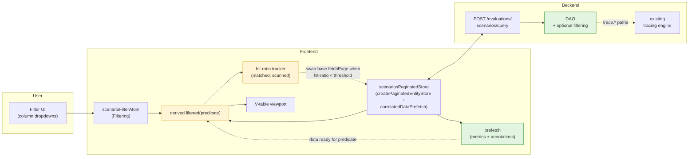
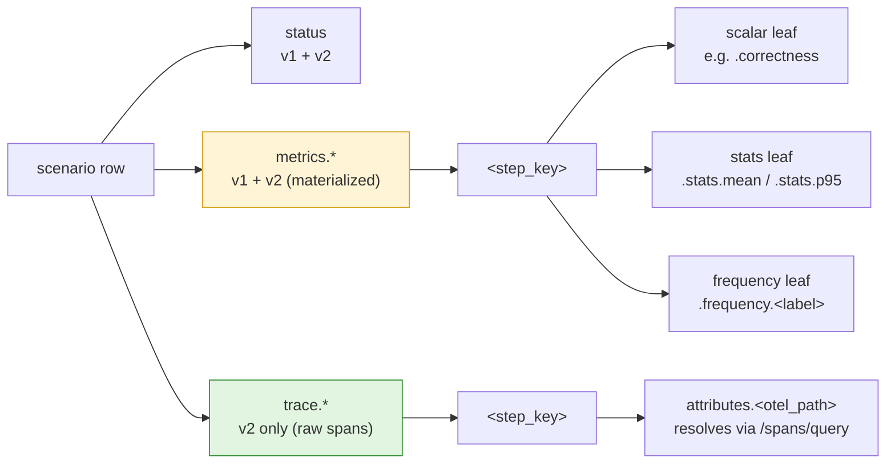
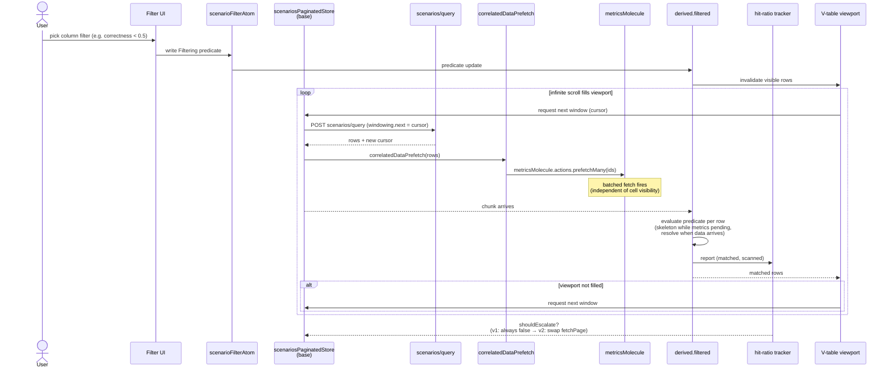
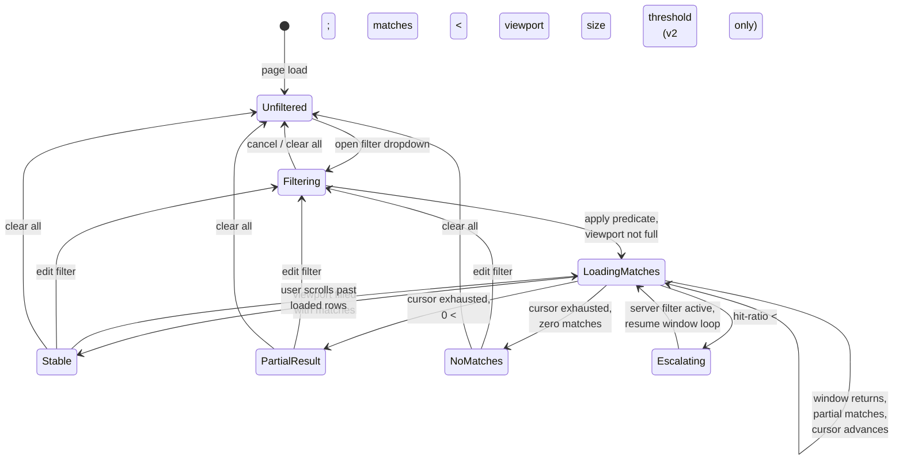
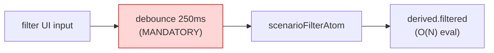
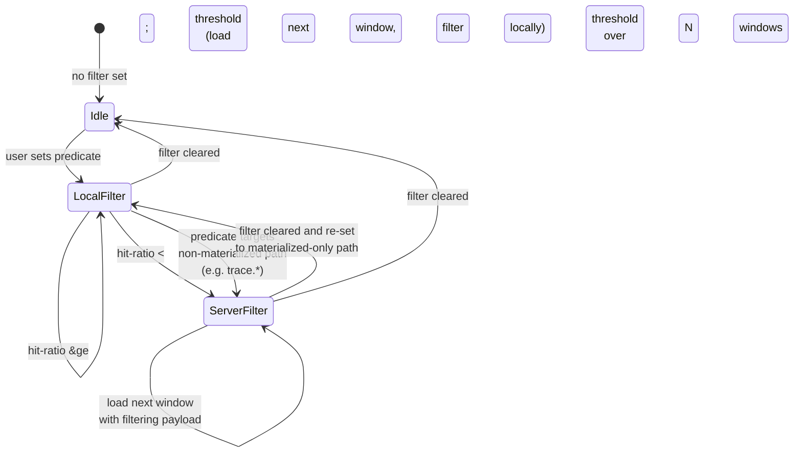
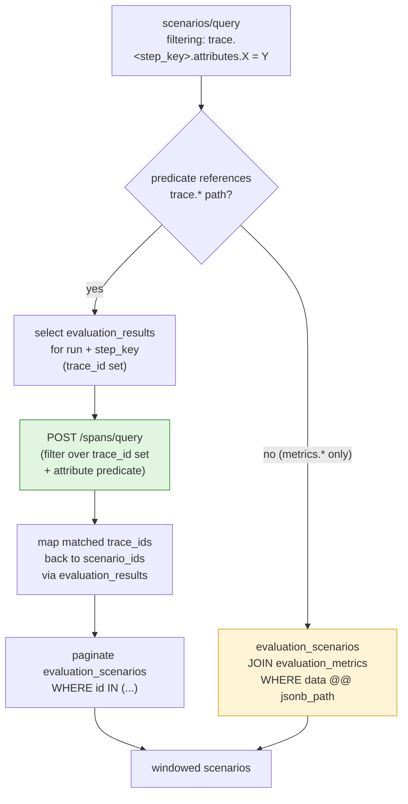
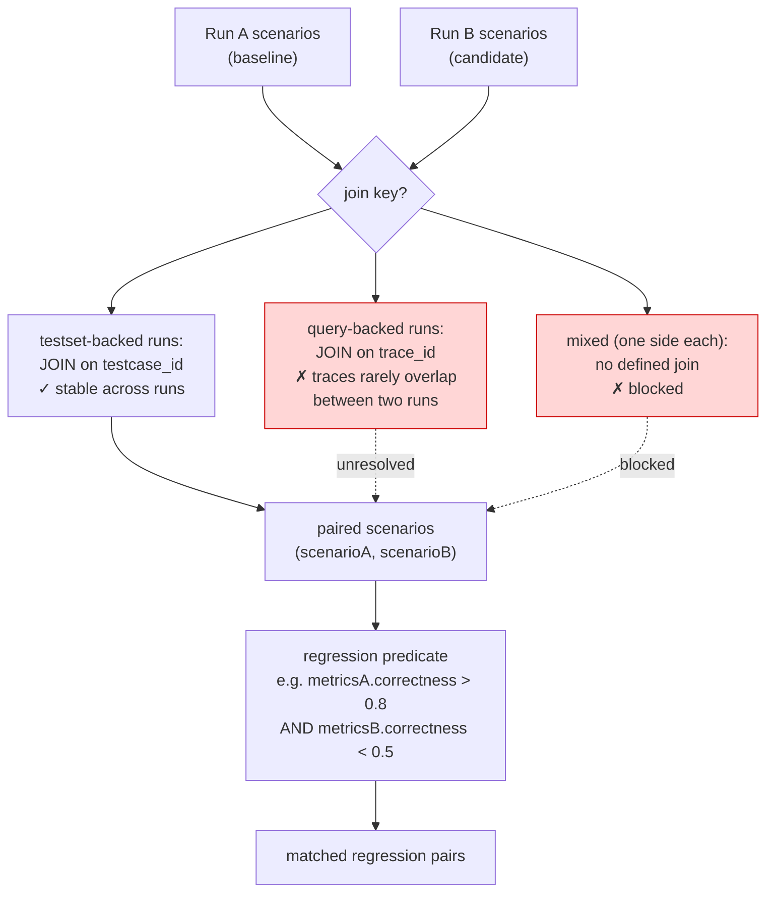
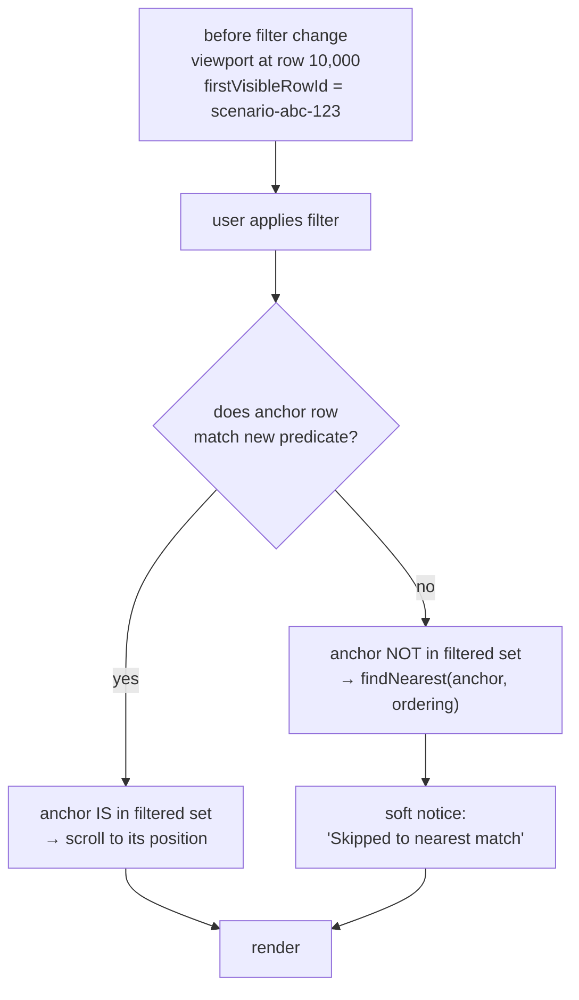
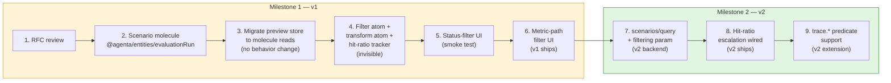

# Evaluation Scenario Filtering

**Created:** 2026-05-15
**Status:** RFC — Draft
**Related:** [eval-package-architecture](./eval-package-architecture.md) (prerequisite), [eval-etl-engine](./eval-etl-engine.md) (parallel — engine the filter primitive may build on), [eval-loops](./eval-loops/), [query-eval-loops](./query-eval-loops/), [loadables](./loadables/), [evaluator-table-molecule-refactor](./evaluator-table-molecule-refactor.md)
**Authors:** JP, Arda (huddle 2026-05-15)

---

## Summary

Add row-level filtering to the evaluation scenarios table. Ship a frontend filter over already-materialized metric data in v1; commit now to a backend predicate path in v2 for low-hit-ratio queries. **One vocabulary across both phases:** the existing tracing `Filtering` / `Condition` types. No new DSL.

Sorting is explicitly out of scope. See [Out of Scope](#out-of-scope) for rationale.

### System overview



Yellow boxes are v1 frontend work. Green is v2 (backend) and v1 prefetch (the load-bearing piece that decouples data presence from cell visibility). The wire format between Frontend and Backend (`Filtering`) is the same in both phases.

---

## Problem

`POST /evaluations/scenarios/query` accepts identity, status, flags, tags, and references. It does **not** accept predicates over evaluator outputs, metric values, or trace attributes. The frontend table (`web/oss/src/components/EvalRunDetails/`) virtualizes scenarios via cursor windowing but has no filter UI and no transform step between the loader and the V-table.

Users want two things from the GitHub issue:

1. **Single-run:** "show me scenarios where evaluator X scored low / returned false / failed"
2. **Compare-mode:** "show me regressions between run A and run B"

(1) is solvable now. (2) needs a stable scenario join across runs, which is undefined for query-backed runs. See [Open Questions](#open-questions).

---

## Decisions

The three calls this RFC locks in. Each is one-shot; getting them right matters more than the implementation timeline.

### D1. Predicate vocabulary: reuse `Filtering` / `Condition`

The filter spec is the existing [`api/oss/src/core/tracing/dtos.py`](../../api/oss/src/core/tracing/dtos.py) `Filtering` and `Condition` types: `field` (dotted path), `operator` (comparison / numeric / string / list / dict / existence), `value`, optional `options`. Nested `Filtering` for AND/OR composition.

**Why:** It already has operators, validators, tests, and FastAPI plumbing. Inventing a second filter spec for evaluations and unifying it later is the predictable failure mode. One vocabulary, two storage backends.

**What this rules out:** any new "evaluation criteria spec," JSONLogic adoption, custom rule editor data model. The UI may render Antd column filter dropdowns or a full rule builder, but the wire format is `Filtering`.

### D2. v1/v2 split: filter where the data lives

| Phase | Engine | Filterable Surface | Triggered When |
|-------|--------|---------------------|----------------|
| **v1** | Frontend transform | `evaluation_metrics.data` (already loaded for visible cells) | Always, for any predicate over materialized metric paths |
| **v2** | Backend `scenarios/query` with `filtering` param | Same metric data plus `evaluation_results.trace_id` → trace attribute predicates via the existing tracing engine | Frontend escalates when hit-ratio drops below a threshold (e.g. < 10% over 3 windows), or when the predicate targets a non-materialized field |

**Why split:** v1 ships in weeks over already-loaded data with zero backend work. v2 covers the catastrophic case (low-hit-ratio infinite scroll fetching the whole run to fill a viewport) without changing the wire format or UX.

**Hit-ratio escalation:** the frontend tracks `(matched / scanned)` across windows. When the ratio drops below the threshold, the next windowed query carries a `filtering` payload and the transform becomes a no-op. The user never sees the switch.

### D3. Field-path convention

All filter `field` values are dotted paths rooted at the **scenario record**:

```
metrics.<step_key>.<metric_path>            # metric value (v1 + v2)
metrics.<step_key>.<metric_path>.stats.mean # nested stat (v1 + v2)
trace.<step_key>.attributes.<otel_path>     # raw trace attribute (v2 only)
status                                       # already supported
```

`<metric_path>` for evaluator outputs strips the existing `attributes.ag.data.outputs.` prefix used by `EvaluationsService.refresh_metrics`. So an evaluator field `correctness` becomes `metrics.eval_correctness.correctness`, not `metrics.eval_correctness.attributes.ag.data.outputs.correctness`.

**Why root at scenario:** the predicate is evaluated per row; the row is the scenario; the path naturally starts there. Trace-attribute filters that aren't materialized as metrics get a separate `trace.` namespace so the engine knows to resolve via the tracing trace-to-scenario bridge, not the metric atom.

#### Path namespace tree



Yellow paths are queryable in v1 and v2 (frontend over metric atoms, or backend JSONB). Green paths are v2-only — they require resolving trace IDs via `evaluation_results` and applying the tracing predicate.

---

## v1 Design — Frontend Transform

### Data flow



In v1, the transform always runs locally. `shouldEscalate` is wired but the escalation path is the v2 milestone. Rejected rows never materialize their traces — the filter reads only what's already loaded for metric cells.

### Frontend shape

1. **`scenariosPaginatedStore`** in `web/packages/agenta-entities/src/evaluationRun/state/`. Built on the existing [`createPaginatedEntityStore`](../../web/packages/agenta-entities/src/shared/paginated/createPaginatedEntityStore.ts) (used today by `simpleQueue`, `trace`). Provides cursor-windowed pagination, skeleton rows, listCounts, selection. Configured with a `correlatedDataPrefetch` hook that fires `metricsMolecule.actions.prefetchMany` and `annotationsMolecule.actions.prefetchMany` per chunk — this is what makes data presence independent of horizontal cell virtualization. Replaces the plain-JSON rows in `web/oss/src/components/EvalRunDetails/evaluationPreviewTableStore.ts`. Per-scenario evaluation **results** are already exposed by [`evaluationRunMolecule.selectors.scenarioSteps`](../../web/packages/agenta-entities/src/evaluationRun/state/molecule.ts); the paginated store does not duplicate them.

2. **`scenarioFilterAtom`** holds the current `Filtering` predicate (UI-edited).

3. **`scenariosPaginatedStore.derived.filtered(predicate)`** — a new method on `createPaginatedEntityStore`'s return value (Phase 2 of the [package architecture RFC](./eval-package-architecture.md)). Returns a derived `PaginatedEntityStore` view that applies the predicate to each window of rows. Reads metric atoms only; does not force trace materialization for rejected rows. The predicate uses a "skeleton while pending" policy for rows whose correlated data isn't yet loaded — `correlatedDataPrefetch` made the fetch fire, the row shows as skeleton until it settles, then either solidifies or disappears.

4. **Hit-ratio tracker** atom: `(matched, scanned)` updated as windows resolve. Exposes `shouldEscalate` boolean.

5. **Window loader** is unchanged in v1. The transform sits between `tableScenarioRowsQueryAtomFamily` and the V-table. Infinite scroll continues to fire until the visible viewport fills (JP's existing behavior).

### UI

One filter dropdown per column header that maps to a known metric path. v1 ships with three operators per type: equality, numeric range (`gte` / `lte` / `between`), and existence. No rule builder, no AND-of-different-fields composer beyond what the column headers naturally express. Three concurrent filters max in v1.

#### User-facing states



Each state maps to a specific UX surface:

| State | What the user sees |
|-------|--------------------|
| `Unfiltered` | Normal scenarios table, no filter chips |
| `Filtering` | Column dropdown open, predicate being edited |
| `LoadingMatches` | Filter chips visible, skeleton rows below matches, sentinel firing |
| `Stable` | Filter chips visible, matched rows fill viewport, normal scroll |
| `PartialResult` | Filter chips visible, matched rows + footer ("Showing N of M total — end of results") |
| `NoMatches` | Filter chips visible, empty-state illustration with "No scenarios match this filter. [Clear filter] [Edit filter]" |
| `Escalating` | Filter chips with a subtle "Filtering on server" indicator (informational only, no blocking spinner) |

The `Escalating` state is the only one that signals the v1/v2 engine switch to the user, and only as a non-blocking hint. Everything else looks identical regardless of which engine evaluated the predicate.

### Out of v1 scope

- Custom field paths typed by the user
- Non-materialized fields (any path not present in `evaluation_metrics.data`)
- Trace-attribute filters
- Compare-mode regression filter

---

## Performance constraints (mandatory)

Honest assessment: client-side filtering is fast for small runs, manageable at medium scale with discipline, and broken without discipline at large scale. The constraints below are not "nice to have" — they're load-bearing. Implementations that skip them will produce visible UI stutter or wrong results.

### C1. Mandatory debounce on `scenarioFilterAtom` writes

Predicate evaluation is O(N) over all currently-loaded rows. For 50k loaded rows, a single predicate change burns 200-500ms of main-thread CPU. Without debouncing, every keystroke in a filter input fires that recomputation.



**Required default:** 250ms debounce on the write path. Configurable per-consumer; 0ms only for synthetic tests. While debouncing, surface a "filtering..." indicator immediately on input change — don't wait for the debounce to settle before showing UI feedback (optimistic feedback decouples perceived latency from actual latency).

### C2. Predicate operator tiers

Not all operators in `Filtering` / `Condition` are safe to evaluate client-side at scale. Three tiers:

| Tier | Operators | Cost per row | Allowed client-side? |
|---|---|---|---|
| **1 — Cheap** | `eq`, `gte`, `lte`, `between`, `is`, `is_not`, `exists`, `not_exists` | O(1) constant-time lookup | Always |
| **2 — Moderate** | `in`, `not_in`, equality on small string/enum fields | O(K) where K is list size | With debounce + size limit (lists ≤ 100) |
| **3 — Expensive** | `contains`, `matches`, `like`, `startswith`, `endswith` on nested blobs; deep path queries with wildcards | O(blob_size) — can be megabytes | **Force v2 server-side escalation, regardless of hit-ratio** |

The filter UI only surfaces Tier 1 and Tier 2 operators for v1. Tier 3 is gated: if the user attempts a Tier 3 filter, the system auto-escalates to v2 (when available) or shows "this filter requires server support — please wait" until the server endpoint is reachable. **Never run Tier 3 client-side on a run with > 1000 rows.**

### C3. Eager v2 escalation, not just hit-ratio-based

The original D2 escalation criterion (hit-ratio < 10% over 3 windows) is one trigger. Two more should fire escalation:

| Trigger | Why |
|---|---|
| Hit-ratio < 10% over 3 windows | Too few matches per chunk to fill viewport efficiently |
| **Loaded row count > 10,000** | Filter eval cost crosses the perceptibility threshold (~100ms per recompute) |
| **Predicate references Tier 3 operator** | See C2 — these are always too expensive client-side |

Any one of these triggers the swap from `paginatedStore.fetchPage` (unfiltered) to `paginatedStore.fetchPage` (with `filtering` payload). The wire format is identical; only the engine changes.

### C4. Background tab pause

AsyncIterable iteration uses microtasks, which browsers **do not throttle** in background tabs. A pipeline running in a hidden tab keeps consuming CPU and battery indefinitely.

**Required behavior:** wrap the loop's `AbortSignal` so that `document.visibilityState === "hidden"` pauses source advancement. When the tab becomes visible again, the loop resumes from the next cursor.

Implementation lives once in the loop engine (see [eval-etl-engine.md](./eval-etl-engine.md)); filter consumers inherit it automatically. Don't reimplement per consumer.

### C5. AtomFamily eviction (Phase 3)

`atomFamily` doesn't auto-evict entries. After scrolling through 100k scenarios in a long session, the metric/annotation/scenario atom families hold 100k entries each. Each entry has Jotai's per-atom overhead (a few hundred bytes). Memory grows unboundedly across the session.

Required for any run > 10k expected total rows: when row eviction triggers (see Phase 3 of [eval-package-architecture.md](./eval-package-architecture.md)), corresponding atom-family entries must be evicted too. Add to molecule contract:

```ts
metricsMolecule.cache.evict(scenarioId)        // single
metricsMolecule.cache.evictMany(scenarioIds)   // batch
```

The paginated store's eviction policy calls these as part of its sliding-window cleanup.

### Performance regimes

For sizing expectations:

| Regime | Rows | Filter strategy | What works | What breaks without discipline |
|---|---|---|---|---|
| **Small** | < 1k | Client-side always | Everything | Nothing |
| **Medium** | 1k – 10k | Client-side with debounce | Tier 1 & 2 operators | Tier 3 operators, no debounce |
| **Large** | 10k – 100k | Server-side (v2) by default | Tier 1 & 2 with eager escalation | Long sessions without eviction; client join of any size |
| **Very large** | > 100k | Server-side only | Server filter + paginated cursor | Anything client-side, including v1 fallback |

The v1 frontend filter is correct for **Small and Medium regimes**. Large regime requires v2 + eviction. Very large requires more backend work than this RFC trio commits to (server-side aggregations, indexed metric paths, etc.) — those are downstream concerns.

### Compare-mode join sizing — honest numbers

The earlier compare-mode section said "v1 client-side hash-join works for ~10k rows per side." Tighter analysis:

| Per-side rows | Hash map memory (10KB/row) | Verdict |
|---|---|---|
| 1k | ~10 MB | Comfortable |
| 5k | ~50 MB | Acceptable on desktop, marginal on mobile |
| 10k | ~100 MB | Browser starts struggling |
| > 10k | > 100 MB | Force v2 server-side join |

The corrected threshold: **v1 client-side join works for up to 5k rows per side**. Above that, the join sink doesn't accept rows — it triggers server-side escalation. Memory cost is the limiting factor, not algorithmic complexity.

---

## v2 Design — Backend Predicate

### Escalation state machine



The wire format and UX are identical across both filter states. Only the loader behavior changes: `LocalFilter` posts `scenarios/query` without `filtering` and applies the predicate client-side; `ServerFilter` posts the same `Filtering` object as a request field and the transform becomes a no-op.

### Trace-attribute resolution path



Two evaluation strategies, chosen by inspecting the predicate's field paths. Metric-only predicates stay in the evaluation tables (fast, single join). Trace-attribute predicates reuse the existing tracing engine via the result-to-trace bridge (slower, but correct, and zero new infrastructure).

### Server changes

Extend `POST /evaluations/scenarios/query` (`api/oss/src/apis/fastapi/evaluations/router.py`) to accept an optional `filtering: Filtering` field. Two evaluation strategies, chosen by the DAO based on which fields the predicate references:

**Metric-only predicate:** resolved at the database layer via JSONB path operators on `evaluation_metrics.data`. May require expression indexes for hot paths once usage patterns emerge.

**Trace-attribute predicate (path starts with `trace.`):** resolved by selecting candidate `evaluation_results.trace_id`s for the run, applying the tracing `Filtering` to those traces via the existing `/spans/query` engine, mapping matched trace IDs back to `scenario_id`, and paginating the matching scenario set.

### Frontend changes from v1 to v2

The scenario molecule and filter atom are unchanged. The window loader gains a `filtering` payload when `shouldEscalate` is true. The transform becomes a no-op (server already filtered).

---

## Out of Scope

### Sorting

Filtering is the v1 + v2 answer for the use cases in the issue. Sort needs either full pagination (kills infinite scroll UX) or backend-materialized sort columns with indexes. Neither is justified by current customer pain. Decision is documented in code where it's most relevant (the table loader and the filter atom), not just in a huddle.

The future-sort escape hatch: if a customer reports a use case that filter genuinely cannot answer, the answer is a backend sort param on `scenarios/query` over a single materialized metric column, with a covering index. Not a sort-everywhere capability.

### Custom column transforms

JP's diagram includes orange `transform` boxes for export-style operations (JSON-line emission, column projection, mapping). Those are a separate work item. Filter is **not** a member of that orange family because filter is already designed (D1).

### Compare-mode regression filter

The single-run filter ships first. Compare-mode regression filtering (the second use case in the GitHub issue) gets a derived path via `paginatedStore.derived.joined(otherStore, joinKey)` — and the same v1/v2 split applies as for single-run filter:

- **v1 (client-side join):** in-memory hash map of one side's rows keyed by `joinKey`, lookup on the other side's chunks. Works for small-to-medium runs (~10k rows per side).
- **v2 (server-side join):** new endpoint `POST /evaluations/scenarios/join` accepting two run IDs + a join key + windowing, returning paginated joined rows with a single opaque cursor (same shape as the single-run cursor — server emits a string, client passes it back). Required for large runs.

Like single-run filter, the wire format and UX are identical across v1 and v2 — only the engine differs. The unresolved question is the join key itself for query-backed runs, not the filtering mechanism on top of it.



**The three cases:**

| Case | Both runs source | Join key | Status |
|------|------------------|----------|--------|
| Testset × testset | `testset_id` (any revision) | `testcase_id` from `evaluation_results` | ✓ works today |
| Query × query | `query_id` (any revision) | `trace_id` from `evaluation_results` | ✗ traces are run-specific, overlap is incidental |
| Testset × query (or reverse) | mixed | none defined | ✗ structural mismatch |

**Why this is a separate RFC:** the join-key question is upstream of the filter spec. Solutions might include synthetic scenario alignment keys, requiring trace-identity declarations on queries, or restricting compare-mode to homogeneous sources. Each has product and data-model implications beyond filtering. v1 and v2 of *this* RFC ship without it; compare-mode regression filtering becomes a viable feature once that follow-up lands.

**What this RFC does NOT preclude:** the existing compare-mode UI that shows two scenario columns side by side still works in v1. The single-run filter applied to one side filters that column's scenarios. The "show me only rows where A passed and B failed" cross-run predicate is the blocked piece.

---

## Future improvements (not v1, but designed)

These earned design thinking but didn't earn their way into v1. Captured here so when they become relevant, the shape is already worked out and we can prototype without redesigning.

**Related future improvements in the package architecture RFC:**
- [F1. Worker-thread predicate evaluation](./eval-package-architecture.md#f1-worker-thread-predicate-evaluation) — offload predicate cost from the main thread when loaded sets exceed 5-10k rows
- [F2. Memoized derived results](./eval-package-architecture.md#f2-memoized-derived-results) — cache filter result sets keyed by predicate hash for instant toggle-back UX

These two address backend-of-the-eval cost; F1 and F2 below address the UX and observability of filtering.

### F1. Skip-ahead UX on filter transitions

**Problem.** User scrolls to row 10,000 in the unfiltered view. Applies a filter. Without intervention, the filtered view starts at row 1 of its own coordinate space — the user has lost their place. Disorienting, especially in compare-mode where it's natural to keep your position when toggling filters.

**Why it's hard.** Cursors are opaque server strings. The cursor that pointed to row 10,000 in the unfiltered query has no meaning in the filtered query. Index mapping ("row 10,000 in unfiltered" ↔ "row M in filtered") requires content-based anchoring.

**Design.** Use the user's last-visible row ID as a **content anchor**, not the cursor:



**Primitives needed:**

```ts
// On the derived view:
paginatedStore.derived.filtered(predicate).findNearestPosition(
  anchorRowId: string,
  options: {
    ordering: "time" | "id" | "score-desc" | ...
    fallback: "first" | "last" | "stay-at-top"
  }
): Promise<{ rowId: string; index: number; skipped: number }>
```

`findNearestPosition` is a small primitive on the derived view. For client-side filtered views it's O(N) over loaded rows. For server-side filtered views (v2) it needs an API extension:

```
POST /evaluations/scenarios/query
{
  "filtering": {...},
  "anchor": { "scenarioId": "abc-123", "ordering": "time" },
  "windowing": { "limit": 50 }
}
```

The server returns the window starting at the position closest to the anchor in the filter's coordinate space. v1 client-side `findNearestPosition` handles "anchor is in the filtered set" cheaply; "anchor isn't in the filtered set" requires loading enough chunks to find a match.

**When applicable:**
- ✓ `derived.filtered` — anchor mapping is well-defined
- ✓ `derived.projected` — same row set, no remapping needed
- ⚠ `derived.mapped` — anchor by source row ID still works
- ✗ `derived.joined` — the row identity changes (now a pair), anchor has no analog

**UX layer:** the hook that wraps `useViewport(filtered)` captures `firstVisibleRowId` whenever it changes. On predicate-atom updates, it calls `findNearestPosition` and triggers a smooth-scroll to the result. The "Skipped to nearest match (N rows skipped)" notice fades in for 2 seconds, dismissible.

**Cost to add when ready:** ~150 lines split between the derived view primitive, the viewport hook, and (for v2) the server endpoint extension. Worth doing once filtering is in real use and the disorientation feedback materializes.

### F2. Predicate explain mode (dev tool)

**Problem.** Tier 3 violations slip through because a predicate's tier isn't always obvious from its shape. A filter that looks Tier 1 (`eq` on a string field) might match against a 10 KB metric blob and behave like Tier 3. Hard to spot without measurement. Same for filters that *look* expensive but actually short-circuit cheaply.

**Why it's worth building.** Real performance debugging beats theoretical operator classification. If we know exactly which predicate costs how much on which rows, we can:
- Catch Tier 3 violations before users notice stutter
- Tune the eager-escalation thresholds (C3) with real data
- Surface "your filter is slow" warnings to power users
- Inform the operator tier rules (C2) with measured costs, not guesses

**Design.** Per-row timing instrumentation, wrapped around `applyPredicate`. Records:

```ts
interface PredicateEvaluation {
  predicateHash: string         // stable identifier for the predicate
  rowId: string
  matched: boolean
  durationNs: number            // single eval cost
  expensivePath?: string        // field path that dominated time, if any
  timestamp: number
}

// Stored in a ring buffer per derived view
interface ExplainBuffer {
  capacity: 1000                // most recent N evaluations
  entries: PredicateEvaluation[]
  summary: {
    byPredicate: Map<string, PredicateSummary>
  }
}

interface PredicateSummary {
  predicateText: string
  evaluations: number
  totalDurationMs: number
  avgPerRowUs: number
  p95PerRowUs: number
  maxPerRow: { rowId: string; durationUs: number; field: string }
  tierClassification: "Tier 1 ✓" | "Tier 2 ⚠" | "Tier 3 ✗"
  recommendation: "client-ok" | "consider-escalation" | "force-escalation"
}
```

**UI surface (devtools-style panel):**

```
┌─ Predicate Explain ─────────────────────────────────────────┐
│ Last 10 predicate evaluations                                │
│                                                              │
│ metrics.correctness >= 0.8 AND status == "completed"        │
│   Tier: 1 ✓  |  Avg: 12 μs  |  P95: 31 μs  |  Max: 47 μs   │
│   Rows: 200  |  Total: 2.4 ms  |  Recommendation: client-ok │
│                                                              │
│ metrics.outputs.body contains "error" (last 30 s)          │
│   Tier: 3 ✗  |  Avg: 4.7 ms  |  P95: 11.2 ms  |  Max: 23 ms│
│   Rows: 180  |  Total: 846 ms  |  Recommendation: ESCALATE  │
│   ⚠ Tier 3 violation: blob field 'metrics.outputs.body'    │
└──────────────────────────────────────────────────────────────┘
```

**Enable mechanisms (in order of preference):**
1. URL param: `?agenta_explain=predicates` — opt-in per session
2. Devtools setting: persistent toggle in the agenta devtools panel
3. Env var (dev builds only): `NEXT_PUBLIC_AGENTA_PREDICATE_EXPLAIN=true`

The instrumentation adds ~1 μs per predicate eval (timing + record), which is fine. Disabled by default in production builds (no overhead at all).

**Implementation shape:**

```ts
function applyPredicate(
  row: Scenario,
  metrics: MetricData | null,
  predicate: Filtering,
  options?: { explain?: ExplainBuffer }
): boolean {
  if (!options?.explain) {
    return predicateCore(row, metrics, predicate)  // hot path, no overhead
  }
  const start = performance.now()
  const matched = predicateCore(row, metrics, predicate)
  options.explain.record({
    predicateHash: hashPredicate(predicate),
    rowId: row.id,
    matched,
    durationNs: (performance.now() - start) * 1e6,
    // ... path detection for expensivePath
  })
  return matched
}
```

The hot path stays untouched. Instrumentation is a separate code path that copies the predicate logic + adds timing.

**Why dev-only.** Production users don't need this; the cost of `performance.now()` × 50k rows × every filter change × per-session telemetry would add up. Dev tool, sampled-production tool, or opt-in debug session — not always-on.

**Connection to C3 (eager escalation).** Once explain mode runs in real sessions, the data tunes the escalation thresholds. If we see `avgPerRowUs > 1000` triggering Tier 3 classification on operators we listed as Tier 1, that's a signal to revise C2's tier table. **The classification should be measured, not stipulated.**

---

## Open Questions

1. **Hit-ratio threshold.** 10% is a guess. Should be a constant we can tune; first version ships with telemetry to validate.
2. **`evaluation_metrics.data` indexing for v2.** JSONB path filtering without expression indexes scales until it doesn't. v2 ships without indexes and adds them once we see actual query patterns. Acceptable for the rollout window; not acceptable for steady state.
3. **Compare-mode join key for query-backed runs.** Out of scope here; documenting as a known gap.
4. **Filter persistence in URL state.** Should an applied filter survive a page reload? Probably yes (deep-linkable filtered views). Confirms before v1 ships.
5. **Filter audit / share.** Should a filter be shareable as a saved view? Probably out of v1; flag for product.

---

## Implementation Order



Steps 1-6 are weeks of work. Steps 7-9 are a second milestone after v1 ships and the field-path convention has survived first contact with users. The boundary between M1 and M2 is the right place to revisit D2 (hit-ratio threshold value) and D3 (any missing path patterns the UI surfaced).
