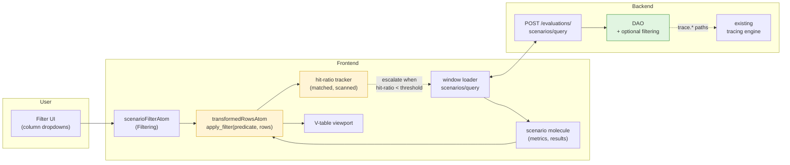
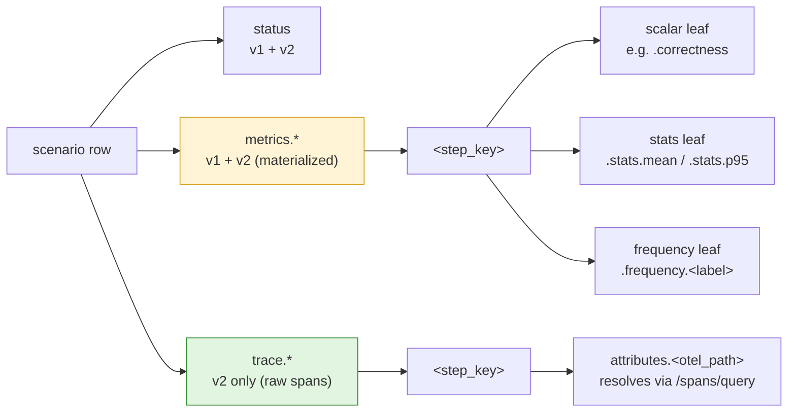
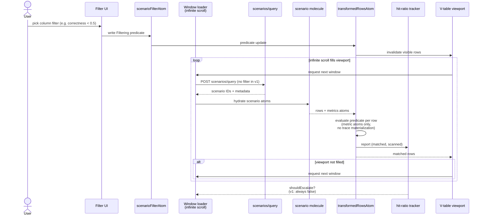
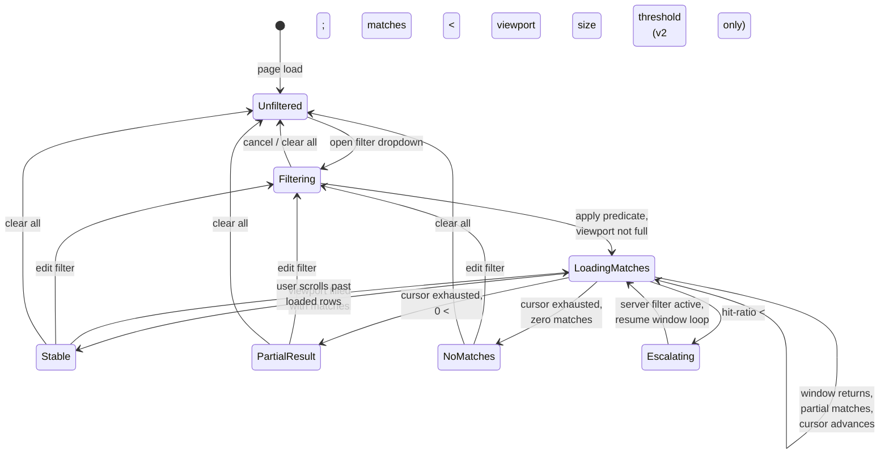
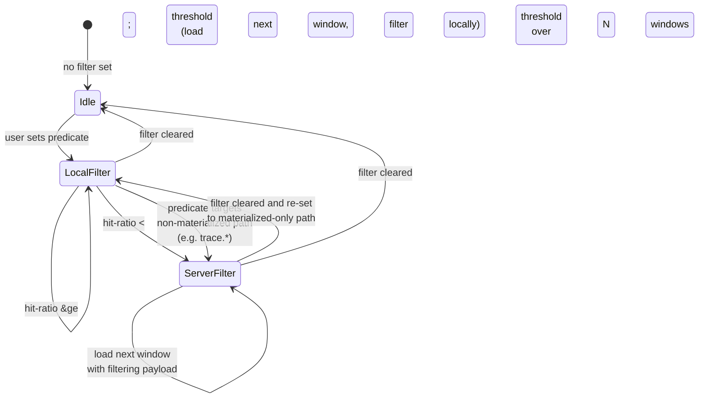
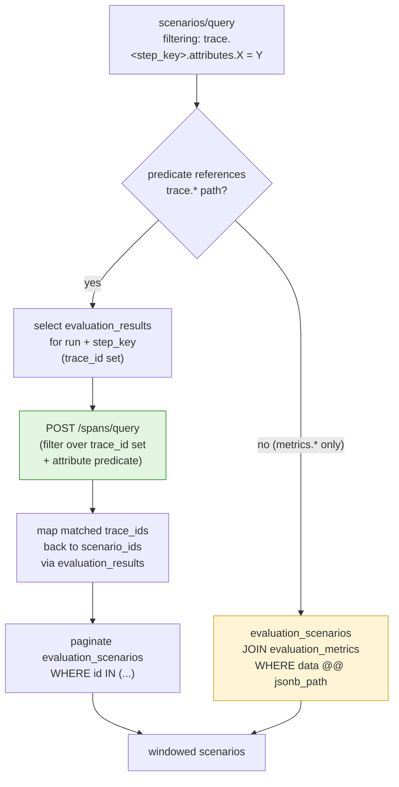
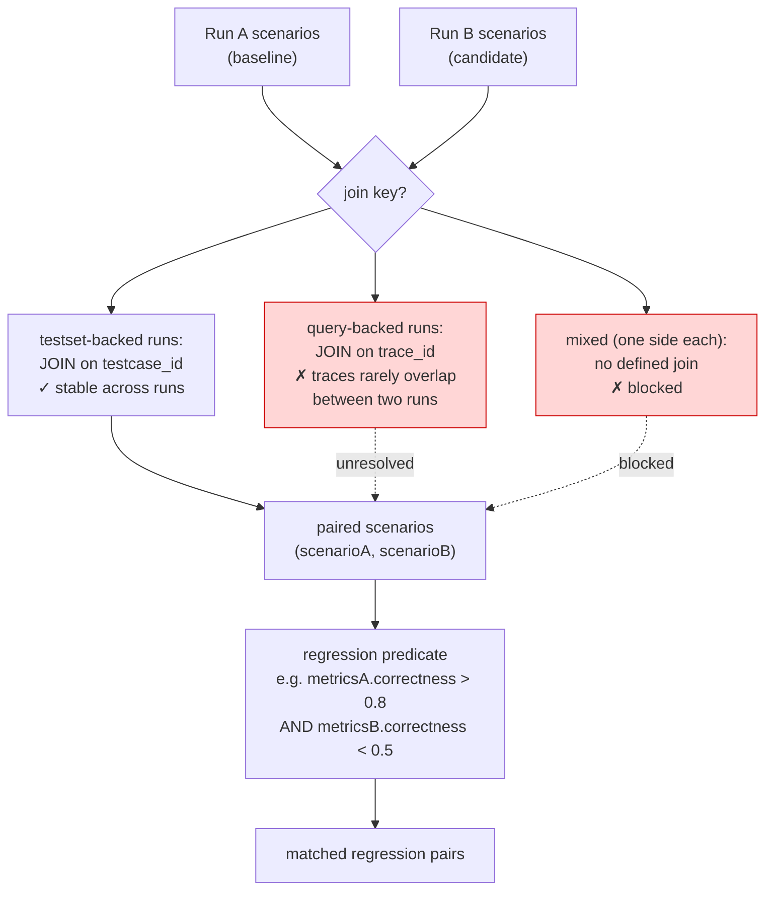
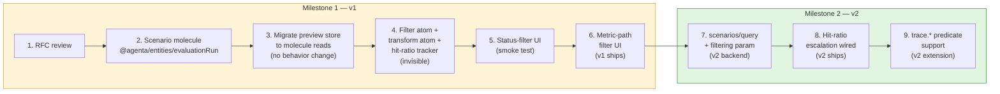

# Evaluation Scenario Filtering

**Created:** 2026-05-15
**Status:** RFC — Draft
**Related:** [eval-package-architecture](./eval-package-architecture.md) (prerequisite), [eval-etl-engine](./eval-etl-engine.md) (parallel — engine the filter primitive may build on), [eval-loops](./eval-loops/), [query-eval-loops](./query-eval-loops/), [loadables](./loadables/), [evaluator-table-molecule-refactor](./evaluator-table-molecule-refactor.md)
**Authors:** JP, Arda (huddle 2026-05-15)

---

## Summary

Add row-level filtering to the evaluation scenarios table. Ship a frontend filter over already-materialized metric data in v1; commit now to a backend predicate path in v2 for low-hit-ratio queries. **One vocabulary across both phases:** the existing tracing `Filtering` / `Condition` types. No new DSL.

Sorting is explicitly out of scope. See [Out of Scope](#out-of-scope) for rationale.

### System overview



Yellow boxes are v1 frontend work. Green is v2 backend. The wire format between Frontend and Backend (`Filtering`) is the same in both phases.

---

## Problem

`POST /evaluations/scenarios/query` accepts identity, status, flags, tags, and references. It does **not** accept predicates over evaluator outputs, metric values, or trace attributes. The frontend table (`web/oss/src/components/EvalRunDetails/`) virtualizes scenarios via cursor windowing but has no filter UI and no transform step between the loader and the V-table.

Users want two things from the GitHub issue:

1. **Single-run:** "show me scenarios where evaluator X scored low / returned false / failed"
2. **Compare-mode:** "show me regressions between run A and run B"

(1) is solvable now. (2) needs a stable scenario join across runs, which is undefined for query-backed runs. See [Open Questions](#open-questions).

---

## Decisions

The three calls this RFC locks in. Each is one-shot; getting them right matters more than the implementation timeline.

### D1. Predicate vocabulary: reuse `Filtering` / `Condition`

The filter spec is the existing [`api/oss/src/core/tracing/dtos.py`](../../api/oss/src/core/tracing/dtos.py) `Filtering` and `Condition` types: `field` (dotted path), `operator` (comparison / numeric / string / list / dict / existence), `value`, optional `options`. Nested `Filtering` for AND/OR composition.

**Why:** It already has operators, validators, tests, and FastAPI plumbing. Inventing a second filter spec for evaluations and unifying it later is the predictable failure mode. One vocabulary, two storage backends.

**What this rules out:** any new "evaluation criteria spec," JSONLogic adoption, custom rule editor data model. The UI may render Antd column filter dropdowns or a full rule builder, but the wire format is `Filtering`.

### D2. v1/v2 split: filter where the data lives

| Phase | Engine | Filterable Surface | Triggered When |
|-------|--------|---------------------|----------------|
| **v1** | Frontend transform | `evaluation_metrics.data` (already loaded for visible cells) | Always, for any predicate over materialized metric paths |
| **v2** | Backend `scenarios/query` with `filtering` param | Same metric data plus `evaluation_results.trace_id` → trace attribute predicates via the existing tracing engine | Frontend escalates when hit-ratio drops below a threshold (e.g. < 10% over 3 windows), or when the predicate targets a non-materialized field |

**Why split:** v1 ships in weeks over already-loaded data with zero backend work. v2 covers the catastrophic case (low-hit-ratio infinite scroll fetching the whole run to fill a viewport) without changing the wire format or UX.

**Hit-ratio escalation:** the frontend tracks `(matched / scanned)` across windows. When the ratio drops below the threshold, the next windowed query carries a `filtering` payload and the transform becomes a no-op. The user never sees the switch.

### D3. Field-path convention

All filter `field` values are dotted paths rooted at the **scenario record**:

```
metrics.<step_key>.<metric_path>            # metric value (v1 + v2)
metrics.<step_key>.<metric_path>.stats.mean # nested stat (v1 + v2)
trace.<step_key>.attributes.<otel_path>     # raw trace attribute (v2 only)
status                                       # already supported
```

`<metric_path>` for evaluator outputs strips the existing `attributes.ag.data.outputs.` prefix used by `EvaluationsService.refresh_metrics`. So an evaluator field `correctness` becomes `metrics.eval_correctness.correctness`, not `metrics.eval_correctness.attributes.ag.data.outputs.correctness`.

**Why root at scenario:** the predicate is evaluated per row; the row is the scenario; the path naturally starts there. Trace-attribute filters that aren't materialized as metrics get a separate `trace.` namespace so the engine knows to resolve via the tracing trace-to-scenario bridge, not the metric atom.

#### Path namespace tree



Yellow paths are queryable in v1 and v2 (frontend over metric atoms, or backend JSONB). Green paths are v2-only — they require resolving trace IDs via `evaluation_results` and applying the tracing predicate.

---

## v1 Design — Frontend Transform

### Data flow



In v1, the transform always runs locally. `shouldEscalate` is wired but the escalation path is the v2 milestone. Rejected rows never materialize their traces — the filter reads only what's already loaded for metric cells.

### Frontend shape

1. **Scenario molecule** in `web/packages/agenta-entities/src/evaluationRun/state/` (sibling to the existing `evaluationRunMolecule`). Adds the **row entity + windowing** that isn't there today. Selectors: `window({runId, cursor, limit})`, `row(scenarioId)`, `status(scenarioId)`. Replaces the plain-JSON rows in `web/oss/src/components/EvalRunDetails/evaluationPreviewTableStore.ts`. Note that per-scenario evaluation **results** (step output references with `trace_id` and `testcase_id`) are already exposed by [`evaluationRunMolecule.selectors.scenarioSteps`](../../web/packages/agenta-entities/src/evaluationRun/state/molecule.ts) — the scenario molecule does not duplicate them. **Metrics** come from `metricsMolecule.selectors.scenarioMetric` (Phase 1b of the [package architecture RFC](./eval-package-architecture.md)).

2. **`scenarioFilterAtom`** holds the current `Filtering` predicate (UI-edited).

3. **`transformedRowsAtomFamily`** = `applyFilter(predicate, rowsAtom)`. Reads metric atoms only; does not force trace materialization for rejected rows. If a predicate path is missing on a row's metrics, the row is excluded with a one-time warning (the field isn't materialized, so v1 can't answer; user is prompted to escalate to v2 or materialize the field as a metric).

4. **Hit-ratio tracker** atom: `(matched, scanned)` updated as windows resolve. Exposes `shouldEscalate` boolean.

5. **Window loader** is unchanged in v1. The transform sits between `tableScenarioRowsQueryAtomFamily` and the V-table. Infinite scroll continues to fire until the visible viewport fills (JP's existing behavior).

### UI

One filter dropdown per column header that maps to a known metric path. v1 ships with three operators per type: equality, numeric range (`gte` / `lte` / `between`), and existence. No rule builder, no AND-of-different-fields composer beyond what the column headers naturally express. Three concurrent filters max in v1.

#### User-facing states



Each state maps to a specific UX surface:

| State | What the user sees |
|-------|--------------------|
| `Unfiltered` | Normal scenarios table, no filter chips |
| `Filtering` | Column dropdown open, predicate being edited |
| `LoadingMatches` | Filter chips visible, skeleton rows below matches, sentinel firing |
| `Stable` | Filter chips visible, matched rows fill viewport, normal scroll |
| `PartialResult` | Filter chips visible, matched rows + footer ("Showing N of M total — end of results") |
| `NoMatches` | Filter chips visible, empty-state illustration with "No scenarios match this filter. [Clear filter] [Edit filter]" |
| `Escalating` | Filter chips with a subtle "Filtering on server" indicator (informational only, no blocking spinner) |

The `Escalating` state is the only one that signals the v1/v2 engine switch to the user, and only as a non-blocking hint. Everything else looks identical regardless of which engine evaluated the predicate.

### Out of v1 scope

- Custom field paths typed by the user
- Non-materialized fields (any path not present in `evaluation_metrics.data`)
- Trace-attribute filters
- Compare-mode regression filter

---

## v2 Design — Backend Predicate

### Escalation state machine



The wire format and UX are identical across both filter states. Only the loader behavior changes: `LocalFilter` posts `scenarios/query` without `filtering` and applies the predicate client-side; `ServerFilter` posts the same `Filtering` object as a request field and the transform becomes a no-op.

### Trace-attribute resolution path



Two evaluation strategies, chosen by inspecting the predicate's field paths. Metric-only predicates stay in the evaluation tables (fast, single join). Trace-attribute predicates reuse the existing tracing engine via the result-to-trace bridge (slower, but correct, and zero new infrastructure).

### Server changes

Extend `POST /evaluations/scenarios/query` (`api/oss/src/apis/fastapi/evaluations/router.py`) to accept an optional `filtering: Filtering` field. Two evaluation strategies, chosen by the DAO based on which fields the predicate references:

**Metric-only predicate:** resolved at the database layer via JSONB path operators on `evaluation_metrics.data`. May require expression indexes for hot paths once usage patterns emerge.

**Trace-attribute predicate (path starts with `trace.`):** resolved by selecting candidate `evaluation_results.trace_id`s for the run, applying the tracing `Filtering` to those traces via the existing `/spans/query` engine, mapping matched trace IDs back to `scenario_id`, and paginating the matching scenario set.

### Frontend changes from v1 to v2

The scenario molecule and filter atom are unchanged. The window loader gains a `filtering` payload when `shouldEscalate` is true. The transform becomes a no-op (server already filtered).

---

## Out of Scope

### Sorting

Filtering is the v1 + v2 answer for the use cases in the issue. Sort needs either full pagination (kills infinite scroll UX) or backend-materialized sort columns with indexes. Neither is justified by current customer pain. Decision is documented in code where it's most relevant (the table loader and the filter atom), not just in a huddle.

The future-sort escape hatch: if a customer reports a use case that filter genuinely cannot answer, the answer is a backend sort param on `scenarios/query` over a single materialized metric column, with a covering index. Not a sort-everywhere capability.

### Custom column transforms

JP's diagram includes orange `transform` boxes for export-style operations (JSON-line emission, column projection, mapping). Those are a separate work item. Filter is **not** a member of that orange family because filter is already designed (D1).

### Compare-mode regression filter

The single-run filter ships first. Compare-mode regression filtering (the second use case in the GitHub issue) is blocked on an unresolved join-key question and belongs in a follow-up RFC.



**The three cases:**

| Case | Both runs source | Join key | Status |
|------|------------------|----------|--------|
| Testset × testset | `testset_id` (any revision) | `testcase_id` from `evaluation_results` | ✓ works today |
| Query × query | `query_id` (any revision) | `trace_id` from `evaluation_results` | ✗ traces are run-specific, overlap is incidental |
| Testset × query (or reverse) | mixed | none defined | ✗ structural mismatch |

**Why this is a separate RFC:** the join-key question is upstream of the filter spec. Solutions might include synthetic scenario alignment keys, requiring trace-identity declarations on queries, or restricting compare-mode to homogeneous sources. Each has product and data-model implications beyond filtering. v1 and v2 of *this* RFC ship without it; compare-mode regression filtering becomes a viable feature once that follow-up lands.

**What this RFC does NOT preclude:** the existing compare-mode UI that shows two scenario columns side by side still works in v1. The single-run filter applied to one side filters that column's scenarios. The "show me only rows where A passed and B failed" cross-run predicate is the blocked piece.

---

## Open Questions

1. **Hit-ratio threshold.** 10% is a guess. Should be a constant we can tune; first version ships with telemetry to validate.
2. **`evaluation_metrics.data` indexing for v2.** JSONB path filtering without expression indexes scales until it doesn't. v2 ships without indexes and adds them once we see actual query patterns. Acceptable for the rollout window; not acceptable for steady state.
3. **Compare-mode join key for query-backed runs.** Out of scope here; documenting as a known gap.
4. **Filter persistence in URL state.** Should an applied filter survive a page reload? Probably yes (deep-linkable filtered views). Confirms before v1 ships.
5. **Filter audit / share.** Should a filter be shareable as a saved view? Probably out of v1; flag for product.

---

## Implementation Order



Steps 1-6 are weeks of work. Steps 7-9 are a second milestone after v1 ships and the field-path convention has survived first contact with users. The boundary between M1 and M2 is the right place to revisit D2 (hit-ratio threshold value) and D3 (any missing path patterns the UI surfaced).
