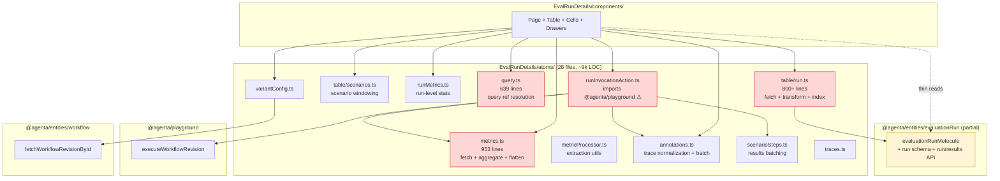
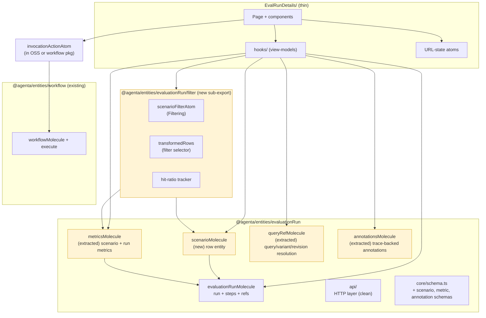
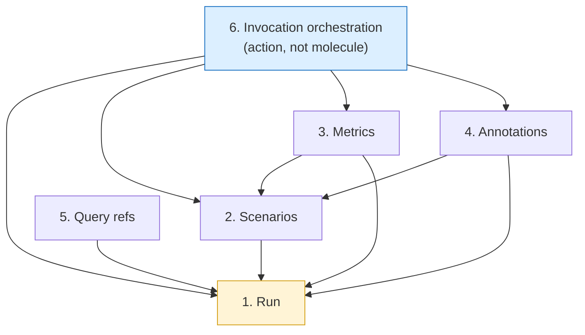
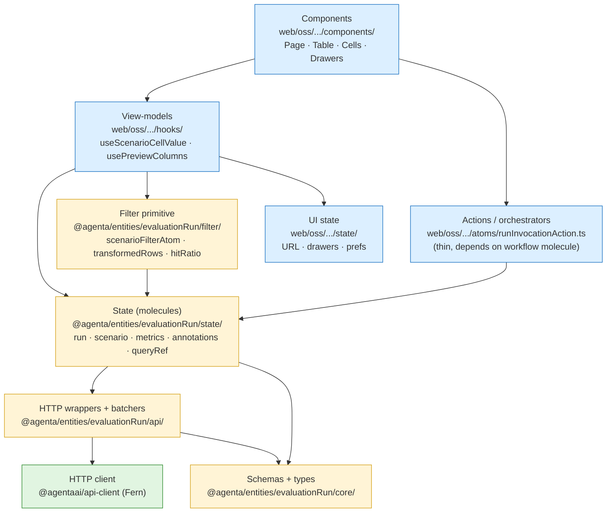
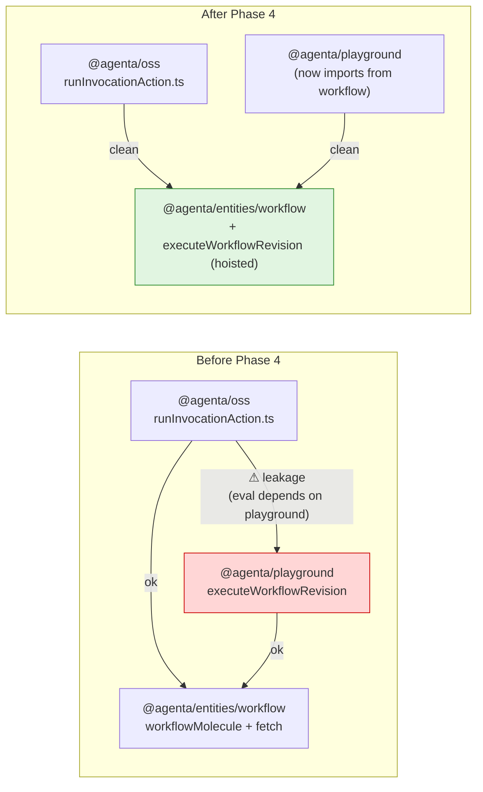
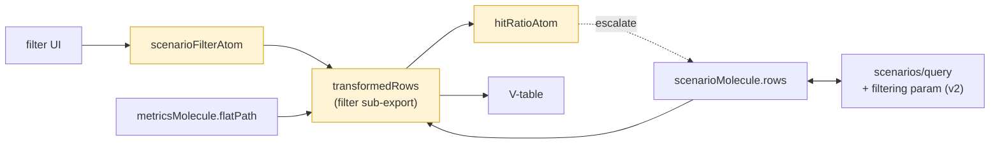

# Evaluation Frontend Architecture: Package Boundaries

**Created:** 2026-05-16
**Status:** RFC — Draft
**Related:** [eval-filtering](./eval-filtering.md), [eval-etl-engine](./eval-etl-engine.md) (parallel — minimal pipeline scaffolding the filter primitive can build on), [evaluator-table-molecule-refactor](./evaluator-table-molecule-refactor.md)
**Authors:** Arda

---

## Summary

The evaluation frontend data layer is mid-migration. The entity package `@agenta/entities/evaluationRun` exists and owns the run schema + run query API + a molecule with 15 selectors. But the largest, most-changed, most-filterable surfaces (**metrics**, **annotations**, **query revisions**, **invocation orchestration**) still live in OSS atoms under `web/oss/src/components/EvalRunDetails/atoms/`.

This is fixable, but only if we name the concerns and the package boundary first. This RFC proposes the target boundary and a phased migration. The [filter RFC](./eval-filtering.md) depends on Phase 1 of this plan landing.

## What's in the package today (ground truth)

Before proposing what to add, here is exactly what exists in [`web/packages/agenta-entities/src/evaluationRun/`](../../web/packages/agenta-entities/src/evaluationRun/) as of this RFC (1,054 lines total):

```
evaluationRun/
├── index.ts                     89 lines  — public API
├── api/api.ts                  128 lines  — fetchEvaluationRun, queryEvaluationRuns, queryEvaluationResults
├── core/schema.ts              170 lines  — Zod schemas (Run, Step, Mapping, Result)
├── core/types.ts                35 lines  — param types
└── state/molecule.ts           587 lines  — evaluationRunMolecule
```

The existing molecule's surface (this is what `evaluationRunMolecule` looks like right now, so new molecules should match the shape):

```mermaid
classDiagram
    class evaluationRunMolecule {
        +selectors
        +atoms
        +get
        +cache
    }
    class selectors {
        +data(runId) AtomFamily~EvaluationRun~
        +query(runId) AtomFamily~QueryState~
        +steps(runId) AtomFamily~Step[]~
        +annotationSteps(runId) AtomFamily~Step[]~
        +evaluatorIds(runId) AtomFamily~string[]~
        +evaluatorRevisionIds(runId) AtomFamily~string[]~
        +mappings(runId) AtomFamily~Mapping[]~
        +annotationMappings(runId) AtomFamily~Mapping[]~
        +annotationColumnDefs(runId) AtomFamily~ColumnDef[]~
        +stepReferencesByEvaluatorId(runId) AtomFamily~Map~
        +stepKeysByEvaluatorSlug(runId) AtomFamily~Map~
        +scenarioInvocationStepKey({runId, scenarioId}) AtomFamily~string~
        +scenarioSteps({runId, scenarioId}) AtomFamily~Result[]~
        +scenarioTraceRef({runId, scenarioId}) AtomFamily~TraceRef~
        +scenarioTestcaseRef({runId, scenarioId}) AtomFamily~TestcaseRef~
    }
    class atoms {
        +query (raw evaluationRunQueryAtomFamily)
        +scenarioSteps (raw scenarioStepsQueryAtomFamily)
    }
    class get {
        +data(runId) imperative
        +annotationSteps(runId) imperative
        +scenarioTraceRef(runId, scenarioId) imperative
        +... 11 imperative selectors total
    }
    class cache {
        +invalidateDetail(runId)
    }
    evaluationRunMolecule --> selectors
    evaluationRunMolecule --> atoms
    evaluationRunMolecule --> get
    evaluationRunMolecule --> cache
```

**What's already there that the architecture doc previously called "missing":**

- ✓ Per-scenario evaluation result step fetching (`scenarioSteps`, `scenarioTraceRef`, `scenarioTestcaseRef`). Already entity-backed, already batched.
- ✓ Annotation column derivation (`annotationColumnDefs`). Already joins steps + mappings.
- ✓ Evaluator reference resolution off annotation steps. Already there.

**What is genuinely missing and blocks the filter RFC:**

- ✗ Scenario **row** entity — the scenario itself (id, status, timestamp, testcase_id) and its windowing. Today this lives in [`atoms/table/scenarios.ts`](../../web/oss/src/components/EvalRunDetails/atoms/table/scenarios.ts).
- ✗ Metrics — `scenarioMetric(scenarioId)`, `runMetric(runId)`, `flatPath(scenarioId, fieldPath)`. Today in [`atoms/metrics.ts`](../../web/oss/src/components/EvalRunDetails/atoms/metrics.ts) (953 lines).
- ✗ Annotations as a distinct molecule (vs. annotation step metadata, which IS there). Today in [`atoms/annotations.ts`](../../web/oss/src/components/EvalRunDetails/atoms/annotations.ts).
- ✗ Query / variant / revision reference resolution. Today in [`atoms/query.ts`](../../web/oss/src/components/EvalRunDetails/atoms/query.ts) (639 lines).

So the "scenarioMolecule" this RFC proposes adds **rows + windowing**, not scenario-step results (already present). The "metricsMolecule" is entirely new. See [Conventions to follow](#conventions-to-follow) for how to extend without reinventing.

---

## Current shape



**Red boxes are the four primary architectural smells:**

1. `metrics.ts` — 953 lines mixing fetch, aggregation, flattening, scalar extraction, and stats processing in atom files. This is entity-level domain logic, not view state.
2. `query.ts` — 639 lines doing query/variant/revision reference resolution and batch-fetching configs. Doesn't belong in a per-route atom file.
3. `table/run.ts` — 800+ lines mixing API fetch, response transformation, evaluator reference patching, and run-index building in one file.
4. `runInvocationAction.ts` — imports `executeWorkflowRevision` from `@agenta/playground`. Evaluations should not depend on playground; if execution is a shared concern, it lives in `@agenta/entities/workflow` or a new shared runner package.

**Yellow box is the half-built target:** `evaluationRunMolecule` is good, but it only covers the run + steps + annotation column derivations. Metrics, scenarios-as-rows, query resolution, and execution are absent.

---

## Target shape



**Yellow boxes are net-new or extracted-from-OSS surfaces** that must live in the package for the filter RFC to land cleanly. Everything else stays where it is or moves trivially.

---

## Concern groups

Five concern groups exist in the current eval data layer. Each maps to one molecule in the target.

| # | Concern | Owns | Current location | Target |
|---|---------|------|------------------|--------|
| 1 | **Run** | Run identity, status, steps, mappings, refs | `evaluationRunMolecule` (partial) + `table/run.ts` | `evaluationRunMolecule` (cleanup) |
| 2 | **Scenarios** | Row entity, windowing, pagination, status | `table/scenarios.ts`, `evaluationPreviewTableStore.ts`, `tableRows.ts` | `scenarioMolecule` (new) |
| 3 | **Metrics** | Per-scenario + per-run materialized values, aggregation, flattening | `metrics.ts`, `runMetrics.ts`, `metricProcessor.ts`, `scenarioColumnValues.ts` | `metricsMolecule` (extracted) |
| 4 | **Annotations** | Trace-backed annotations, normalization, batching | `annotations.ts`, `traces.ts` | `annotationsMolecule` (extracted) |
| 5 | **Query refs** | Query / variant / revision reference resolution | `query.ts`, `references.ts`, `variantConfig.ts` | `queryRefMolecule` (extracted; some pieces may belong in `@agenta/entities/workflow`) |

A sixth concern, **invocation orchestration** (`runInvocationAction.ts`), is not a molecule — it's an action that consumes molecules. It belongs in OSS as a thin orchestrator, but its dependency on `@agenta/playground` is wrong. Either lift the executor into `@agenta/entities/workflow` (preferred — execution is workflow-shaped) or create a tiny `@agenta/entities/workflowRunner` package.

### Concern dependency graph



Arrows are "depends on / reads from." Run is the root yellow because everything resolves a run first. Invocation orchestration is blue because it's an action layer, not a state layer, and it sits on top of all five molecules.

---

## Package boundary

What lives where, in one table:

| Layer | Lives in | Examples |
|-------|----------|----------|
| **HTTP client** | `@agentaai/api-client` (Fern-generated) | Endpoint stubs |
| **Domain schemas + types** | `@agenta/entities/evaluationRun/core/` | `EvaluationRun`, `EvaluationScenario`, `EvaluationMetric`, `Filtering` (re-export) |
| **HTTP wrappers + batchers** | `@agenta/entities/evaluationRun/api/` | `queryEvaluationRuns`, `queryScenarios`, `queryMetrics`, batch fetchers |
| **State (molecules)** | `@agenta/entities/evaluationRun/state/` | `evaluationRunMolecule`, `scenarioMolecule`, `metricsMolecule`, `annotationsMolecule`, `queryRefMolecule` |
| **Filter primitive** | `@agenta/entities/evaluationRun/filter/` | `scenarioFilterAtom`, `transformedRows`, `hit-ratio tracker`, `applyPredicate` |
| **View-models (hooks)** | `web/oss/src/components/EvalRunDetails/hooks/` | `useScenarioCellValue`, `usePreviewColumns`, `useRunIdentifiers` |
| **UI state (URL, drawers, prefs)** | `web/oss/src/components/EvalRunDetails/state/` | `previewEvalTypeAtom`, `urlCompare`, `rowHeight` |
| **Components** | `web/oss/src/components/EvalRunDetails/components/` | `Page`, `Table`, `Cells`, `Drawers` |
| **Actions / orchestrators** | OSS thin layer | `runInvocationAction` (dep flipped to `@agenta/entities/workflow`) |

**Test:** if a piece of logic could be unit-tested without rendering any React, and could be used by a non-EvalRunDetails consumer (e.g. a CLI, a future dashboard, a server-side renderer), it belongs in the package. Most of `metrics.ts` passes this test today; it just isn't in the package yet.

### Layer stack



Blue = OSS. Yellow = `@agenta/entities/evaluationRun`. Green = generated HTTP client. Arrows always point downward through the stack — no layer reaches back up. A component can't import an API wrapper directly; it must read through hooks → molecules. This is the discipline that keeps the package re-usable outside `EvalRunDetails/`.

## Conventions to follow

New molecules **must** match the patterns established by [`evaluationRunMolecule`](../../web/packages/agenta-entities/src/evaluationRun/state/molecule.ts). Do not invent. Five conventions, all enforced by the existing code:

### 1. The 4-namespace molecule shape

Every molecule exposes exactly: `selectors` (reactive atom families) + `atoms` (raw store atoms, escape hatch) + `get` (imperative reads) + `cache` (invalidation/refetch). Read-only molecules (the eval ones) skip `set` / `reducers`; those exist on the testcase/testset molecules where a draft surface is needed (see [`testcase`](../../web/packages/agenta-entities/src/testcase/) and [`testset`](../../web/packages/agenta-entities/src/testset/) for the write-supporting variant).

### 2. Batch fetcher for per-entity queries

Use [`createBatchFetcher`](../../web/packages/agenta-shared/src/utils/) from `@agenta/shared/utils`. The pattern in molecule.ts ([lines 63-108](../../web/packages/agenta-entities/src/evaluationRun/state/molecule.ts)) collects per-ID requests, groups by `projectId`, and emits one HTTP call per project per render cycle. Reuse it directly for `scenarioMolecule.atoms.row` and `metricsMolecule.atoms.scenarioMetric` — single-entity reads must be batched, never N+1.

### 3. Imperative `projectId` read with retry

`atomWithQuery` in jotai-tanstack-query v0.11.0 does not re-evaluate its getter on Jotai dependency change after first subscription. So `queryFn` reads `projectIdAtom` imperatively via `getStore().get(projectIdAtom)` and **throws** when unavailable. The query atom uses `retry` to re-attempt once `projectId` resolves. See [lines 125-146](../../web/packages/agenta-entities/src/evaluationRun/state/molecule.ts) for the canonical implementation. Copy it verbatim into new query atoms.

### 4. Zod validation at the HTTP boundary

Every API response runs through `safeParseWithLogging(schema, response.data, "[fnName]")` before returning. Schemas live in `core/schema.ts`. A validation failure logs but does not throw — the function returns `null` or the appropriate empty envelope so callers see "no data" rather than a crash. Pattern in [`api/api.ts:46-51`](../../web/packages/agenta-entities/src/evaluationRun/api/api.ts).

### 5. Equality function for compound atom-family keys

When the atom family key is an object (e.g. `{runId, scenarioId}`), pass a custom equality function as the second argument to `atomFamily`:

```ts
atomFamily(
  ({runId, scenarioId}: Key) => atomWithQuery(...),
  (a, b) => a.runId === b.runId && a.scenarioId === b.scenarioId,
)
```

Without it, every new object literal allocates a new atom family entry. See [lines 384-386, 424-426, 449-450, 471-473](../../web/packages/agenta-entities/src/evaluationRun/state/molecule.ts).

### 6. Pure utils stay outside the molecule

Path extraction, scalar/stats/frequency parsing, leaf shape detection — none of these need Jotai. Put them in `utils/` as pure functions so they can be unit-tested without spinning up a store. The molecule's selectors call into them. This makes the path-resolver (the filter RFC's D2 question) testable in isolation.

---

## Migration phases

```mermaid
flowchart LR
    subgraph P1 ["Phase 1 — Scenario + Metrics extraction"]
        P1A["1a. scenarioMolecule<br/>(wrap table/scenarios.ts)"]
        P1B["1b. metricsMolecule<br/>(extract metrics.ts + runMetrics.ts)"]
        P1C["1c. migrate evaluationPreviewTableStore<br/>to read from molecules"]
    end

    subgraph P2 ["Phase 2 — Filter primitive"]
        P2A["2a. filter/ sub-export<br/>+ scenarioFilterAtom"]
        P2B["2b. transformedRows<br/>+ hit-ratio tracker"]
        P2C["2c. wire one filter UI<br/>(filter RFC v1 ships)"]
    end

    subgraph P3 ["Phase 3 — Clean up the rest"]
        P3A["3a. annotationsMolecule<br/>(extract annotations.ts + traces.ts)"]
        P3B["3b. queryRefMolecule<br/>(extract query.ts + references.ts)"]
        P3C["3c. split table/run.ts<br/>(API → utils → molecule)"]
    end

    subgraph P4 ["Phase 4 — Dependency flip"]
        P4A["4a. lift executeWorkflowRevision<br/>to @agenta/entities/workflow"]
        P4B["4b. runInvocationAction<br/>drops @agenta/playground import"]
        P4C["4c. backend filter param<br/>(filter RFC v2 ships)"]
    end

    P1A --> P1B
    P1B --> P1C
    P1C --> P2A
    P2A --> P2B
    P2B --> P2C
    P2C --> P3A
    P3A --> P3B
    P3B --> P3C
    P3C --> P4A
    P4A --> P4B
    P4B --> P4C

    style P1 fill:#fff4d6,stroke:#d4a017
    style P2 fill:#e1f5e1,stroke:#2d8a2d
    style P3 fill:#dcefff,stroke:#1971c2
    style P4 fill:#f0e1ff,stroke:#8a2ddc
```



**Phase 1 is the prerequisite for the filter RFC.** Phases 2-3 can interleave; Phase 4 is independent and can land in parallel with 3. Every phase ships working, no big-bang cutovers.

### Phase 1 detail (the load-bearing phase)

**1a. `scenarioMolecule`** in `@agenta/entities/evaluationRun/state/`. Wraps the existing `fetchEvaluationScenarioWindow` and exposes (matching the existing `evaluationRunMolecule` 4-namespace convention):

```mermaid
classDiagram
    class scenarioMolecule {
        +selectors
        +atoms
        +get
        +cache
    }
    class selectors {
        +window({runId, cursor, limit}) AtomFamily~Scenario[]~
        +rowIds(runId) AtomFamily~ScenarioId[]~
        +row(scenarioId) AtomFamily~Scenario~
        +status(scenarioId) AtomFamily~Status~
        +isMaterialized(scenarioId) AtomFamily~boolean~
    }
    class atoms {
        +window (raw scenarioWindowQueryAtomFamily)
        +row (raw scenarioByIdQueryAtomFamily)
    }
    class get {
        +row(scenarioId) imperative
        +window(runId, cursor, limit) imperative
    }
    class cache {
        +invalidateScenario(scenarioId)
        +invalidateRun(runId)
        +refetchWindow(runId, cursor)
    }
    scenarioMolecule --> selectors
    scenarioMolecule --> atoms
    scenarioMolecule --> get
    scenarioMolecule --> cache
```

The HTTP layer goes in `api/scenarios.ts` as a sibling to the existing `api/api.ts`: `queryScenarios(params)` and `fetchScenarioById(params)`, both following the same `safeParseWithLogging` validation pattern.

`evaluationPreviewTableStore.ts` becomes a thin adapter that reads from `scenarioMolecule.selectors.window(...)` and maps to its existing `PreviewTableRow` shape. No behavior change visible to users.

**1b. `metricsMolecule`** extracts `metrics.ts` (953 lines) + `runMetrics.ts` + `metricProcessor.ts`. Cleanly split:

```mermaid
classDiagram
    class metricsMolecule {
        +selectors
        +atoms
        +get
        +cache
    }
    class selectors {
        +scenarioMetric(scenarioId) AtomFamily~MetricData~
        +runMetric(runId) AtomFamily~RunMetricData~
        +flatPath({scenarioId, fieldPath}) AtomFamily~unknown~
        +rawNested({scenarioId, stepKey}) AtomFamily~object~
        +columnValue({scenarioId, columnKey}) AtomFamily~CellValue~
    }
    class atoms {
        +scenarioMetric (raw scenarioMetricQueryAtomFamily)
        +runMetric (raw runMetricQueryAtomFamily)
    }
    class get {
        +scenarioMetric(scenarioId) imperative
        +flatPath(scenarioId, fieldPath) imperative
    }
    class cache {
        +invalidate(scenarioId)
        +invalidateRun(runId)
        +refreshScenario(scenarioId) Promise
        +refreshRun(runId) Promise
    }
    metricsMolecule --> selectors
    metricsMolecule --> atoms
    metricsMolecule --> get
    metricsMolecule --> cache
```

Sibling supporting files (NOT inside the molecule class — separate exports so they can be unit-tested without Jotai):

- `api/metrics.ts` — `queryMetrics(params)`, `refreshMetrics(runId, scope)` HTTP wrappers
- `core/metricSchema.ts` — Zod schemas for metric value shapes (scalar, stats, frequency, legacy `{value: ...}` leaf)
- `utils/extract.ts` — `extractScalar`, `extractStats`, `extractFrequency`, `matchPath(data, fieldPath)` (pure, testable)

`selectors.flatPath` is the thing the filter primitive reads. Defining it during extraction (not after) avoids two refactors. `utils.matchPath` is the unified path resolver from decision D2.

**1c. Migrate `evaluationPreviewTableStore.ts`** to call into molecules. The data flow before and after:

```mermaid
sequenceDiagram
    participant VT as V-table
    participant Store as evaluationPreviewTableStore
    participant Atom as tableScenarioRowsQueryAtomFamily<br/>(OSS atom)
    participant AtomM as evaluationMetricBatcherFamily<br/>(OSS atom)
    participant API as axios.post

    rect rgb(255, 220, 220)
        Note over VT,API: Before — OSS atoms own everything
        VT->>Store: read rows window
        Store->>Atom: fetch(cursor, limit)
        Atom->>API: POST /evaluations/scenarios/query
        API-->>Atom: rows
        Atom-->>Store: rows
        Store-->>VT: PreviewTableRow[]

        VT->>AtomM: read visible metrics
        AtomM->>API: POST /evaluations/metrics/query
        API-->>AtomM: metrics
        AtomM-->>VT: metric cells
    end

    rect rgb(220, 255, 220)
        Note over VT,API: After — package molecules own data; store is a shape adapter
        VT->>Store: read rows window
        Store->>Atom: scenarioMolecule.selectors.window(runId, cursor, limit)
        Atom->>API: package api.queryScenarios
        API-->>Atom: rows
        Atom-->>Store: Scenario[]
        Store-->>VT: PreviewTableRow[] (adapted shape)

        VT->>AtomM: metricsMolecule.selectors.scenarioMetric(id)
        AtomM->>API: package api.queryMetrics (batched)
        API-->>AtomM: metrics
        AtomM-->>VT: metric cells
    end
```

Red is the current path. Green is post-Phase-1. The V-table interface doesn't change. The atom families are now package-owned. `evaluationPreviewTableStore` survives as a thin row-shape adapter (and may be deleted in Phase 2 if it stops earning its weight).

### Phase 2 — Filter primitive (parallel sub-export)

Lives at `@agenta/entities/evaluationRun/filter/`. Sibling to `state/`, not nested under it, because filtering composes molecules rather than being one. Re-exports:

- `scenarioFilterAtom` — the `Filtering` predicate
- `transformedRowsAtomFamily(runId, predicate)` — reads `scenarioMolecule` rows and `metricsMolecule.flatPath` for each row, returns matched rows
- `hitRatioAtomFamily(runId)` — tracks `(matched, scanned)`
- `applyPredicate(row, metrics, predicate)` — pure function, unit-testable

The OSS table swaps `tableScenarioRowsQueryAtomFamily` for `transformedRowsAtomFamily`. v1 of the filter RFC is now shippable in days, not weeks, because the molecules are already there.

### Phase 3-4 — Remaining concerns

Lower priority but worth doing while the architecture is fresh:

- `annotationsMolecule` extracts the trace normalization + batch fetcher pattern out of `annotations.ts`
- `queryRefMolecule` consolidates `query.ts` + `references.ts` + `variantConfig.ts` into one resolver. Some of this may belong in `@agenta/entities/workflow` rather than `evaluationRun` — depends on whether query refs are eval-specific or shared with playground.
- `runInvocationAction.ts` drops the `@agenta/playground` import once `executeWorkflowRevision` is hoisted to `@agenta/entities/workflow`. This is the right home — execution is a workflow concern, not a playground concern.

#### The dependency flip (Phase 4a-b)



Two consumers of `executeWorkflowRevision` (evaluations + playground) become two consumers of the same function in its correct home. The shared dependency is now `workflow`, which is where workflow-shaped code belongs. Playground's public API doesn't shrink, it just re-exports from workflow if needed.

---

## How filtering plugs in



The filter primitive composes two molecules (`scenarioMolecule.rows` and `metricsMolecule.flatPath`). It doesn't know about React, the V-table, or the API client. The V-table reads from the filter primitive. The API client is hit only through the molecules. Each piece is testable in isolation.

When v2 lands, the only thing that changes is `scenarioMolecule.selectors.window` learns to pass a `filtering` payload to the API. The filter primitive becomes a no-op for server-filtered windows. The UI doesn't change. The V-table doesn't change. That is the architectural payoff.

---

## What this is NOT

- **Not a rewrite.** Each phase keeps the existing table working. No "land on a branch for 3 weeks" cutover.
- **Not a new package.** Everything goes into the existing `@agenta/entities/evaluationRun`. We are filling out a half-built package, not creating a sibling.
- **Not a fight with the playground.** The one dependency flip (`executeWorkflowRevision` → `@agenta/entities/workflow`) is straightforward; everything else leaves playground alone.
- **Not a DSL invention.** Filter spec is the existing `Filtering` from tracing. See [eval-filtering.md](./eval-filtering.md).

---

## Open questions

1. **`queryRefMolecule` location.** Query refs are used by evaluations (resolve a query revision to its config) and by playground (run a query). Does it live in `@agenta/entities/evaluationRun`, `@agenta/entities/workflow`, or a new `@agenta/entities/query`? Decision affects Phase 3 boundaries.

2. **`evaluationPreviewTableStore.ts` long-term role.** Phase 1c makes it a thin adapter. Should it survive at all, or should the V-table read molecules directly? Adapter has value (one place to keep `PreviewTableRow` shape), but it's also a layer that won't pull its weight forever. Defer decision to end of Phase 1.

3. **Annotation entity scope.** `annotations.ts` reads from `/simple/traces/query`, not an evaluation-specific endpoint. Is the right home `@agenta/entities/annotation` (new, shared with future annotation surfaces), or stays under `evaluationRun` until a second consumer appears? Lean toward "stay under evaluationRun" until proven shared.

4. **Cross-feature execution dependency.** Phase 4a (lift `executeWorkflowRevision`) needs a maintainer signoff from whoever owns playground. The function exists there for a reason; flipping it is straightforward technically but is a coordination question.

5. **Backwards-compat shims during migration.** Phase 1 leaves `metrics.ts`, `query.ts`, etc. in place as re-exports for one release cycle, then deletes. Or do we cut over hard? The web monorepo is one package; the API surface is internal; we can probably cut hard if commits land atomically.

---

## What I'd commit to before code

Two decisions, before Phase 1a starts:

- **D1.** `scenarioMolecule.selectors.row(scenarioId)` returns `{scenario, results, metrics}` together (fully materialized) **or** just `scenario` with metric/result access on separate selectors. Affects the shape of every consumer. Lean toward separate — the filter primitive specifically wants to filter on metrics without materializing results, and a unified shape blocks that optimization.

- **D2.** Whether `metricsMolecule.selectors.flatPath(scenarioId, path)` is the path-resolution primitive for both filter eval AND the existing cell-value lookup (which today uses suffix matching, canonicalization, and nested lookup). Unifying them means one path resolver, one set of edge cases. Splitting them means the filter has clean semantics but the legacy cell lookup keeps its quirks. Lean toward unifying — the filter RFC's field-path convention should be the canonical one.

Both are reversible but expensive to flip after Phase 1 ships.
