# Evaluation Frontend Architecture: Package Boundaries

**Created:** 2026-05-16
**Status:** RFC — Draft
**Related:** [eval-filtering](./eval-filtering.md), [etl-engine](./etl-engine.md) (the general loop engine), [eval-etl-engine](./eval-etl-engine.md) (eval's adoption of the engine), [evaluator-table-molecule-refactor](./evaluator-table-molecule-refactor.md)
**Authors:** Arda

---

## Summary

The evaluation frontend data layer is mid-migration. The entity package `@agenta/entities/evaluationRun` exists and owns the run schema + run query API + a molecule with 15 selectors. But the largest, most-changed, most-filterable surfaces (**metrics**, **annotations**, **query revisions**, **invocation orchestration**) still live in OSS atoms under `web/oss/src/components/EvalRunDetails/atoms/`.

This is fixable, but only if we name the concerns and the package boundary first. This RFC proposes the target boundary and a phased migration. The [filter RFC](./eval-filtering.md) depends on Phase 1 of this plan landing.

## What's in the package today (ground truth)

Before proposing what to add, here is exactly what exists in [`web/packages/agenta-entities/src/evaluationRun/`](../../web/packages/agenta-entities/src/evaluationRun/) as of this RFC (1,054 lines total):

```
evaluationRun/
├── index.ts                     89 lines  — public API
├── api/api.ts                  128 lines  — fetchEvaluationRun, queryEvaluationRuns, queryEvaluationResults
├── core/schema.ts              170 lines  — Zod schemas (Run, Step, Mapping, Result)
├── core/types.ts                35 lines  — param types
└── state/molecule.ts           587 lines  — evaluationRunMolecule
```

The existing molecule's surface (this is what `evaluationRunMolecule` looks like right now, so new molecules should match the shape):

```mermaid
classDiagram
    class evaluationRunMolecule {
        +selectors
        +atoms
        +get
        +cache
    }
    class selectors {
        +data(runId) AtomFamily~EvaluationRun~
        +query(runId) AtomFamily~QueryState~
        +steps(runId) AtomFamily~Step[]~
        +annotationSteps(runId) AtomFamily~Step[]~
        +evaluatorIds(runId) AtomFamily~string[]~
        +evaluatorRevisionIds(runId) AtomFamily~string[]~
        +mappings(runId) AtomFamily~Mapping[]~
        +annotationMappings(runId) AtomFamily~Mapping[]~
        +annotationColumnDefs(runId) AtomFamily~ColumnDef[]~
        +stepReferencesByEvaluatorId(runId) AtomFamily~Map~
        +stepKeysByEvaluatorSlug(runId) AtomFamily~Map~
        +scenarioInvocationStepKey({runId, scenarioId}) AtomFamily~string~
        +scenarioSteps({runId, scenarioId}) AtomFamily~Result[]~
        +scenarioTraceRef({runId, scenarioId}) AtomFamily~TraceRef~
        +scenarioTestcaseRef({runId, scenarioId}) AtomFamily~TestcaseRef~
    }
    class atoms {
        +query (raw evaluationRunQueryAtomFamily)
        +scenarioSteps (raw scenarioStepsQueryAtomFamily)
    }
    class get {
        +data(runId) imperative
        +annotationSteps(runId) imperative
        +scenarioTraceRef(runId, scenarioId) imperative
        +... 11 imperative selectors total
    }
    class cache {
        +invalidateDetail(runId)
    }
    evaluationRunMolecule --> selectors
    evaluationRunMolecule --> atoms
    evaluationRunMolecule --> get
    evaluationRunMolecule --> cache
```

**What's already there that the architecture doc previously called "missing":**

- ✓ Per-scenario evaluation result step fetching (`scenarioSteps`, `scenarioTraceRef`, `scenarioTestcaseRef`). Already entity-backed, already batched.
- ✓ Annotation column derivation (`annotationColumnDefs`). Already joins steps + mappings.
- ✓ Evaluator reference resolution off annotation steps. Already there.

**What is genuinely missing and blocks the filter RFC:**

- ✗ Scenario **row** entity — the scenario itself (id, status, timestamp, testcase_id) and its windowing. Today this lives in [`atoms/table/scenarios.ts`](../../web/oss/src/components/EvalRunDetails/atoms/table/scenarios.ts).
- ✗ Metrics — `scenarioMetric(scenarioId)`, `runMetric(runId)`, `flatPath(scenarioId, fieldPath)`. Today in [`atoms/metrics.ts`](../../web/oss/src/components/EvalRunDetails/atoms/metrics.ts) (953 lines).
- ✗ Annotations as a distinct molecule (vs. annotation step metadata, which IS there). Today in [`atoms/annotations.ts`](../../web/oss/src/components/EvalRunDetails/atoms/annotations.ts).
- ✗ Query / variant / revision reference resolution. Today in [`atoms/query.ts`](../../web/oss/src/components/EvalRunDetails/atoms/query.ts) (639 lines).

So the "scenarioMolecule" this RFC proposes adds **rows + windowing**, not scenario-step results (already present). The "metricsMolecule" is entirely new. See [Conventions to follow](#conventions-to-follow) for how to extend without reinventing.

---

## Current shape

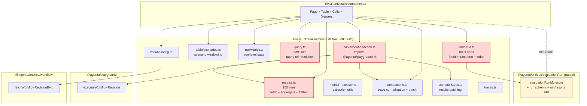

**Red boxes are the four primary architectural smells:**

1. `metrics.ts` — 953 lines mixing fetch, aggregation, flattening, scalar extraction, and stats processing in atom files. This is entity-level domain logic, not view state.
2. `query.ts` — 639 lines doing query/variant/revision reference resolution and batch-fetching configs. Doesn't belong in a per-route atom file.
3. `table/run.ts` — 800+ lines mixing API fetch, response transformation, evaluator reference patching, and run-index building in one file.
4. `runInvocationAction.ts` — imports `executeWorkflowRevision` from `@agenta/playground`. Evaluations should not depend on playground; if execution is a shared concern, it lives in `@agenta/entities/workflow` or a new shared runner package.

**Yellow box is the half-built target:** `evaluationRunMolecule` is good, but it only covers the run + steps + annotation column derivations. Metrics, scenarios-as-rows, query resolution, and execution are absent.

---

## Target shape

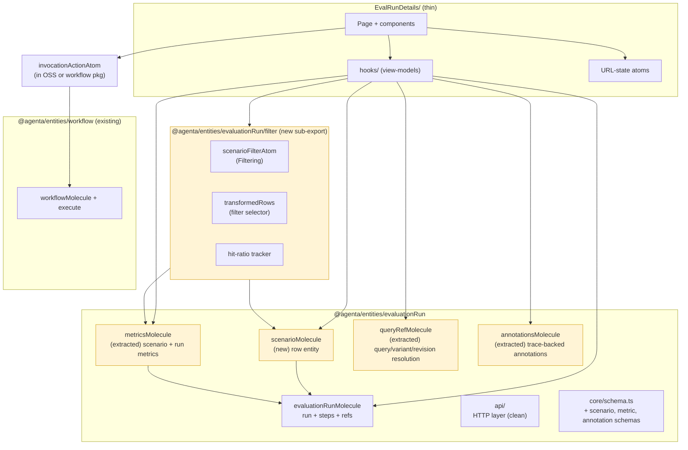

**Yellow boxes are net-new or extracted-from-OSS surfaces** that must live in the package for the filter RFC to land cleanly. Everything else stays where it is or moves trivially.

---

## Concern groups

Five concern groups exist in the current eval data layer. Each maps to one molecule in the target.

| # | Concern | Owns | Current location | Target |
|---|---------|------|------------------|--------|
| 1 | **Run** | Run identity, status, steps, mappings, refs | `evaluationRunMolecule` (partial) + `table/run.ts` | `evaluationRunMolecule` (cleanup) |
| 2 | **Scenarios** | Row entity, windowing, pagination, status | `table/scenarios.ts`, `evaluationPreviewTableStore.ts`, `tableRows.ts` | `scenarioMolecule` (new) |
| 3 | **Metrics** | Per-scenario + per-run materialized values, aggregation, flattening | `metrics.ts`, `runMetrics.ts`, `metricProcessor.ts`, `scenarioColumnValues.ts` | `metricsMolecule` (extracted) |
| 4 | **Annotations** | Trace-backed annotations, normalization, batching | `annotations.ts`, `traces.ts` | `annotationsMolecule` (extracted) |
| 5 | **Query refs** | Query / variant / revision reference resolution | `query.ts`, `references.ts`, `variantConfig.ts` | `queryRefMolecule` (extracted; some pieces may belong in `@agenta/entities/workflow`) |

A sixth concern, **invocation orchestration** (`runInvocationAction.ts`), is not a molecule — it's an action that consumes molecules. It belongs in OSS as a thin orchestrator, but its dependency on `@agenta/playground` is wrong. Either lift the executor into `@agenta/entities/workflow` (preferred — execution is workflow-shaped) or create a tiny `@agenta/entities/workflowRunner` package.

### Concern dependency graph

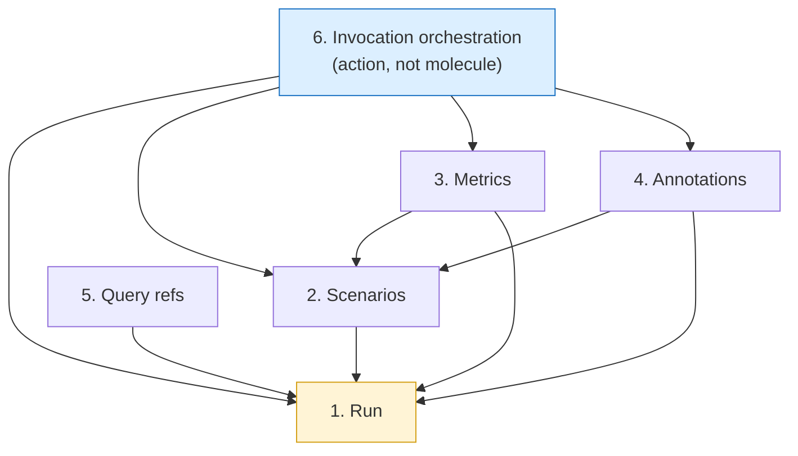

Arrows are "depends on / reads from." Run is the root yellow because everything resolves a run first. Invocation orchestration is blue because it's an action layer, not a state layer, and it sits on top of all five molecules.

---

## Package boundary

What lives where, in one table:

| Layer | Lives in | Examples |
|-------|----------|----------|
| **HTTP client** | `@agentaai/api-client` (Fern-generated) | Endpoint stubs |
| **Domain schemas + types** | `@agenta/entities/evaluationRun/core/` | `EvaluationRun`, `EvaluationScenario`, `EvaluationMetric`, `Filtering` (re-export) |
| **HTTP wrappers + batchers** | `@agenta/entities/evaluationRun/api/` | `queryEvaluationRuns`, `queryScenarios`, `queryMetrics`, batch fetchers |
| **State (molecules)** | `@agenta/entities/evaluationRun/state/` | `evaluationRunMolecule`, `scenarioMolecule`, `metricsMolecule`, `annotationsMolecule`, `queryRefMolecule` |
| **Filter primitive** | `@agenta/entities/evaluationRun/filter/` | `scenarioFilterAtom`, `transformedRows`, `hit-ratio tracker`, `applyPredicate` |
| **View-models (hooks)** | `web/oss/src/components/EvalRunDetails/hooks/` | `useScenarioCellValue`, `usePreviewColumns`, `useRunIdentifiers` |
| **UI state (URL, drawers, prefs)** | `web/oss/src/components/EvalRunDetails/state/` | `previewEvalTypeAtom`, `urlCompare`, `rowHeight` |
| **Components** | `web/oss/src/components/EvalRunDetails/components/` | `Page`, `Table`, `Cells`, `Drawers` |
| **Actions / orchestrators** | OSS thin layer | `runInvocationAction` (dep flipped to `@agenta/entities/workflow`) |

**Test:** if a piece of logic could be unit-tested without rendering any React, and could be used by a non-EvalRunDetails consumer (e.g. a CLI, a future dashboard, a server-side renderer), it belongs in the package. Most of `metrics.ts` passes this test today; it just isn't in the package yet.

### Layer stack

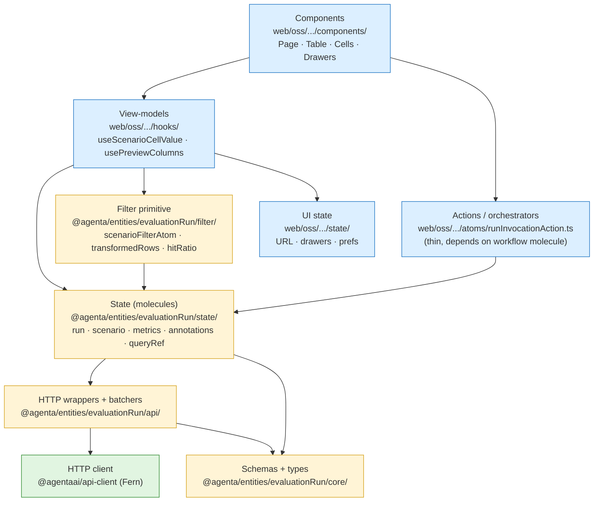

Blue = OSS. Yellow = `@agenta/entities/evaluationRun`. Green = generated HTTP client. Arrows always point downward through the stack — no layer reaches back up. A component can't import an API wrapper directly; it must read through hooks → molecules. This is the discipline that keeps the package re-usable outside `EvalRunDetails/`.

## Conventions to follow

New molecules **must** match the patterns established by [`evaluationRunMolecule`](../../web/packages/agenta-entities/src/evaluationRun/state/molecule.ts). Do not invent. Five conventions, all enforced by the existing code:

### 1. The 4-namespace molecule shape

Every molecule exposes exactly: `selectors` (reactive atom families) + `atoms` (raw store atoms, escape hatch) + `get` (imperative reads) + `cache` (invalidation/refetch). Read-only molecules (the eval ones) skip `set` / `reducers`; those exist on the testcase/testset molecules where a draft surface is needed (see [`testcase`](../../web/packages/agenta-entities/src/testcase/) and [`testset`](../../web/packages/agenta-entities/src/testset/) for the write-supporting variant).

### 2. Batch fetcher for per-entity queries

Use [`createBatchFetcher`](../../web/packages/agenta-shared/src/utils/) from `@agenta/shared/utils`. The pattern in molecule.ts ([lines 63-108](../../web/packages/agenta-entities/src/evaluationRun/state/molecule.ts)) collects per-ID requests, groups by `projectId`, and emits one HTTP call per project per render cycle. Reuse it directly for `scenarioMolecule.atoms.row` and `metricsMolecule.atoms.scenarioMetric` — single-entity reads must be batched, never N+1.

### 3. Imperative `projectId` read with retry

`atomWithQuery` in jotai-tanstack-query v0.11.0 does not re-evaluate its getter on Jotai dependency change after first subscription. So `queryFn` reads `projectIdAtom` imperatively via `getStore().get(projectIdAtom)` and **throws** when unavailable. The query atom uses `retry` to re-attempt once `projectId` resolves. See [lines 125-146](../../web/packages/agenta-entities/src/evaluationRun/state/molecule.ts) for the canonical implementation. Copy it verbatim into new query atoms.

### 4. Zod validation at the HTTP boundary

Every API response runs through `safeParseWithLogging(schema, response.data, "[fnName]")` before returning. Schemas live in `core/schema.ts`. A validation failure logs but does not throw — the function returns `null` or the appropriate empty envelope so callers see "no data" rather than a crash. Pattern in [`api/api.ts:46-51`](../../web/packages/agenta-entities/src/evaluationRun/api/api.ts).

### 5. Equality function for compound atom-family keys

When the atom family key is an object (e.g. `{runId, scenarioId}`), pass a custom equality function as the second argument to `atomFamily`:

```ts
atomFamily(
  ({runId, scenarioId}: Key) => atomWithQuery(...),
  (a, b) => a.runId === b.runId && a.scenarioId === b.scenarioId,
)
```

Without it, every new object literal allocates a new atom family entry. See [lines 384-386, 424-426, 449-450, 471-473](../../web/packages/agenta-entities/src/evaluationRun/state/molecule.ts).

### 6. Pure utils stay outside the molecule

Path extraction, scalar/stats/frequency parsing, leaf shape detection — none of these need Jotai. Put them in `utils/` as pure functions so they can be unit-tested without spinning up a store. The molecule's selectors call into them. This makes the path-resolver (the filter RFC's D2 question) testable in isolation.

### 7. Data presence is a store concern, not a cell concern

**Background.** The IVT today couples data loads to cell rendering via two mechanisms:
- [`createViewportAwareCell`](../../web/packages/agenta-ui/src/InfiniteVirtualTable/columns/cells.tsx) — vertical IntersectionObserver fires `onVisible` when a row enters the viewport. Cells use this to trigger correlated data loads (metric batchers, annotation fetches).
- [`createColumnVisibilityAwareCell`](../../web/packages/agenta-ui/src/InfiniteVirtualTable/columns/cells.tsx) — horizontal column visibility. Off-screen columns return `null` from `render()` and **never subscribe** to molecule selectors, so the cell never triggers a fetch.

**The problem this creates for ETL and derived views.** A filter predicate, a transform inside an ETL pipeline, a `derived.filtered` evaluator — all of these read molecule data **without rendering a cell**. If data presence is gated by cell rendering, these consumers race against viewport state. A user scrolls horizontally, a column scrolls off-screen, its cells stop rendering, and now a predicate reading that column's underlying data sees `null`. Filter results become viewport-dependent, which is wrong.

**The fix.** Move correlated-data prefetch from the cell layer to the **store layer**. The store fires a prefetch hook after every window load, regardless of which cells (if any) end up rendering. Cells become purely decorative — they decide what to draw, never whether data exists.

Add to `createPaginatedEntityStore`'s config:

```ts
interface PaginatedEntityStoreConfig<TRow, TApiRow, TMeta> {
  // ... existing fields (entityName, metaAtom, fetchPage, rowConfig, ...)

  /**
   * Fires after every successful `fetchPage` response, before rows are added
   * to the store. Use to prefetch correlated molecule data that consumers
   * (filter predicates, derived views, ETL transforms) will need.
   *
   * Fire-and-forget: do not await blocking work here. Implementations
   * typically call `molecule.actions.prefetchMany(ids)` for one or more
   * correlated molecules.
   */
  correlatedDataPrefetch?: (rows: TApiRow[]) => void
}
```

Per-molecule, add to the molecule contract:

```ts
metricsMolecule.actions = {
  prefetchMany: (scenarioIds: string[]) => void,  // NEW
  // ...
}
```

`prefetchMany` triggers the molecule's batch fetcher for the given IDs without forcing a subscription. The data arrives, populates the molecule's atoms, and is available to any imperative `get` call from that point forward.

**Consumer ergonomics.** A store config gets prefetchers declared once:

```ts
const scenariosPaginatedStore = createPaginatedEntityStore({
  entityName: "scenarios",
  metaAtom: scenarioMetaAtom,
  fetchPage: async (params) => { ... },
  rowConfig: { getRowId: (s) => s.id, skeletonDefaults },

  // NEW: declare correlated data once. Cells, derived views, ETL pipelines
  // all benefit. No "remember to do this in every consumer" trap.
  correlatedDataPrefetch: (rows) => {
    metricsMolecule.actions.prefetchMany(rows.map((r) => r.id))
    annotationsMolecule.actions.prefetchMany(rows.map((r) => r.id))
  },
})
```

After this, the column-virtualization concern goes away for data correctness. The off-screen column's cells still don't render (a UI win — saves DOM nodes), but the data those cells WOULD render is loaded into molecules regardless. A predicate or transform reading that data succeeds.

**Layering rule:** *cells observe data, they never own it*. The store owns data presence. This is also the seam that makes ETL adapters work — a `makeSource(paginatedStore)` adapter pulls rows; the prefetch has already fired; transforms see populated molecules.

---

## Migration phases

```mermaid
flowchart LR
    subgraph P1 ["Phase 1 — Paginated store + Metrics + Prefetch + AbortSignal plumbing"]
        P1A["1a. scenariosPaginatedStore<br/>(createPaginatedEntityStore)"]
        P1B["1b. metricsMolecule<br/>+ actions.prefetchMany<br/>+ cache.evict / evictMany"]
        P1C["1c. correlatedDataPrefetch hook<br/>+ wire scenarios → metrics"]
        P1D["1d. AbortSignal through<br/>API layer (fetchPage → axios)"]
        P1E["1e. migrate evaluationPreviewTableStore<br/>to scenariosPaginatedStore"]
    end

    subgraph P2 ["Phase 2 — Derived filter primitive"]
        P2A["2a. derived.filtered<br/>on createPaginatedEntityStore"]
        P2B["2b. eager escalation triggers<br/>(hit-ratio + loaded > 10k +<br/>Tier 3 operator)"]
        P2C["2c. wire filter UI<br/>(filter RFC v1 ships)"]
    end

    subgraph P3 ["Phase 3 — Eviction + remaining concerns"]
        P3A["3a. paginated-store eviction<br/>(sliding window, atomFamily cleanup)"]
        P3B["3b. annotationsMolecule extraction"]
        P3C["3c. queryRefMolecule extraction"]
        P3D["3d. split table/run.ts"]
    end

    subgraph P4 ["Phase 4 — Dependency flip + server filter"]
        P4A["4a. lift executeWorkflowRevision<br/>to @agenta/entities/workflow"]
        P4B["4b. runInvocationAction<br/>drops @agenta/playground import"]
        P4C["4c. backend filter param<br/>(filter RFC v2 ships)"]
        P4D["4d. backend join endpoint<br/>(compare-mode v2)"]
    end

    P1A --> P1B
    P1B --> P1C
    P1C --> P1D
    P1D --> P1E
    P1E --> P2A
    P2A --> P2B
    P2B --> P2C
    P2C --> P3A
    P3A --> P3B
    P3B --> P3C
    P3C --> P3D
    P3D --> P4A
    P4A --> P4B
    P4B --> P4C
    P4C --> P4D

    style P1 fill:#fff4d6,stroke:#d4a017
    style P2 fill:#e1f5e1,stroke:#2d8a2d
    style P3 fill:#dcefff,stroke:#1971c2
    style P4 fill:#f0e1ff,stroke:#8a2ddc
```

**Phase 1 is the prerequisite for the filter RFC.** New in this revision: **Phase 1d (AbortSignal plumbing through the API layer)** was elevated from "v2 polish" because mid-flight requests racing against new requests is a real source of jank. **Phase 3a (eviction) was bumped earlier** because the limitations analysis showed cumulative memory growth is the dominant scaling bottleneck — putting eviction in Phase 4+ is too late if the migration ships incrementally. Phases 2-4 still interleave; every phase ships working.

### Phase 1 detail (the load-bearing phase)

**Course correction — use the existing IVT primitive.** Before this RFC was written, a key fact was unknown to the author: `@agenta/entities/shared/paginated/createPaginatedEntityStore` already exists (586 lines, used by `simpleQueue`, `trace`, others). It provides cursor-windowed pagination, skeleton rows, list counts, local-row prepending via `clientRowsAtom`, row-exclusion via `excludeRowIdsAtom`, and selection state. **The "scenarioMolecule" originally proposed here should instead be `scenariosPaginatedStore` built on this existing primitive**, not a new entity-style molecule. Same scope of work, materially different shape.

The cursor model the store uses is verified: server returns `windowing.next` as an opaque string ID; the client passes it back verbatim in the next request's `windowing.next`. No client-side cursor arithmetic. See [`simpleQueue/state/paginatedStore.ts`](../../web/packages/agenta-entities/src/simpleQueue/state/paginatedStore.ts) for the canonical pattern.

**1a. `scenariosPaginatedStore`** in `@agenta/entities/evaluationRun/state/`. A `createPaginatedEntityStore` instance configured for evaluation scenarios. Exposes the standard paginated-store API (rows, columns, cursor, hasMore, totalCount, listCounts, selection) and adds an evaluation-specific correlated-data prefetch:

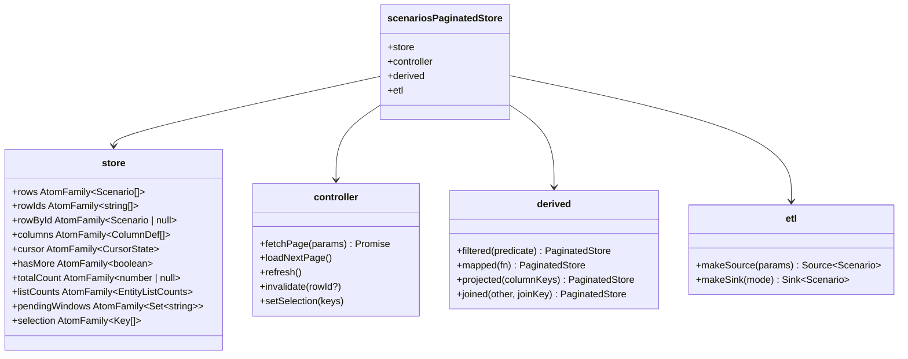

The HTTP layer goes in `api/scenarios.ts` as a sibling to the existing `api/api.ts`: `queryScenarios(params)` and `fetchScenarioById(params)`. Both run through `safeParseWithLogging` (Convention 4). `queryScenarios` accepts `windowing.next` as the opaque cursor string per the verified pattern.

The `derived` and `etl` namespaces are **new additions to `createPaginatedEntityStore` proposed by this RFC** (the existing factory has none today). See "Conventions to follow" → Convention 7 for the prefetch hook that backs them. The four `derived.*` operations and the two `etl.*` adapters are all thin sugar over the base store's atoms — none invents new mechanisms.

`evaluationPreviewTableStore.ts` becomes a thin adapter that reads from `scenariosPaginatedStore.store.rows(...)` and maps to its existing `PreviewTableRow` shape. No behavior change visible to users.

**1b. `metricsMolecule`** extracts `metrics.ts` (953 lines) + `runMetrics.ts` + `metricProcessor.ts`. Cleanly split:

```mermaid
classDiagram
    class metricsMolecule {
        +selectors
        +atoms
        +get
        +cache
    }
    class selectors {
        +scenarioMetric(scenarioId) AtomFamily~MetricData~
        +runMetric(runId) AtomFamily~RunMetricData~
        +flatPath({scenarioId, fieldPath}) AtomFamily~unknown~
        +rawNested({scenarioId, stepKey}) AtomFamily~object~
        +columnValue({scenarioId, columnKey}) AtomFamily~CellValue~
    }
    class atoms {
        +scenarioMetric (raw scenarioMetricQueryAtomFamily)
        +runMetric (raw runMetricQueryAtomFamily)
    }
    class get {
        +scenarioMetric(scenarioId) imperative
        +flatPath(scenarioId, fieldPath) imperative
    }
    class cache {
        +invalidate(scenarioId)
        +invalidateRun(runId)
        +refreshScenario(scenarioId) Promise
        +refreshRun(runId) Promise
    }
    class actions {
        +prefetchMany(scenarioIds) void
        +prefetchRun(runId) void
        +ensureLoaded(scenarioId) Promise~MetricData~
    }
    metricsMolecule --> selectors
    metricsMolecule --> atoms
    metricsMolecule --> get
    metricsMolecule --> cache
    metricsMolecule --> actions
```

Sibling supporting files (NOT inside the molecule class — separate exports so they can be unit-tested without Jotai):

- `api/metrics.ts` — `queryMetrics(params)`, `refreshMetrics(runId, scope)` HTTP wrappers
- `core/metricSchema.ts` — Zod schemas for metric value shapes (scalar, stats, frequency, legacy `{value: ...}` leaf)
- `utils/extract.ts` — `extractScalar`, `extractStats`, `extractFrequency`, `matchPath(data, fieldPath)` (pure, testable)

`selectors.flatPath` is the thing the filter primitive reads. Defining it during extraction (not after) avoids two refactors. `utils.matchPath` is the unified path resolver from decision D2.

**1c. Migrate `evaluationPreviewTableStore.ts`** to call into molecules. The data flow before and after:

```mermaid
sequenceDiagram
    participant VT as V-table
    participant Store as evaluationPreviewTableStore
    participant Atom as tableScenarioRowsQueryAtomFamily<br/>(OSS atom)
    participant AtomM as evaluationMetricBatcherFamily<br/>(OSS atom)
    participant API as axios.post

    rect rgb(255, 220, 220)
        Note over VT,API: Before — OSS atoms own everything
        VT->>Store: read rows window
        Store->>Atom: fetch(cursor, limit)
        Atom->>API: POST /evaluations/scenarios/query
        API-->>Atom: rows
        Atom-->>Store: rows
        Store-->>VT: PreviewTableRow[]

        VT->>AtomM: read visible metrics
        AtomM->>API: POST /evaluations/metrics/query
        API-->>AtomM: metrics
        AtomM-->>VT: metric cells
    end

    rect rgb(220, 255, 220)
        Note over VT,API: After — paginated store owns data + prefetch; cell reads are decorative
        VT->>Store: read rows window
        Store->>Atom: scenariosPaginatedStore.store.rows(scopeId)
        Atom->>API: paginatedStore.fetchPage (queryScenarios)
        API-->>Atom: rows + windowing.next
        Atom-->>Store: Scenario[]
        Note over Atom: correlatedDataPrefetch fires:<br/>metricsMolecule.actions.prefetchMany(ids)<br/>annotationsMolecule.actions.prefetchMany(ids)
        Store-->>VT: PreviewTableRow[] (adapted shape)

        VT->>AtomM: metricsMolecule.selectors.scenarioMetric(id)
        Note over AtomM: data already loading from prefetch<br/>cell visibility no longer gates fetch
        AtomM-->>VT: metric cells
    end
```

Red is the current path. Green is post-Phase-1. Two critical differences from the original draft:

1. **Cell visibility no longer gates data presence.** `correlatedDataPrefetch` fires immediately when scenarios arrive — metrics, annotations, and other correlated data start loading before any cell decides to render. Horizontal column virtualization no longer creates phantom-empty data for off-screen columns.
2. **The store IS the molecule.** What was originally proposed as `scenarioMolecule.selectors.window` is just `scenariosPaginatedStore.store.rows` — the existing `createPaginatedEntityStore` already provides this.

`evaluationPreviewTableStore` survives as a thin row-shape adapter (and may be deleted in Phase 2 if it stops earning its weight).

### Phase 2 — Derived filter primitive (extension to createPaginatedEntityStore)

Lives **inside** `@agenta/entities/shared/paginated/` as an extension to the existing factory, not as a new sub-export. Adds a `derived` namespace returning new `PaginatedEntityStore` views:

```ts
// New surface on createPaginatedEntityStore's return value:
paginatedStore.derived.filtered(predicate)     // → PaginatedEntityStore<Row>
paginatedStore.derived.mapped(rowFn)           // → PaginatedEntityStore<NewRow>
paginatedStore.derived.projected(columnKeys)   // → PaginatedEntityStore<Row>
paginatedStore.derived.joined(otherStore, key) // → PaginatedEntityStore<JoinedRow>
```

Each `derived.*` returns a new store with the same API. They compose. The base store's cursor advances drive the derived view's window resolution — no new cursor concept. Hit-ratio escalation lives in `derived.filtered`: when matched/scanned ratio drops below a threshold over N windows, it swaps the underlying base's `fetchPage` for a server-filtered variant. The wire format is the same `Filtering` from the filter RFC.

Filter atom + applyPredicate pure function still live as small helpers, but they plug into `derived.filtered` rather than living in a separate sub-export. Reuses the existing scopes, atoms, and listCounts. Hit-ratio and the predicate are the only net-new state.

#### Cross-entity filter schemas (the `FilterSchema` contract)

`derived.filtered(predicate)` doesn't enforce per-entity validity on its own — that's the job of the **filter schema** each entity provides. The schema declares which fields are filterable, their types, allowed operators, and tier classification (see [eval-filtering.md D4](./eval-filtering.md#d4-filter-schema-and-field-declarations) for the canonical eval example).

Folder structure:

```
@agenta/entities/shared/paginated/
├── filter/
│   ├── types.ts                  FilterSchema, FilterFieldSchema, FilterFieldType,
│   │                             FilterFieldMeta, FilterOperator
│   ├── validate.ts               validateFilteringAgainstSchema(filter, schema)
│   ├── tier.ts                   predicateMaxTier(filter, schema)
│   └── index.ts
└── derived/
    └── filtered.ts                consumes a FilterSchema when constructing the view

@agenta/entities/{evaluationRun, testset, tracing, ...}/etl/
└── filterSchema.ts                build*FilterSchema(...) — per-entity schema builders
                                   (static + dynamic fields, evaluator output mapping, etc.)
```

The general types + validator + tier walker live in `shared/paginated/filter/`. Each entity writes its own schema builder that:

1. Declares **static fields** (status, timestamp, identity columns)
2. Declares **dynamic fields** when they depend on runtime context (e.g. eval's per-evaluator metric fields, observability's per-span-attribute fields, testset's per-column fields)
3. Wires up the `resolve` callback that reads field values from the row + Jotai store at predicate eval time

Construction flow:

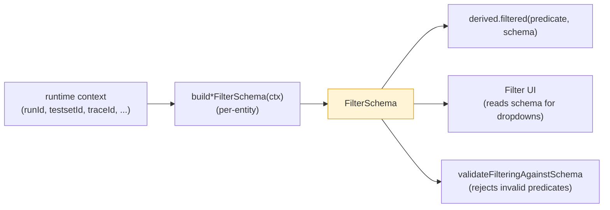

The same schema drives **UI rendering**, **predicate validation**, **tier classification for escalation**, and **runtime field resolution**. One source of truth per entity per context.

**Why this lives at the shared layer (not the engine):** filter is one specific transform. The engine knows nothing about fields or types. The `derived` namespace is where filter (and map, project, join) compose with schema declarations. Other transforms will follow the same pattern as they're built out — each will get its own schema type (`ProjectionSchema`, `MapSchema`, etc.) following the precedent set by `FilterSchema`.

### Phase 3 detail — Eviction first

**Phase 3a — Sliding-window eviction.** The paginated store accumulates rows without bound today. After a long session on a 100k-row table the resident set is gigabyte-scale. Eviction is no longer "optional v2 polish"; it's a P3 deliverable.

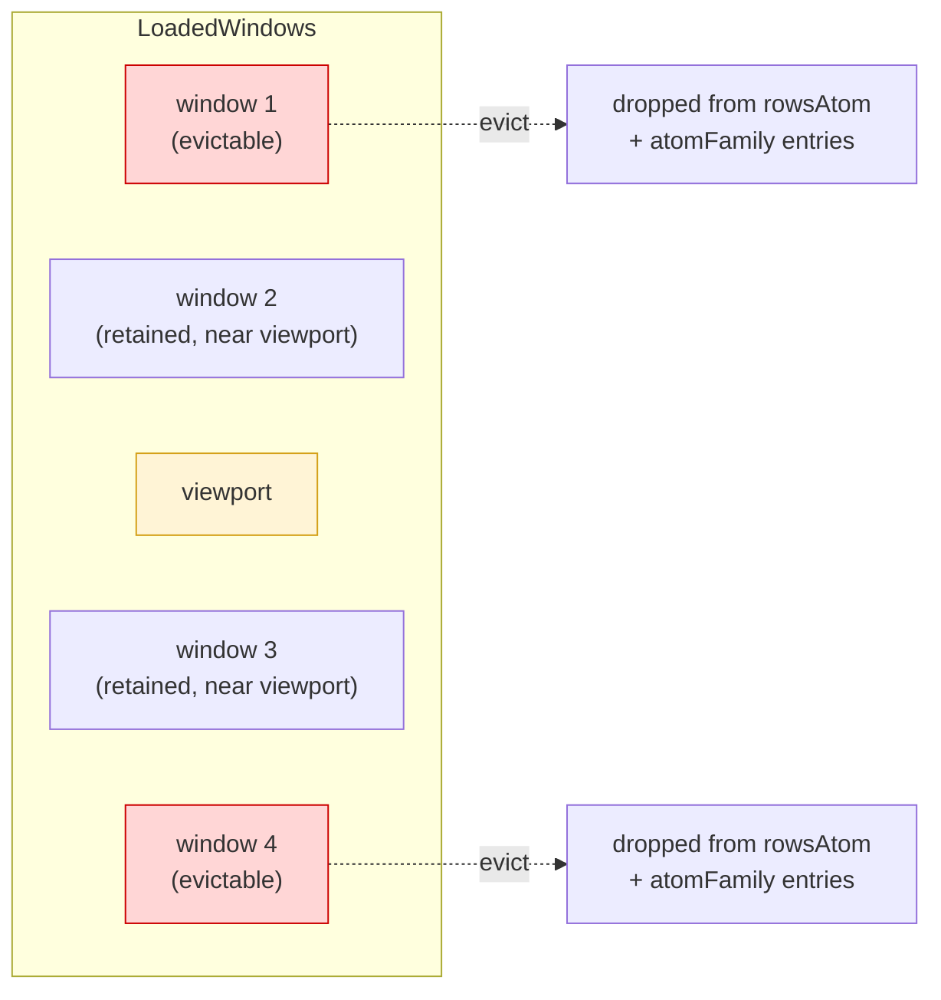

Eviction policy:

- Keep **N=3 windows** above and below the visible viewport (configurable per-store).
- Drop everything else.
- **Survivors regardless of position:** rows with `__isDirty: true` (uncommitted edits), the active row (`selection.activeRowId`), explicitly pinned IDs.
- When dropping a row from the store, **also drop its atom-family entries** in correlated molecules. This is the part most easily forgotten and most damaging when forgotten.
- Scrolling back to a dropped window re-fetches it (skeleton during re-fetch).

Required additions to molecule contracts:

```ts
metricsMolecule.cache.evict(scenarioId)            // single
metricsMolecule.cache.evictMany(scenarioIds)       // batch
annotationsMolecule.cache.evict(scenarioId)        // ditto
```

`atomFamily.remove(key)` (Jotai-family API) drops the cached atom; the next read recreates it.

### Phase 3b-d — Remaining concerns

Lower priority but worth doing while the architecture is fresh:

- `annotationsMolecule` extracts the trace normalization + batch fetcher pattern out of `annotations.ts`
- `queryRefMolecule` consolidates `query.ts` + `references.ts` + `variantConfig.ts` into one resolver. Some of this may belong in `@agenta/entities/workflow` rather than `evaluationRun` — depends on whether query refs are eval-specific or shared with playground.
- `runInvocationAction.ts` drops the `@agenta/playground` import once `executeWorkflowRevision` is hoisted to `@agenta/entities/workflow`. This is the right home — execution is a workflow concern, not a playground concern.

#### The dependency flip (Phase 4a-b)

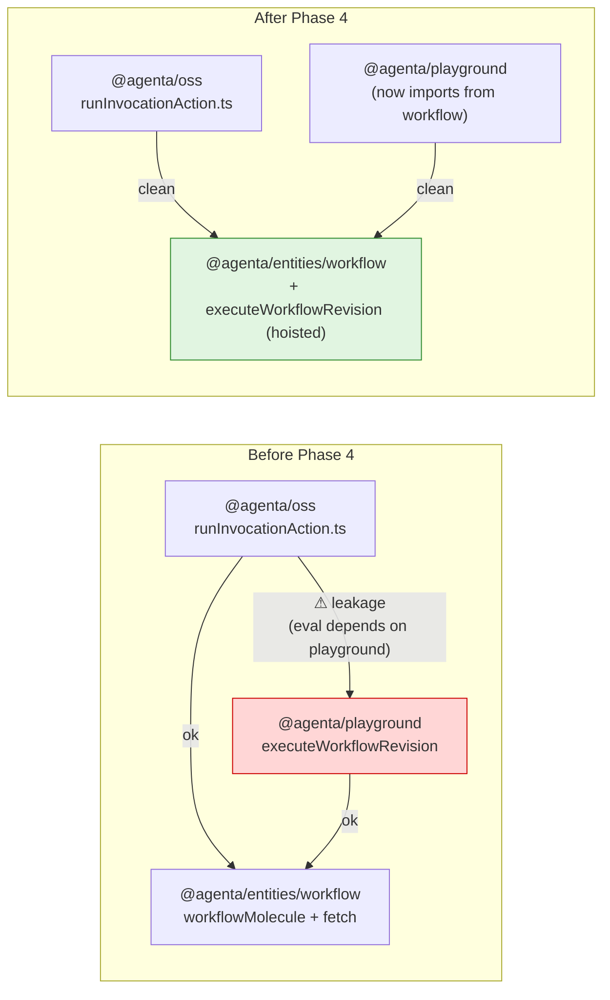

Two consumers of `executeWorkflowRevision` (evaluations + playground) become two consumers of the same function in its correct home. The shared dependency is now `workflow`, which is where workflow-shaped code belongs. Playground's public API doesn't shrink, it just re-exports from workflow if needed.

---

## How filtering plugs in

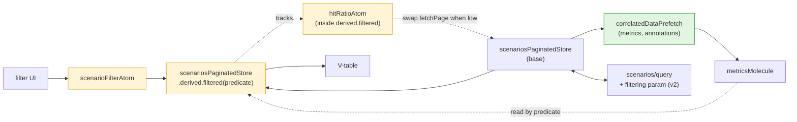

The filter primitive composes the base paginated store with `metricsMolecule` (read by the predicate). It doesn't know about React, the V-table, or the API client. The V-table reads from `derived.filtered`. The API client is hit only through the base store's `fetchPage`. Each piece is testable in isolation. The green prefetch box is what makes this work in the presence of horizontal column virtualization — data is loaded before any cell decides to render.

When v2 lands, the only thing that changes is `scenarioMolecule.selectors.window` learns to pass a `filtering` payload to the API. The filter primitive becomes a no-op for server-filtered windows. The UI doesn't change. The V-table doesn't change. That is the architectural payoff.

---

## Limitations and required discipline

Honest scope of this architecture. The design holds for small-to-medium runs; medium-to-large runs require discipline; very-large runs need server-side work this RFC does not commit to.

### What's bounded

- **Loop runtime memory** — bounded by chunk size (one chunk in flight)
- **Network calls per chunk** — bounded to one batched call per correlated molecule, regardless of column visibility (Convention 7 prefetch)
- **Backpressure** — natural via `await sink.load()` for write sinks
- **Cancellation through pipeline body** — `signal.aborted` checked between chunks

### What's NOT bounded by default

- **Cumulative paginated store memory** — without eviction (Phase 3a), `rowsAtom` grows linearly with `fetchPage` calls
- **AtomFamily entries** — without `cache.evict*` (Phase 3a), per-entity atoms persist for the session
- **TanStack Query cache** — `gcTime` defaults to 5 min but stale entries within that window stay resident
- **Mid-flight HTTP requests** — without Phase 1d (AbortSignal plumbing through axios), cancelling a pipeline doesn't cancel its inflight network requests; old responses can update atoms after cancellation, racing against newer fetches

### Sizing expectations

Estimated resident memory after scrolling through N scenarios with default settings (no eviction):

| Scrolled rows | Row data | Metric blobs | Atom-family overhead | Total resident |
|---|---|---|---|---|
| 1,000 | ~200 KB | ~1 MB | ~2 MB | ~3 MB |
| 10,000 | ~2 MB | ~10 MB | ~20 MB | ~32 MB |
| 50,000 | ~10 MB | ~50 MB | ~100 MB | ~160 MB |
| 100,000 | ~20 MB | ~100 MB | ~200 MB | ~320 MB |
| 500,000 | ~100 MB | ~500 MB | ~1 GB | ~1.6 GB (browser dies) |

The Phase 3a eviction policy caps resident memory to **(N_windows × 2 × chunk_size × row_size)** instead of growing with cumulative scroll. For N=3 above/below, chunk=200, row=~1 KB combined: ~2.4 MB resident regardless of how far the user has scrolled. Plus the survivors (dirty / pinned / active row).

### Chunk size selection — the RTT vs over-fetch trade-off

Choosing chunk size for a paginated store is a real architectural decision, not an arbitrary default. The trade-off:

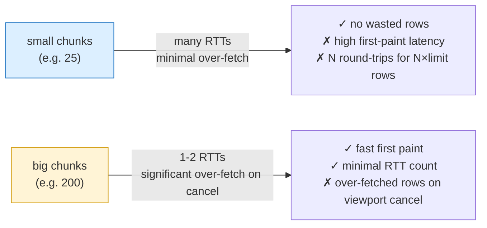

Three forces:

1. **First-paint latency.** Time to fill the visible viewport. Big chunks fill it in fewer RTTs; small chunks need more.
2. **Over-fetch.** When viewport-driven cancellation fires, the last chunk that triggered cancellation was already in flight. Big chunks mean larger "wasted" rows in that last request.
3. **Backend cost.** Large chunks consume more server resources per request (query memory, serialization) but reduce total request count.

#### Measured trade-off (PoC, real backend, 300-scenario eval run, 100% hit ratio)

| Chunk size | Viewport target | Chunks before stop | Rows fetched | Over-fetch | RTTs | **Rows per RTT** | **Scan rate** | First-paint |
|---|---|---|---|---|---|---|---|---|
| 25 | 200 matches | 8 | 200 | 0 | 8 | 25 | 477 rows/sec | ~42 ms (chunk 1) + 7×10 ms = ~110 ms |
| 200 | 20 matches | 1 | 200 | 180 (9× viewport) | 1 | 200 | **3612 rows/sec** | ~74 ms |
| 1000 | 20 matches | 1 (estimated) | 1000 | 980 (49× viewport) | 1 | 1000 | ~5000 rows/sec | ~150 ms (larger payload) |

**Rows per RTT is the load-bearing metric**, not rows per second. Same data, same backend — moving from chunk_size=25 to chunk_size=200 yields a **7.5× scan rate** improvement while paying only 180 wasted rows. That's RTT amortization: each HTTP round-trip costs ~10-50 ms (connection setup + server query + response), regardless of payload size. Big payloads spread that cost over more rows.

The architecture's recommendation: **size chunks for rows-per-RTT, not rows-per-second.** The two metrics diverge when chunks are small (high RTT count) and converge when chunks are big (low RTT count). For all viewport-driven UI consumers, prefer the regime where rows-per-RTT is high.

Notice: chunk_size=200 with viewport=20 over-fetches **9× viewport size**. The cost is bounded — at most one chunk's worth beyond the viewport target — but real. At 500 bytes per scenario, that's ~90 KB of "wasted" network traffic per filter operation.

#### Recommended sizing per consumer pattern

| Use case | Expected hit ratio | Suggested chunk size | Rationale |
|---|---|---|---|
| Unfiltered scenario list | 100% | viewport size × 2 | Fill viewport in 1 RTT, accept moderate over-fetch |
| High-hit-ratio filter (>50%) | 50-100% | viewport size × 2 | Same — over-fetch acceptable for fewer RTTs |
| Low-hit-ratio filter (10-50%) | 10-50% | viewport size × 4 | Compensate for filter shrinkage — need more raw rows |
| Very-low-hit-ratio filter (<10%) | <10% | force v2 server escalation | Client-side wasteful; escalate per filter RFC C3 |
| Bulk export / no viewport | n/a (full scan) | 500-1000 | Maximize per-RTT efficiency; no over-fetch concern |
| ETL pipeline (no viewport) | n/a | 500-1000 | Same — full-stream consumers don't waste anything |

The current `evaluationPreviewTableStore` default of `chunk_size=200` works for typical V-table viewports (20-50 visible rows) at the cost of moderate over-fetch on viewport-fill cancellation. **Not a default to over-think; just one with a knowable cost.**

#### What this means for filter UX

The over-fetch cost is bounded and small per individual filter operation, but it multiplies under interactive use. A user typing characters in a filter input (even with 250ms debounce) may fire 3-5 filter operations per keystroke session. At chunk_size=200 with viewport=20, each operation costs ~90 KB of wasted network traffic. Over a 10-character filter input session, that's ~1 MB of waste.

Two mitigations:

1. **Reduce chunk_size for filter mode** — when a filter is active, the paginated store could halve its chunk size (down to ~100). Trade some RTTs for less waste.
2. **Server-filter escalation** — at sufficient row counts (>10k loaded — see filter RFC C3), the engine switches to v2 backend filtering, which avoids the trade-off entirely (server returns only matched rows).

The architecture supports both; the consumer (filter UI) chooses.

### Required disciplines from the filter RFC

These are mandatory at the consumer level — they're not optional optimizations:

| Discipline | Where enforced | Source |
|---|---|---|
| Debounce filter input (≥ 250ms) | Filter UI wrapping `scenarioFilterAtom` writes | [eval-filtering.md C1](./eval-filtering.md#c1-mandatory-debounce-on-scenariofilteratom-writes) |
| Restrict to Tier 1/2 operators client-side | Filter UI surfaces only safe operators | [eval-filtering.md C2](./eval-filtering.md#c2-predicate-operator-tiers) |
| Eager v2 escalation (3 triggers) | `derived.filtered` swap logic | [eval-filtering.md C3](./eval-filtering.md#c3-eager-v2-escalation-not-just-hit-ratio-based) |
| Background tab pause | Loop engine wraps `AbortSignal` with visibility | [eval-etl-engine.md](./eval-etl-engine.md) |
| AtomFamily eviction in lockstep with row eviction | Paginated store eviction policy | Phase 3a here |

### What the design doesn't fix

- **Server-side aggregations.** A run with 5M scenarios viewed for "show me the worst 10 by some metric" needs sorted server-side queries with proper indexes. This RFC trio doesn't commit to that.
- **Cross-table joins beyond compare-mode.** Joining a run with a testset, or two queries with a run, etc. The `derived.joined` primitive is sized for the compare-mode use case (two runs of bounded similar shape) — generalizing is downstream work.
- **Real-time streaming.** The cursor model is pull-based snapshot pagination. Live evaluation streams (annotations arriving in real time) need a separate push-based source primitive (WebSocket/SSE adapter to the loop). Future RFC, not this one.
- **Offline / resume.** AsyncIterable cursors can resume if the source's cursor model supports it, but there's no built-in checkpoint/replay machinery. Pipeline restart from arbitrary cursor is a v2 feature.

Make these explicit so downstream consumers don't expect them. If a use case actually needs one of these, that's a signal to write a follow-up RFC, not to hack it into this trio.

---

## Future improvements (not v1, but designed)

Two improvements that earned design thinking but didn't earn their way into v1 phases. Captured concretely so when scale forces them, the shape is already worked out.

**Related future improvements in the filter RFC:**
- [F1. Skip-ahead UX on filter transitions](./eval-filtering.md#f1-skip-ahead-ux-on-filter-transitions) — preserve scroll position when applying / changing filters
- [F2. Predicate explain mode](./eval-filtering.md#f2-predicate-explain-mode-dev-tool) — dev tool measuring per-row predicate cost; informs Tier classification with real data

These address UX and observability of filtering; F1 and F2 below address the cost of evaluation itself.

### F1. Worker-thread predicate evaluation

**Problem.** Even with debouncing, client-side predicate evaluation on 10k+ rows × Tier 2 operators blocks the main thread. The eval itself is CPU-bound; debouncing only batches keystrokes, doesn't speed up the eval.

**Why naive worker offloading fails.** First instinct is "ship rows to a worker, run predicate there." Two reasons this doesn't work cleanly:

1. **Structured-clone cost.** Sending 10k row objects (with 10KB metric blobs each) across the worker boundary via `postMessage` is roughly memcpy-equivalent. Serialization + deserialization on both ends can cost more than the eval it's meant to save.
2. **Atom layer is unavailable.** Workers can't access Jotai's store. A transform reading `metricsMolecule.get.scenarioMetric(id)` doesn't work in worker context — the data has to be pre-shipped.

**Design — snapshot-based, ship-once.** The worker holds **denormalized row snapshots**: flat objects containing exactly the fields any predicate might reference. Data ships once per chunk load; predicate changes only ship the predicate.

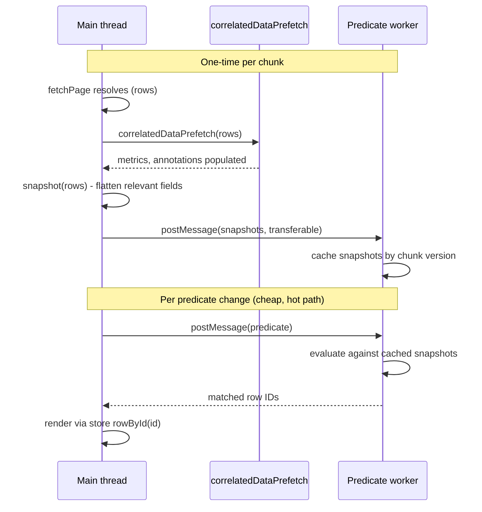

**Snapshot construction:**

```ts
// At store-config time, declare what fields might be in predicates:
createPaginatedEntityStore({
  ...,
  workerPredicate: {
    enabled: true,
    snapshotShape: (row, store) => ({
      id: row.id,
      status: row.status,
      timestamp: row.timestamp,
      metrics: {
        correctness: metricsMolecule.get.scenarioMetric(row.id)?.correctness?.value,
        cost: metricsMolecule.get.scenarioMetric(row.id)?.cost?.value,
        // declared paths only; predicate can only reference these
      },
    }),
  },
})
```

The `snapshotShape` is the **predicate field schema** for that store. Predicates that reference fields outside the schema fail validation client-side before they reach the worker — explicit error, "your predicate references `metrics.outputs.body` but this store's worker schema doesn't include it; either add it to snapshotShape or force server-side eval."

**Cache invalidation:** snapshots are versioned per chunk. When a chunk's rows or correlated data updates (e.g. metric refresh), the snapshot ships again with a higher version. The worker drops old versions.

**When to enable:**
- Per-store opt-in (default off)
- Recommended when expected loaded row count > 5k AND predicates are non-trivial
- Mandatory when row count > 20k (otherwise main thread dies under tier-2 predicate changes)

**Performance comparison (expected):**

| Strategy | 10k rows, simple predicate | 10k rows, Tier 2 predicate |
|---|---|---|
| Main thread (v1) | ~50 ms blocking | ~500 ms blocking (jank) |
| Worker (this RFC) | ~80 ms total (clone + eval + result) | ~150 ms total |
| Worker (snapshots cached) | ~5 ms (predicate ship only) | ~20 ms |

The cache makes the worker pay off **after the first eval** — every subsequent predicate change is fast.

**Cost to add when ready:** ~300 lines split between worker bootstrap, snapshot shape, message protocol, and derived integration. Probably a single PR.

### F2. Memoized derived results

**Problem.** Users toggle filters on and off, switch between A/B configurations, undo and redo. Each toggle re-evaluates the predicate over all loaded rows. For repeated predicates the second eval is the exact same work as the first.

**Design.** Per-derived-view LRU cache keyed by predicate hash. Stores matched row IDs (small) keyed by predicate identity (also small).

```mermaid
flowchart LR
    P1["predicate A<br/>(applied)"]
    Cache["LRU cache<br/>maxEntries: 10<br/>key: predicateHash<br/>value: Set~rowId~"]
    P2["predicate B<br/>(applied)"]
    P1Back["predicate A<br/>(re-applied)"]

    P1 -->|eval, store result| Cache
    P2 -->|eval, store result| Cache
    P1Back -->|hash match!<br/>O(1) lookup| Cache

    style Cache fill:#fff4d6,stroke:#d4a017
```

**Concrete shape:**

```ts
paginatedStore.derived.filtered(predicate, {
  cache: {
    maxEntries: 10,                          // LRU size; bounded memory
    invalidation: "base-rows-change",         // | "any-data-change" | "manual"
  },
})
```

**Cache invalidation events:**

| Event | Should invalidate? | Why |
|---|---|---|
| Base store loads a new chunk | Yes (partially — new rows may match cached predicates) | New rows need predicate eval; old matches still valid |
| Base store evicts a window | Yes (cached entries with evicted IDs become stale) | Pruning |
| Correlated molecule data updates (e.g. metric refresh) | Conditional — only if cached predicate references that data | Hard part: knowing which |
| Predicate atom changes to a different predicate | No (cache it as a new entry) | Normal flow |
| User explicitly refreshes | Yes (invalidate all) | Manual flush |

**The hard part: conditional invalidation.** A cached predicate evaluation on a metric path is invalid if that metric refreshes. Knowing "this cached entry references `metrics.correctness`" requires the cache to track field-path dependencies per entry.

Two implementations:
1. **Coarse:** invalidate all entries on any correlated-molecule update. Simple, but cache becomes useless during active sessions.
2. **Fine-grained:** parse predicate's referenced field paths at insert time; track per-cache-entry field-path set; invalidate only entries that depend on the updated path. More complex but cache stays useful.

v1 of memoization should ship **coarse** (simpler, still beats no cache). Promote to fine-grained when users complain about cache misses on partial refreshes.

**Versioning:** each cache entry carries the version of the data it was computed against:

```ts
interface CacheEntry {
  predicateHash: string
  matchedIds: Set<string>
  computedAt: {
    baseRevision: number
    correlatedRevisions: Map<string, number>  // moleculeName → revision
  }
}
```

On read, the cache compares current revisions to the entry's. Mismatch → invalidate that entry, re-eval.

**Memory bound:** `maxEntries × avg(matched_ids.size)` — for 10 entries × 500 average matches × 36 bytes per ID = ~180 KB. Negligible.

**When to enable:** by default on `derived.filtered` for any store. The cache pays for itself after the first toggle.

**Cost to add when ready:** ~150 lines. The revision-tracking is the trickiest part; the cache mechanics are routine.

### Interaction between F1 and F2

The two improvements compose well. The worker's snapshot cache (F1) IS a form of memoization at the data layer; the LRU result cache (F2) is memoization at the result layer. They live at different boundaries and don't conflict:

- **Snapshot cache** (worker-side): keyed by chunk version, holds flattened row data
- **Result cache** (main-thread-side): keyed by predicate hash, holds matched IDs

When both are enabled, a repeat predicate hits the result cache without even shipping a message to the worker. The worker handles novel predicates; the cache handles repeats. Both fall through cleanly when the chunk version changes.

### Why these are F-level (future), not P-level (phased)

Neither is needed for the v1 filter to work correctly. They're optimizations for cases the v1 design **handles correctly but slowly**:

- v1 with discipline (debounce, tier restriction, eager escalation): correct, sometimes slow
- v1 + F1 (worker): correct, fast for large loaded sets
- v1 + F2 (memoization): correct, fast for repeated predicates

They're additive, not replacements. Ship v1 first; add F1 and F2 when profiling shows the user pain.

---

## What this is NOT

- **Not a rewrite.** Each phase keeps the existing table working. No "land on a branch for 3 weeks" cutover.
- **Not a new package.** Everything goes into the existing `@agenta/entities/evaluationRun`. We are filling out a half-built package, not creating a sibling.
- **Not a fight with the playground.** The one dependency flip (`executeWorkflowRevision` → `@agenta/entities/workflow`) is straightforward; everything else leaves playground alone.
- **Not a DSL invention.** Filter spec is the existing `Filtering` from tracing. See [eval-filtering.md](./eval-filtering.md).

---

## Open questions

1. **`queryRefMolecule` location.** Query refs are used by evaluations (resolve a query revision to its config) and by playground (run a query). Does it live in `@agenta/entities/evaluationRun`, `@agenta/entities/workflow`, or a new `@agenta/entities/query`? Decision affects Phase 3 boundaries.

2. **`evaluationPreviewTableStore.ts` long-term role.** Phase 1c makes it a thin adapter. Should it survive at all, or should the V-table read molecules directly? Adapter has value (one place to keep `PreviewTableRow` shape), but it's also a layer that won't pull its weight forever. Defer decision to end of Phase 1.

3. **Annotation entity scope.** `annotations.ts` reads from `/simple/traces/query`, not an evaluation-specific endpoint. Is the right home `@agenta/entities/annotation` (new, shared with future annotation surfaces), or stays under `evaluationRun` until a second consumer appears? Lean toward "stay under evaluationRun" until proven shared.

4. **Cross-feature execution dependency.** Phase 4a (lift `executeWorkflowRevision`) needs a maintainer signoff from whoever owns playground. The function exists there for a reason; flipping it is straightforward technically but is a coordination question.

5. **Backwards-compat shims during migration.** Phase 1 leaves `metrics.ts`, `query.ts`, etc. in place as re-exports for one release cycle, then deletes. Or do we cut over hard? The web monorepo is one package; the API surface is internal; we can probably cut hard if commits land atomically.

---

## What I'd commit to before code

Two decisions, before Phase 1a starts:

- **D1.** `scenarioMolecule.selectors.row(scenarioId)` returns `{scenario, results, metrics}` together (fully materialized) **or** just `scenario` with metric/result access on separate selectors. Affects the shape of every consumer. Lean toward separate — the filter primitive specifically wants to filter on metrics without materializing results, and a unified shape blocks that optimization.

- **D2.** Whether `metricsMolecule.selectors.flatPath(scenarioId, path)` is the path-resolution primitive for both filter eval AND the existing cell-value lookup (which today uses suffix matching, canonicalization, and nested lookup). Unifying them means one path resolver, one set of edge cases. Splitting them means the filter has clean semantics but the legacy cell lookup keeps its quirks. Lean toward unifying — the filter RFC's field-path convention should be the canonical one.

Both are reversible but expensive to flip after Phase 1 ships.
