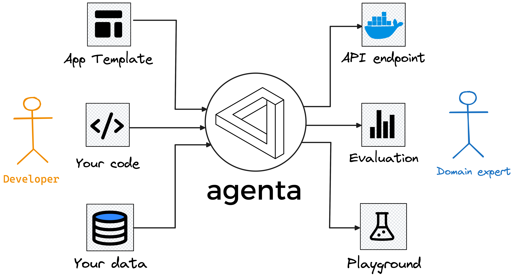
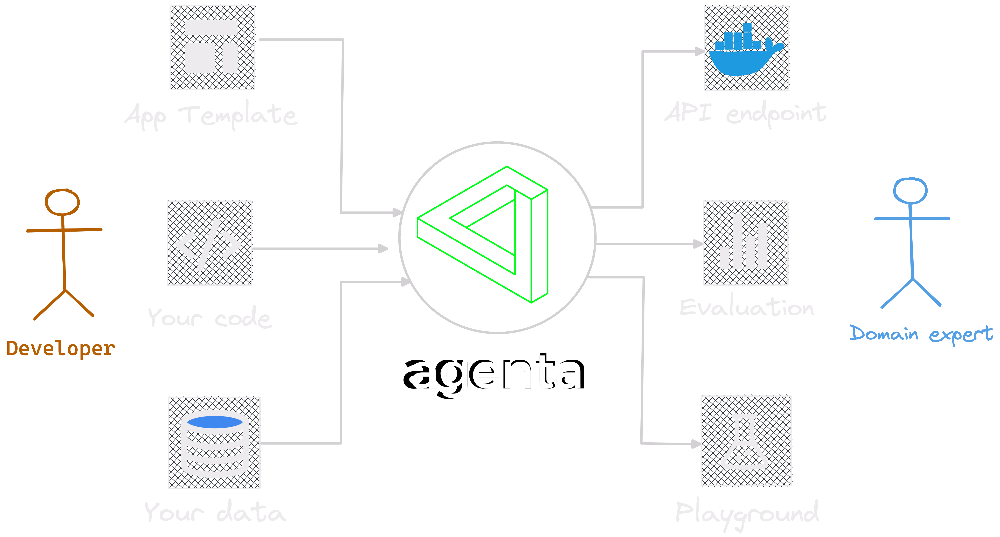

Agenta is an open-source end-to-end platform for productionizing complex Large Language Model applications (LLM apps). With agenta, you can:

1. Quickly **experiment** and version prompts, parameters and complex strategies (in-context learning with embeddings, agents, custom business logic...) 
2. **Collaborate with domain experts** for prompt engineering and evaluation
3. Systematically **evaluate your LLM apps**
4. **Deploy** your application in one-click

Agenta does not impose any restrictions on your choice of framework, library, or model. It's compatible with **langchain**, **llama_index**, the **Openai SDK**, and more. You can use open-source models like **Llama2** or any other model you have access to, such as **Cohere**, **OpenAI**, **Google Bart**, and more.

## Overview of agenta 

## Why use agenta?

- If you need to **collaborate with domain experts** and want their feedback on your LLM apps, as well as their help experimenting with prompts and parameters without having to modify your code.
- If you want the flexibility of **using code for writing LLM app**, without being restricted by libraries, models, or frameworks.
- If you need to **save, version, and compare** different variants of your LLM apps **on your own data**.
- If you need a systematic way to **programmatically evaluate your LLM apps**.
- If you **care about your data privacy** and do not want to be proxied through third-party services.

## Features

- **Parameter Playground:** Define your app's parameters within your code and experiment with them through a user-friendly web platform.
- **Test Sets:** Build test sets using the UI, by uploading CSVs, or by connecting to your own data via our API.
- **Evaluation:** Evaluate your app on your test sets using different strategies (e.g., exact match, AI Critic, human evaluation, etc.).
- **Deployment:** Deploy your app as an API in just one click.
- **Collaboration:** Share your app with collaborators and receive feedback on it.

<CardGroup cols={2}>
  <Card
    title="Installation"
    icon="screwdriver-wrench"
    href="installation"
  >
    Install Agenta on your local machine to get started.
  </Card>
  <Card
    title="Getting Started"
    icon="stars"
    href="getting-started"
  >
    5 minutes to get started with Agenta.
  </Card>
</CardGroup>
