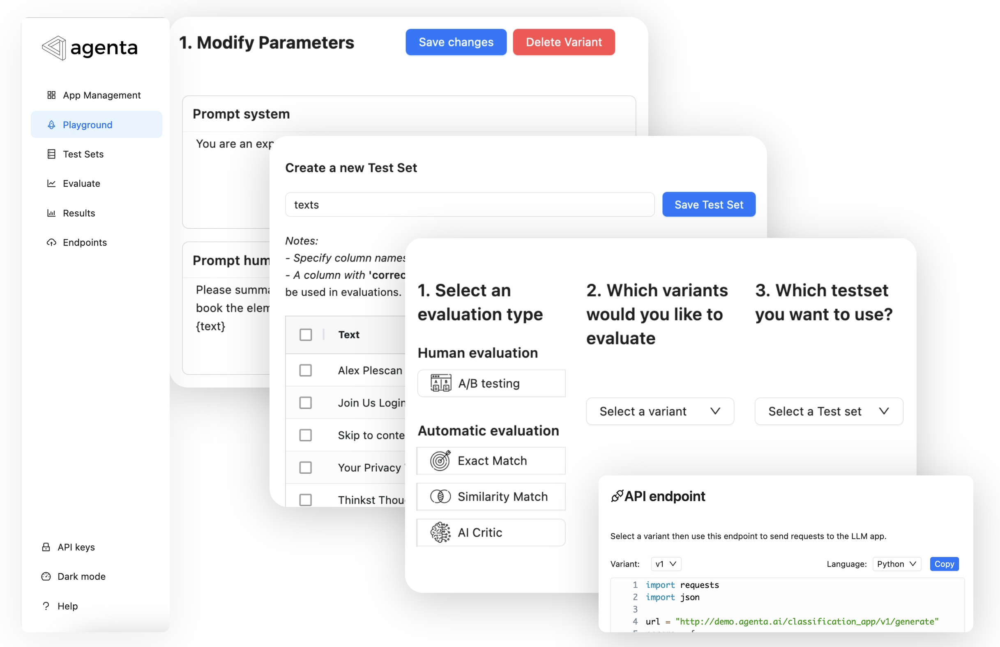
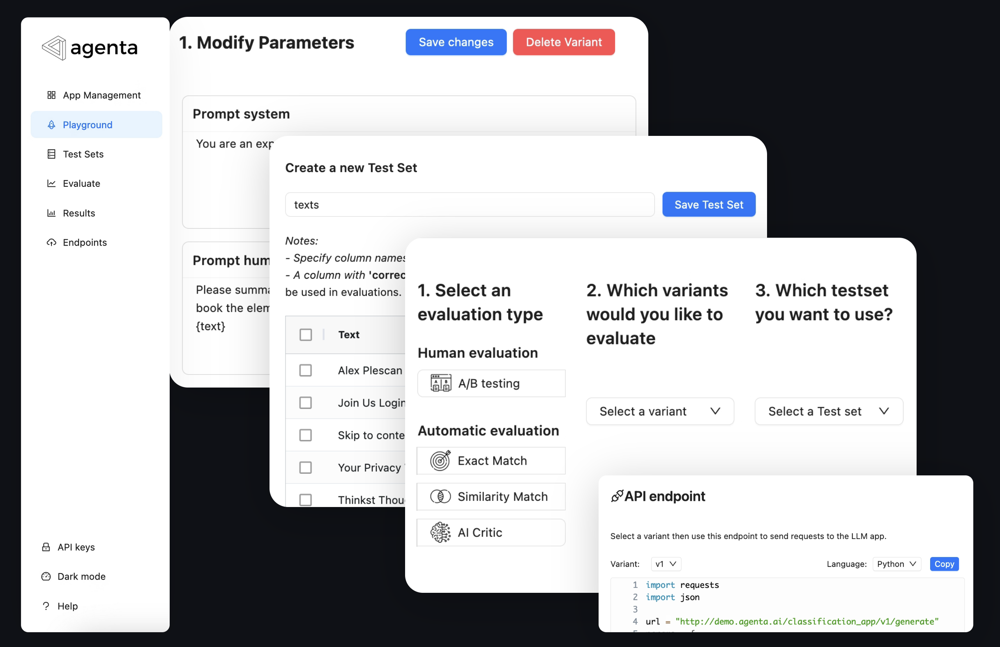
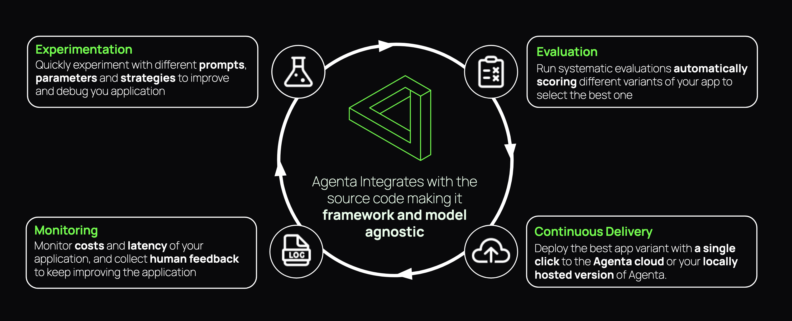
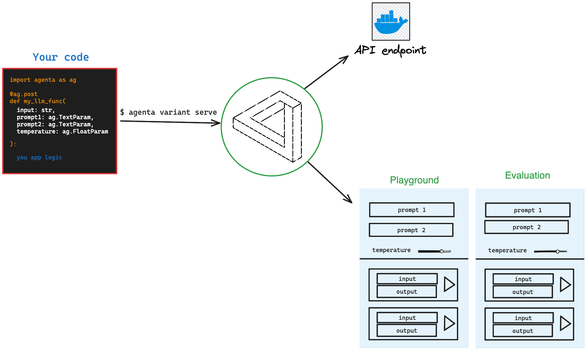

Agenta is an open-source end-to-end platform for productionizing (complex) LLM apps. Agenta enables you to:

1. Quickly **experiment** and version prompts, parameters and complex strategies (in-context learning with embeddings, agents, custom business logic...) 
2. **Collaborate with domain experts** for prompt engineering and evaluation
3. Systematically **evaluate your LLM apps**
4. **Deploy** your application in one-click

And all of this without imposing any restrictions on your choice of framework, library, or model. It works with **langchain**, **llama_index**, the openai SDK, and any other library you can think of. You can use open-source models (**Llama2**) or any other model you have access to (cohere, openai, Bart...).

## Why use agenta?
- You need to **collaborate with domain experts** and want to get their feedback about your LLM apps and even their help experimenting with prompts and parameters (without needing to touch your code).
- Your want the flexibilty of **using code for writing your LLM app**, and don't want to be restricted by library, model or framework. 
- You need to save, version and compare different variants of your LLM apps in **your own data**.
- You need a systematic way to evaluate your LLM apps **programmatically**.
- You want your data to be private and not be proxied through third-party services.

## Features
- **Parameter Playground:** Define the parameters of your app in your code and experiment with them via a user-friendly web platform.
- **Test sets**: Build test sets from the UI, by uploading CSVs, or connect to your own data using our API.
- **Evaluation:** Evaluate your app on your test sets using different strategies (e.g. exact match, AI Critic, human evaluation, etc.)
- **Deployment:** Deploy your app as an API in one-click.
- **Collaboration:** Share your app with collaborators and get their feedback on your app.

## Agenta high-level 

## How Agenta works:

Agenta translates your code into a playground where you and your collaborator can experiment with different parameters and workflows

It also takes care of deploying your app as an API.

It provides with the tools to build you test sets and evaluate your app all in one place.

## How to use Agenta:

2. With two lines of code, specify the parameters for your experiment.
3. Deploy your app using the Agenta CLI.
4. You or your team can iterate, version parameters, test different versions, and run systematic evaluations via a user-friendly web platform.

<CardGroup cols={2}>
  <Card
    title="Installation"
    icon="screwdriver-wrench"
    href="installation"
  >
    Install Agenta on your local machine to get started.
  </Card>
  <Card
    title="Getting Started"
    icon="stars"
    href="getting-started"
  >
    5 minutes to get started with Agenta.
  </Card>
</CardGroup>
